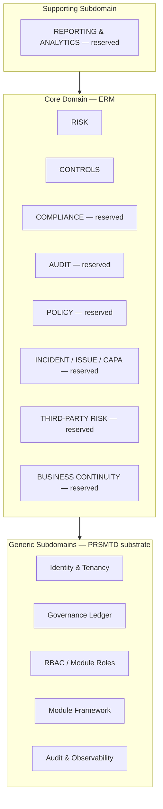
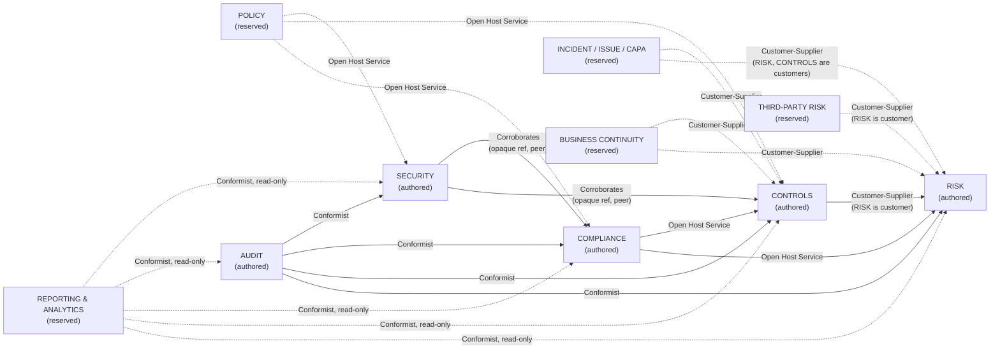

# 04.01 — Enterprise Domain Model

## Purpose

Defines the canonical, cross-cutting business architecture for the ERM platform: the
bounded context map, the shared ubiquitous language, the aggregate/entity/value-object
shape of each context, and the integration rules between contexts. This is the third
authoritative specification in this repository. It does not redesign
[`10-risk/01-enterprise-risk-management.md`](../10-risk/01-enterprise-risk-management.md)
(`RISK`) or [`12-controls/01-controls-management.md`](../12-controls/01-controls-management.md)
(`CONTROLS`) — both are treated as authoritative and unmodified inputs. Instead, it absorbs
their inline bounded-context definitions into one cross-context map (retiring the
"interim measure" status both specs flagged for their own Domain Model sections) and
extends the map with reserved boundaries for every future ERM capability named in
`CLAUDE.md`'s long-term vision, so later module specs (Compliance, Audit, Policy,
Incident/Issue/CAPA, Third-Party Risk, Business Continuity, Regulatory Management,
Reporting) can be authored against a settled map instead of each inventing its own context
boundary and vocabulary in isolation, the way `RISK` and `CONTROLS` each had to.

## Scope

**In scope**:
- The full bounded context map for the ERM domain: existing contexts (`RISK`, `CONTROLS`)
  and reserved future contexts, with DDD relationship types (customer-supplier, conformist,
  shared kernel, open host service, anti-corruption layer) between every pair that has a
  defined integration point today.
- A single canonical business glossary superseding the two per-spec "authoritative within
  this context until `04-domain-model/` is authored" glossaries in `10-risk` and `12-controls`.
- The shared kernel of cross-context modeling patterns (taxonomy shape, governed lifecycle
  shape, code-sequence shape, opaque-reference shape) that every future context should reuse
  rather than reinvent, in service of minimizing future Liquibase schema surprises.
- Classification of PRSMTD's own contexts (Identity, Governance, RBAC, Module Framework,
  Audit/Observability) as generic subdomains the ERM domain consumes, and of `CONTACTS` /
  `module-template` as non-domain reference material.
- Ownership responsibilities (which business function stewards which context) and
  dependency rules (which contexts may declare a PRSMTD `dependencies:` edge on which others,
  and why).
- The unresolved `system.md §18` Product Framework question, reframed in domain-model terms
  now that its consequences for context boundaries can be stated precisely.

**Out of scope**:
- Redesigning any entity, table, workflow, or API already specified in `10-risk` or
  `12-controls` — this document cross-references them, it does not restate their schemas.
- Full aggregate/entity/data-model specification of any future context (Compliance, Audit,
  Policy, Incident, CAPA, Third-Party Risk, BCP, Regulatory, Reporting) — each remains a
  **reserved boundary** here (context name, relationship type, anticipated entities at
  headline level, the existing opaque link points it will activate) until its own
  `05-modules/` and section-specific spec is authored, exactly as `12-controls` was a reserved
  boundary inside `10-risk` until this session.
- Liquibase changesets, DDL, or any other implementation artifact — this repository is
  specification-only (`CLAUDE.md`).
- Resolving the `system.md §18` Product Framework reconciliation — flagged with enough
  precision to be ADR-ready, not decided here (see [Assumptions](#assumptions) and
  [Future Enhancements](#future-enhancements)).

## Business Context

`10-risk` and `12-controls` each authored their own "Domain Model" section, explicitly
labeled authoritative only *until* this document existed, because at the time each was
written it was the first or second bounded context in the repository and there was nothing
yet to map it against. Both specs' own roadmap notes deferred the cross-context map until
"at least two modules exist... so the bounded context map reflects real cross-context
relationships rather than a single context in isolation" — a condition `docs/roadmap.md`
confirmed was met at the start of this session.

Beyond housekeeping, the map matters commercially: `CLAUDE.md`'s long-term vision lists
eleven more capabilities after Risk and Controls. Every one of them will want to reference a
Risk, reference a Control, or supply a new source of either — Compliance obligations
generate risks and require controls, Audit findings generate risks and consume control test
evidence, Incidents generate risks, CAPA remediates control exceptions, Third-Party Risk is a
specialized risk source, Business Continuity is both a risk source and a control family,
Reporting reads across all of them. Without a canonical map fixing the vocabulary and the
integration pattern *once*, each future spec would re-derive its own version of "how do I
reference a Risk without owning it," the same problem `12-controls` solved for itself this
session by mirroring `10-risk`'s already-established opaque-reference convention. This
document promotes that convention from "the pattern the second module happened to copy" to
"the pattern every module is expected to follow," which is the direct mechanism by which a
first-time-complete database design and a minimized rate of future Liquibase schema change
(this session's explicit objective) are achieved: contexts that share a modeling pattern
share a table *shape*, so a new context's first schema draft is very unlikely to need a
structural do-over once real cross-context queries start being written against it.

## Assumptions

1. **`RISK` and `CONTROLS` are frozen inputs.** Every fact in this document about those two
   contexts (aggregates, entities, states, integration points) is copied or paraphrased from
   the two existing specs, never invented fresh. Where this document needs to say something
   about them that isn't already in those specs, it is stated as a **domain-model-level
   naming/classification decision** (e.g., "this relationship is a Customer-Supplier
   relationship" is DDD vocabulary applied after the fact, not a change to what either spec
   already built).
2. **Future contexts are reserved, not specified.** Compliance, Audit, Policy, Incident,
   CAPA, Third-Party Risk, Business Continuity, Regulatory Management, and Reporting each get
   a context-map entry (name, relationship type, anticipated entities, activation points) but
   not an aggregate/data-model spec. Per `CLAUDE.md`'s "no placeholders" rule, this is not a
   placeholder: the boundary and relationship *are* the complete deliverable this document
   owes them, in the same way `10-risk`'s single-row "Out of scope" reference to `12-controls`
   was a complete (if minimal) statement of a boundary before `12-controls` existed.
3. **KRI is not a bounded context.** It is an aggregate root owned by `RISK`
   (`module_risk_kri`, `module_risk_kri_measurement`) per `10-risk`'s existing Domain Model
   section. It appears in `CLAUDE.md`'s capability list as if it might be a future module;
   this document resolves that ambiguity in favor of the schema that already exists — see
   [Bounded Context Map](#bounded-context-map). No future module named `KRI` should be
   authored.
4. **Regulatory Management is not a separate bounded context from Compliance.**
   `docs/11-compliance/README.md` scopes "Compliance Management **and** Regulatory
   Management" as one section ("regulatory obligation register," "regulatory change
   management workflow" both listed under one README). `docs/05-modules/README.md` lists
   "Regulatory" as a distinct example module name in its illustrative list. This document
   treats that as **imprecision in the illustrative list, not a decision**, and models one
   `COMPLIANCE` bounded context covering both regulatory obligation tracking and compliance
   status — consistent with the section README, which is the more specific source. Flagged
   in [Future Enhancements](#future-enhancements) for explicit confirmation when
   `11-compliance` is authored, not silently decided.
5. **Reporting and Analytics is a supporting subdomain, not a core one**, with no aggregate
   roots of its own beyond report/dashboard *definitions* — it is a read-model composition
   layer over every core-domain context, not a new source of business facts. See
   [Strategic Classification](#strategic-classification).
6. **The `system.md §18` Product Framework question remains unresolved by design.** §18
   designates `module.code = ERM`, `productClass: PRODUCT_FRAMEWORK`, `productDomain:
   ENTERPRISE_RISK` as the first constitutional Product Framework, with V1 scope "AMC
   Operational Risk — risk register, KRI monitoring, exception governance, and
   inspection-aligned evidence packs" (system.md §18.10) — a scope description that maps
   almost exactly onto `RISK`'s existing register/KRI/escalation surface plus a slice of
   `CONTROLS`' exception/evidence surface. `12-controls` Assumption 6 discovered this and
   deferred it under the explicit instruction to integrate without redesigning. This
   document inherits that deferral (this session's instructions repeat the same constraint)
   but is more precise about *why* it matters at the domain-model layer: if `RISK` and
   `CONTROLS` are ever re-hosted as facets of one `ERM` Product Framework manifest (§18.6),
   their *bounded context boundary does not change* — Risk Management and Controls Management
   remain two distinct ubiquitous languages and two distinct aggregate sets under DDD's own
   definition of a bounded context — only their **PRSMTD packaging** (one manifest vs. two)
   would change. This document therefore keeps the DDD context boundary and the PRSMTD
   module boundary explicitly distinct concepts (see
   [PRSMTD Module Boundaries vs. DDD Bounded Contexts](#prsmtd-module-boundaries-vs-ddd-bounded-contexts)),
   so that whichever way the §18 ADR eventually resolves, this document does not need to be
   rewritten.
7. **This document is authoritative for ubiquitous language going forward.** Per `10-risk`
   and `12-controls`'s own text, their inline glossaries were authoritative only until this
   document existed. From this point forward, the [Canonical Business Glossary](#canonical-business-glossary)
   below is the single source; the two module specs are not edited to remove their inline
   copies (avoiding churn on frozen, implementation-ready documents) but any future
   discrepancy is resolved in favor of this document.
8. **No new PRSMTD capability is required to express this map.** Every mechanism referenced
   here (module framework, OWN-08/OWN-09, governance ledger, RLS) is already reused by `RISK`
   and `CONTROLS`; this document does not introduce a new integration mechanism, it names and
   generalizes the ones those two specs already used.

## Dependencies

- [`10-risk/01-enterprise-risk-management.md`](../10-risk/01-enterprise-risk-management.md) —
  frozen input; source of the `RISK` context's aggregates, entities, and reserved
  integration points.
- [`12-controls/01-controls-management.md`](../12-controls/01-controls-management.md) —
  frozen input; source of the `CONTROLS` context's aggregates, entities, integration points,
  and the activation of `RISK`'s `RiskTreatmentPlan → Control` reference.
- `PRSMTD/docs/authoritative/system.md` §3 (Governance model, GOV-07), §7 (Data model & RLS),
  §8 (RBAC model), §9 + §5a–§5c (Module framework, OWN-03/04/07/08/09), §10 (Audit and
  compliance), §18 (Product Framework Doctrine — reviewed in full for this document, not just
  the sections `10-risk`/`12-controls` cited), §21 (Authentication Surface Ownership) — all
  reused as-is; this document changes none of them.
- `PRSMTD/modules/contacts/module.yaml` and `PRSMTD/modules/module-template/module.yaml` —
  read to confirm PRSMTD ships no business-domain bounded context of its own today (see
  [PRSMTD Substrate Contexts](#prsmtd-substrate-contexts-generic-subdomains)).
- `docs/22-traceability/01-master-traceability-matrix.md` — updated by this session to add
  this document's traceability entry and the two gaps it re-surfaces at domain-model
  precision (Compliance/Regulatory boundary ambiguity; §18 reconciliation).
- `docs/roadmap.md` — recorded this document as the recommended next milestone; updated by
  this session with progress and the next recommended milestone.
- `docs/11-compliance/`, `docs/13-audit/`, and the other future-context READMEs under
  `docs/05-modules/`, `docs/07-workflows/`, `docs/09-security/` — read to ground each reserved
  boundary's scope description in what those sections already commit to, without expanding
  their scope beyond what their own README states.

## Architecture

### PRSMTD substrate contexts (generic subdomains)

In DDD strategic terms, the following PRSMTD mechanisms are **generic subdomains**: necessary
for the ERM domain to function, undifferentiated as a business capability, and reused
wholesale rather than modeled as ERM bounded contexts:

| PRSMTD mechanism | system.md § | Role for every ERM context |
|---|---|---|
| Identity & tenancy (`identity_binding`, `TenantAwareDataSource`, RLS) | §7, §21 | Every ERM aggregate's `tenant_id` scoping and every `*_user_id` reference resolves through this substrate, never re-modeled per context. |
| Governance ledger (`pending_action`, GOV-07) | §3, §7 | Every governed state transition in every ERM context (current and future) is a `pending_action` row; no context invents its own approval table. |
| RBAC / module role model (MAKER/CHECKER/VIEWER) | §8 | Every ERM context's permissions and roles are declared in its own module manifest against this closed role-type set; no context invents a fourth role type. |
| Module framework (manifest, OWN-03/04/07/08/09, catalog registrar) | §9, §5a–§5c | Every ERM context is registered, discovered, enabled, and boundary-enforced through this mechanism; see [Dependency Rules](#dependency-rules). |
| Audit & observability (`audit_log`, trace contract T1–T7) | §10, §4.1 | Every ERM context's audit trail is this substrate; no context ships its own audit table at MVP (see note on PF-CT-3 below for where this could change). |
| Authentication (JWT, issuer/audience invariants) | §21 | Reused unmodified; no ERM context introduces a new authentication surface. |

`CONTACTS` (`modules/contacts/`) and `module-template` (`modules/module-template/`) are
PRSMTD's own **reference implementation and scaffolding template** for the generic module
framework — read to confirm the manifest shape (`module.yaml` fields, `roleTypes`
derivation, `routes`, `tables`) both `RISK` and `CONTROLS` already conform to. Neither is an
ERM bounded context or a business domain concept; they contribute no vocabulary, aggregates,
or entities to this document.

### Strategic classification

| Subdomain type | Contexts | Rationale |
|---|---|---|
| **Core domain** | `RISK`, `CONTROLS`, `COMPLIANCE`, `AUDIT`, `SECURITY` (all authored), and every remaining reserved context except Reporting (Policy, Incident/Issue/CAPA, Third-Party Risk, Business Continuity) | These are the differentiated business capability this repository exists to specify — the reason an AMC (and later other regulated enterprises) would adopt this platform over a generic workflow tool. `SECURITY` was added additively (Session 7) — see [SECURITY (authored)](#security-authored) and Amendment Log. |
| **Supporting subdomain** | `REPORTING` (reserved) | Necessary and specific to the GRC domain's presentation needs, but it does not originate business facts — it composes read models over the core-domain contexts. See its [context-map entry](#reporting-reserved). |
| **Generic subdomain** | PRSMTD substrate (table above) | Reused wholesale; no ERM-specific modeling investment beyond what `RISK`/`CONTROLS`/`COMPLIANCE`/`AUDIT`/`SECURITY` already do (reference by UUID, no re-modeling of identity/governance/audit). |

### PRSMTD module boundaries vs. DDD bounded contexts

This document keeps two concepts explicitly distinct, because the `system.md §18` question
(Assumption 6) is a question about the second concept, not the first:

- **A DDD bounded context** is a boundary of *ubiquitous language and model consistency* — the
  scope inside which "Risk," "Control," "Owner," or "Status" mean one specific thing. Context
  boundaries in this document (`RISK`, `CONTROLS`, and the reserved future ones) are defined
  by where the *vocabulary and aggregate ownership* changes, and do not depend on how many
  PRSMTD module manifests happen to package them.
- **A PRSMTD module** (`system.md §9`) or **Product Framework** (`system.md §18`) is a
  *deployment and governance packaging* boundary — one manifest, one schema-prefix, one set
  of declared roles/permissions/dependencies. Today, `RISK` and `CONTROLS` each map
  one-to-one to a bounded context and a module. If a future ADR re-hosts them as two facets of
  one `ERM` Product Framework manifest (per §18.6/§18.8's replication and manifest doctrine),
  that changes the **module** packaging (one manifest, one schema-prefix family, one audit
  chain) without changing the **bounded context** boundary this document defines — Risk
  Management and Controls Management would remain two aggregates, two ubiquitous languages,
  and two customer-supplier halves of the relationship described below. Every future context
  in this map should assume a 1:1 context-to-module mapping *unless and until* such an ADR
  says otherwise, exactly as `RISK` and `CONTROLS` do today.

## Functional Specification

### Canonical Business Glossary

Supersedes the "authoritative until `04-domain-model/`" glossaries in `10-risk` and
`12-controls` (Assumption 7). Terms already defined identically in both source specs are
merged; terms new at this cross-context layer are added.

| Term | Definition | Owning context |
|---|---|---|
| Risk | A register entry representing an identified source of uncertainty to the AMC's objectives, with an owner, a category, and a current inherent/residual score. | `RISK` |
| Inherent Risk / Residual Risk | Risk level before / after treatment and controls are considered. | `RISK` |
| Risk Assessment | A point-in-time scoring event against a Risk, governed by maker-checker approval. | `RISK` |
| Risk Appetite | Board-approved maximum acceptable residual risk score per category; the escalation trigger. | `RISK` |
| Risk Treatment | A planned response to a Risk: Accept, Mitigate, Transfer, or Avoid. | `RISK` |
| Risk Acceptance | A formal, governed record that a Risk's residual level is knowingly accepted, with a mandatory re-review date. | `RISK` |
| KRI (Key Risk Indicator) | A measurable, tracked-over-time early-warning metric for a Risk or Risk Category. Not a bounded context — owned entirely by `RISK` (Assumption 3). | `RISK` |
| Escalation | A governed notification raised when a Risk or KRI breaches its threshold. | `RISK` |
| Control | A designed, owned, testable measure — policy, procedure, or automated mechanism — that prevents, detects, or corrects an undesired event affecting one or more risks or obligations. | `CONTROLS` |
| Control Family | Configurable taxonomy grouping a Control is classified under. | `CONTROLS` |
| Control Nature | `PREVENTIVE` / `DETECTIVE` / `CORRECTIVE` classification of a Control. | `CONTROLS` |
| Execution Type | `MANUAL` / `AUTOMATED` / `IT_DEPENDENT_MANUAL` classification of how a Control is performed. | `CONTROLS` |
| Design Effectiveness / Operating Effectiveness | Whether a Control as designed would work, vs. whether it actually operated as designed — each set from its own `ControlTest` type. | `CONTROLS` |
| Control Test | A point-in-time evaluation of a Control's design or operating effectiveness, governed by maker-checker approval. | `CONTROLS` |
| Control Exception | A documented instance where a Control failed a test, was overridden, or could not operate as designed. | `CONTROLS` |
| Evidence | A metadata record (integrity hash + opaque storage pointer) supporting a Control, Control Test, or Control Exception. Term is `CONTROLS`-specific today; see [Evidence as a Cross-Cutting Concept](#evidence-as-a-cross-cutting-concept) for why it is expected to generalize. | `CONTROLS` |
| Obligation | A specific regulatory or contractual requirement an AMC must satisfy, tracked to the control(s) and/or policy that satisfy it. | `COMPLIANCE` |
| Finding | An audit-identified gap or non-conformance, distinct from a Control Exception (raised by the control's own owner) in that a Finding is raised by an independent Audit engagement. Distinct also from a Security Finding (typically detected by a technical control or scan, not an independent audit). | `AUDIT` |
| Policy | *(reserved)* A published, versioned governance document that a Control's design or an Obligation's satisfaction may cite as its authoritative basis. | `POLICY` (reserved) |
| Incident | *(reserved)* A realized adverse event, distinct from a Risk (a *potential* uncertainty) and from a Control Exception (a *control's* failure specifically) — an Incident may be caused by a realized Risk, a Control failure, or neither. | `INCIDENT` (reserved) |
| CAPA (Corrective and Preventive Action) | *(reserved)* A structured remediation record, superseding the free-text remediation fields `RISK` and `CONTROLS` each carry today as an interim measure. | `INCIDENT`/`CAPA` (reserved) |
| Vendor / Third Party | *(reserved)* An external counterparty whose own risk profile is tracked as a specialized Risk source. | `THIRD-PARTY RISK` (reserved) |
| Continuity Plan | *(reserved)* A documented, tested plan for maintaining or resuming critical operations after a disruption — the entity the SEBI circular's DR/BCP mandate (flagged as a gap in `10-risk`) ultimately requires. | `BUSINESS CONTINUITY` (reserved) |
| Security Policy Domain | A named category of security governance concern (e.g., Access Control, Cryptography, Vulnerability Management) that a future Policy, an existing Obligation, or an existing Control may tag against by convention — a taxonomy, not a policy document itself. | `SECURITY` |
| Security Baseline | A named, versioned hardening/configuration standard a tenant adopts; tested via a `CONTROLS` Control Test on a Control tagged to it, not a parallel testing entity. | `SECURITY` |
| Security Finding | A detected vulnerability, misconfiguration, policy violation, or access anomaly — raised immediately (often by an automated scanner), tracked to a governed closure or formal risk-acceptance disposition. Distinct from a Control Exception and from an (Audit) Finding — see Finding's own definition above. | `SECURITY` |
| Security Asset | A governed inventory record for a secret, API key, encryption key, TLS certificate, signing certificate, or SSH key — ownership, rotation cadence, and expiry tracking only, never the credential material itself. | `SECURITY` |
| Security Access Grant | A time-bound, governed record of elevated/privileged access granted to an individual, distinct from a standing module-role assignment. | `SECURITY` |

**A term means one thing repository-wide.** If a future spec needs a word already defined
above with a different meaning, that is an anti-corruption-layer signal (the new context has
a distinct concept that merely sounds similar) — the future spec must give it a different
name, not redefine the term.

### Bounded Context Map

Solid edge = activated integration (both endpoints authored). Dashed edges = reserved —
direction and relationship type are fixed now so a future spec inherits the shape rather than
choosing one ad hoc, but the supplying context does not exist yet. **`COMPLIANCE` and `AUDIT`
are corrected from "(reserved)" to "(authored)" and their edges from dashed to solid in this
session (Session 7)** — both were authored in Sessions 4–5 but this diagram was never revisited
to reflect that, a staleness this session's consistency review caught and fixed (see Amendment
Log); no relationship type or direction changed, only the status label and line style.
**`SECURITY` is added as a tenth, authored context in this session**, per
[SECURITY (authored)](#security-authored) below.

#### RISK (authored)

Owns the Risk register and its full lifecycle exclusively. Full definition:
[`10-risk/01-enterprise-risk-management.md`](../10-risk/01-enterprise-risk-management.md)
Domain Model section. Aggregate roots: `Risk`, `KRI`. Entities: `RiskAssessment`,
`RiskTreatmentPlan`, `RiskAcceptance`, `Escalation`, `KRIMeasurement`. Reference data:
`RiskCategory`, `RiskScoringMatrix`, `RiskAppetite`.

#### CONTROLS (authored)

Owns the Control library and its full lifecycle exclusively. Full definition:
[`12-controls/01-controls-management.md`](../12-controls/01-controls-management.md) Domain
Model section. Aggregate root: `Control`. Entities: `ControlTest`, `ControlException`,
`ControlEvidence`, `ControlRiskLink`, `ControlObligationLink`. Reference data:
`ControlFamily`.

**Relationship — Customer-Supplier, `RISK` is the customer.** `CONTROLS` is a pure
provider (`dependencies: []`); `RISK` is the module whose manifest gains
`dependencies: [CONTROLS]` once implementation wires the reference (both specs already state
this). In DDD terms this is a textbook Customer-Supplier relationship: the downstream
customer (`RISK`) has a treatment plan that needs a control to exist and be resolvable, and
the upstream supplier (`CONTROLS`) exposes a stable, deliberately minimal reference-resolution
API (`GET /controls/{id}/reference`) rather than letting the customer reach into its internal
model — the anti-corruption boundary is the opaque `control_ref_id` plus that DTO, not a
shared table.

#### COMPLIANCE (authored)

Owns the regulatory obligation register and its full lifecycle exclusively. Full definition:
[`11-compliance/01-compliance-management.md`](../11-compliance/01-compliance-management.md)
Domain Model section. Aggregate roots: `Obligation`, `RegulatoryChange`. Entities:
`ComplianceAssessment`, `ComplianceException`, `ComplianceAttestation`,
`ComplianceCalendarEntry`, `ComplianceEvidence`, `ObligationControlLink`,
`ObligationPolicyLink`, `RegulatoryChangeObligationLink`. Reference data:
`RegulatoryFramework`, `RegulatoryProfile`, `ObligationCategory`.

**Relationship — Open Host Service to both `RISK` and `CONTROLS`.** Confirmed, not redesigned,
by `11-compliance` (its own Assumption 4): an Obligation is a fact both other contexts consume
without owning. **Activated**: `10-risk`'s `Risk.source` enum gained an additive
`COMPLIANCE_OBLIGATION` value (Session 6) and `12-controls` gained an additive
`POST /controls/{id}/obligation-links` endpoint (Session 6) — the gap this document originally
flagged here (`Risk.source` had no Compliance-sourced value) is closed; see each target
document's own Amendment log.

#### AUDIT (authored)

Owns the audit universe, audit plans, engagements, working papers, and Findings exclusively.
Full definition: [`13-audit/01-audit-management.md`](../13-audit/01-audit-management.md)
Domain Model section. Aggregate roots: `AuditPlan`, `AuditEngagement`. Entities:
`AuditPlanEntry`, `WorkingPaper`, `Finding`, `FollowUpAction`, `AuditEvidence`. Reference-ish
register (flat, not a taxonomy): `AuditUniverseEntry`.

**Relationship — Conformist toward `RISK`, `CONTROLS`, `COMPLIANCE`, and (Session 7) `SECURITY`.**
Confirmed, not redesigned, by `13-audit`: Audit is downstream of all four and does not get to
renegotiate their models. It consumes `RISK`'s `Risk.source = AUDIT_FINDING` value (already
live at `13-audit`'s authoring time, no change required), `CONTROLS`' `ControlTest`/
`ControlEvidence` records and `COMPLIANCE`'s `ComplianceEvidence`/`ComplianceAssessment`
records as evidentiary substrate via each module's reference-resolution API, and — activated
Session 7 — `SECURITY`'s `SecurityFinding`/`SecurityEvidence` records the same way (see
`13-audit`'s own "Integration with Security" section). Audit does not get its own parallel
evidence model — it conforms to the evidence shape `CONTROLS` first defined, extending it with
one genuinely new source (a citation into PRSMTD's own observability trace contract), the
resolution `13-audit` gives the deferred
[Evidence as a Cross-Cutting Concept](#evidence-as-a-cross-cutting-concept) question below.
`AUDIT` is the first module whose own manifest declares its cross-context dependencies
(`dependencies: [RISK, CONTROLS, COMPLIANCE, SECURITY]`) at authoring/amendment time rather
than a downstream consumer's manifest gaining the edge later.

#### SECURITY (authored)

Added as a tenth bounded context in this session (Session 7), closing the gap
`09-security/01-security-management.md` Assumption 1 discovered and proposed (not applied) when
it was authored: this document's Bounded Context Map did not reserve a `SECURITY` context
despite `CLAUDE.md`'s long-term vision naming Cybersecurity Governance as its own GRC
capability. This is an additive amendment — no existing row, relationship, or entity above is
changed by adding it.

Owns the security policy domain taxonomy, security baseline register, privileged access
grants, the secrets/key/certificate governance register, and security findings exclusively.
Full definition:
[`09-security/01-security-management.md`](../09-security/01-security-management.md) Domain
Model section. Aggregate roots: `SecurityFinding`, `SecurityAsset`, `SecurityAccessGrant`.
Entities: `SecurityEvidence`. Reference data: `SecurityPolicyDomain`, `SecurityBaseline`.

**Relationship — peer to `CONTROLS` and `COMPLIANCE` (a Finding may corroborate a Control
Exception or a Compliance Exception without owning either); Conformist supplier toward
`AUDIT`** (Audit consumes Security Findings/Evidence as evidentiary substrate, the same
relationship shape `CONTROLS` and `COMPLIANCE` each already have toward `AUDIT`). Unlike every
other context in this map, `SECURITY` was authored directly against `09-security/README.md`'s
original cross-cutting AuthN/Z/threat-model scope rather than against a boundary this document
had already reserved — a narrow gap in this document's own original strategic classification,
not an inconsistency in anything it built (see Amendment Log). A `CRITICAL` `SecurityFinding`
is a candidate `Risk` source (`Risk.source = SECURITY_FINDING`, activated Session 7 — see
`10-risk`'s own Amendment log) — the same Customer-Supplier shape every other Risk-sourcing
context in this map uses, without `SECURITY` itself becoming a customer of `RISK`.

#### POLICY (reserved)

Not yet given its own top-level `docs/` section README beyond being named in `CLAUDE.md`'s
long-term vision and `05-modules/README.md`'s illustrative module list; scoped here only at
the boundary this document owes it.

**Relationship — Open Host Service to `CONTROLS` and `COMPLIANCE`.** A Policy is the
documented, versioned basis a Control's design or an Obligation's satisfaction cites. Neither
`CONTROLS` nor `COMPLIANCE` owns policy content; both reference it by opaque identifier, the
same pattern `CONTROLS` uses today for its own not-yet-existing obligation link.

**Anticipated entities**: Policy (aggregate root, versioned, governed publication lifecycle),
PolicyCategory (reference data, same taxonomy shape).

#### INCIDENT / ISSUE / CAPA (reserved)

**Scope**: no PRSMTD module or ERM section exists for this yet (confirmed absent in both
`10-risk` and `12-controls`, which each independently flagged the same gap for their own
remediation-tracking needs). Named as one reserved context because Incident, Issue, and CAPA
are tightly coupled in every GRC platform's own domain language (an Incident is investigated
into one or more Issues, an Issue is remediated by one or more CAPAs) and splitting them into
three contexts now, before any of the three has a real spec, would be premature decomposition.

**Relationship — Customer-Supplier, `RISK` and `CONTROLS` are customers.** This context is
upstream: it supplies risk sources (`Risk.source = INCIDENT`, already reserved) and, once it
exists, a structured CAPA record that both `10-risk`'s treatment-plan remediation free-text
and `12-controls`' `ControlException.remediation_plan`/`remediation_owner_user_id`/
`target_closure_date` free-text fields are expected to migrate toward referencing (both specs
flagged this as their own Future Extension Point, phrased almost identically —
"CAPA-style structured remediation... deferred to a future CAPA module").

**Anticipated entities**: Incident (aggregate root), Issue, CAPA (a governed remediation
record with its own maker-checker closure, mirroring `ControlException`'s closure shape).

#### THIRD-PARTY RISK (reserved)

**Relationship — Customer-Supplier, `RISK` is the customer.** A vendor's risk profile is
modeled as a specialization of `RISK`'s existing register (a `RiskCategory` value plus
vendor-specific context), not a duplicate risk register. What this context adds *beyond*
`RISK`'s existing shape is vendor lifecycle data `RISK` has no reason to own: Vendor,
Contract, and Due-Diligence Assessment entities. This context is therefore a supplier of risk
sources to `RISK` (same integration shape as Incident) plus the owner of a genuinely new
entity set `RISK` does not anticipate today.

**Anticipated entities**: Vendor (aggregate root), VendorContract, VendorDueDiligenceAssessment,
VendorRiskCategory (specializing `RISK`'s existing category taxonomy, not replacing it).

#### BUSINESS CONTINUITY (reserved)

Directly answers the gap `10-risk`'s Regulatory Drivers table flagged and explicitly
deferred: "Disaster Recovery / Business Contingency Plan... belongs to `18-deployment`
(platform-level DR/BCP) and a future Business Continuity capability."

**Relationship — Customer-Supplier toward both `RISK` (continuity risk is a Risk source) and
`CONTROLS` (BCP/DR testing is already a seeded `CONTROLS` family — "Business Continuity &
Disaster Recovery" under the `SEBI_AMC` control taxonomy, per `12-controls`' Control Taxonomy
table).** This context does not duplicate that seeded family; it is the aggregate-owning
context for the Continuity Plan itself, while `CONTROLS` continues to own the *testing
control* that verifies the plan works. The relationship is Customer-Supplier in the same
direction as Third-Party Risk and Incident (the new context supplies; `RISK`/`CONTROLS` are
customers) plus an explicit note that this context and `CONTROLS`' existing seed taxonomy
must not be allowed to drift into two competing models of "what a DR test is" — a future
`13-audit`-style ADR should confirm which context owns the *test record* (this document's
recommendation, not a decision: `CONTROLS` keeps owning the test, since `ControlTest` already
generalizes design/operating effectiveness testing for any control family including this
one; `BUSINESS CONTINUITY` owns the Plan and RTO/RPO objectives the test is measured against).

**Anticipated entities**: ContinuityPlan (aggregate root), RecoveryObjective (RTO/RPO per
critical process), ContinuityTestResult (opaque link to a `CONTROLS` `ControlTest`, not a
duplicate test entity).

#### REPORTING (reserved)

**Scope** (per `docs/14-reporting/README.md` and `docs/15-analytics/README.md` — not read in
full for this document beyond confirming they exist as regulatory/executive reporting and
KPI/dashboard sections respectively): regulatory and executive reporting, KPIs, metrics,
dashboards.

**Relationship — Conformist, read-only, over every core-domain context.** This is the
Supporting Subdomain named in [Strategic Classification](#strategic-classification). It owns
no business facts of its own — every number it presents is a projection of `RISK`,
`CONTROLS`, and (once they exist) `COMPLIANCE`/`AUDIT` data, exactly as both existing specs'
own "Reporting Requirements" sections already describe (Risk Register Report, Heat Map, KRI
Dashboard for `RISK`; Control Library Report, Effectiveness Dashboard for `CONTROLS`). Its
only owned entities are the *definitions* of what to render (ReportDefinition,
DashboardDefinition), never the underlying data.

### Common Domain Patterns (Shared Kernel of Modeling Conventions)

Not a shared kernel of *code* (PRSMTD's OWN-08/OWN-09 forbid direct cross-module data
access) — a shared kernel of **modeling shape**, extracted from what `RISK` and `CONTROLS`
already both independently converged on, named here so every future context reuses the shape
by default instead of re-deriving it. This is the concrete mechanism for this session's
"first-time-complete database design, minimal future Liquibase churn" objective: a new
context's first schema draft that follows these shapes is structurally compatible with every
existing cross-context query pattern already written against `RISK`/`CONTROLS`.

| Pattern | Shape | Established by |
|---|---|---|
| **Two-level regulatory-profile-seeded taxonomy** | `code, name, parent_<x>_id` (self-FK, nullable), `regulatory_profile` (or `framework_tag`), `status` — seeded per profile, tenant-editable via an `*_ADMIN` permission, never hardcoded. | `RiskCategory`, `ControlFamily`. Every future taxonomy (`ObligationCategory`, `PolicyCategory`, `VendorRiskCategory`, etc.) should use this exact column shape. |
| **Governed lifecycle with append-only history** | A `status`-driven aggregate root (`DRAFT → SUBMITTED → UNDER_REVIEW → ACTIVE/ACCEPTED → RETIRED`, shape varies per context) where the activating/updating event is always an `APPROVED` row on a child entity (`RiskAssessment`, `ControlTest`), never a direct edit — the child entity itself is immutable once `APPROVED` and a re-assessment is a new row. | `Risk`/`RiskAssessment`, `Control`/`ControlTest`. Every future aggregate with a maker-checker-gated status should follow this root/child split rather than making the root itself the thing a checker approves. |
| **Immediate-raise, governed-closure exception** | An exception/finding-type entity that a maker may create *immediately* without prior approval (an operational fact should not wait on governance to be recorded), whose *closure* (or a `RISK_ACCEPTED`-equivalent disposition) requires checker approval. | `ControlException`. `Escalation` in `RISK` is the same shape one step removed (system-or-user-raised, checker-acknowledged). Candidate for `Finding` (Audit), `Issue`/`CAPA` (Incident), and any future exception-shaped entity. |
| **Opaque cross-context reference, resolved via API, mirrored locally** | A context that needs to reference another context's entity stores an **opaque UUID with no FK** locally, resolves display data via that context's `.api`/`.client` package (OWN-09) rather than a join, and — if the reference is created *by* the referencing context (not merely displayed) — the referenced context maintains a local **mirror row** of the relationship for its own reporting, populated by the same API call. | `module_risk_treatment_control_link` (opaque, `RISK`-owned) ↔ `module_controls_control_risk_link` (mirror, `CONTROLS`-owned), wired by the sequence in `12-controls`' Workflows section. This is the pattern every dashed edge in the [Bounded Context Map](#bounded-context-map) above is expected to use once both its endpoints are authored. |
| **Human-readable, tenant-scoped code sequence** | A `module_<code>_code_sequence` table keyed by `tenant_id` (plus `entity_type` where a module mints more than one code family), backing a `<PREFIX>-<YEAR>-<NNNNNN>` display code. | `module_risk_code_sequence` (`RISK-2026-000123`), `module_controls_code_sequence` (`CTRL-…`, `EXC-…`). Every future context's human-facing identifiers should reuse this shape rather than inventing a new sequencing mechanism. |
| **Descriptive, not automated, `source` classification** | A `source` enum column on an aggregate root that records *why*/*how* a record came to exist (`MANUAL, AUDIT_FINDING, INCIDENT, CONTROL_TEST, KRI_BREACH` on `Risk`; `MANUAL, RISK_TREATMENT, AUDIT_FINDING, REGULATORY_REQUIREMENT` on `Control`) without implying the creation itself was automated — creation is always a deliberate maker action regardless of `source` value. | `Risk.source`, `Control.source`. Every future aggregate root that can originate from more than one upstream context should carry this column rather than inferring provenance from which API call created it. |

### Evidence as a Cross-Cutting Concept

`ControlEvidence` is modeled inside `CONTROLS` today (Assumption/scope note: `12-controls`
Assumption 4 — no PRSMTD object-storage capability exists, so evidence is metadata + opaque
`storage_ref`). **Resolved (Sessions 4–7), not left open**: `11-compliance`'s `ComplianceEvidence`,
`13-audit`'s `AuditEvidence`, and `09-security`'s `SecurityEvidence` each reuse this identical
metadata-plus-opaque-`storage_ref` shape **by convention**, not by promotion to a shared-kernel
entity — the same non-invasive relationship this document's own Canonical Business Glossary has
to the inline glossaries it superseded. `13-audit` additionally introduced one genuinely new
evidence source neither `CONTROLS` nor `COMPLIANCE` needed — a direct citation into PRSMTD's own
Observability & Deterministic Trace Contract (`system.md` §4.1) — which requires no
object-storage capability at all. Promoting `Evidence` to a genuine shared platform capability
(the same object-storage gap `12-controls` already flagged) remains open, but is no longer an
undecided fork for a future author to resolve: every evidence-bearing context in this repository
has now independently converged on "reuse by convention," which this document treats as the
settled pattern for any future context's own evidence entity.

### Cross-Context APIs

| From (customer) | To (supplier) | Endpoint | Status |
|---|---|---|---|
| `RISK` | `CONTROLS` | `GET /api/v1/modules/controls/controls/{id}/reference` | Authored (`12-controls`) |
| `RISK` | `CONTROLS` | `POST /api/v1/modules/controls/controls/{id}/references` (mirror registration) | Authored (`12-controls`) |
| `CONTROLS` | `COMPLIANCE` | `GET /api/v1/modules/compliance/obligations/{id}/reference`; `POST /api/v1/modules/controls/controls/{id}/obligation-links` (initiating) | **Activated** (Session 6 — `11-compliance`/`12-controls`) |
| — (manual, cross-context) | `RISK` | `Risk.source = COMPLIANCE_OBLIGATION` (manual creation, not a service call) | **Activated** (Session 6 — `10-risk`) |
| `AUDIT` | `RISK`, `CONTROLS`, `COMPLIANCE` | `GET /risks/{id}/reference`, `GET /controls/{id}/reference`, `GET /obligations/{id}/reference` — consumed as evidentiary substrate and risk/control-source activation | **Activated** (Session 5 — `13-audit`); `Risk.source = AUDIT_FINDING` and `Control.source = AUDIT_FINDING` were already live at `13-audit`'s authoring time |
| `AUDIT` | `SECURITY` | `GET /findings/{id}/reference` (`SECURITY`-evidence reference; `Finding.linked_security_finding_id` corroboration) | **Activated** (Session 7 — `13-audit`/`09-security`) |
| `SECURITY` | `CONTROLS`, `COMPLIANCE` | `GET /controls/{id}/reference`, corroboration via opaque `linked_control_exception_id`/`linked_compliance_exception_id` | **Activated** (Session 7 — `09-security`), peer/corroboration shape, not Customer-Supplier |
| — (manual, cross-context) | `RISK` | `Risk.source = SECURITY_FINDING` (manual creation, not a service call) | **Activated** (Session 7 — `10-risk`/`09-security`) |
| `INCIDENT` (reserved) | `RISK` | `Risk.source = INCIDENT` | Reserved, enum value already live |
| `INCIDENT` (reserved) | `CONTROLS` | `ControlException` remediation fields, pending CAPA structuring | Reserved |
| `REPORTING` (reserved) | `RISK`, `CONTROLS`, `COMPLIANCE`, `AUDIT`, `SECURITY` | The report/dashboard source-data views each spec's own Reporting Requirements section already enumerates | Reserved; source views already named, aggregation layer not designed |

### Ownership Responsibilities

| Context | Business steward (typical persona) | PRSMTD module code (today or anticipated) |
|---|---|---|
| `RISK` | Chief Risk Officer / Risk Management Committee (`RISK_CHECKER`) | `RISK` |
| `CONTROLS` | Compliance Officer / Internal Audit (`CONTROLS_CHECKER`) | `CONTROLS` |
| `COMPLIANCE` | Compliance Officer / Company Secretary | `COMPLIANCE` (authored) |
| `AUDIT` | Chief Internal Auditor / Board Audit Committee | `AUDIT` (authored) |
| `SECURITY` | CISO / Head of Information Security (`SECURITY_CHECKER`) | `SECURITY` (authored) |
| `POLICY` (reserved) | Compliance / Legal | `POLICY` (anticipated) |
| `INCIDENT`/`ISSUE`/`CAPA` (reserved) | Operational Risk / Compliance | `INCIDENT` or `ISSUE` (name open — see [Future Enhancements](#future-enhancements)) |
| `THIRD-PARTY RISK` (reserved) | Procurement / Vendor Management, with Risk oversight | `TPR` (anticipated) |
| `BUSINESS CONTINUITY` (reserved) | Business Continuity Office / COO function | `BCP` (anticipated) |
| `REPORTING` (reserved) | Cross-functional; consumed by Board, Trustees, SEBI-facing reporting owners | `REPORTING`/`ANALYTICS` (anticipated, may be platform-level rather than a tenant module — open question) |

### Dependency Rules

Every rule below restates OWN-08 (acyclic, declared dependencies only) and OWN-09
(API-mediated access only) at the ERM-context level — neither rule is new; this section is
the acyclic graph those two guards will enforce once more contexts exist as real modules.

1. **`CONTROLS` has zero ERM dependencies today and should keep it that way.** It is the
   platform's first pure-provider context; any future context needing controls (Compliance,
   Audit, Business Continuity) is a customer of `CONTROLS`, never the reverse.
2. **`RISK` declares `dependencies: [CONTROLS]`** once the treatment-control reference is
   implemented (already stated in both source specs; restated here as the first edge in the
   graph this document tracks).
3. **No future context may declare a dependency on `RISK` or `CONTROLS` that would require
   either to declare a reciprocal dependency back.** Every reserved relationship above is
   drawn one-directional (new context depends on `RISK`/`CONTROLS`, never the other way)
   specifically to keep `RISK` and `CONTROLS`' own dependency graphs stable as new contexts
   arrive — a new context integrating with `RISK` must not force a change to `RISK`'s own
   `dependencies:` declaration beyond what `CONTROLS` already requires, the same non-invasive
   activation `12-controls` achieved this session.
4. **`COMPLIANCE` and `POLICY` are expected to be pure providers**, like `CONTROLS` — nothing
   in their anticipated scope needs to read `RISK`, `CONTROLS`, `AUDIT`, or any other core
   context's internals; other contexts read *them*.
5. **`AUDIT` and `REPORTING` are expected to be the graph's sinks** — every other core-domain
   context is a potential dependency of theirs; neither should ever appear on the right-hand
   side of another context's `dependencies:` declaration. **Confirmed (Session 7)**: `AUDIT`'s
   manifest now declares `dependencies: [RISK, CONTROLS, COMPLIANCE, SECURITY]` — `SECURITY`'s
   addition does not violate this rule, since `SECURITY` does not itself depend on `AUDIT`.
6. **A cycle is a modeling error, not a case to route around with an opaque reference.** The
   opaque-reference pattern (see [Common Domain Patterns](#common-domain-patterns-shared-kernel-of-modeling-conventions))
   exists precisely so that a context can be *referenced* by another without creating a
   `dependencies:` edge at all (most of the reserved relationships above use exactly this —
   an enum value or an opaque link column, not a service call) — a hard dependency edge
   should only be declared, as `RISK → CONTROLS` is, when a synchronous cross-module API call
   is genuinely required, not merely when one context's data conceptually relates to
   another's.
7. **`SECURITY` behaves like `CONTROLS`/`COMPLIANCE`: a peer referencer, not a dependent**
   (added Session 7). It declares `dependencies: []` at MVP — its references toward `CONTROLS`
   and `COMPLIANCE` are opaque, no-FK links resolved via reference-resolution API, per Rule 6,
   not a hard dependency edge — and is, like them, a potential dependency of `AUDIT`'s, never
   the reverse. Adding `SECURITY` to this map does not introduce a cycle: it sits at the same
   graph depth as `CONTROLS`/`COMPLIANCE`, one level upstream of `AUDIT`.

## Non-Functional Requirements

| Category | Requirement |
|---|---|
| Consistency model | Cross-context references are eventually consistent by design (opaque reference + async/manual linking) except where a synchronous mirror-write is explicitly modeled (`RISK`→`CONTROLS` reference registration) — no future context should assume strong consistency across a context boundary. |
| Extensibility | A new core-domain context must be addable by (a) one new `dependencies:` edge at most on an existing context's manifest, (b) zero schema changes to existing contexts beyond an additive enum value, and (c) reuse of at least the taxonomy and governed-lifecycle shared-kernel patterns — this is the acceptance bar for "did this document actually minimize future Liquibase churn." |
| Vocabulary integrity | No two contexts may define the same term with different meanings (see [Canonical Business Glossary](#canonical-business-glossary) closing note); a naming collision is resolved by renaming the newer concept, not by qualifying the term per-context. |
| Multi-tenancy | Every context, current and reserved, is entirely tenant-plane data via PRSMTD RLS (§7) — no ERM context introduces platform-plane business data. |
| Auditability | Every governed transition in every context is captured by the platform's `audit_log` (§10); this document introduces no new audit mechanism. |
| Configurability | Every reference-data taxonomy across every context is regulatory-profile-seeded and tenant-editable, never hardcoded — required for the multi-regulatory-profile vision in `CLAUDE.md`. |

## Security Considerations

- **RBAC**: every context's roles are the closed MAKER/CHECKER/VIEWER set (§8); this document
  does not introduce a fourth role type, and no future context spec should either — the
  persona-to-module-role mapping convention `10-risk` established and `12-controls` confirmed
  (business personas map onto the closed set via `roleMappings`) is the expected pattern for
  every reserved context, not a new design decision each one has to make.
- **Cross-module data access**: OWN-08 (declared dependencies, acyclic) and OWN-09
  (API-mediated only, no direct service/repository import) apply to every edge in the
  [Bounded Context Map](#bounded-context-map) once both its endpoints are real modules —
  restated in [Dependency Rules](#dependency-rules) above, not a new mechanism.
- **Data classification**: `RISK` classifies its register content Tenant Confidential;
  `CONTROLS` classifies its library Tenant Confidential and its evidence Tenant Restricted (a
  stricter tier). Every reserved future context should classify at least as strictly as the
  most sensitive existing context it integrates with — e.g., `AUDIT` findings and working
  papers should be assumed Tenant Restricted by default given they can reference both Risk
  and Control gaps simultaneously, pending that context's own spec confirming or refining it.
  **`09-security`'s Canonical Data Classification Scheme now names this pattern's tiers
  formally** (`PUBLIC`, `INTERNAL`, `TENANT_CONFIDENTIAL`, `TENANT_RESTRICTED`,
  `PLATFORM_RESTRICTED`) — retroactively, not changing what any prior context already
  classified; this document's own informal "Tenant Confidential"/"Tenant Restricted" language
  above maps onto `TENANT_CONFIDENTIAL`/`TENANT_RESTRICTED` in that scheme.
- **Segregation of duties**: enforced entirely by the platform's `approved_by <> created_by`
  constraint on `pending_action` (§3) in `RISK` and `CONTROLS` today; this document expects
  every future governed action, in every context, to rely on the same platform constraint
  rather than a bespoke SoD mechanism, consistent with both existing specs' explicit
  assumption to that effect.

## Compliance Considerations

- This document does not itself satisfy any regulatory driver — it is a structural
  specification. It exists to ensure the contexts that *do* carry regulatory drivers
  (`10-risk`'s SEBI Risk Management System circular; `12-controls`'s Annexures/Cyber
  Security Framework citations; every reserved context's future regulatory grounding) remain
  mutually consistent as more of them are authored, which is itself in service of the
  regulator-facing reporting obligation both existing specs already carry (Board/Trustee
  review, SEBI filing cadence).
- The two gaps this document originally re-surfaced at higher precision than either source spec
  could (the `Compliance`/`Regulatory Management` boundary ambiguity in Assumption 4, and the
  `Risk.source` missing `COMPLIANCE_OBLIGATION` value) are both **resolved** — see
  [COMPLIANCE (authored)](#compliance-authored) and Future Enhancements — and did not block any
  regulatory obligation satisfied by `RISK` or `CONTROLS` while open.

## Traceability

- **Business Requirement**: Provide a single, internally consistent cross-context business
  architecture so that every future ERM capability integrates with Risk and Controls (and
  with each other) without duplicating concepts or re-deriving integration conventions each
  module invents independently.
- **Regulatory Requirement**: None directly — this is a structural/architectural
  specification. It supports the regulatory requirements already carried by every authored
  context — `10-risk` (SEBI *Risk Management System* circular, MFD/CIR/15/19133/2002),
  `12-controls` (Annexures to Master Circular for Mutual Funds; Cyber Security and Cyber
  Resilience Framework for Mutual Funds AMCs), `11-compliance` (Annexures §2.6 Compliance
  Risk), `13-audit` (Annexures §1.3.4.1, Annexure 8 clause 55), and `09-security` (Cyber
  Security and Cyber Resilience Framework, scope-level) — by keeping their integration points
  coherent as the platform grows.
- **PRSMTD Capability**: Reused — module framework and ownership guards (`system.md §9,
  §5a–§5c`, OWN-03/04/07/08/09), governance ledger (`§3, §7`, GOV-07), RBAC (`§8`), audit
  trail (`§10`), authentication (`§21`). Reviewed in full: Product Framework Doctrine
  (`§18`) — not adopted, reconciliation still open (see Assumption 6). **New capability
  required**: none identified beyond the gaps each authored context already flags on its own
  terms (regulatory-profile-seeding, platform document/object storage, SIEM/security-event
  correlation, ABAC) — no new gap introduced by this document itself.
- **ERM Capability**: Enterprise Domain Model (cross-context bounded context map) — third
  entry in `22-traceability/`; supersedes the inline Domain Model sections of `10-risk` and
  `12-controls` as the authoritative source of cross-context vocabulary and integration rules
  (their own entity-level Domain Model content remains authoritative and unmodified). Amended
  additively in Session 7 to add `SECURITY` as a tenth bounded context and to correct stale
  "(reserved)" status labels for `COMPLIANCE` and `AUDIT`, both authored in intervening
  sessions — see Amendment Log below.
- **Dependencies**: See [Dependencies](#dependencies) above.
- **Future Work**: See [Future Enhancements](#future-enhancements) below.

## Future Enhancements

- **`system.md §18` Product Framework reconciliation ADR**: candidate `20-adr/` entry,
  informed by this document's [PRSMTD Module Boundaries vs. DDD Bounded Contexts](#prsmtd-module-boundaries-vs-ddd-bounded-contexts)
  section — the ADR's actual decision surface is narrower than `12-controls` Assumption 6
  first framed it: whether `RISK`/`CONTROLS` (and later contexts) become facets of one `ERM`
  manifest is a **packaging** decision, not a re-derivation of the bounded context map this
  document defines.
- **Resolved (Session 4)**: the Compliance/Regulatory Management boundary — one `COMPLIANCE`
  context, confirmed by `11-compliance`'s own Assumption 4, not split.
- **Resolved (Session 6)**: `Risk.source = COMPLIANCE_OBLIGATION` — added additively to
  `10-risk`, no longer open.
- **Resolved (Session 7)**: `Risk.source = SECURITY_FINDING` — added additively to `10-risk`,
  per `09-security`'s own proposal; no longer open.
- **Resolved (Session 7)**: the `SECURITY` bounded-context gap `09-security` Assumption 1
  discovered — added as a tenth context in this document's Bounded Context Map, Strategic
  Classification, Ownership Responsibilities, and Canonical Business Glossary; no longer open.
- **Name the Incident/Issue/CAPA context's module code** — this document uses the informal
  triple name throughout; the actual `module.code` (`INCIDENT`? `ISSUE`? a combined code?)
  is an open naming decision for whoever authors that context first.
- **Decide whether `REPORTING`/`ANALYTICS` is a tenant module at all** versus a platform-level
  read-surface — flagged in [Ownership Responsibilities](#ownership-responsibilities) as an
  open question, not resolved here, since no existing PRSMTD mechanism was found (or looked
  for, in this session) for a cross-module, cross-tenant-safe reporting substrate.
- **Resolved (Sessions 4–7)**: `Evidence` remains a by-convention shape, not a promoted
  shared-kernel entity — see [Evidence as a Cross-Cutting Concept](#evidence-as-a-cross-cutting-concept)
  for how `11-compliance`, `13-audit`, and `09-security` each independently confirmed this
  resolution.
- **Third-Party Risk's relationship to `RiskCategory`**: whether `VendorRiskCategory` is a
  genuinely separate taxonomy or a seeded sub-tree of `RISK`'s existing `RiskCategory`
  hierarchy is left open for that context's own spec — this document only commits to Third
  Party Risk not duplicating the *register*, not to the exact taxonomy relationship.

## Amendment Log

Additive only; no bounded context, aggregate ownership, or DDD relationship type redesigned.

- 2026-07-20 (Session 7) — Added `SECURITY` as a tenth bounded context (Strategic
  Classification, Bounded Context Map, [SECURITY (authored)](#security-authored), Canonical
  Business Glossary, Ownership Responsibilities, Dependency Rules), per the additive amendment
  `09-security/01-security-management.md`'s own Assumption 1 proposed but did not apply.
  Corrected, as a genuine architectural-consistency fix rather than a redesign, three sources
  of staleness this session's review found: (a) `COMPLIANCE` and `AUDIT` were still labeled
  "(reserved)" with dashed Bounded Context Map edges despite having been authored in Sessions 4
  and 5 respectively; (b) the Cross-Context APIs table still listed several now-activated
  integrations (`RISK`↔`CONTROLS`↔`COMPLIANCE`, `AUDIT`'s consumption of `RISK`/`CONTROLS`/
  `COMPLIANCE`) as "Reserved"; (c) the [Evidence as a Cross-Cutting Concept](#evidence-as-a-cross-cutting-concept)
  section and several Future Enhancements bullets described already-resolved questions
  (Compliance/Regulatory Management boundary; `Risk.source = COMPLIANCE_OBLIGATION`) as still
  open. No entity, aggregate, DDD relationship type, or ownership assignment was changed by any
  of these corrections — only status labels, edge styles, and prose describing what had
  already happened in `11-compliance`'s, `13-audit`'s, `10-risk`'s, and `12-controls`'s own,
  separately-tracked Amendment logs.
