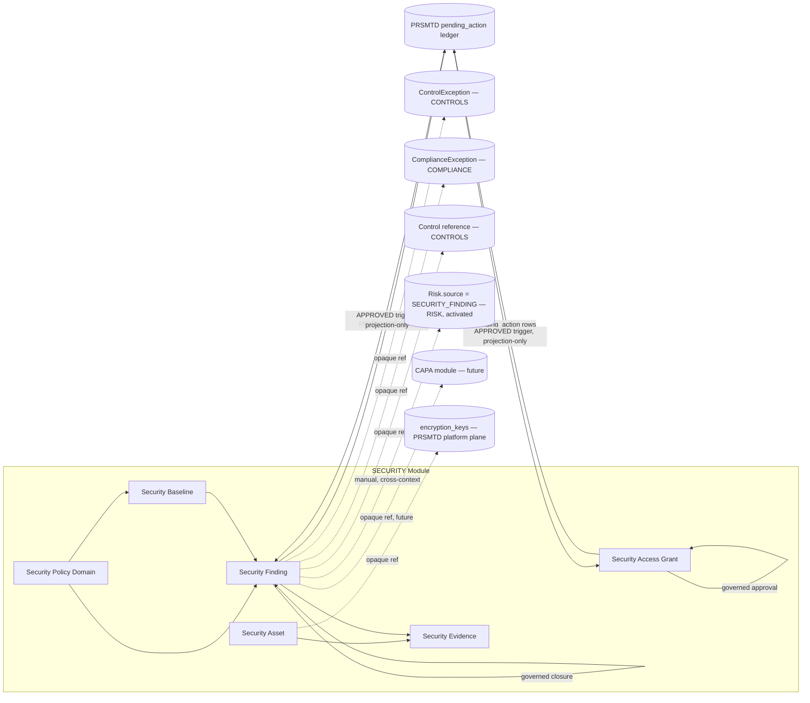
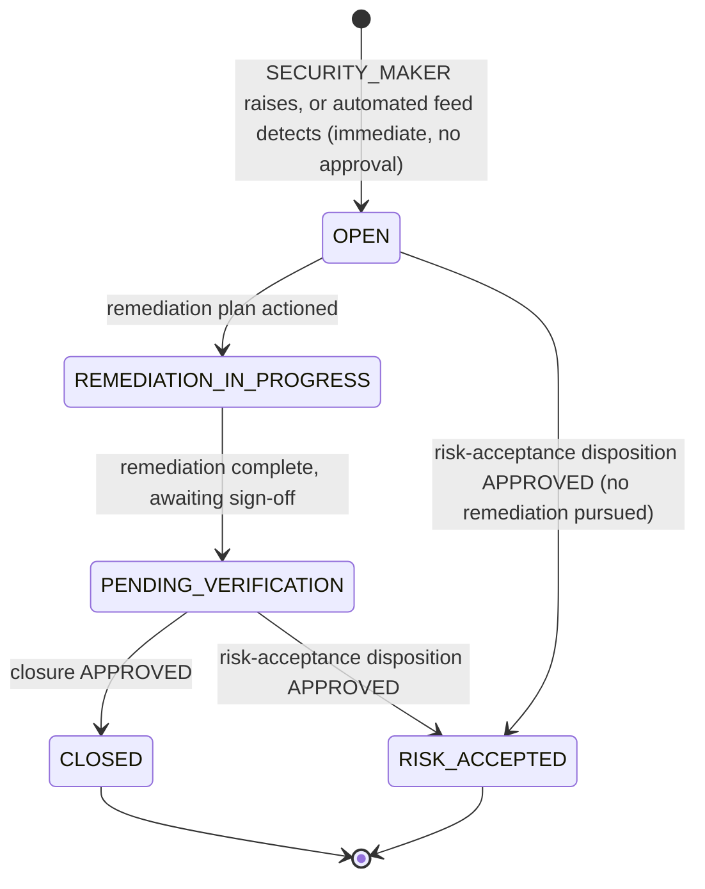
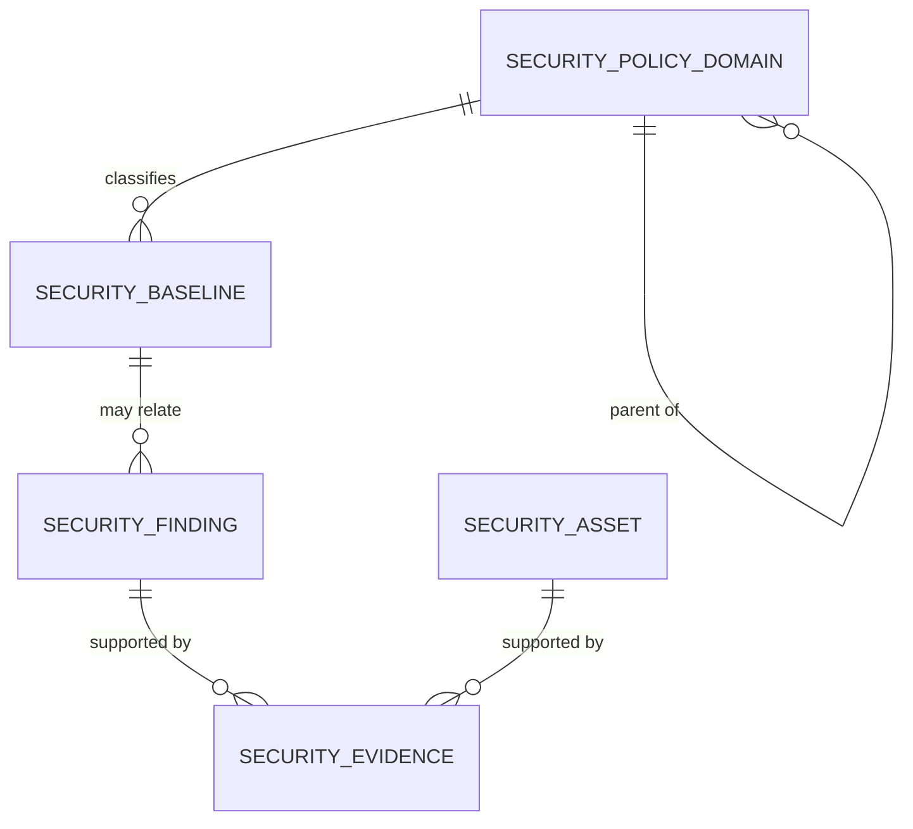
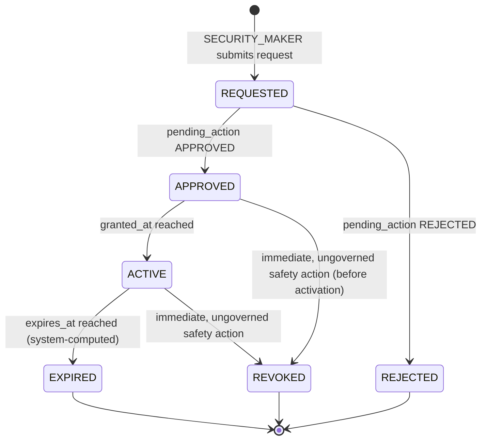

# 09.01 — Security Management

## Purpose

Defines Security as the shared enterprise security capability for the ERM platform: the
consolidated identity/authentication/authorization model every prior module already commits
to independently, the canonical data classification and Zero Trust/Privacy-by-Design
application, and — for the sub-capabilities no PRSMTD mechanism or ERM module yet covers —
a genuine sixth authoritative module (`SECURITY`) governing security policy taxonomy,
security baselines, privileged access, secrets/key/certificate lifecycle, and security
findings (vulnerabilities, misconfigurations, and policy violations). This is the sixth
authoritative, implementation-ready specification in this repository, and the first written
directly against `docs/09-security/README.md`'s original cross-cutting AuthN/Z/threat-model
scope rather than against a bounded context `04-domain-model/01-enterprise-domain-model.md`
had already reserved at the time — that document did not originally name a `SECURITY` context
(see [Assumptions](#assumptions), Assumption 1 and
[Relationship to the Enterprise Domain Model](#relationship-to-the-enterprise-domain-model)).
This gap is closed as of Session 7: `04-domain-model` now names `SECURITY` as a tenth,
authored bounded context.

## Scope

**In scope**:
- Consolidation of the identity, authentication, RBAC, segregation-of-duties, and data
  classification content every one of `RISK`/`CONTROLS`/`COMPLIANCE`/`AUDIT` already
  specifies inline and independently — named here once, canonically, per
  `04-domain-model`'s own closing rule that a term or pattern means one thing repository-wide.
- A full reuse-mapping of PRSMTD's actual authentication, RBAC, RLS, governance, module
  boundary, network, TLS, secrets, and observability mechanisms against every sub-capability
  named in this session's brief (Security Governance, Identity Security, Authentication,
  Authorization, RBAC, ABAC, Privileged Access Management, Secrets Management, Key
  Management, Certificate Lifecycle, Cryptography, Secure Configuration, Security
  Monitoring, Security Event Management, Vulnerability Management, Secure SDLC Governance,
  Threat Detection, Platform Hardening, API Security, Network Security Architecture,
  Security Baselines, Security Policies, Security Metrics, Security Reporting) — see
  [PRSMTD Security Substrate Reuse Matrix](#prsmtd-security-substrate-reuse-matrix).
- A new bounded context, module code `SECURITY`, owning exactly the sub-capabilities that
  matrix identifies as genuinely unowned by any existing PRSMTD mechanism or ERM module:
  the Security Policy Domain taxonomy, the Security Baseline register, Privileged Access
  Grants, the Secrets/Key/Certificate governance register (metadata and lifecycle only — not
  a cryptography or secret-storage implementation), and Security Findings (vulnerabilities,
  misconfigurations, policy violations, access anomalies), each following the shared-kernel
  modeling patterns `04-domain-model` established.
- ABAC named explicitly as a **future extensibility point** on top of PRSMTD's existing RBAC
  (not a built capability — PRSMTD implements only RBAC today; see
  [Authorization Model — RBAC (Built) and ABAC (Reserved)](#authorization-model--rbac-built-and-abac-reserved)).
- This module's own security/audit/reporting/API surface, and its cross-context integration
  points toward `RISK`, `CONTROLS`, `COMPLIANCE`, and `AUDIT`.

**Out of scope** (forward-referenced or explicitly excluded, not designed here):
- **Cryptographic algorithm design, key derivation, or HSM/KMS implementation.** PRSMTD
  already owns a real (if partial) key-management substrate — `encryption_keys` /
  `encryption_key_versions` (system.md §7), referencing an external `kms_alias` — and a
  Production Credential Policy requiring an external secrets store (Vault, AWS SSM,
  Kubernetes Secrets) for production credentials (system.md §11). This module governs
  **ownership, rotation-due-date, and expiry of** secrets/keys/certificates as a tenant-plane
  register; it does not perform cryptographic operations, does not store secret material, and
  does not replace PRSMTD's `encryption_keys` table or its production secrets-store
  requirement.
- **SIEM, IDS/IPS, or automated threat-detection tooling.** No such platform capability exists
  in PRSMTD today (confirmed absent — see
  [PRSMTD Security Substrate Reuse Matrix](#prsmtd-security-substrate-reuse-matrix)); this
  module defines the governance register (`SecurityFinding`) such tooling would feed once it
  exists, reserving `source = SIEM_ALERT` the same way `10-risk`'s `KRIMeasurement.source`
  reserves `INTEGRATION`.
- **Vulnerability scanning tools themselves** (SAST/DAST engines, dependency/container
  scanners, penetration-testing services) — this module governs the resulting finding
  register, not the tooling that produces findings.
- **Security Policy content and versioning** — the future `POLICY` module (`04-domain-model`'s
  reserved Open Host Service to `CONTROLS`/`COMPLIANCE`) owns published, versioned policy
  documents; this module owns only the taxonomy of security policy *domains* a future Policy
  entity would tag against (`SecurityPolicyDomain`), mirroring exactly how `12-controls` and
  `11-compliance` each reserve, but do not design, their own Policy link points.
- **DPDP Act 2023 / privacy-program content** — `CLAUDE.md`'s long-term vision names Privacy
  Management as its own future capability, distinct from Security; this module applies
  Privacy-by-Design as an architecture principle to its own data (see
  [Security Considerations](#security-considerations)) but does not author DPDP obligation
  content — that remains `COMPLIANCE`'s (or a future Privacy Management module's) scope, per
  `22-traceability/02-compliance-coverage-assessment.md`'s existing gap framing.
- **CERT-In Directions (6-hour cyber incident reporting)** — depends on the reserved `INCIDENT`
  context (timeline tracking) and `COMPLIANCE` (filing obligation), neither owned here; a
  `CRITICAL` `SecurityFinding` is a natural future trigger, reserved via an opaque,
  not-yet-activated link (see [Integration with Future Incident/CAPA](#integration-with-future-incidentcapa)).
- **Incident, Issue, and CAPA management** — a Security Finding's remediation is tracked
  inline in this module until CAPA exists, mirroring every prior module's identical treatment.
- **A platform document/object storage capability** — `SecurityEvidence` reuses the same
  metadata-plus-opaque-`storage_ref` shape `ControlEvidence`/`ComplianceEvidence`/
  `AuditEvidence` established; the same confirmed platform gap, not a fourth one.
- **A formal ISO 27001/27701/22301/31000, COBIT, or NIST CSF crosswalk** —
  `SecurityPolicyDomain.framework_tag` is designed to carry such a mapping by convention (see
  [Data Model](#canonical-data-model)), but the crosswalk itself remains the lower-priority
  future deliverable `22-traceability/02-compliance-coverage-assessment.md` already named,
  not authored here.
- **Regulatory profiles other than `SEBI_AMC`** — schema is profile-configurable per the
  pattern every prior module established; only `SEBI_AMC` seed content is defined here.
- **Amending `04-domain-model/01-enterprise-domain-model.md`, `10-risk/01-*`,
  `12-controls/01-*`, `11-compliance/01-*`, or `13-audit/01-*`** beyond the two additive
  changes already applied earlier this session (see `docs/roadmap.md` Session 6) — every
  integration this module makes toward those five documents is additive and opaque, exactly
  as `13-audit` achieved toward three of them.

## Business Context

Every one of the five authoritative specs already in this repository independently commits to
the same security model: PRSMTD's JWT/Keycloak authentication reused unmodified, the same
closed `MAKER`/`CHECKER`/`VIEWER` module role-type set, the same `approved_by <> created_by`
segregation-of-duties constraint, and a self-declared data-classification tier
(`Tenant Confidential` for registers, `Tenant Restricted` for evidence). `docs/roadmap.md`
has flagged this duplication as a live open decision since Session 2 ("the persona-to-
module-role mapping convention... confirmed by a fourth module... no longer a 'wait for
confirmation' deferral") and `22-traceability/02-compliance-coverage-assessment.md` names
`09-security/` consolidation explicitly as "current Next Milestone item 2... consolidation
risk grows with each additional module repeating the same content inline." This document is
that consolidation — canonically stating, once, what every prior module already independently
asserts, so a future module never has to re-derive it.

Beyond consolidation, `CLAUDE.md`'s long-term vision separately names **Cybersecurity
Governance** as its own GRC capability, distinct from `12-controls`' existing Information
Security/Cyber Security *control family* (which tests whether a designed control operates
effectively) and distinct from `11-compliance`'s existing Information Governance *obligation
category* (which tracks whether a regulatory requirement is satisfied). Neither of those two
mechanisms owns a technical vulnerability register, a privileged-access-grant lifecycle, or a
secrets/key/certificate governance inventory — three capabilities every SEBI-regulated AMC's
IT/cyber risk posture genuinely needs and that this session's brief explicitly names. This
module is the system of record for those three, built as a sixth PRSMTD module rather than
folded into `CONTROLS` or `COMPLIANCE`, for the ownership-boundary reasons given in
[Ownership Boundaries](#ownership-boundaries-between-security-and-other-bounded-contexts).

SEBI's own *Cyber Security and Cyber Resilience Framework for Mutual Funds AMCs*
(SEBI/HO/IMD/DF2/CIR/P/2019/12, 10 January 2019) is this module's primary regulatory anchor —
already cited at scope level by `12-controls` Assumption 5 (its source PDF is scanned/
image-only in this environment, so clause-level citation remains unavailable; this document
inherits that same limitation rather than re-attempting extraction).

## Regulatory Drivers

Source: [`../reference/Cyber Security and Cyber Resilience Framework for Mutual Funds AMCs
(2019).pdf`](../reference/Cyber%20Security%20and%20Cyber%20Resilience%20Framework%20for%20Mutual%20Funds%20AMCs%20%282019%29.pdf)
(scanned/image-only in this environment — cited at scope/title level only, inheriting
`12-controls` Assumption 5's finding rather than re-deriving it), cross-referenced with
[`../reference/Annexures to Master Circular for Mutual Funds as on March 31,
2023_p.pdf`](../reference/Annexures%20to%20Master%20Circular%20for%20Mutual%20Funds%20as%20on%20March%2031%2C%202023_p.pdf)
(System Audit Program Checklist §§1–8, already `12-controls`' and `13-audit`'s primary source
for the IT/cyber control taxonomy and System Audit scope respectively — re-cited here only for
the sections this module's own scope touches).

| Driver | Source reference | How this spec satisfies it |
|---|---|---|
| Cyber security policy and technical/organizational cyber controls (governance, access control, cryptography, incident response, vulnerability management named at title/scope level) | Cyber Security and Cyber Resilience Framework for Mutual Funds AMCs (SEBI/HO/IMD/DF2/CIR/P/2019/12) — scope-level citation per Assumption inherited from `12-controls` Assumption 5 | `SecurityPolicyDomain` seed taxonomy (Access Control, Cryptography, Vulnerability Management, Incident Response, Network Security, etc. — see [Security Policy Domains](#security-policy-domains)); `SecurityFinding`/`SecurityAsset`/`SecurityAccessGrant` registers operationalize the governance layer over each named domain. |
| System Audit Program Checklist — Access Management (incl. Segregation of Duties), Information Security | Annexures, System Audit Program Checklist §§3, and Annexure heading "Information Security" (already `12-controls`' primary citation for the seeded `Access Management`/`Information Security` control families) | This module does not re-seed that taxonomy; `SecurityFinding.related_control_id` opaquely references `12-controls`' existing Control records, and `SecurityAccessGrant` adds the time-bound, governed privileged-access layer `CONTROLS`' static role/permission model does not itself provide (see [Privileged Access Management](#privileged-access-management)). |
| Independent, documented cyber security governance function with Board/Trustee oversight | Cyber Security and Cyber Resilience Framework (scope-level); mirrors the independent-function pattern every prior module's own Regulatory Drivers table already cites from its own SEBI source | `SECURITY_CHECKER` module role — assignable to a CISO, Head of Information Security, or an external security assurance provider (see [Authorization Model](#authorization-model-security-module)), the same independent-function accommodation `10-risk`/`12-controls`/`11-compliance`/`13-audit` each already establish for their own oversight role. |
| Maker-checker authorization on privileged access grants and security finding closure | Best-practice pattern across the Annexures' approval matrices, same as every prior module | Reuses PRSMTD's `pending_action` governance ledger — see [Workflows](#workflows). |

## Assumptions

1. **`04-domain-model/01-enterprise-domain-model.md` did not originally reserve a `SECURITY`
   bounded context.** That document's Bounded Context Map originally named nine contexts
   (`RISK`, `CONTROLS`, `COMPLIANCE`, `AUDIT`, `POLICY`, `INCIDENT`/`ISSUE`/`CAPA`,
   `THIRD-PARTY RISK`, `BUSINESS CONTINUITY`, `REPORTING`) and classified PRSMTD's own
   authentication/RBAC/governance mechanisms as **generic subdomains**, consumed but never
   modeled as an ERM bounded context. `CLAUDE.md`'s own long-term vision, however, separately
   names **Cybersecurity Governance** as its own GRC capability alongside those nine. This was
   a genuine, narrow gap in the domain model's own bounded-context map at the time this
   document was first authored — not an inconsistency in anything `04-domain-model` built, but
   an omission its own strategic classification had not anticipated. This document originally
   proposed, without applying, the additive amendment that document would need; **that
   amendment has since been applied (Session 7)** — `04-domain-model/01-*.md` now names
   `SECURITY` as a tenth, authored bounded context (Core Domain; peer to `CONTROLS`/
   `COMPLIANCE`; Conformist supplier toward `AUDIT`) — see
   [Relationship to the Enterprise Domain Model](#relationship-to-the-enterprise-domain-model)
   and that document's own Amendment Log.
2. **Tenant = one AMC.** Same as every prior module's Assumption 1 — this module's own new
   tables are entirely tenant-plane data. The consolidation content in this document
   (identity, authentication, RBAC) describes platform-plane and cross-plane mechanisms
   PRSMTD itself owns (system.md §6–§8, §21) — this module does not re-host or duplicate
   those platform-plane tables.
3. **PRSMTD's authentication, RBAC, RLS, and governance mechanisms are frozen, reused
   inputs, not subject to redesign.** Every fact this document states about PRSMTD's actual
   security architecture (multi-realm Keycloak, JWT issuer/audience validation, three RBAC
   domains, `encryption_keys`/`encryption_key_versions`, the Production Credential Policy,
   the Wildcard TLS Architecture, the Runtime Validator Harness Doctrine) is drawn from a
   direct re-read of `PRSMTD/docs/authoritative/system.md` this session (§6, §7, §8, §11,
   §12, §17, §21, §22) and is stated as description, never as a proposed change.
4. **ABAC is unimplemented in PRSMTD today.** system.md §8 defines exactly three RBAC domains
   (Platform, Tenant, Module) with closed role-type sets; no attribute-based policy engine,
   condition language, or PDP/PEP mechanism exists. ABAC is named in this document strictly
   as a **future extensibility point** layered conceptually on top of the existing RBAC
   model (e.g., time-of-day, data-classification, or risk-score-conditioned access) — see
   [Authorization Model — RBAC (Built) and ABAC (Reserved)](#authorization-model--rbac-built-and-abac-reserved).
   No ABAC entity, policy table, or enforcement mechanism is designed in this spec.
5. **`SecuritySecretAsset`, `SecurityKeyAsset`, and `SecurityCertificateAsset` are one
   governed register, not three.** `10-risk`/`12-controls`/`11-compliance`/`13-audit` each
   reuse one shared-kernel shape per concept rather than splitting near-identical concerns
   into parallel tables (e.g., one `ControlTest` entity for both design and operating
   assessments). This module follows the identical discipline: one `SecurityAsset` aggregate
   with `asset_type ∈ SECRET, API_KEY, ENCRYPTION_KEY, TLS_CERTIFICATE, SIGNING_CERTIFICATE,
   SSH_KEY` carries ownership, rotation, and expiry fields common to all six asset types,
   rather than three near-duplicate tables — see [Data Model](#canonical-data-model).
6. **This module does not hold secret material.** `SecurityAsset.external_store_ref` (free
   text — e.g., a Vault path or AWS SSM parameter name) and `SecurityAsset.platform_key_ref_id`
   (opaque, nullable, no FK — cross-referencing PRSMTD's own `encryption_keys.key_id` when the
   governed asset is a platform-managed encryption key) are both pointers, never the secret,
   key material, or private key itself. This mirrors exactly the `storage_ref`-is-opaque
   convention `ControlEvidence`/`ComplianceEvidence`/`AuditEvidence` already established for
   binary evidence, applied here to cryptographic material instead of documents.
7. **A `SecurityFinding` is one entity covering vulnerabilities, misconfigurations, policy
   violations, and access anomalies — not four.** Mirrors exactly how `13-audit`'s `Finding`
   entity covers `CONTROL_DEFICIENCY`, `COMPLIANCE_GAP`, `PROCESS_GAP`, `IT_SECURITY_WEAKNESS`,
   and `FRAUD_INDICATOR` in one entity via a `finding_type` classification column rather than
   five parallel tables. See [Vulnerability and Security Finding Management](#vulnerability-and-security-finding-management).
8. **Security Baseline *compliance testing* is `CONTROLS`' responsibility, not this module's.**
   A hardening baseline (e.g., a Postgres CIS benchmark) is verified via a `12-controls`
   `ControlTest` on a Control tagged to that baseline (opaque reference), not a second,
   parallel testing entity in this module. This module owns only the baseline *definition*
   (`SecurityBaseline`, reference data) — see
   [Security Baselines](#security-baselines) and
   [Ownership Boundaries](#ownership-boundaries-between-security-and-other-bounded-contexts).
9. **Users referenced by this module** (`requestor_user_id`, `owner_user_id`,
   `identified_by`, `approved_by`, etc.) **are platform/tenant identity records**, not
   module-owned data — same reasoning as every prior module's identical assumption.
10. **Maker and Checker are always distinct individuals** — enforced by PRSMTD's
    platform-level `approved_by <> created_by` constraint on `pending_action`, same mechanism
    every prior module relies on; no bespoke SoD mechanism is designed here.
11. **`SecurityPolicyDomain` and `SecurityBaseline` are not routed through `pending_action` at
    MVP.** Both are tenant-editable reference/configuration data via `SECURITY_ADMIN`, the
    same "not every mutation needs governance" precedent `RiskAppetite`, `ControlFamily`,
    `ComplianceCalendarEntry`, and `AuditUniverseEntry` each already established — flagged in
    [Future Extension Points](#future-extension-points) as a candidate for the same
    repository-wide "governed configuration change" ADR already logged as an open decision in
    `docs/roadmap.md`.
12. **`SecurityAsset` creation/edit is ungoverned; revocation is an immediate, ungoverned
    safety action.** Registering or updating a governed asset's rotation schedule is
    operational tracking (`SECURITY_MAKER`), and marking an asset `REVOKED` must never wait
    on approval — a compromised secret or key should be revocable immediately, the same
    "operational fact/safety action first" reasoning every immediate-raise entity in this
    repository already uses. Only the **privileged access grant approval** — the genuinely
    SoD-sensitive decision — is routed through `pending_action` (see
    [Privileged Access Management](#privileged-access-management)).
13. **Record retention** is deferred to `11-compliance`, same as every prior module's
    identical assumption; this module's tables are append-only/status-transitioned
    (never physically deleted), which is retention-agnostic by design.
14. **`Risk.source = SECURITY_FINDING` — proposed by this document, applied in Session 7.**
    A `CRITICAL` `SecurityFinding` is a Risk source, mirroring `AUDIT_FINDING`/`CONTROL_TEST`/
    `COMPLIANCE_OBLIGATION`. This document originally proposed the value without applying it,
    pending explicit authorization for a third edit to `10-risk/01-*.md` in the same session;
    that authorization was given and the change applied in Session 7 — see
    [Integration with Risk](#integration-with-risk) and `10-risk/01-*.md`'s own Amendment Log.

## Dependencies

- PRSMTD `docs/authoritative/system.md` §6 (Security model — plane separation, platform
  realm architecture, multi-issuer authentication), §7 (Data model & RLS enforcement,
  `encryption_keys`/`encryption_key_versions`), §8 (RBAC model, all domains), §9 + §5a–§5c
  (Module framework, ownership guards OWN-03/04/07/08/09), §5c (Module Security Model), §10
  (Audit and compliance), §11 (System invariants — Production Credential Policy, Release 0.7
  Network Infrastructure Invariants: Wildcard DNS/TLS, Realm Factory), §17 (Runtime Validator
  Harness Doctrine), §21 (Authentication Surface Ownership), §22 (Observability Canonical
  Access) — all reused as-is, re-read in full this session specifically for this document; no
  PRSMTD changes required or proposed.
- [`04-domain-model/01-enterprise-domain-model.md`](../04-domain-model/01-enterprise-domain-model.md)
  — **frozen input at authoring time; amended additively in Session 7.** Its Common Domain
  Patterns shared kernel (taxonomy shape, governed-lifecycle shape, immediate-raise/
  governed-closure exception shape, opaque cross-context reference shape, code-sequence shape,
  descriptive `source` classification) is followed exactly. Its Bounded Context Map did not
  originally reserve a `SECURITY` context — see Assumption 1 and
  [Relationship to the Enterprise Domain Model](#relationship-to-the-enterprise-domain-model)
  — and now does, per that document's own Amendment Log.
- [`10-risk/01-enterprise-risk-management.md`](../10-risk/01-enterprise-risk-management.md) —
  amended additively in Session 7: `Risk.source` gained `SECURITY_FINDING` (Assumption 14),
  the one proposed change from this spec's original authoring that required (and received)
  explicit approval to apply.
- [`12-controls/01-controls-management.md`](../12-controls/01-controls-management.md) — **not
  modified by this spec.** `SecurityFinding.related_control_id` and
  `linked_control_exception_id` are opaque, non-FK references resolved via that module's
  existing reference-resolution API.
- [`11-compliance/01-compliance-management.md`](../11-compliance/01-compliance-management.md)
  — **not modified by this spec.** `SecurityFinding.linked_compliance_exception_id` is an
  opaque, non-FK reference; `SecurityPolicyDomain` gives that module's existing "Information
  Governance" obligation category a security-specific taxonomy anchor by convention, no FK.
- [`13-audit/01-audit-management.md`](../13-audit/01-audit-management.md) — amended additively
  in Session 7: `AuditEvidence.evidence_source` gained `SECURITY_EVIDENCE_REFERENCE` and
  `Finding` gained `linked_security_finding_id` (see
  [Integration with Audit](#integration-with-audit)), and `AUDIT`'s manifest now declares
  `dependencies: [..., SECURITY]`.
- `../reference/Cyber Security and Cyber Resilience Framework for Mutual Funds AMCs
  (2019).pdf` — regulatory source, cited at scope level per `12-controls` Assumption 5
  (inherited, not re-derived).
- `docs/22-traceability/01-master-traceability-matrix.md`,
  `docs/22-traceability/02-compliance-coverage-assessment.md` — updated by this session.
- `docs/roadmap.md` — recorded `09-security/` consolidation as Next Milestone item 2;
  updated by this session with progress and the next recommended milestone.

## Architecture

The Security capability is one PRSMTD module: **module code `SECURITY`**. It follows the
generic module framework exactly as every prior module does (system.md §9/§5a–§5c):

- `moduleId`: a stable UUID minted at implementation time, not fixed by this specification.
- Table prefix: `module_security_*` (OWN-03 schema ownership).
- Route namespace: `/modules/SECURITY` (§5b4).
- API namespace: `/api/v1/modules/security/**`, controllers in
  `com.prsbnjs.modules.security` (OWN-07).
- Module role types: `MAKER`, `CHECKER`, `VIEWER` only — the closed set (system.md §8).
  Domain personas map onto these three; see
  [Authorization Model (Security Module)](#authorization-model-security-module).
- **`dependencies: [INCIDENT]`** (updated Session 15 — Additive Change Consolidation; was
  `dependencies: []` at MVP). `SECURITY` declares no hard dependency for its core
  finding/asset/access-grant register toward `CONTROLS`/`COMPLIANCE`/`AUDIT` — every reference
  in that direction is an opaque, non-FK link resolved lazily, no dependency edge required at
  MVP (per `04-domain-model`'s Dependency Rule 6 — a hard edge is declared only when a
  synchronous API call is genuinely required). `INCIDENT` is the one genuinely new synchronous
  call this module itself makes outward, for the new `POST /findings/{id}/capa-request` call
  (see [Integration with Incident/Issue/CAPA](#integration-with-incidentissuecapa)) — `INCIDENT`
  declares no reciprocal dependency back. **`SecurityFinding.linked_vendor_id` deliberately does
  not add a `TPR` dependency here**: `TPR` already declares `dependencies: [..., SECURITY, ...]`
  for its own `GET /policy-domains` tag resolution (Assumption/Architecture of
  `25-third-party-risk/01-*`) — a reciprocal `SECURITY → TPR` edge would create the exact cycle
  `04-domain-model` Dependency Rule 6 forbids. `linked_vendor_id` is therefore left as a plain
  opaque reference this module records but does not itself resolve for display; a module with
  no dependency conflict in either direction (e.g. `14-reporting`, which already depends on both)
  resolves it on demand via `TPR`'s existing `GET /vendors/{id}/reference` instead.
- No platform-plane tables, no platform-plane governance actions — every governed action is
  tenant-plane (`app.plane = 'tenant'`). This module's own tables are entirely distinct from,
  and do not duplicate, PRSMTD's platform-plane `encryption_keys`/`encryption_key_versions`
  (system.md §7) — see Assumption 6.
- Tenant isolation, GUC binding, and session-setter usage are inherited unmodified from
  `TenantAwareDataSource` (system.md §7) — this module issues no direct `SET`/`set_config`
  calls.
- **Cross-module access is API-mediated only (OWN-08/OWN-09).** `SECURITY` never reads
  `CONTROLS`', `COMPLIANCE`'s, or `AUDIT`'s tables directly; none of the three reads
  `SECURITY`'s tables directly.



## Relationship to the Enterprise Domain Model

`04-domain-model/01-enterprise-domain-model.md`'s Bounded Context Map and Strategic
Classification tables originally did not name a `SECURITY` context (Assumption 1). This
document originally proposed, without applying, the additive amendment that map would need;
**that amendment has since been applied (Session 7)** — see that document's own Amendment Log:

| `04-domain-model` table | Additive row (applied Session 7) |
|---|---|
| Strategic Classification | `SECURITY` — Core Domain (alongside `RISK`, `CONTROLS`, `COMPLIANCE`, `AUDIT`, and the still-reserved contexts) — a differentiated business capability (cybersecurity governance), not a generic subdomain, despite reusing generic-subdomain mechanisms (authentication, RBAC) for its own enforcement. |
| Bounded Context Map | `SECURITY` — peer to `CONTROLS` (a Finding may corroborate a Control Exception) and `COMPLIANCE` (a Finding may corroborate a Compliance Exception), and a Conformist supplier toward `AUDIT` (Audit consumes Security Findings/Evidence as evidentiary substrate, exactly as it already consumes `CONTROLS`'/`COMPLIANCE`'s facts) — solid edges, since all endpoints are now authored. |
| Ownership Responsibilities | `SECURITY` — CISO / Head of Information Security (`SECURITY_CHECKER`) — `SECURITY` (module code, authored). |
| Dependency Rules | `SECURITY` behaves like `CONTROLS`/`COMPLIANCE` (a pure-ish provider toward `AUDIT`, a peer referencer of `CONTROLS`/`COMPLIANCE` via opaque links) — it does not introduce a cycle; see Dependency Rule 6's existing "a cycle is a modeling error" guidance, and new Dependency Rule 7, unaffected by this addition. |
| Canonical Business Glossary | `Security Policy Domain`, `Security Baseline`, `Security Finding`, `Security Asset`, `Security Access Grant` — new terms at this layer, defined in [Domain Model](#domain-model) below, owned by `SECURITY`. |

This table was a recommendation for a future session, exactly the discipline `11-compliance`
used for its own two proposed-not-applied changes before they were approved and applied in
Session 6 (see `docs/roadmap.md`) — **it is now applied to `04-domain-model/01-*.md`**, per that
document's own Amendment Log.

## Domain Model

**Bounded context**: Security Management. Owns the security policy domain taxonomy, security
baseline register, privileged access grants, the secrets/key/certificate governance register,
and security findings exclusively. Treats `CONTROLS` and `COMPLIANCE` as peer contexts it may
corroborate (a Finding may reference an existing Control Exception or Compliance Exception)
without owning either, and treats `AUDIT` as a downstream Conformist consumer of its own
Findings and Evidence, mirroring exactly the relationship shape `CONTROLS` and `COMPLIANCE`
each already have toward `AUDIT`.

**Ubiquitous language** (extends, does not redefine, `04-domain-model`'s canonical glossary —
per that document's closing rule, "a term means one thing repository-wide"):

| Term | Definition |
|---|---|
| Security Policy Domain | A named category of security governance concern (e.g., Access Control, Cryptography, Vulnerability Management, Network Security) that a future Policy, an existing Obligation, or an existing Control may tag against by convention — a taxonomy, not a policy document itself. |
| Security Baseline | A named, versioned hardening/configuration standard (e.g., a CIS benchmark, an internal secure-configuration standard) a tenant adopts; tested via a `CONTROLS` Control Test on a Control tagged to it, not via a parallel testing entity in this module. |
| Security Finding | A detected vulnerability, misconfiguration, policy violation, or access anomaly — raised immediately (often by an automated scanner), tracked to a governed closure or formal risk-acceptance disposition. Distinct from a Control Exception (raised by the control's own owner) or an Audit Finding (raised by an independent audit engagement) — a Security Finding is typically detected by a technical control or scan, not by an owner's self-assessment or an auditor's independent examination. |
| Security Asset | A governed inventory record for a secret, API key, encryption key, TLS certificate, signing certificate, or SSH key — ownership, rotation cadence, and expiry tracking only; never the credential material itself. |
| Security Access Grant | A time-bound, governed record of elevated/privileged access granted to an individual, distinct from a standing module-role assignment — the Privileged Access Management artifact this repository did not otherwise have. |
| Security Evidence | A metadata record (integrity hash + opaque storage pointer) supporting a Security Finding or Security Asset — the same shape as `ControlEvidence`/`ComplianceEvidence`/`AuditEvidence`. |

**Aggregates, entities, and invariants**:

- **SecurityFinding** (aggregate root) — Raised immediately by a `SECURITY_MAKER` or by an
  automated scan feed (no governance required to open — a detected vulnerability should not
  wait on approval to be recorded); closure or `RISK_ACCEPTED` disposition requires
  `SECURITY_CHECKER` approval — identical shape to `ControlException`/`ComplianceException`/
  `Finding`.
- **SecurityAsset** (aggregate root, independent lifecycle) — Creation, edit, and rotation
  tracking are plain operational edits (`SECURITY_MAKER`); marking `REVOKED` is an immediate,
  ungoverned safety action (Assumption 12); `status` transitions to `ROTATION_DUE`/`EXPIRED`
  are system-computed from `next_rotation_due_date`/`expires_at`, not manual edits.
- **SecurityAccessGrant** (aggregate root, independent lifecycle) — Cannot reach `ACTIVE`
  without `pending_action` approval (`SECURITY_ACCESS_GRANT_APPROVAL`); auto-expires at
  `expires_at` (application-layer scheduled check, not a new PRSMTD mechanism); revocation
  before expiry is an immediate, ungoverned safety action, same reasoning as
  `SecurityAsset.REVOKED`.
- **SecurityBaseline** (reference data) — Tenant-editable via `SECURITY_ADMIN`, not
  `pending_action`-governed at MVP (Assumption 11); optionally tagged to a
  `SecurityPolicyDomain`.
- **SecurityPolicyDomain** (reference data) — Two-level hierarchy (domain → sub-domain),
  regulatory-profile-seeded, tenant-editable — same shape as `RiskCategory`/`ControlFamily`/
  `ObligationCategory`.
- **SecurityEvidence** (entity, attached to exactly one of SecurityFinding or SecurityAsset)
  — Immutable metadata once uploaded; supersession creates a new row, never an edit — same
  convention as every prior module's evidence entity.

## Ownership Boundaries Between Security and Other Bounded Contexts

Explicit, per this session's instruction, since `SECURITY` is a new context `04-domain-model`
did not anticipate:

| Boundary | Rule |
|---|---|
| `SECURITY` vs. `CONTROLS` | `CONTROLS` owns the design, ownership, and effectiveness testing of controls — including the existing seeded `Information Security`, `Access Management`, and `Cyber Security` control families. `SECURITY` does not re-test controls; it owns the *technical, typically automated* detection of vulnerabilities/misconfigurations (`SecurityFinding`) and the *governed elevation* of access beyond a standing role assignment (`SecurityAccessGrant`) — both concerns `CONTROLS`' static role/permission and periodic-test model does not itself provide. A `SecurityFinding` may corroborate an existing `ControlException` (opaque, nullable link) rather than duplicating it. |
| `SECURITY` vs. `COMPLIANCE` | `COMPLIANCE` owns the regulatory obligation register, including the existing "Information Security & Data Privacy" obligation sub-category. `SECURITY` does not track obligation compliance status; `SecurityPolicyDomain`'s taxonomy gives that sub-category a security-specific crosswalk anchor by convention (string tag, no FK — the same non-invasive relationship `04-domain-model`'s opaque-reference pattern already establishes elsewhere). A `SecurityFinding` may corroborate an existing `ComplianceException` (opaque, nullable link). |
| `SECURITY` vs. `AUDIT` | `AUDIT` is Conformist toward `SECURITY`, the same relationship it already has toward `RISK`/`CONTROLS`/`COMPLIANCE`: a `SYSTEM_AUDIT` engagement's Working Papers may cite `SecurityFinding`/`SecurityEvidence` as evidentiary substrate — **activated Session 7**, `AUDIT`'s manifest now declares `dependencies: [..., SECURITY]` (see [Integration with Audit](#integration-with-audit)); `SECURITY` never renegotiates `AUDIT`'s model. |
| `SECURITY` vs. `RISK` | A `CRITICAL` `SecurityFinding` is a Risk source (`Risk.source = SECURITY_FINDING`, **activated Session 7** — Assumption 14); `SECURITY` does not otherwise read or write `RISK`'s tables. |
| `SECURITY` vs. the future `POLICY` module | `POLICY` (once it exists) owns published, versioned security policy *content*; `SECURITY` owns only the *taxonomy* (`SecurityPolicyDomain`) that content would tag against — mirroring exactly `12-controls`'/`11-compliance`'s own reserved, undesigned Policy link points. |
| `SECURITY` vs. PRSMTD's own substrate | `SECURITY` governs (tracks ownership, rotation, and lifecycle over) secrets/keys/certificates and privileged access; it does not re-implement authentication, RBAC enforcement, cryptographic operations, or secret storage — all fully reused from PRSMTD as documented in [PRSMTD Security Substrate Reuse Matrix](#prsmtd-security-substrate-reuse-matrix). |

## PRSMTD Security Substrate Reuse Matrix

Every sub-capability named in this session's brief, mapped to what PRSMTD already provides
(verified this session against `system.md`), what this document newly specifies, and what
remains a genuine, named gap. This is the same three-way distinction
`22-traceability/02-compliance-coverage-assessment.md` uses (Already Built / Specified but
Yet to Build / Not Yet Specified), applied at sub-capability granularity for this module.

| Sub-capability | PRSMTD status (verified this session) | This module's contribution | Gap (if any) |
|---|---|---|---|
| Security Governance | Governance ledger / maker-checker substrate built (§3, §9, GOV-07) | `SECURITY_CHECKER` independent function; `SecurityFinding`/`SecurityAccessGrant` governed lifecycles | None |
| Identity Security | `app_user` shared identity store, `identity_binding` (IdP subject → user), per-realm service accounts, no shared master admin credential (§7, §11 ADR-TR-007) | Consolidates these facts once, canonically (this document) | None |
| Authentication | Multi-realm Keycloak, JWT issuer/audience validation, PKCE, BFF token exchange, cross-realm rejection rules (§6, §21) — **Built** | Reused unmodified; no new authentication surface | None |
| Authorization / RBAC | Three RBAC domains (Platform/Tenant/Module), closed role-type sets, closed permission catalog (§8) — **Built** | Reused unmodified; `SECURITY` module roles/permissions declared against this model like every prior module | None |
| ABAC | Not implemented — no attribute-based policy engine exists | Named as a future extensibility point only | **Gap** — not built anywhere; see [Authorization Model — RBAC (Built) and ABAC (Reserved)](#authorization-model--rbac-built-and-abac-reserved) |
| Privileged Access Management | Per-realm service accounts, least-privilege Realm Factory design (§11 ADR-TR-007) — a PAM-*adjacent* principle, not a time-bound grant/session mechanism | `SecurityAccessGrant` — governed, time-bound elevated-access register (new) | Partially specified now; actual session recording/just-in-time credential vaulting is infrastructure, not designed here |
| Secrets Management | Production Credential Policy; external secrets store required for production (Vault/AWS SSM/K8s Secrets); forbidden-credential doctrine; fail-closed startup validator (§11) — **Built** | `SecurityAsset` (`asset_type = SECRET`/`API_KEY`) — ownership/rotation governance register over secrets held in the external store (new; does not hold secret material) | None beyond what's specified |
| Key Management | `encryption_keys`/`encryption_key_versions` tables, versioned, `kms_alias` referencing an external KMS (§7) — **Built** | `SecurityAsset` (`asset_type = ENCRYPTION_KEY`) — opaque `platform_key_ref_id` cross-references PRSMTD's own key registry for governance-level ownership/rotation-due tracking (new) | None beyond what's specified |
| Certificate Lifecycle | Wildcard TLS Architecture — automated ACME/commercial-CA renewal for `*.prsmtd.com` (§11 ADR-TR-010); local dev TLS via `mkcert`, automated by `platformctl` (§13) — **Built** for the platform's own ingress certificate | `SecurityAsset` (`asset_type = TLS_CERTIFICATE`/`SIGNING_CERTIFICATE`) — governs certificates the platform's own wildcard-TLS automation does not cover (e.g., third-party integration certs, SEBI filing digital-signature certs, service-to-service mTLS certs) (new) | None beyond what's specified for non-platform-ingress certificates |
| Cryptography | `pgcrypto` extension, `encryption_keys` versioning, TLS everywhere via wildcard cert (§7, §11) — **Built** | No new cryptographic mechanism; this module never handles key material directly (Assumption 6) | None |
| Secure Configuration | Production Credential Policy forbidden-default doctrine; `CredentialSafetyValidator` fail-closed startup check (§11) — **Built** | `SecurityBaseline` register — names the hardening standards a tenant adopts; tested via `CONTROLS`' existing `ControlTest`, not a new testing mechanism (new, reference data only) | None beyond what's specified |
| Security Monitoring | Grafana/Prometheus/Alertmanager under a certified single-ingress, canonical-hostname architecture (§22); observability trace contract T1–T7 (§4.1) — **Built** for platform observability, not security-event-specific | `SecurityFinding.source = SIEM_ALERT` reserves the slot for a correlated security-relevant event once triaged | **Gap** — no dedicated SIEM/security-event-correlation capability exists; general notification/alerting was attempted and explicitly retired (system.md, PR-RESET-02) |
| Security Event Management | Same trace contract as above; `audit_log`/`platform_audit_log` (§10) — **Built** as a general audit substrate | This module treats certain canonical trace/audit events as security-relevant for reporting purposes, the same reuse-not-duplicate approach `13-audit`'s `SYSTEM_TRACE_EXTRACT` evidence type already established | Same SIEM gap as above — event *correlation/alerting* is not a platform capability |
| Vulnerability Management | Not built — no scanning tool or vulnerability register exists in PRSMTD | `SecurityFinding` (`finding_type = VULNERABILITY`, `source ∈ SAST, DAST, DEPENDENCY_SCAN, CONTAINER_SCAN, PENETRATION_TEST, MANUAL`) — the governed register (new); scanning tools themselves out of scope | Scanning tooling itself remains unbuilt/unintegrated — this module is the register the tooling would feed |
| Secure SDLC Governance | ArchUnit layering (`api → service → persistence`, no `controller` package); OWN-03/04/07/08/09 CI guards; Runtime Validator Harness Doctrine (`smoke`/`extended`/`experimental` tiers, PR-blocking constitutional smoke set) (§9, §17) — **Built**, a real, enforced constitutional control surface | Consolidates and cites this substrate as this repository's Secure SDLC governance mechanism; no new register | None — this is already a strong, enforced mechanism; no ERM-level gap identified |
| Threat Detection | Not built — no IDS/IPS or automated threat-detection capability | `SecurityFinding.source = SIEM_ALERT`/`PENETRATION_TEST` reserves the input slot | **Gap** — same as Security Monitoring above |
| Platform Hardening | Docker-only rebuild + verifier boundary, forbidden-credential doctrine, baseline immutability lock, CI guards (§9, §11, §12) — **Built** | Consolidated by reference; `SecurityBaseline` register extends this to tenant-adopted hardening standards beyond the platform's own | None beyond what's specified |
| API Security | Closed-world route enumeration (§4), rate-limiting on at least one public endpoint (`/api/v1/realm-discovery`), OWN-07 API namespace ownership per module (§9) — **Built** | No new mechanism; this module's own API surface follows the identical closed-route, permission-guarded convention every prior module uses | None |
| Network Security Architecture | Plane separation (§6); wildcard DNS/TLS (§11 ADR-TR-010); single-ingress canonical-hostname architecture for observability tooling (§22); per-realm service accounts, no shared master credential (§11 ADR-TR-007) — **Built** | Consolidated by reference; no new network mechanism | None |
| Security Baselines | Not built as a named register (individual hardening facts exist inline in system.md, e.g. forbidden-credential doctrine, TLS requirements) | `SecurityBaseline` register — the first named, tenant-adoptable catalog of hardening standards (new) | None beyond what's specified |
| Security Policies | Not built — no Policy module exists in ERM or PRSMTD | `SecurityPolicyDomain` taxonomy only — policy *content* remains the future `POLICY` module's scope | Policy content/versioning itself remains unspecified, same gap `12-controls`/`11-compliance` already name |
| Security Metrics | Not built as a security-specific capability | Source data/views only, per [Reporting Requirements](#reporting-requirements) — same convention every prior module uses | None beyond what's specified |
| Security Reporting | Not built as a security-specific capability | Same as Security Metrics — source views for a future `14-reporting`/`15-analytics` aggregation layer | Aggregation layer itself remains unspecified, the same named gap every prior module already carries |

## Canonical Data Classification Scheme

Every prior module independently declared its own data-classification tier inline (`Tenant
Confidential` for registers, `Tenant Restricted` for evidence). This section names the
canonical scheme those declarations already instantiate — **retroactively named, not
changing any prior spec**, the same non-invasive relationship `04-domain-model`'s canonical
glossary has to the inline glossaries it superseded:

| Tier | Definition | Existing instances |
|---|---|---|
| `PUBLIC` | No confidentiality requirement (e.g., tenant branding assets served from an unauthenticated CDN endpoint, system.md §7). | Not used by any GRC-domain register today. |
| `INTERNAL` | Platform-operational data with no tenant-business sensitivity (e.g., module catalog metadata). | Not used by any GRC-domain register today. |
| `TENANT_CONFIDENTIAL` | Tenant business data whose disclosure could reveal operational posture but not a directly exploitable gap. | `RISK`'s register, `CONTROLS`' library, `COMPLIANCE`'s obligation register, `AUDIT`'s universe/plan, this module's `SecurityBaseline`/`SecurityPolicyDomain`. |
| `TENANT_RESTRICTED` | Tenant business data whose disclosure could directly reveal an exploitable gap. | `ControlEvidence`, `ComplianceEvidence`, `AuditEvidence`/`Finding`/`WorkingPaper`, and — newly — this module's `SecurityFinding`, `SecurityAsset`, `SecurityAccessGrant`, `SecurityEvidence` (see [Security Model (Security Module)](#security-model-security-module)). |
| `PLATFORM_RESTRICTED` | Platform-plane data no tenant actor may ever access (e.g., `platform_role_assignment`, `encryption_keys` cross-tenant metadata). | PRSMTD platform-plane tables (system.md §7); no ERM-owned table carries this tier. |

## Identity, Authentication, and Authorization (Consolidated, Reused from PRSMTD)

This section states, once, what every prior module's own Security Model section already
independently asserts — no new mechanism, no redesign.

- **Identity**: `app_user` is the single shared identity store across every tenant;
  `identity_binding` is the authoritative, 1:1 mapping from IdP subject to `app_user` (system.md
  §7). Every ERM module's `*_user_id` columns (risk owners, control testers, obligation
  assessors, auditors, and this module's requestors/asset owners) resolve through this
  substrate — no ERM module owns identity data.
- **Authentication**: PRSMTD operates a dedicated Platform Realm (control-plane
  administrators) fully isolated from per-tenant Keycloak realms (system.md §6). JWTs carry
  an `iss` claim validated against a `TenantRealmRegistry` pre-validation step before any
  decoding occurs; cross-realm tokens are rejected before their contents are ever read
  (system.md §6, ADR-TR-006). The application-tier login shell, tenant selector, and
  post-logout surfaces are Next.js-owned; credential entry, MFA, password reset, and identity
  error pages are exclusively Keycloak-owned — this boundary is binding and must not be
  collapsed by any ERM module's UI (system.md §21). No ERM module introduces a new
  authentication surface.
- **Authorization / RBAC**: three closed RBAC domains — Platform (`PLATFORM_ADMIN`,
  `PLATFORM_ADMIN_MAKER`, `PLATFORM_ADMIN_CHECKER`), Tenant (`ADMIN`, `MAKER`, `CHECKER`,
  plus baseline `USER`/`VIEWER`), and Module (`MAKER`, `CHECKER`, `VIEWER` only) (system.md
  §8). Every ERM module — `RISK`, `CONTROLS`, `COMPLIANCE`, `AUDIT`, and this module —
  declares its own permission catalog and `roleMappings` against the closed Module RBAC
  domain; none introduces a fourth module role type.
- **Persona-to-module-role mapping convention**: business personas (Risk Owner, Control
  Owner, Compliance Analyst, Internal Auditor, and — for this module — Security Analyst/CISO)
  map onto the closed `MAKER`/`CHECKER`/`VIEWER` set via tenant-onboarding configuration
  (`roleMappings`), never via new module role types. This pattern is now confirmed by **five**
  consecutive modules (`10-risk` through this document) — `docs/roadmap.md`'s existing Open
  Decision to formalize it as a `20-adr/` entry is reaffirmed here, not newly created (no ADR
  is authored by this document — see [Future Extension Points](#future-extension-points)).
- **Segregation of duties**: every governed decision in this repository — risk acceptance,
  control test approval, compliance exception closure, audit finding closure, and now a
  privileged access grant or security finding closure — relies exclusively on PRSMTD's
  platform-level `approved_by <> created_by` constraint on `pending_action` (system.md §3).
  No ERM module, including this one, has ever designed a bespoke SoD mechanism.

### Authorization Model — RBAC (Built) and ABAC (Reserved)

RBAC, as described above, is PRSMTD's only implemented authorization mechanism today. ABAC —
named explicitly in this session's brief as future extensibility — is reserved as a
**conceptual layering**, not a built capability:

- A future ABAC layer would evaluate attributes (e.g., a Risk's `residual_band`, a
  Security Finding's `severity`, a request's time-of-day or network origin) as additional
  conditions **on top of** an already-RBAC-granted permission, never as a replacement for the
  closed Module RBAC domain.
- No PRSMTD policy-decision-point (PDP) or policy-enforcement-point (PEP) mechanism exists to
  host such conditions today (verified this session — no attribute-based mechanism found in
  system.md §8 or elsewhere).
- This document does not design an ABAC policy table, condition language, or enforcement
  hook. If a future regulatory profile or tenant requirement makes attribute-conditioned
  access a genuine near-term need, that is a new PRSMTD platform capability requirement (the
  same class of gap as the still-open document/object-storage capability), to be flagged
  explicitly when it becomes concrete — not designed speculatively here.

## Zero Trust and Privacy by Design Application

`CLAUDE.md`'s Architecture Principles name Zero Trust and Privacy by Design as constraints on
every specification. This module's own application of both, consolidating what every prior
module already independently practices:

- **Zero Trust**: every module boundary in this repository is already enforced, not assumed
  — OWN-08 (declared, acyclic dependencies) and OWN-09 (API-mediated access only, no direct
  cross-module table reads) apply to every opaque reference this module makes toward
  `CONTROLS`/`COMPLIANCE`/`AUDIT`, exactly as they already apply to every prior module's
  cross-context references. No implicit trust is extended between modules merely because they
  share a tenant or a database instance; RLS (system.md §7) re-verifies tenant scope on every
  query regardless of which module issued it.
- **Privacy by Design**: this module's own entities carry no PII beyond platform-resolved
  `*_user_id` references (Assumption 9) — identical to every prior module. `SecurityAsset`
  and `SecurityFinding` are explicitly designed to never carry secret material or exploit
  details in plain, unclassified fields (Assumption 6; `TENANT_RESTRICTED` classification —
  see [Security Model (Security Module)](#security-model-security-module)).

## Security Policy Domains

`module_security_policy_domain` is seeded per regulatory profile, tenant-editable via
`SECURITY_ADMIN`, with an optional `framework_tag` for ISO 27001 Annex A / NIST CSF alignment
(configurable metadata, not a hardcoded crosswalk — see [Scope](#scope)). The `SEBI_AMC` seed
set, grounded at the scope-level precision the Cyber Security and Cyber Resilience Framework
citation supports (Regulatory Drivers table above), and cross-referenced against the IT/cyber
domains `12-controls` and `13-audit` already operationalize as control families and System
Audit scope respectively (this table does not re-seed either — it gives them a shared,
security-specific taxonomy anchor):

| Domain | Sub-domains (examples) | Cross-reference |
|---|---|---|
| Security Governance | Security Policy Management, Security Risk Assessment, Board/Trustee Cyber Reporting | Cyber Security and Cyber Resilience Framework (scope-level) |
| Identity and Access Management | Access Provisioning/Deprovisioning, Privileged Access, Segregation of Duties | `12-controls`' existing `Access Management` control family (not re-seeded) |
| Cryptography and Key Management | Encryption at Rest, Encryption in Transit, Key Rotation | PRSMTD `encryption_keys` substrate (system.md §7) |
| Network Security | Perimeter Controls, Segmentation, Wireless Security | PRSMTD network invariants (system.md §11) |
| Vulnerability and Patch Management | Vulnerability Scanning, Patch Cadence, Penetration Testing | This module's own `SecurityFinding` register |
| Incident Response | Detection, Containment, Regulator Notification (CERT-In) | Reserved forward reference — future `INCIDENT` context |
| Business Continuity and Disaster Recovery | Backup Testing, Failover Testing | `12-controls`' existing `Business Continuity & Disaster Recovery` control family (not re-seeded) |
| Third-Party and Outsourcing Security | Vendor Security Assessment, RTA/Custodian IT Oversight | `12-controls`' existing `Third-Party/Outsourcing Oversight` control family (not re-seeded) |
| Secure Development | Secure SDLC, Code Review, Dependency Management | PRSMTD's own ArchUnit/CI guard/Runtime Validator Harness substrate (system.md §9, §17) |
| Data Protection and Privacy | Data Classification, PII Handling | `11-compliance`'s existing "Information Security & Data Privacy" obligation sub-category (not re-seeded) |

Sub-domains use the same self-referencing `parent_domain_id` mechanism `RiskCategory`/
`ControlFamily`/`ObligationCategory` use; shown above only where illustrative.

## Security Baselines

`module_security_baseline` is a flat, tenant-editable reference register (not
`pending_action`-governed at MVP — Assumption 11) naming the hardening/configuration
standards a tenant adopts (e.g., "PostgreSQL 16 CIS Benchmark v3.0", "Container Base Image
Hardening Standard", "Keycloak Realm Security Baseline"), each optionally tagged to a
`SecurityPolicyDomain`. **This module does not test baseline compliance** — that remains
`CONTROLS`' `ControlTest` responsibility on a Control tagged to the baseline (opaque
reference, Assumption 8), the same reuse-before-redesign discipline every ownership boundary
in this document follows.

## Privileged Access Management

`SecurityAccessGrant` is the governed, time-bound elevated-access record PRSMTD's own static
RBAC role assignment does not itself provide — a standing `MODULE_ROLE_ASSIGN` grants a role
indefinitely until explicitly revoked, whereas a `SecurityAccessGrant` is scoped to a
justification, an explicit `expires_at`, and automatic expiry:

- A `SECURITY_MAKER` (the requestor, or someone requesting on their behalf) submits a request
  citing `justification` and `scope_description` (e.g., "temporary `RISK_ADMIN` elevation to
  correct a mis-seeded scoring matrix, 24 hours").
- A `SECURITY_CHECKER` (CISO/Head of Information Security) approves via
  `SECURITY_ACCESS_GRANT_APPROVAL` — the same `pending_action`/GOV-07 mechanism every governed
  decision in this repository uses.
- On `APPROVED`, the grant becomes `ACTIVE` with `expires_at` set; **actually enacting** the
  elevated permission (e.g., a temporary `MODULE_ROLE_ASSIGN`) remains a normal, separate
  governed action in the target module — this register is the auditable record of *why* and
  *for how long* elevated access was justified, not a new enforcement mechanism that bypasses
  the target module's own RBAC (no new PRSMTD capability is introduced; see
  [Future Extension Points](#future-extension-points) for the option of a tighter,
  automatically-enforced binding).
- Expiry is an application-layer scheduled check against `expires_at` (the same kind of
  overdue-surfacing every prior module's own `next_review_date`/`next_test_due_date` already
  uses), not a new PRSMTD mechanism.
- Revocation before expiry is immediate and ungoverned (Assumption 12) — a safety action must
  never wait on approval.

## Secrets, Key, and Certificate Governance

`SecurityAsset` is the single governed inventory register covering six asset types
(Assumption 5) — ownership, rotation cadence, and expiry only, never the credential material
itself (Assumption 6):

- **Secrets and API keys** (`asset_type = SECRET`/`API_KEY`): `external_store_ref` (free
  text) names the Vault path, AWS SSM parameter name, or Kubernetes Secret reference where
  the actual value lives, per PRSMTD's existing Production Credential Policy (system.md §11).
  This module never reads or stores the value.
- **Encryption keys** (`asset_type = ENCRYPTION_KEY`): `platform_key_ref_id` (opaque,
  nullable, no FK) cross-references PRSMTD's own `encryption_keys.key_id` (system.md §7) when
  the governed asset is platform-managed — this module adds governance metadata (named
  owner, rotation-due surfacing) over a key PRSMTD already versions and rotates via its own
  `kms_alias` mechanism; it does not duplicate that table.
- **TLS and signing certificates** (`asset_type = TLS_CERTIFICATE`/`SIGNING_CERTIFICATE`):
  governs certificates PRSMTD's own Wildcard TLS Architecture does not cover — third-party
  integration certificates, a SEBI filing digital-signature certificate, or service-to-service
  mTLS certificates — tracking `expires_at` and surfacing upcoming expiry the same way every
  prior module surfaces an overdue review date.
- **SSH keys** (`asset_type = SSH_KEY`): operational infrastructure-access keys, governed the
  same way.

`status` is system-computed from dates (`ACTIVE` → `ROTATION_DUE` when
`next_rotation_due_date` is reached, → `EXPIRED` when `expires_at` passes) except `REVOKED`,
which is always an immediate, manual, ungoverned safety action (Assumption 12).

## Vulnerability and Security Finding Management

`SecurityFinding` reuses the "immediate-raise, governed-closure" shared-kernel pattern
(`04-domain-model`) identically to `ControlException`/`ComplianceException`/`Finding`
(Assumption 7):

- Raised immediately by a `SECURITY_MAKER` or by an automated feed (`source ∈ SAST, DAST,
  DEPENDENCY_SCAN, CONTAINER_SCAN, PENETRATION_TEST, MANUAL, SIEM_ALERT, CERT_EXPIRY, OTHER`)
  — a detected vulnerability should not wait on approval to be recorded.
- `finding_type ∈ VULNERABILITY, MISCONFIGURATION, POLICY_VIOLATION, ACCESS_ANOMALY,
  THIRD_PARTY_RISK, OTHER` — one entity, six classifications, mirroring `13-audit`'s identical
  `finding_type` design choice (Assumption 7).
- `severity ∈ LOW, MEDIUM, HIGH, CRITICAL` plus an optional `cvss_score` (numeric) for
  vulnerability-type findings drives prioritization; a `HIGH`/`CRITICAL` finding's
  `linked_risk_id` (opaque, nullable) reserves the future `Risk.source = SECURITY_FINDING`
  activation (Assumption 14, proposed not applied).
- `related_control_id`/`linked_control_exception_id` and
  `related_universe_entry_id`/`linked_compliance_exception_id` (all opaque, nullable, no FK)
  let a Security Finding corroborate an existing Control Exception, cite the `CONTROLS`
  control it affects, corroborate an existing Compliance Exception, or cite the `AUDIT`
  universe entry (e.g., an `IT_SYSTEM` entry) it concerns — without this module owning any of
  those three contexts' data.
- Closure (`CLOSED`) or formal acceptance (`RISK_ACCEPTED`) requires `SECURITY_CHECKER`
  approval via `SECURITY_FINDING_CLOSURE_APPROVAL`, the same governed-closure shape as every
  other exception/finding entity in this repository.

### Security finding lifecycle state machine



## Functional Requirements

| ID | Requirement | Regulatory tie |
|---|---|---|
| FR-01 | The system shall provide a configurable, two-level Security Policy Domain taxonomy, seeded per regulatory profile. | Cyber Security and Cyber Resilience Framework (scope-level) |
| FR-02 | The system shall provide a flat, tenant-editable Security Baseline register, each entry optionally tagged to a Security Policy Domain. | Cyber Security and Cyber Resilience Framework (scope-level) |
| FR-03 | `SECURITY_MAKER` users shall raise Security Findings immediately, without prior approval, classified by `finding_type` and `source`. | — |
| FR-04 | A `HIGH`/`CRITICAL` Security Finding may record an opaque, non-FK reference to an existing `ControlException`, `ComplianceException`, `Control`, or `AuditUniverseEntry` it corroborates or concerns. | Activates opaque cross-context reference pattern per `04-domain-model` |
| FR-05 | Closure (`CLOSED`) or formal risk-acceptance (`RISK_ACCEPTED`) of a Security Finding shall require `SECURITY_CHECKER` approval via `pending_action`. | — |
| FR-06 | The maker and the approver of any governed action in this module shall never be the same individual (platform `approved_by <> created_by` constraint). | Independent cyber-security governance function, mirrors every prior module's identical FR |
| FR-07 | The system shall provide a Security Asset register covering secrets, API keys, encryption keys, TLS certificates, signing certificates, and SSH keys, tracking ownership, rotation cadence, and expiry — never the credential material itself. | Cyber Security and Cyber Resilience Framework (scope-level); PRSMTD Production Credential Policy / `encryption_keys` substrate |
| FR-08 | A Security Asset's `status` shall be system-computed from its rotation/expiry dates (`ACTIVE` → `ROTATION_DUE` → `EXPIRED`); marking an asset `REVOKED` shall be an immediate, ungoverned action available at any status. | — |
| FR-09 | The system shall support Security Access Grants — a time-bound, justified, `pending_action`-governed elevation record distinct from a standing module-role assignment — with automatic expiry at `expires_at` and immediate, ungoverned revocation before expiry. | Cyber Security and Cyber Resilience Framework (scope-level, privileged access) |
| FR-10 | Security Evidence shall attach to exactly one of a Security Finding or a Security Asset, and shall record an integrity hash of the underlying artifact. | — |
| FR-11 | Visibility shall be role-scoped: `SECURITY_VIEWER` — full tenant register, read-only; `SECURITY_MAKER` — full read, edit own findings/assets/grant requests; `SECURITY_CHECKER` — full read, plus all pending approvals across the tenant. | — |
| FR-12 | The independent cyber-security governance function shall be satisfiable purely by role assignment (CISO, Head of Information Security, or an external security assurance provider holding `SECURITY_CHECKER`) — no code change required per assignment choice. | Mirrors every prior module's identical FR |
| FR-13 | The system shall expose a security finding register/aging report, a security asset rotation/expiry calendar, a privileged access grant register, and a security posture dashboard by policy domain. | Cyber Security and Cyber Resilience Framework (scope-level) |
| FR-14 | Every governed state transition shall be captured in the platform audit trail using canonical, non-aliased `action_type` values. | system.md §10 |

## Non-Functional Requirements

| Category | Requirement |
|---|---|
| Multi-tenancy | Full tenant isolation via PRSMTD RLS (system.md §7); zero platform-plane data in this module. |
| Performance | Finding/asset/access-grant list/filter queries shall return p95 < 500ms for tenants with up to 5,000 active records across all three registers combined. |
| Scalability | Schema and query patterns must not assume a ceiling on tenant count or per-tenant finding/asset/grant/evidence volume beyond the platform's general multi-tenant design targets. |
| Availability | Inherits platform availability targets (`18-deployment`, not yet authored) — no module-specific SLA is defined here. |
| Auditability | Every governed transition is immutable and traceable per system.md §4.1 T1–T7; no destructive updates on finding/asset/grant/evidence history. |
| Configurability | Security Policy Domain taxonomy and Security Baseline register are tenant-editable reference data, not hardcoded — required for the multi-regulatory-profile vision in `CLAUDE.md`. |
| Data retention | No physical deletion of governed records; retention/archival policy deferred to `11-compliance` (Assumption 13). |
| Data integrity | Security Evidence carries a content hash computed at upload time; `SecurityAsset` never stores credential material, so its own integrity is bounded by the external secrets store's/PRSMTD's `encryption_keys`' own guarantees, not re-verified here. |
| Localization | Out of scope for this spec. |

## Canonical Data Model

All tables use module prefix `module_security_`, live in the tenant plane, and carry the
standard PRSMTD columns: `id uuid PRIMARY KEY DEFAULT gen_random_uuid()`, `tenant_id uuid NOT
NULL` (RLS-scoped per system.md §7), `created_at timestamptz NOT NULL DEFAULT now()`,
`created_by uuid NOT NULL`. Lifecycle uses closed-set `status` columns, never soft-delete
(`deleted_at`), matching PRSMTD convention and every prior module's own data model. This
section is the canonical source for the Security schema — no separate `06-data-model/`
document duplicates it.

### Reference / configuration tables

| Table | Key columns | Notes |
|---|---|---|
| `module_security_policy_domain` | `code`, `name`, `parent_domain_id` (self-FK, nullable), `framework_tag` (nullable), `regulatory_profile`, `status` | Two-level hierarchy. Seeded with the `SEBI_AMC` profile — see [Security Policy Domains](#security-policy-domains). |
| `module_security_baseline` | `code`, `name`, `description`, `policy_domain_id` (FK, nullable), `framework_tag` (nullable), `version`, `status` | Flat register, not hierarchical. Not `pending_action`-governed (Assumption 11). |
| `module_security_code_sequence` | `tenant_id`, `entity_type` (composite PK: `FINDING`, `ASSET`, `ACCESS_GRANT`), `last_value int` | Backs human-readable `finding_code` (e.g. `SECFND-2026-000012`), `asset_code`, and `grant_code` generation from one shared table, mirroring `11-compliance`'s/`13-audit`'s single-table-multi-entity-type sequence shape. |

### Core tables

| Table | Key columns | Notes |
|---|---|---|
| `module_security_finding` | `finding_code`, `title`, `description`, `finding_type`, `source`, `severity`, `cvss_score` (nullable numeric), `related_control_id` (opaque uuid, nullable, no FK), `related_universe_entry_id` (opaque uuid, nullable, no FK), `related_baseline_id` (FK, nullable), `identified_date`, `identified_by`, `status`, `remediation_plan`, `remediation_owner_user_id`, `target_closure_date`, `closure_justification` (nullable), `linked_risk_id` (opaque uuid, nullable, no FK), `linked_control_exception_id` (opaque uuid, nullable, no FK), `linked_compliance_exception_id` (opaque uuid, nullable, no FK), `linked_audit_finding_id` (opaque uuid, nullable, no FK), `linked_vendor_id` (opaque uuid, nullable, no FK), `capa_ref_id` (opaque uuid, nullable, no FK), `approved_by` (nullable), `approved_at` (nullable), `updated_at` | The primary aggregate root. `finding_type ∈ VULNERABILITY, MISCONFIGURATION, POLICY_VIOLATION, ACCESS_ANOMALY, THIRD_PARTY_RISK, OTHER`. `source ∈ SAST, DAST, DEPENDENCY_SCAN, CONTAINER_SCAN, PENETRATION_TEST, MANUAL, SIEM_ALERT, CERT_EXPIRY, OTHER`. `severity ∈ LOW, MEDIUM, HIGH, CRITICAL`. `status ∈ OPEN, REMEDIATION_IN_PROGRESS, PENDING_VERIFICATION, CLOSED, RISK_ACCEPTED`. `linked_vendor_id` — **added Session 15**, opaque, no FK, mirrors this table's existing `linked_control_exception_id`/`linked_compliance_exception_id`/`linked_audit_finding_id` columns; resolved via `25-third-party-risk`'s existing `GET /vendors/{id}/reference` when `finding_type = THIRD_PARTY_RISK` — see [Integration with Third-Party Risk Management](#integration-with-third-party-risk-management). |
| `module_security_asset` | `asset_code`, `asset_type`, `name`, `description`, `owner_user_id`, `environment`, `platform_key_ref_id` (opaque uuid, nullable, no FK), `external_store_ref` (nullable text), `issued_at`, `expires_at` (nullable), `rotation_frequency_days` (nullable), `last_rotated_date` (nullable), `next_rotation_due_date` (nullable), `status`, `updated_at` | `asset_type ∈ SECRET, API_KEY, ENCRYPTION_KEY, TLS_CERTIFICATE, SIGNING_CERTIFICATE, SSH_KEY`. `environment ∈ DEV, UAT, STAGING, PROD`. `status ∈ ACTIVE, ROTATION_DUE, EXPIRED, REVOKED, SUPERSEDED` — `REVOKED` is always an immediate, manual transition (Assumption 12); the rest are system-computed from dates except manual creation/edit. |
| `module_security_access_grant` | `grant_code`, `requestor_user_id`, `justification`, `scope_description`, `target_system_ref` (nullable text), `requested_at`, `approved_by` (nullable), `approved_at` (nullable), `granted_at` (nullable), `expires_at`, `revoked_at` (nullable), `revoked_by` (nullable), `status`, `updated_at` | `status ∈ REQUESTED, APPROVED, ACTIVE, EXPIRED, REVOKED, REJECTED`. Cannot reach `ACTIVE` without `pending_action` approval (`SECURITY_ACCESS_GRANT_APPROVAL`); `EXPIRED` is system-computed at `expires_at`; `REVOKED` is an immediate, manual, ungoverned transition available from `APPROVED` or `ACTIVE` (Assumption 12). |
| `module_security_evidence` | `finding_id` (FK, nullable), `asset_id` (FK, nullable), `evidence_type`, `title`, `description`, `storage_ref` (nullable), `file_name` (nullable), `mime_type` (nullable), `file_size_bytes` (nullable), `content_hash` (nullable), `collected_at`, `collected_by`, `uploaded_at`, `uploaded_by`, `status` | Exactly one of `finding_id`/`asset_id` is non-null (application-layer invariant, same two/three/four-way rule every prior module's evidence table enforces). `evidence_type ∈ SCAN_REPORT, SCREENSHOT, SYSTEM_EXTRACT, ATTESTATION, PENETRATION_TEST_REPORT, OTHER`. `status ∈ ACTIVE, SUPERSEDED, ARCHIVED`. `storage_ref` opaque per Assumption 6 (this table only, not asset credential material). |

No bespoke audit table is defined — audit trail is the platform's `audit_log` per system.md
§10, reused as-is, exactly as every prior module does.

### ER diagram



## Workflows

All governed transitions reuse PRSMTD's `pending_action` ledger and the Governance Ledger +
Projection pattern (system.md §3, §9), exactly as every prior module does: a `SECURITY_MAKER`
proposes, a `SECURITY_CHECKER` decides, and a database trigger — never application code —
projects `APPROVED` decisions into the target aggregate's state. GOV-07 dedup applies per
action type, scoped to its logical target.

| `action_type` | Logical target (GOV-07 key) | Effect on APPROVED |
|---|---|---|
| `SECURITY_FINDING_CLOSURE_APPROVAL` | `finding_id` | `SecurityFinding.status = CLOSED` or `RISK_ACCEPTED` (per the proposed disposition). |
| `SECURITY_ACCESS_GRANT_APPROVAL` | `access_grant_id` | `SecurityAccessGrant.status = APPROVED`, then `ACTIVE` at `granted_at`. |

Only two action types are needed — `SecurityAsset` lifecycle changes (rotation tracking,
revocation) and `SecurityBaseline`/`SecurityPolicyDomain` reference-data edits are plain,
ungoverned operational updates (Assumptions 11–12), the same minimalism every prior module
applies to its own reference data and non-SoD-sensitive operational fields.

### Security access grant lifecycle state machine



### Maker-checker sequence — privileged access grant approval

```mermaid
sequenceDiagram
    actor Req as Requestor (SECURITY_MAKER)
    participant App as SECURITY module service
    participant Ledger as pending_action ledger
    actor CISO as CISO (SECURITY_CHECKER)
    participant Trig as DB projection trigger

    Req->>App: Submit SecurityAccessGrant request (REQUESTED)
    App->>Ledger: INSERT pending_action(action_type=SECURITY_ACCESS_GRANT_APPROVAL, status=PENDING)
    Note over Ledger: GOV-07 dedup on access_grant_id
    CISO->>App: Review pending request
    CISO->>Ledger: Decide APPROVED (approved_by != created_by enforced)
    Ledger->>Trig: status -> APPROVED
    Trig->>App: Project: SecurityAccessGrant.status = APPROVED, then ACTIVE at granted_at
    App-->>Req: Grant active until expires_at; revocable immediately at any time
```

## Security Model (Security Module)

- **Authentication**: reused unmodified from PRSMTD §21 — same as every prior module. No new
  authentication surface.
- **Tenant isolation**: reused unmodified from §7 — every table RLS-scoped on `tenant_id`,
  bound exclusively via `TenantAwareDataSource`.
- **Data classification**: `SecurityBaseline`/`SecurityPolicyDomain` are classified `Tenant
  Confidential` (same tier as every prior module's register); `SecurityFinding`,
  `SecurityAsset`, `SecurityAccessGrant`, and `SecurityEvidence` are classified `Tenant
  Restricted` — the same strict tier `ControlEvidence`/`ComplianceEvidence`/`AuditEvidence`
  carry, since an open vulnerability, an unrotated secret, or an active privileged-access
  grant is, by definition, exploitable information (see
  [Canonical Data Classification Scheme](#canonical-data-classification-scheme)). This module
  does not introduce a dedicated finding/asset-view permission narrower than `SECURITY_VIEW`
  at MVP, for the same reason `12-controls`/`11-compliance`/`13-audit` did not — see
  [Future Extension Points](#future-extension-points).
- **Segregation of duties**: enforced entirely by the platform's `approved_by <> created_by`
  constraint on `pending_action` (system.md §3) — no bespoke SoD logic, same as every prior
  module.
- **Threat model note**: the primary module-specific threat is this register itself becoming
  a target — an aggregated list of open vulnerabilities, unrotated secrets, and active
  privileged-access grants is a uniquely high-value reconnaissance target if it leaks. This is
  mitigated structurally by the `TENANT_RESTRICTED` classification above, by this module never
  storing credential material or exploit detail beyond a `description` field (Assumption 6),
  and by RLS ensuring no tenant can ever see another tenant's findings/assets/grants. A
  secondary threat — suppression of a known finding to avoid remediation accountability — is
  mitigated the same way `11-compliance`'s/`13-audit`'s identical threat-model notes already
  are: append-only/immediate-raise findings, maker/checker split preventing self-approval, and
  the platform audit trail's own timestamps (system.md §4.1) making backdating detectable.

## Authorization Model (Security Module)

Module role types are the closed PRSMTD set — `MAKER`, `CHECKER`, `VIEWER` (system.md §8).
Permission ids follow the `MODULECODE_ACTION` convention, same as every prior module.

**Permissions**:

| Permission | Meaning |
|---|---|
| `SECURITY_VIEW` | Read policy domains, baselines, findings, assets, access grants, evidence. |
| `SECURITY_FINDING_RAISE` | Raise a `SecurityFinding` (immediate, no approval required). |
| `SECURITY_FINDING_CLOSE` | Propose finding closure or risk-acceptance disposition. |
| `SECURITY_ASSET_MANAGE` | Register/edit a `SecurityAsset`, update rotation tracking, mark `REVOKED`. |
| `SECURITY_ACCESS_GRANT_REQUEST` | Submit a `SecurityAccessGrant` request. |
| `SECURITY_ACCESS_GRANT_REVOKE` | Revoke an active/approved access grant immediately (no approval required). |
| `SECURITY_APPROVE` | Approve/reject finding closures and access grant requests. |
| `SECURITY_ADMIN` | Manage Security Policy Domain taxonomy and Security Baseline register. |
| `SECURITY_REPORT_VIEW` | View security reports/dashboards. |

**`roleMappings`**:

```yaml
roleMappings:
  SECURITY_MAKER:   [SECURITY_VIEW, SECURITY_FINDING_RAISE, SECURITY_FINDING_CLOSE, SECURITY_ASSET_MANAGE, SECURITY_ACCESS_GRANT_REQUEST, SECURITY_ACCESS_GRANT_REVOKE, SECURITY_REPORT_VIEW]
  SECURITY_CHECKER: [SECURITY_VIEW, SECURITY_APPROVE, SECURITY_ACCESS_GRANT_REVOKE, SECURITY_ADMIN, SECURITY_REPORT_VIEW]
  SECURITY_VIEWER:  [SECURITY_VIEW, SECURITY_REPORT_VIEW]
```

`SECURITY_ACCESS_GRANT_REVOKE` is deliberately granted to both `SECURITY_MAKER` and
`SECURITY_CHECKER` — revocation is a safety action, not a governed decision (Assumption 12),
so it must not be gated behind a single role the way approval is.

**Persona-to-module-role mapping** (following the convention every prior module established —
personas are business language, module roles are the enforced mechanism; the mapping is
tenant-onboarding configuration, not code):

| Persona | Module role | Rationale |
|---|---|---|
| Security Analyst / SOC Analyst (1st line, day-to-day monitoring and triage) | `SECURITY_MAKER` | Finding raising, asset registration/rotation tracking, access-grant requests. |
| CISO / Head of Information Security / Board Risk or Audit Committee member with security oversight | `SECURITY_CHECKER` | Independent sign-off on finding closure and privileged access grants — mirrors every prior module's independent-function pattern. |
| External security assurance provider (penetration tester, managed SOC) | `SECURITY_MAKER` | Satisfied by role assignment to the external provider's user account — no code change, mirroring every prior module's identical outsourcing accommodation. |
| Internal Audit, Board Audit Committee, Trustees | `SECURITY_VIEWER` | Oversight/read access; Internal Audit may separately hold `AUDIT_MAKER`/`AUDIT_CHECKER` in its own module, out of this module's scope. |

## Compliance Considerations

- This module is the system of record any future Board/Trustee cyber-security reporting
  cadence or CERT-In filing obligation would point at — its finding register, asset expiry
  calendar, and access-grant register must be exportable/presentable, a
  [Reporting Requirements](#reporting-requirements) concern, not a new compliance mechanism.
- This module does not duplicate `10-risk`'s risk-management mandate, `12-controls`'
  control-testing mandate, `11-compliance`'s obligation-tracking mandate, or `13-audit`'s
  independent-examination mandate — it adds the technical vulnerability, secrets/key/
  certificate, and privileged-access governance layer none of the four already owns.
- The platform document/object-storage gap (inherited, not re-flagged as new — see
  [Scope](#scope)) means natively-authored `SecurityEvidence` cannot yet be fully satisfied
  with retrievable binary storage.
- No cross-border data residency concerns are introduced beyond whatever the platform already
  guarantees.

## Audit Requirements

- Every governed transition produces an `audit_log` entry with a **canonical, non-aliased**
  `action_type` (system.md §10): `SECURITY_FINDING_CLOSURE_APPROVAL`,
  `SECURITY_ACCESS_GRANT_APPROVAL`.
- DAO-level trace events follow the existing closed taxonomy pattern
  `dao.<entity>.query.begin/end` (system.md §4.1) — e.g. `dao.security_finding.query.begin`.
  As with every prior module, these entity-specific event names must be registered/verified
  against the platform's closed event taxonomy before use at implementation time.
- Every trace event carries `correlation_id` (T1/T7), inherited without modification.
- No module-specific audit table is introduced — deliberate reuse of the platform's immutable
  audit trail substrate, same decision every prior module made.

## Reporting Requirements

Cross-references `14-reporting` and `15-analytics` (not yet authored); this section only
enumerates what this module must expose as source data/views, per the same convention every
prior module used:

| Report | Consumers | Regulatory tie |
|---|---|---|
| Security Finding Register & Aging | Security Analysts, CISO, Board Audit Committee | Cyber Security and Cyber Resilience Framework (scope-level) |
| Security Posture Dashboard (by policy domain) | CISO, Board Risk/Audit Committee | Cyber Security and Cyber Resilience Framework (scope-level) |
| Security Asset Rotation/Expiry Calendar | Security Analysts, CISO, Platform Operations | Secrets/key/certificate rotation discipline |
| Privileged Access Grant Register | CISO, Internal Audit, Board Audit Committee | Privileged access accountability |
| Evidence Completeness Report (findings/assets missing evidence) | Security Analysts, Internal Audit | Audit-readiness, mirrors every prior module's identical report |

## Integration with Risk

`10-risk`'s `Risk.source` enum (`MANUAL, AUDIT_FINDING, INCIDENT, CONTROL_TEST, KRI_BREACH,
COMPLIANCE_OBLIGATION` — activated Session 6) had no value for a security-finding-driven risk.
This document originally proposed, without applying, the same kind of additive activation
`11-compliance` proposed before it was approved and applied; **this activation is now applied
(Session 7)**:

1. **`Risk.source = SECURITY_FINDING` (activated Session 7)**: when a `SecurityFinding`'s
   `severity` is `HIGH`/`CRITICAL`, a `SECURITY_MAKER` or `RISK_MAKER` may manually create a
   new Risk register entry in `RISK` using this value, optionally recording the originating
   `finding_id` in that Risk's own description field — the same manual, non-synchronous
   business-process action every prior activation of this kind uses.
2. **`SecurityFinding.linked_risk_id` mirror**: already reserved in this module's own schema
   (opaque, nullable, no FK) for this activation, identical shape and purpose to
   `ControlException.linked_risk_id`/`ComplianceException.linked_risk_id`/
   `Finding.linked_risk_id`.

**What this did not require of `RISK`**: no schema change beyond the one-line enum value, no
new table, no new permission, no new `pending_action.action_type`. **Resolved (2026-07-20,
Session 7)**: `10-risk`'s `Risk.source` enum now carries the additive `SECURITY_FINDING`
value — see `10-risk/01-*.md`'s own Amendment log. No other change was made to that document.

## Integration with Controls

`12-controls`' Control library is this module's primary corroboration target — a
`SecurityFinding` may reference an existing Control or Control Exception without this module
owning either:

1. **`SecurityFinding.related_control_id`** (opaque, nullable, no FK) cites the `CONTROLS`
   control a finding concerns (e.g., a vulnerability in a system a specific Access Management
   control governs), resolved via `CONTROLS`' existing `GET /controls/{id}/reference` API.
2. **`SecurityFinding.linked_control_exception_id`** (opaque, nullable, no FK) lets a
   Security Finding corroborate an already-raised `ControlException` rather than creating a
   duplicate record of the same underlying gap — the same corroboration shape `13-audit`'s
   `Finding.linked_control_exception_id` already established.
3. **Baseline-to-control alignment**: a `SecurityBaseline`'s compliance is tested via a
   `12-controls` `ControlTest` on a Control tagged to that baseline (Assumption 8) — no new
   API or schema commitment beyond `CONTROLS`' existing reference-resolution API.

**Manifest consequence**: `SECURITY`'s manifest would gain `dependencies: [CONTROLS]` once
these reference-resolution reads are wired at implementation time — additive metadata, not a
domain/data model redesign, the same non-invasive pattern every prior cross-module activation
in this repository uses. **No change is made to `12-controls/01-*.md`.**

## Integration with Compliance

`11-compliance`'s Obligation register is this module's secondary corroboration target,
mirroring [Integration with Controls](#integration-with-controls):

1. **`SecurityFinding.linked_compliance_exception_id`** (opaque, nullable, no FK) lets a
   Security Finding corroborate an already-raised `ComplianceException` — identical shape to
   `13-audit`'s equivalent link.
2. **`SecurityPolicyDomain` ↔ `ObligationCategory` alignment**: `11-compliance`'s existing
   "Information Security & Data Privacy" obligation sub-category is expected to align, by
   convention, to this module's `Data Protection and Privacy` policy domain — no FK, no
   `11-compliance` schema change, the same descriptive-tag-alignment relationship
   `RiskCategory`/`ControlFamily`'s `regulatory_profile` tags already have to
   `module_compliance_profile`.

**No change is made to `11-compliance/01-*.md`.**

## Integration with Audit

Per `04-domain-model`'s now-applied amendment (see
[Relationship to the Enterprise Domain Model](#relationship-to-the-enterprise-domain-model)),
`AUDIT` is Conformist toward `SECURITY` exactly as it already is toward `RISK`/`CONTROLS`/
`COMPLIANCE`. **Both integration points below are activated (Session 7)**:

| Integration | Direction | Status |
|---|---|---|
| `SecurityFinding`/`SecurityEvidence` as audit evidentiary substrate for a `SYSTEM_AUDIT` engagement | Audit → Security (evidence reuse) | **Activated** — `13-audit`'s `AuditEvidence.evidence_source` enum gained an additive `SECURITY_EVIDENCE_REFERENCE` value, mirroring `CONTROLS_EVIDENCE_REFERENCE`/`COMPLIANCE_EVIDENCE_REFERENCE`; resolved via this module's own new `GET /findings/{id}/reference` endpoint (API Surface, added alongside this activation). |
| `Finding.finding_type = IT_SECURITY_WEAKNESS` corroboration | Audit → Security | **Activated** — `13-audit`'s `Finding` table gained an additive `linked_security_finding_id` column (opaque, nullable, no FK). |

**Manifest consequence**: `AUDIT`'s manifest gains `dependencies: [SECURITY]` — see
`13-audit/01-*.md`'s own Architecture section and Amendment log. **No change was made to this
module's own domain model, data model, or workflows** beyond the additive
`GET /findings/{id}/reference` reference-resolution endpoint recorded in this document's own
Amendment Log below — the same non-invasive activation pattern every prior cross-context
activation in this repository uses.

## Integration with Policy Management

**Activated (Session 6/10, corrected from a stale "inert" description this session's
consistency review found)**: `POLICY` is an Open Host Service to `SECURITY`:
`SecurityPolicyDomain` is the taxonomy a Policy entity tags against, resolved via this
module's own `GET /policy-domains` (API Surface) — `23-policy/01-*` was authored directly
against this exact endpoint with **zero** additive change on either side. No schema change,
no new endpoint; this section previously described the relationship as still inert despite
having been live since `23-policy`'s own Session 10 authoring.

## Integration with Third-Party Risk Management

**Added Session 15**, per `25-third-party-risk/01-*`'s own proposed, not-yet-applied
extension, activating this table's already-reserved `finding_type = THIRD_PARTY_RISK` value
with a real link:

- `SecurityFinding.linked_vendor_id` (opaque, no FK) — a structured citation of the originating
  Vendor, mirroring this table's existing `linked_control_exception_id`/
  `linked_compliance_exception_id`/`linked_audit_finding_id` columns.
- **No manifest dependency added here, by design**: `TPR` already declares a dependency on
  `SECURITY` (for its own `GET /policy-domains` tag resolution) — a reciprocal
  `SECURITY → TPR` edge for this column would create a cycle, which `04-domain-model`
  Dependency Rule 6 forbids. `SECURITY` therefore records `linked_vendor_id` without resolving
  it for its own display; any module with no dependency conflict in either direction (e.g.
  `14-reporting`) resolves it on demand via `TPR`'s existing
  `GET /api/v1/modules/tpr/vendors/{id}/reference`.

## Integration with Incident/Issue/CAPA

Per `04-domain-model`, `INCIDENT`/`ISSUE`/`CAPA` is Customer-Supplier with `RISK` and
`CONTROLS` as customers; `SECURITY` is a third customer of structured CAPA:

- `SecurityFinding.capa_ref_id` (opaque, no FK) was reserved from this module's own original
  authoring.
- **Activated (Session 15)**: `POST /findings/{id}/capa-request` (guarded by
  `SECURITY_FINDING_CLOSE`) calls `INCIDENT`'s existing `POST /capa-requests
  {source_module_code: 'SECURITY', source_entity_type: 'SECURITY_FINDING',
  source_entity_ref_id: findingId}` (server-to-server, OWN-09), storing the returned
  `capa_ref_id` on `module_security_finding`. No change required on `INCIDENT`'s side.
- **Manifest consequence**: this module's manifest gains `dependencies: [INCIDENT]` (see
  [Architecture](#architecture)). `INCIDENT`'s own manifest carries no reciprocal dependency.
- A `CRITICAL` `SecurityFinding` is also the natural feeder for a future CERT-In 6-hour
  incident-reporting obligation once the `COMPLIANCE`-side filing obligation exists (see
  [Scope](#scope)) — reserved, not designed.

## Integration with Future Regulatory Reporting

Per `04-domain-model`, `REPORTING` is **Conformist, read-only** over every core-domain
context. This section only enumerates what this module must expose as source data/views —
already done in full in [Reporting Requirements](#reporting-requirements); no additional
commitment is made here, matching the identical restraint every prior module exercised.

## API Surface

Base path: `/api/v1/modules/security` (OWN-07 API namespace ownership). Resource paths use
plural kebab-case nouns per `CLAUDE.md` naming standards. Approval decisions on governed
actions are made against PRSMTD's shared platform governance API for `pending_action`
records — this module exposes *propose* endpoints, not bespoke *approve* endpoints, same as
every prior module.

| Method | Path | Permission | Purpose |
|---|---|---|---|
| GET | `/policy-domains` | `SECURITY_VIEW` | List taxonomy |
| POST/PUT | `/policy-domains` | `SECURITY_ADMIN` | Manage taxonomy |
| GET | `/baselines` | `SECURITY_VIEW` | List security baselines |
| POST/PUT | `/baselines` | `SECURITY_ADMIN` | Manage security baselines |
| GET | `/findings` | `SECURITY_VIEW` | List/filter findings (role-scoped per FR-11) |
| POST | `/findings` | `SECURITY_FINDING_RAISE` | Raise a finding (immediate) |
| GET | `/findings/{id}` | `SECURITY_VIEW` | Finding detail |
| POST | `/findings/{id}/closure` | `SECURITY_FINDING_CLOSE` | Propose closure/risk-acceptance → creates `pending_action` |
| POST | `/findings/{id}/capa-request` | `SECURITY_FINDING_CLOSE` | Request a CAPA via `INCIDENT`'s `POST /capa-requests` (see [Integration with Incident/Issue/CAPA](#integration-with-incidentissuecapa)); added Session 15 |
| POST | `/findings/{id}/evidence` | `SECURITY_FINDING_RAISE` | Attach evidence to a finding |
| GET | `/assets` | `SECURITY_VIEW` | List/filter security assets |
| POST | `/assets` | `SECURITY_ASSET_MANAGE` | Register a security asset |
| PUT | `/assets/{id}` | `SECURITY_ASSET_MANAGE` | Edit rotation tracking |
| POST | `/assets/{id}/revocation` | `SECURITY_ASSET_MANAGE` | Mark `REVOKED` (immediate, no approval) |
| POST | `/assets/{id}/evidence` | `SECURITY_ASSET_MANAGE` | Attach evidence to an asset |
| GET | `/findings/{id}/reference` | `SECURITY_VIEW` | Minimal cross-module resolution DTO (`id`, `finding_code`, `title`, `finding_type`, `severity`, `status`) — consumed by `AUDIT`; added Session 7 alongside the [Integration with Audit](#integration-with-audit) activation |
| GET | `/access-grants` | `SECURITY_VIEW` | List access grants |
| POST | `/access-grants` | `SECURITY_ACCESS_GRANT_REQUEST` | Request a privileged access grant → creates `pending_action` |
| POST | `/access-grants/{id}/revocation` | `SECURITY_ACCESS_GRANT_REVOKE` | Revoke immediately (no approval) |
| GET | `/reports/finding-register` | `SECURITY_REPORT_VIEW` | Finding register/aging |
| GET | `/reports/posture-dashboard` | `SECURITY_REPORT_VIEW` | Security posture by policy domain |
| GET | `/reports/asset-calendar` | `SECURITY_REPORT_VIEW` | Rotation/expiry calendar |
| GET | `/reports/access-grant-register` | `SECURITY_REPORT_VIEW` | Privileged access grant register |

Event contracts (published, per `21-standards` naming `domain.entity.pastTenseVerb`):
`security.finding.raised`, `security.finding.closed`, `security.asset.revoked`,
`security.access_grant.approved`, `security.access_grant.revoked`. Consumers (future
Reporting/Analytics modules) are not yet specified; this spec only reserves the naming, same
as every prior module.

## Future Extension Points

- **Resolved (Session 7)**: the `04-domain-model` tenth-context amendment proposed in
  [Relationship to the Enterprise Domain Model](#relationship-to-the-enterprise-domain-model)
  — applied to `04-domain-model/01-*.md`.
- **Resolved (Session 7)**: `Risk.source = SECURITY_FINDING` enum value, proposed in
  [Integration with Risk](#integration-with-risk) — applied to `10-risk/01-*.md`.
- **Resolved (Session 7)**: `AuditEvidence.evidence_source = SECURITY_EVIDENCE_REFERENCE` and
  a `Finding.linked_security_finding_id` column, proposed in
  [Integration with Audit](#integration-with-audit) — applied to `13-audit/01-*.md`, alongside
  this module's own additive `GET /findings/{id}/reference` endpoint.
- **Resolved (Session 15)**: `SecurityFinding.capa_ref_id`'s initiating endpoint and
  `SecurityFinding.linked_vendor_id` are both built — see [Integration with
  Incident/Issue/CAPA](#integration-with-incidentissuecapa) and [Integration with Third-Party
  Risk Management](#integration-with-third-party-risk-management).
- **ABAC**: named as a future extensibility point on top of RBAC — see
  [Authorization Model — RBAC (Built) and ABAC (Reserved)](#authorization-model--rbac-built-and-abac-reserved);
  not designed as a schema or enforcement mechanism.
- **Tighter privileged-access enforcement binding**: today a `SecurityAccessGrant`'s
  `APPROVED` status is an auditable justification record, not an automatic trigger that
  itself performs the target module's `MODULE_ROLE_ASSIGN` — a future iteration could wire
  the projection trigger to also propose the target elevation automatically, closing the gap
  between "access was justified" and "access was granted" into one governed action. Not
  designed here to avoid a cross-module governance action this session did not scope.
- **SIEM / automated threat-detection integration**: `SecurityFinding.source = SIEM_ALERT`
  reserves the slot; the underlying platform capability (a SIEM or correlation engine) does
  not exist in PRSMTD today and remains a genuine infrastructure gap, not designed here.
- **Platform document/object storage capability**: `SecurityEvidence.storage_ref` is opaque
  pending this platform capability, the same confirmed gap `12-controls`/`11-compliance`/
  `13-audit` already flagged — not designed here, and not re-counted as a fourth gap.
- **ISO 27001/27701/22301/31000, COBIT, NIST CSF crosswalk**: `SecurityPolicyDomain.
  framework_tag` is designed to carry this mapping by convention; the crosswalk itself
  remains the lower-priority future deliverable
  `22-traceability/02-compliance-coverage-assessment.md` already named.
- **Persona-to-module-role mapping convention formalization**: now confirmed by **five**
  consecutive modules — `docs/roadmap.md`'s existing Open Decision to promote this to a
  `20-adr/` entry is reaffirmed, not newly created, by this document.
- **Governed Security Baseline/Policy Domain taxonomy changes**: not routed through
  `pending_action` at MVP (Assumption 11) — candidate for the same repository-wide "governed
  configuration change" ADR already logged as an open decision in `docs/roadmap.md`.
- **Finer-grained finding/asset/grant access permission**: if blanket `SECURITY_VIEW` access
  to raw findings, assets, and access grants proves too broad in practice, dedicated
  `SECURITY_FINDING_VIEW`/`SECURITY_ASSET_VIEW`/`SECURITY_ACCESS_GRANT_VIEW` permissions are a
  natural, additive follow-on — mirrors the identical open question every prior module
  flagged for its own evidence/findings.
- **DPDP Act / CERT-In Directions obligation content**: out of this module's scope (see
  [Scope](#scope)); remains `COMPLIANCE`'s (or a future Privacy Management module's) named
  gap, unaffected by this document.

## Traceability

- **Business Requirement**: Provide the AMC with a governed, auditable cybersecurity
  governance capability — security policy taxonomy, security baselines, privileged access
  grants, secrets/key/certificate governance, and vulnerability/security-finding management —
  consolidating the security model every prior ERM module already independently commits to,
  and closing `docs/roadmap.md`'s Next Milestone item 2.
- **Regulatory Requirement**: SEBI Cyber Security and Cyber Resilience Framework for Mutual
  Funds AMCs (SEBI/HO/IMD/DF2/CIR/P/2019/12, 10 January 2019) — cited at scope level, source
  PDF scanned/image-only in this environment (inherited from `12-controls` Assumption 5, not
  re-derived); Annexures to Master Circular for Mutual Funds (March 31, 2023), System Audit
  Program Checklist §§1–8, re-cited for the IT/cyber domains this module's Security Policy
  Domain taxonomy cross-references without re-seeding.
- **PRSMTD Capability**: Reused — governance ledger / maker-checker (`system.md §3, §9`,
  GOV-07), RBAC and module role model (`§8`), module framework and ownership guards (`§9,
  §5a–§5c`, OWN-03/04/07/08/09), Module Security Model (`§5c`), multi-tenant RLS (`§7`),
  encryption key registry (`§7` `encryption_keys`/`encryption_key_versions`), Production
  Credential Policy / external secrets store requirement (`§11`), Wildcard TLS Architecture
  (`§11` ADR-TR-010), Realm Factory / per-realm service accounts (`§11` ADR-TR-007), Runtime
  Validator Harness Doctrine (`§17`), observability trace contract (`§4.1`), audit trail
  (`§10`), authentication and authentication surface ownership (`§6`, `§21`), observability
  canonical access (`§22`). **New capability required**: none confirmed at MVP for this
  module's own tenant-plane register. **Confirmed gaps, inherited not duplicated**: platform
  document/object storage (same as `12-controls`/`11-compliance`/`13-audit`). **New gaps this
  document names for the first time**: SIEM/automated threat-detection/security-event-
  correlation capability (notification/alerting was attempted platform-wide and explicitly
  retired, per system.md PR-RESET-02); an ABAC policy-decision mechanism (reserved as a future
  extensibility point only, not designed).
- **ERM Capability**: Security Management (module code `SECURITY`) — sixth entry in
  `22-traceability/`; the first module authored directly against `09-security/README.md`'s
  original scope rather than a `04-domain-model`-reserved boundary at the time of its own
  authoring (see
  [Relationship to the Enterprise Domain Model](#relationship-to-the-enterprise-domain-model))
  — that boundary gap is now closed (Session 7).
- **Dependencies**: See [Dependencies](#dependencies) above.
- **Future Work**: See [Future Extension Points](#future-extension-points) above.

**Amendment log** (additive only; no entity, table, or workflow redesigned):
- 2026-07-20 (Session 7) — Applied all three additive changes this document originally
  proposed without building: `04-domain-model/01-*.md` now names `SECURITY` as a tenth
  bounded context (Assumption 1, Relationship to the Enterprise Domain Model);
  `10-risk/01-*.md`'s `Risk.source` enum gained `SECURITY_FINDING` (Assumption 14,
  Integration with Risk); `13-audit/01-*.md`'s `AuditEvidence.evidence_source` enum gained
  `SECURITY_EVIDENCE_REFERENCE` and its `Finding` table gained `linked_security_finding_id`
  (Integration with Audit). Added a new `GET /findings/{id}/reference` endpoint to this
  module's own API Surface — the reference-resolution endpoint the Audit activation requires,
  mirroring the endpoint every other supplying context in this repository already exposes;
  this is the one net-new addition to this document's own domain/data model, and it is
  additive (a new read-only endpoint over the existing `SecurityFinding` aggregate, no new
  table, no new permission beyond the existing `SECURITY_VIEW`). No other entity, table, or
  workflow in this document was redesigned.
- 2026-07-22 (Session 15 — Additive Change Consolidation) — Added `SecurityFinding.linked_vendor_id`
  (Data Model) and a new [Integration with Third-Party Risk Management](#integration-with-third-party-risk-management)
  section, per `25-third-party-risk/01-*`; added `POST /findings/{id}/capa-request` (APIs), per
  `24-incident-issue-capa/01-*`, activating the already-reserved `SecurityFinding.capa_ref_id`
  column and renaming "Integration with Future Incident/CAPA" to [Integration with
  Incident/Issue/CAPA](#integration-with-incidentissuecapa). Corrected a stale description in
  "Integration with Future Policy Management" (renamed [Integration with Policy
  Management](#integration-with-policy-management)) that still described `GET /policy-domains`
  as "inert until that module ships" despite it having been live, with zero additive change,
  since `23-policy`'s own Session 10 authoring — a staleness this session's consistency review
  caught, not a new change. Manifest `dependencies:` updated from `[]` to `[INCIDENT]`
  (Architecture) to reflect this genuine synchronous cross-module call — deliberately **not**
  `[..., TPR]`, since `TPR` already depends on `SECURITY` and a reciprocal edge would create a
  cycle (Dependency Rule 6); `linked_vendor_id` is recorded but resolved on demand by other
  modules instead. No entity, table,
  or workflow redesigned.
