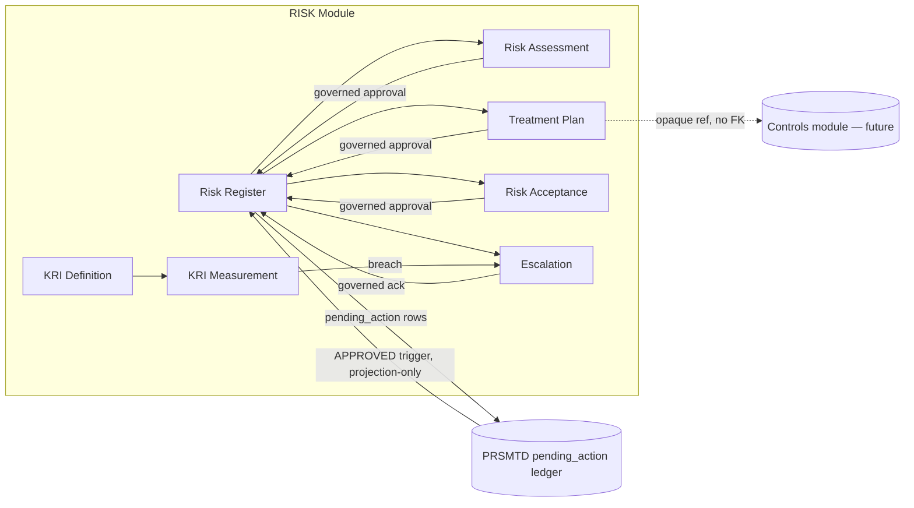
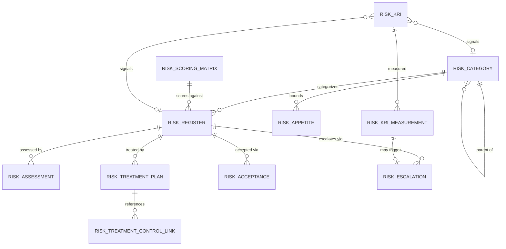
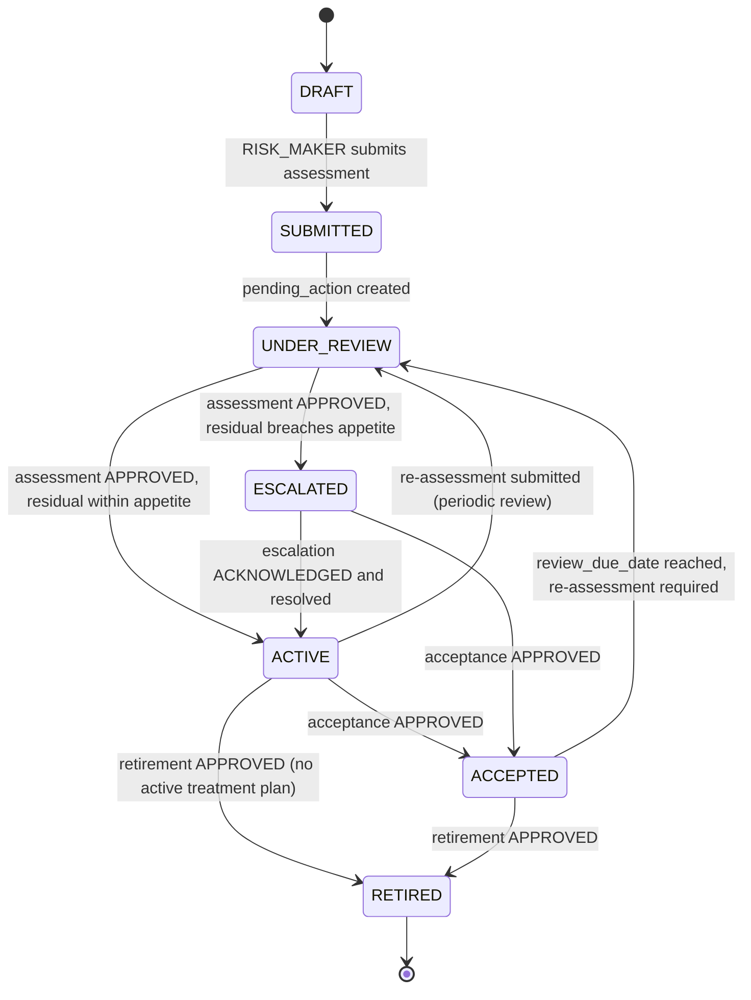
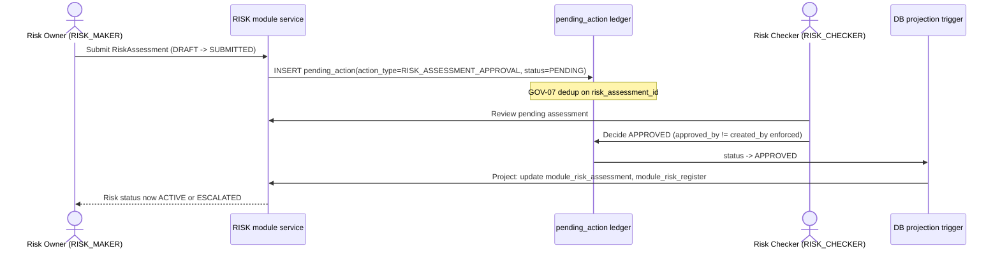
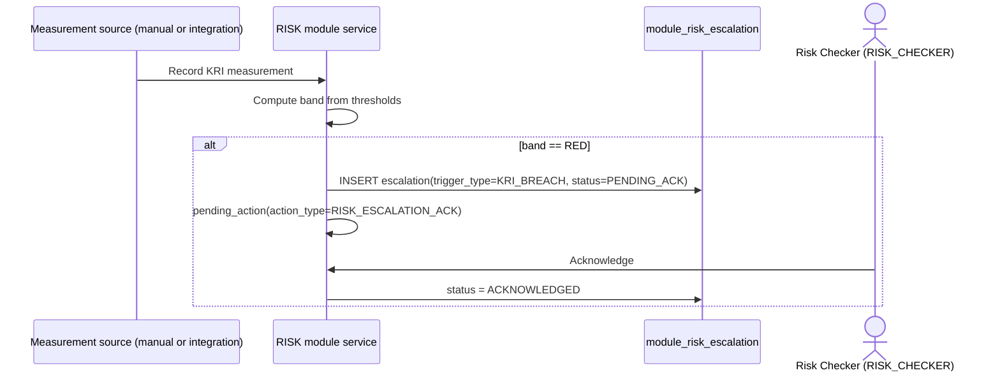

# 10.01 — Enterprise Risk Management

## Purpose

Defines the Enterprise Risk Management (ERM) capability: the risk register, scoring
methodology, Key Risk Indicators (KRIs), risk treatment, acceptance, and escalation
governance for a SEBI-regulated Mutual Fund AMC, built entirely on PRSMTD's existing
multi-tenant, governance, RBAC, and audit substrate. This is the first authoritative,
implementation-ready specification in this repository — it establishes the canonical Risk
domain and data model that later specifications (Controls, Compliance, Audit) will link
into rather than re-derive.

## Scope

**In scope**: the risk register (risk identification, categorization, inherent/residual
scoring), risk assessment lifecycle, risk appetite and scoring matrix configuration, risk
treatment planning, formal risk acceptance, KRI definition and measurement, threshold-based
escalation, and the module's security/audit/reporting/API surface.

**Out of scope** (forward-referenced, not yet specified):
- The Controls module (`docs/12-controls/`) — this spec defines an opaque link point to it
  but does not design control entities.
- The Compliance/Regulatory obligation register (`docs/11-compliance/`) — future risk source.
- Incident, Issue, and CAPA management — future risk sources and treatment-verification
  consumers; no such module exists yet in this repository or in PRSMTD.
- Quantitative/AI-assisted risk analytics (`docs/16-ai/`) — future enhancement.
- Regulatory profiles other than the SEBI Mutual Fund AMC profile (`SEBI_AMC`) — the schema
  is designed to be profile-configurable (see [Assumptions](#assumptions)), but only the
  SEBI_AMC seed content is defined here.

## Business Context

SEBI (Mutual Funds) Regulations, 1996 require AMCs and trustees to exercise due diligence
and render high standards of service. The SEBI circular *Risk Management System*
(MFD/CIR/15/19133/2002, 30 Sep 2002 — [`../reference/Risk Management System for Mutual
Funds.pdf`](../reference/Risk%20Management%20System%20for%20Mutual%20Funds.pdf)) mandates
that every mutual fund maintain an independent risk management function and gives AMCs and
their Boards of Trustees a standing obligation to review and report on risk management
practices to SEBI on a recurring basis. This module operationalizes that obligation as a
governed, auditable, platform-native capability rather than a manual/offline process (the
circular's own operating manual, prepared in 2002, presupposes largely manual and
spreadsheet-based risk tracking — this spec supersedes that with a system of record).

The risk register is also the anchor point for the rest of the eventual GRC platform: controls
treat risks (`12-controls`), compliance obligations generate risks (`11-compliance`), audit
findings surface risks (`13-audit`), and executive/regulatory reporting consumes the risk
register (`14-reporting`, `15-analytics`). Getting this domain model right on first creation
is the explicit reason this is the first spec authored in the repository.

## Regulatory Drivers

Source: [`../reference/Risk Management System for Mutual Funds.pdf`](../reference/Risk%20Management%20System%20for%20Mutual%20Funds.pdf)
(SEBI circular MFD/CIR/15/19133/2002).

| Driver | Circular reference | How this spec satisfies it |
|---|---|---|
| Independent risk management function | Appendix A, Part 1, §1 (mandatory) | `RISK_CHECKER` module role — assignable to a Compliance Officer, an internal Risk Management Committee, or an external agency (see [Authorization](#authorization)); function is organizationally independent of fund management by role assignment, not by module design. |
| Risk identification and measurement covering Fund Management, Operations, Customer Service, Marketing & Distribution, Other Business Risks | §II Framework Overview | Seeded `SEBI_AMC` risk taxonomy — see [Data Model](#data-model), Reference Data. |
| Documented risk philosophy, limits, and monitoring | §III Fund Management, Policies and Procedures | Risk Appetite Statement entity (`module_risk_appetite`) + scoring matrix configuration. |
| Maker-checker authorisation on risk-bearing decisions | Cited repeatedly as recommended/best practice throughout the circular (e.g. §III Systems) | Reuses PRSMTD's `pending_action` governance ledger — see [Workflows](#workflows). |
| Quarterly/half-yearly Board and Trustee review and reporting to SEBI | Covering letter, "How to Implement the Risk Management System" | Risk register, escalation log, and Board Risk Report — see [Reporting Requirements](#reporting-requirements). |
| Disaster Recovery / Business Contingency Plan | Appendix A, Part 1, §2 (mandatory) | Out of scope for this module — belongs to `18-deployment` (platform-level DR/BCP) and a future Business Continuity capability per the long-term vision in `CLAUDE.md`. Flagged as a gap, not silently dropped. |
| Insurance cover against third-party losses | Appendix A, Part 1, §3 (mandatory) | Out of scope for this module — this is a corporate insurance/legal obligation, not a system capability. May become a tracked risk-treatment record (`treatment.strategy = TRANSFER`) referencing an external policy, but no dedicated Insurance entity is designed here. |

## Assumptions

1. **Tenant = one AMC.** Each PRSMTD tenant is a single regulated AMC entity; the risk
   register is entirely tenant-plane data (no platform-plane risk data).
2. **Regulatory profile is configuration, not schema.** The `SEBI_AMC` risk taxonomy is
   seeded reference data (`module_risk_category`), not hardcoded categories. Future profiles
   (Banking, Insurance, etc.) are additional seed sets, editable per tenant via the
   `RISK_ADMIN` permission, not new tables or new code paths.
3. **No platform-level "regulatory profile" mechanism was found in PRSMTD `system.md` §9.**
   Module manifests appear to ship one fixed seed set per module version, not
   profile-parameterized seeds. For MVP, this spec assumes profile variation is achieved by
   tenant-level customization of reference data after module enablement (via `RISK_ADMIN`),
   which requires no new PRSMTD capability. If regulatory-profile proliferation later makes
   per-tenant manual customization unwieldy, a platform-level profile mechanism becomes a
   genuine new capability requirement — flagged in [Future Extension Points](#future-extension-points)
   and `docs/roadmap.md`, not designed here.
4. **Users referenced by this module (`risk_owner_user_id`, `assessor_user_id`, etc.) are
   platform/tenant identity records**, not module-owned data — referencing them by UUID FK is
   not a cross-*module* reference and does not trigger OWN-08/OWN-09 module boundary rules,
   since identity is core platform substrate, not another module's private schema.
5. **The Controls module does not exist yet.** Any reference from a `RiskTreatmentPlan` to a
   control is stored as an opaque UUID with no foreign key and no join — see
   [Data Model](#data-model) note on `module_risk_treatment_control_link`. The link is inert
   until `12-controls` is specified and a Controls module ships.
6. **Risk Owner and Checker are always distinct individuals.** Segregation of duties is
   enforced by PRSMTD's platform-level `approved_by <> created_by` constraint on
   `pending_action` (system.md §3) — this spec does not need to invent a separate SoD
   mechanism.
7. **Record retention period is not specified here.** The SEBI circular does not state a
   retention period for risk records; exact retention/archival rules are deferred to
   `11-compliance` once authored. This module's data is append-only/status-transitioned
   (never physically deleted), which is retention-agnostic by design.

## Dependencies

- PRSMTD `docs/authoritative/system.md` §3 (Governance model, GOV-07), §7 (Data model & RLS
  enforcement), §8 (RBAC model), §9 + §5a–§5c (Module framework, ownership guards), §4.1
  (Observability & Deterministic Trace Contract), §10 (Audit and compliance), §21
  (Authentication Surface Ownership) — all reused as-is, no PRSMTD changes required by this
  spec.
- [`../reference/Risk Management System for Mutual Funds.pdf`](../reference/Risk%20Management%20System%20for%20Mutual%20Funds.pdf) — regulatory source.
- `docs/04-domain-model/` — **not yet authored.** This spec's [Domain Model](#domain-model)
  section is the first bounded-context definition in the repository. When
  `04-domain-model/` is eventually authored to cover the full cross-context map (Risk,
  Controls, Compliance, Audit, Policy...), it should absorb and reference this section rather
  than redefine it. Flagged as a known sequencing gap, not a blocker.
- `docs/12-controls/`, `docs/11-compliance/`, `docs/13-audit/` — future specs this module
  will link to via the extension points already reserved in the data model.

## Architecture

The Risk capability is one PRSMTD module: **module code `RISK`**. It follows the module
framework exactly as documented in system.md §9/§5a–§5c:

- `moduleId`: a stable UUID minted at implementation time (module scaffolding), not fixed by
  this specification.
- Table prefix: `module_risk_*` (OWN-03 schema ownership).
- Route namespace: `/modules/RISK` (§5b4).
- API namespace: `/api/v1/modules/risk/**`, controllers in `com.prsbnjs.modules.risk` (OWN-07).
- Module role types: `MAKER`, `CHECKER`, `VIEWER` only — the closed set defined by system.md
  §8. Domain personas (Risk Owner, Chief Risk Officer, Board Risk Committee, etc.) map onto
  these three; see [Authorization](#authorization).
- `dependencies: []` at MVP. The module has zero hard PRSMTD module dependencies for its core
  register/assessment/treatment/KRI functionality. A `dependencies: [CONTROLS]` declaration
  becomes appropriate once the Controls module ships and treatment-control linkage becomes
  functionally live (per OWN-08, cross-module access must be declared).
- No platform-plane tables, no platform-plane governance actions — every governed action is
  tenant-plane (`app.plane = 'tenant'`).
- Tenant isolation, GUC binding, and session-setter usage are inherited unmodified from
  `TenantAwareDataSource` (system.md §7) — this module issues no direct `SET`/`set_config`
  calls.



## Domain Model

**Bounded context**: Risk Management. Owns the Risk register and its lifecycle exclusively;
treats Controls, Compliance obligations, Audit findings, and future Incident/Issue/CAPA
records as external contexts it references but does not own (customer-supplier relationship,
Risk as the downstream consumer of a control/obligation/finding *causing* a risk, and the
upstream owner of a treatment plan that a Controls-module control *fulfills*).

**Ubiquitous language** (authoritative within this context until `04-domain-model/` is
authored):

| Term | Definition |
|---|---|
| Risk | A register entry representing an identified source of uncertainty to the AMC's objectives, with an owner, a category, and a current inherent/residual score. |
| Inherent Risk | The risk level before any treatment/controls are considered. |
| Residual Risk | The risk level after existing treatment/controls are accounted for. |
| Risk Assessment | A point-in-time scoring event against a Risk, subject to maker-checker approval. |
| Risk Appetite | The board-approved maximum acceptable residual risk score per category, used as the escalation trigger. |
| Risk Treatment | A planned response to a Risk: Accept, Mitigate, Transfer, or Avoid. |
| Risk Acceptance | A formal, governed record that a Risk's current residual level is knowingly accepted, with a mandatory future re-review date. |
| KRI (Key Risk Indicator) | A measurable metric, tracked over time, used as an early-warning signal for a Risk or Risk Category. |
| Escalation | A governed notification raised when a Risk or KRI breaches its threshold, requiring acknowledgement by the independent risk management function. |

**Aggregates, entities, and invariants**:

- **Risk** (aggregate root) — Invariants: `residual_score <= inherent_score` is *not*
  enforced at the DB level (residual can theoretically exceed inherent if treatment fails and
  new factors emerge — this is a valid real-world state), but must never be `NULL` once
  status leaves `DRAFT`. A Risk cannot move past `SUBMITTED` without at least one `APPROVED`
  `RiskAssessment`. A Risk cannot be `RETIRED` while it has an `IN_PROGRESS` or `APPROVED`
  `RiskTreatmentPlan` (must be `CANCELLED` or `VERIFIED` first).
- **RiskAssessment** (entity, owned by Risk) — Immutable once `APPROVED`; a new assessment is
  a new row, never an edit of an approved one (append-only scoring history).
- **RiskTreatmentPlan** (entity, owned by Risk) — One or more per Risk; only one may be
  `IN_PROGRESS` at a time per Risk (business rule, enforced at application-service layer,
  mirroring GOV-07's application-layer enforcement pattern rather than a DB constraint).
- **RiskAcceptance** (entity, owned by Risk) — At most one `PENDING` or `APPROVED`-and-not-yet-
  `EXPIRED` acceptance per Risk at a time (GOV-07 logical target = `risk_id`).
- **Escalation** (entity, owned by Risk) — Created by the system (KRI breach) or by a user
  (manual/appetite breach); always requires `RISK_CHECKER` acknowledgement.
- **KRI** (aggregate root, independent lifecycle) — May link to zero-or-one Risk and/or
  zero-or-one Risk Category; a category-level KRI with no linked Risk is valid (e.g., an
  industry-wide liquidity indicator).
- **KRIMeasurement** (entity, owned by KRI) — Append-only time series; never updated after
  creation.
- **RiskCategory** (reference data) — Two-level hierarchy (category → sub-category),
  regulatory-profile-seeded, tenant-editable.
- **RiskScoringMatrix** (reference data) — Defines the likelihood × impact bands a tenant
  scores against; a tenant may define more than one (e.g., a simplified matrix for
  operational risk vs. a quantitative one for market risk) but exactly one is `is_default`.
- **RiskAppetite** (reference data / governed config) — Per-category threshold score; board-
  approved, so changes to it should themselves be a governed action in a future iteration
  (flagged in Future Extension Points — not governed at MVP to keep initial scope bounded).

## Functional Requirements

| ID | Requirement | Regulatory tie |
|---|---|---|
| FR-01 | The system shall provide a configurable, two-level risk taxonomy (category / sub-category), seeded per regulatory profile. | §II Framework Overview |
| FR-02 | `RISK_MAKER` users shall create and edit risk register entries while in `DRAFT` status. | — |
| FR-03 | The system shall score both inherent and residual risk using a configurable likelihood × impact matrix, producing a numeric score and a band label (e.g., Low/Medium/High/Critical). | §III Fund Management, Risk Management Measures |
| FR-04 | A risk assessment shall require `RISK_CHECKER` approval via the PRSMTD governance ledger before the Risk's status advances past `SUBMITTED`. | Independent risk management function (Appendix A Part 1 §1) |
| FR-05 | The assessor and the approver of any governed action on a Risk shall never be the same individual (enforced by the platform's `approved_by <> created_by` constraint). | Independent risk management function |
| FR-06 | The system shall support a risk treatment plan with strategy `ACCEPT`, `MITIGATE`, `TRANSFER`, or `AVOID`, subject to governed approval. | §III–§VII, Risk Management Measures per area |
| FR-07 | The system shall support formal, governed risk acceptance with a mandatory `review_due_date`. | — |
| FR-08 | A treatment plan may link to zero or more Controls-module control references via an opaque, non-FK cross-module reference. | — |
| FR-09 | The system shall support KRI definitions with green/amber/red thresholds and a configurable measurement frequency, linkable to a Risk and/or a Risk Category. | Risk measurement/monitoring, §III Systems |
| FR-10 | The system shall record KRI measurements as an append-only time series and compute the threshold band on each new measurement. | — |
| FR-11 | The system shall automatically raise a governed escalation when a Risk's residual score exceeds its category's `RiskAppetite` threshold, or when a KRI measurement lands in the `RED` band. | Board/Trustee review obligation |
| FR-12 | The system shall track `next_review_date` per Risk and surface overdue reviews. | Monthly/periodic progress review (covering letter) |
| FR-13 | A Risk may be retired via governed approval once no active treatment plan remains. | — |
| FR-14 | Visibility shall be role-scoped: `RISK_VIEWER` — full tenant register, read-only; `RISK_MAKER` — full read, edit own drafts; `RISK_CHECKER` — full read, plus all pending approvals across the tenant. | — |
| FR-15 | The system shall expose a risk register report, a likelihood × impact heat map, and a KRI dashboard. | Quarterly/half-yearly SEBI reporting |
| FR-16 | Every governed state transition shall be captured in the platform audit trail using canonical, non-aliased `action_type` values. | system.md §10 |
| FR-17 | The independent risk management function mandate shall be satisfiable purely by role assignment (Compliance Officer, Risk Management Committee members, or an external agency user holding `RISK_CHECKER`) — no code change required per assignment choice. | Appendix A Part 1 §1 |

## Non-Functional Requirements

| Category | Requirement |
|---|---|
| Multi-tenancy | Full tenant isolation via PRSMTD RLS (system.md §7); zero platform-plane data in this module. |
| Performance | Risk register list/filter queries shall return p95 < 500ms for tenants with up to 5,000 active risk records. |
| Scalability | Schema and query patterns must not assume a ceiling on tenant count or per-tenant risk volume beyond the platform's general multi-tenant design targets. |
| Availability | Inherits platform availability targets (`18-deployment`, not yet authored) — no module-specific SLA is defined here. |
| Auditability | Every governed transition is immutable and traceable per system.md §4.1 T1–T7; no destructive updates on assessment/acceptance/escalation history. |
| Configurability | Risk taxonomy, scoring matrix, and appetite thresholds are tenant-editable reference data, not hardcoded — required for the multi-regulatory-profile vision in `CLAUDE.md`. |
| Data retention | No physical deletion of governed records; retention/archival policy deferred to `11-compliance` (see Assumption 7). |
| Localization | Out of scope for this spec. |

## Data Model

All tables use module prefix `module_risk_`, live in the tenant plane, and carry the standard
PRSMTD columns: `id uuid PRIMARY KEY DEFAULT gen_random_uuid()`, `tenant_id uuid NOT NULL`
(RLS-scoped per system.md §7), `created_at timestamptz NOT NULL DEFAULT now()`,
`created_by uuid NOT NULL`. Lifecycle uses closed-set `status` columns, never soft-delete
(`deleted_at`), matching PRSMTD convention. This section is the canonical source for the Risk
schema — no separate `06-data-model/` document duplicates it; that section should cross-link
here once authored.

### Reference / configuration tables

| Table | Key columns | Notes |
|---|---|---|
| `module_risk_category` | `code`, `name`, `parent_category_id` (self-FK, nullable), `regulatory_profile`, `status` | Two-level hierarchy. Seeded with the `SEBI_AMC` profile below. |
| `module_risk_scoring_matrix` | `name`, `likelihood_levels int`, `impact_levels int`, `matrix_definition jsonb`, `is_default boolean`, `status` | `matrix_definition` holds band labels/thresholds for the likelihood × impact grid. |
| `module_risk_appetite` | `category_id` (FK), `threshold_score numeric`, `board_approved_date`, `effective_from`, `effective_to`, `status` | Per-category escalation trigger. Not itself governed via `pending_action` at MVP — see Future Extension Points. |

**`SEBI_AMC` seed taxonomy** (from the circular's five risk areas and their named specific
risks — Section II–VII):

| Category | Sub-categories |
|---|---|
| Fund Management | Volatility in Performance; Style Drift & Portfolio Concentration; Interest Rate Movements; Liquidity Issues; Credit Risk |
| Operations | Deal Errors; Settlement Problems; NAV & Fund Pricing Errors; Inaccurate Financial Reporting; Fraud; Failure of Mission-Critical Systems & Infrastructure; Obsolete Systems |
| Customer Service | Errors in Deal Processing; Other Investor Services; Fraud |
| Marketing & Distribution | New Product Development; Selling & Distribution |
| Other Business Risks | Critical Knowledge Loss; Skills Shortage; Non-Compliance; Third-Party Risks |

### Core register tables

| Table | Key columns | Notes |
|---|---|---|
| `module_risk_code_sequence` | `tenant_id` (PK), `last_value int` | Backs human-readable `risk_code` generation (e.g. `RISK-2026-000123`); module-local, not a platform capability. |
| `module_risk_register` | `risk_code`, `title`, `description`, `category_id` (FK), `subcategory_id` (FK, nullable), `risk_owner_user_id`, `status`, `source`, `scoring_matrix_id` (FK), `inherent_likelihood`, `inherent_impact`, `inherent_score`, `inherent_band`, `residual_likelihood`, `residual_impact`, `residual_score`, `residual_band`, `identified_date`, `last_assessed_date`, `next_review_date`, `review_frequency_days`, `updated_at` | The aggregate root. `source` ∈ `MANUAL, AUDIT_FINDING, INCIDENT, CONTROL_TEST, KRI_BREACH, COMPLIANCE_OBLIGATION, SECURITY_FINDING, THIRD_PARTY, BUSINESS_CONTINUITY` (`AUDIT_FINDING` and `CONTROL_TEST` are activated by `13-audit`/`12-controls`; `INCIDENT` is activated by `24-incident-issue-capa`, live since this document's own Session 1 authoring and never requiring a change; `COMPLIANCE_OBLIGATION` — added additively, non-breaking, per `11-compliance/01-compliance-management.md`'s Integration with Risk section — is activated by `11-compliance` for a `NON_COMPLIANT` assessment result or a `HIGH`/`CRITICAL` Compliance Exception; `SECURITY_FINDING` — added additively, non-breaking, per `09-security/01-security-management.md`'s Integration with Risk section — is activated by `09-security` for a `HIGH`/`CRITICAL` Security Finding; `THIRD_PARTY` — **added additively, non-breaking (Session 15)**, per `25-third-party-risk/01-third-party-risk-management.md`'s Integration with Risk Management section — is activated by `TPR` for a material vendor risk, classified under the existing "Other Business Risks → Third-Party Risks" `RiskCategory` sub-category (no taxonomy change required); `BUSINESS_CONTINUITY` — **added additively, non-breaking (Session 15)**, per `26-business-continuity/01-business-continuity-management.md`'s Integration with Risk Management section — is activated by `BCP` for a `HIGH`/`SEVERE`-impact Business Impact Analysis or a `CRITICAL` Continuity Exception, classified under the existing "Operations → Failure of Mission-Critical Systems & Infrastructure" `RiskCategory` sub-category). |
| `module_risk_assessment` | `risk_id` (FK), `assessment_date`, `assessor_user_id`, `inherent_likelihood`, `inherent_impact`, `residual_likelihood`, `residual_impact`, `methodology_matrix_id` (FK), `rationale`, `status`, `approved_by`, `approved_at` | Append-only history; `status` ∈ `DRAFT, SUBMITTED, APPROVED, REJECTED`. |
| `module_risk_treatment_plan` | `risk_id` (FK), `strategy`, `description`, `target_residual_score`, `owner_user_id`, `due_date`, `status`, `approved_by`, `approved_at` | `strategy` ∈ `ACCEPT, MITIGATE, TRANSFER, AVOID`; `status` ∈ `PROPOSED, APPROVED, IN_PROGRESS, COMPLETED, VERIFIED, CANCELLED`. |
| `module_risk_treatment_control_link` | `treatment_plan_id` (FK, module-local), `control_ref_id uuid` (**opaque, no FK — resolved via Controls module's `.api`/`.client` package per OWN-09 once that module exists**) | Inert until `12-controls` ships. |
| `module_risk_acceptance` | `risk_id` (FK), `justification`, `accepted_by`, `accepted_at`, `review_due_date`, `status`, `approved_by`, `approved_at` | `status` ∈ `PENDING, APPROVED, REJECTED, EXPIRED`. |
| `module_risk_escalation` | `risk_id` (FK), `trigger_type`, `triggered_at`, `escalated_to_role`, `status`, `acknowledged_by`, `acknowledged_at`, `notes` | `trigger_type` ∈ `APPETITE_BREACH, KRI_BREACH, MANUAL`; `status` ∈ `PENDING_ACK, ACKNOWLEDGED, RESOLVED`. |
| `module_risk_kri` | `name`, `description`, `linked_risk_id` (FK, nullable), `linked_category_id` (FK, nullable), `metric_definition`, `unit`, `data_source`, `measurement_frequency`, `threshold_green`, `threshold_amber`, `threshold_red`, `direction`, `status` | `direction` ∈ `HIGHER_IS_WORSE, LOWER_IS_WORSE`. |
| `module_risk_kri_measurement` | `kri_id` (FK), `measurement_date`, `value numeric`, `band`, `source`, `recorded_by` | Append-only; `band` computed on write from the KRI's thresholds. `source` ∈ `MANUAL, INTEGRATION`. |

No bespoke audit table is defined — audit trail is the platform's `audit_log` per system.md
§10, reused as-is.

### ER diagram



## Workflows

All governed transitions reuse PRSMTD's `pending_action` ledger and the Governance Ledger +
Projection pattern (system.md §3, §9): a `RISK_MAKER` proposes (creates a `PENDING`
`pending_action` row), a `RISK_CHECKER` decides (`APPROVED`/`REJECTED`), and a database
trigger — never application code — projects `APPROVED` decisions into the Risk aggregate's
state. GOV-07 dedup applies per action type, scoped to its logical target.

| `action_type` | Logical target (GOV-07 key) | Effect on APPROVED |
|---|---|---|
| `RISK_ASSESSMENT_APPROVAL` | `risk_assessment_id` | `RiskAssessment.status = APPROVED`; `Risk.inherent_*`, `Risk.residual_*`, `Risk.last_assessed_date` updated; `Risk.status` advances `SUBMITTED → UNDER_REVIEW → ACTIVE` (or `ESCALATED` if residual breaches appetite). |
| `RISK_TREATMENT_APPROVAL` | `treatment_plan_id` | `RiskTreatmentPlan.status = APPROVED`. |
| `RISK_ACCEPTANCE_APPROVAL` | `risk_id` | `RiskAcceptance.status = APPROVED`; `Risk.status = ACCEPTED`. |
| `RISK_ESCALATION_ACK` | `escalation_id` | `Escalation.status = ACKNOWLEDGED`. |
| `RISK_RETIREMENT_APPROVAL` | `risk_id` | `Risk.status = RETIRED`. |

### Risk lifecycle state machine



### Maker-checker sequence — risk assessment approval



### KRI breach → escalation



## Security Model

- **Authentication**: reused unmodified from PRSMTD §21 — JWT issuer/audience invariants,
  `(tenant_id, subject)` identity resolution via `identity_binding`. This module introduces
  no new authentication surface.
- **Tenant isolation**: reused unmodified from §7 — every table RLS-scoped on `tenant_id`,
  bound exclusively via `TenantAwareDataSource`.
- **Data classification**: risk register content is classified **Tenant Confidential**. Risk
  descriptions, treatment plans, and KRI values can reveal control gaps and operational
  vulnerabilities; access is restricted to holders of a `RISK` module role. No PII is
  expected in this module's core entities (risk owners/assessors are referenced by
  `user_id`, not by name/email, resolved at presentation time via the identity system).
- **Segregation of duties**: enforced entirely by the platform's `approved_by <> created_by`
  constraint on `pending_action` (system.md §3) — this module defines no bespoke SoD logic.
- **Threat model note**: the primary module-specific threat is unauthorized escalation
  suppression (a `RISK_CHECKER` account being the same person as the risk owner, defeating
  the independent-function mandate). This is prevented structurally by the platform
  constraint above plus the role-assignment governance already in place for
  `MODULE_ROLE_ASSIGN` (also `pending_action`-governed, per system.md §9).

## Authorization

Module role types are the closed PRSMTD set — `MAKER`, `CHECKER`, `VIEWER` (system.md §8).
Permission ids follow the `MODULECODE_ACTION` convention.

**Permissions**:

| Permission | Meaning |
|---|---|
| `RISK_VIEW` | Read risk register, assessments, treatment plans, KRIs. |
| `RISK_CREATE` | Create a new Risk in `DRAFT`. |
| `RISK_EDIT` | Edit a `DRAFT` Risk. |
| `RISK_ASSESS` | Submit a `RiskAssessment` for approval. |
| `RISK_APPROVE` | Approve/reject assessments, treatment plans, acceptances, retirements. |
| `RISK_TREAT` | Propose a `RiskTreatmentPlan`. |
| `RISK_ACCEPT` | Propose a `RiskAcceptance`. |
| `RISK_ESCALATE_ACK` | Acknowledge/resolve an `Escalation`. |
| `RISK_RETIRE` | Propose Risk retirement. |
| `RISK_ADMIN` | Manage taxonomy, scoring matrices, appetite thresholds, KRI definitions. |
| `RISK_REPORT_VIEW` | View risk reports/dashboards. |

**`roleMappings`**:

```yaml
roleMappings:
  RISK_MAKER:   [RISK_VIEW, RISK_CREATE, RISK_EDIT, RISK_ASSESS, RISK_TREAT, RISK_ACCEPT, RISK_RETIRE, RISK_REPORT_VIEW]
  RISK_CHECKER: [RISK_VIEW, RISK_APPROVE, RISK_ESCALATE_ACK, RISK_ADMIN, RISK_REPORT_VIEW]
  RISK_VIEWER:  [RISK_VIEW, RISK_REPORT_VIEW]
```

**Persona-to-module-role mapping** (personas are business language; module roles are the
enforced mechanism — this mapping is configuration at tenant onboarding, not code):

| Persona | Module role | Rationale |
|---|---|---|
| Risk Owner / Risk Analyst | `RISK_MAKER` | Day-to-day register maintenance and assessment authoring. |
| Chief Risk Officer / Risk Management Committee / Compliance Officer | `RISK_CHECKER` | Fulfils the SEBI-mandated independent risk management function (Appendix A Part 1 §1). |
| External risk management agency (if outsourced per the circular) | `RISK_CHECKER` | Circular explicitly permits outsourcing the function; satisfied by assigning the role to an external agency's user account — no code change. |
| CISO, Internal Auditor, Board Risk Committee, Trustees | `RISK_VIEWER` | Oversight/read access; Internal Audit may separately hold the platform-level `audit:view` permission (system.md §8) for cross-module audit access, which is out of this module's scope. |

## Compliance Considerations

- This module is the system of record SEBI's Board/Trustee review process points at (see
  Regulatory Drivers table) — its reports must be exportable/presentable in Board and Trustee
  meetings, which is a [Reporting Requirements](#reporting-requirements) concern, not a new
  compliance mechanism.
- The circular's mandatory DR/BCP and insurance-cover requirements are explicitly out of
  scope for this module (see Regulatory Drivers table) — they must not be silently dropped
  from the platform's overall compliance posture; they are tracked as gaps for
  `18-deployment` and a future capability respectively.
- No cross-border data residency concerns are introduced by this module beyond whatever the
  platform already guarantees.

## Audit Requirements

- Every governed transition produces an `audit_log` entry with a **canonical, non-aliased**
  `action_type` (system.md §10): `RISK_ASSESSMENT_APPROVAL`, `RISK_TREATMENT_APPROVAL`,
  `RISK_ACCEPTANCE_APPROVAL`, `RISK_ESCALATION_ACK`, `RISK_RETIREMENT_APPROVAL`.
- DAO-level trace events follow the existing closed taxonomy pattern
  `dao.<entity>.query.begin/end` (system.md §4.1) — e.g. `dao.risk_register.query.begin`. At
  implementation time these entity-specific event names must be registered/verified against
  the platform's closed event taxonomy before use; this spec assumes the pattern generalizes
  but does not itself amend the taxonomy.
- Every trace event carries `correlation_id` (T1/T7) and is sufficient for offline analysis
  (T6), inherited without modification.
- No module-specific audit table is introduced — this is a deliberate reuse decision per
  `CLAUDE.md`'s capability inventory ("reuse as the immutable audit trail substrate").

## Reporting Requirements

Cross-references `14-reporting` and `15-analytics` (not yet authored) for detailed report
specs; this section only enumerates what the Risk module must expose as source data/views:

| Report | Consumers | Regulatory tie |
|---|---|---|
| Risk Register Report | Risk Owners, CRO, Auditors | General due-diligence record |
| Risk Heat Map (likelihood × impact) | CRO, Board Risk Committee | §III–§VII risk measurement |
| Top-N Risks by Residual Score | CRO, Board | Board review obligation |
| KRI Dashboard (green/amber/red) | CRO, Risk Committee | Risk monitoring, §III Systems |
| Overdue Reviews & Treatments | Risk Owners, CRO | Monthly progress review (covering letter) |
| Escalation Log | CRO, Trustees | Board/Trustee reporting to SEBI |
| Risk Acceptance Register | CRO, Trustees, Auditors | Due diligence / audit evidence |
| Board/Trustee Risk Report (quarterly/half-yearly) | Trustees, SEBI (via existing compliance filing channels) | Explicit SEBI reporting cadence in the covering letter |

## Integration Points

| Integration | Direction | Status |
|---|---|---|
| Controls module (`12-controls`) | Risk → Controls (treatment-control linkage) | **Activated** (Session 2, 2026-07-19) — `module_risk_treatment_control_link.control_ref_id` resolves via `12-controls`' reference-resolution API; see that document's Integration with Risk Management section (no change to this document) |
| Compliance/Regulatory obligation register (`11-compliance`) | Compliance → Risk (obligation-driven risk source) | **Activated** (Session 6, 2026-07-20) — `Risk.source = COMPLIANCE_OBLIGATION` added additively; see Data Model, `module_risk_register.source` |
| Audit module (`13-audit`) | Audit → Risk (finding-driven risk source) | **Activated** (Session 5, 2026-07-20) — `Risk.source = AUDIT_FINDING` was already live at the time `13-audit` was authored and required no change to this document; see that document's Integration with Risk section |
| Security module (`09-security`) | Security → Risk (security-finding-driven risk source) | **Activated** (Session 7, 2026-07-20) — `Risk.source = SECURITY_FINDING` added additively; see Data Model, `module_risk_register.source` |
| Incident/Issue/CAPA module (`24-incident-issue-capa`) | Incident → Risk (incident-driven risk source) | **Activated** — `Risk.source = INCIDENT` was already live at this document's own Session 1 authoring and required no change when `24-incident-issue-capa` was authored (Session 11); corrected from a stale "no such module exists yet" description during this session's consistency review (Session 15) |
| Third-Party Risk module (`25-third-party-risk`) | TPR → Risk (vendor-risk-driven risk source) | **Activated** (Session 15, 2026-07-22) — `Risk.source = THIRD_PARTY` added additively; see Data Model, `module_risk_register.source` |
| Business Continuity module (`26-business-continuity`) | BCP → Risk (continuity-risk-driven risk source) | **Activated** (Session 15, 2026-07-22) — `Risk.source = BUSINESS_CONTINUITY` added additively; see Data Model, `module_risk_register.source` |
| Reporting module (`14-reporting`) | Reporting → Risk (read-only bulk/point citation) | **Activated** (Session 15, 2026-07-22) — `14-reporting` consumes `GET /reports/risk-register`, `/reports/heat-map`, `/reports/kri-dashboard` (already live, zero change) and the newly-added `GET /risks/{id}/reference` (see APIs) |
| External KRI data feeds / market data | External → KRI Measurement | `17-integrations` not yet authored; `KRIMeasurement.source = INTEGRATION` reserves the slot |

## APIs

Base path: `/api/v1/modules/risk` (OWN-07 API namespace ownership). Resource paths use
plural kebab-case nouns per `CLAUDE.md` naming standards. Approval decisions on governed
actions are made against PRSMTD's shared platform governance API for `pending_action`
records (system.md §3/§9) — this module exposes *propose* endpoints, not bespoke *approve*
endpoints, to avoid duplicating the platform's governance surface.

| Method | Path | Permission | Purpose |
|---|---|---|---|
| GET | `/risk-categories` | `RISK_VIEW` | List taxonomy |
| POST/PUT | `/risk-categories` | `RISK_ADMIN` | Manage taxonomy |
| GET | `/risk-scoring-matrices` | `RISK_VIEW` | List scoring matrices |
| POST/PUT | `/risk-scoring-matrices` | `RISK_ADMIN` | Manage scoring matrices |
| GET/PUT | `/risk-appetites` | `RISK_VIEW` / `RISK_ADMIN` | View/manage appetite thresholds |
| GET | `/risks` | `RISK_VIEW` | List/filter risk register (role-scoped per FR-14) |
| POST | `/risks` | `RISK_CREATE` | Create a `DRAFT` Risk |
| GET | `/risks/{id}` | `RISK_VIEW` | Risk detail |
| GET | `/risks/{id}/reference` | `RISK_VIEW` | Minimal cross-module resolution DTO (`id`, `risk_code`, `title`, `category`, `status`, `inherent_score`, `residual_score`) — consumed by `14-reporting`; added Session 15 |
| PUT | `/risks/{id}` | `RISK_EDIT` | Edit a `DRAFT` Risk |
| POST | `/risks/{id}/assessments` | `RISK_ASSESS` | Submit assessment → creates `pending_action` |
| GET | `/risks/{id}/assessments` | `RISK_VIEW` | Assessment history |
| POST | `/risks/{id}/treatment-plans` | `RISK_TREAT` | Propose treatment → creates `pending_action` |
| POST | `/treatment-plans/{id}/control-links` | `RISK_TREAT` | Link an opaque control reference |
| POST | `/risks/{id}/acceptances` | `RISK_ACCEPT` | Propose acceptance → creates `pending_action` |
| POST | `/risks/{id}/retirement` | `RISK_RETIRE` | Propose retirement → creates `pending_action` |
| GET | `/escalations` | `RISK_VIEW` | List escalations |
| POST | `/escalations/{id}/acknowledge` | `RISK_ESCALATE_ACK` | Acknowledge → creates `pending_action` |
| GET | `/kris` | `RISK_VIEW` | List KRIs |
| POST/PUT | `/kris` | `RISK_ADMIN` | Manage KRI definitions |
| POST | `/kris/{id}/measurements` | `RISK_VIEW` (data entry) | Record a measurement |
| GET | `/kris/{id}/measurements` | `RISK_VIEW` | Measurement history |
| GET | `/reports/risk-register` | `RISK_REPORT_VIEW` | Register export |
| GET | `/reports/heat-map` | `RISK_REPORT_VIEW` | Heat map data |
| GET | `/reports/kri-dashboard` | `RISK_REPORT_VIEW` | KRI dashboard data |

Event contracts (published, per `21-standards` naming `domain.entity.pastTenseVerb`):
`risk.assessment.approved`, `risk.treatment.approved`, `risk.acceptance.approved`,
`risk.escalation.raised`, `risk.escalation.acknowledged`, `risk.retired`. Consumers (future
Reporting/Analytics modules) are not yet specified; this spec only reserves the naming.

## Future Extension Points

- **Governed appetite changes**: `RiskAppetite` edits are not routed through `pending_action`
  at MVP (Assumption/Data Model note above); making board-approved appetite changes
  themselves a governed action is a natural next iteration.
- **Platform-level regulatory-profile mechanism**: if per-tenant manual taxonomy
  customization (Assumption 3) proves unwieldy across many regulatory profiles, a formal
  PRSMTD capability for profile-parameterized module seed data becomes a candidate new
  platform requirement — not designed here.
- **Quantitative risk analytics**: VaR, stress testing, and portfolio-level risk aggregation
  (mentioned as recommended/best practice in the circular's Fund Management section) belong
  to `16-ai` / `15-analytics` once those are specced, not to the core register.
- **AI-assisted risk narrative and scoring assistance**: candidate `16-ai` capability once
  the register has enough historical data to be useful training/context input.
- **Automated KRI ingestion**: `17-integrations` connectors feeding `KRIMeasurement.source =
  INTEGRATION` automatically instead of manual entry.
- **Incident/Issue/CAPA-sourced risks**: once those modules exist, `Risk.source` values
  `INCIDENT` and (a new) `CAPA` become live rather than reserved.
- **Persona-to-module-role mapping convention**: the pattern established in
  [Authorization](#authorization) — mapping business personas onto the closed
  MAKER/CHECKER/VIEWER set via `roleMappings` rather than inventing new module role types —
  is intended to be the standard for every future ERM module. Worth promoting to a
  `20-adr/` decision record once a second module confirms the pattern holds.

## Traceability

- **Business Requirement**: Provide the AMC with a governed, auditable enterprise risk
  register and escalation process, replacing manual/offline risk tracking.
- **Regulatory Requirement**: SEBI circular *Risk Management System* (MFD/CIR/15/19133/2002,
  30 Sep 2002) — `docs/reference/Risk Management System for Mutual Funds.pdf`, Appendix A
  Part 1 §1 (independent risk management function, mandatory), §II–§VII (risk taxonomy and
  measures), covering letter (Board/Trustee review and SEBI reporting cadence).
- **PRSMTD Capability**: Reused — governance ledger / maker-checker (`system.md §3, §9`,
  GOV-07), RBAC and module role model (`§8`), module framework and ownership guards (`§9,
  §5a–§5c`), multi-tenant RLS (`§7`), observability trace contract (`§4.1`), audit trail
  (`§10`), authentication (`§21`). **New capability required**: none confirmed at MVP;
  candidate gap flagged under Assumption 3 (regulatory-profile-parameterized module seeding)
  — deferred, not currently blocking.
- **ERM Capability**: Enterprise Risk Management (module code `RISK`) — first entry in
  `22-traceability/`.
- **Dependencies**: See [Dependencies](#dependencies) above.
- **Future Work**: See [Future Extension Points](#future-extension-points) above.

**Amendment log** (additive only; no entity, table, or workflow redesigned):
- 2026-07-20 — Added `Risk.source = COMPLIANCE_OBLIGATION` (Data Model, `module_risk_register`)
  and updated the Compliance integration point to Activated, per the additive change
  `11-compliance/01-compliance-management.md` proposed and `docs/roadmap.md`'s Next Milestone
  tracked as the repository's only remaining inert forward reference among the five authored
  modules. No other change made to this document.
- 2026-07-20 (Session 7) — Added `Risk.source = SECURITY_FINDING` (Data Model,
  `module_risk_register`) per the additive change `09-security/01-security-management.md`
  proposed in its own Integration with Risk section, and updated the Integration Points table:
  added a Security module row (Activated), and corrected two stale rows found during this
  session's consistency review — the Controls module row (already activated by `12-controls`
  since Session 2 but never updated here) and the Audit module row (already activated by
  `13-audit` since Session 5 but never updated here) now both read Activated with the correct
  originating session. No entity, table, or workflow redesigned.
- 2026-07-22 (Session 15 — Additive Change Consolidation) — Added `Risk.source = THIRD_PARTY`
  and `Risk.source = BUSINESS_CONTINUITY` (Data Model, `module_risk_register`) per the additive
  changes `25-third-party-risk/01-*` and `26-business-continuity/01-*` each proposed in their
  own Integration with Risk Management sections; added `GET /risks/{id}/reference` (APIs) per
  the additive change `14-reporting/01-reporting-management.md` proposed. Updated the
  Integration Points table: corrected the stale "Incident/Issue/CAPA (future) — no such module
  exists yet" row to Activated (`24-incident-issue-capa` was authored Session 11 but this row
  was never revisited); added Third-Party Risk, Business Continuity, and Reporting rows. No
  entity, table, or workflow redesigned.
