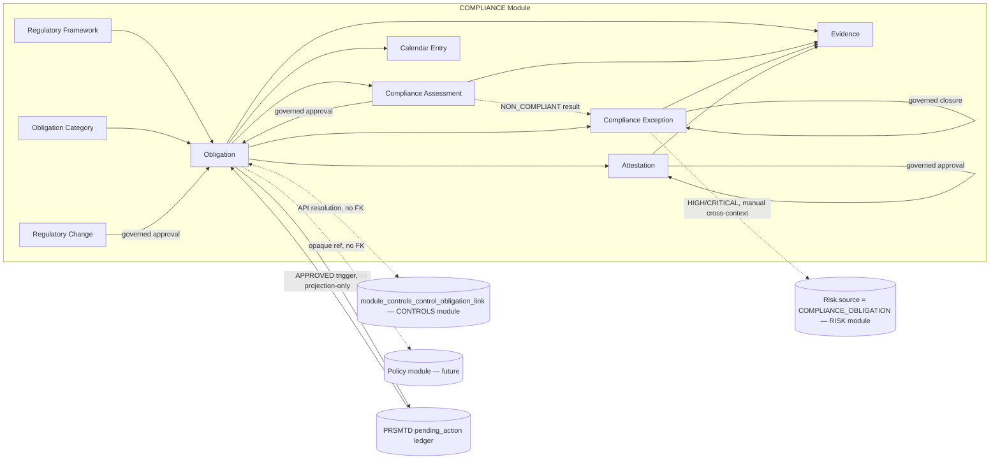
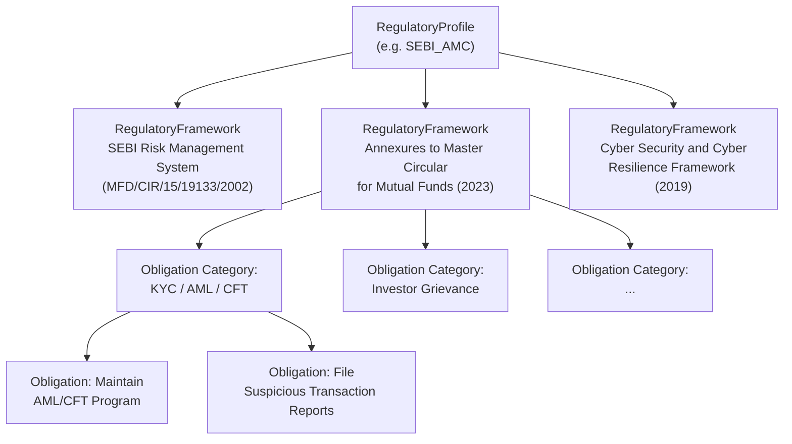
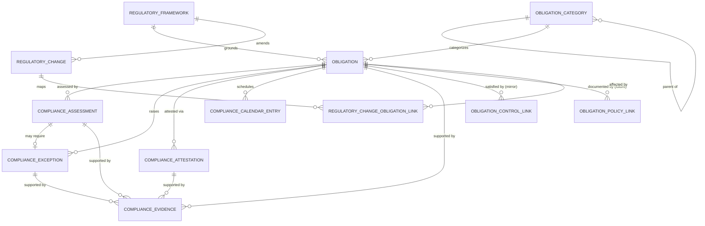
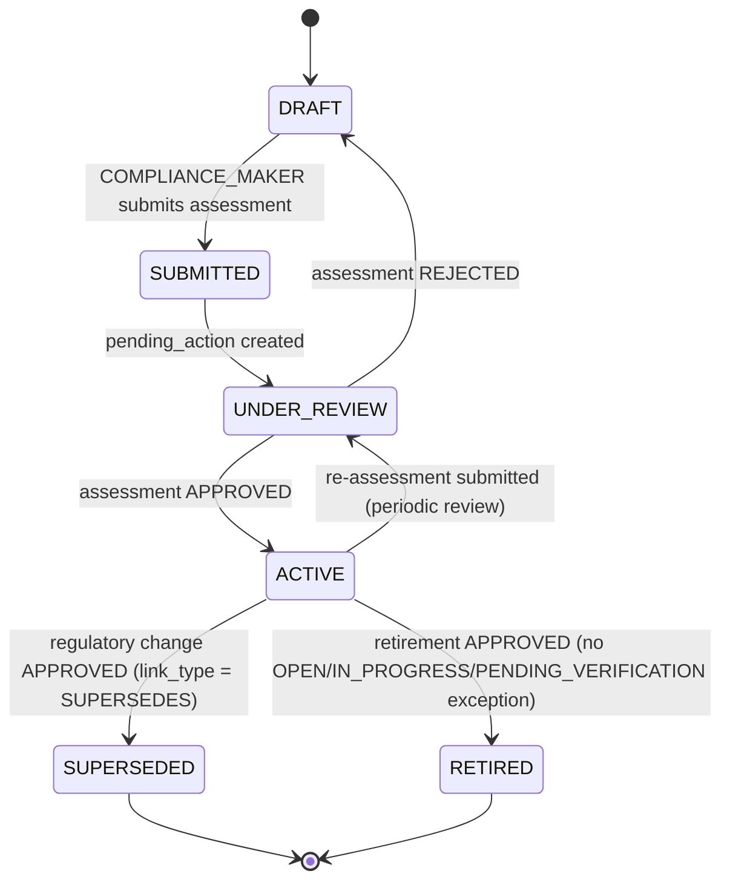
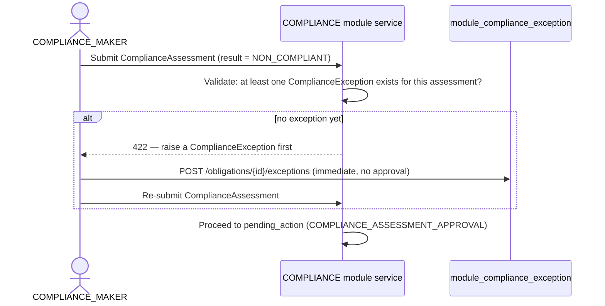
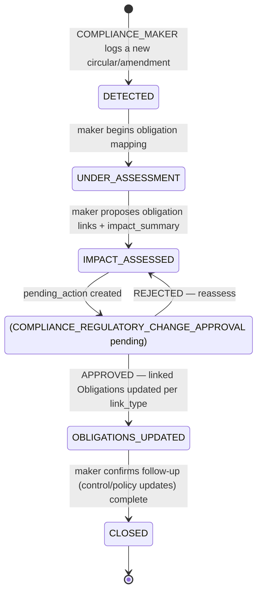
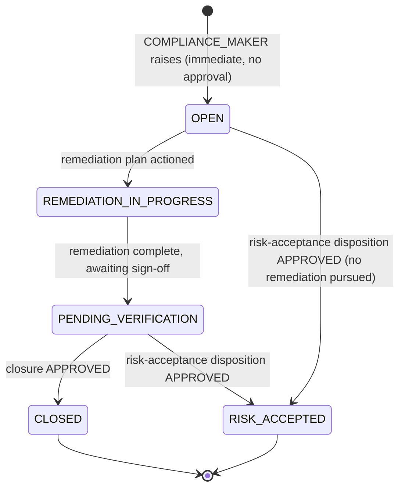

# 11.01 — Compliance Management

## Purpose

Defines the Compliance Management capability: the regulatory framework register, regulatory
obligation register, regulatory profile configuration, compliance assessment, regulatory
change management, compliance calendar, compliance exceptions, compliance attestations, and
regulatory mapping to Risk and Controls, for a SEBI-regulated Mutual Fund AMC — built
entirely on PRSMTD's existing multi-tenant, governance, RBAC, and audit substrate. This is
the fourth authoritative, implementation-ready specification in this repository. It activates
the `COMPLIANCE` bounded context reserved by
[`04-domain-model/01-enterprise-domain-model.md`](../04-domain-model/01-enterprise-domain-model.md)
(Open Host Service to `RISK` and `CONTROLS`), the opaque `Risk.source` slot reserved by
[`10-risk/01-enterprise-risk-management.md`](../10-risk/01-enterprise-risk-management.md),
and the opaque `module_controls_control_obligation_link` slot reserved by
[`12-controls/01-controls-management.md`](../12-controls/01-controls-management.md) —
without modifying any of the three.

## Scope

**In scope**: regulatory framework management, the regulatory obligation register (which
this spec treats as the same concept as "compliance requirement" — see
[Assumptions](#assumptions), Assumption 4), regulatory profile configuration, compliance
assessment (periodic compliance-status determination), regulatory mapping (obligation ↔
control, obligation ↔ risk, obligation ↔ policy), regulatory change management, the
compliance calendar, compliance exceptions, compliance attestations, compliance status, and
this module's security/audit/reporting/API surface. Compliance evidence *coordination* (not a
duplicate evidence store) is in scope; compliance evidence *storage* inherits the same
platform gap `12-controls` already flagged.

**Out of scope** (forward-referenced, not yet specified):
- The Audit module (`docs/13-audit/`) — future consumer of Obligation/ComplianceAssessment
  records and `ComplianceEvidence` as its evidentiary substrate; not designed here.
- The Policy Management module — no such module exists yet in ERM or PRSMTD; this spec
  reserves an opaque link point to it (mirroring how `10-risk` reserved this module's own
  link point before it existed) but does not design policy entities.
- Incident, Issue, and CAPA management — a `ComplianceException`'s remediation is tracked
  inline in this module until CAPA exists, mirroring `12-controls`' identical treatment of
  `ControlException`.
- A platform document/object storage capability — `ComplianceEvidence` reuses the same
  metadata-plus-opaque-`storage_ref` shape `12-controls` Assumption 4 established; this is
  the same platform capability gap, not a second one (see
  [Assumptions](#assumptions), Assumption 5).
- A general-purpose Records Retention Schedule capability (mapping record types to
  statutory retention periods) — both `10-risk` and `12-controls` deferred their own
  retention-period questions to this module; this spec closes that deferral only to the
  extent of confirming this module's own tables follow the same retention-agnostic,
  append-only convention — it does not design a cross-module retention-schedule capability
  (see [Assumptions](#assumptions), Assumption 10, and
  [Future Extension Points](#future-extension-points)).
- Regulatory profiles other than `SEBI_AMC` — schema is profile-configurable per the pattern
  `10-risk`/`12-controls` established; only `SEBI_AMC` seed content is defined here.
- Regulatory Reporting as a distinct capability (`docs/14-reporting/`) — this spec exposes
  source data/views only, per the same convention `10-risk`/`12-controls` used.

## Business Context

`10-risk` and `12-controls` were each authored with an explicit, opaque forward-reference to
this module: `Risk.source` has no value for a compliance-driven risk (a documented gap in
`10-risk`, re-surfaced with more precision by `04-domain-model`), and
`module_controls_control_obligation_link.obligation_ref_id` has sat inert since `12-controls`
was authored. Without this module, an AMC's regulatory obligation register — the set of
"AMC shall..." requirements the SEBI Mutual Fund Regulations, Master Circular annexures, and
sector-specific circulars impose — has no system of record: obligations exist only as the
narrative citations embedded in `10-risk`'s and `12-controls`' own Regulatory Drivers
tables, not as trackable, assessable, ownable register entries in their own right.

This module makes the regulatory obligation a first-class, governed record: an AMC-wide
register of what SEBI (and, per the multi-regulatory-profile vision in `CLAUDE.md`, future
regulators for other verticals) requires, whether each requirement is currently satisfied,
what evidence demonstrates that, and what happens when a circular changes or a requirement
lapses. It is deliberately an **Open Host Service** (per `04-domain-model`'s bounded context
map) rather than a consumer of `RISK` or `CONTROLS`: obligations are *facts* that Risk and
Controls each already anticipate referencing without owning, exactly as `04-domain-model`
already recorded. This mirrors `12-controls`' own relationship to `10-risk` in reverse — where
`CONTROLS` was a pure provider `RISK` became a customer of, `COMPLIANCE` is a pure provider
that `CONTROLS` (and, in the future, `RISK`) becomes a customer of.

SEBI's Annexures to the Master Circular for Mutual Funds name **Compliance Risk** as one of
the AMC's thirteen enumerated risk areas (§2.6), distinct from Operational Risk (§2.5, the
primary driver for `12-controls`) and from the standalone *Risk Management System* circular
`10-risk` is built on (§II–§VII risk taxonomy). §2.6 is this module's primary regulatory
anchor — it enumerates seventeen mandatory policy domains (KYC/AML/CFT through disclosure
requirements) an AMC must maintain, each of which becomes a trackable `Obligation` under this
module's seeded taxonomy, and a defined responsibility for filing timely regulatory reports
to the Regulator, Board, and Trustees — the direct source for this module's Compliance
Calendar and Compliance Reporting responsibilities.

## Regulatory Drivers

Source: [`../reference/Annexures to Master Circular for Mutual Funds as on March 31,
2023_p.pdf`](../reference/Annexures%20to%20Master%20Circular%20for%20Mutual%20Funds%20as%20on%20March%2031%2C%202023_p.pdf)
§2.6 Compliance Risk (text-extractable; primary source for this table), cross-referenced with
[`../reference/Risk Management System for Mutual Funds.pdf`](../reference/Risk%20Management%20System%20for%20Mutual%20Funds.pdf)
(already `10-risk`'s primary source, re-cited here only for the Board/Trustee reporting
cadence this module's Compliance Calendar and Attestation responsibilities operationalize).

| Driver | Source reference | How this spec satisfies it |
|---|---|---|
| AMC shall establish and maintain policies addressing KYC/AML/CFT, Outsourcing, Investor Grievance, Related Party Transactions, Front Running, Conflict of Interest, Employee/Insider Trading, Code of Conduct, Commission/marketing costs, anti-bribery, Fraud Risk Management, Whistleblowing, Information Security & Data Privacy, Gifts & Entertainment, Record Retention, Dealing Room Policy, and disclosure requirements | Annexures §2.6.2.1(i) a–q (mandatory) | Seeded `SEBI_AMC` `ObligationCategory` taxonomy — one category/sub-category per listed policy domain; see [Regulatory Framework Hierarchy](#regulatory-framework-hierarchy). |
| Defined responsibility for filing timely and accurate regulatory reports to the Regulator, Board of AMC, and Trustees | Annexures §2.6.2.1(ii)(a) | `ComplianceCalendarEntry` (`entry_type = FILING`) — see [Compliance Calendar](#compliance-calendar). |
| Pre-use review of marketing materials, website uploads, digital/performance advertising | Annexures §2.6.2.1(ii)(b) | Modeled as an `Obligation` under the Market Conduct category, assessed via the standard `ComplianceAssessment` lifecycle — no bespoke workflow. |
| Maintenance of all required licenses, registrations, approvals, and permissions | Annexures §2.6.2.1(ii)(g) | `Obligation` with a `ComplianceCalendarEntry` (`entry_type = RENEWAL`) under the Licensing & Registration category. |
| AML/CFT program — employee awareness, transaction monitoring, suspicious transaction reporting, training | Annexures §2.6.2.1(iii) a–d | `Obligation` register entries under the Financial Crime & AML category. |
| Report of alerts and actions taken submitted to Trustees quarterly; Trustees forward to SEBI in half-yearly reports | Annexures §2.6.2.1(iv)(a)–(b) | `ComplianceCalendarEntry` (recurrence `QUARTERLY`/`SEMI_ANNUAL`) plus the Board/Trustee Compliance Report — see [Reporting Requirements](#reporting-requirements). |
| Failure to meet regulatory obligations may result in investigations, fines, forfeiture, sanctions, or investor loss (definition of Compliance Risk) | Annexures §2.6.1 | `Obligation.compliance_status` plus governed `ComplianceException` tracking make non-compliance visible and actioned before it becomes a realized loss; a `HIGH`/`CRITICAL` exception may generate a Risk register entry via `Risk.source = COMPLIANCE_OBLIGATION` — see [Integration with Risk](#integration-with-risk). |
| Independent risk management function; Board/Trustee review cadence (already operationalized by `10-risk`) | RMS circular Appendix A Part 1 §1; covering letter | Not re-implemented here — this module's own attestation and reporting cadence *complements* `10-risk`'s existing Board Risk Report, it does not duplicate it (see [Reporting Requirements](#reporting-requirements)). |
| Maker-checker authorization on compliance sign-off | Best-practice pattern across the Annexures' approval matrices, same as `10-risk`/`12-controls` | Reuses PRSMTD's `pending_action` governance ledger — see [Workflows](#regulatory-obligation-lifecycle). |

## Assumptions

1. **Tenant = one AMC.** Same as `10-risk` Assumption 1 / `12-controls` Assumption 1 — this
   module is entirely tenant-plane data.
2. **Regulatory profile is configuration, not schema — and this module is the first to own
   the profile registry itself.** `10-risk`'s `RiskCategory.regulatory_profile` and
   `12-controls`' `ControlFamily.regulatory_profile`/`framework_tag` are plain string tags
   with no owning table (neither spec needed one at the time). This module introduces
   `module_compliance_profile` as the authoritative registry of valid `regulatory_profile`
   values. **This is additive, not corrective**: `10-risk` and `12-controls` are not modified
   to add a foreign key to this new table — their existing string tags are expected to align
   to this registry **by convention**, the same non-invasive relationship every reserved link
   in this repository uses (see `04-domain-model`'s opaque-reference shared-kernel pattern).
   Enforcement is tenant-onboarding governance discipline, not a database constraint.
3. **Users referenced by this module** (`obligation_owner_user_id`, `assessor_user_id`,
   `attested_by`, etc.) **are platform/tenant identity records**, not module-owned data — same
   reasoning as `10-risk` Assumption 4 / `12-controls` Assumption 3.
4. **"Regulatory Obligation" and "Compliance Requirement" are treated as one concept: the
   `Obligation` aggregate root.** `04-domain-model`'s canonical glossary already defines
   `Obligation` as "a specific regulatory or **contractual requirement** an AMC must
   satisfy" (emphasis added) and its [COMPLIANCE (authored)](../04-domain-model/01-enterprise-domain-model.md#compliance-authored)
   section (updated Session 7 from "(reserved)" to "(authored)," a status-label correction, not
   a redesign — see that document's own Amendment Log) anticipates exactly one aggregate root,
   `Obligation`, plus `ObligationCategory`,
   `ComplianceAssessment`, and `RegulatoryChange` — no separate "Requirement" aggregate. This
   spec honors that anticipated entity set precisely rather than introducing a second,
   overlapping aggregate root: `Obligation` **is** the tenant's ownable, assessable,
   governed record of a requirement to satisfy, whether its origin is a regulator's circular
   or (in a future profile) a contractual counterparty obligation. Splitting "the regulatory
   text" from "the tenant's operationalized requirement" into two aggregate roots was
   considered and rejected as unwarranted duplication of a concept `04-domain-model` already
   settled at single-aggregate-root granularity.
5. **This module inherits, not repeats, `12-controls`' object-storage gap.**
   `ComplianceEvidence` uses the identical metadata-plus-opaque-`storage_ref` shape
   `ControlEvidence` established (`12-controls` Assumption 4) — the same platform capability
   gap (no PRSMTD document/object storage mechanism), not a second, module-specific one. See
   [Compliance Evidence Coordination](#compliance-evidence-coordination).
6. **`module_controls_control_obligation_link` originally had no populating API on the
   `CONTROLS` side.** `12-controls` reserved the table shape (`control_id`,
   `obligation_ref_id`, opaque, no FK) but its own API surface originally defined only
   `POST /controls/{id}/references` for the *Risk* mirror registration (hardcoded to
   `module_controls_control_risk_link`'s column shape — `source_treatment_plan_id`,
   `source_risk_id` — which does not match the obligation link's columns). This spec proposed
   a new, additive endpoint on `CONTROLS` (`POST /controls/{id}/obligation-links`) to close
   that gap. **Resolved (2026-07-20)**: `12-controls/01-controls-management.md` has since
   added exactly this endpoint (additive, non-breaking, no schema change — see that
   document's "Activating the Control → Obligation Link" section and its own Amendment log).
   See [Integration with Controls](#integration-with-controls), updated to reflect activation.
7. **`Risk.source` needs an additive `COMPLIANCE_OBLIGATION` enum value.** `04-domain-model`
   already flagged this gap precisely (Future Enhancements: "Add a `Risk.source` enum value
   for Compliance-sourced risks... when `11-compliance` is authored"). This spec formally
   activates that reservation — see [Integration with Risk](#integration-with-risk). **No
   change is made to `10-risk/01-*.md`**; the enum value is exercised for the first time at
   implementation time, exactly as `12-controls` exercised `CONTROL_TEST` without changing
   `10-risk`.
8. **A `RegulatoryChange`'s governed approval never auto-creates an `Obligation` row.** When
   a regulatory change results in a genuinely new obligation (`link_type = NEW`), creating
   that `Obligation` remains a normal, separate maker action (its own `DRAFT` →
   `ComplianceAssessment` lifecycle); the `RegulatoryChange` approval only updates the
   change's own status and, for `link_type = SUPERSEDES`, the superseded `Obligation`'s
   status. A `pending_action` projection trigger updating an unrelated aggregate's *rows*
   (rather than its own status columns) would be a materially different, riskier mechanism
   than every other governed transition in this repository uses — this spec does not
   introduce it. See [Regulatory Change Workflow](#regulatory-change-workflow).
9. **`ComplianceCalendarEntry` is not routed through `pending_action` at MVP.** It is an
   operational reminder/tracking record (due-date and completion status), not itself a
   compliance-status-bearing decision — the same "not every mutation needs governance"
   precedent `10-risk`'s ungoverned `RiskAppetite` edits and `12-controls`' ungoverned
   `ControlFamily` taxonomy edits already established twice. Flagged in
   [Future Extension Points](#future-extension-points) as a candidate for governance if
   audit rigor later requires it — consistent with the open "governed configuration change"
   decision already logged in `docs/roadmap.md`.
10. **A general-purpose Records Retention Schedule capability remains unspecified.**
    `10-risk` Assumption 7 and `12-controls` Assumption 7 both deferred "record retention
    period" to this module. This spec closes that deferral only partially and explicitly:
    this module's own tables (`Obligation`, `ComplianceAssessment`, `ComplianceException`,
    `ComplianceAttestation`, `ComplianceEvidence`) are append-only/status-transitioned, never
    physically deleted — the same retention-agnostic-by-design property `10-risk` and
    `12-controls` each already claim for their own tables — so this spec introduces no new
    retention gap. A genuine, cross-module Records Retention Schedule (mapping record types
    to statutory retention periods, e.g. under SEBI recordkeeping rules) was **not** one of
    this spec's thirteen assigned responsibilities and remains a real, named future
    enhancement, not a silently dropped one — see [Future Extension Points](#future-extension-points).
11. **Compliance Officer / Checker and Maker are always distinct individuals** — enforced by
    PRSMTD's platform-level `approved_by <> created_by` constraint on `pending_action`, same
    mechanism `10-risk` Assumption 6 / `12-controls` Assumption 8 rely on; no bespoke SoD
    mechanism is designed here.
12. **A "test" of an obligation's compliance is a point-in-time assessment, not a continuous
    control.** This spec reuses a single `ComplianceAssessment` entity for every periodic
    compliance-status determination, mirroring how `12-controls` reuses one `ControlTest`
    entity for both design and operating assessments (Assumption 9) and `10-risk` reuses one
    `RiskAssessment` entity rather than separate instruments per review type.

## Dependencies

- PRSMTD `docs/authoritative/system.md` §3 (Governance model, GOV-07), §4.1 (Observability &
  Deterministic Trace Contract), §7 (Data model & RLS enforcement), §8 (RBAC model), §9 +
  §5a–§5c (Module framework, ownership guards OWN-03/04/07/08/09), §10 (Audit and
  compliance), §21 (Authentication Surface Ownership) — all reused as-is, no PRSMTD changes
  required by this spec. Confirmed via a targeted re-search (this session) that no platform
  document/object-storage or regulatory-profile-parameterized-seeding capability has been
  added since `12-controls` Assumption 4 / `10-risk` Assumption 3 were written — both gaps
  remain open exactly as those specs describe them.
- [`10-risk/01-enterprise-risk-management.md`](../10-risk/01-enterprise-risk-management.md)
  — **not modified by this spec.** Its `Risk.source` enum's currently-unused
  `COMPLIANCE_OBLIGATION` slot (proposed by `04-domain-model`, activated here) is the
  reserved value this module's exceptions may populate by manual cross-context action.
- [`12-controls/01-controls-management.md`](../12-controls/01-controls-management.md) —
  **not modified by this spec** (it was amended, additively, by a later session — see that
  document's own Amendment log). Its `module_controls_control_obligation_link` table is the
  opaque reference this module's `Obligation.id` resolves; the endpoint this spec originally
  proposed to populate it (`POST /controls/{id}/obligation-links`) is now activated — see
  [Integration with Controls](#integration-with-controls).
- [`04-domain-model/01-enterprise-domain-model.md`](../04-domain-model/01-enterprise-domain-model.md)
  — **frozen input.** This spec follows its Common Domain Patterns shared kernel
  (regulatory-profile-seeded taxonomy, governed lifecycle with append-only history,
  immediate-raise/governed-closure exception, opaque cross-context reference with local
  mirror, human-readable code sequence, descriptive `source` classification) exactly, and
  confirms — rather than redesigns — its Assumption 4 (Compliance and Regulatory Management
  are one bounded context, `COMPLIANCE`) and its `COMPLIANCE` [context-map entry](../04-domain-model/01-enterprise-domain-model.md#compliance-authored)
  (Open Host Service to `RISK` and `CONTROLS`; anticipated entities `Obligation`,
  `ObligationCategory`, `ComplianceAssessment`, `RegulatoryChange`).
- [`../reference/Annexures to Master Circular for Mutual Funds as on March 31,
  2023_p.pdf`](../reference/Annexures%20to%20Master%20Circular%20for%20Mutual%20Funds%20as%20on%20March%2031%2C%202023_p.pdf)
  §2.6 — regulatory source, re-read for this spec specifically for the Compliance Risk
  section (not previously cited by `10-risk`, which cited §II–§VII of a different source
  document, or `12-controls`, which cited §2.5/§2.11 of this same document).
- `docs/13-audit/README.md`, `docs/05-modules/README.md` — read to ground the reserved
  Audit integration point and confirm no separate `05-modules/`/`06-data-model/`/
  `08-api/`/`09-security/` document is expected for this module (all remain "Not yet
  authored" section indexes, matching `10-risk`/`12-controls`' own precedent of being the
  canonical, self-contained source for their own data/API/security content).
- `docs/22-traceability/01-master-traceability-matrix.md` — updated by this session.
- `docs/roadmap.md` — recorded this document as the recommended next milestone; updated by
  this session with progress and the next recommended milestone.

## Architecture

The Compliance capability is one PRSMTD module: **module code `COMPLIANCE`**. It follows the
generic module framework exactly as `10-risk` and `12-controls` do (system.md §9/§5a–§5c),
for consistency with the established repository pattern:

- `moduleId`: a stable UUID minted at implementation time, not fixed by this specification.
- Table prefix: `module_compliance_*` (OWN-03 schema ownership).
- Route namespace: `/modules/COMPLIANCE` (§5b4).
- API namespace: `/api/v1/modules/compliance/**`, controllers in
  `com.prsbnjs.modules.compliance` (OWN-07).
- Module role types: `MAKER`, `CHECKER`, `VIEWER` only — the closed set (system.md §8).
  Domain personas map onto these three; see [Authorization](#authorization-model).
- **`dependencies: [POLICY, INCIDENT]`** (updated Session 15 — Additive Change Consolidation;
  was `dependencies: []` at original authoring). `COMPLIANCE` remains a **pure provider toward
  `RISK`, `CONTROLS`, and `AUDIT`** — per `04-domain-model`'s Dependency Rule 4, no edge is
  ever declared in that direction: **`CONTROLS`' manifest gains `dependencies: [COMPLIANCE]`**
  (activated Session 6, see [Integration with Controls](#integration-with-controls)). The two
  dependencies above are genuinely new synchronous calls this module itself makes outward:
  `POLICY` — activated Session 10, for the `POST /obligations/{id}/policy-links` mirror-
  registration call (see [Integration with Future Policy Management](#integration-with-future-policy-management));
  `INCIDENT` — added Session 15, for the new `POST /exceptions/{id}/capa-request` call (see
  [Integration with Incident/Issue/CAPA](#integration-with-incidentissuecapa)). Neither `POLICY`
  nor `INCIDENT` declares a reciprocal dependency back on `COMPLIANCE` for either edge — each
  remains the pure-supply side of its own relationship, so no cycle is introduced.
- No platform-plane tables, no platform-plane governance actions — every governed action is
  tenant-plane (`app.plane = 'tenant'`).
- Tenant isolation, GUC binding, and session-setter usage are inherited unmodified from
  `TenantAwareDataSource` (system.md §7) — this module issues no direct `SET`/`set_config`
  calls.
- **Cross-module access is API-mediated only (OWN-08/OWN-09).** `COMPLIANCE` never reads
  `RISK`'s or `CONTROLS`' tables directly; neither reads `COMPLIANCE`'s tables directly. Every
  cross-context reference is either a manual, non-synchronous enum value
  (`Risk.source = COMPLIANCE_OBLIGATION`) or an opaque-reference-plus-mirror pair resolved
  through `.api`/`.client` packages, exactly as `10-risk` ↔ `12-controls` already established.



## Domain Model

**Bounded context**: Compliance Management. Owns the regulatory obligation register and its
lifecycle exclusively; confirms `04-domain-model` Assumption 4 (Compliance Management and
Regulatory Management are one bounded context, not two). Treats `RISK` and `CONTROLS` as
downstream customers of the facts it supplies (Open Host Service, not Customer-Supplier with
`COMPLIANCE` as customer) and treats a future `POLICY` context as its own upstream supplier
(the one relationship in this spec where `COMPLIANCE` is the customer) — see
[Architecture](#architecture) and the Integration sections below.

**Ubiquitous language** (extends, does not redefine, `04-domain-model`'s canonical glossary —
per that document's closing rule, "a term means one thing repository-wide"; every term below
is new at this layer or refines an already-reserved definition without contradicting it):

| Term | Definition |
|---|---|
| Obligation | A specific regulatory or contractual requirement an AMC must satisfy — the single aggregate root for both "regulatory obligation" and "compliance requirement" (Assumption 4). Owner, category, framework citation, status, and a current compliance-status determination. |
| Regulatory Framework | A named external regulatory source (a statute, circular, master circular, or standard) an Obligation is grounded in — e.g. the SEBI Annexures to the Master Circular for Mutual Funds. |
| Regulatory Profile | The tenant-configurable regulatory-context tag (e.g. `SEBI_AMC`) that seeds this module's, `RISK`'s, and `CONTROLS`' taxonomies. This module owns the authoritative registry of valid profile values (Assumption 2). |
| Compliance Assessment | A point-in-time determination of an Obligation's compliance status, subject to maker-checker approval — the same shape as `RiskAssessment`/`ControlTest`. |
| Compliance Status | The current, denormalized determination (`COMPLIANT`/`PARTIALLY_COMPLIANT`/`NON_COMPLIANT`/`NOT_ASSESSED`) of an Obligation, projected from its most recently `APPROVED` Compliance Assessment. |
| Regulatory Change | A tracked circular, amendment, or regulatory notification that maps to one or more Obligations — new, amended, superseded, or clarified. |
| Compliance Exception | A documented instance where an Obligation is found non-compliant or a filing/attestation is missed, tracked to a governed closure or formal risk-acceptance disposition — the same shape as `ControlException`. |
| Compliance Attestation | A governed, periodic sign-off record — either for a single Obligation or tenant-wide for a reporting period — confirming compliance status to the Board/Trustees. |
| Compliance Calendar Entry | An operational due-date tracking record (filing, review, renewal, or attestation due) linked to an Obligation, not itself a governed decision. |
| Compliance Evidence | A metadata record (integrity hash + opaque storage pointer) supporting an Obligation, Compliance Assessment, Compliance Exception, or Compliance Attestation — the same shape as `ControlEvidence` (Assumption 5). |

**Aggregates, entities, and invariants**:

- **Obligation** (aggregate root) — Cannot move past `SUBMITTED`/`UNDER_REVIEW` to `ACTIVE`
  without at least one `APPROVED` `ComplianceAssessment`. Cannot be `RETIRED` while it has a
  `ComplianceException` in status `OPEN`, `REMEDIATION_IN_PROGRESS`, or
  `PENDING_VERIFICATION` (must be `CLOSED` or `RISK_ACCEPTED` first) — the same
  "no-retirement-while-active-work-exists" shape `10-risk` and `12-controls` each enforce.
  `status = SUPERSEDED` is set only by a governed `RegulatoryChange` approval, never a direct
  maker edit (Assumption 8).
- **ComplianceAssessment** (entity, owned by Obligation) — Immutable once `APPROVED`;
  append-only history, mirroring `RiskAssessment`/`ControlTest` exactly. A `NON_COMPLIANT`
  result requires at least one associated `ComplianceException` before the assessment can
  reach `APPROVED` (business rule, enforced at the application-service layer — the same
  bad-signal-requires-exception shape `12-controls`' FAIL-`OPERATING`-test rule uses).
- **ComplianceException** (entity, owned by Obligation) — Raised immediately by a
  `COMPLIANCE_MAKER` (no governance required to open); closure or `RISK_ACCEPTED`
  disposition requires `COMPLIANCE_CHECKER` approval — identical shape to `ControlException`.
- **ComplianceAttestation** (entity, independent lifecycle, optionally linked to Obligation) —
  Append-only once `ATTESTED`; `scope_type = TENANT_WIDE` attestations have `obligation_id
  = NULL` and attest the whole register for a period.
- **ComplianceCalendarEntry** (entity, optionally linked to Obligation) — Not
  `pending_action`-governed at MVP (Assumption 9); plain operational status edits.
- **RegulatoryChange** (aggregate root, independent lifecycle) — May link zero or more
  Obligations via `RegulatoryChangeObligationLink`; its governed approval updates only its
  own status and, for `link_type = SUPERSEDES` links, the target Obligation's `status`
  (Assumption 8) — it never creates Obligation rows.
- **RegulatoryChangeObligationLink** (entity, owned by RegulatoryChange) — `link_type ∈ NEW,
  AMENDS, SUPERSEDES, CLARIFIES`.
- **ComplianceEvidence** (entity, attached to exactly one of Obligation, ComplianceAssessment,
  ComplianceException, or ComplianceAttestation) — Immutable metadata once uploaded;
  supersession creates a new row, never an edit — same convention as `ControlEvidence`.
- **RegulatoryFramework** (reference data) — Flat registry (not hierarchical), tagged with a
  `regulatory_profile` value by convention.
- **RegulatoryProfile** (reference data) — Flat registry; the authoritative source of valid
  `regulatory_profile` tag values across this module, `RiskCategory`, and `ControlFamily`
  (Assumption 2).
- **ObligationCategory** (reference data) — Two-level hierarchy (category → sub-category),
  regulatory-profile-seeded, tenant-editable — same shape as `RiskCategory`/`ControlFamily`.
- **ObligationControlLink** (entity, owned by Obligation) — A local, opaque **mirror** of a
  `CONTROLS`-module obligation-control association, populated via an inbound API call from
  `CONTROLS`, never a direct FK into `CONTROLS`' schema. See
  [Integration with Controls](#integration-with-controls).
- **ObligationPolicyLink** (entity, owned by Obligation) — Opaque, no-FK reference reserved
  for a future Policy module, exactly mirroring how `10-risk` and `12-controls` each reserved
  their own link before the referenced module existed. Inert until a Policy module ships.

## Regulatory Framework Hierarchy

Three levels, each reusing the shared-kernel taxonomy shape (`04-domain-model`, Common
Domain Patterns), grounded in the same source documents `10-risk` and `12-controls` already
cite:



**`module_compliance_profile` seed**: `SEBI_AMC` (the same profile tag `10-risk`'s
`RiskCategory` and `12-controls`' `ControlFamily` already carry by convention).

**`module_compliance_framework` seed** (all tagged `regulatory_profile = SEBI_AMC`):

| Code | Name | Issuing authority | Framework type |
|---|---|---|---|
| `SEBI_RMS_2002` | SEBI Risk Management System Circular (MFD/CIR/15/19133/2002) | SEBI | `CIRCULAR` |
| `SEBI_MC_ANNEXURES_2023` | Annexures to Master Circular for Mutual Funds (as on March 31, 2023) | SEBI | `MASTER_CIRCULAR` |
| `SEBI_CSCRF_2019` | Cyber Security and Cyber Resilience Framework for Mutual Funds AMCs (SEBI/HO/IMD/DF2/CIR/P/2019/12) | SEBI | `CIRCULAR` |

**`module_compliance_obligation_category` seed**, grounded in Annexures §2.6.2.1(i) a–q,
(ii) a–g, and (iii) a–d:

| Category | Sub-categories | Source |
|---|---|---|
| Financial Crime & AML | KYC/AML/CFT Program; Suspicious Transaction Reporting; Employee AML/CFT Training | §2.6.2.1(i)(a), (iii) a–d |
| Investor Protection & Grievance | Customer Complaints & Investor Grievance Handling; Disclosure Adequacy (liquidity, counterparty, credit risk) | §2.6.2.1(i)(c), (ii)(e) |
| Market Conduct | Front Running; Conflict of Interest; Employee/Insider Trading; Code of Conduct; Short-Selling Detection | §2.6.2.1(i)(e)–(h), (ii)(d), (ii)(f) |
| Outsourcing & Related-Party Oversight | Outsourcing Policy; Related Party Transactions | §2.6.2.1(i)(b), (d) |
| Financial Integrity & Fraud | Commission & Marketing Cost Controls; Commercial Bribes/Kickbacks; Fraud Risk Management; Whistleblowing | §2.6.2.1(i)(i)–(k) |
| Information Governance | Information Security & Data Privacy; Gifts and Entertainment; Record Retention; Dealing Room Policy | §2.6.2.1(i)(m)–(p) |
| Regulatory Reporting & Disclosure | Filing to Regulator/Board/Trustees; Marketing Material Pre-Use Review; Investment/Holdings Disclosure Consistency; Derivative/Off-Balance-Sheet Disclosures | §2.6.2.1(i)(q), (ii)(a)–(c), (e) |
| Licensing & Registration | Maintenance of Licenses, Registrations, Approvals, Permissions | §2.6.2.1(ii)(g) |
| Technology & Operational Resilience | Business Continuity / Disaster Recovery obligations; IT/cyber operational resilience | SEBI *Risk Management System* circular, Appendix A Part 1 item 1; Annexures System Audit Program Checklist item 8 (re-cited from `26-business-continuity`); **added Session 15**, per `26-business-continuity/01-*`'s Integration with Compliance Management section — the first module to discover its own primary regulatory driver had no fitting slot in this seed set |

Sub-categories use the same self-referencing `parent_category_id` mechanism
`RiskCategory`/`ControlFamily` use; shown above only where illustrative.

## Functional Requirements

| ID | Requirement | Regulatory tie |
|---|---|---|
| FR-01 | The system shall provide a configurable, two-level obligation category taxonomy, seeded per regulatory profile, and a flat registry of regulatory frameworks and regulatory profiles. | Annexures §2.6.2.1(i) |
| FR-02 | `COMPLIANCE_MAKER` users shall create and edit Obligations while in `DRAFT` status. | — |
| FR-03 | Every Obligation shall carry a mandatory `obligation_type` (`MANDATORY`/`RECOMMENDATORY`) and be linked to exactly one Regulatory Framework and one Obligation Category. | Annexures §2.6.2.1 (mandatory/recommendatory element structure) |
| FR-04 | An Obligation shall not reach `ACTIVE` status without at least one `APPROVED` `ComplianceAssessment`. | Annexures §2.6.1 |
| FR-05 | The maker and the approver of any governed action on an Obligation shall never be the same individual (platform `approved_by <> created_by` constraint). | Independent compliance sign-off, mirrors `10-risk` FR-05 / `12-controls` FR-05 |
| FR-06 | The system shall support Compliance Assessments producing a `compliance_status` result, each independently updating the Obligation's denormalized `compliance_status` on `APPROVED`. | Annexures §2.6.1 |
| FR-07 | A `NON_COMPLIANT` result on a Compliance Assessment shall require at least one associated Compliance Exception before the assessment can be `APPROVED`. | — |
| FR-08 | The system shall support Compliance Exceptions, raised immediately by a maker without prior approval, with governed closure (`CLOSED` or `RISK_ACCEPTED`) requiring checker approval. | — |
| FR-09 | An Obligation shall not be retirable while any Exception remains `OPEN`, `REMEDIATION_IN_PROGRESS`, or `PENDING_VERIFICATION`. | — |
| FR-10 | The system shall track `next_review_date` per Obligation and surface overdue reviews, and shall support recurring Compliance Calendar entries (filing, review, renewal, attestation-due) with due-date tracking. | Annexures §2.6.2.1(ii)(a), (iv)(a)–(b) |
| FR-11 | Evidence shall attach to exactly one of an Obligation, a Compliance Assessment, a Compliance Exception, or a Compliance Attestation, and shall record an integrity hash of the underlying artifact. | — |
| FR-12 | An Obligation shall expose a cross-module reference-resolution API so that `CONTROLS`' existing opaque `module_controls_control_obligation_link.obligation_ref_id` resolves to a real Obligation record without a direct FK. | Activates `12-controls` FR-13 |
| FR-13 | An Obligation shall support zero or more opaque, non-FK links to `POLICY` records (`module_compliance_obligation_policy_link`), activated via `POST /obligations/{id}/policy-links`. | — |
| FR-14 | The system shall support Regulatory Change records that track a circular/amendment and link to zero or more Obligations (`NEW`, `AMENDS`, `SUPERSEDES`, or `CLARIFIES`), with the impact-assessment-to-obligations-updated transition subject to governed approval. | 11-compliance README scope: "regulatory change management workflow" |
| FR-15 | The system shall support Compliance Attestations, either Obligation-scoped or tenant-wide for a reporting period, subject to governed approval. | Annexures §2.6.2.1(ii)(a) reporting responsibility |
| FR-16 | Visibility shall be role-scoped: `COMPLIANCE_VIEWER` — full tenant register, read-only; `COMPLIANCE_MAKER` — full read, edit own drafts/assessments/exceptions; `COMPLIANCE_CHECKER` — full read, plus all pending approvals across the tenant. | — |
| FR-17 | The independent compliance sign-off function shall be satisfiable purely by role assignment (Chief Compliance Officer, Company Secretary, Board Compliance/Audit Committee member, or an external compliance consultant holding `COMPLIANCE_CHECKER`) — no code change required per assignment choice. | Mirrors `10-risk` FR-17 / `12-controls` FR-17 |
| FR-18 | A `NON_COMPLIANT` assessment result or a `HIGH`/`CRITICAL` Compliance Exception may be used to create or link a Risk register entry via `RISK`'s `Risk.source = COMPLIANCE_OBLIGATION` value, resolved by manual cross-context action, not a synchronous service call. | Activates the `10-risk`/`04-domain-model`-reserved `source` enum value |
| FR-19 | The system shall expose a compliance register report, a compliance status dashboard, a compliance calendar view (upcoming/overdue), an exception register/aging report, a regulatory change impact report, and an attestation register. | Annexures §2.6.2.1(ii)(a), (iv)(a)–(b) |
| FR-20 | Every governed state transition shall be captured in the platform audit trail using canonical, non-aliased `action_type` values. | system.md §10 |
| FR-21 | A Compliance Exception shall expose a `capa_ref_id` resolving to a CAPA record via `INCIDENT`'s existing `POST /capa-requests` endpoint. **Added Session 15.** | Activates `24-incident-issue-capa` with zero additive change on that module's own side |
| FR-22 | `POST /obligations/{id}/references` shall accept an explicit `{source_module_code, source_entity_type, source_entity_ref_id}` payload rather than a hardcoded `CONTROLS`/`CONTROL` pair, so a second citing module (`TPR`) can register its own mirror row in `module_compliance_obligation_control_link` without a schema or endpoint change. **Added Session 15.** | Activates `25-third-party-risk`'s proposed obligation mirror-registration extension |
| FR-23 | The system shall provide a "Technology & Operational Resilience" `ObligationCategory`, seeded per regulatory profile. **Added Session 15.** | SEBI Risk Mgmt circular Appendix A Part 1 item 1; Annexures System Audit Program Checklist item 8 |

## Non-Functional Requirements

| Category | Requirement |
|---|---|
| Multi-tenancy | Full tenant isolation via PRSMTD RLS (system.md §7); zero platform-plane data in this module. |
| Performance | Obligation register list/filter queries shall return p95 < 500ms for tenants with up to 5,000 active obligation records; assessment/exception/evidence history queries shall paginate rather than return unbounded history. |
| Scalability | Schema and query patterns must not assume a ceiling on tenant count or per-tenant obligation/assessment/evidence volume beyond the platform's general multi-tenant design targets. |
| Availability | Inherits platform availability targets (`18-deployment`, not yet authored) — no module-specific SLA is defined here. |
| Auditability | Every governed transition is immutable and traceable per system.md §4.1 T1–T7; no destructive updates on assessment/exception/attestation/evidence history. |
| Configurability | Obligation category taxonomy, regulatory framework registry, and regulatory profile registry are tenant-editable reference data, not hardcoded — required for the multi-regulatory-profile vision in `CLAUDE.md`. |
| Data retention | No physical deletion of governed records; a general cross-module retention-schedule capability remains unspecified (Assumption 10). |
| Data integrity | Evidence records carry a content hash computed at upload time; binary storage integrity itself is out of scope pending the object-storage capability gap (Assumption 5). |
| Localization | Out of scope for this spec. |

## Canonical Data Model

All tables use module prefix `module_compliance_`, live in the tenant plane, and carry the
standard PRSMTD columns: `id uuid PRIMARY KEY DEFAULT gen_random_uuid()`, `tenant_id uuid NOT
NULL` (RLS-scoped per system.md §7), `created_at timestamptz NOT NULL DEFAULT now()`,
`created_by uuid NOT NULL`. Lifecycle uses closed-set `status` columns, never soft-delete
(`deleted_at`), matching PRSMTD convention and `10-risk`/`12-controls`' own data models. This
section is the canonical source for the Compliance schema — no separate `06-data-model/`
document duplicates it. Every table below follows a shared-kernel shape already established
by `10-risk`/`12-controls` (see [Dependencies](#dependencies)), chosen specifically so this
module's first schema draft needs no structural rework once real cross-context queries are
written against it.

### Reference / configuration tables

| Table | Key columns | Notes |
|---|---|---|
| `module_compliance_profile` | `code`, `name`, `description`, `status` | Flat registry of valid `regulatory_profile` tag values (Assumption 2). Seeded: `SEBI_AMC`. |
| `module_compliance_framework` | `code`, `name`, `issuing_authority`, `framework_type`, `regulatory_profile`, `citation_ref`, `effective_date`, `status` | Flat registry, tagged (not FK'd) to a profile. `framework_type` ∈ `STATUTE, CIRCULAR, MASTER_CIRCULAR, GUIDELINE, STANDARD`. Seeded per [Regulatory Framework Hierarchy](#regulatory-framework-hierarchy). |
| `module_compliance_obligation_category` | `code`, `name`, `parent_category_id` (self-FK, nullable), `regulatory_profile`, `status` | Two-level hierarchy. Seeded with the `SEBI_AMC` profile — see [Regulatory Framework Hierarchy](#regulatory-framework-hierarchy). |
| `module_compliance_code_sequence` | `tenant_id`, `entity_type` (composite PK: `OBLIGATION`, `EXCEPTION`, `ATTESTATION`, `REGULATORY_CHANGE`), `last_value int` | Backs human-readable `obligation_code` (e.g. `OBL-2026-000031`), `exception_code`, `attestation_code`, and `change_code` generation from one shared table, mirroring `12-controls`' single-table-multi-entity-type sequence shape. |

### Core tables

| Table | Key columns | Notes |
|---|---|---|
| `module_compliance_obligation` | `obligation_code`, `framework_id` (FK), `category_id` (FK), `subcategory_id` (FK, nullable), `title`, `description`, `citation_reference`, `obligation_type`, `obligation_owner_user_id`, `status`, `compliance_status`, `source`, `filing_frequency` (nullable), `effective_from`, `effective_to` (nullable), `last_assessed_date`, `next_review_date`, `review_frequency_days`, `updated_at` | The aggregate root. `obligation_type` ∈ `MANDATORY, RECOMMENDATORY`. `status` ∈ `DRAFT, SUBMITTED, UNDER_REVIEW, ACTIVE, SUPERSEDED, RETIRED`. `compliance_status` ∈ `COMPLIANT, PARTIALLY_COMPLIANT, NON_COMPLIANT, NOT_ASSESSED`. `source` ∈ `MANUAL, REGULATORY_CHANGE` (descriptive classification only, mirroring `Risk.source`/`Control.source`). `filing_frequency` ∈ `CONTINUOUS, MONTHLY, QUARTERLY, SEMI_ANNUAL, ANNUAL, AD_HOC, EVENT_DRIVEN`, same cadence enum shape `12-controls` uses for `frequency`/`test_frequency`. |
| `module_compliance_assessment` | `obligation_id` (FK), `assessment_date`, `assessor_user_id`, `compliance_status`, `rationale`, `status`, `approved_by`, `approved_at` | Append-only history; `status` ∈ `DRAFT, SUBMITTED, APPROVED, REJECTED`. `compliance_status` is the assessment's own result value, projected onto `Obligation.compliance_status` on `APPROVED`. |
| `module_compliance_exception` | `exception_code`, `obligation_id` (FK), `source_assessment_id` (FK, nullable), `category`, `description`, `identified_date`, `identified_by`, `severity`, `remediation_plan`, `remediation_owner_user_id`, `target_closure_date`, `status`, `closure_justification` (nullable), `linked_risk_id` (opaque uuid, nullable, no FK), `capa_ref_id` (opaque uuid, nullable, no FK), `approved_by` (nullable), `approved_at` (nullable), `updated_at` | `category` ∈ `ASSESSMENT_FAILURE, FILING_MISSED, POLICY_GAP, CONTROL_GAP, OTHER`. `severity` ∈ `LOW, MEDIUM, HIGH, CRITICAL`. `status` ∈ `OPEN, REMEDIATION_IN_PROGRESS, PENDING_VERIFICATION, CLOSED, RISK_ACCEPTED`. `linked_risk_id` is **opaque, no FK — resolved via `RISK`'s `.api`/`.client` package**, symmetric to `ControlException.linked_risk_id`. `capa_ref_id` — **added Session 15**, opaque, no FK, resolved via `24-incident-issue-capa`'s existing `POST /capa-requests` — see [Integration with Incident/Issue/CAPA](#integration-with-incidentissuecapa). |
| `module_compliance_attestation` | `attestation_code`, `scope_type`, `obligation_id` (FK, nullable), `period_start`, `period_end`, `attested_by`, `attestation_statement`, `status`, `approved_by`, `approved_at` | `scope_type` ∈ `OBLIGATION, TENANT_WIDE`. `obligation_id` is `NULL` when `scope_type = TENANT_WIDE`. `status` ∈ `DRAFT, SUBMITTED, ATTESTED, REJECTED`. |
| `module_compliance_calendar_entry` | `obligation_id` (FK, nullable), `title`, `entry_type`, `due_date`, `recurrence`, `status`, `completed_date`, `completed_by`, `reminder_days_before`, `updated_at` | `entry_type` ∈ `FILING, REVIEW, RENEWAL, ATTESTATION_DUE, OTHER`. `recurrence` ∈ `ONE_TIME, MONTHLY, QUARTERLY, SEMI_ANNUAL, ANNUAL`. `status` ∈ `UPCOMING, DUE, COMPLETED, OVERDUE`. Not `pending_action`-governed (Assumption 9). |
| `module_compliance_evidence` | `obligation_id` (FK, nullable), `assessment_id` (FK, nullable), `exception_id` (FK, nullable), `attestation_id` (FK, nullable), `evidence_type`, `title`, `description`, `storage_ref`, `file_name`, `mime_type`, `file_size_bytes`, `content_hash`, `collected_at`, `collected_by`, `uploaded_at`, `uploaded_by`, `status` | Exactly one of `obligation_id`/`assessment_id`/`exception_id`/`attestation_id` is non-null (application-layer invariant, extending `ControlEvidence`'s three-way rule to four). `evidence_type` ∈ `DOCUMENT, FILING_RECEIPT, SYSTEM_EXTRACT, ATTESTATION, LEGAL_OPINION, OTHER`. `status` ∈ `ACTIVE, SUPERSEDED, ARCHIVED`. `storage_ref` is opaque per Assumption 5. |
| `module_compliance_obligation_control_link` | `obligation_id` (FK), `source_module_code`, `source_entity_type`, `source_entity_ref_id` (opaque uuid, no FK), `linked_at`, `linked_by`, `status` | Local **mirror** of a citing module's own control/vendor-obligation link row, populated via an inbound API call — see [Integration with Controls](#integration-with-controls) and [Integration with Third-Party Risk Management](#integration-with-third-party-risk-management). **Generalized Session 15**: `source_module_code ∈ CONTROLS, TPR` and `source_entity_type ∈ CONTROL, VENDOR` (both closed sets, extensible by new enum values only, no migration) — previously `source_module_code`/`source_entity_type` were documented as fixed to `'CONTROLS'`/`'CONTROL'` and the resolution column was named `source_control_id`; both are widened this session (column renamed `source_entity_ref_id`) so a second citing module (`TPR`) can register its own mirror row without a schema or endpoint change, mirroring `23-policy`'s already-proven `PolicyReferenceLink` polymorphic design. No physical schema growth — the table already carried generic-shaped `source_module_code`/`source_entity_type` columns; only their documented domain and the one opaque-reference column's name changed, and only the table's pre-implementation specification, since no migration has ever been written against it. `status` ∈ `ACTIVE, REMOVED`. |
| `module_compliance_obligation_policy_link` | `obligation_id` (FK), `policy_ref_id` (opaque uuid, no FK) | **Activated (Session 10)** — corrected a stale "inert" note this session (Session 15 consistency review); resolves via `POST /obligations/{id}/policy-links`, `COMPLIANCE` is the customer initiating the link toward `POLICY`. |
| `module_compliance_regulatory_change` | `change_code`, `framework_id` (FK), `title`, `description`, `source_reference`, `detected_date`, `effective_date`, `status`, `assessed_by`, `assessed_at`, `impact_summary`, `approved_by` (nullable), `approved_at` (nullable) | `status` ∈ `DETECTED, UNDER_ASSESSMENT, IMPACT_ASSESSED, OBLIGATIONS_UPDATED, CLOSED`. |
| `module_compliance_regulatory_change_obligation_link` | `regulatory_change_id` (FK), `obligation_id` (FK), `link_type`, `notes` (nullable) | `link_type` ∈ `NEW, AMENDS, SUPERSEDES, CLARIFIES`. |

No bespoke audit table is defined — audit trail is the platform's `audit_log` per system.md
§10, reused as-is, exactly as `10-risk`/`12-controls` do.

### ER diagram



## Regulatory Obligation Lifecycle

All governed transitions reuse PRSMTD's `pending_action` ledger and the Governance Ledger +
Projection pattern (system.md §3, §9), exactly as `10-risk`/`12-controls` do: a
`COMPLIANCE_MAKER` proposes, a `COMPLIANCE_CHECKER` decides, and a database trigger — never
application code — projects `APPROVED` decisions into the Obligation aggregate's state.
GOV-07 dedup applies per action type, scoped to its logical target.

| `action_type` | Logical target (GOV-07 key) | Effect on APPROVED |
|---|---|---|
| `COMPLIANCE_ASSESSMENT_APPROVAL` | `assessment_id` | `ComplianceAssessment.status = APPROVED`; `Obligation.compliance_status`, `last_assessed_date` updated; `Obligation.status` advances `SUBMITTED → UNDER_REVIEW → ACTIVE`. |
| `COMPLIANCE_EXCEPTION_CLOSURE_APPROVAL` | `exception_id` | `ComplianceException.status = CLOSED` or `RISK_ACCEPTED` (per the proposed disposition). |
| `COMPLIANCE_ATTESTATION_APPROVAL` | `attestation_id` | `ComplianceAttestation.status = ATTESTED`. |
| `COMPLIANCE_REGULATORY_CHANGE_APPROVAL` | `regulatory_change_id` | `RegulatoryChange.status = OBLIGATIONS_UPDATED`; every linked Obligation with `link_type = SUPERSEDES` gets `Obligation.status = SUPERSEDED` (Assumption 8). |
| `COMPLIANCE_RETIREMENT_APPROVAL` | `obligation_id` | `Obligation.status = RETIRED`. |

Only five action types are needed — as with `10-risk` and `12-controls`, there is no separate
"approve the Obligation itself" action: the first `ComplianceAssessment`'s approval **is**
the governance event that activates the Obligation.

### Obligation lifecycle state machine



### Maker-checker sequence — compliance assessment approval

```mermaid
sequenceDiagram
    actor Owner as Obligation Owner (COMPLIANCE_MAKER)
    participant App as COMPLIANCE module service
    participant Ledger as pending_action ledger
    actor CCO as Chief Compliance Officer (COMPLIANCE_CHECKER)
    participant Trig as DB projection trigger

    Owner->>App: Submit ComplianceAssessment (DRAFT -> SUBMITTED)
    App->>Ledger: INSERT pending_action(action_type=COMPLIANCE_ASSESSMENT_APPROVAL, status=PENDING)
    Note over Ledger: GOV-07 dedup on assessment_id
    CCO->>App: Review pending assessment
    CCO->>Ledger: Decide APPROVED (approved_by != created_by enforced)
    Ledger->>Trig: status -> APPROVED
    Trig->>App: Project: update module_compliance_assessment, module_compliance_obligation
    App-->>Owner: Obligation compliance_status updated; status ACTIVE if this was the activating assessment
```

## Compliance Assessment Lifecycle

Covered structurally by [Regulatory Obligation Lifecycle](#regulatory-obligation-lifecycle)
above (the Assessment's own `APPROVED` transition is the same governance event that advances
the Obligation). The assessment-specific rule not shown in the state machine: **a
`NON_COMPLIANT` result blocks `APPROVED` until at least one `ComplianceException` exists**,
enforced at the application-service layer (FR-07), mirroring `12-controls` FR-07 exactly.



## Regulatory Change Workflow

Operationalizes `11-compliance/README.md`'s existing scope statement ("new circular →
obligation mapping → impact assessment → control/policy update") as a governed lifecycle,
per Assumption 8: the governed step is confirming *which* Obligations are affected and *how*
(impact assessment), never the mechanical creation of new Obligation rows.

### Regulatory change lifecycle state machine



### Sequence — regulatory change impact assessment

```mermaid
sequenceDiagram
    actor Maker as Compliance Analyst (COMPLIANCE_MAKER)
    participant App as COMPLIANCE module service
    participant Ledger as pending_action ledger
    actor CCO as Chief Compliance Officer (COMPLIANCE_CHECKER)
    participant Trig as DB projection trigger

    Maker->>App: POST /regulatory-changes (DETECTED)
    Maker->>App: POST /regulatory-changes/{id}/obligation-links (NEW/AMENDS/SUPERSEDES/CLARIFIES)
    Maker->>App: POST /regulatory-changes/{id}/impact-assessment (IMPACT_ASSESSED, impact_summary)
    App->>Ledger: INSERT pending_action(action_type=COMPLIANCE_REGULATORY_CHANGE_APPROVAL)
    CCO->>Ledger: Decide APPROVED
    Ledger->>Trig: status -> APPROVED
    Trig->>App: Project: RegulatoryChange.status=OBLIGATIONS_UPDATED; SUPERSEDES-linked Obligations -> SUPERSEDED
    App-->>Maker: Regulatory change updated; any NEW-linked Obligation still follows its own DRAFT lifecycle
```

## Compliance Evidence Coordination

This module does **not** duplicate `CONTROLS`' evidence model, nor does it re-implement
binary storage (Assumption 5). "Coordination" means two things:

1. **Compliance-native evidence**: `ComplianceEvidence` is the system of record for evidence
   that has no natural home in `CONTROLS` — filed regulatory returns, legal opinions on a
   requirement's applicability, signed Board/Trustee attestation statements — using the
   identical metadata-plus-`content_hash`-plus-opaque-`storage_ref` shape `ControlEvidence`
   established, so that if/when a platform object-storage capability ships, both modules
   bind to it identically without either needing a schema change.
2. **Aggregated view over `CONTROLS`' evidence**: for an Obligation linked to one or more
   Controls (via `module_compliance_obligation_control_link`, the mirror populated per
   [Integration with Controls](#integration-with-controls)), the Evidence Completeness
   Report (see [Reporting Requirements](#reporting-requirements)) resolves each linked
   Control's own `ControlEvidence` records through `CONTROLS`' existing reference-resolution
   API, presenting a unified "is this obligation evidenced" view **without copying or
   re-owning** `CONTROLS`' evidence rows — the same read-only, API-mediated aggregation
   `REPORTING` is expected to perform across every core-domain context per `04-domain-model`.

This is the concrete mechanism by which `04-domain-model`'s deferred "Evidence as a
Cross-Cutting Concept" decision (promote `Evidence` to a shared-kernel entity, or let each
context reuse the shape by convention) resolves for this module: **by convention**, matching
the shape without a shared table — the same choice that document left open for `13-audit` to
make when it is authored, made here for `COMPLIANCE` instead.

## Exception Management

`ComplianceException` reuses the "immediate-raise, governed-closure" shared-kernel pattern
(`04-domain-model`) identically to `ControlException`:

- Raised immediately by a `COMPLIANCE_MAKER` — an operational compliance gap should not wait
  on approval to be recorded.
- `category ∈ ASSESSMENT_FAILURE, FILING_MISSED, POLICY_GAP, CONTROL_GAP, OTHER` — the latter
  two (`POLICY_GAP`, `CONTROL_GAP`) name the two most common real-world reasons an Obligation
  goes non-compliant (no control satisfies it yet, or no policy documents the AMC's approach
  to it), giving the exception register direct signal for where `POLICY`/`CONTROLS` follow-up
  is needed — without this module reaching into either context's data to determine it.
- `severity ∈ LOW, MEDIUM, HIGH, CRITICAL` drives prioritization; a `HIGH`/`CRITICAL`
  exception's `linked_risk_id` (opaque, nullable) records a Risk register entry created via
  `Risk.source = COMPLIANCE_OBLIGATION` — see [Integration with Risk](#integration-with-risk).
- Closure (`CLOSED`) or formal acceptance (`RISK_ACCEPTED`) requires `COMPLIANCE_CHECKER`
  approval via the same `COMPLIANCE_EXCEPTION_CLOSURE_APPROVAL` action type as any other
  governed Compliance transition.

### Compliance exception lifecycle state machine



## Attestation Process

`ComplianceAttestation` operationalizes the Annexures §2.6.2.1(ii)(a) filing-responsibility
driver and the RMS circular's Board/Trustee review cadence at the compliance-status level —
distinct from, and complementary to, `10-risk`'s existing Board Risk Report (which attests
*risk* posture, not obligation-level compliance):

- `scope_type = OBLIGATION`: a point-in-time sign-off that a specific Obligation is, as of
  the attestation period, in the compliance status its most recent `ComplianceAssessment`
  claims.
- `scope_type = TENANT_WIDE`: a period-level sign-off (typically quarterly or half-yearly,
  matching Annexures §2.6.2.1(iv)(a)–(b) and the RMS circular's own reporting cadence) that
  the whole Obligation register's aggregate compliance status is materially accurate — the
  artifact a Chief Compliance Officer or Company Secretary would present to the Board or
  Trustees, and that Trustees would in turn reference in their own SEBI-facing half-yearly
  report (the same filing channel `10-risk`'s Board Risk Report already targets — this module
  supplies compliance-specific content into that channel, it does not create a new one).
- Governed via `COMPLIANCE_ATTESTATION_APPROVAL`: a `COMPLIANCE_MAKER` (Compliance Analyst)
  drafts the attestation statement, and a `COMPLIANCE_CHECKER` (Chief Compliance
  Officer/Company Secretary) approves — the approver's identity is itself part of the
  attestation's evidentiary value, hence the same `approved_by <> created_by` platform
  constraint every other governed action in this repository relies on.
- Attestation statements are immutable once `ATTESTED` — a correction is a new attestation
  row for a corrected period, never an edit, matching the append-only convention every other
  governed entity in this repository uses.

## Security Model

- **Authentication**: reused unmodified from PRSMTD §21 — same as `10-risk`/`12-controls`.
  No new authentication surface.
- **Tenant isolation**: reused unmodified from §7 — every table RLS-scoped on `tenant_id`,
  bound exclusively via `TenantAwareDataSource`.
- **Data classification**: the obligation register is classified **Tenant Confidential**
  (same tier as `RISK`'s register and `CONTROLS`' library), and `ComplianceEvidence` is
  classified **Tenant Restricted** — a stricter tier, matching `ControlEvidence`'s
  classification exactly, since compliance evidence (e.g. an AML transaction-monitoring
  extract, a legal opinion on a regulatory gap) can directly reveal exploitable compliance
  weaknesses. This module does not introduce a separate evidence-view permission at MVP, for
  the same reason `12-controls` didn't — see
  [Future Extension Points](#future-extension-points).
- **Segregation of duties**: enforced entirely by the platform's `approved_by <>
  created_by` constraint on `pending_action` (system.md §3) — no bespoke SoD logic, same as
  `10-risk`/`12-controls`.
- **Threat model note**: the primary module-specific threat is suppression or
  backdating of a known non-compliance — a `COMPLIANCE_MAKER` (or a `COMPLIANCE_CHECKER`
  acting as their own approver) failing to log a `NON_COMPLIANT` assessment, or delaying an
  exception's creation until after a filing deadline has passed. Mitigated structurally by:
  `ComplianceAssessment` and `ComplianceException` being append-only/immediate-raise; the
  maker/checker split preventing self-approval; and the FR-07 rule that a `NON_COMPLIANT`
  result cannot itself reach `APPROVED` without a corresponding, separately-timestamped
  Exception row, making backdating detectable via the platform audit trail's own timestamps
  (system.md §4.1) rather than this module inventing a bespoke tamper-detection mechanism.

## Authorization Model

Module role types are the closed PRSMTD set — `MAKER`, `CHECKER`, `VIEWER` (system.md §8).
Permission ids follow the `MODULECODE_ACTION` convention, same as `10-risk`/`12-controls`.

**Permissions**:

| Permission | Meaning |
|---|---|
| `COMPLIANCE_VIEW` | Read obligation register, assessments, exceptions, attestations, calendar, evidence. |
| `COMPLIANCE_CREATE` | Create a new Obligation in `DRAFT`. |
| `COMPLIANCE_EDIT` | Edit a `DRAFT` Obligation. |
| `COMPLIANCE_ASSESS` | Submit a `ComplianceAssessment` for approval. |
| `COMPLIANCE_APPROVE` | Approve/reject assessments, exception closures, attestations, regulatory changes, retirements. |
| `COMPLIANCE_EXCEPTION_RAISE` | Raise a `ComplianceException` (immediate, no approval required). |
| `COMPLIANCE_EXCEPTION_CLOSE` | Propose exception closure or risk-acceptance disposition. |
| `COMPLIANCE_ATTEST` | Propose a `ComplianceAttestation`. |
| `COMPLIANCE_CALENDAR_MANAGE` | Create/update Compliance Calendar entries and mark them complete. |
| `COMPLIANCE_CHANGE_MANAGE` | Propose a `RegulatoryChange`, its obligation links, and its impact assessment. |
| `COMPLIANCE_RETIRE` | Propose Obligation retirement. |
| `COMPLIANCE_ADMIN` | Manage obligation category taxonomy, regulatory framework registry, regulatory profile registry. |
| `COMPLIANCE_REPORT_VIEW` | View compliance reports/dashboards. |

**`roleMappings`**:

```yaml
roleMappings:
  COMPLIANCE_MAKER:   [COMPLIANCE_VIEW, COMPLIANCE_CREATE, COMPLIANCE_EDIT, COMPLIANCE_ASSESS, COMPLIANCE_EXCEPTION_RAISE, COMPLIANCE_EXCEPTION_CLOSE, COMPLIANCE_ATTEST, COMPLIANCE_CALENDAR_MANAGE, COMPLIANCE_CHANGE_MANAGE, COMPLIANCE_RETIRE, COMPLIANCE_REPORT_VIEW]
  COMPLIANCE_CHECKER: [COMPLIANCE_VIEW, COMPLIANCE_APPROVE, COMPLIANCE_ADMIN, COMPLIANCE_REPORT_VIEW]
  COMPLIANCE_VIEWER:  [COMPLIANCE_VIEW, COMPLIANCE_REPORT_VIEW]
```

**Persona-to-module-role mapping** (following the convention `10-risk` established and
`12-controls` confirmed — personas are business language, module roles are the enforced
mechanism; the mapping is tenant-onboarding configuration, not code):

| Persona | Module role | Rationale |
|---|---|---|
| Compliance Analyst / Compliance Executive (1st line, day-to-day tracking) | `COMPLIANCE_MAKER` | Obligation register maintenance, assessment submission, exception raising, calendar upkeep, regulatory-change logging. |
| Chief Compliance Officer / Company Secretary / Board Compliance or Audit Committee member | `COMPLIANCE_CHECKER` | Independent sign-off, mirroring the independent-function pattern `10-risk`/`12-controls` each establish. |
| External compliance consultant / law firm (regulatory interpretation outsourced) | `COMPLIANCE_CHECKER` | Satisfied by role assignment to an external agency's user account — no code change, mirroring `10-risk`'s identical outsourcing accommodation. |
| CISO, Internal Audit, Board Audit Committee, Trustees, Regulator-facing liaison | `COMPLIANCE_VIEWER` | Oversight/read access; Internal Audit may separately hold the platform-level `audit:view` permission for cross-module audit access, out of this module's scope. |

## Compliance Considerations

- This module is the system of record the Annexures §2.6 Compliance Risk section and the
  RMS circular's Board/Trustee reporting cadence point at — its register, exception aging,
  and attestation history must be exportable/presentable to the Board, Trustees, and SEBI
  (via existing filing channels), a [Reporting Requirements](#reporting-requirements)
  concern, not a new compliance mechanism.
- This module does not duplicate `10-risk`'s independent-risk-management-function mandate or
  `12-controls`' control-testing mandate — it tracks the regulatory *requirement* those
  mandates satisfy as one line among many in the Obligation register, cross-referenced to
  each module's own existing evidence (Risk's escalation log; Controls' test/evidence
  history) rather than re-attesting either module's content itself.
- The object-storage gap (Assumption 5) means this module cannot yet fully satisfy an
  auditor's or regulator's expectation of retrievable binary evidence — flagged, not
  silently dropped, same treatment `12-controls` already gave this gap.
- No cross-border data residency concerns are introduced beyond whatever the platform
  already guarantees.

## Audit Requirements

- Every governed transition produces an `audit_log` entry with a **canonical, non-aliased**
  `action_type` (system.md §10): `COMPLIANCE_ASSESSMENT_APPROVAL`,
  `COMPLIANCE_EXCEPTION_CLOSURE_APPROVAL`, `COMPLIANCE_ATTESTATION_APPROVAL`,
  `COMPLIANCE_REGULATORY_CHANGE_APPROVAL`, `COMPLIANCE_RETIREMENT_APPROVAL`.
- DAO-level trace events follow the existing closed taxonomy pattern
  `dao.<entity>.query.begin/end` (system.md §4.1) — e.g. `dao.obligation.query.begin`. As
  with `10-risk`/`12-controls`, these entity-specific event names must be
  registered/verified against the platform's closed event taxonomy before use at
  implementation time.
- Every trace event carries `correlation_id` (T1/T7), inherited without modification.
- No module-specific audit table is introduced — deliberate reuse of the platform's
  immutable audit trail substrate, same decision `10-risk`/`12-controls` made.

## Reporting Requirements

Cross-references `14-reporting` and `15-analytics` (not yet authored); this section only
enumerates what this module must expose as source data/views, per the same convention
`10-risk`/`12-controls` used:

| Report | Consumers | Regulatory tie |
|---|---|---|
| Compliance Register Report | Compliance Officer, Board, Auditors | General due-diligence record |
| Compliance Status Dashboard (by framework, by category) | Compliance Officer, CCO, Board | Annexures §2.6.1 compliance risk monitoring |
| Compliance Calendar (upcoming/overdue filings, reviews, renewals) | Compliance Officer, Company Secretary | Annexures §2.6.2.1(ii)(a) filing responsibility |
| Exception Register & Aging | Compliance, Internal Audit, Board Audit Committee | Annexures §2.6.1 compliance-risk/sanctions exposure |
| Regulatory Change Impact Report | Compliance, Legal, Board | 11-compliance README scope: regulatory change management |
| Attestation Register | Board, Trustees, SEBI (via existing compliance filing channels) | Annexures §2.6.2.1(ii)(a); RMS covering letter Board/Trustee cadence |
| Quarterly/Half-Yearly Compliance Report to Trustees | Trustees, SEBI | Annexures §2.6.2.1(iv)(a)–(b) |
| Evidence Completeness Report (obligations missing evidence or a linked Control) | Compliance, Internal Audit | Audit-readiness, mirrors `12-controls`' identical report |

## Integration with Risk

`10-risk`'s `Risk.source` enum (`MANUAL, AUDIT_FINDING, INCIDENT, CONTROL_TEST, KRI_BREACH`)
has no value for a compliance-driven risk — a gap `04-domain-model` already flagged with
precision. This spec formally activates that reservation, exactly as `12-controls` activated
`CONTROL_TEST`:

1. **`Risk.source = COMPLIANCE_OBLIGATION` activation (activated 2026-07-20)**: when a
   Compliance Assessment result is `NON_COMPLIANT` or a `HIGH`/`CRITICAL`
   `ComplianceException` is raised, a `COMPLIANCE_MAKER` or `RISK_MAKER` may manually create
   a new Risk register entry in `RISK` using this value, optionally recording the
   originating `obligation_id` in that Risk's own description field. This is a **manual
   business-process action**, not a synchronous service call — no `dependencies:` edge is
   required on either module's manifest, the same non-invasive treatment
   `12-controls`' `CONTROL_TEST` activation used.
2. **`ComplianceException.linked_risk_id` mirror**: once such a Risk is created, its `id` is
   recorded in the originating `ComplianceException.linked_risk_id` (opaque, nullable, no
   FK) for this module's own reporting — identical shape and purpose to
   `ControlException.linked_risk_id`.
3. **Regulatory profile alignment (descriptive only)**: `10-risk`'s existing
   `RiskCategory.regulatory_profile` string tag is expected to align, by convention, to this
   module's `module_compliance_profile` registry (Assumption 2) — no FK, no `10-risk`
   schema change.

**What this did not require of `RISK`**: no schema change, no new table, no new permission,
no new `pending_action.action_type`. **Resolved (2026-07-20)**: `10-risk`'s `Risk.source`
enum now carries the additive `COMPLIANCE_OBLIGATION` value — the same one-line, non-breaking
change `12-controls` made live for `CONTROL_TEST` — see `10-risk/01-*.md`'s own Amendment log.
No other change was made to that document.

## Integration with Controls

This is the primary activation this spec delivers, mirroring `12-controls`' own
"Integration with Risk Management" section exactly, with the supplier/customer roles
inverted: `04-domain-model` models `COMPLIANCE` as an **Open Host Service to `CONTROLS`**
(`CONTROLS` is the customer, `COMPLIANCE` is the supplier) — the reverse of the
`RISK`-is-customer relationship `12-controls` activated toward `RISK`.

`12-controls`' `module_controls_control_obligation_link` table already exists with an
`obligation_ref_id uuid` column documented as "opaque, no FK... inert until `11-compliance`
ships." Nothing about that table changes. What this module adds, entirely on the
`COMPLIANCE` side, plus one proposed (not built) addition on the `CONTROLS` side:

1. **Resolution direction (Controls → Compliance)**:
   `GET /api/v1/modules/compliance/obligations/{id}/reference` returns a minimal, stable
   DTO (`id`, `obligation_code`, `title`, `category`, `obligation_type`, `status`,
   `compliance_status`) for `CONTROLS`' presentation layer to resolve an `obligation_ref_id`
   for display against a Control. Guarded by `COMPLIANCE_VIEW`.
2. **Mirror direction (Compliance's own reporting)**:
   `POST /api/v1/modules/compliance/obligations/{id}/references` is called by `CONTROLS`'
   backend, server-to-server, populating `module_compliance_obligation_control_link` — this
   module's own "which controls satisfy this obligation" view, without ever querying
   `CONTROLS`' tables directly (OWN-08/OWN-09 compliant). **Generalized (Session 15)**: this
   endpoint now accepts an explicit `{source_module_code: 'CONTROLS', source_entity_type:
   'CONTROL', source_entity_ref_id}` payload rather than hardcoding those first two fields —
   `CONTROLS`' own existing call is unaffected (it now passes explicitly what was previously
   implicit), and the same endpoint/table is reused, not duplicated, by `TPR` — see
   [Integration with Third-Party Risk Management](#integration-with-third-party-risk-management).
3. **Activated (2026-07-20): a `CONTROLS`-side initiating endpoint.** For step 2 to be
   exercised, `CONTROLS` needed its own endpoint — this spec originally proposed
   `POST /api/v1/modules/controls/controls/{id}/obligation-links {obligation_ref_id}`,
   inserting into `module_controls_control_obligation_link` and then calling this module's
   `POST /obligations/{id}/references` (mirroring exactly how `10-risk`'s existing
   `POST /treatment-plans/{id}/control-links` handler calls `CONTROLS`' reference API today).
   `12-controls/01-controls-management.md` has since added exactly this endpoint (see that
   document's "Activating the Control → Obligation Link" section) — additive, non-breaking,
   no schema change to the already-existing `module_controls_control_obligation_link` table
   (Assumption 6). **No redesign was made to `12-controls/01-*.md`** — only the proposed
   endpoint itself, exactly as proposed here.

```mermaid
sequenceDiagram
    actor Owner as Control Owner (CONTROLS_MAKER)
    participant CtlApp as CONTROLS module service
    participant CtlLink as module_controls_control_obligation_link
    participant CompApi as COMPLIANCE module API (.api package)
    participant CompLink as module_compliance_obligation_control_link

    Owner->>CtlApp: POST /controls/{id}/obligation-links {obligation_ref_id}  (activated — see item 3)
    CtlApp->>CtlLink: INSERT (control_id, obligation_ref_id) — CONTROLS' own table, opaque
    CtlApp->>CompApi: POST /obligations/{obligation_ref_id}/references (server-to-server, OWN-09 client call)
    CompApi->>CompApi: Validate obligation exists and is not RETIRED
    CompApi->>CompLink: INSERT mirror row (obligation_id, source_control_id, ...)
    CompApi-->>CtlApp: 201 Created
    CtlApp-->>Owner: Link created; Obligation detail resolvable via GET /obligations/{id}/reference
```

**Manifest consequence**: now that item 3 is built, `CONTROLS`' manifest gains
`dependencies: [COMPLIANCE]` at implementation time — additive metadata, not a domain/data
model redesign, the same non-invasive change `12-controls` proposed for its own relationship
to `RISK`. `COMPLIANCE`'s own manifest stays `dependencies: []` — it remains the
pure-provider side of this relationship throughout, per `04-domain-model`'s Dependency Rule 4.

## Integration with Future Audit

Per `04-domain-model`, `AUDIT` is **Conformist** toward `COMPLIANCE` (alongside `RISK` and
`CONTROLS`) — it consumes this module's facts without renegotiating its model:

| Integration | Direction | Status |
|---|---|---|
| Obligation / Compliance Assessment as audit universe input | Audit → Compliance (audit scoping consumes the obligation register) | Not yet specified; `04-domain-model` already models `AUDIT` as Conformist to `COMPLIANCE`. |
| `ComplianceEvidence` as audit evidentiary substrate | Audit → Compliance (evidence reuse) | Not yet specified; this module's evidence shape is designed to be reused by convention, mirroring `12-controls`' identical expectation for `ControlEvidence` (see [Compliance Evidence Coordination](#compliance-evidence-coordination)). |
| Regulatory Change impact assessments as a Finding source | Audit → Compliance | Not yet specified; a `RegulatoryChange` left `UNDER_ASSESSMENT` past its `effective_date` is a natural candidate Finding trigger for a future `13-audit` risk-based audit plan — noted, not designed. |

No API or schema commitment is made here beyond reserving these shapes, matching the same
restraint `10-risk`/`12-controls` exercised toward `13-audit`.

## Integration with Future Policy Management

Per `04-domain-model`, `POLICY` is an **Open Host Service to `COMPLIANCE`** (the one
relationship in this spec where `COMPLIANCE` is the customer, not the supplier): a Policy is
the documented, versioned basis an Obligation's satisfaction cites, mirroring exactly how
`12-controls` reserved its own forward-looking Policy link.

- `module_compliance_obligation_policy_link` (`obligation_id`, `policy_ref_id` opaque, no
  FK) is reserved now, inert until a Policy module ships — identical shape to
  `12-controls`' own `module_controls_control_obligation_link` before this spec activated it.
- When a Policy module ships, **this module's own manifest** gains `dependencies: [POLICY]`
  — a future, additive change to *this* spec's own architecture declaration (not a
  retroactive edit to a frozen document, since this spec is being authored now).
- `POLICY`'s own future spec is expected to expose the same two-endpoint
  resolution/mirror-registration pattern `COMPLIANCE` exposes to `CONTROLS` in this
  document — `COMPLIANCE` would be the customer calling into it, the same role `CONTROLS`
  plays toward `COMPLIANCE` above.

## Integration with Third-Party Risk Management

**Added Session 15 (Additive Change Consolidation)**, resolving `25-third-party-risk/01-*`'s
own proposed, not-yet-applied extension — that document's Assumption 8 explicitly declined to
assume `POST /obligations/{id}/references` was reusable without verification, since it was
documented as shaped specifically for `CONTROLS` (a single-caller endpoint, the same limitation
`12-controls`' own `POST /controls/{id}/references` had before `11-compliance` first exposed
this pattern). Resolved here by **generalizing, not duplicating**, per the option that
document's own text named first:

1. **Resolution direction (`TPR` → `COMPLIANCE`, zero additive change, unchanged)**:
   `GET /api/v1/modules/compliance/obligations/{id}/reference` resolves
   `module_tpr_vendor_obligation_link.obligation_ref_id` for display — already built,
   guarded solely by `COMPLIANCE_VIEW`, making no assumption about caller identity.
2. **Mirror direction (Compliance's own reporting) — now generalized**: `TPR`'s backend calls
   the same `POST /api/v1/modules/compliance/obligations/{id}/references
   {source_module_code: 'TPR', source_entity_type: 'VENDOR', source_entity_ref_id: vendorId}`
   `CONTROLS` already calls, populating the same, now-polymorphic
   `module_compliance_obligation_control_link` table (see [Canonical Data
   Model](#canonical-data-model)) — no new table, no new endpoint, mirroring exactly how
   `23-policy`'s `PolicyReferenceLink` was designed from the start to need "only a new enum
   value, not a new migration" for a third or fourth citing module.
3. **`VendorAssessment.obligation_ref_id`** (`assessment_type = COMPLIANCE_ASSESSMENT`),
   already built on `TPR`'s own side, resolves via item 1 with no change here.

**What this module builds without redesigning anything**: a second citing module (`TPR`)
fully served by the same endpoint and table `CONTROLS` already uses — the same "propose a
generalization, not a dedicated second table" resolution `23-policy`'s own polymorphic design
proved out first.

## Integration with Incident/Issue/CAPA

**Added Session 15**, per `24-incident-issue-capa/01-*`'s own proposed, not-yet-applied
extension:

- **`POST /exceptions/{id}/capa-request`** (guarded by `COMPLIANCE_EXCEPTION_CLOSE`) — calls
  `INCIDENT`'s existing `POST /capa-requests {source_module_code: 'COMPLIANCE',
  source_entity_type: 'COMPLIANCE_EXCEPTION', source_entity_ref_id: exceptionId}`
  (server-to-server, OWN-09), storing the returned `capa_ref_id` on
  `module_compliance_exception`. No change required on `INCIDENT`'s side — `POST
  /capa-requests` was built generically from its own original authoring.
- **Manifest consequence**: this module's manifest gains `dependencies: [INCIDENT]` (see
  [Architecture](#architecture)). `INCIDENT`'s own manifest carries no reciprocal dependency —
  pure-provider side, consistent with every other module's activation of this same endpoint.

## Integration with Future Regulatory Reporting

Per `04-domain-model`, `REPORTING` is **Conformist, read-only** over every core-domain
context including `COMPLIANCE`. This section only enumerates what this module must expose as
source data/views — already done in full in
[Reporting Requirements](#reporting-requirements); no additional commitment is made here,
matching the identical restraint `10-risk`/`12-controls` exercised toward `14-reporting`/
`15-analytics`.

## API Surface

Base path: `/api/v1/modules/compliance` (OWN-07 API namespace ownership). Resource paths use
plural kebab-case nouns per `CLAUDE.md` naming standards. Approval decisions on governed
actions are made against PRSMTD's shared platform governance API for `pending_action`
records — this module exposes *propose* endpoints, not bespoke *approve* endpoints, same as
`10-risk`/`12-controls`.

| Method | Path | Permission | Purpose |
|---|---|---|---|
| GET | `/regulatory-profiles` | `COMPLIANCE_VIEW` | List regulatory profile registry |
| POST/PUT | `/regulatory-profiles` | `COMPLIANCE_ADMIN` | Manage regulatory profile registry |
| GET | `/regulatory-frameworks` | `COMPLIANCE_VIEW` | List frameworks |
| POST/PUT | `/regulatory-frameworks` | `COMPLIANCE_ADMIN` | Manage frameworks |
| GET | `/obligation-categories` | `COMPLIANCE_VIEW` | List taxonomy |
| POST/PUT | `/obligation-categories` | `COMPLIANCE_ADMIN` | Manage taxonomy |
| GET | `/obligations` | `COMPLIANCE_VIEW` | List/filter obligation register (role-scoped per FR-16) |
| POST | `/obligations` | `COMPLIANCE_CREATE` | Create a `DRAFT` Obligation |
| GET | `/obligations/{id}` | `COMPLIANCE_VIEW` | Obligation detail |
| PUT | `/obligations/{id}` | `COMPLIANCE_EDIT` | Edit a `DRAFT` Obligation |
| GET | `/obligations/{id}/reference` | `COMPLIANCE_VIEW` | Minimal cross-module resolution DTO (consumed by `CONTROLS`) |
| POST | `/obligations/{id}/references` | `COMPLIANCE_VIEW` | Register a mirror reference from a citing module — `CONTROLS` or, since Session 15, `TPR` (server-to-server; accepts explicit `source_module_code`/`source_entity_type`; see [Integration with Controls](#integration-with-controls) and [Integration with Third-Party Risk Management](#integration-with-third-party-risk-management)) |
| POST | `/obligations/{id}/assessments` | `COMPLIANCE_ASSESS` | Submit assessment → creates `pending_action` |
| GET | `/obligations/{id}/assessments` | `COMPLIANCE_VIEW` | Assessment history |
| POST | `/obligations/{id}/exceptions` | `COMPLIANCE_EXCEPTION_RAISE` | Raise an exception (immediate) |
| POST | `/exceptions/{id}/closure` | `COMPLIANCE_EXCEPTION_CLOSE` | Propose closure/risk-acceptance → creates `pending_action` |
| GET | `/exceptions` | `COMPLIANCE_VIEW` | List exceptions |
| POST | `/obligations/{id}/policy-links` | `COMPLIANCE_EDIT` | Link an opaque `POLICY` reference; calls `POLICY`'s mirror-registration API server-to-server — **activated Session 10** |
| POST | `/exceptions/{id}/capa-request` | `COMPLIANCE_EXCEPTION_CLOSE` | Request a CAPA via `INCIDENT`'s `POST /capa-requests` (see [Integration with Incident/Issue/CAPA](#integration-with-incidentissuecapa)); added Session 15 |
| POST | `/attestations` | `COMPLIANCE_ATTEST` | Propose an attestation → creates `pending_action` |
| GET | `/attestations` | `COMPLIANCE_VIEW` | List attestations |
| GET/POST | `/calendar-entries` | `COMPLIANCE_VIEW` / `COMPLIANCE_CALENDAR_MANAGE` | List/create calendar entries |
| PUT | `/calendar-entries/{id}/complete` | `COMPLIANCE_CALENDAR_MANAGE` | Mark a calendar entry complete (plain edit, not governed) |
| POST | `/regulatory-changes` | `COMPLIANCE_CHANGE_MANAGE` | Log a new regulatory change (`DETECTED`) |
| POST | `/regulatory-changes/{id}/obligation-links` | `COMPLIANCE_CHANGE_MANAGE` | Map the change to Obligations |
| POST | `/regulatory-changes/{id}/impact-assessment` | `COMPLIANCE_CHANGE_MANAGE` | Submit impact assessment → creates `pending_action` |
| GET | `/regulatory-changes` | `COMPLIANCE_VIEW` | List regulatory changes |
| POST | `/obligations/{id}/evidence` | `COMPLIANCE_EDIT` | Attach evidence to an Obligation |
| POST | `/assessments/{id}/evidence` | `COMPLIANCE_ASSESS` | Attach evidence to an assessment |
| POST | `/exceptions/{id}/evidence` | `COMPLIANCE_EXCEPTION_RAISE` | Attach evidence to an exception |
| POST | `/attestations/{id}/evidence` | `COMPLIANCE_ATTEST` | Attach evidence to an attestation |
| GET | `/obligations/{id}/evidence` | `COMPLIANCE_VIEW` | Evidence list for an Obligation |
| POST | `/obligations/{id}/retirement` | `COMPLIANCE_RETIRE` | Propose retirement → creates `pending_action` |
| GET | `/reports/compliance-register` | `COMPLIANCE_REPORT_VIEW` | Register export |
| GET | `/reports/status-dashboard` | `COMPLIANCE_REPORT_VIEW` | Compliance status by framework/category |
| GET | `/reports/calendar` | `COMPLIANCE_REPORT_VIEW` | Upcoming/overdue calendar view |
| GET | `/reports/exception-register` | `COMPLIANCE_REPORT_VIEW` | Exception register/aging |
| GET | `/reports/regulatory-change-impact` | `COMPLIANCE_REPORT_VIEW` | Regulatory change impact report |
| GET | `/reports/attestation-register` | `COMPLIANCE_REPORT_VIEW` | Attestation register |

Event contracts (published, per `21-standards` naming `domain.entity.pastTenseVerb`):
`compliance.assessment.approved`, `compliance.exception.raised`,
`compliance.exception.closed`, `compliance.attestation.approved`,
`compliance.regulatory_change.updated`, `compliance.obligation.retired`,
`compliance.obligation.reference.linked`. Consumers (future Reporting/Analytics/Audit
modules) are not yet specified; this spec only reserves the naming, same as
`10-risk`/`12-controls`.

## Future Extension Points

- **`CONTROLS`-side obligation-link initiating endpoint**: the additive
  `POST /controls/{id}/obligation-links` extension proposed in
  [Integration with Controls](#integration-with-controls) — **activated 2026-07-20**, see
  `12-controls/01-*.md`'s Amendment log.
- **`Risk.source = COMPLIANCE_OBLIGATION` enum value**: proposed in
  [Integration with Risk](#integration-with-risk) — **activated 2026-07-20**, see
  `10-risk/01-*.md`'s Amendment log.
- **Resolved (Session 15)**: `POLICY`-side policy-link activation (Session 10) and the stale
  "inert"/"reserved" notes on `module_compliance_obligation_policy_link` and FR-13 that never
  reflected it are corrected (Canonical Data Model, Functional Requirements, APIs).
- **Resolved (Session 15)**: the `TPR` obligation mirror-registration gap
  `25-third-party-risk/01-*` Assumption 8 named is closed by generalizing
  `POST /obligations/{id}/references`/`module_compliance_obligation_control_link` to a
  polymorphic shape — see [Integration with Third-Party Risk Management](#integration-with-third-party-risk-management).
- **Resolved (Session 15)**: `ComplianceException.capa_ref_id` plus
  `POST /exceptions/{id}/capa-request` are built (Canonical Data Model, APIs,
  [Integration with Incident/Issue/CAPA](#integration-with-incidentissuecapa)).
- **Resolved (Session 15)**: a "Technology & Operational Resilience" `ObligationCategory` is
  seeded, closing the gap `26-business-continuity/01-*` discovered (its own primary regulatory
  driver had no fitting slot in this module's original eight-category seed set).
- **Platform document/object storage capability**: `ComplianceEvidence.storage_ref` is
  opaque pending this platform capability, same confirmed gap `12-controls` Assumption 4
  already flagged — not designed here, and not re-counted as a second gap.
- **General-purpose Records Retention Schedule capability**: named explicitly in Assumption
  10 as a real, unspecified future capability — mapping record types across every ERM
  module to statutory retention periods. Distinct from this module's own
  append-only/status-transitioned tables, which already satisfy retention-agnostic
  behavior without it.
- **Governed Compliance Calendar entries**: not routed through `pending_action` at MVP
  (Assumption 9) — candidate for the same repository-wide "governed configuration change"
  ADR already logged as an open decision in `docs/roadmap.md` alongside `RiskAppetite` and
  `ControlFamily` taxonomy edits.
- **Finer-grained evidence access permission**: if blanket `COMPLIANCE_VIEW` access to raw
  evidence proves too broad in practice, a dedicated `COMPLIANCE_EVIDENCE_VIEW` permission
  is a natural, additive follow-on — mirrors the identical open question `12-controls`
  flagged for `ControlEvidence`.
- **Regulatory-profile-parameterized module seeding**: if this module's new
  `module_compliance_profile` registry proves that per-tenant manual reference-data
  customization across `RISK`/`CONTROLS`/`COMPLIANCE` is unwieldy at scale, a platform-level
  profile-seeding mechanism becomes a genuine new PRSMTD capability requirement — the same
  candidate gap `10-risk` Assumption 3 already named, now with a concrete owning registry
  (this module's `module_compliance_profile` table) to parameterize against.
- **Standardized evidence-pack export**: a deterministic, signed, point-in-time evidence
  export spanning `RISK`/`CONTROLS`/`COMPLIANCE` (the shape PRSMTD's own §18.7 doctrine
  anticipates for governed frameworks generally) remains a natural `13-audit` or
  platform capability once that module or the `system.md §18` reconciliation is addressed —
  same deferred note `12-controls` already carries.

## Traceability

- **Business Requirement**: Provide the AMC with a governed, auditable regulatory obligation
  register, compliance assessment process, and regulatory change management workflow —
  replacing the implicit, narrative-only obligation tracking embedded in `10-risk`'s and
  `12-controls`' own Regulatory Drivers tables with a system of record in its own right.
- **Regulatory Requirement**: Annexures to Master Circular for Mutual Funds as on March 31,
  2023 — §2.6 (Compliance Risk: mandatory policy domains §2.6.2.1(i) a–q, defined filing
  responsibilities §2.6.2.1(ii) a–g, AML/CFT program attributes §2.6.2.1(iii) a–d, quarterly/
  half-yearly alert reporting §2.6.2.1(iv) a–b); SEBI *Risk Management System* circular
  (MFD/CIR/15/19133/2002) covering letter, re-cited for Board/Trustee reporting cadence only
  (already `10-risk`'s primary driver).
- **PRSMTD Capability**: Reused — governance ledger / maker-checker (`system.md §3, §9`,
  GOV-07), RBAC and module role model (`§8`), module framework and ownership guards (`§9,
  §5a–§5c`, OWN-03/04/07/08/09), multi-tenant RLS (`§7`), observability trace contract
  (`§4.1`), audit trail (`§10`), authentication (`§21`). **New capability required**: none
  newly introduced by this spec — it inherits, rather than duplicates, the two capability
  gaps `12-controls` already flagged (platform document/object storage; `system.md §18`
  Product Framework reconciliation, not directly relevant to this module's own MVP scope).
- **ERM Capability**: Compliance Management (module code `COMPLIANCE`) — fourth entry in
  `22-traceability/`; activates the `COMPLIANCE` bounded context `04-domain-model` reserved,
  the `Risk.source = COMPLIANCE_OBLIGATION` slot `10-risk`/`04-domain-model` reserved, and
  the `module_controls_control_obligation_link` slot `12-controls` reserved.
- **Dependencies**: See [Dependencies](#dependencies) above.
- **Future Work**: See [Future Extension Points](#future-extension-points) above.

**Amendment log** (cross-reference updates only; no entity, table, or workflow in this
document redesigned):
- 2026-07-20 — Updated Assumption 6, [Integration with Risk](#integration-with-risk),
  [Integration with Controls](#integration-with-controls), Dependencies, and Future Extension
  Points to reflect that both additive changes this spec originally proposed (`10-risk`'s
  `Risk.source = COMPLIANCE_OBLIGATION`; `12-controls`' `POST /controls/{id}/obligation-links`)
  have since been applied to their respective frozen documents, per `docs/roadmap.md`'s Next
  Milestone. This spec's own domain model, data model, and workflows are unchanged.
- 2026-07-22 (Session 15 — Additive Change Consolidation) — Applied/corrected five items, none
  of which required a redesign of this module's own domain model or workflows: (1) added
  `module_compliance_exception.capa_ref_id` plus `POST /exceptions/{id}/capa-request` (Canonical
  Data Model, APIs, new [Integration with Incident/Issue/CAPA](#integration-with-incidentissuecapa)
  section), per `24-incident-issue-capa/01-*`; (2) added a "Technology & Operational Resilience"
  `ObligationCategory` seed row, per `26-business-continuity/01-*`; (3) generalized
  `module_compliance_obligation_control_link` (column `source_control_id` renamed
  `source_entity_ref_id`; `source_module_code`/`source_entity_type` widened from fixed values to
  closed, extensible sets) and `POST /obligations/{id}/references` (now accepts explicit source
  fields) so `TPR` can register its own mirror row via the same endpoint/table `CONTROLS`
  already uses — closing `25-third-party-risk/01-*` Assumption 8's gap by generalization, not
  duplication (new [Integration with Third-Party Risk Management](#integration-with-third-party-risk-management)
  section); (4) corrected two stale notes found during this session's consistency review —
  `module_compliance_obligation_policy_link` and FR-13 both still read "inert"/"reserved" despite
  `POST /obligations/{id}/policy-links` having been activated, with zero additive change, since
  `23-policy`'s own Session 10 authoring; (5) manifest `dependencies:` updated from `[]` to
  `[POLICY, INCIDENT]` (Architecture) to reflect the now-activated `POLICY` call and the new
  `INCIDENT` call — `COMPLIANCE` remains a pure provider toward `RISK`, `CONTROLS`, and `AUDIT`.
  No entity, aggregate, or workflow redesigned.
