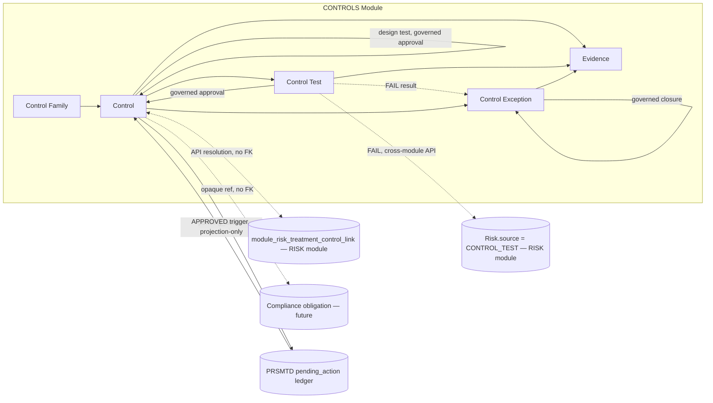
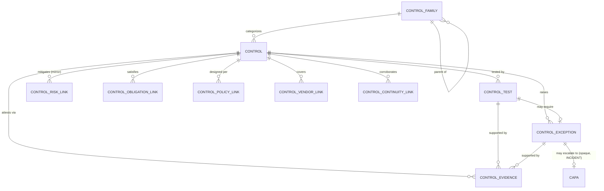
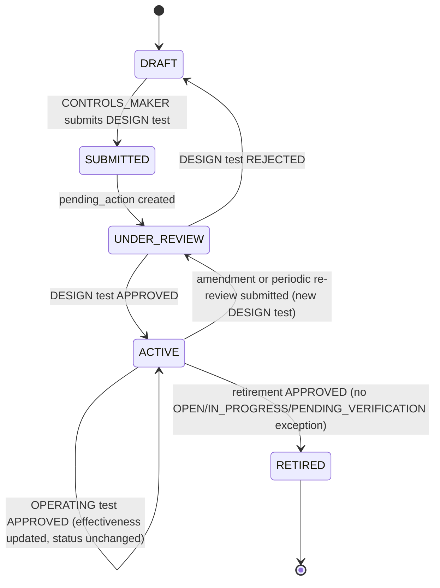
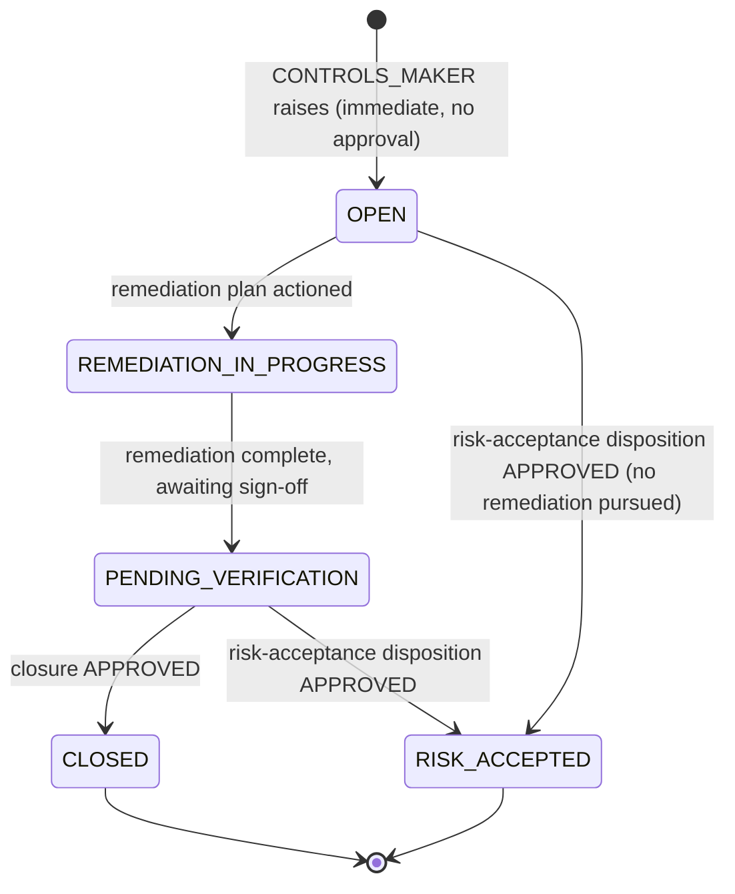

# 12.01 — Controls Management

## Purpose

Defines the Controls Management capability: the control library, control taxonomy,
preventive/detective/corrective and manual/automated classification, control ownership,
lifecycle, effectiveness rating, testing, evidence management, and exception governance for
a SEBI-regulated Mutual Fund AMC — built entirely on PRSMTD's existing multi-tenant,
governance, RBAC, and audit substrate. This is the second authoritative,
implementation-ready specification in this repository. It activates the opaque
`RiskTreatmentPlan → Control` reference point reserved by
[`10-risk/01-enterprise-risk-management.md`](../10-risk/01-enterprise-risk-management.md)
without modifying that document, and reserves equivalent forward-reference points for the
future Compliance (`11-compliance`) and Audit (`13-audit`) modules — the same pattern the
Risk spec used for this module.

## Scope

**In scope**: the control library (control identification, taxonomy/family, nature,
execution type), control ownership, control lifecycle (design proposal through retirement),
control design and operating effectiveness rating, control testing (design and operating
tests, sampling, methodology), evidence management (metadata and integrity, not binary
storage — see [Assumptions](#assumptions)), control exceptions (raising, remediation,
governed closure), the opaque cross-module reference that activates Risk's
`RiskTreatmentPlan → Control` link, a forward-reference point for a future Compliance
obligation link, and this module's security/audit/reporting/API surface.

**Out of scope** (forward-referenced, not yet specified):
- The Compliance/Regulatory obligation register (`docs/11-compliance/`) — this spec defines
  an opaque link point to it (mirroring how `10-risk` reserved this module's link point) but
  does not design obligation entities.
- The Audit module (`docs/13-audit/`) — future consumer of control test evidence and the
  standardized evidence pack pattern; not designed here.
- Incident, Issue, and CAPA management — no such module exists yet in ERM or PRSMTD; a
  Control Exception's remediation is tracked inline in this module until CAPA exists (see
  [Future Extension Points](#future-extension-points)).
- A platform document/object storage capability — evidence is modeled as metadata plus an
  opaque storage pointer; no such platform capability exists yet (see
  [Assumptions](#assumptions), Assumption 4).
- Regulatory profiles other than `SEBI_AMC` — schema is profile-configurable per the same
  pattern `10-risk` established; only `SEBI_AMC` seed content is defined here.
- Reconciling PRSMTD's `system.md §18` Product Framework doctrine (which designates
  `module.code = ERM` as the constitutional Product Framework for the enterprise risk
  domain) with this repository's generic-module design for `RISK` and `CONTROLS` — flagged
  as a discovered gap (Assumption 6), not resolved here, per the explicit instruction to
  integrate with the existing Risk module without redesigning it.

## Business Context

Internal controls are the operational mechanism by which an AMC makes a Risk's residual
score real: a `RiskTreatmentPlan` with strategy `MITIGATE` is a *commitment* to a way of
reducing risk, and a Control is the concrete, testable, owned mechanism that fulfils that
commitment. Without this module, `10-risk`'s treatment-control link
(`module_risk_treatment_control_link.control_ref_id`) is an opaque UUID with nothing on the
other end — every mitigation is asserted but nothing is tested, owned, or evidenced. This
spec makes that reference resolve to a real, governed record.

SEBI's Mutual Fund regulatory framework requires controls in two distinct registers that
this module treats as one capability, configurable by control family rather than by
separate modules:

1. **Operational/financial controls** — segregation of duties, reconciliation, and
   documented-and-tested internal controls over financial reporting for fund accounting and
   NAV computation (Annexures to Master Circular for Mutual Funds, §2.5 Operational Risk and
   §2.11 Financial Reporting Risk).
2. **IT and cyber controls** — access management, change management, incident management,
   backup and recovery, job processing, and business continuity/disaster recovery, per the
   System Audit Program Checklist annexed to the Master Circular (itself giving effect to
   SEBI Circular SEBI/HO/IMD/DF2/CIR/P/2019/57, 11 April 2019) and the Cyber Security and
   Cyber Resilience Framework for Mutual Funds AMCs (SEBI/HO/IMD/DF2/CIR/P/2019/12, 10
   January 2019).

Both registers need the same shape — a named control, an owner, a nature
(preventive/detective/corrective), an execution type (manual/automated), a testing cadence,
an effectiveness rating, and an exception process when the control fails — so this module
defines one Control aggregate with a configurable, hierarchical family taxonomy rather than
two parallel entity sets. This mirrors `10-risk`'s own decision to treat its five SEBI risk
areas as seeded reference data under one `Risk` aggregate rather than five separate
registers.

## Regulatory Drivers

Sources: [`../reference/Annexures to Master Circular for Mutual Funds as on March 31,
2023_p.pdf`](../reference/Annexures%20to%20Master%20Circular%20for%20Mutual%20Funds%20as%20on%20March%2031%2C%202023_p.pdf)
(text-extractable; primary source for this table) and [`../reference/Cyber Security and
Cyber Resilience Framework for Mutual Funds AMCs
(2019).pdf`](../reference/Cyber%20Security%20and%20Cyber%20Resilience%20Framework%20for%20Mutual%20Funds%20AMCs%20%282019%29.pdf)
(cited at title/scope level only — see Assumption 5, this document is a scanned image PDF
with no extractable text layer in this environment; exact clause numbers must be manually
verified before implementation).

| Driver | Source reference | How this spec satisfies it |
|---|---|---|
| Segregation of duties in Finance/fund-accounting function | Annexures §2.11.2.1(ii) | `Control.control_owner_user_id` and testing/approval segregation via PRSMTD's `approved_by <> created_by` constraint (same mechanism `10-risk` reuses). |
| Documentation and regular testing of internal controls over financial reporting | Annexures §2.11.2.1(iii) | `ControlTest` entity (both `DESIGN` and `OPERATING` test types), append-only test history — see [Control Testing](#control-testing). |
| Reconciliation controls (custodian, fund accounting, banks) and control oversight on brokerage/redemption/payment processing | Annexures §2.5, examples under Operational Risk | Seeded `Operations & Reconciliation Controls` family — see [Control Taxonomy](#control-taxonomy). |
| IT Governance, Information Security, Access Management (incl. Segregation of Duties), Change Management, Incident Management, Backup & Recovery, Job Processing, Business Continuity & Disaster Recovery | Annexures, System Audit Program Checklist §§1–8 (giving effect to SEBI/HO/IMD/DF2/CIR/P/2019/57) | Seeded `SEBI_AMC` control family taxonomy, one family per checklist domain — see [Control Taxonomy](#control-taxonomy). |
| Cyber security policy and technical/organizational cyber controls | Cyber Security and Cyber Resilience Framework for Mutual Funds AMCs (SEBI/HO/IMD/DF2/CIR/P/2019/12) — cited at scope level per Assumption 5 | Seeded `Cyber Security` sub-family under `Information Security` — see [Control Taxonomy](#control-taxonomy). |
| Maker-checker authorization on control design and effectiveness sign-off | Cited as best practice throughout the Annexures (e.g. approval matrices, authorization of access grants) | Reuses PRSMTD's `pending_action` governance ledger — see [Workflows](#workflows). |

## Assumptions

1. **Tenant = one AMC.** Same as `10-risk` Assumption 1 — this module is entirely
   tenant-plane data.
2. **Regulatory profile is configuration, not schema.** The `SEBI_AMC` control family
   taxonomy is seeded reference data (`module_controls_family`), not hardcoded categories,
   mirroring `10-risk` Assumption 2 exactly. COSO-style or other framework alignment is a
   `framework_tag` value on the same table, not a new table or new code path — this
   satisfies `12-controls/README.md`'s existing instruction that framework alignment be
   "configurable metadata, not hardcoded."
3. **Users referenced by this module** (`control_owner_user_id`, `control_operator_user_id`,
   `tester_user_id`, etc.) **are platform/tenant identity records**, not module-owned data —
   same reasoning as `10-risk` Assumption 4; referencing them by UUID is not an OWN-08/OWN-09
   boundary violation.
4. **PRSMTD provides no dedicated document/object storage capability.** A review of
   `system.md` (all sections, plus a targeted search for "document", "attachment", "blob",
   "evidence", "object storage") found no platform mechanism for storing binary evidence
   artifacts (screenshots, extracts, signed attestations). PRSMTD's own governance-audit
   language anticipates an `evidence_ref` field generically (system.md §18.7, PF-GV-3) but
   does not define what it points to. This spec therefore models `ControlEvidence` as
   metadata (type, title, integrity hash, uploader) plus an **opaque `storage_ref`** pointer
   — the actual binary storage substrate (e.g. an S3-compatible object store with per-tenant
   isolation) is a **genuine new PRSMTD capability requirement**, flagged here and in
   `docs/roadmap.md`, not designed in this spec. This is the same treatment `10-risk` gave to
   its own out-of-scope gaps (DR/BCP, insurance).
5. **The Cyber Security and Cyber Resilience Framework for Mutual Funds AMCs (2019) PDF is a
   scanned/image-only document** — `pdftotext` extraction in this environment returns only
   the cover-page title, and page-image rendering (`pdftoppm`) is unavailable, so this spec
   could not read its clause-level text. Its Regulatory Drivers citation above is therefore
   at title/scope level only (cyber security policy, technical/organizational controls) and
   the seeded `Cyber Security` control family should be reviewed against the source
   document's actual clauses before implementation. This is a tooling limitation of this
   authoring session, not a claim that the circular's content differs from what's stated.
6. **PRSMTD `system.md §18` (Product Framework Doctrine) — discovered, not previously
   assessed by `10-risk`.** §18 designates `module.code = ERM`, `productClass:
   PRODUCT_FRAMEWORK` as the constitutional Product Framework for the enterprise risk domain
   (V1 scope: "AMC Operational Risk — risk register, KRI monitoring, exception governance,
   and inspection-aligned evidence packs", §18.10), with a richer manifest contract (PF-CT-1
   through PF-CT-6: mandatory audit-table-per-entity, standardized signed evidence-pack
   export, `productDomain`/`regulatoryScope` fields, approval chains) than the generic §9
   module framework both `10-risk` (module code `RISK`) and this spec (module code
   `CONTROLS`) use. §18.10 explicitly states ERM's "implementation, schema, runtime code...
   are deliberately not part of this amendment" — meaning PRSMTD has not yet built anything
   against this designation. This is a real, unresolved naming/architecture question (should
   `RISK` and `CONTROLS` eventually be re-hosted as facets of one `ERM` Product Framework
   manifest, gaining the PF-CT-3 evidence-pack contract for free?) but the explicit
   instruction for this session is to integrate with the existing Risk module **without
   redesigning it**. This spec therefore proceeds on the generic §9 module framework, for
   consistency with `10-risk`, and flags the reconciliation as a deferred architectural
   decision — see [Future Extension Points](#future-extension-points) and `docs/roadmap.md`.
7. **Record retention** is deferred to `11-compliance`, same as `10-risk` Assumption 7,
   except for the platform audit trail's own retention floor (unaffected by this module).
8. **Control Owner and Checker are always distinct individuals** — enforced by PRSMTD's
   platform-level `approved_by <> created_by` constraint on `pending_action`, same mechanism
   `10-risk` Assumption 6 relies on; no bespoke SoD mechanism is designed here.
9. **A "test" of a not-yet-active control is a design walkthrough, not an operating test.**
   This spec reuses a single `ControlTest` entity for both design and operating assessments
   (distinguished by `test_type`), mirroring how `10-risk` reuses one `RiskAssessment` entity
   rather than separate design/operating entities. This keeps the schema minimal without
   losing either dimension of effectiveness.

## Dependencies

- PRSMTD `docs/authoritative/system.md` §3 (Governance model, GOV-07), §4.1 (Observability &
  Deterministic Trace Contract), §7 (Data model & RLS enforcement), §8 (RBAC model), §9 +
  §5a–§5c (Module framework, ownership guards OWN-03/04/07/08/09), §10 (Audit and
  compliance), §21 (Authentication Surface Ownership) — all reused as-is, no PRSMTD changes
  required by this spec. §18 (Product Framework Doctrine) reviewed and flagged (Assumption
  6) but not adopted at MVP.
- [`10-risk/01-enterprise-risk-management.md`](../10-risk/01-enterprise-risk-management.md)
  — **not modified by this spec.** Its `module_risk_treatment_control_link.control_ref_id`
  column is the opaque reference this module's `Control.id` resolves; its `Risk.source`
  enum value `CONTROL_TEST` is the reserved slot this module's failed tests may populate
  (both by cross-module API call at implementation time, per
  [Integration with Risk Management](#integration-with-risk-management) — no schema or API
  change to `10-risk` is required to read this spec).
- [`../reference/Annexures to Master Circular for Mutual Funds as on March 31,
  2023_p.pdf`](../reference/Annexures%20to%20Master%20Circular%20for%20Mutual%20Funds%20as%20on%20March%2031%2C%202023_p.pdf)
  and [`../reference/Cyber Security and Cyber Resilience Framework for Mutual Funds AMCs
  (2019).pdf`](../reference/Cyber%20Security%20and%20Cyber%20Resilience%20Framework%20for%20Mutual%20Funds%20AMCs%20%282019%29.pdf)
  — regulatory sources.
- `docs/04-domain-model/` — **not yet authored**, same sequencing gap `10-risk` flagged.
  This spec's [Domain Model](#domain-model) is the second inline bounded-context definition;
  per `10-risk`'s own roadmap note, `04-domain-model/` should be authored now that two
  modules exist and absorb both inline definitions.
- `docs/11-compliance/`, `docs/13-audit/` — future specs this module reserves opaque link
  points for.

## Architecture

The Controls capability is one PRSMTD module: **module code `CONTROLS`**. It follows the
generic module framework exactly as `10-risk` does (system.md §9/§5a–§5c), for consistency
with the established repository pattern (see Assumption 6 on why this module does not adopt
the §18 Product Framework contract):

- `moduleId`: a stable UUID minted at implementation time, not fixed by this specification.
- Table prefix: `module_controls_*` (OWN-03 schema ownership).
- Route namespace: `/modules/CONTROLS` (§5b4).
- API namespace: `/api/v1/modules/controls/**`, controllers in `com.prsbnjs.modules.controls`
  (OWN-07).
- Module role types: `MAKER`, `CHECKER`, `VIEWER` only — the closed set (system.md §8).
  Domain personas map onto these three; see [Authorization](#authorization).
- **`dependencies: [COMPLIANCE, POLICY, INCIDENT, TPR, BCP]`** (updated Session 15 — Additive
  Change Consolidation). CONTROLS remains a **pure provider toward `RISK` and `AUDIT`** — no
  edge is ever declared in that direction — but is no longer a zero-dependency module overall:
  each of the five dependencies above backs exactly one of this module's own initiating,
  cross-module link endpoints, added additively this session (see [Integration with Compliance
  Management](#activating-the-control--obligation-link), [Integration with Policy
  Management](#integration-with-policy-management), [Integration with Incident/Issue/CAPA](#integration-with-incidentissuecapa),
  [Integration with Third-Party Risk Management](#integration-with-third-party-risk-management),
  and [Integration with Business Continuity Management](#integration-with-business-continuity-management)
  below) — `POST /controls/{id}/obligation-links` (`COMPLIANCE`, Session 6),
  `POST /controls/{id}/policy-links` (`POLICY`), `POST /exceptions/{id}/capa-request`
  (`INCIDENT`), and the resolution-direction lookups `POST /controls/{id}/vendor-links` makes
  against `TPR` and `POST /controls/{id}/continuity-links` makes against `BCP`. **`RISK`'s
  manifest gains `dependencies: [CONTROLS]`** once this module ships and the cross-module
  reference is wired at implementation time (an additive manifest/metadata change to `RISK`,
  not a redesign of its domain or data model — `10-risk`'s own Architecture section already
  anticipated exactly this: "A `dependencies: [CONTROLS]` declaration becomes appropriate once
  the Controls module ships"). None of `COMPLIANCE`/`POLICY`/`INCIDENT`/`TPR`/`BCP` declares a
  reciprocal dependency back on `CONTROLS` for any of these five edges — each remains the
  pure-supply side of its own relationship, so no cycle is introduced (see `04-domain-model`
  Dependency Rule 1, updated this session to reflect this evolved posture).
- No platform-plane tables, no platform-plane governance actions — every governed action is
  tenant-plane (`app.plane = 'tenant'`).
- Tenant isolation, GUC binding, and session-setter usage are inherited unmodified from
  `TenantAwareDataSource` (system.md §7) — this module issues no direct `SET`/`set_config`
  calls.
- **Cross-module access is API-mediated only (OWN-08/OWN-09).** `CONTROLS` never reads
  `RISK`'s tables directly, and `RISK` never reads `CONTROLS`' tables directly. The two
  modules exchange references exclusively through each other's `.api`/`.client` packages —
  see [Integration with Risk Management](#integration-with-risk-management).



## Domain Model

**Bounded context**: Controls Management. Owns the Control library and its lifecycle
exclusively; treats Risk (upstream — a treatment plan references a control it expects to
fulfil it), Compliance obligations (upstream — a future obligation may require a control),
and Audit (downstream — audit consumes control test evidence) as external contexts it
references but does not own. This is the same customer-supplier framing `10-risk` used for
its own external references.

**Ubiquitous language** (authoritative within this context until `04-domain-model/` is
authored):

| Term | Definition |
|---|---|
| Control | A designed, owned, testable measure — policy, procedure, or automated mechanism — that prevents, detects, or corrects an undesired event affecting one or more risks or obligations. |
| Control Family | A configurable taxonomy grouping (e.g. Access Management, Change Management, Reconciliation) a Control is classified under; two-level hierarchy, regulatory-profile-seeded. |
| Control Nature | Whether a Control is `PREVENTIVE` (stops an event before it occurs), `DETECTIVE` (identifies an event after it occurs), or `CORRECTIVE` (remediates/restores after detection). |
| Execution Type | Whether a Control is performed by a person (`MANUAL`), by a system without human intervention (`AUTOMATED`), or by a person using a system-generated report/output (`IT_DEPENDENT_MANUAL`). |
| Control Owner | The individual or role accountable for the Control's continued design adequacy and operation. |
| Control Operator | The individual or team that actually executes the Control day-to-day, where distinct from the Owner. |
| Design Effectiveness | Whether a Control, as designed, would prevent/detect/correct its target event if operating as intended — assessed via a `DESIGN`-type Control Test. |
| Operating Effectiveness | Whether a Control actually operated as designed over a test period — assessed via an `OPERATING`-type Control Test. |
| Control Test | A point-in-time evaluation of a Control's design or operating effectiveness, subject to maker-checker approval, producing a result and an effectiveness rating. |
| Control Exception | A documented instance where a Control failed a test, was overridden, or could not operate as designed, tracked to a governed closure or formal risk acceptance. |
| Evidence | A metadata record (with integrity hash and opaque storage pointer) supporting a Control, a Control Test result, or a Control Exception. |

**Aggregates, entities, and invariants**:

- **Control** (aggregate root) — Cannot move past `SUBMITTED`/`UNDER_REVIEW` to `ACTIVE`
  without at least one `APPROVED` `ControlTest` of `test_type = DESIGN`. Cannot be `RETIRED`
  while it has a `ControlException` in status `OPEN`, `REMEDIATION_IN_PROGRESS`, or
  `PENDING_VERIFICATION` (must be `CLOSED` or `RISK_ACCEPTED` first) — the same
  "no-retirement-while-active-work-exists" shape `10-risk` enforces for `RiskTreatmentPlan`.
- **ControlTest** (entity, owned by Control) — Immutable once `APPROVED`; append-only
  history, mirroring `RiskAssessment` exactly. `test_type ∈ DESIGN, OPERATING`. A `FAIL`
  result on an `OPERATING` test requires at least one associated `ControlException` before
  the test can reach `APPROVED` (business rule, enforced at the application-service layer,
  mirroring GOV-07's application-layer enforcement pattern — the same escalation-on-bad-signal
  shape `10-risk`'s KRI-breach-to-Escalation rule uses).
- **ControlException** (entity, owned by Control) — Raised immediately by a `CONTROLS_MAKER`
  (no governance required to open — an operational finding should not wait on approval to be
  recorded); closure or `RISK_ACCEPTED` disposition requires `CONTROLS_CHECKER` approval,
  mirroring `RiskAcceptance`.
- **ControlEvidence** (entity, attached to exactly one of Control, ControlTest, or
  ControlException) — Immutable metadata once uploaded (content hash fixes integrity);
  supersession creates a new row, never an edit (append-only, matching PRSMTD convention).
- **ControlFamily** (reference data) — Two-level hierarchy (family → sub-family),
  regulatory-profile-seeded, tenant-editable — same shape as `RiskCategory`.
- **ControlRiskLink** (entity, owned by Control) — A local, opaque mirror of a `RISK`-module
  treatment-control association; populated via API call, never a direct FK into `RISK`'s
  schema. See [Integration with Risk Management](#integration-with-risk-management).
- **ControlObligationLink** (entity, owned by Control) — Opaque, no-FK reference reserved for
  `11-compliance`, exactly mirroring how `10-risk` reserved this module's own link before it
  existed. Inert until `11-compliance` ships.

### Control Taxonomy

`module_controls_family` is seeded per regulatory profile, tenant-editable via
`CONTROLS_ADMIN`, with an optional `framework_tag` for COSO-style or other external framework
alignment (configurable metadata, per `12-controls/README.md`'s existing instruction — no
hardcoded framework enum). The `SEBI_AMC` seed set, grounded in the sources cited in
[Regulatory Drivers](#regulatory-drivers):

| Family | Sub-families (examples) | Source |
|---|---|---|
| IT Governance | IT Strategy & Organization, IT Risk Management, IS Audit | Annexures, System Audit Checklist §1 |
| Information Security | Information Security Policy, Information Security Risk Management, **Cyber Security**, Information Privacy, Digital Technologies | Annexures §2; Cyber Security and Cyber Resilience Framework (SEBI/HO/IMD/DF2/CIR/P/2019/12) |
| Access Management | Access Grant/Revocation, Privileged Access, Segregation of Duties (SOD), Access Review | Annexures, System Audit Checklist §3 |
| Change Management | Change Authorization, Environment Segregation, Emergency Change | Annexures, System Audit Checklist §4 |
| Incident Management | Incident Response, Incident Escalation | Annexures, System Audit Checklist §5 |
| Backup & Recovery | Backup Administration, Backup Storage, Restoration Testing | Annexures, System Audit Checklist §6 |
| Job Processing | Automated Job Scheduling, Job Monitoring | Annexures, System Audit Checklist §7 |
| Business Continuity & Disaster Recovery | BCP Testing, DR Failover | Annexures, System Audit Checklist §8 |
| Financial Reporting & Fund Accounting | Segregation of Duties (Finance), NAV Computation Controls, ICFR Testing | Annexures §2.11 |
| Operations & Reconciliation | Custodian/Fund-Accounting Reconciliation, Brokerage Computation Oversight, High-Value Transaction Tracking, Fraud Controls | Annexures §2.5 |
| Distribution & Marketing | Distributor Due Diligence, Marketing Expense Approval | Annexures §2.10 |
| Third-Party/Outsourcing Oversight | RTA/Custodian/Fund Accountant SLA Oversight | Annexures (custodian/RTA oversight references throughout) |

Sub-families use the same self-referencing `parent_family_id` mechanism `RiskCategory` uses
— shown above only where illustrative; not every family requires sub-families at seed time.

### Preventive, Detective, and Corrective Controls

`Control.control_nature ∈ PREVENTIVE, DETECTIVE, CORRECTIVE` is a mandatory, closed
classification on every Control (not a separate entity) — e.g. an access-grant approval
workflow is `PREVENTIVE`; a quarterly access-recertification review is `DETECTIVE`; a
post-incident access-revocation procedure is `CORRECTIVE`. A single real-world control
process that spans more than one nature (e.g. a reconciliation that both detects breaks and
triggers correction) is modeled as two related Control records rather than a multi-valued
field, keeping effectiveness rating and testing cadence unambiguous per record.

### Manual, Automated, and IT-Dependent Manual Controls

`Control.execution_type ∈ MANUAL, AUTOMATED, IT_DEPENDENT_MANUAL` — the third value covers
the common real case (e.g. a system-generated exception report a human then reviews and
acts on) where treating the control as purely manual would miss the system-generated-input
dependency relevant to testing scope (an `IT_DEPENDENT_MANUAL` control's test procedure
should include verifying the underlying report/query logic, not just the human review step).
`automation_tool_ref` (free text, optional) names the system for `AUTOMATED` and
`IT_DEPENDENT_MANUAL` controls — informational only, not a system integration.

### Control Ownership

Every Control has exactly one accountable `control_owner_user_id` (platform identity
reference, resolved at presentation time — same pattern as `10-risk`'s `risk_owner_user_id`)
and an optional, distinct `control_operator_user_id` where the person/team executing the
control day-to-day differs from the accountable owner (e.g. a Compliance-owned control
operated by an IT Operations team). Ownership is not itself governed at MVP — reassignment
is a plain edit while the Control is not `ACTIVE`, or a proposed amendment (moving `ACTIVE`
→ `UNDER_REVIEW`) while it is, consistent with how `10-risk` treats risk ownership.

### Control Lifecycle

See the [state machine](#control-lifecycle-state-machine) in Workflows.

### Control Effectiveness

Two independently tracked dimensions, both derived from `ControlTest` records rather than
free-form fields, so effectiveness is never asserted without an underlying, approved test:

- `Control.design_effectiveness ∈ EFFECTIVE, PARTIALLY_EFFECTIVE, INEFFECTIVE,
  NOT_ASSESSED` — set from the most recently `APPROVED` `test_type = DESIGN` test.
- `Control.operating_effectiveness ∈ EFFECTIVE, PARTIALLY_EFFECTIVE, INEFFECTIVE,
  NOT_TESTED` — set from the most recently `APPROVED` `test_type = OPERATING` test.

Both are denormalized "current state" columns projected by the same `pending_action`
projection trigger that approves the underlying test (system.md §3, §9) — never written by
application code directly, matching the Governance Ledger + Projection pattern `10-risk`
uses for `Risk.inherent_score`/`Risk.residual_score`.

### Control Testing

`ControlTest.methodology` records one of the four standard audit evidence-gathering
techniques — `INSPECTION`, `OBSERVATION`, `REPERFORMANCE`, `INQUIRY` — plus `sample_size`
and `population_size` for tests using sampling. A test's `result ∈ PASS, FAIL,
PARTIAL_PASS` is distinct from its `effectiveness_rating` (a `PARTIAL_PASS` result
typically maps to `PARTIALLY_EFFECTIVE`, but the rating is a separate, checker-confirmed
judgment, not a mechanical derivation, in case additional context changes the assessed
severity). `next_test_due_date` is set on `APPROVED` from `Control`'s configured
`test_frequency`, and overdue tests are surfaced per [Reporting Requirements](#reporting-requirements).

### Evidence Management

`ControlEvidence` attaches to exactly one of a Control (e.g. a signed control-owner
attestation), a ControlTest (e.g. a sampled transaction extract), or a ControlException
(e.g. a screenshot of the failure state) — enforced at the application-service layer as
"exactly one of `control_id`, `test_id`, `exception_id` is non-null." Every evidence record
carries a `content_hash` (SHA-256) computed at upload time for integrity verification and a
`storage_ref` — an **opaque pointer**, not a platform-native file reference, per Assumption
4. This module does not implement binary storage; it is the system of record for evidence
*metadata* and integrity, ready to bind to a platform object-storage capability once one
exists without a schema change (the `storage_ref` column's meaning is versioned by
convention, not by schema, the same forward-compatible shape `10-risk` uses for its own
inert `control_ref_id`).

### Control Exceptions

`ControlException.category ∈ TEST_FAILURE, CONTROL_OVERRIDE,
COMPENSATING_CONTROL_ACTIVATED, CONTROL_NOT_OPERATING, OTHER`. `severity ∈ LOW, MEDIUM,
HIGH, CRITICAL` drives prioritization and is set by the raiser, confirmable by the checker at
closure. `linked_risk_id` (opaque UUID, no FK, nullable) reserves the ability for a
`HIGH`/`CRITICAL` exception to reference a Risk register entry created via `RISK`'s already-
reserved `Risk.source = CONTROL_TEST` value — see
[Integration with Risk Management](#integration-with-risk-management). CAPA-style structured
remediation tracking beyond `remediation_plan`/`remediation_owner_user_id`/
`target_closure_date` free-text fields is deferred to a future CAPA module (no such module
exists yet in ERM or PRSMTD) — flagged, not designed, exactly as `10-risk` flagged the same
gap for its own Risk-side remediation tracking.

## Functional Requirements

| ID | Requirement | Regulatory tie |
|---|---|---|
| FR-01 | The system shall provide a configurable, two-level control family taxonomy, seeded per regulatory profile. | Annexures, System Audit Checklist §§1–8; §2.5, §2.11 |
| FR-02 | `CONTROLS_MAKER` users shall create and edit Controls while in `DRAFT` or `UNDER_REVIEW` status. | — |
| FR-03 | Every Control shall carry a mandatory `control_nature` (`PREVENTIVE`/`DETECTIVE`/`CORRECTIVE`) and `execution_type` (`MANUAL`/`AUTOMATED`/`IT_DEPENDENT_MANUAL`). | — |
| FR-04 | A Control shall not reach `ACTIVE` status without at least one `APPROVED` `DESIGN`-type `ControlTest`. | Annexures §2.11.2.1(iii) |
| FR-05 | The maker and the approver of any governed action on a Control shall never be the same individual (platform `approved_by <> created_by` constraint). | Annexures §2.11.2.1(ii), SOD |
| FR-06 | The system shall support both `DESIGN` and `OPERATING` control tests, each independently updating `design_effectiveness`/`operating_effectiveness` on `APPROVED`. | Annexures §2.11.2.1(iii) |
| FR-07 | A `FAIL` result on an `OPERATING` test shall require at least one associated `ControlException` before the test can be `APPROVED`. | — |
| FR-08 | The system shall support Control Exceptions, raised immediately by a maker without prior approval, with governed closure (`CLOSED` or `RISK_ACCEPTED`) requiring checker approval. | — |
| FR-09 | A Control shall not be retirable while any Exception remains `OPEN`, `REMEDIATION_IN_PROGRESS`, or `PENDING_VERIFICATION`. | — |
| FR-10 | The system shall track `next_test_due_date` per Control per test type and surface overdue tests. | Annexures §2.11.2.1(iii) |
| FR-11 | Evidence shall attach to exactly one of a Control, a ControlTest, or a ControlException, and shall record an integrity hash of the underlying artifact. | — |
| FR-12 | A Control shall expose a cross-module reference-resolution API so that `RISK`'s existing opaque `module_risk_treatment_control_link.control_ref_id` resolves to a real Control record without a direct FK. | Activates `10-risk` FR-08 |
| FR-13 | A Control shall support zero or more opaque, non-FK links to Compliance-module obligations (`module_controls_control_obligation_link`), activated via `POST /controls/{id}/obligation-links`. | — |
| FR-14 | Visibility shall be role-scoped: `CONTROLS_VIEWER` — full tenant library, read-only; `CONTROLS_MAKER` — full read, edit own drafts/tests/exceptions; `CONTROLS_CHECKER` — full read, plus all pending approvals across the tenant. | — |
| FR-15 | The system shall expose a control library report, a control testing calendar/overdue report, a control effectiveness dashboard (by family and by nature), and an exception register/aging report. | — |
| FR-16 | Every governed state transition shall be captured in the platform audit trail using canonical, non-aliased `action_type` values. | system.md §10 |
| FR-17 | The independent control-testing/approval function shall be satisfiable purely by role assignment (Compliance Officer, Internal Audit, or an external assurance provider holding `CONTROLS_CHECKER`) — no code change required per assignment choice. | Mirrors `10-risk` FR-17 |
| FR-18 | A `FAIL`/`INEFFECTIVE` control test outcome may be used to create or link a Risk register entry via `RISK`'s already-reserved `Risk.source = CONTROL_TEST` value, resolved by cross-module API call, not direct database access. | Activates `10-risk`'s reserved `source` enum value |
| FR-19 | A Control shall support zero or more opaque, non-FK links to `POLICY` records (`module_controls_control_policy_link`), activated via `POST /controls/{id}/policy-links`. **Added Session 15.** | — |
| FR-20 | A Control shall support zero or more opaque, non-FK links to `TPR` Vendor records (`module_controls_control_vendor_link`), activated via `POST /controls/{id}/vendor-links`. **Added Session 15.** | Annexures §2.9 (re-cited from `25-third-party-risk`) |
| FR-21 | A Control shall support zero or more opaque, non-FK links to `BCP` Continuity Plan records (`module_controls_control_continuity_link`), activated via `POST /controls/{id}/continuity-links`. **Added Session 15.** | Annexure 8, item 8 (re-cited from `26-business-continuity`) |
| FR-22 | A Control Exception shall expose a `capa_ref_id` resolving to a CAPA record via `INCIDENT`'s existing `POST /capa-requests` endpoint. **Added Session 15.** | Activates `24-incident-issue-capa` with zero additive change on that module's own side |
| FR-23 | `Control.source` shall support `THIRD_PARTY_RISK` and `BUSINESS_CONTINUITY` values, classification metadata only. **Added Session 15.** | — |

## Non-Functional Requirements

| Category | Requirement |
|---|---|
| Multi-tenancy | Full tenant isolation via PRSMTD RLS (system.md §7); zero platform-plane data in this module. |
| Performance | Control library list/filter queries shall return p95 < 500ms for tenants with up to 5,000 active control records; test/exception history queries shall paginate rather than return unbounded history. |
| Scalability | Schema and query patterns must not assume a ceiling on tenant count or per-tenant control/test/evidence volume beyond the platform's general multi-tenant design targets. |
| Availability | Inherits platform availability targets (`18-deployment`, not yet authored) — no module-specific SLA is defined here. |
| Auditability | Every governed transition is immutable and traceable per system.md §4.1 T1–T7; no destructive updates on test/exception/evidence history. |
| Configurability | Control family taxonomy is tenant-editable reference data, not hardcoded — required for the multi-regulatory-profile vision in `CLAUDE.md`. |
| Data retention | No physical deletion of governed records; retention/archival policy deferred to `11-compliance` (Assumption 7). |
| Data integrity | Evidence records carry a content hash computed at upload time; binary storage integrity itself is out of scope pending the object-storage capability gap (Assumption 4). |
| Localization | Out of scope for this spec. |

## Data Model

All tables use module prefix `module_controls_`, live in the tenant plane, and carry the
standard PRSMTD columns: `id uuid PRIMARY KEY DEFAULT gen_random_uuid()`, `tenant_id uuid NOT
NULL` (RLS-scoped per system.md §7), `created_at timestamptz NOT NULL DEFAULT now()`,
`created_by uuid NOT NULL`. Lifecycle uses closed-set `status` columns, never soft-delete
(`deleted_at`), matching PRSMTD convention and `10-risk`'s own data model. This section is
the canonical source for the Controls schema — no separate `06-data-model/` document
duplicates it.

### Reference / configuration tables

| Table | Key columns | Notes |
|---|---|---|
| `module_controls_family` | `code`, `name`, `parent_family_id` (self-FK, nullable), `framework_tag`, `regulatory_profile`, `status` | Two-level hierarchy. Seeded with the `SEBI_AMC` profile — see [Control Taxonomy](#control-taxonomy). |
| `module_controls_code_sequence` | `tenant_id`, `entity_type` (composite PK: `CONTROL`, `EXCEPTION`), `last_value int` | Backs human-readable `control_code` (e.g. `CTRL-2026-000045`) and `exception_code` (e.g. `EXC-2026-000012`) generation from one shared table, avoiding a second sequence table. |

### Core tables

| Table | Key columns | Notes |
|---|---|---|
| `module_controls_control` | `control_code`, `name`, `description`, `control_family_id` (FK), `control_nature`, `execution_type`, `frequency`, `test_frequency`, `control_owner_user_id`, `control_operator_user_id` (nullable), `status`, `design_effectiveness`, `operating_effectiveness`, `key_control boolean`, `automation_tool_ref` (nullable), `source`, `effective_from`, `effective_to` (nullable), `last_tested_date`, `next_test_due_date`, `last_reviewed_date`, `next_review_date`, `review_frequency_days`, `updated_at` | The aggregate root. `frequency` (operating cadence) and `test_frequency` (testing cadence) are independent — e.g. a `CONTINUOUS` automated control tested `QUARTERLY`. `frequency`/`test_frequency` ∈ `CONTINUOUS, DAILY, WEEKLY, MONTHLY, QUARTERLY, SEMI_ANNUAL, ANNUAL, AD_HOC, EVENT_DRIVEN`. `status` ∈ `DRAFT, SUBMITTED, UNDER_REVIEW, ACTIVE, RETIRED`. `design_effectiveness` ∈ `EFFECTIVE, PARTIALLY_EFFECTIVE, INEFFECTIVE, NOT_ASSESSED`. `operating_effectiveness` ∈ `EFFECTIVE, PARTIALLY_EFFECTIVE, INEFFECTIVE, NOT_TESTED`. `source` ∈ `MANUAL, RISK_TREATMENT, AUDIT_FINDING, REGULATORY_REQUIREMENT, THIRD_PARTY_RISK, BUSINESS_CONTINUITY` (classification metadata only — creation is always a manual maker action regardless of `source`, mirroring `Risk.source`'s own descriptive-not-automated role; `THIRD_PARTY_RISK` and `BUSINESS_CONTINUITY` **added Session 15** per `25-third-party-risk/01-*`'s and `26-business-continuity/01-*`'s own Integration with Controls Management sections — a control created specifically in response to a vendor-assessment or continuity-exercise finding may be tagged with either value). |
| `module_controls_test` | `control_id` (FK), `test_type`, `test_date`, `tester_user_id`, `methodology`, `sample_size` (nullable), `population_size` (nullable), `test_procedure`, `result`, `effectiveness_rating`, `rationale`, `source`, `status`, `approved_by`, `approved_at`, `next_test_due_date` | Append-only once `APPROVED`. `test_type` ∈ `DESIGN, OPERATING`. `methodology` ∈ `INSPECTION, OBSERVATION, REPERFORMANCE, INQUIRY`. `result` ∈ `PASS, FAIL, PARTIAL_PASS`. `effectiveness_rating` ∈ `EFFECTIVE, PARTIALLY_EFFECTIVE, INEFFECTIVE`. `status` ∈ `DRAFT, SUBMITTED, APPROVED, REJECTED`. `source` ∈ `MANUAL, INTEGRATION` (reserves automated/continuous-control-monitoring feeds, mirroring `KRIMeasurement.source`). |
| `module_controls_exception` | `exception_code`, `control_id` (FK), `source_test_id` (FK, nullable), `category`, `description`, `identified_date`, `identified_by`, `severity`, `remediation_plan`, `remediation_owner_user_id`, `target_closure_date`, `status`, `closure_justification` (nullable), `linked_risk_id` (opaque uuid, nullable, no FK), `capa_ref_id` (opaque uuid, nullable, no FK), `approved_by` (nullable), `approved_at` (nullable), `updated_at` | `category` ∈ `TEST_FAILURE, CONTROL_OVERRIDE, COMPENSATING_CONTROL_ACTIVATED, CONTROL_NOT_OPERATING, OTHER`. `severity` ∈ `LOW, MEDIUM, HIGH, CRITICAL`. `status` ∈ `OPEN, REMEDIATION_IN_PROGRESS, PENDING_VERIFICATION, CLOSED, RISK_ACCEPTED`. `linked_risk_id` is **opaque, no FK — resolved via `RISK`'s `.api`/`.client` package per OWN-09**, symmetric to how `10-risk` treats its own `control_ref_id`. `capa_ref_id` — **added Session 15**, opaque, no FK, resolved via `24-incident-issue-capa`'s existing `POST /capa-requests` — see [Integration with Incident/Issue/CAPA](#integration-with-incidentissuecapa). |
| `module_controls_evidence` | `control_id` (FK, nullable), `test_id` (FK, nullable), `exception_id` (FK, nullable), `evidence_type`, `title`, `description`, `storage_ref`, `file_name`, `mime_type`, `file_size_bytes`, `content_hash`, `collected_at`, `collected_by`, `uploaded_at`, `uploaded_by`, `status` | Exactly one of `control_id`/`test_id`/`exception_id` is non-null (application-layer invariant — see [Evidence Management](#evidence-management)). `evidence_type` ∈ `DOCUMENT, SCREENSHOT, SYSTEM_EXTRACT, ATTESTATION, LOG_EXTRACT, OTHER`. `status` ∈ `ACTIVE, SUPERSEDED, ARCHIVED`. `storage_ref` is opaque per Assumption 4. |
| `module_controls_control_risk_link` | `control_id` (FK), `source_module_code` (fixed `'RISK'`), `source_entity_type` (fixed `'RISK_TREATMENT_PLAN'`), `source_treatment_plan_id` (opaque uuid, no FK), `source_risk_id` (opaque uuid, nullable, no FK, for display convenience), `linked_at`, `linked_by`, `status` | Local mirror of `RISK`'s own `module_risk_treatment_control_link` row, populated via API call — see [Integration with Risk Management](#integration-with-risk-management). `status` ∈ `ACTIVE, REMOVED`. |
| `module_controls_control_obligation_link` | `control_id` (FK), `obligation_ref_id` (opaque uuid, no FK) | **Activated (Session 6)** — corrected a stale "inert" note this session (Session 15 consistency review); resolves via `POST /controls/{id}/obligation-links`, see [Activating the Control → Obligation Link](#activating-the-control--obligation-link). |
| `module_controls_control_policy_link` | `control_id` (FK), `policy_ref_id` (opaque uuid, no FK), `linked_at`, `linked_by`, `status` | **Added Session 15**, identical shape to `module_controls_control_obligation_link`. Resolves via `POST /controls/{id}/policy-links` — see [Integration with Policy Management](#integration-with-policy-management). `status` ∈ `ACTIVE, REMOVED`. |
| `module_controls_control_vendor_link` | `control_id` (FK), `vendor_ref_id` (opaque uuid, no FK), `linked_at`, `linked_by`, `status` | **Added Session 15**, identical shape to `module_controls_control_obligation_link`. Resolves via `POST /controls/{id}/vendor-links` — see [Integration with Third-Party Risk Management](#integration-with-third-party-risk-management). `status` ∈ `ACTIVE, REMOVED`. |
| `module_controls_control_continuity_link` | `control_id` (FK), `continuity_plan_ref_id` (opaque uuid, no FK), `linked_at`, `linked_by`, `status` | **Added Session 15**, identical shape to `module_controls_control_obligation_link`. Resolves via `POST /controls/{id}/continuity-links` — see [Integration with Business Continuity Management](#integration-with-business-continuity-management). `status` ∈ `ACTIVE, REMOVED`. |

No bespoke audit table is defined — audit trail is the platform's `audit_log` per system.md
§10, reused as-is, exactly as `10-risk` does.

### ER diagram



## Workflows

All governed transitions reuse PRSMTD's `pending_action` ledger and the Governance Ledger +
Projection pattern (system.md §3, §9), exactly as `10-risk` does: a `CONTROLS_MAKER`
proposes, a `CONTROLS_CHECKER` decides, and a database trigger — never application code —
projects `APPROVED` decisions into the Control aggregate's state. GOV-07 dedup applies per
action type, scoped to its logical target.

| `action_type` | Logical target (GOV-07 key) | Effect on APPROVED |
|---|---|---|
| `CONTROL_TEST_APPROVAL` | `test_id` | `ControlTest.status = APPROVED`; if `test_type = DESIGN`: `Control.design_effectiveness` updated, and if `Control.status ∈ (SUBMITTED, UNDER_REVIEW)` then `Control.status = ACTIVE`; if `test_type = OPERATING`: `Control.operating_effectiveness`, `Control.last_tested_date`, `Control.next_test_due_date` updated. |
| `CONTROL_EXCEPTION_CLOSURE_APPROVAL` | `exception_id` | `ControlException.status = CLOSED` or `RISK_ACCEPTED` (per the proposed disposition). |
| `CONTROL_RETIREMENT_APPROVAL` | `control_id` | `Control.status = RETIRED`. |

Only three action types are needed — there is no separate "approve the Control itself"
action, because (mirroring `10-risk`'s own choice not to have a separate "approve the Risk")
the `DESIGN`-type test's approval **is** the governance event that activates the Control, in
exactly the same way `RiskAssessment` approval is the event that activates a Risk.

### Control lifecycle state machine



### Control exception lifecycle state machine



### Maker-checker sequence — control test approval

```mermaid
sequenceDiagram
    actor Owner as Control Owner (CONTROLS_MAKER)
    participant App as CONTROLS module service
    participant Ledger as pending_action ledger
    actor Assur as Compliance/Internal Audit (CONTROLS_CHECKER)
    participant Trig as DB projection trigger

    Owner->>App: Submit ControlTest (DRAFT -> SUBMITTED)
    App->>Ledger: INSERT pending_action(action_type=CONTROL_TEST_APPROVAL, status=PENDING)
    Note over Ledger: GOV-07 dedup on test_id
    Assur->>App: Review pending test
    Assur->>Ledger: Decide APPROVED (approved_by != created_by enforced)
    Ledger->>Trig: status -> APPROVED
    Trig->>App: Project: update module_controls_test, module_controls_control
    App-->>Owner: Control effectiveness updated; status ACTIVE if this was the activating DESIGN test
```

### Cross-module resolution — activating the Risk Treatment Plan → Control link

```mermaid
sequenceDiagram
    actor Maker as Risk Owner (RISK_MAKER)
    participant RiskApp as RISK module service
    participant RiskLink as module_risk_treatment_control_link
    participant CtlApi as CONTROLS module API (.api package)
    participant CtlLink as module_controls_control_risk_link

    Maker->>RiskApp: POST /treatment-plans/{id}/control-links {control_ref_id}
    RiskApp->>RiskLink: INSERT (treatment_plan_id, control_ref_id) — RISK's own table, opaque
    RiskApp->>CtlApi: POST /controls/{control_ref_id}/references (server-to-server, OWN-09 client call)
    CtlApi->>CtlApi: Validate control exists and is not RETIRED
    CtlApi->>CtlLink: INSERT mirror row (control_id, source_treatment_plan_id, ...)
    CtlApi-->>RiskApp: 201 Created
    RiskApp-->>Maker: Link created; Control detail resolvable via GET /controls/{id}/reference
```

## Security Model

- **Authentication**: reused unmodified from PRSMTD §21 — same as `10-risk`. No new
  authentication surface.
- **Tenant isolation**: reused unmodified from §7 — every table RLS-scoped on `tenant_id`,
  bound exclusively via `TenantAwareDataSource`.
- **Data classification**: control library content is classified **Tenant Confidential**,
  and evidence artifacts (screenshots, system extracts, access-control configuration
  details) are classified **Tenant Restricted** — a stricter tier than the control metadata
  itself, since evidence can directly reveal exploitable configuration gaps (e.g. an access-
  review evidence extract showing exactly which privileged accounts were never revoked).
  This module does not introduce a separate permission for evidence at MVP (see
  [Authorization](#authorization)) to keep the permission model as flat as `10-risk`'s; the
  stricter classification is a design note for implementation-time data handling (e.g.
  encryption at rest for the eventual object-storage capability) and a candidate for a
  finer-grained permission if real deployments show blanket `CONTROLS_VIEW` access to raw
  evidence is too broad — see [Future Extension Points](#future-extension-points).
- **Segregation of duties**: enforced entirely by the platform's `approved_by <>
  created_by` constraint on `pending_action` (system.md §3) — no bespoke SoD logic, same as
  `10-risk`.
- **Threat model note**: the primary module-specific threat is evidence tampering or
  post-hoc fabrication of a passed test. Mitigated structurally by: `ControlTest` and
  `ControlEvidence` being append-only once `APPROVED`/uploaded; `content_hash` fixing
  evidence integrity at upload time; and the maker/checker split preventing a single actor
  from both performing and self-approving a test. The unresolved gap is that this module
  cannot itself guarantee the *binary* evidence behind `storage_ref` hasn't been substituted
  before upload — that guarantee depends on the still-undesigned object-storage capability
  (Assumption 4).

## Authorization

Module role types are the closed PRSMTD set — `MAKER`, `CHECKER`, `VIEWER` (system.md §8).
Permission ids follow the `MODULECODE_ACTION` convention, same as `10-risk`.

**Permissions**:

| Permission | Meaning |
|---|---|
| `CONTROLS_VIEW` | Read control library, tests, exceptions, evidence. |
| `CONTROLS_CREATE` | Create a new Control in `DRAFT`. |
| `CONTROLS_EDIT` | Edit a `DRAFT`/`UNDER_REVIEW` Control. |
| `CONTROLS_TEST` | Submit a `ControlTest` (design or operating) for approval. |
| `CONTROLS_APPROVE` | Approve/reject control tests, exception closures, retirements. |
| `CONTROLS_EXCEPTION_RAISE` | Raise a `ControlException` (immediate, no approval required). |
| `CONTROLS_EXCEPTION_CLOSE` | Propose exception closure or risk-acceptance disposition. |
| `CONTROLS_RETIRE` | Propose Control retirement. |
| `CONTROLS_ADMIN` | Manage control family taxonomy. |
| `CONTROLS_REPORT_VIEW` | View control reports/dashboards. |

**`roleMappings`**:

```yaml
roleMappings:
  CONTROLS_MAKER:   [CONTROLS_VIEW, CONTROLS_CREATE, CONTROLS_EDIT, CONTROLS_TEST, CONTROLS_EXCEPTION_RAISE, CONTROLS_EXCEPTION_CLOSE, CONTROLS_RETIRE, CONTROLS_REPORT_VIEW]
  CONTROLS_CHECKER: [CONTROLS_VIEW, CONTROLS_APPROVE, CONTROLS_ADMIN, CONTROLS_REPORT_VIEW]
  CONTROLS_VIEWER:  [CONTROLS_VIEW, CONTROLS_REPORT_VIEW]
```

**Persona-to-module-role mapping** (following the convention `10-risk` established —
personas are business language, module roles are the enforced mechanism; the mapping is
tenant-onboarding configuration, not code):

| Persona | Module role | Rationale |
|---|---|---|
| Control Owner / Process Owner (1st line) | `CONTROLS_MAKER` | Day-to-day control design, testing submission, exception raising and remediation. |
| Compliance Officer / Internal Audit / independent assurance function (2nd/3rd line) | `CONTROLS_CHECKER` | Independent test approval and exception closure — mirrors `10-risk`'s independent risk-function pattern. |
| External assurance provider (system auditor per the Annexures' System Audit Program) | `CONTROLS_CHECKER` | The System Audit Program Checklist itself anticipates external firms performing this function; satisfied by role assignment, no code change. |
| CISO, Board Audit Committee, External Auditor, Trustees | `CONTROLS_VIEWER` | Oversight/read access. |

## Compliance Considerations

- This module is the system of record the Annexures' System Audit Program Checklist and
  ICFR testing requirement point at — its test history and evidence must be exportable/
  presentable to system auditors and the Board Audit Committee, a
  [Reporting Requirements](#reporting-requirements) concern.
- The object-storage gap (Assumption 4) means this module cannot yet fully satisfy an
  auditor's expectation of retrievable binary evidence — flagged, not silently dropped.
- No cross-border data residency concerns are introduced beyond whatever the platform
  already guarantees.

## Audit Requirements

- Every governed transition produces an `audit_log` entry with a **canonical, non-aliased**
  `action_type` (system.md §10): `CONTROL_TEST_APPROVAL`, `CONTROL_EXCEPTION_CLOSURE_APPROVAL`,
  `CONTROL_RETIREMENT_APPROVAL`.
- DAO-level trace events follow the existing closed taxonomy pattern
  `dao.<entity>.query.begin/end` (system.md §4.1) — e.g. `dao.control.query.begin`. As with
  `10-risk`, these entity-specific event names must be registered/verified against the
  platform's closed event taxonomy before use at implementation time.
- Every trace event carries `correlation_id` (T1/T7), inherited without modification.
- No module-specific audit table is introduced — deliberate reuse of the platform's
  immutable audit trail substrate, same decision `10-risk` made.

## Reporting Requirements

Cross-references `14-reporting` and `15-analytics` (not yet authored); this section only
enumerates what this module must expose as source data/views:

| Report | Consumers | Regulatory tie |
|---|---|---|
| Control Library Report | Control Owners, Compliance, Auditors | General due-diligence record |
| Control Testing Calendar / Overdue Tests | Control Owners, Compliance | Annexures §2.11.2.1(iii) regular testing requirement |
| Control Effectiveness Dashboard (by family, by nature) | Compliance, CISO, Board Audit Committee | Annexures System Audit Checklist domains |
| Exception Register & Aging | Compliance, Internal Audit, Board Audit Committee | Operational risk exception/escalation practice (Annexures §2.5.3) |
| Evidence Completeness Report (tests/exceptions missing evidence) | Compliance, Internal Audit | Audit-readiness |
| Control Coverage by Risk (once `RISK` implementation calls the reference API) | Risk Owners, CRO | Activates `10-risk`'s reserved link |

## Integration with Risk Management

This is the primary activation this spec delivers. `10-risk`'s
`module_risk_treatment_control_link` table already exists in that spec with a
`control_ref_id uuid` column explicitly documented as "opaque, no FK — resolved via Controls
module's `.api`/`.client` package per OWN-09 once that module exists" (`10-risk` Data Model
section). Nothing about that table changes.

What this module adds, entirely on the `CONTROLS` side:

1. **Resolution direction (Risk → Controls)**: `GET /api/v1/modules/controls/controls/{id}/reference`
   returns a minimal, stable DTO (`id`, `control_code`, `name`, `control_family`, `status`,
   `control_nature`, `execution_type`, `design_effectiveness`, `operating_effectiveness`) for
   `RISK`'s presentation layer to resolve a `control_ref_id` for display against a Risk
   Treatment Plan. Guarded by `CONTROLS_VIEW`.
2. **Mirror direction (Controls' own reporting)**: `POST /api/v1/modules/controls/controls/{id}/references`
   is called by `RISK`'s backend, server-to-server, at the same time `RISK`'s own already-
   specified `POST /treatment-plans/{id}/control-links` endpoint creates its local opaque
   link row (per the sequence diagram above). This populates
   `module_controls_control_risk_link`, giving Controls its own "which risks does this
   control mitigate" view without ever querying `RISK`'s tables directly (OWN-08/OWN-09
   compliant).
3. **`Risk.source = CONTROL_TEST` activation**: when a `ControlTest` or `ControlException`
   indicates a control is not operating effectively, the Control Owner or Compliance may
   manually create a new Risk register entry in `RISK` using its already-reserved `source =
   CONTROL_TEST` value, optionally recording the originating `control_id` in that Risk's own
   fields (no schema change to `RISK` is required — this is the enum value `10-risk` already
   ships, simply exercised for the first time).

**What this does *not* require of `RISK`**: no schema change, no new table, no new
permission, no new `pending_action.action_type`. The only implementation-time expectation is
that `RISK`'s existing `POST /treatment-plans/{id}/control-links` handler, when built, also
performs the server-to-server call in step 2 — a behavior already implied by that endpoint's
existing one-line spec ("Link an opaque control reference") rather than a new requirement
invented here. `RISK`'s manifest gaining `dependencies: [CONTROLS]` (Architecture, above) is
the only manifest-level change, and it is additive metadata, not a domain/data model
redesign.

A **remaining gap**, flagged rather than built: a full bidirectional "coverage" report (list
every Risk mitigated by a given Control, sourced live rather than via the mirror table) would
require `RISK` to expose a query-by-`control_ref_id` endpoint it does not currently have.
This is a minor, additive, non-breaking candidate extension to `10-risk`'s API surface —
proposed here, not designed or implemented, and not required to satisfy this session's
"activate the relationship" objective (satisfied by items 1–3 above).

## Integration with Future Compliance and Audit Modules

| Integration | Direction | Status |
|---|---|---|
| Compliance/Regulatory obligation register (`11-compliance`) | Compliance → Controls (obligation requires a control) | **Activated** (Session 6, 2026-07-20) — `module_controls_control_obligation_link` resolves via a new `POST /controls/{id}/obligation-links` initiating endpoint (see [Activating the Control → Obligation Link](#activating-the-control--obligation-link) and [APIs](#apis)), mirroring the `RISK`↔`CONTROLS` reference/mirror pattern. |
| Audit module (`13-audit`) | Audit → Controls (control test evidence as audit evidence) | Activated by `13-audit/01-audit-management.md` (Session 5) via `AuditEvidence.evidence_source = CONTROLS_EVIDENCE_REFERENCE`, resolved through this module's existing reference-resolution API — no change to this document. A standardized, signed evidence-pack export (the shape PRSMTD's own §18.7/PF-CT-3 doctrine anticipates generically for governed frameworks) remains a candidate future platform capability — not designed here. |
| External GRC/SIEM/continuous-control-monitoring feeds | External → Control Test | `17-integrations` not yet authored; `ControlTest.source = INTEGRATION` reserves the slot, mirroring `KRIMeasurement.source`. |

### Activating the Control → Obligation Link

`11-compliance/01-compliance-management.md`'s "Integration with Controls" section proposed,
but did not build, an initiating endpoint on this module's side — its existing
`POST /controls/{id}/references` is hardcoded to the *Risk* mirror's column shape
(`source_treatment_plan_id`, `source_risk_id`) and cannot serve the obligation link. This
session adds exactly the proposed endpoint, additive and non-breaking, no other change to
this module's domain or data model:

- **`POST /controls/{id}/obligation-links {obligation_ref_id}`** (guarded by
  `CONTROLS_EDIT`) — inserts a row into the already-existing
  `module_controls_control_obligation_link` table (`control_id`, `obligation_ref_id`; no
  schema change, that table has carried this exact shape since this document was first
  authored), then calls `COMPLIANCE`'s existing
  `POST /api/v1/modules/compliance/obligations/{obligation_ref_id}/references` API
  (server-to-server, OWN-09) to populate `COMPLIANCE`'s own mirror row
  (`module_compliance_obligation_control_link`) — the identical resolution/mirror shape this
  module's own `POST /controls/{id}/references` already established for `RISK`, applied here
  in the reverse initiating direction (`CONTROLS` initiates toward `COMPLIANCE`, exactly as
  `11-compliance`'s own sequence diagram for this exchange already depicts).
- `GET /api/v1/modules/compliance/obligations/{id}/reference` (already specified in
  `11-compliance`) resolves the obligation for this module's own presentation layer — no new
  endpoint needed on the `COMPLIANCE` side beyond what that document already ships.
- **Manifest consequence**: this module's manifest gains `dependencies: [COMPLIANCE]` (see
  [Architecture](#architecture)) once this endpoint is wired at implementation time.
  `COMPLIANCE`'s own manifest stays `dependencies: []` — it remains the pure-provider side of
  the relationship, per `04-domain-model`'s Dependency Rule 4.

## Integration with Policy Management

**Added Session 15 (Additive Change Consolidation)**, per `23-policy/01-policy-management.md`'s
own proposed, not-yet-applied extension — the one integration `23-policy` itself could not
build unilaterally, since (unlike `11-compliance`'s obligation link) this module had reserved
no policy link at all prior to this session:

- **`POST /controls/{id}/policy-links {policy_ref_id}`** (guarded by `CONTROLS_EDIT`) — inserts
  a row into the new `module_controls_control_policy_link` table, then calls `POLICY`'s
  existing, confirmed-polymorphic `POST /api/v1/modules/policy/policies/{policy_ref_id}/references
  {source_module_code: 'CONTROLS', source_entity_type: 'CONTROL', source_entity_ref_id:
  controlId}` (server-to-server, OWN-09) to populate `POLICY`'s own `module_policy_reference_link`
  mirror — the identical resolution/mirror shape this module's own `POST
  /controls/{id}/obligation-links` already established for `COMPLIANCE`.
- `GET /api/v1/modules/policy/policies/{id}/reference` (already specified in `23-policy`)
  resolves the policy for this module's own presentation layer — no new endpoint needed on the
  `POLICY` side; `23-policy/01-*` itself states `CONTROLS` was one of the two citing modules
  its `PolicyReferenceLink` was designed for from the start.
- **Manifest consequence**: this module's manifest gains `dependencies: [POLICY]` (see
  [Architecture](#architecture)). `POLICY`'s own manifest, once this proposal is applied
  alongside this session's changes, gains `dependencies: [..., CONTROLS]` in addition to its
  existing `dependencies: [SECURITY]` — it remains the pure-provider side of the mirror-write,
  per `04-domain-model`'s Dependency Rule 4.

## Integration with Incident/Issue/CAPA

**Added Session 15**, per `24-incident-issue-capa/01-*`'s own proposed, not-yet-applied
extension:

- **`POST /exceptions/{id}/capa-request`** (guarded by `CONTROLS_EXCEPTION_CLOSE`) — calls `INCIDENT`'s
  existing `POST /capa-requests {source_module_code: 'CONTROLS', source_entity_type:
  'CONTROL_EXCEPTION', source_entity_ref_id: exceptionId}` (server-to-server, OWN-09), storing
  the returned `capa_ref_id` on `module_controls_exception`. No change required on `INCIDENT`'s
  side — `POST /capa-requests` was built generically from its own original authoring to serve
  exactly this kind of exception-bearing citing module.
- **Manifest consequence**: this module's manifest gains `dependencies: [INCIDENT]` (see
  [Architecture](#architecture)). `INCIDENT`'s own manifest carries no reciprocal dependency —
  pure-provider side, consistent with every other module's activation of this same endpoint
  (`23-policy`, `25-third-party-risk`, `26-business-continuity` each already do so).

## Integration with Third-Party Risk Management

**Added Session 15**, per `25-third-party-risk/01-*`'s own proposed, not-yet-applied
extension — mirroring exactly how `11-compliance` first proposed the analogous obligation-link
endpoint before this module's existing `POST /controls/{id}/references` (hardcoded to `RISK`'s
mirror shape) was confirmed unable to serve a second citing module:

- **`POST /controls/{id}/vendor-links {vendor_ref_id}`** (guarded by `CONTROLS_EDIT`) — inserts
  a row into the new `module_controls_control_vendor_link` table, giving Controls its own
  "which controls cover which vendors" view (e.g. a control from the seeded "Third-Party /
  Outsourcing Oversight" control family covering a specific vendor's SLA monitoring).
  `TPR`'s existing `GET /api/v1/modules/tpr/vendors/{id}/reference` resolves the vendor for
  this module's own presentation layer. Unlike the `POLICY`/`COMPLIANCE` links, `TPR` does not
  itself maintain a reciprocal "which controls mitigate this vendor" mirror table — that view,
  if ever needed, belongs to a future `14-reporting`-style aggregation, not a `TPR` schema
  change, so no mirror-registration call is made toward `TPR`.
- **Manifest consequence**: this module's manifest gains `dependencies: [TPR]` (see
  [Architecture](#architecture)). `TPR`'s own manifest carries no reciprocal dependency —
  pure-provider side, per `04-domain-model` Dependency Rule 6 (a hard edge only where a genuine
  synchronous call, here the resolution GET, is made).

## Integration with Business Continuity Management

**Added Session 15**, per `26-business-continuity/01-*`'s own proposed, not-yet-applied
extension, resolving the plan-vs-test boundary that document's Assumption 6 already committed
to (`CONTROLS` keeps the effectiveness decision, `BCP` owns the plan/targets) at this module's
own side:

- **`POST /controls/{id}/continuity-links {continuity_plan_ref_id}`** (guarded by
  `CONTROLS_EDIT`) — inserts a row into the new `module_controls_control_continuity_link`
  table, giving Controls its own view of which Continuity Plan(s) its seeded "Business
  Continuity & Disaster Recovery" control family (`BCP Testing`, `DR Failover` sub-families)
  corroborates — complementing, not duplicating, `BCP`'s own `ContinuityExercise.control_ref_id`
  resolution-direction link (already built, zero additive change, per that document's own
  Integration with Controls Management section). `BCP`'s existing
  `GET /api/v1/modules/bcp/continuity-plans/{id}/reference` resolves the plan for this module's
  own presentation layer.
- **Manifest consequence**: this module's manifest gains `dependencies: [BCP]` (see
  [Architecture](#architecture)). `BCP`'s own manifest carries no reciprocal dependency —
  pure-provider side, per `04-domain-model` Dependency Rule 6.

## APIs

Base path: `/api/v1/modules/controls` (OWN-07 API namespace ownership). Resource paths use
plural kebab-case nouns per `CLAUDE.md` naming standards. Approval decisions are made
against PRSMTD's shared platform governance API for `pending_action` records — this module
exposes *propose* endpoints, not bespoke *approve* endpoints, same as `10-risk`.

| Method | Path | Permission | Purpose |
|---|---|---|---|
| GET | `/control-families` | `CONTROLS_VIEW` | List taxonomy |
| POST/PUT | `/control-families` | `CONTROLS_ADMIN` | Manage taxonomy |
| GET | `/controls` | `CONTROLS_VIEW` | List/filter control library (role-scoped per FR-14) |
| POST | `/controls` | `CONTROLS_CREATE` | Create a `DRAFT` Control |
| GET | `/controls/{id}` | `CONTROLS_VIEW` | Control detail |
| PUT | `/controls/{id}` | `CONTROLS_EDIT` | Edit a `DRAFT`/`UNDER_REVIEW` Control |
| GET | `/controls/{id}/reference` | `CONTROLS_VIEW` | Minimal cross-module resolution DTO (consumed by `RISK`) |
| POST | `/controls/{id}/references` | `CONTROLS_VIEW` | Register a mirror reference from another module (server-to-server; see Integration with Risk Management) |
| POST | `/controls/{id}/obligation-links` | `CONTROLS_EDIT` | Link an opaque `COMPLIANCE` obligation reference; calls `COMPLIANCE`'s reference API server-to-server (see [Activating the Control → Obligation Link](#activating-the-control--obligation-link)) |
| POST | `/controls/{id}/policy-links` | `CONTROLS_EDIT` | Link an opaque `POLICY` reference; calls `POLICY`'s mirror-registration API server-to-server (see [Integration with Policy Management](#integration-with-policy-management)); added Session 15 |
| POST | `/controls/{id}/vendor-links` | `CONTROLS_EDIT` | Link an opaque `TPR` vendor reference (see [Integration with Third-Party Risk Management](#integration-with-third-party-risk-management)); added Session 15 |
| POST | `/controls/{id}/continuity-links` | `CONTROLS_EDIT` | Link an opaque `BCP` continuity-plan reference (see [Integration with Business Continuity Management](#integration-with-business-continuity-management)); added Session 15 |
| POST | `/controls/{id}/tests` | `CONTROLS_TEST` | Submit a design/operating test → creates `pending_action` |
| GET | `/controls/{id}/tests` | `CONTROLS_VIEW` | Test history |
| POST | `/controls/{id}/exceptions` | `CONTROLS_EXCEPTION_RAISE` | Raise an exception (immediate) |
| POST | `/exceptions/{id}/closure` | `CONTROLS_EXCEPTION_CLOSE` | Propose closure/risk-acceptance → creates `pending_action` |
| POST | `/exceptions/{id}/capa-request` | `CONTROLS_EXCEPTION_CLOSE` | Request a CAPA via `INCIDENT`'s `POST /capa-requests` (see [Integration with Incident/Issue/CAPA](#integration-with-incidentissuecapa)); added Session 15 |
| GET | `/exceptions` | `CONTROLS_VIEW` | List exceptions |
| POST | `/controls/{id}/evidence` | Matches parent entity's mutation permission | Attach evidence to a Control |
| POST | `/tests/{id}/evidence` | `CONTROLS_TEST` | Attach evidence to a test |
| POST | `/exceptions/{id}/evidence` | `CONTROLS_EXCEPTION_RAISE` | Attach evidence to an exception |
| GET | `/controls/{id}/evidence` | `CONTROLS_VIEW` | Evidence list for a Control |
| POST | `/controls/{id}/retirement` | `CONTROLS_RETIRE` | Propose retirement → creates `pending_action` |
| GET | `/reports/control-library` | `CONTROLS_REPORT_VIEW` | Library export |
| GET | `/reports/testing-calendar` | `CONTROLS_REPORT_VIEW` | Overdue/upcoming tests |
| GET | `/reports/effectiveness-dashboard` | `CONTROLS_REPORT_VIEW` | Effectiveness by family/nature |
| GET | `/reports/exception-register` | `CONTROLS_REPORT_VIEW` | Exception register/aging |

Event contracts (published, per `21-standards` naming `domain.entity.pastTenseVerb`):
`control.test.approved`, `control.exception.raised`, `control.exception.closed`,
`control.retired`, `control.reference.linked`. Consumers (future Reporting/Analytics/Audit
modules) are not yet specified; this spec only reserves the naming, same as `10-risk`.

## Future Extension Points

- **Bidirectional Risk coverage reporting**: requires a minor, additive query-by-
  `control_ref_id` endpoint on `RISK`'s existing API — proposed in
  [Integration with Risk Management](#integration-with-risk-management), not built.
- **Platform document/object storage capability**: `ControlEvidence.storage_ref` is opaque
  pending this platform capability (Assumption 4) — a genuine new PRSMTD capability
  requirement, not designed here.
- **Finer-grained evidence access permission**: if blanket `CONTROLS_VIEW` access to raw
  evidence proves too broad in practice, a dedicated `CONTROLS_EVIDENCE_VIEW` permission is a
  natural, additive follow-on (see Security Model).
- **Reconciling PRSMTD `system.md §18` Product Framework doctrine**: whether `RISK` and
  `CONTROLS` should eventually be re-hosted as facets of a single `ERM` Product Framework
  manifest (gaining PF-CT-3's standardized signed evidence-pack export and PF-CT-1's
  mandatory per-entity audit tables for free) is a deferred architectural decision — flagged
  in Assumption 6, worth a `20-adr/` entry once `11-compliance` or `13-audit` also needs to
  make the same call.
- **Automated/continuous control monitoring**: `ControlTest.source = INTEGRATION` reserves
  the slot for `17-integrations` connectors (e.g. SIEM- or GRC-tool-fed automated test
  results) instead of manual entry, mirroring `10-risk`'s `KRIMeasurement.source` pattern.
- **Resolved (Session 15)**: `ControlException`'s CAPA link is no longer a future candidate —
  `capa_ref_id` plus `POST /exceptions/{id}/capa-request` are built (Data Model, APIs,
  [Integration with Incident/Issue/CAPA](#integration-with-incidentissuecapa)).
- **Standardized evidence-pack export**: a deterministic, signed, point-in-time evidence
  export (the shape PRSMTD's own §18.7 doctrine anticipates for governed frameworks
  generally) is a natural `13-audit` or platform capability once that module or the §18
  reconciliation above is addressed.
- **Governed control-family taxonomy changes**: not routed through `pending_action` at MVP,
  same open question `10-risk` flagged for its own `RiskAppetite` — revisit once, across
  both modules, if a future spec needs the same "governed configuration change" pattern
  (already an open decision in `docs/roadmap.md`).

## Traceability

- **Business Requirement**: Provide the AMC with a governed, auditable, tested control
  library that fulfils Risk Treatment Plans, satisfies IT/cyber and financial-reporting
  control obligations, and replaces manual/offline control tracking.
- **Regulatory Requirement**: Annexures to Master Circular for Mutual Funds as on March 31,
  2023 — §2.5 (Operational Risk), §2.11 (Financial Reporting Risk — ICFR testing,
  segregation of duties), System Audit Program Checklist §§1–8 (giving effect to SEBI
  Circular SEBI/HO/IMD/DF2/CIR/P/2019/57, 11 April 2019); Cyber Security and Cyber
  Resilience Framework for Mutual Funds AMCs (SEBI/HO/IMD/DF2/CIR/P/2019/12, 10 January
  2019), cited at scope level per Assumption 5.
- **PRSMTD Capability**: Reused — governance ledger / maker-checker (`system.md §3, §9`,
  GOV-07), RBAC and module role model (`§8`), module framework and ownership guards (`§9,
  §5a–§5c`, OWN-03/04/07/08/09), multi-tenant RLS (`§7`), observability trace contract
  (`§4.1`), audit trail (`§10`), authentication (`§21`). **New capability required**:
  platform document/object storage (Assumption 4) — confirmed gap, not designed here.
  **Flagged, not required**: reconciliation with `system.md §18` Product Framework doctrine
  (Assumption 6) — deferred architectural question, does not block this module's MVP.
- **ERM Capability**: Controls Management (module code `CONTROLS`) — second entry in
  `22-traceability/`; activates `10-risk`'s reserved `RiskTreatmentPlan → Control` link.
- **Dependencies**: See [Dependencies](#dependencies) above.
- **Future Work**: See [Future Extension Points](#future-extension-points) above.

**Amendment log** (additive only; no entity, table, or workflow redesigned):
- 2026-07-20 — Added `POST /controls/{id}/obligation-links` (APIs;
  [Activating the Control → Obligation Link](#activating-the-control--obligation-link)) and the
  future `dependencies: [COMPLIANCE]` manifest note (Architecture), per the additive extension
  `11-compliance/01-compliance-management.md` proposed and `docs/roadmap.md`'s Next Milestone
  tracked as the repository's only remaining inert forward reference among the five authored
  modules. No schema change — `module_controls_control_obligation_link` already carried this
  exact shape. No other change made to this document.
- 2026-07-22 (Session 15 — Additive Change Consolidation) — Applied five additive changes
  proposed across four later specs, none of which required any redesign of this module's own
  domain or data model: (1) `Control.source` gained `THIRD_PARTY_RISK`/`BUSINESS_CONTINUITY`
  (Data Model), per `25-third-party-risk/01-*`/`26-business-continuity/01-*`; (2)
  `module_controls_control_policy_link` table plus `POST /controls/{id}/policy-links` (Data
  Model, APIs, new [Integration with Policy Management](#integration-with-policy-management)
  section), per `23-policy/01-*`; (3) `module_controls_control_vendor_link` table plus
  `POST /controls/{id}/vendor-links` (Data Model, APIs, new [Integration with Third-Party Risk
  Management](#integration-with-third-party-risk-management) section), per
  `25-third-party-risk/01-*`; (4) `module_controls_control_continuity_link` table plus
  `POST /controls/{id}/continuity-links` (Data Model, APIs, new [Integration with Business
  Continuity Management](#integration-with-business-continuity-management) section), per
  `26-business-continuity/01-*`; (5) `module_controls_exception.capa_ref_id` plus
  `POST /exceptions/{id}/capa-request` (Data Model, APIs, new [Integration with
  Incident/Issue/CAPA](#integration-with-incidentissuecapa) section), per
  `24-incident-issue-capa/01-*`. Manifest `dependencies:` updated from `[]` to `[COMPLIANCE,
  POLICY, INCIDENT, TPR, BCP]` (Architecture) to reflect these five genuine synchronous
  cross-module calls — `CONTROLS` remains a pure provider toward `RISK` and `AUDIT`. Also
  corrected a stale note on `module_controls_control_obligation_link` (Data Model) and FR-13
  (Functional Requirements), both of which still read "inert"/"future" despite this link having
  been activated since Session 6 — a staleness this session's consistency review caught, not a
  new change. No entity, table, or workflow redesigned.
