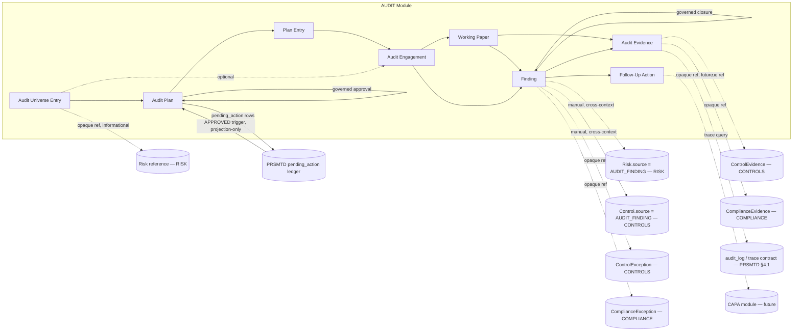
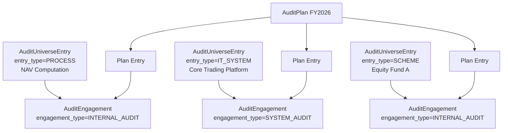
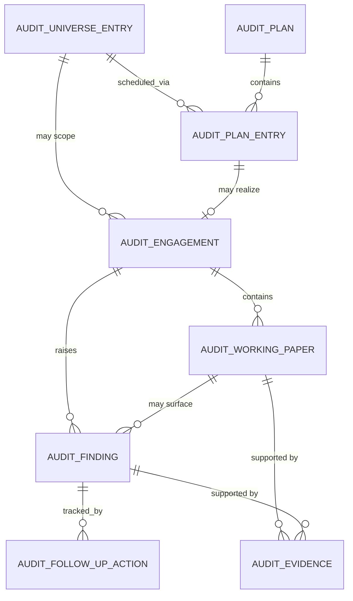
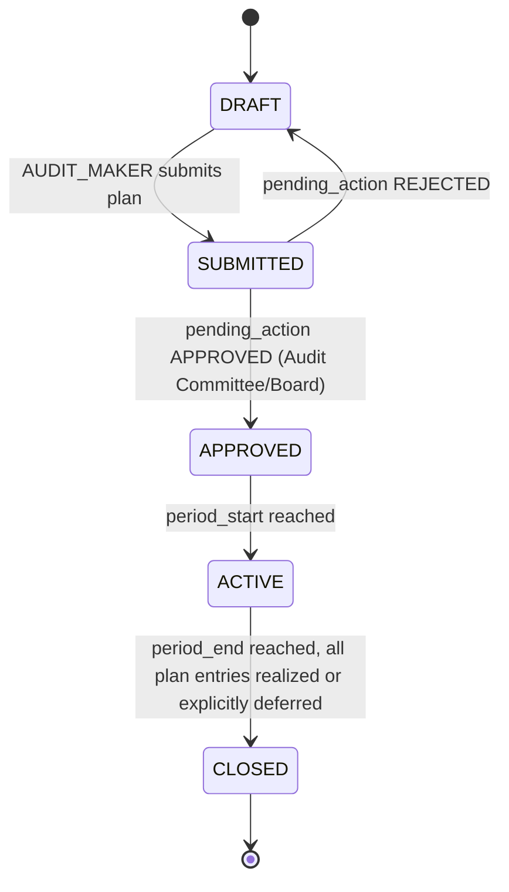
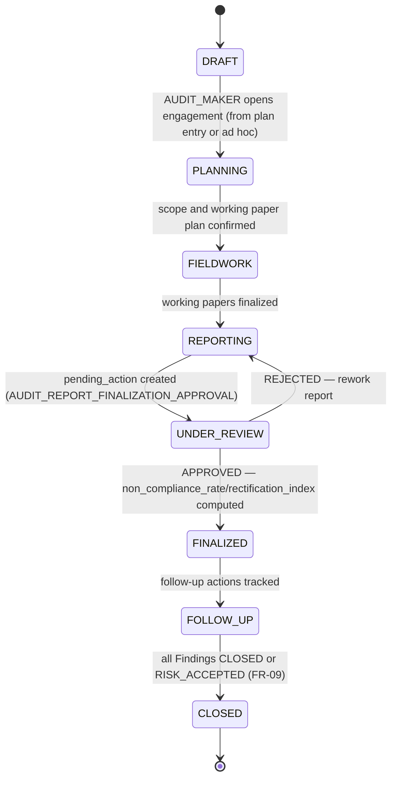
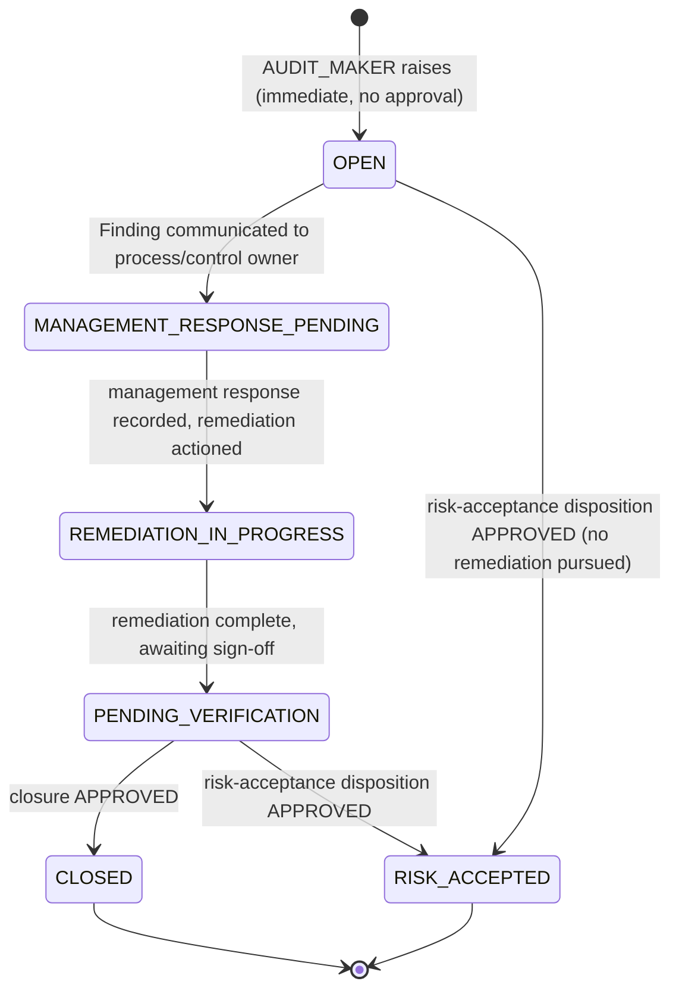

# 13.01 — Audit Management

## Purpose

Defines the Audit Management capability: the audit universe, risk-based audit planning, the
audit engagement lifecycle (Planning → Fieldwork → Findings → Reporting → Follow-up), working
papers and evidence, and Finding governance — for a SEBI-regulated Mutual Fund AMC, built
entirely on PRSMTD's existing multi-tenant, governance, RBAC, and audit substrate. This is the
fifth authoritative, implementation-ready specification in this repository. It activates the
`AUDIT` bounded context reserved by
[`04-domain-model/01-enterprise-domain-model.md`](../04-domain-model/01-enterprise-domain-model.md)
(Conformist toward `RISK`, `CONTROLS`, and `COMPLIANCE`), the `Risk.source = AUDIT_FINDING` and
`Control.source = AUDIT_FINDING` values both already live in
[`10-risk/01-enterprise-risk-management.md`](../10-risk/01-enterprise-risk-management.md) and
[`12-controls/01-controls-management.md`](../12-controls/01-controls-management.md), and the
evidence-reuse expectation
[`11-compliance/01-compliance-management.md`](../11-compliance/01-compliance-management.md)
reserved in its own "Integration with Future Audit" section — without modifying any of the
three.

## Scope

**In scope**: the audit universe register, risk-based annual/periodic audit planning, the
audit engagement lifecycle (internal audit, system audit, concurrent audit, thematic review,
special investigation), working papers, audit evidence (evidence authored natively by this
module, plus opaque references to `CONTROLS`' and `COMPLIANCE`' existing evidence and to
PRSMTD's own observability trace contract), Findings (immediate-raise, governed-closure,
distinct from a Control Exception or Compliance Exception), Finding → Risk / Control /
Obligation linkage, follow-up action tracking, the non-compliance-rate and Rectification Index
metrics the SEBI Annexures name explicitly, and this module's security/audit/reporting/API
surface.

**Out of scope** (forward-referenced, not yet specified):
- The Policy module — no such module exists yet in ERM or PRSMTD; a Finding's root cause may
  cite a policy gap only as free text until Policy exists, mirroring how `11-compliance`
  treats its own `POLICY` link today.
- Incident, Issue, and CAPA management — a Finding's remediation (`FollowUpAction`) is tracked
  inline in this module until CAPA exists, mirroring `10-risk`'s, `12-controls`', and
  `11-compliance`'s identical treatment of their own remediation fields.
- A platform document/object storage capability — `AuditEvidence` reuses the identical
  metadata-plus-opaque-`storage_ref` shape `ControlEvidence`/`ComplianceEvidence` established;
  this is the same platform capability gap already flagged twice, not a third one (see
  [Assumptions](#assumptions), Assumption 5).
- Reconciling PRSMTD's `system.md §18` Product Framework doctrine with this repository's
  generic-module design — the same deferred, not-blocking question `12-controls` and
  `04-domain-model` already carry; this spec adds nothing new to that question.
- External/statutory financial audit (a company-law/tax-law function outside SEBI's Mutual
  Fund regulatory scope) — this module's `engagement_type` taxonomy includes `SYSTEM_AUDIT`
  and `CONCURRENT_AUDIT` (SEBI-mandated) and `INTERNAL_AUDIT` (SEBI-mandated) but does not
  model the statutory financial audit performed under the Companies Act, which is out of this
  repository's SEBI-AMC-profile scope for now.
- Regulatory profiles other than `SEBI_AMC` — schema is profile-configurable per the pattern
  `10-risk`/`12-controls`/`11-compliance` established; only `SEBI_AMC` seed content is defined
  here.
- Regulatory Reporting as a distinct capability (`docs/14-reporting/`) — this spec exposes
  source data/views only, per the same convention every prior module used.

## Business Context

`10-risk` and `12-controls` were each authored with an explicit, opaque forward-reference to
this module: `Risk.source` and `Control.source` both already carry a live `AUDIT_FINDING`
value with nothing on the other end producing it, and `12-controls`' evidence model is named
by `04-domain-model` as the shape this module's own evidence is expected to reuse or
supersede. `11-compliance` goes further and names three concrete forward-looking integration
points in its own "Integration with Future Audit" section (Obligation/Compliance Assessment as
audit-universe input, `ComplianceEvidence` as evidentiary substrate, a stale
`RegulatoryChange` as a Finding trigger) — the first future-context integration section any
spec in this repository has pre-written before its counterpart existed. This module activates
all of it.

Unlike `11-compliance` (an Open Host Service that `RISK` and `CONTROLS` consume without
`COMPLIANCE` reading either of them back), Audit is `04-domain-model`'s designated
**Conformist** toward `RISK`, `CONTROLS`, and `COMPLIANCE`: it is the one context in this
repository whose entire reason to exist is to independently examine what the other three
already recorded, and it does not get to renegotiate their models to do so. That asymmetry
shapes this spec's Architecture and Integration sections directly — Audit reads across every
other context's reference-resolution API more than any prior module needed to, but changes
none of their schemas.

SEBI's Annexures to the Master Circular for Mutual Funds name Internal Audit as one of the
AMC's three mandatory lines of defense alongside Business Operations and the Oversight
functions (Risk Management, Compliance) — the exact structure `10-risk`, `12-controls`, and
`11-compliance` already collectively operationalize for the first two lines. This module
operationalizes the third: a governed, evidenced record of what the AMC's Internal Audit
function (and its SEBI-mandated System Audit counterpart) actually examined, found, and
followed up on, replacing what §1.3.4.1 assumes is otherwise a narrative-only audit report
process.

## Regulatory Drivers

Source: [`../reference/Annexures to Master Circular for Mutual Funds as on March 31,
2023_p.pdf`](../reference/Annexures%20to%20Master%20Circular%20for%20Mutual%20Funds%20as%20on%20March%2031%2C%202023_p.pdf)
§1.3.4.1 (Internal Audit as a mandatory line of defense; text-extractable, re-read for this
spec specifically for §1.3.4.1 and Annexure 8 clause 55 — not previously cited at this
precision by `10-risk` (§II–§VII of a different source document), `12-controls` (§2.5/§2.11
and the System Audit Program Checklist's *content*, not its governing cadence clause), or
`11-compliance` (§2.6)), cross-referenced with
[`../reference/Risk Management System for Mutual Funds.pdf`](../reference/Risk%20Management%20System%20for%20Mutual%20Funds.pdf)
(re-cited only for the Board/Trustee reporting cadence, already `10-risk`'s primary source).

| Driver | Source reference | How this spec satisfies it |
|---|---|---|
| AMCs shall have an established structure across three lines of defense: Business Operations, Oversight (Risk Management/Compliance), and Internal Audit | Annexures §1.3.4.1.1(i) a–c | This module is the system of record for the third line; `RISK` and `COMPLIANCE` already operationalize the first two (re-cited, not redesigned). |
| A dedicated internal auditor (in-house or an independent auditor appointed by Trustees, with domain expertise, free of conflict with the Compliance/Risk audit functions) shall audit both scheme-level and AMC-level risks, and compliance with internal policy and SEBI regulation | Annexures §1.3.4.1.1(ii) a–c | `AuditEngagement.auditor_type` ∈ `INTERNAL, EXTERNAL_INDEPENDENT`; `engagement_type = INTERNAL_AUDIT`; `scope_description` records the scheme-level vs. AMC-level audit boundary per engagement — see [Audit Engagement](#audit-engagement). |
| A non-compliance rate shall be computed for the processes audited, based on sampling | Annexures §1.3.4.1.1(ii)(d) | `AuditEngagement.non_compliance_rate`, computed from the engagement's own `WorkingPaper` sample/exception counts — see [Non-Compliance Rate and Rectification Index](#non-compliance-rate-and-rectification-index). |
| The non-compliance rate shall be submitted to the Audit Committee and Board as an internal audit score, and compared across subsequent audits as a "Rectification Index" reflecting the degree of rectification | Annexures §1.3.4.1.1(ii)(e)–(f) | `AuditEngagement.rectification_index`, computed at report finalization against the immediately preceding engagement for the same `AuditUniverseEntry` — see [Non-Compliance Rate and Rectification Index](#non-compliance-rate-and-rectification-index). |
| AMCs shall arrange to have systems audited on a semi-annual basis by an independent CISA/CISM-qualified or CERT-IN empanelled auditor, and submit the report to SEBI (with Board/Trustee comments) within three months of financial year end | Annexures Annexure 8, clause 55 (giving effect to SEBI/HO/IMD/DF2/CIR/P/2019/57) | `engagement_type = SYSTEM_AUDIT`; `auditor_type = EXTERNAL_INDEPENDENT`; `auditor_qualification` free-text field records the CISA/CISM/CERT-IN empanelment; `report_submitted_to_sebi_date` tracks the three-month statutory filing deadline — see [Audit Engagement](#audit-engagement) and [Reporting Requirements](#reporting-requirements). |
| The System Audit Program Checklist scope (IT Governance, Information Security, Access Management, Change Management, Incident Management, Backup & Recovery, Job Processing, BCP/DR) | Annexures, System Audit Program Checklist §§1–8 — already the seeded `SEBI_AMC` control family taxonomy in `12-controls` | This module does not re-seed the checklist as taxonomy; a `SYSTEM_AUDIT` engagement's `WorkingPaper`s test against `12-controls`' existing control families via the same Conformist-evidence-reuse pattern this spec establishes — see [Integration with Controls](#integration-with-controls). |
| Reporting of risk-management outcomes to management (monthly), Board/Trustees (quarterly), incorporating the internal audit Rectification Index | Risk Management System circular §1.4.2.1(ii)–(iii) | `AuditEngagement.rectification_index` is exposed to `10-risk`'s existing Board Risk Report channel as source data, not a new reporting mechanism — see [Reporting Requirements](#reporting-requirements). |
| Maker-checker authorization on audit plan approval and finding closure | Best-practice pattern across the Annexures' approval matrices, same as every prior module | Reuses PRSMTD's `pending_action` governance ledger — see [Workflows](#audit-plan-lifecycle). |

## Assumptions

1. **Tenant = one AMC.** Same as `10-risk` Assumption 1 / `12-controls` Assumption 1 /
   `11-compliance` Assumption 1 — this module is entirely tenant-plane data.
2. **Regulatory profile is configuration, not schema.** This module introduces no new
   taxonomy reference table of its own (unlike `RiskCategory`/`ControlFamily`/
   `ObligationCategory`) — `AuditUniverseEntry.entry_type` and `AuditEngagement.engagement_type`
   are closed enums, not regulatory-profile-seeded hierarchies, because the SEBI Annexures
   define audit *types* (internal, system, concurrent) as a fixed statutory list rather than a
   configurable taxonomy the way risk/control/obligation categories are. If a future
   regulatory profile needs additional engagement types, that is an additive enum value, the
   same non-invasive change every prior module's own enums accept.
3. **Users referenced by this module** (`lead_auditor_user_id`, `owner_user_id`,
   `identified_by`, `verified_by`, etc.) **are platform/tenant identity records**, not
   module-owned data — same reasoning as `10-risk` Assumption 4 / `12-controls` Assumption 3 /
   `11-compliance` Assumption 3. An `EXTERNAL_INDEPENDENT` auditor (Annexures §1.3.4.1.1(ii)(a)
   and Annexure 8 clause 55's CISA/CISM/CERT-IN requirement) is represented the same way
   `10-risk`'s and `12-controls`' own "external agency" accommodation already works: a
   platform user account assigned the appropriate module role, not a bespoke external-party
   entity.
4. **A "Finding" is a distinct concept from a Control Exception or a Compliance Exception,
   not a duplicate of either.** `04-domain-model`'s canonical glossary already draws this
   distinction explicitly ("a Finding is raised by an independent Audit engagement," where a
   Control Exception is raised by the control's own owner). This spec honors that distinction:
   a Finding may *reference* an existing `ControlException`/`ComplianceException` (opaque,
   nullable link) when the audit corroborates an already-known gap, or exist independently
   when the audit surfaces something neither module's own owner had raised. Findings are never
   auto-created from Exceptions or vice versa.
5. **This module inherits, not repeats, the object-storage gap `12-controls` Assumption 4
   first confirmed and `11-compliance` Assumption 5 inherited.** `AuditEvidence` uses the
   identical metadata-plus-opaque-`storage_ref` shape for evidence it authors natively. See
   [Evidence and Working Papers](#evidence-and-working-papers) for the one genuinely new
   evidence path this module adds — evidence sourced directly from PRSMTD's own observability
   trace contract, which requires no object-storage capability at all because the platform
   already retains the underlying trace data (system.md §4.1).
6. **`Risk.source = AUDIT_FINDING` and `Control.source = AUDIT_FINDING` are already live —
   no additive change to `10-risk` or `12-controls` is required by this spec.** Unlike
   `11-compliance`, which had to propose (not build) a new `Risk.source` enum value and a new
   `CONTROLS`-side endpoint, this module's two primary cross-context activations were already
   anticipated with a real enum value at authoring time (confirmed in
   `04-domain-model`'s Cross-Context APIs table: both edges listed "Reserved, enum value
   already live"). This spec is therefore the first to activate a forward reference without
   proposing any change, however small, to either frozen source spec.
7. **A Finding's remediation (`FollowUpAction`) is free-text-plus-structured-fields tracking,
   not a CAPA record.** Same interim-measure treatment `10-risk`'s `RiskTreatmentPlan`,
   `12-controls`' `ControlException`, and `11-compliance`'s `ComplianceException` each already
   use for their own remediation fields — `FollowUpAction.capa_ref_id` is reserved (opaque, no
   FK) for a future CAPA module, inert until it ships.
8. **Working paper supervisory review is not routed through `pending_action` at MVP.** A
   reviewer sign-off on a `WorkingPaper` is an internal audit-methodology quality-control step
   (the profession's own "preparer/reviewer" convention), not itself a governed business
   decision with SoD implications the platform's `approved_by <> created_by` constraint needs
   to enforce — the governed decisions this module actually gates are the Audit Plan's
   approval, a Finding's closure, and an engagement's report finalization. This is the same
   "not every mutation needs governance" precedent `RiskAppetite`, `ControlFamily`, and
   `ComplianceCalendarEntry` edits already established three times; flagged in
   [Future Extension Points](#future-extension-points) as a candidate for governance if audit
   rigor later requires it, consistent with the open "governed configuration change" decision
   already logged in `docs/roadmap.md`.
9. **The non-compliance rate and Rectification Index formulas are computed by this module
   from its own `WorkingPaper`/`Finding` counts, not independently specified beyond what the
   Annexures state.** §1.3.4.1.1(ii)(d) says only that the rate is "computed based on sampling
   out of the total number of processes being audited" — this spec defines the numerator
   (samples with at least one associated Finding) and denominator (total samples across the
   engagement's `WorkingPaper`s) at the precision the source circular itself specifies, and
   leaves the exact weighting (e.g. severity-weighted vs. simple count) as tenant-configurable
   business logic rather than inventing a formula the regulator did not mandate. See
   [Non-Compliance Rate and Rectification Index](#non-compliance-rate-and-rectification-index).
10. **An `AuditEngagement` may exist without a prior `AuditPlan` entry.** Special
    investigations and regulator-triggered reviews are a normal part of an Internal Audit
    function's mandate and should not be blocked on retroactively amending an approved annual
    plan — `AuditEngagement.plan_entry_id` is nullable. This mirrors the same
    "ad-hoc creation alongside a governed register" flexibility `11-compliance`'s
    `ComplianceException` (raised immediately, not planned) already established in spirit for
    a different entity.
11. **`AuditUniverseEntry` risk rating is this module's own, independent prioritization
    signal — not a re-hosting of `RISK`'s residual risk score.** An audit universe entry may
    optionally carry an opaque, informational cross-reference to a `RISK` register entry
    (`related_risk_ref_id`) for context, but its own `risk_rating` is set by the Chief
    Internal Auditor during audit planning using audit-specific criteria (materiality,
    complexity, time since last audit, known issue history) — the same reasoning
    `04-domain-model`'s Third-Party Risk section gives for `VendorRiskCategory` specializing
    rather than duplicating `RISK`'s taxonomy, applied here to a rating rather than a
    taxonomy.
12. **Maker and Checker are always distinct individuals** — enforced by PRSMTD's
    platform-level `approved_by <> created_by` constraint on `pending_action`, same mechanism
    every prior module relies on; no bespoke SoD mechanism is designed here.

## Dependencies

- PRSMTD `docs/authoritative/system.md` §3 (Governance model, GOV-07), §4.1 (Observability &
  Deterministic Trace Contract — the direct substrate for
  [System-Trace Evidence](#evidence-and-working-papers), the one genuinely new evidence
  pattern this spec introduces), §7 (Data model & RLS enforcement), §8 (RBAC model), §9 +
  §5a–§5c (Module framework, ownership guards OWN-03/04/07/08/09), §10 (Audit and compliance),
  §21 (Authentication Surface Ownership) — all reused as-is, no PRSMTD changes required by
  this spec. Confirmed via a targeted re-search (this session) that no platform document/
  object-storage capability has been added since `12-controls` Assumption 4 was first written
  — the gap remains open exactly as `12-controls`/`11-compliance` already describe it.
- [`10-risk/01-enterprise-risk-management.md`](../10-risk/01-enterprise-risk-management.md) —
  **not modified by this spec.** Its `Risk.source = AUDIT_FINDING` value is already live
  (Assumption 6) and is the reserved value this module's Findings populate by manual
  cross-context action.
- [`12-controls/01-controls-management.md`](../12-controls/01-controls-management.md) — **not
  modified by this spec.** Its `Control.source = AUDIT_FINDING` value is already live
  (Assumption 6); its `ControlTest`/`ControlEvidence` records are this module's primary
  evidentiary substrate for control-related audit procedures, consumed via reference-resolution
  API, never a direct table read.
- [`11-compliance/01-compliance-management.md`](../11-compliance/01-compliance-management.md)
  — **not modified by this spec.** Its own "Integration with Future Audit" section already
  reserved the three integration points this spec activates from the Audit side: Obligation/
  Compliance Assessment as audit-universe input, `ComplianceEvidence` as evidentiary
  substrate, and a stale `RegulatoryChange` as a candidate Finding trigger.
- [`04-domain-model/01-enterprise-domain-model.md`](../04-domain-model/01-enterprise-domain-model.md)
  — **frozen input.** This spec follows its Common Domain Patterns shared kernel
  (governed lifecycle with append-only history, immediate-raise/governed-closure exception,
  opaque cross-context reference with local mirror, human-readable code sequence, descriptive
  `source` classification) exactly, honors its Conformist relationship designation for
  `AUDIT` toward `RISK`/`CONTROLS`/`COMPLIANCE`, and resolves its deferred
  ["Evidence as a Cross-Cutting Concept"](../04-domain-model/01-enterprise-domain-model.md#evidence-as-a-cross-cutting-concept)
  question the same way `11-compliance` did — reuse by convention, not promotion to a shared
  platform entity — while adding the system-trace evidence path that document did not
  anticipate (see Assumption 5).
- `../reference/Annexures to Master Circular for Mutual Funds as on March 31, 2023_p.pdf`
  §1.3.4.1 and Annexure 8 clause 55 — regulatory source, re-read for this spec specifically
  for the Internal Audit three-lines-of-defense mandate and the System Audit cadence/filing
  requirement (not previously cited at this precision by any prior spec).
- `docs/13-audit/README.md` — read to ground this module's scope (audit universe, risk-based
  planning, engagement lifecycle, working papers, Finding → Issue/CAPA linkage) and confirm no
  separate `05-modules/`/`06-data-model/`/`08-api/`/`09-security/` document is expected,
  matching every prior module's precedent of being the canonical, self-contained source for
  its own data/API/security content.
- `docs/22-traceability/01-master-traceability-matrix.md` — updated by this session.
- `docs/roadmap.md` — recorded this document as the recommended next milestone; updated by
  this session with progress and the next recommended milestone.

## Architecture

The Audit capability is one PRSMTD module: **module code `AUDIT`**. It follows the generic
module framework exactly as `RISK`, `CONTROLS`, and `COMPLIANCE` do (system.md §9/§5a–§5c),
for consistency with the established repository pattern:

- `moduleId`: a stable UUID minted at implementation time, not fixed by this specification.
- Table prefix: `module_audit_*` (OWN-03 schema ownership).
- Route namespace: `/modules/AUDIT` (§5b4).
- API namespace: `/api/v1/modules/audit/**`, controllers in `com.prsbnjs.modules.audit`
  (OWN-07).
- Module role types: `MAKER`, `CHECKER`, `VIEWER` only — the closed set (system.md §8).
  Domain personas map onto these three; see [Authorization Model](#authorization-model).
- **`dependencies: [RISK, CONTROLS, COMPLIANCE, SECURITY, INCIDENT, TPR, BCP]`** (`SECURITY`
  added Session 7, per [Integration with Security](#integration-with-security); `INCIDENT`,
  `TPR`, `BCP` added Session 15 — Additive Change Consolidation, for `FollowUpAction`'s new
  CAPA-initiating call and the two new `AuditUniverseEntry` reference-resolution reads, see
  [Integration with Future CAPA](#integration-with-future-capa), [Integration with Third-Party
  Risk Management](#integration-with-third-party-risk-management), and [Integration with
  Business Continuity Management](#integration-with-business-continuity-management)). Unlike
  every prior module — each of
  which shipped with `dependencies: []` and had a *downstream* module's manifest gain the edge
  later — `AUDIT` is `04-domain-model`'s designated Conformist sink: it is the first module in
  this repository whose own manifest declares dependencies on other ERM contexts at
  authoring time, because its entire function is to call each of their reference-resolution
  APIs (Risk, Control, Obligation, and — activated Session 7 — Security Finding reference
  DTOs) as part of ordinary fieldwork, not as an occasional cross-context activation. This is
  consistent with `04-domain-model`'s Dependency Rule 5 ("`AUDIT` and `REPORTING` are expected
  to be the graph's sinks... every other core-domain context is a potential dependency of
  theirs").
- No platform-plane tables, no platform-plane governance actions — every governed action is
  tenant-plane (`app.plane = 'tenant'`).
- Tenant isolation, GUC binding, and session-setter usage are inherited unmodified from
  `TenantAwareDataSource` (system.md §7) — this module issues no direct `SET`/`set_config`
  calls.
- **Cross-module access is API-mediated only (OWN-08/OWN-09).** `AUDIT` never reads `RISK`'s,
  `CONTROLS`', `COMPLIANCE`'s, or `SECURITY`'s tables directly; none of the four reads
  `AUDIT`'s tables directly. Every cross-context reference this module makes is a call through
  the supplying module's existing `.api`/`.client` reference-resolution endpoint — no new
  endpoint was required on `RISK`, `CONTROLS`, or `COMPLIANCE` (each already exposed one:
  `GET /risks/{id}/reference`, `GET /controls/{id}/reference`,
  `GET /obligations/{id}/reference`); `SECURITY` gained its own
  `GET /findings/{id}/reference` endpoint additively alongside this session's activation (see
  [Integration with Security](#integration-with-security)).



## Domain Model

**Bounded context**: Audit Management. Owns the audit universe, audit plans, engagements,
working papers, and Findings exclusively. Confirms `04-domain-model`'s Conformist
relationship designation: `AUDIT` consumes `RISK`'s, `CONTROLS`', and `COMPLIANCE`'s facts
through their existing reference-resolution APIs without ever requiring a schema change to
any of them (Assumption 6) — see [Architecture](#architecture) and the Integration sections
below.

**Ubiquitous language** (extends, does not redefine, `04-domain-model`'s canonical glossary —
per that document's closing rule, "a term means one thing repository-wide"; every term below
is new at this layer or refines an already-reserved definition without contradicting it):

| Term | Definition |
|---|---|
| Audit Universe Entry | An auditable unit — a process, scheme, IT system, vendor relationship, or department/function — carrying its own audit-specific risk rating and audit cycle, independent of `RISK`'s residual risk score (Assumption 11). |
| Audit Plan | A governed, periodic (typically annual) set of scheduled engagements against the audit universe, approved by the Audit Committee/Board — the risk-based planning artifact Annexures §1.3.4.1 and this module's README both name. |
| Audit Engagement | The aggregate root of an actual audit — internal audit, system audit, concurrent audit, thematic review, or special investigation — carrying the Planning → Fieldwork → Reporting → Follow-up lifecycle. |
| Working Paper | A single documented audit procedure (a test, a walkthrough, an inquiry) performed during an engagement's fieldwork, its result, and the evidence supporting it — the auditor's own record of what was examined and concluded. |
| Finding | An audit-identified gap or non-conformance, raised by an independent Audit engagement — distinct from a Control Exception (raised by the control's own owner) or a Compliance Exception (raised by the obligation's own owner) per `04-domain-model`'s canonical glossary. |
| Follow-Up Action | A tracked remediation step for a Finding, owned by a responsible individual with a target date — an interim measure pending a future CAPA module (Assumption 7). |
| Non-Compliance Rate | The Annexures §1.3.4.1.1(ii)(d)-mandated, sampling-based measure of the proportion of audited processes/samples with at least one Finding, computed per `AuditEngagement`. |
| Rectification Index | The Annexures §1.3.4.1.1(ii)(f)-mandated trend metric comparing an engagement's Non-Compliance Rate against the immediately preceding engagement for the same Audit Universe Entry. |
| Audit Evidence | A metadata record (integrity hash + opaque storage pointer, or an opaque reference to another context's existing evidence, or a system-trace query reference) supporting a Working Paper or a Finding. |

**Aggregates, entities, and invariants**:

- **AuditUniverseEntry** (reference-ish register, not a taxonomy) — `status ∈ ACTIVE,
  RETIRED`; edited directly by `AUDIT_ADMIN` (not `pending_action`-governed at MVP, same
  ungoverned-reference-data precedent `RiskCategory`/`ControlFamily`/`ObligationCategory`
  establish, though this is a flat register rather than a hierarchy — see
  [Audit Universe](#audit-universe)).
- **AuditPlan** (aggregate root) — Cannot move from `DRAFT`/`SUBMITTED` to `APPROVED` without
  `pending_action` approval. Cannot be edited once `APPROVED` — a mid-cycle change is a new
  `AuditPlanEntry` addition under a separate governed amendment action, not a direct edit
  (see [Audit Plan Lifecycle](#audit-plan-lifecycle)).
- **AuditPlanEntry** (entity, owned by AuditPlan) — Links a plan to an `AuditUniverseEntry`,
  a scheduled `engagement_type`, and a target period; may or may not be later realized by an
  actual `AuditEngagement`.
- **AuditEngagement** (aggregate root) — Cannot reach `FINALIZED` without at least one
  `pending_action`-approved report-finalization decision. Cannot be `CLOSED` while it has a
  `Finding` in status `OPEN`, `MANAGEMENT_RESPONSE_PENDING`, `REMEDIATION_IN_PROGRESS`, or
  `PENDING_VERIFICATION` — the same "no-closure-while-active-work-exists" shape `10-risk`,
  `12-controls`, and `11-compliance` each enforce for their own aggregate roots.
- **WorkingPaper** (entity, owned by AuditEngagement) — `status ∈ DRAFT, FINAL`; immutable
  once `FINAL`, but reviewer sign-off is a plain field update, not `pending_action`-governed
  (Assumption 8).
- **Finding** (entity, owned by AuditEngagement) — Raised immediately by an `AUDIT_MAKER` (no
  governance required to open — an audit observation should not wait on approval to be
  recorded); closure or `RISK_ACCEPTED` disposition requires `AUDIT_CHECKER` approval —
  identical shape to `ControlException`/`ComplianceException` (the immediate-raise,
  governed-closure shared-kernel pattern `04-domain-model` already names this entity as a
  candidate for).
- **FollowUpAction** (entity, owned by Finding) — Plain operational status edits, not
  separately governed; the owning Finding's own closure approval is the governance event that
  matters (mirrors how a `ComplianceCalendarEntry` is operational tracking subordinate to its
  owning Obligation's governed lifecycle).
- **AuditEvidence** (entity, attached to exactly one of WorkingPaper or Finding) — Immutable
  metadata once uploaded; supersession creates a new row, never an edit — same convention as
  `ControlEvidence`/`ComplianceEvidence`. `evidence_source` distinguishes natively-authored
  evidence from opaque references to another context's evidence or to a system-trace query
  (see [Evidence and Working Papers](#evidence-and-working-papers)).

## Audit Universe

The audit universe is the flat register of everything the Internal Audit function may audit —
scoped to satisfy Annexures §1.3.4.1.1(ii)(b)'s requirement that "the internal auditor should
audit both the scheme level and AMC level risks." Unlike `RiskCategory`/`ControlFamily`/
`ObligationCategory`, this is not a two-level, regulatory-profile-seeded taxonomy (Assumption
2) — it is a flat, tenant-maintained register of actual auditable units.

**`module_audit_universe_entry` seed**: none — unlike every prior module's reference data,
the audit universe has no SEBI-mandated starter list to seed; it is populated by the tenant's
Chief Internal Auditor during initial audit-program setup, reflecting the AMC's actual
processes, schemes, systems, and vendors. This is a genuine difference from every prior
module's Regulatory Framework Hierarchy / Control Taxonomy / Regulatory Framework Hierarchy
section, not an oversight — the Annexures name *what kind* of things must be audited
(processes, scheme-level and AMC-level risk) without naming the AMC's specific processes,
which only the tenant itself can enumerate.



`entry_type ∈ PROCESS, SCHEME, IT_SYSTEM, VENDOR, DEPARTMENT_FUNCTION` — covering the
Annexures' scheme-level/AMC-level split plus the System Audit's IT-system and vendor scope
(Annexure 8's own note that AMCs are "responsible for ensuring that adequate and effective
control environment exists over the IT systems in use... including that at vendors/third
parties supporting operations like RTAs, Fund Accountants, Custodians").

## Functional Requirements

| ID | Requirement | Regulatory tie |
|---|---|---|
| FR-01 | The system shall provide a flat, tenant-maintained Audit Universe register of auditable entries (`PROCESS, SCHEME, IT_SYSTEM, VENDOR, DEPARTMENT_FUNCTION`), each carrying an audit-specific risk rating and audit cycle. | Annexures §1.3.4.1.1(ii)(b) |
| FR-02 | `AUDIT_MAKER` users shall create and edit Audit Plans while in `DRAFT` status, adding `AuditPlanEntry` line items that schedule universe entries against an `engagement_type` and target period. | Annexures §1.3.4.1 (risk-based planning) |
| FR-03 | An Audit Plan shall not reach `APPROVED` status without `AUDIT_CHECKER` (Audit Committee/Board) approval via `pending_action`. | Annexures §1.3.4.1 (Board-level oversight) |
| FR-04 | The maker and the approver of any governed action in this module shall never be the same individual (platform `approved_by <> created_by` constraint). | Independent audit sign-off, mirrors every prior module's identical FR |
| FR-05 | The system shall support Audit Engagements of type `INTERNAL_AUDIT, SYSTEM_AUDIT, CONCURRENT_AUDIT, THEMATIC_REVIEW, SPECIAL_INVESTIGATION`, each optionally linked to an `AuditPlanEntry` (Assumption 10) and optionally to an `AuditUniverseEntry`. | Annexures §1.3.4.1, Annexure 8 clause 55 |
| FR-06 | A `SYSTEM_AUDIT` engagement shall record `auditor_type = EXTERNAL_INDEPENDENT` and an `auditor_qualification` value evidencing the CISA/CISM-qualified-or-CERT-IN-empanelled requirement, and shall track `report_submitted_to_sebi_date` against the statutory three-month-post-financial-year-end deadline. | Annexures Annexure 8, clause 55 |
| FR-07 | The system shall support Working Papers recording a procedure performed, its sample basis, population/sample size, and result (`SATISFACTORY, EXCEPTION_NOTED, NOT_APPLICABLE`), immutable once `FINAL`. | Annexures §1.3.4.1.1(ii)(d) (sampling basis for non-compliance rate) |
| FR-08 | The system shall support Findings, raised immediately by an `AUDIT_MAKER` without prior approval, with governed closure (`CLOSED` or `RISK_ACCEPTED`) requiring `AUDIT_CHECKER` approval. | — |
| FR-09 | An Audit Engagement shall not be closable while any Finding remains `OPEN`, `MANAGEMENT_RESPONSE_PENDING`, `REMEDIATION_IN_PROGRESS`, or `PENDING_VERIFICATION`. | — |
| FR-10 | The system shall compute a `non_compliance_rate` per Audit Engagement from its Working Papers' sample counts and associated Findings, and a `rectification_index` at report finalization comparing it against the immediately preceding engagement for the same Audit Universe Entry. | Annexures §1.3.4.1.1(ii)(d)–(f) |
| FR-11 | A Finding shall optionally record an opaque, non-FK reference to an existing `ControlException` or `ComplianceException` it corroborates, and shall optionally be used to create a Risk register entry (`Risk.source = AUDIT_FINDING`) or a new Control (`Control.source = AUDIT_FINDING`) via manual cross-context action. | Activates already-live `10-risk`/`12-controls` enum values (Assumption 6) |
| FR-12 | The system shall support Follow-Up Actions per Finding, each with an owner, target date, and status (`OPEN, IN_PROGRESS, COMPLETED, OVERDUE, VERIFIED`), and an opaque, non-FK reference reserved for a future CAPA module. | — |
| FR-13 | Audit Evidence shall attach to exactly one of a Working Paper or a Finding, and shall support three sources: natively-uploaded metadata-plus-integrity-hash evidence, an opaque reference to an existing `ControlEvidence`/`ComplianceEvidence` record resolved via that module's reference API, or a system-trace query reference resolved against PRSMTD's own observability trace contract. | system.md §4.1 |
| FR-14 | Visibility shall be role-scoped: `AUDIT_VIEWER` — full tenant register, read-only; `AUDIT_MAKER` — full read, edit own engagements/working papers/findings; `AUDIT_CHECKER` — full read, plus all pending approvals across the tenant. | — |
| FR-15 | The independent audit function shall be satisfiable purely by role assignment (Chief Internal Auditor, Board Audit Committee member, or an external/CISA-CISM/CERT-IN-empanelled auditor holding `AUDIT_MAKER` or `AUDIT_CHECKER`) — no code change required per assignment choice. | Annexures §1.3.4.1.1(ii)(a); mirrors every prior module's identical FR |
| FR-16 | The system shall expose an audit universe register, an audit plan/schedule view, an engagement status dashboard, a finding register/aging report, a non-compliance-rate/Rectification-Index trend report, and a follow-up action tracker. | Annexures §1.3.4.1.1(ii)(d)–(f) |
| FR-17 | Every governed state transition shall be captured in the platform audit trail using canonical, non-aliased `action_type` values. | system.md §10 |

## Non-Functional Requirements

| Category | Requirement |
|---|---|
| Multi-tenancy | Full tenant isolation via PRSMTD RLS (system.md §7); zero platform-plane data in this module. |
| Performance | Engagement/finding list/filter queries shall return p95 < 500ms for tenants with up to 2,000 active engagement records; working-paper/evidence history queries shall paginate rather than return unbounded history. |
| Scalability | Schema and query patterns must not assume a ceiling on tenant count or per-tenant engagement/finding/evidence volume beyond the platform's general multi-tenant design targets. |
| Availability | Inherits platform availability targets (`18-deployment`, not yet authored) — no module-specific SLA is defined here. |
| Auditability | Every governed transition is immutable and traceable per system.md §4.1 T1–T7; no destructive updates on plan/finding/evidence history — the intentional irony of an "Audit" module itself relying on, rather than duplicating, the platform's own audit trail is deliberate, mirroring exactly how `10-risk`/`12-controls`/`11-compliance` each already decline to build a bespoke audit table. |
| Configurability | Audit Universe entries and engagement scheduling are tenant-editable operational data, not hardcoded. |
| Data retention | No physical deletion of governed records; a general cross-module retention-schedule capability remains unspecified, same open item `11-compliance` Assumption 10/Future Extension Points already names. |
| Data integrity | Natively-authored evidence records carry a content hash computed at upload time; system-trace evidence integrity is inherited from the platform's own trace contract guarantees (system.md §4.1), requiring no separate integrity mechanism. |
| Localization | Out of scope for this spec. |

## Canonical Data Model

All tables use module prefix `module_audit_`, live in the tenant plane, and carry the standard
PRSMTD columns: `id uuid PRIMARY KEY DEFAULT gen_random_uuid()`, `tenant_id uuid NOT NULL`
(RLS-scoped per system.md §7), `created_at timestamptz NOT NULL DEFAULT now()`, `created_by
uuid NOT NULL`. Lifecycle uses closed-set `status` columns, never soft-delete (`deleted_at`),
matching PRSMTD convention and every prior module's own data model. This section is the
canonical source for the Audit schema — no separate `06-data-model/` document duplicates it.
Every table below follows a shared-kernel shape already established by `10-risk`/
`12-controls`/`11-compliance` (see [Dependencies](#dependencies)), chosen specifically so this
module's first schema draft needs no structural rework once real cross-context queries are
written against it.

### Reference / configuration tables

| Table | Key columns | Notes |
|---|---|---|
| `module_audit_code_sequence` | `tenant_id`, `entity_type` (composite PK: `PLAN`, `ENGAGEMENT`, `FINDING`), `last_value int` | Backs human-readable `plan_code` (e.g. `AUDPLAN-2026-000002`), `engagement_code` (e.g. `AUDENG-2026-000031`), and `finding_code` (e.g. `FND-2026-000104`) generation from one shared table, mirroring `11-compliance`'s single-table-multi-entity-type sequence shape. |

### Core tables

| Table | Key columns | Notes |
|---|---|---|
| `module_audit_universe_entry` | `entry_code`, `entry_type`, `name`, `description`, `owner_user_id`, `risk_rating`, `related_risk_ref_id` (opaque uuid, nullable, no FK), `related_vendor_ref_id` (opaque uuid, nullable, no FK), `related_critical_service_ref_id` (opaque uuid, nullable, no FK), `audit_cycle_months`, `last_audit_date`, `next_due_date`, `status`, `updated_at` | `entry_type ∈ PROCESS, SCHEME, IT_SYSTEM, VENDOR, DEPARTMENT_FUNCTION`. `risk_rating ∈ LOW, MEDIUM, HIGH, CRITICAL`, set by the Chief Internal Auditor (Assumption 11). `status ∈ ACTIVE, RETIRED`. Not `pending_action`-governed (see [Audit Universe](#audit-universe)). `related_vendor_ref_id` — **added Session 15**, opaque, no FK, resolved via `25-third-party-risk`'s existing `GET /vendors/{id}/reference`, populated when `entry_type = VENDOR` — see [Integration with Third-Party Risk Management](#integration-with-third-party-risk-management). `related_critical_service_ref_id` — **added Session 15**, opaque, no FK, resolved via `26-business-continuity`'s existing `GET /critical-services/{id}/reference`, populated when `entry_type = PROCESS` and the process is BCM-tracked — see [Integration with Business Continuity Management](#integration-with-business-continuity-management). |
| `module_audit_plan` | `plan_code`, `plan_year`, `period_start`, `period_end`, `basis`, `status`, `approved_by`, `approved_at`, `updated_at` | The aggregate root. `basis` is a narrative field describing the risk-based methodology used to prioritize universe entries. `status ∈ DRAFT, SUBMITTED, APPROVED, REJECTED, ACTIVE, CLOSED`. |
| `module_audit_plan_entry` | `plan_id` (FK), `universe_entry_id` (FK), `engagement_type`, `scheduled_period`, `rationale` | `engagement_type ∈ INTERNAL_AUDIT, SYSTEM_AUDIT, CONCURRENT_AUDIT, THEMATIC_REVIEW, SPECIAL_INVESTIGATION` (same enum `AuditEngagement.engagement_type` uses). |
| `module_audit_engagement` | `engagement_code`, `engagement_type`, `universe_entry_id` (FK, nullable), `plan_entry_id` (FK, nullable), `title`, `scope_description`, `lead_auditor_user_id`, `auditor_type`, `auditor_qualification` (nullable), `period_start`, `period_end`, `status`, `overall_conclusion` (nullable), `non_compliance_rate` (numeric, nullable), `rectification_index` (numeric, nullable), `report_submitted_to_board_date` (nullable), `report_submitted_to_sebi_date` (nullable), `approved_by` (nullable), `approved_at` (nullable), `updated_at` | The aggregate root. `auditor_type ∈ INTERNAL, EXTERNAL_INDEPENDENT`. `status ∈ DRAFT, PLANNING, FIELDWORK, REPORTING, UNDER_REVIEW, FINALIZED, FOLLOW_UP, CLOSED`. `universe_entry_id`/`plan_entry_id` both nullable (Assumption 10 — ad-hoc engagements permitted). |
| `module_audit_working_paper` | `engagement_id` (FK), `procedure_description`, `sample_basis` (nullable), `population_size` (nullable), `sample_size` (nullable), `result`, `conclusion`, `prepared_by`, `prepared_at`, `reviewed_by` (nullable), `reviewed_at` (nullable), `status`, `updated_at` | `result ∈ SATISFACTORY, EXCEPTION_NOTED, NOT_APPLICABLE`. `status ∈ DRAFT, FINAL`. Immutable once `FINAL`; reviewer sign-off is a plain field update, not `pending_action`-governed (Assumption 8). |
| `module_audit_finding` | `finding_code`, `engagement_id` (FK), `working_paper_id` (FK, nullable), `title`, `description`, `finding_type`, `severity`, `root_cause` (nullable), `identified_date`, `identified_by`, `status`, `management_response` (nullable), `management_response_by` (nullable), `management_response_date` (nullable), `linked_risk_id` (opaque uuid, nullable, no FK), `linked_control_id` (opaque uuid, nullable, no FK), `linked_control_exception_id` (opaque uuid, nullable, no FK), `linked_obligation_id` (opaque uuid, nullable, no FK), `linked_compliance_exception_id` (opaque uuid, nullable, no FK), `linked_security_finding_id` (opaque uuid, nullable, no FK), `approved_by` (nullable), `approved_at` (nullable), `updated_at` | `finding_type ∈ CONTROL_DEFICIENCY, COMPLIANCE_GAP, PROCESS_GAP, IT_SECURITY_WEAKNESS, FRAUD_INDICATOR, OTHER`. `severity ∈ LOW, MEDIUM, HIGH, CRITICAL`. `status ∈ OPEN, MANAGEMENT_RESPONSE_PENDING, REMEDIATION_IN_PROGRESS, PENDING_VERIFICATION, CLOSED, RISK_ACCEPTED`. All six `linked_*` columns are **opaque, no FK — resolved via the owning module's `.api`/`.client` package (OWN-09)**, symmetric to `ControlException.linked_risk_id`/`ComplianceException.linked_risk_id`. `linked_security_finding_id` — added additively per `09-security/01-security-management.md`'s Integration with Audit section — lets a Finding of `finding_type = IT_SECURITY_WEAKNESS` corroborate an already-raised `SecurityFinding` rather than duplicating it, resolved via `SECURITY`'s reference-resolution API. |
| `module_audit_follow_up_action` | `finding_id` (FK), `description`, `owner_user_id`, `target_date`, `status`, `verified_by` (nullable), `verified_at` (nullable), `capa_ref_id` (opaque uuid, nullable, no FK), `updated_at` | `status ∈ OPEN, IN_PROGRESS, COMPLETED, OVERDUE, VERIFIED`. Not separately `pending_action`-governed — the owning Finding's closure approval is the governance event of record (Assumption 7). |
| `module_audit_evidence` | `working_paper_id` (FK, nullable), `finding_id` (FK, nullable), `evidence_source`, `evidence_type`, `title`, `description`, `storage_ref` (nullable), `file_name` (nullable), `mime_type` (nullable), `file_size_bytes` (nullable), `content_hash` (nullable), `external_module_code` (nullable), `external_evidence_ref_id` (opaque uuid, nullable, no FK), `trace_correlation_id` (nullable), `trace_query_ref` (nullable), `collected_at`, `collected_by`, `uploaded_at`, `uploaded_by`, `status` | Exactly one of `working_paper_id`/`finding_id` is non-null (application-layer invariant, extending `ControlEvidence`'s two-way rule). `evidence_source ∈ MANUAL_UPLOAD, CONTROLS_EVIDENCE_REFERENCE, COMPLIANCE_EVIDENCE_REFERENCE, SECURITY_EVIDENCE_REFERENCE, SYSTEM_TRACE_EXTRACT`. When `evidence_source = MANUAL_UPLOAD`, `storage_ref`/`content_hash`/file columns are populated and `external_*`/`trace_*` columns are null. When `evidence_source ∈ CONTROLS_EVIDENCE_REFERENCE, COMPLIANCE_EVIDENCE_REFERENCE, SECURITY_EVIDENCE_REFERENCE`, `external_module_code`/`external_evidence_ref_id` are populated (opaque, resolved via that module's reference API) and storage columns are null. When `evidence_source = SYSTEM_TRACE_EXTRACT`, `trace_correlation_id`/`trace_query_ref` are populated (a citation into PRSMTD's own `audit_log`/trace contract, system.md §4.1) and no storage or external-module columns are populated — see [Evidence and Working Papers](#evidence-and-working-papers). `evidence_type ∈ DOCUMENT, SCREENSHOT, SYSTEM_EXTRACT, INTERVIEW_NOTE, TRACE_CITATION, OTHER`. `status ∈ ACTIVE, SUPERSEDED, ARCHIVED`. `SECURITY_EVIDENCE_REFERENCE` — added additively per `09-security/01-security-management.md`'s Integration with Audit section — reuses the identical `external_module_code`/`external_evidence_ref_id` shape already established for `CONTROLS_EVIDENCE_REFERENCE`/`COMPLIANCE_EVIDENCE_REFERENCE`, no new column required. |

No bespoke audit table is defined — audit trail is the platform's `audit_log` per system.md
§10, reused as-is, exactly as every prior module does.

### ER diagram



## Audit Plan Lifecycle

All governed transitions reuse PRSMTD's `pending_action` ledger and the Governance Ledger +
Projection pattern (system.md §3, §9), exactly as every prior module does: an `AUDIT_MAKER`
proposes, an `AUDIT_CHECKER` decides, and a database trigger — never application code —
projects `APPROVED` decisions into the target aggregate's state. GOV-07 dedup applies per
action type, scoped to its logical target.

| `action_type` | Logical target (GOV-07 key) | Effect on APPROVED |
|---|---|---|
| `AUDIT_PLAN_APPROVAL` | `plan_id` | `AuditPlan.status = APPROVED`; plan becomes `ACTIVE` on its `period_start` date (application-layer transition, not a second governed action). |
| `AUDIT_FINDING_CLOSURE_APPROVAL` | `finding_id` | `Finding.status = CLOSED` or `RISK_ACCEPTED` (per the proposed disposition). |
| `AUDIT_REPORT_FINALIZATION_APPROVAL` | `engagement_id` | `AuditEngagement.status = FINALIZED`; `non_compliance_rate` and `rectification_index` are computed and locked (see [Non-Compliance Rate and Rectification Index](#non-compliance-rate-and-rectification-index)). |

Only three action types are needed — as with every prior module, there is no separate
"approve the Engagement itself" action for every stage transition: `DRAFT → PLANNING →
FIELDWORK → REPORTING → UNDER_REVIEW` are plain maker-driven status edits (an engagement
progressing through fieldwork is not itself a governed decision), and only the report
finalization and each Finding's closure require checker approval — the same minimalism
`10-risk`, `12-controls`, and `11-compliance` each apply to their own lifecycle.

### Audit plan lifecycle state machine



### Audit engagement lifecycle state machine



### Maker-checker sequence — report finalization

```mermaid
sequenceDiagram
    actor Lead as Lead Auditor (AUDIT_MAKER)
    participant App as AUDIT module service
    participant Ledger as pending_action ledger
    actor CIA as Chief Internal Auditor (AUDIT_CHECKER)
    participant Trig as DB projection trigger

    Lead->>App: Submit engagement report (REPORTING -> UNDER_REVIEW)
    App->>Ledger: INSERT pending_action(action_type=AUDIT_REPORT_FINALIZATION_APPROVAL, status=PENDING)
    Note over Ledger: GOV-07 dedup on engagement_id
    CIA->>App: Review working papers and findings
    CIA->>Ledger: Decide APPROVED (approved_by != created_by enforced)
    Ledger->>Trig: status -> APPROVED
    Trig->>App: Project: compute non_compliance_rate/rectification_index; AuditEngagement.status = FINALIZED
    App-->>Lead: Engagement finalized; report submittable to Board/SEBI per engagement_type
```

## Evidence and Working Papers

`AuditEvidence` does **not** duplicate `CONTROLS`', `COMPLIANCE`'s, or `SECURITY`'s evidence
models, nor does it re-implement binary storage (Assumption 5). It supports five distinct
evidence sources — the largest evidence-source set of any module in this repository,
reflecting Audit's Conformist role as the context that most needs to cite, not just produce,
evidence:

1. **Natively-authored evidence** (`MANUAL_UPLOAD`): documentation unique to the audit
   procedure itself (interview notes, walkthroughs, auditor work product) — the identical
   metadata-plus-`content_hash`-plus-opaque-`storage_ref` shape `ControlEvidence`/
   `ComplianceEvidence` established, so this module binds to a future platform object-storage
   capability identically to both, without a schema change.
2. **`CONTROLS`-evidence reference** (`CONTROLS_EVIDENCE_REFERENCE`): when a Working Paper's
   procedure re-examines an existing `ControlTest`/`ControlEvidence` record rather than
   performing new fieldwork, the auditor cites it by opaque reference, resolved through
   `CONTROLS`' existing `GET /controls/{id}/reference`-style API — never copied, never
   duplicated.
3. **`COMPLIANCE`-evidence reference** (`COMPLIANCE_EVIDENCE_REFERENCE`): the same pattern
   for `ComplianceEvidence`/`ComplianceAssessment` records, resolved through `COMPLIANCE`'s
   existing `GET /obligations/{id}/reference`-style API.
4. **`SECURITY`-evidence reference** (`SECURITY_EVIDENCE_REFERENCE`, activated Session 7): the
   same pattern for `SecurityFinding`/`SecurityEvidence` records — a `SYSTEM_AUDIT` engagement's
   Working Paper re-examining a security vulnerability or misconfiguration cites it by opaque
   reference rather than performing new fieldwork, resolved through `SECURITY`'s
   `GET /findings/{id}/reference` API (added additively to `09-security/01-*` alongside this
   activation — see that document's Amendment log).
5. **System-trace extract** (`SYSTEM_TRACE_EXTRACT`) — the one evidence path genuinely new to
   this repository, and the direct implementation of this module's README cross-reference to
   "PRSMTD's Observability & Deterministic Trace Contract (§4.1) for system-of-record
   evidence." For a procedure that verifies platform-enforced behavior (e.g., "confirm no
   `RISK_ADMIN` permission changes occurred outside a governed action in Q1," or "confirm
   every `pending_action` on a sampled Control had a distinct `approved_by`/`created_by`"),
   the evidence *is* a citation into PRSMTD's own immutable `audit_log`/trace contract
   (`trace_correlation_id` and/or a `trace_query_ref` describing the query performed) — not a
   file at all. **This evidence type requires no object-storage capability and closes no gap
   this repository has flagged**, because the platform's own trace contract already retains
   the underlying data; this is the first evidentiary path in this repository's history that
   does not depend on the still-open document/object-storage gap.

This is the concrete resolution `04-domain-model`'s deferred
["Evidence as a Cross-Cutting Concept"](../04-domain-model/01-enterprise-domain-model.md#evidence-as-a-cross-cutting-concept)
section left open for whichever spec authored `13-audit`: **by convention** for
natively-authored and cross-referenced evidence (matching `11-compliance`'s own resolution),
plus one genuinely new source neither `CONTROLS` nor `COMPLIANCE` needed, because neither
context's evidentiary need was ever "cite the platform's own trace log" the way an audit
procedure's naturally is.

## Finding Management

`Finding` reuses the "immediate-raise, governed-closure" shared-kernel pattern
(`04-domain-model`) identically to `ControlException`/`ComplianceException`, with two
differences that reflect Assumption 4's distinction (a Finding is raised by an independent
audit, not by the examined entity's own owner):

- Raised immediately by an `AUDIT_MAKER` — an audit observation should not wait on approval
  to be recorded, the same operational-fact-first reasoning every prior exception-shaped
  entity in this repository uses.
- A Finding may optionally corroborate an already-open `ControlException`/`ComplianceException`/
  `SecurityFinding` (opaque, nullable reference) rather than always representing a wholly new
  gap — this is the concrete mechanism by which `11-compliance`'s own reserved "stale
  `RegulatoryChange` as a Finding trigger" integration, `12-controls`' control-test-failure
  evidence, and (activated Session 7) `09-security`'s vulnerability/misconfiguration findings
  all become auditable inputs without this module reaching into any of those contexts' tables.
- `finding_type ∈ CONTROL_DEFICIENCY, COMPLIANCE_GAP, PROCESS_GAP, IT_SECURITY_WEAKNESS,
  FRAUD_INDICATOR, OTHER` — deliberately mirrors `ComplianceException.category`'s
  `CONTROL_GAP`/`POLICY_GAP` split at the audit layer, giving the finding register direct
  signal for whether `CONTROLS` or `COMPLIANCE` follow-up is warranted.
- `severity ∈ LOW, MEDIUM, HIGH, CRITICAL` drives both prioritization and the Non-Compliance
  Rate calculation; a `HIGH`/`CRITICAL` Finding's `linked_risk_id` (opaque, nullable) records
  a Risk register entry created via `Risk.source = AUDIT_FINDING` — see
  [Integration with Risk](#integration-with-risk).
- Closure (`CLOSED`) or formal acceptance (`RISK_ACCEPTED`) requires `AUDIT_CHECKER` approval
  via `AUDIT_FINDING_CLOSURE_APPROVAL`, the same governed-closure shape as every prior
  exception entity.

### Finding lifecycle state machine



## Non-Compliance Rate and Rectification Index

Directly operationalizes Annexures §1.3.4.1.1(ii)(d)–(f) (Assumption 9):

- **Non-Compliance Rate** (per `AuditEngagement`, computed at report finalization): the
  proportion of the engagement's `WorkingPaper` samples with `result = EXCEPTION_NOTED`
  against the total sampled across all of the engagement's Working Papers — "computed based
  on sampling out of the total number of processes being audited," exactly the precision the
  Annexures specify. The exact severity-weighting (if any) beyond this simple sampling ratio
  is tenant-configurable business logic, not fixed by this spec (Assumption 9).
- **Rectification Index** (per `AuditEngagement`, computed at report finalization): the
  directional comparison of this engagement's `non_compliance_rate` against the immediately
  preceding `FINALIZED`/`CLOSED` engagement for the **same `AuditUniverseEntry`** — a lower
  rate than the prior engagement indicates rectification (a positive index), a higher rate
  indicates regression (a negative index). For an engagement with no prior comparable
  engagement (a first-time audit of a universe entry), `rectification_index` is left `NULL`
  — there is nothing to compare against, and the Annexures' own language ("compared in
  subsequent internal audits") presupposes a prior baseline.
- Both values are locked at `AUDIT_REPORT_FINALIZATION_APPROVAL` and are never recomputed
  retroactively — a later-discovered Finding on an already-`FINALIZED` engagement is recorded
  against a *new* engagement, the same append-only-history discipline every governed metric in
  this repository already follows.

## Security Model

- **Authentication**: reused unmodified from PRSMTD §21 — same as every prior module. No new
  authentication surface.
- **Tenant isolation**: reused unmodified from §7 — every table RLS-scoped on `tenant_id`,
  bound exclusively via `TenantAwareDataSource`.
- **Data classification**: the audit universe register and audit plan are classified
  **Tenant Confidential** (same tier as `RISK`'s register, `CONTROLS`' library, and
  `COMPLIANCE`'s obligation register); Findings, Working Papers, and `AuditEvidence` are
  classified **Tenant Restricted** — the strictest tier, matching `ControlEvidence`'s/
  `ComplianceEvidence`'s classification and extending it, since an unremediated Finding can
  directly reveal an exploitable control or compliance weakness across the entire tenant
  surface this module has Conformist read access to. This module does not introduce a
  dedicated finding-view permission narrower than `AUDIT_VIEW` at MVP, for the same reason
  `12-controls`/`11-compliance` did not — see [Future Extension Points](#future-extension-points).
- **Segregation of duties**: enforced entirely by the platform's `approved_by <> created_by`
  constraint on `pending_action` (system.md §3) — no bespoke SoD logic, same as every prior
  module.
- **Cross-module read scope**: because `AUDIT` is the first module whose manifest declares
  `dependencies: [RISK, CONTROLS, COMPLIANCE]` (see [Architecture](#architecture)), its
  reference-resolution calls into all three are guarded by each supplying module's own
  `*_VIEW` permission on the calling service account, not by any new permission this module
  introduces — the same API-mediated, permission-respecting access every prior cross-context
  call in this repository already uses.
- **Threat model note**: the primary module-specific threat is an auditor's own independence
  being compromised — an `AUDIT_MAKER` softening a Finding's severity, or delaying its
  creation, under pressure from the function being audited. Mitigated structurally by:
  Findings being append-only/immediate-raise (a Finding, once created, cannot be silently
  deleted, only closed through governed approval); the maker/checker split preventing
  self-approval of closure; and the platform audit trail's own timestamps (system.md §4.1)
  making backdating detectable, the same structural mitigation `11-compliance`'s identical
  threat-model note relies on for assessment suppression.

## Authorization Model

Module role types are the closed PRSMTD set — `MAKER`, `CHECKER`, `VIEWER` (system.md §8).
Permission ids follow the `MODULECODE_ACTION` convention, same as every prior module.

**Permissions**:

| Permission | Meaning |
|---|---|
| `AUDIT_VIEW` | Read audit universe, plans, engagements, working papers, findings, follow-up actions, evidence. |
| `AUDIT_UNIVERSE_MANAGE` | Create/edit Audit Universe entries. |
| `AUDIT_PLAN_CREATE` | Create and edit a `DRAFT` Audit Plan and its entries. |
| `AUDIT_APPROVE` | Approve/reject Audit Plans, Finding closures, and report finalizations. |
| `AUDIT_ENGAGEMENT_MANAGE` | Create/edit an Audit Engagement, advance its stage through `FIELDWORK`/`REPORTING`. |
| `AUDIT_WORKING_PAPER_MANAGE` | Create/edit/finalize Working Papers, record reviewer sign-off. |
| `AUDIT_FINDING_RAISE` | Raise a Finding (immediate, no approval required). |
| `AUDIT_FINDING_CLOSE` | Propose Finding closure or risk-acceptance disposition. |
| `AUDIT_FOLLOW_UP_MANAGE` | Create/update Follow-Up Actions and mark them complete/verified. |
| `AUDIT_REPORT_SUBMIT` | Propose report finalization → creates `pending_action`. |
| `AUDIT_REPORT_VIEW` | View audit reports/dashboards. |

**`roleMappings`**:

```yaml
roleMappings:
  AUDIT_MAKER:   [AUDIT_VIEW, AUDIT_UNIVERSE_MANAGE, AUDIT_PLAN_CREATE, AUDIT_ENGAGEMENT_MANAGE, AUDIT_WORKING_PAPER_MANAGE, AUDIT_FINDING_RAISE, AUDIT_FINDING_CLOSE, AUDIT_FOLLOW_UP_MANAGE, AUDIT_REPORT_SUBMIT, AUDIT_REPORT_VIEW]
  AUDIT_CHECKER: [AUDIT_VIEW, AUDIT_APPROVE, AUDIT_REPORT_VIEW]
  AUDIT_VIEWER:  [AUDIT_VIEW, AUDIT_REPORT_VIEW]
```

**Persona-to-module-role mapping** (following the convention `10-risk` established and
`12-controls`/`11-compliance` each confirmed — personas are business language, module roles
are the enforced mechanism; the mapping is tenant-onboarding configuration, not code):

| Persona | Module role | Rationale |
|---|---|---|
| Internal Auditor / Audit Executive (dedicated in-house function per Annexures §1.3.4.1.1(ii)(a)) | `AUDIT_MAKER` | Audit universe/plan drafting, engagement fieldwork, working papers, finding raising, follow-up tracking. |
| External/independent auditor appointed by Trustees (domain-expert accommodation, Annexures §1.3.4.1.1(ii)(a)) | `AUDIT_MAKER` | Satisfied by role assignment to the appointed agency's user account — no code change, mirroring `10-risk`'s/`12-controls`'/`11-compliance`'s identical outsourcing accommodation. |
| CISA/CISM-qualified or CERT-IN empanelled auditor (System Audit, Annexure 8 clause 55) | `AUDIT_MAKER` on a `SYSTEM_AUDIT`-type engagement | `auditor_type = EXTERNAL_INDEPENDENT` plus `auditor_qualification` records the empanelment; no separate module role is needed since the constraint is data, not access control. |
| Chief Internal Auditor / Board Audit Committee | `AUDIT_CHECKER` | Independent sign-off on the plan, finding closures, and report finalization — the exact "audit committee of the AMC and the Board of AMC" recipient Annexures §1.3.4.1.1(ii)(e) names. |
| CRO, Compliance Officer, Trustees, Regulator-facing liaison | `AUDIT_VIEWER` | Oversight/read access; each may separately hold their own module's Maker/Checker roles in `RISK`/`CONTROLS`/`COMPLIANCE`, out of this module's scope. |

## Compliance Considerations

- This module is the system of record the Annexures §1.3.4.1.1(ii)(e) Audit
  Committee/Board reporting requirement and Annexure 8 clause 55's SEBI filing requirement
  both point at — its plan, engagement, finding, and Rectification Index history must be
  exportable/presentable to the Audit Committee, Board, Trustees, and SEBI, a
  [Reporting Requirements](#reporting-requirements) concern, not a new compliance mechanism.
- This module does not duplicate `10-risk`'s independent-risk-management mandate,
  `12-controls`' control-testing mandate, or `11-compliance`'s obligation-tracking mandate —
  it independently *examines* whether each of those mandates was actually satisfied, citing
  their own evidence rather than re-attesting their content itself (see
  [Evidence and Working Papers](#evidence-and-working-papers)).
- The object-storage gap (Assumption 5) means natively-authored evidence cannot yet be fully
  satisfied with retrievable binary storage — flagged, not silently dropped, the same
  treatment `12-controls`/`11-compliance` already gave this gap. The system-trace evidence
  path is not affected by this gap (see [Evidence and Working Papers](#evidence-and-working-papers)).
- No cross-border data residency concerns are introduced beyond whatever the platform already
  guarantees.

## Audit Requirements

- Every governed transition produces an `audit_log` entry with a **canonical, non-aliased**
  `action_type` (system.md §10): `AUDIT_PLAN_APPROVAL`, `AUDIT_FINDING_CLOSURE_APPROVAL`,
  `AUDIT_REPORT_FINALIZATION_APPROVAL`.
- DAO-level trace events follow the existing closed taxonomy pattern
  `dao.<entity>.query.begin/end` (system.md §4.1) — e.g. `dao.audit_engagement.query.begin`.
  As with every prior module, these entity-specific event names must be registered/verified
  against the platform's closed event taxonomy before use at implementation time.
- Every trace event carries `correlation_id` (T1/T7), inherited without modification — the
  same trace contract this module's own `SYSTEM_TRACE_EXTRACT` evidence type cites as its
  evidentiary source (a module reusing the platform's trace contract both as its own audit
  mechanism and, uniquely among this repository's modules, as first-class business evidence).
- No module-specific audit table is introduced — deliberate reuse of the platform's immutable
  audit trail substrate, same decision every prior module made.

## Reporting Requirements

Cross-references `14-reporting` and `15-analytics` (not yet authored); this section only
enumerates what this module must expose as source data/views, per the same convention every
prior module used:

| Report | Consumers | Regulatory tie |
|---|---|---|
| Audit Universe Register | Chief Internal Auditor, Audit Committee | Annexures §1.3.4.1.1(ii)(b) scheme/AMC-level coverage |
| Audit Plan / Schedule | Audit Committee, Board | Annexures §1.3.4.1 risk-based planning |
| Engagement Status Dashboard | Chief Internal Auditor, Audit Committee | Operational tracking |
| Finding Register & Aging | Internal Audit, Board Audit Committee, Compliance, Controls | Annexures §1.3.4.1.1(ii)(d)–(e) |
| Non-Compliance Rate / Rectification Index Trend | Audit Committee, Board of AMC | Annexures §1.3.4.1.1(ii)(e)–(f) — the internal audit score and its trend, by name |
| Follow-Up Action Tracker | Internal Audit, process/control/obligation owners | Remediation accountability |
| System Audit Report Register (`engagement_type = SYSTEM_AUDIT`) | Board, Trustees, SEBI | Annexures Annexure 8, clause 55 — three-month SEBI filing deadline |
| Evidence Completeness Report (findings/working papers missing evidence) | Internal Audit, Audit Committee | Audit-readiness, mirrors `12-controls`'/`11-compliance`'s identical report |

## Integration with Risk

`10-risk`'s `Risk.source = AUDIT_FINDING` value is already live — this spec is the first to
activate a forward reference without proposing any change to the source spec (Assumption 6):

1. **`Risk.source = AUDIT_FINDING` usage**: when a Finding's `severity` is `HIGH`/`CRITICAL`,
   an `AUDIT_MAKER` or `RISK_MAKER` may manually create a new Risk register entry in `RISK`
   using this already-live value, optionally recording the originating `engagement_id`/
   `finding_id` in that Risk's own description field. This is a **manual business-process
   action**, not a synchronous service call — no `dependencies:` edge on `RISK`'s manifest is
   required by this alone (though `AUDIT`'s own manifest already declares
   `dependencies: [RISK]` for its reference-resolution reads — see
   [Architecture](#architecture)).
2. **`Finding.linked_risk_id` mirror**: once such a Risk is created, its `id` is recorded in
   the originating `Finding.linked_risk_id` (opaque, nullable, no FK) for this module's own
   reporting — identical shape and purpose to `ControlException.linked_risk_id`/
   `ComplianceException.linked_risk_id`.
3. **Audit universe risk context (read-only)**: an `AuditUniverseEntry.related_risk_ref_id`
   (opaque, nullable) may cite a `RISK` register entry for informational context during audit
   planning, resolved via `RISK`'s existing `GET /risks/{id}/reference` — informational only,
   never authoritative for the universe entry's own `risk_rating` (Assumption 11).

**What this does *not* require of `RISK`**: no schema change, no new table, no new
permission, no new `pending_action.action_type`. `AUDIT_FINDING` was already a live
`Risk.source` value before this spec existed. **No change is made to `10-risk/01-*.md`.**

## Integration with Controls

`12-controls`' `Control.source = AUDIT_FINDING` value is already live — the same
no-additive-change activation as [Integration with Risk](#integration-with-risk):

1. **`Control.source = AUDIT_FINDING` usage**: when a Finding's `finding_type =
   CONTROL_DEFICIENCY` identifies a genuine gap with no existing control, an `AUDIT_MAKER` or
   `CONTROLS_MAKER` may manually create a new Control in `CONTROLS` using this already-live
   value. **No change is made to `12-controls/01-*.md`.**
2. **`ControlTest`/`ControlEvidence` as evidentiary substrate**: a `SYSTEM_AUDIT` or
   `INTERNAL_AUDIT` Working Paper testing an existing control cites `CONTROLS`' own
   `ControlTest`/`ControlEvidence` records via `AuditEvidence.evidence_source =
   CONTROLS_EVIDENCE_REFERENCE`, resolved through `CONTROLS`' reference-resolution API — the
   direct activation of `04-domain-model`'s Conformist relationship and the evidentiary
   substrate `12-controls`' own Integration section always intended Audit to consume.
3. **Finding ↔ Control Exception corroboration**: a Finding may record an opaque
   `linked_control_exception_id` when it corroborates an already-raised `ControlException`
   rather than creating a duplicate finding of the same underlying gap — see
   [Finding Management](#finding-management).
4. **System Audit scope coverage**: a `SYSTEM_AUDIT` engagement's Working Papers test against
   `12-controls`' existing `SEBI_AMC` control family taxonomy (IT Governance, Information
   Security, Access Management, Change Management, Incident Management, Backup & Recovery,
   Job Processing, Business Continuity & Disaster Recovery) — this module does not re-seed
   that taxonomy, it references `CONTROLS`' families by opaque `linked_control_id` per tested
   control.

**Manifest consequence**: `AUDIT`'s manifest already declares `dependencies: [CONTROLS]` at
authoring time (see [Architecture](#architecture)) — the first module in this repository
whose *own* manifest, rather than a downstream consumer's, declares the dependency at spec
authoring time, since Audit's fieldwork routinely calls `CONTROLS`' reference-resolution API
rather than doing so as an occasional cross-context activation.

## Integration with Compliance

Activates all three integration points `11-compliance`'s own "Integration with Future Audit"
section already reserved, without any change to `11-compliance/01-*.md`:

| `11-compliance`'s reservation | Activation in this spec |
|---|---|
| Obligation / Compliance Assessment as audit universe input | An `AuditUniverseEntry` may be scoped around one or more Obligations (e.g. `entry_type = PROCESS` for "AML/CFT Program"), and a Working Paper's procedure may test an Obligation's most recent `ComplianceAssessment` result via `evidence_source = COMPLIANCE_EVIDENCE_REFERENCE`, resolved through `COMPLIANCE`'s `GET /obligations/{id}/reference`. |
| `ComplianceEvidence` as audit evidentiary substrate | Same mechanism as `CONTROLS_EVIDENCE_REFERENCE` above, mirrored for `COMPLIANCE`'s evidence — see [Evidence and Working Papers](#evidence-and-working-papers). |
| Regulatory Change impact assessments as a Finding source | A `RegulatoryChange` left `UNDER_ASSESSMENT` past its `effective_date` — visible via `COMPLIANCE`'s own reporting, not a direct table read — is a natural candidate for an `AUDIT_MAKER` to raise a `finding_type = COMPLIANCE_GAP` Finding referencing it (opaque `linked_obligation_id`, no dedicated `linked_regulatory_change_id` column — the underlying Obligation is the stable reference point, consistent with this module not inventing a sixth opaque link column for a narrower case already covered by the Obligation link). |

**Finding ↔ Compliance Exception corroboration**: identical shape to
[Integration with Controls](#integration-with-controls) item 3, via `Finding.
linked_compliance_exception_id`.

**Manifest consequence**: `AUDIT`'s manifest already declares `dependencies: [COMPLIANCE]` at
authoring time (see [Architecture](#architecture)), consistent with `04-domain-model`'s
Dependency Rule 5 designating `AUDIT` as one of the graph's sinks.

## Integration with Security

**Activated (Session 7, 2026-07-20)**, per `09-security/01-security-management.md`'s own
"Integration with Audit" section, which proposed this activation without any change to this
document at the time `09-security` was authored:

| `09-security`'s reservation | Activation in this spec |
|---|---|
| `SecurityFinding`/`SecurityEvidence` as audit evidentiary substrate for a `SYSTEM_AUDIT` engagement | `AuditEvidence.evidence_source = SECURITY_EVIDENCE_REFERENCE` (Data Model; [Evidence and Working Papers](#evidence-and-working-papers)) resolves a `SecurityFinding`/`SecurityEvidence` record via `SECURITY`'s `GET /findings/{id}/reference` API — an endpoint added additively to `09-security/01-*` alongside this activation, mirroring the reference-resolution endpoint every other supplying context in this repository already exposes. |
| `Finding.finding_type = IT_SECURITY_WEAKNESS` corroboration | `Finding.linked_security_finding_id` (Data Model, `module_audit_finding`; [Finding Management](#finding-management)) lets a Finding of this type corroborate an already-raised `SecurityFinding` rather than duplicating it. |

**Manifest consequence**: `AUDIT`'s manifest gains `dependencies: [SECURITY]` — additive
metadata, not a domain/data model redesign, the same non-invasive change every prior
cross-module activation in this repository uses. **No change was made to
`09-security/01-*.md`'s own domain model, data model, or workflows** beyond the additive
`GET /findings/{id}/reference` endpoint that document's own Amendment log records.

## Integration with Future CAPA

Per `04-domain-model`, the `INCIDENT`/`ISSUE`/`CAPA` context is Customer-Supplier with `RISK`
and `CONTROLS` as customers; `AUDIT` is a third customer of structured CAPA, mirroring exactly
how `12-controls`'/`11-compliance`'s exception remediation now reference a real CAPA record:

- `FollowUpAction.capa_ref_id` (opaque, no FK) was reserved from this module's own original
  authoring.
- **Activated (Session 15)**: `POST /findings/{id}/follow-up-actions/{faId}/capa-request`
  (guarded by `AUDIT_FOLLOW_UP_MANAGE`) calls `INCIDENT`'s existing `POST /capa-requests
  {source_module_code: 'AUDIT', source_entity_type: 'FINDING', source_entity_ref_id:
  findingId}` (server-to-server, OWN-09) — keyed to the parent Finding, not the individual
  FollowUpAction row, per `module_issue_source_link.source_entity_type`'s own enumeration
  (`CONTROL_EXCEPTION, COMPLIANCE_EXCEPTION, FINDING, SECURITY_FINDING, POLICY_EXCEPTION` —
  it has no `FOLLOW_UP_ACTION` value) — storing the returned `capa_ref_id` on the specific
  `module_audit_follow_up_action` row that requested it (ungoverned per-FollowUpAction
  tracking stays local to `AUDIT`, mirroring how `INCIDENT`'s own `CAPAActionItem` is similarly
  local and ungoverned). No change required on `INCIDENT`'s side — `POST /capa-requests` was
  built generically from its own original authoring, exactly as `24-incident-issue-capa/01-*`'s
  own "Integration with Audit" section proposed this shape.
- **Manifest consequence**: this module's manifest gains `dependencies: [INCIDENT]` (see
  [Architecture](#architecture)). `INCIDENT`'s own manifest carries no reciprocal dependency —
  pure-provider side, consistent with every other module's activation of this same endpoint.

## Integration with Third-Party Risk Management

**Added Session 15**, per `25-third-party-risk/01-*`'s own proposed, not-yet-applied
extension, activating this module's already-live `entry_type = VENDOR` value with a real link:

- `AuditUniverseEntry.related_vendor_ref_id` (opaque, no FK) resolves via `TPR`'s existing
  `GET /api/v1/modules/tpr/vendors/{id}/reference`, guarded by `TPR_VIEW`, confirmed
  caller-agnostic by that spec's own design.
- **Manifest consequence**: this module's manifest gains `dependencies: [TPR]` (see
  [Architecture](#architecture)). `TPR`'s own manifest carries no reciprocal dependency —
  pure-provider side.

## Integration with Business Continuity Management

**Added Session 15**, per `26-business-continuity/01-*`'s own proposed, not-yet-applied
extension, activating this module's already-live `entry_type = PROCESS` value (that document's
own worked example cites "NAV Computation" as a `PROCESS`-type entry) with a real link:

- `AuditUniverseEntry.related_critical_service_ref_id` (opaque, no FK) resolves via `BCP`'s
  existing `GET /api/v1/modules/bcp/critical-services/{id}/reference`, guarded by `BCP_VIEW`.
- **Manifest consequence**: this module's manifest gains `dependencies: [BCP]` (see
  [Architecture](#architecture)). `BCP`'s own manifest carries no reciprocal dependency —
  pure-provider side.

## Integration with Future Regulatory Reporting

Per `04-domain-model`, `REPORTING` is **Conformist, read-only** over every core-domain context
including `AUDIT`. This section only enumerates what this module must expose as source
data/views — already done in full in [Reporting Requirements](#reporting-requirements); no
additional commitment is made here, matching the identical restraint every prior module
exercised toward `14-reporting`/`15-analytics`.

## API Surface

Base path: `/api/v1/modules/audit` (OWN-07 API namespace ownership). Resource paths use plural
kebab-case nouns per `CLAUDE.md` naming standards. Approval decisions on governed actions are
made against PRSMTD's shared platform governance API for `pending_action` records — this
module exposes *propose* endpoints, not bespoke *approve* endpoints, same as every prior
module.

| Method | Path | Permission | Purpose |
|---|---|---|---|
| GET | `/universe-entries` | `AUDIT_VIEW` | List audit universe register |
| POST/PUT | `/universe-entries` | `AUDIT_UNIVERSE_MANAGE` | Manage audit universe entries |
| GET | `/plans` | `AUDIT_VIEW` | List audit plans |
| POST | `/plans` | `AUDIT_PLAN_CREATE` | Create a `DRAFT` Audit Plan |
| PUT | `/plans/{id}` | `AUDIT_PLAN_CREATE` | Edit a `DRAFT` Audit Plan |
| POST | `/plans/{id}/entries` | `AUDIT_PLAN_CREATE` | Add a Plan Entry |
| POST | `/plans/{id}/submission` | `AUDIT_PLAN_CREATE` | Submit plan → creates `pending_action` |
| GET | `/engagements` | `AUDIT_VIEW` | List/filter engagements (role-scoped per FR-14) |
| POST | `/engagements` | `AUDIT_ENGAGEMENT_MANAGE` | Create an engagement (from a plan entry or ad hoc) |
| GET | `/engagements/{id}` | `AUDIT_VIEW` | Engagement detail |
| GET | `/engagements/{id}/reference` | `AUDIT_VIEW` | Minimal cross-module resolution DTO (`id`, `engagement_code`, `title`, `engagement_type`, `status`, `overall_conclusion`) — consumed by `14-reporting`; added Session 15 |
| PUT | `/engagements/{id}` | `AUDIT_ENGAGEMENT_MANAGE` | Edit engagement / advance stage (`PLANNING`→`FIELDWORK`→`REPORTING`) |
| POST | `/engagements/{id}/working-papers` | `AUDIT_WORKING_PAPER_MANAGE` | Add a Working Paper |
| PUT | `/working-papers/{id}` | `AUDIT_WORKING_PAPER_MANAGE` | Edit a `DRAFT` Working Paper, record review, finalize |
| GET | `/engagements/{id}/working-papers` | `AUDIT_VIEW` | Working paper list |
| POST | `/engagements/{id}/findings` | `AUDIT_FINDING_RAISE` | Raise a Finding (immediate) |
| POST | `/findings/{id}/closure` | `AUDIT_FINDING_CLOSE` | Propose closure/risk-acceptance → creates `pending_action` |
| GET | `/findings` | `AUDIT_VIEW` | List findings |
| GET | `/findings/{id}/reference` | `AUDIT_VIEW` | Minimal cross-module resolution DTO (`id`, `finding_code`, `title`, `finding_type`, `severity`, `status`) — consumed by `14-reporting`; added Session 15 |
| POST | `/findings/{id}/follow-up-actions` | `AUDIT_FOLLOW_UP_MANAGE` | Create a Follow-Up Action |
| PUT | `/follow-up-actions/{id}` | `AUDIT_FOLLOW_UP_MANAGE` | Update status / record verification |
| POST | `/findings/{id}/follow-up-actions/{faId}/capa-request` | `AUDIT_FOLLOW_UP_MANAGE` | Request a CAPA via `INCIDENT`'s `POST /capa-requests`, keyed to the parent Finding (see [Integration with Future CAPA](#integration-with-future-capa)); added Session 15 |
| POST | `/working-papers/{id}/evidence` | `AUDIT_WORKING_PAPER_MANAGE` | Attach evidence to a Working Paper (any `evidence_source`) |
| POST | `/findings/{id}/evidence` | `AUDIT_FINDING_RAISE` | Attach evidence to a Finding |
| GET | `/engagements/{id}/evidence` | `AUDIT_VIEW` | Evidence list for an engagement (aggregated across working papers/findings) |
| POST | `/engagements/{id}/report-finalization` | `AUDIT_REPORT_SUBMIT` | Propose report finalization → creates `pending_action` |
| PUT | `/engagements/{id}/closure` | `AUDIT_ENGAGEMENT_MANAGE` | Close engagement (plain edit, gated by FR-09 application-layer check) |
| GET | `/reports/universe-register` | `AUDIT_REPORT_VIEW` | Universe register export |
| GET | `/reports/plan-schedule` | `AUDIT_REPORT_VIEW` | Plan/schedule view |
| GET | `/reports/finding-register` | `AUDIT_REPORT_VIEW` | Finding register/aging |
| GET | `/reports/non-compliance-trend` | `AUDIT_REPORT_VIEW` | Non-Compliance Rate / Rectification Index trend |
| GET | `/reports/follow-up-tracker` | `AUDIT_REPORT_VIEW` | Follow-up action tracker |
| GET | `/reports/system-audit-register` | `AUDIT_REPORT_VIEW` | System Audit report register (SEBI filing deadline tracking) |

Event contracts (published, per `21-standards` naming `domain.entity.pastTenseVerb`):
`audit.plan.approved`, `audit.engagement.finalized`, `audit.finding.raised`,
`audit.finding.closed`, `audit.follow_up_action.verified`. Consumers (future Reporting/
Analytics modules) are not yet specified; this spec only reserves the naming, same as every
prior module.

## Future Extension Points

- **Platform document/object storage capability**: `AuditEvidence.storage_ref` (for
  `MANUAL_UPLOAD` evidence) is opaque pending this platform capability, same confirmed gap
  `12-controls` Assumption 4 already flagged and `11-compliance` Assumption 5 inherited — not
  designed here, and not re-counted as a third gap. The `SYSTEM_TRACE_EXTRACT` evidence path
  is unaffected by this gap (see [Evidence and Working Papers](#evidence-and-working-papers)).
- **General-purpose Records Retention Schedule capability**: this module's own tables are
  append-only/status-transitioned by design (retention-agnostic, same property every prior
  module's tables already claim), but the cross-module Records Retention Schedule capability
  `11-compliance` Assumption 10 first named explicitly remains unspecified — statutory audit
  working-paper retention periods are a natural first candidate consumer once that capability
  exists.
- **Governed working-paper review**: not routed through `pending_action` at MVP (Assumption
  8) — candidate for the same repository-wide "governed configuration change" ADR already
  logged as an open decision in `docs/roadmap.md`.
- **Resolved (Session 15)**: `FollowUpAction.capa_ref_id`'s initiating endpoint is built (see
  [Integration with Future CAPA](#integration-with-future-capa)) — no longer inert.
- **Resolved (Session 15)**: `AuditUniverseEntry.related_vendor_ref_id` and
  `related_critical_service_ref_id` are built, activating the already-live `entry_type =
  VENDOR`/`PROCESS` values with real links (see [Integration with Third-Party Risk
  Management](#integration-with-third-party-risk-management), [Integration with Business
  Continuity Management](#integration-with-business-continuity-management)).
- **Resolved (Session 15)**: `GET /findings/{id}/reference` and `GET /engagements/{id}/reference`
  are built, per `14-reporting/01-reporting-management.md`'s own proposed, not-yet-applied
  extension — this module was previously the only authored context exposing no point-citation
  endpoint of its own.
- **Finer-grained finding/evidence access permission**: if blanket `AUDIT_VIEW` access to raw
  findings and evidence proves too broad in practice, a dedicated `AUDIT_FINDING_VIEW`/
  `AUDIT_EVIDENCE_VIEW` permission is a natural, additive follow-on — mirrors the identical
  open question `12-controls`/`11-compliance` each flagged for their own evidence.
- **Standardized evidence-pack export**: a deterministic, signed, point-in-time evidence
  export spanning `RISK`/`CONTROLS`/`COMPLIANCE`/`AUDIT` (the shape PRSMTD's own §18.7
  doctrine anticipates for governed frameworks generally) remains a natural platform
  capability once the `system.md §18` reconciliation is addressed — same deferred note
  `12-controls`/`11-compliance` each already carry, now with `AUDIT`'s own
  `SYSTEM_TRACE_EXTRACT` evidence as a concrete example of what such an export could
  standardize first, since it requires no object-storage dependency.
- **Weighted Non-Compliance Rate methodology**: this spec defines only the simple
  sampling-ratio baseline the Annexures literally state (Assumption 9); a
  severity-weighted or materiality-weighted variant is a natural tenant-configurable
  enhancement once real audit data exists to calibrate weights against.
- **Company-law statutory financial audit**: out of scope for this SEBI-AMC-profile spec (see
  [Scope](#scope)); a future regulatory profile targeting a different vertical may need a
  distinct `engagement_type` or a separate context entirely — not decided here.

## Traceability

- **Business Requirement**: Provide the AMC with a governed, auditable Internal Audit
  function — audit universe, risk-based planning, engagement execution, findings, and
  follow-up — satisfying the third mandatory line of defense the Annexures require alongside
  the Risk Management and Compliance functions `10-risk` and `11-compliance` already
  operationalize, and replacing narrative-only audit reporting with a system of record.
- **Regulatory Requirement**: Annexures to Master Circular for Mutual Funds as on March 31,
  2023 — §1.3.4.1 (three lines of defense; dedicated internal auditor; scheme-level and
  AMC-level audit scope; non-compliance rate computation; Audit Committee/Board reporting;
  Rectification Index); Annexure 8, clause 55 (semi-annual System Audit by an independent
  CISA/CISM-qualified or CERT-IN empanelled auditor; SEBI filing within three months of
  financial year end), giving effect to SEBI Circular SEBI/HO/IMD/DF2/CIR/P/2019/57; SEBI
  *Risk Management System* circular (MFD/CIR/15/19133/2002) §1.4.2, re-cited for Board/
  Trustee reporting cadence only (already `10-risk`'s primary driver).
- **PRSMTD Capability**: Reused — governance ledger / maker-checker (`system.md §3, §9`,
  GOV-07), RBAC and module role model (`§8`), module framework and ownership guards (`§9,
  §5a–§5c`, OWN-03/04/07/08/09), multi-tenant RLS (`§7`), observability trace contract
  (`§4.1` — the direct substrate for this module's `SYSTEM_TRACE_EXTRACT` evidence type, the
  first evidentiary path in this repository not dependent on the object-storage gap),
  audit trail (`§10`), authentication (`§21`). **New capability required**: none newly
  introduced by this spec — it inherits, rather than duplicates, the object-storage gap
  `12-controls`/`11-compliance` already flagged, and confirms (rather than reopens) the
  `system.md §18` Product Framework reconciliation as still open but not blocking.
- **ERM Capability**: Audit Management (module code `AUDIT`) — fifth entry in
  `22-traceability/`; activates the `AUDIT` bounded context `04-domain-model` reserved, the
  already-live `Risk.source = AUDIT_FINDING` and `Control.source = AUDIT_FINDING` values, all
  three integration points `11-compliance`'s own "Integration with Future Audit" section
  reserved, and (Session 7) the `AuditEvidence.evidence_source = SECURITY_EVIDENCE_REFERENCE`
  and `Finding.linked_security_finding_id` extensions `09-security/01-*` proposed.
- **Dependencies**: See [Dependencies](#dependencies) above.
- **Future Work**: See [Future Extension Points](#future-extension-points) above.

**Amendment log** (additive only; no entity, table, or workflow redesigned):
- 2026-07-20 (Session 7) — Added `AuditEvidence.evidence_source = SECURITY_EVIDENCE_REFERENCE`
  (Data Model, `module_audit_evidence`; [Evidence and Working Papers](#evidence-and-working-papers))
  and `Finding.linked_security_finding_id` (Data Model, `module_audit_finding`;
  [Finding Management](#finding-management)), and added the new
  [Integration with Security](#integration-with-security) section and a `SECURITY` entry to
  this module's `dependencies:` declaration (Architecture), per the additive changes
  `09-security/01-security-management.md` proposed in its own Integration with Audit section
  and `docs/roadmap.md`'s Next Milestone tracked as open. No entity, table, or workflow
  redesigned; no other change made to this document.
- 2026-07-22 (Session 15 — Additive Change Consolidation) — Applied four additive changes
  across three later specs, none of which required any redesign of this module's own domain or
  data model: (1) added `AuditUniverseEntry.related_vendor_ref_id` (Data Model) and activated
  it via `TPR`'s existing `GET /vendors/{id}/reference` (new [Integration with Third-Party Risk
  Management](#integration-with-third-party-risk-management) section), per
  `25-third-party-risk/01-*`; (2) added `AuditUniverseEntry.related_critical_service_ref_id`
  (Data Model) and activated it via `BCP`'s existing `GET /critical-services/{id}/reference`
  (new [Integration with Business Continuity Management](#integration-with-business-continuity-management)
  section), per `26-business-continuity/01-*`; (3) added
  `POST /findings/{id}/follow-up-actions/{faId}/capa-request` (APIs, [Integration with Future
  CAPA](#integration-with-future-capa)), activating the already-reserved
  `FollowUpAction.capa_ref_id` column via `INCIDENT`'s existing `POST /capa-requests`, per
  `24-incident-issue-capa/01-*`; (4) added `GET /findings/{id}/reference` and
  `GET /engagements/{id}/reference` (APIs), per `14-reporting/01-reporting-management.md`'s own
  proposed extension — this module was the only authored context exposing no point-citation
  endpoint of its own. Manifest `dependencies:` updated from `[RISK, CONTROLS, COMPLIANCE,
  SECURITY]` to `[RISK, CONTROLS, COMPLIANCE, SECURITY, INCIDENT, TPR, BCP]` (Architecture) to
  reflect these four genuine synchronous cross-module calls. No entity, table, or workflow
  redesigned.
