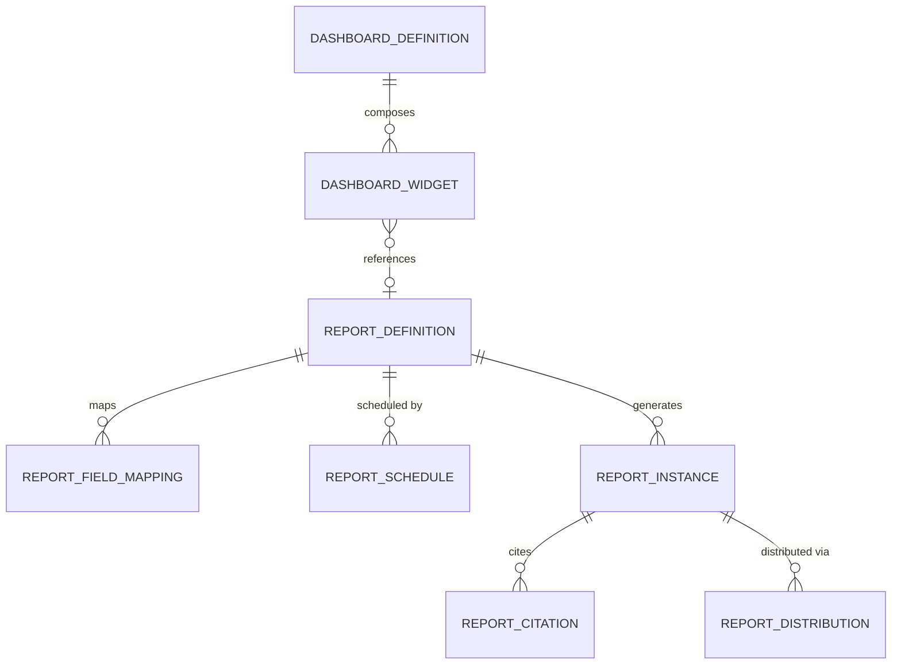
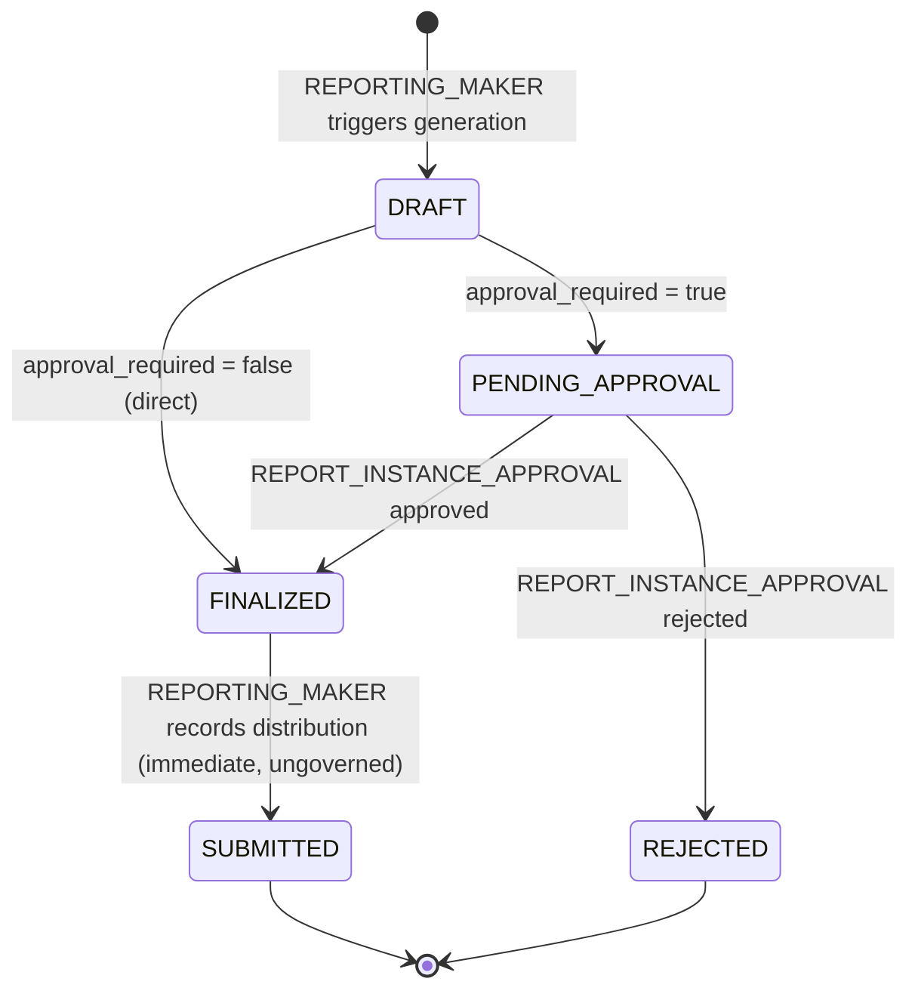
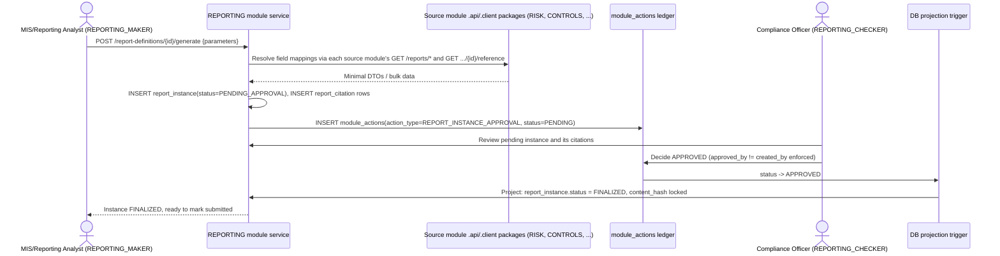

# 14.01 — Reporting Management

## Purpose

Defines the Reporting Management capability: the report and dashboard catalogue, field-level
provenance from every report back to its owning source module, report scheduling (due-date
tracking), on-demand report generation, approval-before-submission governance for
regulator/board-facing reports, export-format metadata, distribution record-keeping, and
evidence-ready export construction — built entirely on PRSMTD's existing multi-tenant,
governance, RBAC, and audit substrate. This is the repository's **eleventh authoritative,
implementation-ready specification**, and the last of the ten bounded contexts
[`04-domain-model/01-enterprise-domain-model.md`](../04-domain-model/01-enterprise-domain-model.md#reporting-reserved)
reserves. Unlike every prior module, `REPORTING` originates no business facts of its own — it
is the Supporting Subdomain, Conformist, read-only, over `RISK`, `CONTROLS`, `COMPLIANCE`,
`AUDIT`, `SECURITY`, `POLICY`, `INCIDENT`, `TPR`, and `BCP` — the aggregation layer every one of
those nine specs already exposes source data/views for, but none of them assembles.

This phase authors `14-reporting` only. `15-analytics` (the KPI/metric catalog and interactive
dashboard visualization layer) remains explicitly deferred to a future phase, per the boundary
[`14-reporting/README.md`](README.md) and [`15-analytics/README.md`](../15-analytics/README.md)
already establish and per this phase's own explicit instruction not to create more
authoritative documents than this stage requires (see [Scope](#scope), [Assumption
16](#assumptions)).

## Scope

**In scope**: the report and dashboard definition catalogue (`ReportDefinition`,
`DashboardDefinition`); field-level provenance mapping from a report definition to the source
module table/endpoint each of its fields traces to (`ReportFieldMapping`); report due-date
scheduling (`ReportSchedule` — tracking, not automated execution, see
[Assumption 8](#assumptions)); on-demand report generation producing an immutable, timestamped
snapshot (`ReportInstance`); approval-before-submission governance for regulator/board-facing
report instances; a per-instance citation manifest recording exactly what was resolved from
which source module at generation time (`ReportCitation`) — the mechanism that makes a
generated report "evidence-ready"; distribution record-keeping (`ReportDistribution`); export-
format metadata; a first-time-complete seed Report Catalogue consolidating every report named
in `RISK`/`CONTROLS`/`COMPLIANCE`/`AUDIT`/`SECURITY`/`POLICY`/`INCIDENT`/`TPR`/`BCP`'s own
Reporting Requirements sections, plus six genuinely new cross-module/enterprise reports; and
this module's own security/audit/reporting/API surface.

**Out of scope** (forward-referenced, not yet specified, or explicitly deferred):

- **KPI/metric catalog and interactive dashboard visualization composition** —
  `15-analytics/`'s own scope, per `04-domain-model`'s split of the combined "REPORTING &
  ANALYTICS" reserved node into two owning sections. `DashboardWidget.widget_type =
  METRIC_REFERENCE` reserves the slot; it is inert until `15-analytics` is authored (Assumption
  16).
- **Actual report rendering/export-generation pipeline** (PDF/CSV/XLSX file production) — no
  such generic mechanism exists in PRSMTD today (Assumption 9); this spec defines the metadata
  contract for a generated artifact (`storage_ref`, `content_hash`, `output_format`), not the
  rendering engine itself.
- **Actual scheduled/cron/batch execution of report generation** — no such mechanism exists in
  PRSMTD today (Assumption 8); `ReportSchedule` tracks due dates only. Generation remains a
  manually-triggered maker action.
- **Automated report distribution/delivery** (email, portal push, SEBI e-filing submission) —
  PRSMTD's notification/alerting capability was attempted platform-wide and explicitly retired
  (`system.md`, PR-RESET-02), the same inherited gap `09-security` first named (Assumption 10).
  `ReportDistribution` is a factual record of a distribution that happened out-of-band, not an
  automated delivery mechanism.
- **A platform document/object storage capability** — a rendered export artifact's
  `storage_ref` is an opaque pointer, the same confirmed gap every prior evidence/document-
  bearing module inherits (Assumption 7 notwithstanding — see that Assumption for how this
  module's basic function is deliberately *not* blocked by this gap).
- **Platform-level, cross-tenant reporting** (a PRSMTD-operator view spanning multiple AMCs) —
  `04-domain-model`'s own open question of whether `REPORTING`/`ANALYTICS` is a tenant module or
  a platform-level surface is resolved by this spec as **tenant-plane, like every other module**
  (Assumption 1); a genuinely platform-level operator view, if ever required, is a distinct
  future concern akin to `18-deployment`, not designed here.
- Regulatory profiles other than `SEBI_AMC` — the schema is profile-configurable per the
  established pattern; only `SEBI_AMC` seed content is defined here.

## Business Context

Every one of the nine authored business-domain modules already carries its own "Reporting
Requirements" section, populated at each module's own authoring session, stating in near-
identical language: *"Cross-references `14-reporting` and `15-analytics` (not yet authored);
this section only enumerates what this module must expose as source data/views."* Each of
those nine sections is, in effect, a standing invoice this module now settles. This is the same
relationship `09-security` had to the five modules authored before it — a consolidation and
formalization of content every predecessor already committed to inline, not a new invention —
except that `REPORTING`'s consolidation spans the full nine-module surface rather than a
five-module one, and, unlike `09-security`, this module owns no business-fact aggregate of its
own (Assumption 4).

`04-domain-model`'s own Bounded Context Map named `REPORTING` (jointly with `ANALYTICS`) as the
tenth and final reserved context since Session 3 — the one Session 13's close-out explicitly
flagged as "the last remaining reserved business-domain bounded context... besides
`REPORTING`." Authoring it completes the set of ten bounded contexts that document's own map
enumerates, though — per the established precedent every one of `SECURITY`/`POLICY`/
`INCIDENT`/`TPR`/`BCP` already set — the map's own "(reserved)" → "(authored)" status-label
amendment is proposed here, not applied (Assumption 3, [Future Extension
Points](#future-extension-points)).

Being authored last, `REPORTING` is built as a genuine consumer of the entire existing
integration surface at once — the largest `dependencies:` declaration of any module in this
repository (Assumption 18) — and, in the course of building that consumption layer, it is the
first module to discover that `RISK` itself has never needed to expose a citation-resolution
endpoint for its own entities (Assumption 11), since every prior module that touched `RISK`
only ever *wrote* a `Risk.source` value, never *read* a Risk back for display in something it
owned.

## Regulatory Drivers

This module cites no new regulatory text of its own — it is the concrete mechanism by which
obligations every one of the nine source modules already cites gets satisfied in practice. Per
`CLAUDE.md`'s "cross-reference over restating" rule, the underlying clause-level citations are
not re-extracted here; only the recurring pattern each already establishes is consolidated:

| Recurring obligation | Already cited by | How this module operationalizes it |
|---|---|---|
| Quarterly/half-yearly Board and Trustee risk review and reporting to SEBI | `10-risk` (RMS circular covering letter), `11-compliance` (Annexures §2.6.2.1(iv)(a)–(b)) | `ReportDefinition`s tagged `approval_required = true` whose consumer list includes Trustees/SEBI (e.g. `RPT-RISK-008`, `RPT-CMP-007`) — see [Report Catalogue](#report-catalogue) |
| Semi-annual System Audit report filed with SEBI within three months of financial year end | `13-audit` (Annexure 8 clause 55) | `RPT-AUD-007`, `regulatory_deadline` field on the resulting `ReportInstance` |
| BOD/Risk Committee-approved BCP/DR plan status reporting | `26-business-continuity` (Annexure 8 item 8b) | `RPT-BCP-004` |
| Board-approved Outsourcing Policy and vendor due-diligence reporting | `25-third-party-risk` (Annexures §2.9) | `RPT-TPR-001`, `RPT-TPR-007` |
| Independent Internal Audit reporting to the Audit Committee/Board, including the Rectification Index | `13-audit` (Annexures §1.3.4.1.1) | `RPT-AUD-005`, `RPT-ENT-005` (cross-module rollup) |
| Employee Code of Conduct/AML acknowledgement evidence | `23-policy` (Annexures §2.6.2.1(i)(g)/(iii)) | `RPT-POL-002` |

No source PDF is newly mined by this spec; every citation above is inherited from the module
named in the second column.

## Assumptions

1. **`REPORTING` is a tenant-plane module, like every other module** — resolving
   `04-domain-model`'s own open question ("may be platform-level rather than a tenant module —
   open question") explicitly. Every one of the nine source modules is entirely tenant-plane
   data; a Board report for Tenant A must never leak into Tenant B, so this module's own tables
   are RLS-scoped identically. A genuinely cross-tenant, platform-operator view (if ever
   required) is a distinct future concern, not this module.
2. **Users referenced by this module** (`owner_user_id`, `generated_by`, `approved_by`,
   `distributed_by`, etc.) **are platform/tenant identity records**, not module-owned data —
   same reasoning as every prior module's identical assumption.
3. **This module resolves, but does not apply,** `04-domain-model`'s `REPORTING (reserved)` →
   `REPORTING (authored)` status-label amendment (Bounded Context Map, Ownership
   Responsibilities, Cross-Context APIs table) — the same one-session lag every one of
   `SECURITY`/`POLICY`/`INCIDENT`/`TPR`/`BCP` left for a later, explicitly-approved session
   (see [Future Extension Points](#future-extension-points)).
4. **No aggregate root of this module originates a business fact.** `ReportDefinition`,
   `ReportInstance`, and `DashboardDefinition` are the only aggregate roots, and each is a
   composition/projection over the nine source contexts, never a new source of Risk/Control/
   Compliance/Audit/Security/Policy/Incident/Vendor/Continuity data — the literal realization of
   `04-domain-model`'s own Assumption 5 ("no aggregate roots of its own beyond report/dashboard
   *definitions*"), elaborated here to also cover the generated *instance* as a first-class,
   governable artifact, since "report generation" and "approval-before-submission governance"
   are explicit requirements this phase's own brief names that a bare "definition" cannot
   satisfy alone.
5. **The Report Catalogue is regulatory-profile-seeded reference content, tenant-editable via
   `REPORTING_ADMIN`** — the same taxonomy-seeding shape every prior module's reference data
   uses, elaborated here at the level of whole report *definitions* rather than category rows,
   since this module's entire substance is its catalogue.
6. **Governance is opt-in per definition, not per entity type.** `ReportDefinition.
   approval_required` is a boolean flag, not a fixed rule — a `ReportInstance` generated from a
   definition whose consumer list includes a formal Board/Trustee filing or a direct SEBI
   submission requires checker approval before it can be marked `SUBMITTED`; every other
   instance is generated and finalized directly by its maker. This is a new granularity of the
   "not every mutation needs governance" precedent (`RiskAppetite`, `ControlFamily`,
   `ComplianceCalendarEntry`, `AuditUniverseEntry`, `SecurityBaseline`/`SecurityPolicyDomain`,
   `ContinuityPlanActivation`) — the first time the decision of *whether* governance applies is
   itself data-driven rather than fixed by the entity type.
7. **Evidence-ready export does not depend on binary storage.** A `ReportInstance` may carry a
   `content_summary` (`jsonb`) — a queryable, in-platform-viewable snapshot of the figures it
   presents — independent of whether a rendered export file (`storage_ref`) was ever produced.
   This is a deliberate design choice: every prior evidence-bearing module's core function is
   fully blocked by the still-open document/object-storage gap (nothing can actually be
   retrieved); this module's core function — presenting and citing figures already governed
   elsewhere — is not, because the figures themselves live in `content_summary` and the
   citation manifest ([Export Formats and Evidence-Ready Exports](#export-formats-and-evidence-ready-exports)),
   not in a binary this module would need to store.
8. **No PRSMTD scheduled-job/cron/batch-execution mechanism exists** — confirmed absent this
   session (grepped `system.md` for "cron", "batch", "scheduled job", "periodic"; only the §16
   Governance Program Board's own *change-management* scheduling vocabulary and infrastructure-
   release scheduling references were found, nothing about periodic runtime job execution).
   `ReportSchedule` therefore tracks *due dates* only (mirroring `ComplianceCalendarEntry`'s
   identical ungoverned due-date-tracking shape); actual generation remains a manually-triggered
   `REPORTING_GENERATE` action. Named as a genuine new PRSMTD capability gap if true unattended
   scheduled generation is required later (see [Future Extension Points](#future-extension-points)).
9. **No generic PDF/CSV/export-rendering mechanism exists in PRSMTD** — confirmed absent this
   session (no hits for "PDF"/"CSV" generation capability). The closest conceptual analog is the
   unresolved `system.md` §18 Product Framework's PF-CT-3/PF-CW-8 "standardized evidence pack
   export" contract, itself carried forward as an open reconciliation question since `12-controls`
   Assumption 6 — not resolved by this spec, only named as the natural future landing point if
   this module's own export metadata contract is ever wired to a real rendering pipeline.
10. **PRSMTD's notification/alerting capability was attempted platform-wide and explicitly
    retired** (`system.md`, PR-RESET-02 — `BillingModuleHandler`/`NotificationsModuleHandler`/
    `AdminModuleHandler` deleted; the corresponding `pending_action.action_type` values are "no
    longer permitted"), the same inherited gap `09-security` first named. `ReportDistribution`
    is therefore a factual record of a distribution that happened by some out-of-band channel
    (email, print, portal, hand delivery), never an automated delivery this module performs.
11. **`RISK` does not currently expose a `GET /risks/{id}/reference` endpoint.** Verified against
    `10-risk/01-enterprise-risk-management.md`'s own API Surface table directly: only
    `GET /risks/{id}` (full detail) and `GET /risks/{id}/assessments` (history) exist. This is
    the first module in this repository to discover this specific gap, because every prior
    module that integrated with `RISK` only ever *wrote* a `Risk.source` value (a one-way,
    manual, cross-context creation) — none needed to *read* a Risk back for display inside
    something it owned. **Activated (Session 15)** — see [Integration
    with Risk Management](#integration-with-risk-management) and `10-risk/01-*.md`'s own
    Amendment log.
12. **`AUDIT` did not, at this document's own authoring, expose a `GET /findings/{id}/reference`
    or `GET /engagements/{id}/reference` endpoint.** Verified against `13-audit/01-audit-management.md`'s
    own API Surface table directly: only full-detail `GET /findings`, `GET /engagements/{id}`
    existed. `AUDIT` was designed as this repository's Conformist consumer/graph-sink, so no prior
    module needed to cite *into* it — this module was the first to need to. **Activated
    (Session 15)** (see [Integration with Audit Management](#integration-with-audit-management)
    and `13-audit/01-*.md`'s own Amendment log).
13. **`INCIDENT`'s `GET /incidents/{id}/reference` gap, first proposed by
    `26-business-continuity/01-*` Assumption 10, is now built.** This module was simply another
    citer waiting on the same, precisely scoped change — **activated (Session 15)** (see
    [Integration with Incident/Issue/CAPA](#integration-with-incidentissuecapa) and
    `24-incident-issue-capa/01-*.md`'s own Amendment log).
14. **The Report Catalogue's per-module seed rows are a first-time-complete consolidation, not
    new invention.** Every row tagged to a `primary_source_module` other than `CROSS_MODULE` in
    [Report Catalogue](#report-catalogue) restates (does not re-derive) a report already named
    in that module's own Reporting Requirements section — the same relationship `09-security`'s
    Data Classification Scheme had to five prior modules' inline security content. The six
    `CROSS_MODULE` rows are this module's own original contribution — reports no single source
    module could produce alone.
15. **Record retention is deferred to `11-compliance`**, same as every prior module; this
    module's own tables are append-only/status-transitioned — a `ReportInstance` is immutable
    once `FINALIZED` — which is retention-agnostic by design, introducing no new gap.
16. **`15-analytics` (KPI/metric catalog, dashboard visualization composition) is explicitly out
    of scope for this phase.** `DashboardWidget.widget_type = METRIC_REFERENCE` reserves the
    slot; it is inert (no metric catalog exists to resolve against) until a future phase
    authors `15-analytics/01-*.md`, per the split that section's own README and `14-reporting/README.md`
    already establish and per this phase's explicit instruction not to author more documents
    than this stage requires.
17. **Heavy cross-module report generation carries request-timeout risk.** A report like
    `RPT-ENT-001` (Board & Executive GRC Summary) may call up to nine downstream module APIs
    synchronously in one generation request. No PRSMTD async-job/queue mechanism was found
    during this session's research — named as a candidate future capability (see
    [Non-Functional Requirements](#non-functional-requirements), [Future Extension
    Points](#future-extension-points)), not designed here; MVP generation is synchronous
    request/response.
18. **This module's manifest declares the largest `dependencies:` list of any module to
    date** — `[RISK, CONTROLS, COMPLIANCE, AUDIT, SECURITY, POLICY, INCIDENT, TPR, BCP]`, all
    nine other business-domain modules — a direct, expected consequence of being both the tenth
    module authored and this repository's designated Conformist/sink over the entire GRC
    domain (`04-domain-model` Dependency Rule 5), not a violation of any dependency discipline.
    Correspondingly, **no other module ever declares a dependency on `REPORTING`** — it exposes
    no outbound reference-resolution endpoint of its own (Assumption 3's sink framing,
    restated as [FR-17](#functional-requirements)).

## Dependencies

- PRSMTD `docs/authoritative/system.md` §3 (Governance model, GOV-07; and the `module_actions`
  per-module maker-checker mechanism — distinct from the platform/tenant-lifecycle-only
  `pending_action` ledger, per this session's own re-verification), §7 (Data model & RLS
  enforcement), §8 (RBAC model), §9 + §5a–§5c (Module framework, ownership guards), §4.1
  (Observability & Deterministic Trace Contract, T1–T7 — the direct substrate for this module's
  own evidence-ready-export framing), §10 (Audit and compliance), §18 (Product Framework
  Doctrine — PF-CT-3/PF-CW-8 evidence-pack contract, cited but not resolved, per the
  already-open §18 reconciliation question), §21 (Authentication Surface Ownership) — all
  reused as-is; **confirmed absent** this session (re-verified, not assumed from a prior
  session's memory): a scheduled-job/cron/batch-execution mechanism (Assumption 8), a generic
  PDF/CSV export-rendering mechanism (Assumption 9), and — reaffirmed, not newly discovered —
  notification/alerting (retired, Assumption 10) and document/object storage (Assumption 7's
  carried gap).
- [`04-domain-model/01-enterprise-domain-model.md`](../04-domain-model/01-enterprise-domain-model.md)
  — **not modified by this spec.** Its `REPORTING (reserved)` bounded-context entry
  (Conformist, read-only, over `RISK`/`CONTROLS`/`COMPLIANCE`/`AUDIT`/`SECURITY`, extended by
  this spec to the full nine-module surface) and its own Assumption 5 sketch ("no aggregate
  roots of its own beyond report/dashboard definitions") are the frozen inputs this spec
  activates and elaborates (Assumptions 1, 4) but does not edit. This spec proposes, but does
  not apply, the `REPORTING (reserved)` → `REPORTING (authored)` status-label amendment.
- [`10-risk/01-enterprise-risk-management.md`](../10-risk/01-enterprise-risk-management.md) —
  **not modified.** `GET /reports/risk-register`, `GET /reports/heat-map`, and
  `GET /reports/kri-dashboard` are reused with zero additive change (bulk pulls); this spec
  proposes, but does not apply, a `GET /risks/{id}/reference` addition (Assumption 11), the
  first such proposal any module has made toward `10-risk`.
- [`12-controls/01-controls-management.md`](../12-controls/01-controls-management.md) — **not
  modified.** Its `GET /reports/control-library`, `/reports/testing-calendar`,
  `/reports/effectiveness-dashboard`, `/reports/exception-register`, and
  `GET /controls/{id}/reference` are all reused with zero additive change.
- [`11-compliance/01-compliance-management.md`](../11-compliance/01-compliance-management.md)
  — **not modified.** Its `GET /reports/*` namespace and `GET /obligations/{id}/reference` are
  reused with zero additive change.
- [`13-audit/01-audit-management.md`](../13-audit/01-audit-management.md) — **not modified.**
  Its `GET /reports/*` namespace is reused with zero additive change for bulk pulls; this spec
  proposes, but does not apply, `GET /findings/{id}/reference` and
  `GET /engagements/{id}/reference` additions (Assumption 12) — the first module to need a
  point-citation endpoint from `AUDIT` itself.
- [`09-security/01-security-management.md`](../09-security/01-security-management.md) — **not
  modified.** Its `GET /reports/*` namespace and `GET /findings/{id}/reference` are reused with
  zero additive change.
- [`23-policy/01-policy-management.md`](../23-policy/01-policy-management.md) — **not
  modified.** Its `GET /reports/*` namespace and `GET /policies/{id}/reference` are reused with
  zero additive change, confirmed caller-agnostic by `25-third-party-risk`'s own confirmation of
  this exact pattern.
- [`24-incident-issue-capa/01-incident-issue-capa-management.md`](../24-incident-issue-capa/01-incident-issue-capa-management.md)
  — **not modified.** `GET /issues/{id}/reference` and `GET /capas/{id}/reference` are reused
  with zero additive change; this spec relies on, but does not re-propose,
  `26-business-continuity/01-*`'s own already-open proposal for `GET /incidents/{id}/reference`
  (Assumption 13).
- [`25-third-party-risk/01-third-party-risk-management.md`](../25-third-party-risk/01-third-party-risk-management.md)
  — **not modified.** `GET /reports/*` and `GET /vendors/{id}/reference` are reused with zero
  additive change.
- [`26-business-continuity/01-business-continuity-management.md`](../26-business-continuity/01-business-continuity-management.md)
  — **not modified.** `GET /reports/*`, `GET /critical-services/{id}/reference`, and
  `GET /continuity-plans/{id}/reference` are all reused with zero additive change.
- `docs/05-modules/README.md` — confirmed index-only (Session 9); no separate per-module
  `06-data-model/`/`08-api/` document is expected for this module.
- `docs/15-analytics/README.md` — confirmed as the owning scope for the KPI/metric catalog and
  dashboard visualization layer this spec explicitly defers (Assumption 16).

## Architecture

The Reporting Management capability is one PRSMTD module: **module code `REPORTING`**. It
follows the generic module framework exactly as every prior module does (`system.md`
§9/§5a–§5c):

- `moduleId`: a stable UUID minted at implementation time, not fixed by this specification.
- Table prefix: `module_reporting_*` (OWN-03 schema ownership).
- Route namespace: `/modules/REPORTING` (§5b4).
- API namespace: `/api/v1/modules/reporting/**`, controllers in `com.prsbnjs.modules.reporting`
  (OWN-07).
- Module role types: `MAKER`, `CHECKER`, `VIEWER` only — the closed set (`system.md` §8).
  Domain personas map onto these three; see [Authorization](#authorization).
- `dependencies: [RISK, CONTROLS, COMPLIANCE, AUDIT, SECURITY, POLICY, INCIDENT, TPR, BCP]` —
  the largest dependency declaration of any module in this repository to date (Assumption 18),
  every edge justified by a genuine synchronous cross-module API call this module's own report
  generation makes (per `04-domain-model` Dependency Rule 6), enumerated in each Integration
  section below. **No module ever declares a dependency on `REPORTING`** — per
  `04-domain-model` Dependency Rule 5, `REPORTING` (jointly with `AUDIT`) is a designated graph
  sink.
- No platform-plane tables, no platform-plane governance actions — every governed action is
  tenant-plane (`app.plane = 'tenant'`).
- Tenant isolation, GUC binding, and session-setter usage are inherited unmodified from
  `TenantAwareDataSource` (`system.md` §7) — this module issues no direct `SET`/`set_config`
  calls.
- **Cross-module access is API-mediated only (OWN-08/OWN-09).** This module never reads
  another module's tables directly; every citation below is an opaque UUID resolved via the
  target module's `.api`/`.client` package, and every bulk data pull is a call to that module's
  own `GET /reports/*` namespace.
- This module's own approval-before-submission governance uses the platform's per-module
  `module_actions` maker-checker mechanism (`system.md` §3), not the platform/tenant-lifecycle-
  only `pending_action` ledger — the same mechanism every prior business module's own governed
  workflow already uses.

```mermaid
flowchart LR
    subgraph REPORTING Module
        RD[Report Definition] --> RFM[Report Field Mapping]
        RD --> RS[Report Schedule]
        RD -->|generate| RI[Report Instance]
        RI --> RC[Report Citation]
        RI -->|mark submitted| RDIST[Report Distribution]
        DD[Dashboard Definition] --> DW[Dashboard Widget]
        DW -.references.-> RD
    end
    RC -.opaque ref, no FK.-> RISKSRC[(Risk — RISK, GET /risks/{id}/reference proposed)]
    RC -.opaque ref, no FK.-> CTLSRC[(Control — CONTROLS, zero additive change)]
    RC -.opaque ref, no FK.-> OBLSRC[(Obligation — COMPLIANCE, zero additive change)]
    RC -.opaque ref, no FK.-> AUDSRC[(Finding/Engagement — AUDIT, endpoints proposed)]
    RC -.opaque ref, no FK.-> SECSRC[(SecurityFinding — SECURITY, zero additive change)]
    RC -.opaque ref, no FK.-> POLSRC[(Policy — POLICY, zero additive change)]
    RC -.opaque ref, no FK.-> INCSRC[(Issue/CAPA — INCIDENT, zero additive change)]
    RC -.opaque ref, no FK.-> TPRSRC[(Vendor — TPR, zero additive change)]
    RC -.opaque ref, no FK.-> BCPSRC[(Critical Service/Plan — BCP, zero additive change)]
    RI -->|module_actions, approval_required only| GOV[(PRSMTD module_actions maker-checker)]
    GOV -->|APPROVED trigger, projection-only| RI
```

## Domain Model

**Bounded context**: Reporting Management. Owns the report/dashboard catalogue and the
generated, timestamped report instance record exclusively; treats every one of `RISK`,
`CONTROLS`, `COMPLIANCE`, `AUDIT`, `SECURITY`, `POLICY`, `INCIDENT`, `TPR`, and `BCP` as an
external context it reads from but never writes to, never owns, and never duplicates — a purer
form of the customer-supplier/opaque-reference framing every prior module uses for its own
external references, since here the relationship is exclusively one-directional (Conformist)
in both data flow and dependency declaration.

**Ubiquitous language** (extends, does not redefine, `04-domain-model`'s canonical glossary):

| Term | Definition |
|---|---|
| Report Definition | A catalogued, named report or export — its category, primary source module(s), field-level provenance mapping, output format(s), and whether its instances require approval before submission. |
| Report Field Mapping | A single field/metric a Report Definition exposes, mapped to the source module, source entity type, and endpoint that resolves it — the prescriptive half of this module's provenance mechanism. |
| Report Schedule | A due-date record for recurring generation of a Report Definition — a due-date tracker, not an automated scheduler (Assumption 8). |
| Report Instance | A generated, point-in-time, immutable-once-finalized snapshot of a Report Definition, for a given reporting period and parameters. |
| Report Citation | A record, generated at Report Instance creation time, of exactly which source-module entity was resolved via which endpoint and what it returned — the descriptive half of this module's provenance mechanism, and the mechanism that makes an instance "evidence-ready." |
| Report Distribution | A factual record that a Report Instance was distributed to a named recipient/party by some channel, at some time — never an automated delivery (Assumption 10). |
| Dashboard Definition | A named composition of widgets for a given audience (Board, Executive, Operational, etc.) — content composition, not pixel-level UI design (deferred to `27-user-experience`). |
| Dashboard Widget | One entry in a Dashboard Definition, referencing exactly one Report Definition (built) or, reserved and inert, one future Analytics metric (Assumption 16). |

**Aggregates, entities, and invariants**:

- **ReportDefinition** (aggregate root) — Ungoverned (Assumption 5); a `REPORTING_ADMIN` maker
  creates/edits/retires directly, no checker required, the same "not every mutation needs
  governance" shape `AuditUniverseEntry`/`SecurityBaseline` use. `status ∈ DRAFT, ACTIVE,
  RETIRED`. Cannot be retired while a `ReportSchedule` referencing it is `ACTIVE` (the same
  "no-retirement-while-active-work-exists" shape every prior aggregate root enforces, adapted to
  this module's own, lighter-weight child entities).
- **ReportFieldMapping** (entity, owned by ReportDefinition) — Plain, ungoverned mapping row; at
  least one row per active `ReportDefinition` ([FR-03](#functional-requirements)).
- **ReportSchedule** (entity, owned by ReportDefinition) — Ungoverned due-date tracker, mirrors
  `ComplianceCalendarEntry` exactly. `status ∈ ACTIVE, PAUSED`.
- **ReportInstance** (aggregate root) — The generated artifact. `status ∈ DRAFT,
  PENDING_APPROVAL, REJECTED, FINALIZED, SUBMITTED`. When its owning `ReportDefinition.
  approval_required = false`, a `REPORTING_MAKER`'s generate action moves it `DRAFT →
  FINALIZED` directly. When `true`, it moves `DRAFT → PENDING_APPROVAL`, requiring
  `REPORTING_CHECKER` approval (`REPORT_INSTANCE_APPROVAL`) to reach `FINALIZED`, or
  `REJECTED`. Immutable (`content_hash` locked) once `FINALIZED`. A `REPORTING_MAKER`'s mark-
  submitted action (ungoverned, factual) moves a `FINALIZED` instance to `SUBMITTED`, creating a
  `ReportDistribution` row.
- **ReportCitation** (entity, owned by ReportInstance) — Append-only, generated automatically at
  instance-generation time, one row per source-module fact actually resolved
  ([FR-07](#functional-requirements)). Never edited after creation.
- **ReportDistribution** (entity, owned by ReportInstance) — Append-only, ungoverned factual
  record, mirroring `PolicyAcknowledgement`'s/`ContinuityPlanActivation`'s "immediate fact, no
  governance" shape.
- **DashboardDefinition** (aggregate root) — Ungoverned, mirrors `ReportDefinition`. `status ∈
  DRAFT, ACTIVE, RETIRED`.
- **DashboardWidget** (entity, owned by DashboardDefinition) — Ungoverned. `widget_type ∈
  REPORT_REFERENCE, METRIC_REFERENCE` (the latter reserved, inert per Assumption 16).

### Report Definitions and Field-Level Provenance

Every `ReportDefinition` carries one or more `ReportFieldMapping` rows, each stating: which
field/metric the report exposes, which source module owns the fact, what kind of entity it is,
and which endpoint on that module resolves it — either that module's own `GET /reports/*` bulk
endpoint (for tabular/aggregate pulls) or its `GET .../{id}/reference` point endpoint (for a
specific cited record). This is the literal mechanism satisfying this phase's own success
criterion that "every report/dashboard traces every field back to a named source module's
table."

Two worked examples:

| Report | Field | Source module | Source entity type | Resolving endpoint |
|---|---|---|---|---|
| `RPT-RISK-002` Risk Heat Map | Risk likelihood/impact score, risk category | `RISK` | `Risk` (bulk) | `GET /api/v1/modules/risk/reports/heat-map` |
| `RPT-ENT-001` Board & Executive GRC Summary | Top-5 residual risks | `RISK` | `Risk` (point) | `GET /api/v1/modules/risk/risks/{id}/reference` *(proposed — Assumption 11)* |
| `RPT-ENT-001` Board & Executive GRC Summary | Control effectiveness summary | `CONTROLS` | `Control` (bulk) | `GET /api/v1/modules/controls/reports/effectiveness-dashboard` |
| `RPT-ENT-001` Board & Executive GRC Summary | Open security findings by severity | `SECURITY` | `SecurityFinding` (bulk) | `GET /api/v1/modules/security/reports/finding-register` |
| `RPT-ENT-001` Board & Executive GRC Summary | Continuity plan coverage status | `BCP` | `ContinuityPlan` (bulk) | `GET /api/v1/modules/bcp/reports/plan-status` |

`ReportFieldMapping` is prescriptive — it states what a report *should* cite. The matching
descriptive record, `ReportCitation`, generated at instance-generation time, states what an
actual instance *did* cite (see [Export Formats and Evidence-Ready Exports](#export-formats-and-evidence-ready-exports)).

### Report Catalogue

The seed `SEBI_AMC` Report Catalogue, consolidating every report named across the nine source
modules' own Reporting Requirements sections (Assumption 14) plus six new cross-module reports
this module itself contributes. **Approval-required rule** (Assumption 6): `approval_required =
true` exactly for the reports whose consumer list includes a formal Board/Trustee filing or a
direct SEBI submission — a small, named minority; every other report is generated and finalized
directly by its maker. Regulatory citations are inherited from each source module's own
Reporting Requirements section, not restated here, per `CLAUDE.md`'s no-duplication rule.

| Report Code | Name | Category | Source Module | Approval Required | Primary Consumers |
|---|---|---|---|---|---|
| `RPT-ENT-001` | Board & Executive GRC Summary | EXECUTIVE | CROSS_MODULE | **Yes** | Board, Executive Committee, Trustees |
| `RPT-ENT-002` | Enterprise Exception & Aging Register | OPERATIONAL | CROSS_MODULE | No | Compliance, Internal Audit, Board Audit Committee |
| `RPT-ENT-003` | Evidence Completeness Rollup | OPERATIONAL | CROSS_MODULE | No | Compliance, Internal Audit |
| `RPT-ENT-004` | Regulatory Filing & Review Calendar | REGULATORY | CROSS_MODULE | No | Compliance Officer, Company Secretary, Business Continuity Office |
| `RPT-ENT-005` | Rectification Index & CAPA Effectiveness Rollup | EXECUTIVE | CROSS_MODULE | No | Audit Committee, Board |
| `RPT-ENT-006` | Cross-Module CAPA & Remediation Tracker | OPERATIONAL | CROSS_MODULE | No | Internal Audit, CAPA Review Board |
| `RPT-RISK-001` | Risk Register Report | OPERATIONAL | RISK | No | Risk Owners, CRO, Auditors |
| `RPT-RISK-002` | Risk Heat Map | EXECUTIVE | RISK | No | CRO, Board Risk Committee |
| `RPT-RISK-003` | Top-N Risks by Residual Score | EXECUTIVE | RISK | No | CRO, Board |
| `RPT-RISK-004` | KRI Dashboard | OPERATIONAL | RISK | No | CRO, Risk Committee |
| `RPT-RISK-005` | Overdue Reviews & Treatments | OPERATIONAL | RISK | No | Risk Owners, CRO |
| `RPT-RISK-006` | Escalation Log | OPERATIONAL | RISK | No | CRO, Trustees |
| `RPT-RISK-007` | Risk Acceptance Register | OPERATIONAL | RISK | No | CRO, Trustees, Auditors |
| `RPT-RISK-008` | Board/Trustee Risk Report | REGULATORY | RISK | **Yes** | Trustees, SEBI |
| `RPT-CTL-001` | Control Library Report | OPERATIONAL | CONTROLS | No | Control Owners, Compliance, Auditors |
| `RPT-CTL-002` | Control Testing Calendar / Overdue Tests | OPERATIONAL | CONTROLS | No | Control Owners, Compliance |
| `RPT-CTL-003` | Control Effectiveness Dashboard | EXECUTIVE | CONTROLS | No | Compliance, CISO, Board Audit Committee |
| `RPT-CTL-004` | Exception Register & Aging | OPERATIONAL | CONTROLS | No | Compliance, Internal Audit, Board Audit Committee |
| `RPT-CTL-005` | Evidence Completeness Report | OPERATIONAL | CONTROLS | No | Compliance, Internal Audit |
| `RPT-CTL-006` | Control Coverage by Risk | OPERATIONAL | CONTROLS | No | Risk Owners, CRO |
| `RPT-CMP-001` | Compliance Register Report | OPERATIONAL | COMPLIANCE | No | Compliance Officer, Board, Auditors |
| `RPT-CMP-002` | Compliance Status Dashboard | EXECUTIVE | COMPLIANCE | No | Compliance Officer, CCO, Board |
| `RPT-CMP-003` | Compliance Calendar | OPERATIONAL | COMPLIANCE | No | Compliance Officer, Company Secretary |
| `RPT-CMP-004` | Exception Register & Aging | OPERATIONAL | COMPLIANCE | No | Compliance, Internal Audit, Board Audit Committee |
| `RPT-CMP-005` | Regulatory Change Impact Report | OPERATIONAL | COMPLIANCE | No | Compliance, Legal, Board |
| `RPT-CMP-006` | Attestation Register | OPERATIONAL | COMPLIANCE | No | Board, Trustees |
| `RPT-CMP-007` | Quarterly/Half-Yearly Compliance Report to Trustees | REGULATORY | COMPLIANCE | **Yes** | Trustees, SEBI |
| `RPT-CMP-008` | Evidence Completeness Report | OPERATIONAL | COMPLIANCE | No | Compliance, Internal Audit |
| `RPT-AUD-001` | Audit Universe Register | OPERATIONAL | AUDIT | No | Chief Internal Auditor, Audit Committee |
| `RPT-AUD-002` | Audit Plan / Schedule | OPERATIONAL | AUDIT | No | Audit Committee, Board |
| `RPT-AUD-003` | Engagement Status Dashboard | OPERATIONAL | AUDIT | No | Chief Internal Auditor, Audit Committee |
| `RPT-AUD-004` | Finding Register & Aging | OPERATIONAL | AUDIT | No | Internal Audit, Board Audit Committee, Compliance, Controls |
| `RPT-AUD-005` | Non-Compliance Rate / Rectification Index Trend | EXECUTIVE | AUDIT | No | Audit Committee, Board of AMC |
| `RPT-AUD-006` | Follow-Up Action Tracker | OPERATIONAL | AUDIT | No | Internal Audit, process/control/obligation owners |
| `RPT-AUD-007` | System Audit Report Register | REGULATORY | AUDIT | **Yes** | Board, Trustees, SEBI |
| `RPT-AUD-008` | Evidence Completeness Report | OPERATIONAL | AUDIT | No | Internal Audit, Audit Committee |
| `RPT-SEC-001` | Security Finding Register & Aging | OPERATIONAL | SECURITY | No | Security Analysts, CISO, Board Audit Committee |
| `RPT-SEC-002` | Security Posture Dashboard | EXECUTIVE | SECURITY | No | CISO, Board Risk/Audit Committee |
| `RPT-SEC-003` | Security Asset Rotation/Expiry Calendar | OPERATIONAL | SECURITY | No | Security Analysts, CISO, Platform Operations |
| `RPT-SEC-004` | Privileged Access Grant Register | OPERATIONAL | SECURITY | No | CISO, Internal Audit, Board Audit Committee |
| `RPT-SEC-005` | Evidence Completeness Report | OPERATIONAL | SECURITY | No | Security Analysts, Internal Audit |
| `RPT-POL-001` | Policy Register Report | OPERATIONAL | POLICY | No | Policy Owners, Board, Auditors |
| `RPT-POL-002` | Acknowledgement Completion Report | OPERATIONAL | POLICY | No | Policy Owners, CCO, HR, Board |
| `RPT-POL-003` | Review Calendar | OPERATIONAL | POLICY | No | Policy Owners, Policy Governance Committee |
| `RPT-POL-004` | Exception Register & Aging | OPERATIONAL | POLICY | No | Policy Governance Committee, Internal Audit |
| `RPT-POL-005` | Policy Version History | OPERATIONAL | POLICY | No | Internal Audit, External Auditors, Regulators (on request) |
| `RPT-POL-006` | Evidence Completeness Report | OPERATIONAL | POLICY | No | Policy Governance Committee, Internal Audit |
| `RPT-INC-001` | Incident Register Report | OPERATIONAL | INCIDENT | No | Incident Responders, Risk Manager, Board |
| `RPT-INC-002` | Issue Register Report | OPERATIONAL | INCIDENT | No | Risk Manager, Compliance Officer, CAPA Review Board |
| `RPT-INC-003` | CAPA Tracker | OPERATIONAL | INCIDENT | No | CAPA owners, CAPA Review Board, Internal Audit |
| `RPT-INC-004` | Effectiveness Review Summary | EXECUTIVE | INCIDENT | No | CAPA Review Board, Internal Audit, Board Risk/Audit Committee |
| `RPT-INC-005` | Escalation Log | OPERATIONAL | INCIDENT | No | CRO, CISO, Board |
| `RPT-INC-006` | Cross-Module Issue Source Report | OPERATIONAL | INCIDENT | No | Internal Audit, Compliance |
| `RPT-TPR-001` | Vendor Register Report | OPERATIONAL | TPR | No | Vendor Managers, Compliance, Auditors |
| `RPT-TPR-002` | Criticality / Risk Rating Heat Map | EXECUTIVE | TPR | No | Compliance, CRO, Board |
| `RPT-TPR-003` | SLA Dashboard | OPERATIONAL | TPR | No | Vendor Managers, Compliance |
| `RPT-TPR-004` | Exception Register & Aging | OPERATIONAL | TPR | No | Compliance, Internal Audit, Board Audit Committee |
| `RPT-TPR-005` | Reassessment Calendar | OPERATIONAL | TPR | No | Vendor Managers, Compliance |
| `RPT-TPR-006` | Contract Expiry / Renewal Report | OPERATIONAL | TPR | No | Vendor Managers, Compliance, Legal |
| `RPT-TPR-007` | Due Diligence Completion Report | OPERATIONAL | TPR | No | Compliance, Board |
| `RPT-TPR-008` | Vendor Coverage by Control / Obligation | OPERATIONAL | TPR | No | Risk Owners, Compliance |
| `RPT-BCP-001` | Critical Service Register & RTO/RPO Summary | OPERATIONAL | BCP | No | Business Continuity Office, CRO, Board |
| `RPT-BCP-002` | BIA Completion / Overdue Reassessment Calendar | OPERATIONAL | BCP | No | Business Continuity Office, Risk Management Committee |
| `RPT-BCP-003` | Dependency Map | OPERATIONAL | BCP | No | Business Continuity Office, TPR, Internal Audit |
| `RPT-BCP-004` | Continuity Plan Status & Coverage Report | EXECUTIVE | BCP | No | Board, Risk Management Committee, System Auditor |
| `RPT-BCP-005` | Continuity Exercise Calendar & Results | OPERATIONAL | BCP | No | Business Continuity Office, Internal Audit, Board Audit Committee |
| `RPT-BCP-006` | Continuity Exception Register & Aging | OPERATIONAL | BCP | No | Compliance, Internal Audit, Board Audit Committee |
| `RPT-BCP-007` | Plan Activation Log | OPERATIONAL | BCP | No | CRO, Board, Crisis Management Team |
| `RPT-BCP-008` | Plan Review Calendar | OPERATIONAL | BCP | No | Business Continuity Office, Compliance |

69 seed report definitions total: 6 cross-module (this module's own contribution) plus 63
consolidated from the nine source modules (8 `RISK`, 6 `CONTROLS`, 8 `COMPLIANCE`, 8 `AUDIT`, 5
`SECURITY`, 6 `POLICY`, 6 `INCIDENT`, 8 `TPR`, 8 `BCP`).

### Report Instance Lifecycle and Governance

See [Workflows](#workflows) for the full state machine. In summary: generation is always maker-
initiated (`REPORTING_GENERATE`); whether the resulting instance requires checker approval
before it can be marked submitted is read entirely off its `ReportDefinition.approval_required`
flag at generation time (Assumption 6) — this module has exactly **one** governed action type,
`REPORT_INSTANCE_APPROVAL`, the smallest governance footprint of any module in this repository,
a direct consequence of `REPORTING` originating no business facts of its own.

### Report Scheduling

`ReportSchedule` tracks `cadence ∈ AD_HOC, DAILY, WEEKLY, MONTHLY, QUARTERLY, HALF_YEARLY,
ANNUAL` and `next_due_date` per `ReportDefinition`. Overdue/upcoming schedules are surfaced via
`GET /report-schedules?overdue=true`, mirroring `ComplianceCalendarEntry`'s identical due-date-
surfacing convention. No automatic generation occurs at the due date (Assumption 8) — a human
maker sees the due date and manually triggers `POST /report-definitions/{id}/generate`.

### Dashboard Composition

`DashboardDefinition` composes `DashboardWidget` rows for a named `audience ∈ BOARD, EXECUTIVE,
OPERATIONAL, RISK_COMMITTEE, AUDIT_COMMITTEE, OTHER`. Each widget is either `REPORT_REFERENCE`
(`referenced_report_definition_id` populated — the widget renders the latest `FINALIZED`
instance of that definition) or, reserved and inert, `METRIC_REFERENCE` (`metric_ref_id`
populated once `15-analytics` exists to resolve it, per Assumption 16). This section defines
dashboard *content composition* only — pixel-level layout, charting, and interaction design
belong to `27-user-experience`, per that section's own presentation-only boundary.

## Functional Requirements

| ID | Requirement | Notes |
|---|---|---|
| FR-01 | The system shall provide a two-axis Report Definition classification: `report_category ∈ REGULATORY, EXECUTIVE, OPERATIONAL, CROSS_MODULE` and `primary_source_module ∈ RISK, CONTROLS, COMPLIANCE, AUDIT, SECURITY, POLICY, INCIDENT, TPR, BCP, CROSS_MODULE`, seeded per regulatory profile. | Assumption 5 |
| FR-02 | `REPORTING_ADMIN` users shall create, edit, and retire Report Definitions directly, with no checker approval required. | Assumption 6 |
| FR-03 | Every active Report Definition shall carry at least one Report Field Mapping identifying the source module, source entity type, and resolving endpoint for each field/metric it exposes. | See [Report Definitions and Field-Level Provenance](#report-definitions-and-field-level-provenance) |
| FR-04 | `REPORTING_GENERATE` shall create a Report Instance from a Report Definition and supplied parameters; when `approval_required = false` the instance shall enter `FINALIZED` directly; when `true` it shall enter `PENDING_APPROVAL`. | Assumption 6 |
| FR-05 | A `PENDING_APPROVAL` Report Instance shall require `REPORTING_CHECKER` approval (`REPORT_INSTANCE_APPROVAL`) before reaching `FINALIZED`, or shall be `REJECTED`. | — |
| FR-06 | A `FINALIZED` Report Instance shall be immutable; its `content_hash` shall be computed and locked at finalization. | — |
| FR-07 | Every Report Instance generation shall produce one Report Citation row per source-module fact actually resolved during generation, capturing the resolving endpoint, the cited entity's opaque reference id, a snapshot of the resolved value, and the resolution timestamp. | The evidence-ready-export mechanism — see [Export Formats and Evidence-Ready Exports](#export-formats-and-evidence-ready-exports) |
| FR-08 | `REPORTING_DISTRIBUTE` shall record a Report Distribution fact against a `FINALIZED` instance and set its status to `SUBMITTED`; this is a factual record only, never an automated delivery. | Assumption 10 |
| FR-09 | Report Schedule shall track cadence and next-due-date per Report Definition and surface overdue/upcoming due dates; it shall not automatically trigger generation. | Assumption 8 |
| FR-10 | Dashboard Definition shall compose one or more Dashboard Widgets, each referencing exactly one Report Definition (`REPORT_REFERENCE`) or, reserved and inert until `15-analytics` is authored, one Analytics metric (`METRIC_REFERENCE`). | Assumption 16 |
| FR-11 | A regulator/board-facing Report Instance (`approval_required = true`) shall additionally capture `regulatory_deadline`, and, once `SUBMITTED`, `submitted_to`/`submitted_at`, mirroring `13-audit`'s `report_submitted_to_sebi_date` field shape. | — |
| FR-12 | Every report already named in `RISK`/`CONTROLS`/`COMPLIANCE`/`AUDIT`/`SECURITY`/`POLICY`/`INCIDENT`/`TPR`/`BCP`'s own Reporting Requirements section shall have a corresponding seeded Report Definition. | Assumption 14, see [Report Catalogue](#report-catalogue) |
| FR-13 | A Report Definition's `output_formats` shall record intended export format(s) (`PDF`, `CSV`, `XLSX`, `JSON`); a Report Instance shall record the actual `output_format` of any rendered export artifact. The rendering pipeline itself is not designed by this spec. | Assumption 9 |
| FR-14 | A Report Instance may carry an optional `content_summary` (`jsonb`) queryable in-platform, independent of whether a rendered export artifact (`storage_ref`) was ever produced. | Assumption 7 |
| FR-15 | Visibility shall be role-scoped: `REPORTING_VIEWER` — full read-only across the tenant's report/dashboard content; `REPORTING_MAKER` — generate instances and record distribution; `REPORTING_CHECKER` — approve pending instances and administer the catalogue/schedules/dashboards. | — |
| FR-16 | Every governed state transition shall be captured in the platform audit trail using canonical, non-aliased `action_type` values. | `system.md` §10 |
| FR-17 | This module shall expose no outbound cross-module reference-resolution endpoint of its own. | `04-domain-model` Dependency Rule 5; Assumption 18 |
| FR-18 | Cross-module data pulls shall be exclusively API-mediated — each source module's own `GET /reports/*` bulk endpoint and `GET .../{id}/reference` point endpoint — never direct cross-module table access. | OWN-08/OWN-09 |

## Non-Functional Requirements

| Category | Requirement |
|---|---|
| Multi-tenancy | Full tenant isolation via PRSMTD RLS (`system.md` §7); zero platform-plane data in this module. |
| Performance | Single-source-module report generation (e.g. `RPT-RISK-002`) shall return p95 < 2s. Cross-module reports calling multiple downstream module APIs synchronously (e.g. `RPT-ENT-001`, up to nine calls) carry proportionally higher latency and request-timeout risk (Assumption 17) — MVP generation is synchronous; asynchronous/job-based generation is named as a future capability, not designed here. |
| Scalability | Schema and query patterns must not assume a ceiling on tenant count, report-definition count, or report-instance volume beyond the platform's general multi-tenant design targets. |
| Availability | Inherits platform availability targets (`18-deployment`, not yet authored) — no module-specific SLA is defined here. |
| Auditability | Every governed transition is immutable and traceable per `system.md` §4.1 T1–T7; a `FINALIZED` Report Instance and its Report Citation rows are never mutated. |
| Configurability | Report/dashboard catalogue is tenant-editable reference-like content, not hardcoded — required for the multi-regulatory-profile vision in `CLAUDE.md`. |
| Data retention | No physical deletion of governed records; retention/archival policy deferred to `11-compliance` (Assumption 15). |
| Localization | Out of scope for this spec. |

## Data Model

All tables use module prefix `module_reporting_`, live in the tenant plane, and carry the
standard PRSMTD columns: `id uuid PRIMARY KEY DEFAULT gen_random_uuid()`, `tenant_id uuid NOT
NULL` (RLS-scoped per `system.md` §7), `created_at timestamptz NOT NULL DEFAULT now()`,
`created_by uuid NOT NULL`. Lifecycle uses closed-set `status` columns, never soft-delete
(`deleted_at`), matching PRSMTD convention. This section is the canonical source for the
Reporting Management schema — no separate `06-data-model/` document duplicates it.

### Reference / configuration tables

| Table | Key columns | Notes |
|---|---|---|
| `module_reporting_code_sequence` | `tenant_id`, `entity_type` (composite PK: `REPORT_DEFINITION`, `DASHBOARD`, `REPORT_INSTANCE`), `last_value int` | Backs human-readable `report_code` (e.g. `RPT-RISK-2026-000002`, though catalogue-seed rows use fixed codes per [Report Catalogue](#report-catalogue)), `dashboard_code`, and `instance_code` generation from one shared table, mirroring `23-policy`'s/`11-compliance`'s single-table-multi-entity-type sequence shape. |

### Core tables

| Table | Key columns | Notes |
|---|---|---|
| `module_reporting_report_definition` | `report_code`, `name`, `description`, `report_category`, `primary_source_module`, `regulatory_profile` (nullable), `approval_required boolean`, `output_formats` (text array), `consumer_roles` (text, free-form), `owner_user_id`, `status`, `updated_at` | The aggregate root. `report_category ∈ REGULATORY, EXECUTIVE, OPERATIONAL, CROSS_MODULE`. `primary_source_module ∈ RISK, CONTROLS, COMPLIANCE, AUDIT, SECURITY, POLICY, INCIDENT, TPR, BCP, CROSS_MODULE`. `status ∈ DRAFT, ACTIVE, RETIRED`. |
| `module_reporting_report_field_mapping` | `report_definition_id` (FK), `field_name`, `source_module_code`, `source_entity_type`, `source_endpoint`, `notes` (nullable) | Plain, ungoverned mapping row — the prescriptive provenance record. |
| `module_reporting_report_schedule` | `report_definition_id` (FK), `cadence`, `next_due_date`, `last_generated_instance_id` (FK, nullable), `owner_user_id`, `status` | `cadence ∈ AD_HOC, DAILY, WEEKLY, MONTHLY, QUARTERLY, HALF_YEARLY, ANNUAL`. `status ∈ ACTIVE, PAUSED`. Ungoverned, mirrors `ComplianceCalendarEntry`. |
| `module_reporting_report_instance` | `instance_code`, `report_definition_id` (FK), `reporting_period_start` (nullable date), `reporting_period_end` (nullable date), `parameters` (jsonb), `generated_by`, `generated_at`, `status`, `content_summary` (jsonb, nullable), `storage_ref` (opaque, nullable), `content_hash` (nullable), `output_format` (nullable), `file_size_bytes` (nullable), `mime_type` (nullable), `regulatory_deadline` (nullable date), `approved_by` (nullable), `approved_at` (nullable), `submitted_to` (nullable), `submitted_at` (nullable), `updated_at` | The aggregate root. `status ∈ DRAFT, PENDING_APPROVAL, REJECTED, FINALIZED, SUBMITTED`. `submitted_to ∈ BOARD, TRUSTEES, SEBI, AUDIT_COMMITTEE, RISK_COMMITTEE, INTERNAL, OTHER` (nullable until submission). `storage_ref`/`content_hash`/`output_format`/`file_size_bytes`/`mime_type` are all nullable together — populated only if a rendered export artifact exists (Assumption 7). |
| `module_reporting_report_citation` | `report_instance_id` (FK), `source_module_code`, `source_entity_type`, `source_entity_ref_id` (opaque uuid, no FK), `resolved_via_endpoint`, `resolved_value_snapshot` (jsonb), `resolved_at` | Append-only; never edited once written. The descriptive provenance record — see [FR-07](#functional-requirements). |
| `module_reporting_report_distribution` | `report_instance_id` (FK), `distributed_to_type`, `distributed_to_detail`, `distribution_channel`, `distributed_by`, `distributed_at`, `notes` (nullable) | `distributed_to_type ∈ BOARD, TRUSTEES, SEBI, AUDIT_COMMITTEE, RISK_COMMITTEE, INTERNAL_ROLE, EXTERNAL_PARTY, OTHER`. `distribution_channel ∈ IN_PLATFORM_VIEW, EMAIL, PRINTED, SEBI_PORTAL, OTHER`. Append-only, ungoverned factual record. |
| `module_reporting_dashboard_definition` | `dashboard_code`, `name`, `description`, `audience`, `owner_user_id`, `status`, `updated_at` | The aggregate root. `audience ∈ BOARD, EXECUTIVE, OPERATIONAL, RISK_COMMITTEE, AUDIT_COMMITTEE, OTHER`. `status ∈ DRAFT, ACTIVE, RETIRED`. |
| `module_reporting_dashboard_widget` | `dashboard_id` (FK), `widget_type`, `referenced_report_definition_id` (FK, nullable), `metric_ref_id` (opaque uuid, nullable, reserved), `display_order int`, `title_override` (nullable), `status` | `widget_type ∈ REPORT_REFERENCE, METRIC_REFERENCE` (the latter reserved, inert per Assumption 16). Exactly one of `referenced_report_definition_id`/`metric_ref_id` populated. `status ∈ ACTIVE, REMOVED`. |

No bespoke audit table is defined — audit trail is the platform's `audit_log` per `system.md`
§10, reused as-is. Eight tables total: 1 reference, 7 core — the smallest data model of any
authored module in this repository, a direct consequence of this module originating no
business facts (Assumption 4).

### ER diagram



## Workflows

The single governed transition reuses PRSMTD's per-module `module_actions` maker-checker
mechanism (`system.md` §3): a `REPORTING_MAKER` proposes, a `REPORTING_CHECKER` decides, and a
database trigger — never application code — projects an `APPROVED` decision into the owning
Report Instance's state.

| `action_type` | Logical target | Effect on APPROVED | Applies only when |
|---|---|---|---|
| `REPORT_INSTANCE_APPROVAL` | `report_instance_id` | `ReportInstance.status = FINALIZED`; `content_hash` computed and locked. | `ReportDefinition.approval_required = true` |

### Report instance lifecycle state machine



### Maker-checker sequence — regulator-facing report approval



### Ad hoc / on-demand report generation sequence

```mermaid
sequenceDiagram
    actor Analyst as MIS/Reporting Analyst (REPORTING_MAKER)
    participant App as REPORTING module service
    participant SrcApis as Source module .api/.client packages
    participant Dist as module_reporting_report_distribution

    Analyst->>App: POST /report-definitions/{id}/generate {parameters}
    App->>SrcApis: Resolve field mappings (approval_required = false path)
    SrcApis-->>App: Minimal DTOs / bulk data
    App->>App: INSERT report_instance(status=FINALIZED), INSERT report_citation rows
    App-->>Analyst: Instance FINALIZED immediately, no approval required
    Analyst->>App: POST /report-instances/{id}/mark-submitted {distributed_to_type, channel}
    App->>Dist: INSERT distribution record; report_instance.status = SUBMITTED
```

## Security Model

- **Authentication**: reused unmodified from PRSMTD §21 — same as every prior module.
- **Tenant isolation**: reused unmodified from §7 — every table RLS-scoped on `tenant_id`,
  bound exclusively via `TenantAwareDataSource`.
- **Data classification**: `ReportDefinition`/`ReportFieldMapping`/`ReportSchedule`/
  `DashboardDefinition`/`DashboardWidget` (catalogue/config metadata) are classified **Tenant
  Confidential**; `ReportInstance`/`ReportCitation`/`ReportDistribution` are classified **Tenant
  Restricted** — arguably the single most sensitive register in this repository's data model, a
  successor to `26-business-continuity`'s own claim to that title: a single `ReportInstance` may
  aggregate figures drawn from Security Findings, Continuity Plans, Compliance exceptions, and
  every other module's most sensitive facts in one place. This is precisely why generation and
  viewing are role-scoped and every instance's provenance is fully tracked, not merely why it is
  labeled restrictively.
- **Segregation of duties**: enforced entirely by the platform's `module_actions`
  maker-checker mechanism's `approved_by <> created_by` constraint (`system.md` §3) — no
  bespoke SoD logic, and only for the one governed action type this module defines.
- **Cross-module authorization**: this module's backend service authenticates as itself
  (server-to-server) against each source module's `*_VIEW`-gated `/reports/*` and
  `.../{id}/reference` endpoints — the same OWN-08/OWN-09-mediated pattern every other module
  uses to resolve an opaque reference, not a new authorization mechanism. The human end user
  needs only `REPORTING_VIEW`/`REPORTING_GENERATE`/`REPORTING_APPROVE`/`REPORTING_DISTRIBUTE` on
  this module — they do not separately need `RISK_VIEW`, `CONTROLS_VIEW`, etc., on each source
  module to view an already-generated report.
- **Threat model note**: the primary module-specific threat is exactly the aggregation risk the
  classification above names — a single compromised `REPORTING_VIEWER` credential exposes a
  curated summary of every other module's most sensitive facts, a materially larger blast radius
  than compromising any one source module's own viewer role. Mitigated structurally by the
  stricter **Tenant Restricted** classification on generated content (not merely definitions)
  and by every instance's immutable `ReportCitation` manifest, which at minimum makes any
  after-the-fact investigation of what was actually exposed, and when, fully reconstructable.

## Authorization

Module role types are the closed PRSMTD set — `MAKER`, `CHECKER`, `VIEWER` (`system.md` §8).
Permission ids follow the `MODULECODE_ACTION` convention.

**Permissions**:

| Permission | Meaning |
|---|---|
| `REPORTING_VIEW` | Read report definitions, field mappings, schedules, instances, citations, distribution records, dashboards, and widgets. |
| `REPORTING_GENERATE` | Trigger generation of a new Report Instance from a Report Definition. |
| `REPORTING_DISTRIBUTE` | Mark a `FINALIZED` Report Instance `SUBMITTED` and record a Report Distribution fact. |
| `REPORTING_APPROVE` | Approve or reject a `PENDING_APPROVAL` Report Instance. |
| `REPORTING_ADMIN` | Create/edit/retire Report Definitions, Report Field Mappings, Report Schedules, Dashboard Definitions, and Dashboard Widgets. |

**`roleMappings`**:

```yaml
roleMappings:
  REPORTING_MAKER:   [REPORTING_VIEW, REPORTING_GENERATE, REPORTING_DISTRIBUTE]
  REPORTING_CHECKER: [REPORTING_VIEW, REPORTING_APPROVE, REPORTING_ADMIN]
  REPORTING_VIEWER:  [REPORTING_VIEW]
```

**Persona-to-module-role mapping** (following the convention `10-risk` established — personas
are business language, module roles are the enforced mechanism; the mapping is
tenant-onboarding configuration, not code):

| Persona | Module role | Rationale |
|---|---|---|
| MIS / Reporting Analyst | `REPORTING_MAKER` | Day-to-day report generation and distribution record-keeping. |
| Compliance Officer / Company Secretary | `REPORTING_CHECKER` | Independent sign-off on regulator/board-facing report instances before submission (satisfies the recurring approval-before-filing pattern every source module's own Regulatory Drivers table names); also administers the catalogue, schedules, and dashboards. |
| Board, Trustees, CRO, CISO, Internal Audit, Board Audit/Risk Committee | `REPORTING_VIEWER` | Consumption-only access to generated reports and dashboards; each may separately hold maker/checker roles in their own owning module, out of this module's scope. |

## Compliance Considerations

- This module is the concrete mechanism by which every prior module's own deferred reporting
  obligation — quarterly/half-yearly Board and Trustee reporting, System Audit SEBI filing,
  compliance calendar filings, BCP/DR plan status reporting — is actually produced and recorded
  as evidence of having been produced. See [Regulatory Drivers](#regulatory-drivers).
- The object-storage gap every prior evidence/document-bearing module inherits means a
  `ReportInstance`'s rendered export artifact (`storage_ref`) cannot yet be guaranteed
  retrievable — but, unlike every prior module, this module's core reporting function is not
  fully blocked by that gap, since `content_summary` and the `ReportCitation` manifest are
  independently sufficient for in-platform evidence review (Assumption 7).
- The unresolved `system.md` §18 Product Framework PF-CT-3/PF-CW-8 "evidence pack" contract
  remains the natural future reconciliation point for this module's own export metadata
  contract, should PRSMTD ever build a generic rendering pipeline against it — named, not
  resolved (Assumption 9).
- No cross-border data residency concerns are introduced beyond whatever the platform already
  guarantees.

## Audit Requirements

- The single governed transition produces an `audit_log` entry with a **canonical, non-aliased**
  `action_type` (`system.md` §10): `REPORT_INSTANCE_APPROVAL`.
- Ungoverned actions (report generation when `approval_required = false`, mark-submitted, catalogue
  administration) still produce plain `audit_log` entries — ungoverned only means no
  `module_actions` row, not no audit trail, the same distinction every prior module maintains.
- DAO-level trace events follow the existing closed taxonomy pattern
  `dao.<entity>.query.begin/end` (`system.md` §4.1) — e.g. `dao.report_instance.query.begin`.
  As with every prior module, these entity-specific event names must be registered/verified
  against the platform's closed event taxonomy before use at implementation time.
- Every trace event carries `correlation_id` (T1/T7), inherited without modification. Because a
  `ReportInstance`'s own citations may themselves reference a `SYSTEM_TRACE_EXTRACT`-style
  source citation (via `AUDIT`'s existing evidence model), this module's own generated reports
  can, transitively, carry independently, offline-verifiable evidentiary weight per T6/T7 — see
  [Export Formats and Evidence-Ready Exports](#export-formats-and-evidence-ready-exports).
- No module-specific audit table is introduced — deliberate reuse of the platform's immutable
  audit trail substrate, same decision every prior module made.

## Reporting Requirements

This module's own reports — about the reporting function itself, the same "every module reports
on itself too" convention every prior module's Reporting Requirements section establishes:

| Report | Consumers | Purpose |
|---|---|---|
| Report Generation Log | REPORTING_CHECKER, Internal Audit | Every Report Instance generated, by whom, when, from which definition. |
| Distribution Completeness Report | Compliance Officer, Internal Audit | Which `FINALIZED` instances have (or have not yet) been marked `SUBMITTED` with a recorded distribution. |
| Overdue Scheduled Reports Report | MIS/Reporting Analyst, REPORTING_CHECKER | Report Schedules past `next_due_date` with no matching instance generated since. |
| Catalogue Coverage Report | REPORTING_ADMIN | Which of the nine source modules' own Reporting Requirements rows are (or are not yet) represented by a seeded Report Definition — the mechanism for keeping [Report Catalogue](#report-catalogue) synchronized as source modules evolve. |

## Export Formats and Evidence-Ready Exports

**Export formats**: `ReportDefinition.output_formats` records the intended format(s) — `PDF`,
`CSV`, `XLSX`, `JSON` — a report *should* be producible in. `ReportInstance.output_format`
records the actual format of a specific rendered artifact, if one was produced. The rendering/
generation pipeline itself is a named platform capability gap (Assumption 9), not designed by
this spec — this is a metadata contract, not a rendering engine.

**Evidence-ready exports**: a `ReportInstance` in status `FINALIZED` or `SUBMITTED` is immutable
and carries two independently useful evidentiary properties:

1. **`content_hash`**, locking the instance's content (whether a rendered artifact or the
   `content_summary` snapshot) at the moment of finalization — tamper-evidence, not tamper-
   *prevention* beyond what the platform's own immutability guarantees provide.
2. **A complete `ReportCitation` manifest** — one row per source-module fact the instance
   actually resolved, each carrying the resolving endpoint, the opaque entity reference, a
   snapshot of the resolved value, and a resolution timestamp. An auditor or regulator can be
   handed a `ReportInstance` plus its `ReportCitation` rows and independently verify every
   figure traces to a named, timestamped source-module citation, without needing to trust the
   aggregation step blindly — the literal realization of "field-level provenance" at the
   instance level, not merely the definition level (which only states what *should* be cited).

Where an underlying citation is itself a `SYSTEM_TRACE_EXTRACT`-style reference into PRSMTD's
own Observability & Deterministic Trace Contract (`system.md` §4.1, reused via `AUDIT`'s
existing evidence model), that particular citation is independently, offline-verifiable per T6
("sufficient for offline analysis... no live dependency on the running application") and T7
(`correlation_id` present on every emitted trace event) — evidentiary weight that requires no
binary storage at all, the same property `13-audit`'s own `SYSTEM_TRACE_EXTRACT` evidence source
first established in this repository.

## Distribution Mechanisms

Three distribution mechanisms, none of which is an automated delivery (Assumption 10):

1. **In-platform view** — a `REPORTING_VIEWER` reads a `FINALIZED`/`SUBMITTED` `ReportInstance`
   directly (its `content_summary`, and its rendered artifact if one exists) through the
   platform UI. No `ReportDistribution` row is required for this mechanism — it is not a
   "distribution" in the regulatory sense, only in-platform consumption.
2. **Manual export and out-of-band distribution** — a maker downloads the rendered artifact (if
   one exists, subject to the storage gap) and distributes it out-of-band (email, print,
   physical Board pack), then records the fact via `POST /report-instances/{id}/mark-submitted`,
   creating a `ReportDistribution` row.
3. **Regulator/Board filing** — the same mechanism as (2), specialized: `submitted_to = SEBI`
   (or `TRUSTEES`/`BOARD`/`AUDIT_COMMITTEE`), with `regulatory_deadline` populated on the
   instance beforehand ([FR-11](#functional-requirements)), mirroring `13-audit`'s
   `report_submitted_to_sebi_date` field shape exactly — the concrete way this module discharges
   the recurring Board/Trustee/SEBI filing obligation named in [Regulatory
   Drivers](#regulatory-drivers).

## Integration with Risk Management

1. **Bulk pulls (zero additive change)**: `GET /api/v1/modules/risk/reports/risk-register`,
   `/reports/heat-map`, and `/reports/kri-dashboard` are consumed as-is for
   `RPT-RISK-001`–`RPT-RISK-008`.
2. **Point citation — activated (Session 15)**: this module was the first to discover `RISK`
   exposed no `GET /risks/{id}/reference` endpoint (Assumption 11), since every prior
   integration with `RISK` only wrote a `Risk.source` value, never read one back for display.
   `10-risk` has since added that endpoint — see that document's own Amendment log.

**What this module builds**: every bulk risk report in the catalogue plus point-citation
coverage, fully functioning today.

## Integration with Controls Management

1. **Bulk pulls (zero additive change)**: `GET /api/v1/modules/controls/reports/control-library`,
   `/reports/testing-calendar`, `/reports/effectiveness-dashboard`, and
   `/reports/exception-register` are consumed as-is for `RPT-CTL-001`–`RPT-CTL-006`.
2. **Point citation (zero additive change)**:
   `GET /api/v1/modules/controls/controls/{id}/reference` resolves a Control citation, guarded
   only by `CONTROLS_VIEW`, confirmed caller-agnostic by every prior citing module.

**What this module builds without `CONTROLS` changing**: full bulk and point-citation coverage,
zero additive change required.

## Integration with Compliance Management

1. **Bulk pulls (zero additive change)**: `COMPLIANCE`'s existing `/reports/*` namespace is
   consumed as-is for `RPT-CMP-001`–`RPT-CMP-008`.
2. **Point citation (zero additive change)**:
   `GET /api/v1/modules/compliance/obligations/{id}/reference` resolves an Obligation citation,
   guarded only by `COMPLIANCE_VIEW`.

**What this module builds without `COMPLIANCE` changing**: full bulk and point-citation
coverage, zero additive change required.

## Integration with Audit Management

1. **Bulk pulls (zero additive change)**: `AUDIT`'s existing `/reports/*` namespace is consumed
   as-is for `RPT-AUD-001`–`RPT-AUD-008`, including the Non-Compliance Rate/Rectification Index
   trend used directly by `RPT-AUD-005` and, in rolled-up form, `RPT-ENT-005`.
2. **Point citation — activated (Session 15)**: `AUDIT` previously exposed neither
   `GET /findings/{id}/reference` nor `GET /engagements/{id}/reference` (Assumption 12), since
   `AUDIT` was designed as this repository's own Conformist consumer/graph-sink — no prior
   module needed to cite *into* it. `13-audit` has since added both — see that document's own
   Amendment log.

**What this module builds**: every bulk audit report in the catalogue plus point-citation
coverage, fully functioning today, including the Rectification Index rollup.

## Integration with Security Management

1. **Bulk pulls (zero additive change)**: `SECURITY`'s existing `/reports/*` namespace is
   consumed as-is for `RPT-SEC-001`–`RPT-SEC-005`.
2. **Point citation (zero additive change)**:
   `GET /api/v1/modules/security/findings/{id}/reference` resolves a SecurityFinding citation,
   guarded only by `SECURITY_VIEW`.

**What this module builds without `SECURITY` changing**: full bulk and point-citation coverage,
zero additive change required.

## Integration with Policy Management

1. **Bulk pulls (zero additive change)**: `POLICY`'s existing `/reports/*` namespace is
   consumed as-is for `RPT-POL-001`–`RPT-POL-006`.
2. **Point citation (zero additive change)**:
   `GET /api/v1/modules/policy/policies/{id}/reference` resolves a Policy citation, guarded only
   by `POLICY_VIEW`, confirmed caller-agnostic by `25-third-party-risk`'s and
   `26-business-continuity`'s own confirmations of this exact pattern.

**What this module builds without `POLICY` changing**: full bulk and point-citation coverage,
zero additive change required.

## Integration with Incident/Issue/CAPA

1. **Bulk pulls (zero additive change)**: `INCIDENT`'s existing `/reports/*` namespace is
   consumed as-is for `RPT-INC-001`–`RPT-INC-006`, including the Cross-Module Issue Source
   Report used directly by `RPT-ENT-002` and `RPT-ENT-006`.
2. **Point citation, Issue/CAPA (zero additive change)**:
   `GET /api/v1/modules/incident/issues/{id}/reference` and
   `GET /api/v1/modules/incident/capas/{id}/reference` resolve Issue/CAPA citations.
3. **Point citation, Incident — inherited gap, not re-proposed**: `26-business-continuity/01-*`
   Assumption 10 already proposes a `GET /incidents/{id}/reference` addition. This module
   depends on it landing but does not duplicate the proposal (Assumption 13). Until applied, an
   Incident citation can still record the opaque `source_entity_ref_id` and resolve it via the
   full-detail `GET /incidents/{id}` (`INCIDENT_VIEW`-gated) as an interim resolution path.

**What this module builds without `INCIDENT` changing**: every bulk incident/issue/CAPA report
in the catalogue, plus Issue/CAPA point citations, fully functioning today.

## Integration with Third-Party Risk Management

1. **Bulk pulls (zero additive change)**: `TPR`'s existing `/reports/*` namespace is consumed
   as-is for `RPT-TPR-001`–`RPT-TPR-008`.
2. **Point citation (zero additive change)**: `GET /api/v1/modules/tpr/vendors/{id}/reference`
   resolves a Vendor citation, guarded only by `TPR_VIEW`, confirmed caller-agnostic by that
   spec's own design.

**What this module builds without `TPR` changing**: full bulk and point-citation coverage, zero
additive change required.

## Integration with Business Continuity Management

1. **Bulk pulls (zero additive change)**: `BCP`'s existing `/reports/*` namespace is consumed
   as-is for `RPT-BCP-001`–`RPT-BCP-008`.
2. **Point citation (zero additive change)**:
   `GET /api/v1/modules/bcp/critical-services/{id}/reference` and
   `GET /api/v1/modules/bcp/continuity-plans/{id}/reference` resolve Critical Service/Continuity
   Plan citations, guarded only by `BCP_VIEW`.

**What this module builds without `BCP` changing**: full bulk and point-citation coverage, zero
additive change required — the ninth and final source-module integration this module needs, and
the ninth to require zero change on the supplying side.

## APIs

Base path: `/api/v1/modules/reporting` (OWN-07 API namespace ownership). Resource paths use
plural kebab-case nouns per `CLAUDE.md` naming standards. This module's own approval decisions
are made against PRSMTD's shared per-module `module_actions` governance API — this module
exposes *propose* endpoints, not a bespoke *approve* endpoint, same as every prior module. Per
[FR-17](#functional-requirements), this module exposes no outbound reference-resolution
endpoint — the API surface below is entirely definitions/instances/dashboards management plus
report/dashboard consumption.

| Method | Path | Permission | Purpose |
|---|---|---|---|
| GET | `/report-definitions` | `REPORTING_VIEW` | List/filter the catalogue (by category, source module, status) |
| POST | `/report-definitions` | `REPORTING_ADMIN` | Create a `DRAFT` Report Definition |
| GET | `/report-definitions/{id}` | `REPORTING_VIEW` | Definition detail |
| PUT | `/report-definitions/{id}` | `REPORTING_ADMIN` | Edit a Report Definition |
| POST | `/report-definitions/{id}/activate` | `REPORTING_ADMIN` | `DRAFT → ACTIVE` |
| POST | `/report-definitions/{id}/retire` | `REPORTING_ADMIN` | `ACTIVE → RETIRED` (blocked while an `ACTIVE` schedule exists) |
| GET | `/report-definitions/{id}/field-mappings` | `REPORTING_VIEW` | List provenance mapping |
| POST | `/report-definitions/{id}/field-mappings` | `REPORTING_ADMIN` | Add/edit a mapping row |
| POST | `/report-definitions/{id}/generate` | `REPORTING_GENERATE` | Trigger generation → creates a Report Instance (`DRAFT` → `FINALIZED` or `PENDING_APPROVAL` per [FR-04](#functional-requirements)) |
| GET | `/report-instances` | `REPORTING_VIEW` | List/filter instances (by definition, status, date range) |
| GET | `/report-instances/{id}` | `REPORTING_VIEW` | Instance detail, including `storage_ref`/`content_hash`/`content_summary` |
| GET | `/report-instances/{id}/citations` | `REPORTING_VIEW` | The citation manifest — see [Export Formats and Evidence-Ready Exports](#export-formats-and-evidence-ready-exports) |
| POST | `/report-instances/{id}/submit-for-approval` | `REPORTING_GENERATE` | `DRAFT → PENDING_APPROVAL` → creates a `module_actions` row (only reachable when `approval_required = true`) |
| POST | `/report-instances/{id}/mark-submitted` | `REPORTING_DISTRIBUTE` | `FINALIZED → SUBMITTED`, creates a Report Distribution row (immediate, ungoverned) |
| GET | `/report-schedules` | `REPORTING_VIEW` | List schedules; `?overdue=true` filters to past-due |
| POST | `/report-schedules` | `REPORTING_ADMIN` | Create/edit a schedule |
| GET | `/dashboard-definitions` | `REPORTING_VIEW` | List/filter dashboards (by audience) |
| POST | `/dashboard-definitions` | `REPORTING_ADMIN` | Create a `DRAFT` dashboard |
| GET | `/dashboard-definitions/{id}` | `REPORTING_VIEW` | Dashboard detail |
| POST | `/dashboard-definitions/{id}/activate` | `REPORTING_ADMIN` | `DRAFT → ACTIVE` |
| GET | `/dashboard-definitions/{id}/widgets` | `REPORTING_VIEW` | List widgets |
| POST | `/dashboard-definitions/{id}/widgets` | `REPORTING_ADMIN` | Add a widget (`REPORT_REFERENCE` only, at MVP) |

Event contracts (published, per `21-standards` naming `domain.entity.pastTenseVerb`):
`reporting.instance.finalized`, `reporting.instance.submitted`, `reporting.instance.rejected`.
Consumers (a future `17-integrations` regulator-portal connector, or `16-ai` narrative
summarization) are not yet specified; this spec only reserves the naming, same as every prior
module.

## Future Extension Points

- **`15-analytics` (KPI/metric catalog, dashboard visualization composition)**: explicitly out
  of scope for this phase — see [Scope](#scope), Assumption 16.
  `DashboardWidget.widget_type = METRIC_REFERENCE` reserves the slot.
- **Resolved (Session 15)**: `GET /risks/{id}/reference` (`10-risk`),
  `GET /findings/{id}/reference` and `GET /engagements/{id}/reference` (`13-audit`), and
  `GET /incidents/{id}/reference` (`24-incident-issue-capa`, first proposed by
  `26-business-continuity/01-*`) are all built — see each target document's own Amendment log.
- **Resolved (Session 15)**: the `04-domain-model` status-label amendment
  (`REPORTING (reserved)` → `REPORTING (authored)`) is applied, alongside the four prior
  amendments (`POLICY`, `INCIDENT`, `THIRD-PARTY RISK`, `BUSINESS CONTINUITY`) — all ten
  bounded contexts that document's map names are now labeled consistently.
- **A generic PDF/CSV/export-rendering pipeline**: not designed here (Assumption 9); a
  candidate future PRSMTD platform capability, possibly reconciled with the unresolved
  `system.md` §18 PF-CT-3/PF-CW-8 evidence-pack contract.
- **A scheduled-job/batch-execution mechanism** for true unattended, cadence-driven report
  generation: not designed here (Assumption 8); `ReportSchedule` tracks due dates only.
- **Asynchronous/job-based report generation** for heavy cross-module reports (Assumption 17):
  not designed here; MVP generation is synchronous.
- **Automated report distribution/delivery** (e.g. email, SEBI e-filing API submission): not
  designed here — depends on a notification/delivery capability this repository has already
  found retired, not merely unbuilt (Assumption 10).
- **Platform document/object storage capability**: `ReportInstance.storage_ref` is opaque
  pending this platform capability, the same confirmed gap every prior evidence/document-bearing
  module inherits — though, uniquely among this repository's evidence-bearing tables, this
  module's core function does not depend on it (Assumption 7).
- **A genuinely platform-level, cross-tenant reporting surface** (a PRSMTD-operator view): out
  of scope, resolved as not-this-module's-concern (Assumption 1); a candidate future capability
  akin to `18-deployment` if ever required.

## Traceability

- **Business Requirement**: Provide the AMC with a governed, auditable reporting capability —
  a report and dashboard catalogue with field-level provenance to its owning source module,
  on-demand report generation producing immutable, evidence-ready instances, approval-before-
  submission governance for regulator/board-facing reports, and distribution record-keeping —
  consolidating the reporting obligation every one of `RISK`/`CONTROLS`/`COMPLIANCE`/`AUDIT`/
  `SECURITY`/`POLICY`/`INCIDENT`/`TPR`/`BCP` already independently deferred to it, rather than
  leaving nine separate, never-assembled promises.
- **Regulatory Requirement**: None newly cited — this module operationalizes, rather than
  introduces, the recurring Board/Trustee/SEBI reporting and filing cadences each of the nine
  source modules already cites (SEBI *Risk Management System* circular's Board/Trustee review
  cadence; Annexures §2.6.2.1(iv)(a)–(b) quarterly/half-yearly compliance alert reporting;
  Annexure 8 clause 55 semi-annual System Audit SEBI filing; Annexure 8 item 8b BCP/DR Board
  reporting; Annexures §2.9 outsourcing/vendor reporting) — see [Regulatory
  Drivers](#regulatory-drivers) for the consolidated citation table, none of it re-derived from
  source PDFs by this spec.
- **PRSMTD Capability**: Reused — governance ledger / per-module `module_actions` maker-checker
  (`system.md` §3); RBAC and module role model (`§8`); module framework and ownership guards
  (`§9, §5a–§5c`, OWN-03/04/07/08/09); multi-tenant RLS (`§7`); observability trace contract
  (`§4.1`, direct substrate for this module's own evidence-ready-export framing); audit trail
  (`§10`); authentication (`§21`). **New capability required**: none newly introduced beyond
  what every prior evidence-bearing module already flagged (document/object storage) — this
  module additionally, and for the first time in this repository, names two genuinely new gaps
  of its own: a scheduled-job/batch-execution mechanism (Assumption 8) and a generic PDF/CSV
  export-rendering mechanism (Assumption 9), both confirmed absent this session, neither
  blocking this module's own MVP scope (Assumption 7).
- **ERM Capability**: Reporting Management — the `REPORTING` bounded context, the tenth and
  final one `04-domain-model`'s Bounded Context Map reserves; cross-referenced to
  `22-traceability/01-master-traceability-matrix.md`.
- **Dependencies**: [`04-domain-model/01-enterprise-domain-model.md`](../04-domain-model/01-enterprise-domain-model.md);
  all nine other authored business-domain specs (`10-risk`, `12-controls`, `11-compliance`,
  `13-audit`, `09-security`, `23-policy`, `24-incident-issue-capa`, `25-third-party-risk`,
  `26-business-continuity`) — none modified by this spec.
- **Future Work**: Author `15-analytics/01-*.md` (KPI/metric catalog, dashboard visualization
  composition), building on this module's `DashboardDefinition`/`DashboardWidget` shape
  (Assumption 16); evaluate whether a scheduled-job/batch-execution mechanism and a generic
  export-rendering pipeline should be chartered as new PRSMTD platform capabilities.

**Amendment log** (additive only; no entity, table, or workflow redesigned):
- 2026-07-22 (Session 15 — Additive Change Consolidation) — Applied all three additive changes
  this document originally proposed without building: `GET /risks/{id}/reference` on
  `10-risk`; `GET /findings/{id}/reference` and `GET /engagements/{id}/reference` on
  `13-audit`; and the `04-domain-model` `REPORTING (reserved)` → `REPORTING (authored)`
  status-label amendment — the last of the ten such amendments this repository carried,
  closing the full backlog alongside `23-policy`/`24-incident-issue-capa`/`25-third-party-risk`/
  `26-business-continuity`'s own now-applied proposals. Updated Assumptions 11–13, both
  affected Integration sections, and Future Extension Points from "proposed, not applied" to
  "activated." No entity, table, or workflow in this document was redesigned.
