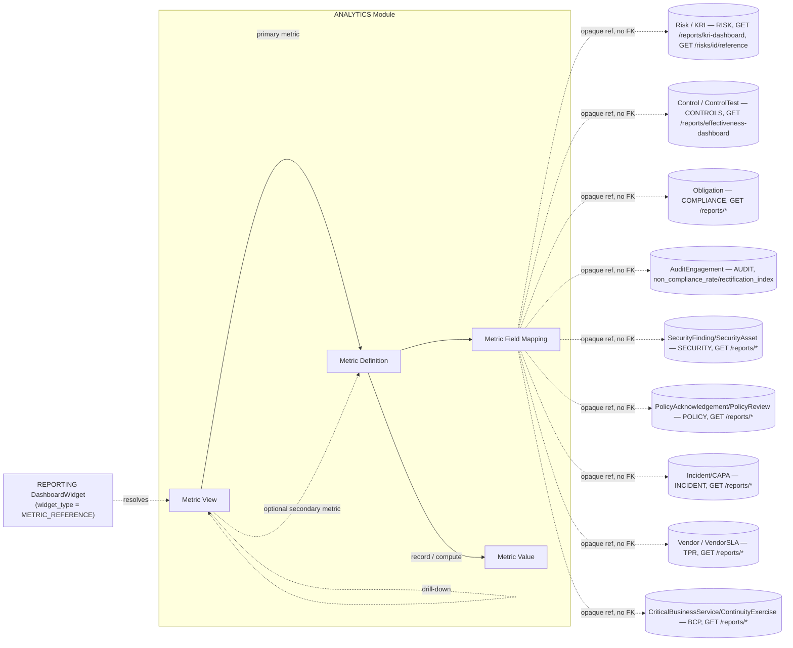
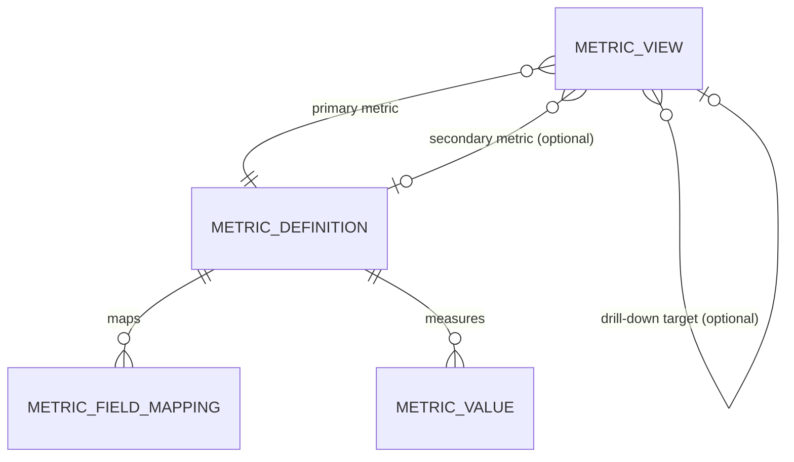
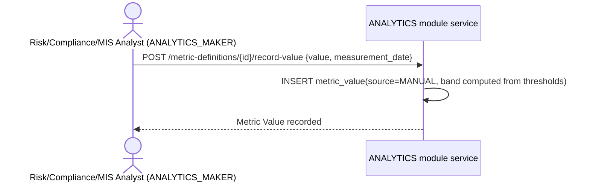

# 15.01 — Analytics Management

## Purpose

Defines the Analytics Management capability: the enterprise KPI/metric catalogue, field-level
provenance from every metric back to its owning source module, metric measurement and
threshold/banding, and the visualization/composition layer (metric views — heat maps,
trend/drill-down compositions, dashboard-widget content) that gives every Board, Executive,
Operational, and Regulatory dashboard something decision-ready to render — built entirely on
PRSMTD's existing multi-tenant, RBAC, and audit substrate. This is the repository's **twelfth
authoritative, implementation-ready specification**, and the second of the two documents that
together realize `04-domain-model`'s "Reporting and Analytics" Supporting Subdomain (Assumption
5 of that document) — the KPI/metric catalog and dashboard visualization layer
[`14-reporting/01-reporting-management.md`](../14-reporting/01-reporting-management.md)
Assumption 16 explicitly deferred to this phase.

Like `REPORTING`, this module originates no business fact of its own. It is a Conformist,
read-only consumer of `RISK`, `CONTROLS`, `COMPLIANCE`, `AUDIT`, `SECURITY`, `POLICY`,
`INCIDENT`, `TPR`, and `BCP` — the same nine core-domain contexts `REPORTING` reads from — but
it answers a different question than `REPORTING` does: `REPORTING` produces *governed,
citable, point-in-time report artifacts*; `ANALYTICS` produces *lightweight, frequently
refreshed, threshold-banded numbers and the visualization recipes that compose them into
heat maps, trend lines, and drill-downs*. Neither duplicates the other; see
[Relationship to Reporting Management](#relationship-to-reporting-management).

## Scope

**In scope**: the KPI/metric definition catalogue (`MetricDefinition`); field-level provenance
mapping from a metric definition to the source module table/endpoint it aggregates
(`MetricFieldMapping`); metric measurement and threshold/banding (`MetricValue`, embedded
green/amber/red thresholds on `MetricDefinition`, mirroring the KRI/VendorSLA shape those two
modules already established); the metric-view composition layer (`MetricView`) — chart type,
dimension breakdown, and drill-down linkage for a metric or metric pair, the content unit a
dashboard widget renders; activation of `14-reporting`'s already-reserved
`DashboardWidget.widget_type = METRIC_REFERENCE` slot; a first-time-complete seed KPI/Metric
Catalogue consolidating measurable facts already named across
`RISK`/`CONTROLS`/`COMPLIANCE`/`AUDIT`/`SECURITY`/`POLICY`/`INCIDENT`/`TPR`/`BCP`'s own data
models, plus genuinely new cross-module composite metrics; a canonical aging-bucket convention
(no prior module defined one); and this module's own security/audit/reporting/API surface.

**Out of scope** (owned elsewhere, or explicitly deferred):

- **`DashboardDefinition`/`DashboardWidget` themselves** — both remain exclusively owned by
  `REPORTING` (`04-domain-model` Assumption 5; `14-reporting`'s own Domain Model). This module
  does not define a second, competing dashboard aggregate — see
  [Relationship to Reporting Management](#relationship-to-reporting-management).
- **KRI** (`RISK`) and **Vendor SLA** (`TPR`) themselves — both remain exclusively owned by
  their respective modules (`04-domain-model` Assumption 3; `25-third-party-risk` Assumption
  10). This module never stores a parallel measurement table for either; it reads their
  existing bulk endpoints (Assumption 5).
- **Pixel-level chart rendering, layout, and interaction design** — `27-user-experience`'s own
  presentation-layer boundary, per `CLAUDE.md`. `MetricView.visualization_type` names *what
  kind* of visualization a metric composes into (heat map, trend line, gauge, etc.) — content
  composition, not pixel-level UI design — the identical distinction `14-reporting` already
  drew for `DashboardDefinition`.
- **A generic formula-execution/BI-computation engine** — no such platform mechanism exists in
  PRSMTD today (Assumption 7); `MetricDefinition.formula_description` is a human-readable
  specification of intent, not an executable expression.
- **A scheduled-job/cron/batch-execution mechanism** for automatic periodic metric refresh — the
  same confirmed-absent gap `14-reporting` Assumption 8 first named (Assumption 6); metric
  computation remains a manually-triggered maker action.
- **Notification/alerting on threshold breach** — PRSMTD's notification/alerting capability was
  attempted platform-wide and explicitly retired (`system.md`, PR-RESET-02), the same inherited
  gap `09-security` and `14-reporting` each already named. A `RED`-banded `MetricValue` is a
  recorded fact, never an automated alert.
- **AI-derived analytics** (anomaly detection, narrative summarization over this catalogue) —
  `16-ai`'s own future scope, per `15-analytics/README.md`'s own cross-reference; this module
  supplies the metric substrate such features would read, not the AI feature itself.
- Regulatory profiles other than `SEBI_AMC` — the catalogue is profile-configurable per the
  established pattern; only `SEBI_AMC` seed content is defined here.

## Business Context

`15-analytics/README.md` has scoped this capability since the repository's foundational
scaffolding: "KPI/metrics definitions and dashboard specifications that turn raw module data
into decision-ready views for risk owners, compliance, and executives," explicitly distinct
from `10-risk`'s KRIs ("risk-specific leading indicators") and from `14-reporting`'s report
content. `14-reporting/01-reporting-management.md` — authored one phase before this one,
per the Master Execution Plan's own Phase 11 sequencing — built the shared
`ReportDefinition`/`DashboardDefinition` foundation this module was always expected to extend,
reserving `DashboardWidget.widget_type = METRIC_REFERENCE` as an inert slot specifically for
this module to activate (that spec's own Assumption 16). Every one of the nine core-domain
modules' own data model already carries the measurable facts this catalogue aggregates —
severity enums, status enums, threshold-banded measurements (`KRIMeasurement`,
`VendorSLAMeasurement`), and, in `AUDIT`'s case, two explicitly named aggregate formulas
(Non-Compliance Rate, Rectification Index) — but, per this session's own research (see
[Assumptions](#assumptions)), no module besides `AUDIT` names an aggregate ratio/rate formula
of its own; every other "dashboard"/"posture"/"completion %" mention across the nine modules is
descriptive scope language over enum/count data, not a stated formula. This module's central,
first-time-complete contribution is naming those formulas explicitly, once, in a catalogue
every future dashboard and every future AI-analytics feature can reuse rather than re-derive.

## Regulatory Drivers

This module cites no new regulatory text of its own — like `REPORTING`, it operationalizes
obligations every source module already cites, at the level of a trended, thresholded metric
rather than a point-in-time report. Per `CLAUDE.md`'s "cross-reference over restating" rule,
clause-level citations are not re-extracted here:

| Recurring obligation | Already cited by | How this module operationalizes it |
|---|---|---|
| Risk appetite thresholds and KRI monitoring | `10-risk` (RMS circular, §III) | `MTR-RISK-004` KRI Breach Rate trends `KRIMeasurement.band` over time — see [KPI / Metric Catalogue](#kpi--metric-catalogue) |
| Non-Compliance Rate / Rectification Index | `13-audit` (Annexures §1.3.4.1.1(ii)(d)–(f)) | `MTR-AUD-001`/`MTR-AUD-002` trend `AuditEngagement`'s own already-computed fields; this module never recomputes them |
| Structured SLA benchmarking tool | `25-third-party-risk` (Annexures §2.9.3.1(v)(c)) | `MTR-TPR-002` SLA Breach Rate trends `VendorSLAMeasurement.band`, mirroring the KRI metric exactly |
| Documented, regularly tested internal controls over financial reporting | `12-controls` (Annexures §2.11.2.1(iii)) | `MTR-CTL-001`/`MTR-CTL-002` Control Effectiveness Rate |
| RTO/RPO-tested continuity plans | `26-business-continuity` (Annexure 8, item 8d) | `MTR-BCP-001` RTO/RPO Achievement Rate |

No source PDF is newly mined by this spec; every citation above is inherited from the module
named in the second column.

## Assumptions

1. **`ANALYTICS` is a tenant-plane module, like every other module** — the same reasoning
   `14-reporting` Assumption 1 already applied: a Board metric for Tenant A must never leak
   into Tenant B.
2. **Users referenced by this module** (`owner_user_id`, `recorded_by`, etc.) **are
   platform/tenant identity records**, not module-owned data — same reasoning as every prior
   module.
3. **This module proposes, but does not apply, an amendment to `04-domain-model`**: adding
   `ANALYTICS` as an eleventh bounded context. `04-domain-model` Assumption 5 originally named
   "Reporting and Analytics" as a single Supporting Subdomain before either half was authored;
   now that both are authored, each owns a genuinely distinct aggregate set and vocabulary
   (`ReportDefinition`/`ReportInstance`/`DashboardDefinition` vs.
   `MetricDefinition`/`MetricValue`/`MetricView`) — the same kind of precisely-scoped gap
   every prior module's own status-label proposal discovered, not a redesign of the Supporting
   Subdomain *type*, which still holds both. See [Future Extension
   Points](#future-extension-points) for the exact amendment text.
4. **No aggregate root of this module originates a business fact.** `MetricDefinition`,
   `MetricValue`, and `MetricView` are each a composition/projection over the nine source
   contexts, never a new source of Risk/Control/Compliance/Audit/Security/Policy/Incident/
   Vendor/Continuity data — the same realization of `04-domain-model`'s own Assumption 5 that
   `14-reporting` already gave its own aggregates.
5. **`KRI` (`RISK`) and `VendorSLA` (`TPR`) are never duplicated.** Both remain exclusively
   owned by their respective modules (`04-domain-model` Assumption 3: "No future module named
   `KRI` should be authored"; `25-third-party-risk` Assumption 10: `VendorSLA` "mirrors
   `10-risk`'s `KRI` shape precisely" without being a duplicate of its scoring engine). Every
   KRI- or SLA-derived metric in this module's catalogue is `calculation_method =
   SOURCE_AGGREGATE`, computed by calling that module's own existing bulk endpoint
   (`GET /reports/kri-dashboard`, and the `TPR` SLA dashboard equivalent) — this module never
   stores a parallel `*_measurement` table for either.
6. **No PRSMTD scheduled-job/cron/batch-execution mechanism exists** — confirmed absent by
   `14-reporting` Assumption 8, re-affirmed (not re-verified independently, per
   `CLAUDE.md`'s no-duplication rule) for this module. `MetricDefinition.refresh_cadence`
   therefore tracks *intended* cadence only; `POST /metric-definitions/{id}/compute` remains a
   manually-triggered `ANALYTICS_COMPUTE` action, the identical shape `14-reporting`'s own
   `REPORTING_GENERATE` action already uses for reports.
7. **No generic formula-execution or BI-computation engine exists in PRSMTD** — confirmed
   absent this session (no hits for "formula engine," "BI," "expression evaluator" in
   `system.md`). `MetricDefinition.formula_description` is a human-readable text field stating
   *intent* (e.g., "count of Control rows with `operating_effectiveness = EFFECTIVE` divided by
   count of `ACTIVE` Control rows"), not an executable expression — actual computation logic for
   `DERIVED`/`COMPOSITE` metrics is implementation-layer business logic, the same
   "tenant-configurable business logic, not fixed by this spec" precedent `13-audit` Assumption
   9 already set for its own Non-Compliance Rate severity-weighting. Named as a genuine future
   PRSMTD capability gap if a real formula engine is ever required (see [Future Extension
   Points](#future-extension-points)).
8. **This module defines zero governed `module_actions` types** — an even smaller governance
   footprint than `14-reporting`'s own single governed action. Every aggregate here is either
   ungoverned catalog/config content (`MetricDefinition`, `MetricView` — mirroring
   `ReportDefinition`/`DashboardDefinition`'s "not every mutation needs governance" shape) or an
   append-only measurement fact (`MetricValue` — mirroring `KRIMeasurement`/
   `VendorSLAMeasurement`'s identical shape). Unlike `REPORTING`, this module never produces a
   regulator/board-facing artifact requiring approval-before-submission — a metric is an
   analytical fact, not a filing.
9. **Threshold/alerting on this module's own `MetricDefinition` is a distinct concept from KRI
   and Vendor SLA**, per `15-analytics/README.md`'s own scoping ("broader operational/
   performance metrics" vs. risk-specific leading indicators). The embedded `threshold_green`/
   `threshold_amber`/`threshold_red`/`direction` columns reuse the identical green/amber/red
   banding shape `KRI` and `VendorSLA` already established — the third module to adopt this
   shared-kernel pattern, not a new one invented here.
10. **This module activates, but does not modify, `14-reporting`'s already-reserved
    `DashboardWidget.widget_type = METRIC_REFERENCE` / `metric_ref_id` slot.** Zero additive
    change to `14-reporting`'s schema is required — that spec's own Assumption 16 named this
    module as the missing piece (a resolvable reference-resolution endpoint and a catalogue
    entity to resolve to), both of which this module now supplies.
11. **`DashboardWidget.metric_ref_id` resolves to this module's `MetricView`, not directly to a
    raw `MetricDefinition`.** A `MetricView` is the composed, visualization-ready unit (chart
    type, dimension breakdown, drill-down linkage); a bare `MetricDefinition` alone would leave
    the widget with a number but no rendering intent. This module proposes, but does not apply,
    two small additive changes to `14-reporting` to complete the activation: adding `ANALYTICS`
    to its manifest's `dependencies:` list, and adding a `REGULATORY` value to
    `DashboardDefinition.audience` (closing the one dashboard-audience gap this module's own
    brief names — Regulatory dashboards — that no existing audience value cleanly covers).
    Following the established propose-in-the-new-spec/apply-in-a-later-session pattern this
    repository has used in every prior authoring session.
12. **This module does not own `DashboardDefinition` or `DashboardWidget`.** Both remain
    exclusively owned by `REPORTING`. "Executive dashboards," "Operational dashboards," and
    "Regulatory dashboards" are realized as `REPORTING` `DashboardDefinition` instances composed
    of `METRIC_REFERENCE` widgets resolving into this module's `MetricView` catalogue — not a
    second, competing dashboard aggregate. See [Relationship to Reporting
    Management](#relationship-to-reporting-management).
13. **Heat maps and drill-down analysis are visualization *content* concerns, not pixel-level
    rendering.** `MetricView.visualization_type`, `dimension_breakdown_ref_id`, and
    `drill_down_target_view_id` are this module's complete answer to "what does this widget
    show and what does clicking into it reveal" — the identical "content composition, not
    pixel-level UI design" distinction `14-reporting` already drew for `DashboardDefinition`,
    and the boundary `CLAUDE.md` itself draws for `27-user-experience`.
14. **Cross-module composite metrics never make more than one live source-module call per
    constituent metric, and never call a source module synchronously from within another
    metric's own computation.** A composite metric (e.g. `MTR-ENT-006` Governance Health Index)
    reads only from this module's own previously-recorded `MetricValue` rows for its
    constituent metrics — never by fanning out to multiple source modules within one request —
    avoiding the request-timeout risk `14-reporting` Assumption 17 flagged for its own heaviest
    cross-module report.
15. **This module's manifest declares `dependencies: [RISK, CONTROLS, COMPLIANCE, AUDIT,
    SECURITY, POLICY, INCIDENT, TPR, BCP]`** — identical in membership to `REPORTING`'s own,
    since both are Conformist, read-only consumers of the same nine core-domain contexts.
    Unlike `REPORTING`, this module is not a pure graph sink: `REPORTING` itself becomes (via
    the proposed, not-applied amendment in Assumption 11) a consumer of this module in turn —
    an edge `04-domain-model` Dependency Rule 5 does not currently anticipate stating, proposed
    as an additive extension there too (see [Future Extension
    Points](#future-extension-points)). No cycle results: this module never depends on
    `REPORTING`.
16. **Record retention is deferred to `11-compliance`**, same as every prior module; this
    module's own tables are append-only/status-transitioned, introducing no new gap.
17. **A `ReportInstance` (`REPORTING`) and a `MetricValue` (this module) are deliberately never
    merged into one entity.** A Report Instance is an immutable, potentially approval-gated,
    evidence-ready artifact; a Metric Value is a lightweight, ungoverned, frequently-refreshed
    analytical fact. Keeping them distinct preserves `14-reporting`'s existing "evidence-ready
    export" framing exactly as designed, and keeps this module's own governance footprint at
    zero (Assumption 8).
18. **A canonical aging-bucket convention (`0–30`, `31–60`, `61–90`, `90+` days open) is defined
    here for the first time.** This session's own review of every exception/finding-type entity
    across the nine source modules (`ControlException`, `ComplianceException`, `Finding`,
    `SecurityFinding`, `PolicyException`, `VendorException`, `ContinuityException`, `Issue`)
    confirmed none defines an aging-bucket boundary of its own — each only carries the raw
    `identified_date`/`target_closure_date` columns an aging calculation would need. Every
    Enterprise Exception Aging metric in [KPI / Metric Catalogue](#kpi--metric-catalogue) reuses
    this one convention rather than each metric re-deriving its own bucket boundaries.

## Relationship to Reporting Management

`REPORTING` and `ANALYTICS` are both Conformist, read-only layers over the same nine
core-domain contexts, authored one phase apart, and easy to conflate. They are kept distinct on
purpose:

| | `REPORTING` (`14-reporting`) | `ANALYTICS` (this module) |
|---|---|---|
| Owns | `ReportDefinition`, `ReportInstance`, `DashboardDefinition`, `DashboardWidget` | `MetricDefinition`, `MetricValue`, `MetricView` |
| Produces | An immutable, timestamped, fully-cited artifact — evidence-ready, sometimes approval-gated before submission | A lightweight, frequently-refreshed, threshold-banded number and its visualization recipe |
| Governance | One governed action (`REPORT_INSTANCE_APPROVAL`), opt-in per definition | Zero governed actions (Assumption 8) |
| Consumer of the other | Yes — `DashboardWidget.metric_ref_id` resolves into this module's `MetricView` catalogue (Assumption 10–11) | No — this module never reads `ReportDefinition`/`ReportInstance` data, avoiding a dependency cycle (Assumption 15) |
| Dashboard/report ownership | Owns the audience-facing composition (`DashboardDefinition`) | Supplies the metric content a `METRIC_REFERENCE` widget on that composition renders |

A worked example: `REPORTING`'s own seed catalogue does not yet include a seeded
`DashboardDefinition` row (only `ReportDefinition` rows were seeded at that module's own
authoring) — dashboard instances remain a `REPORTING_ADMIN`/tenant-configuration exercise. An
illustrative "Executive GRC Dashboard" a tenant might configure today would compose:
`REPORT_REFERENCE` widgets citing `RPT-ENT-001` (Board & Executive GRC Summary) alongside
`METRIC_REFERENCE` widgets citing this module's `MV-ENT-003` (Residual Risk Heat Map) and
`MV-ENT-006` (Governance Health Index) — the two layers composed side by side on one dashboard,
neither duplicating the other.

## Dependencies

- PRSMTD `docs/authoritative/system.md` §3 (Governance model — not exercised by this module,
  Assumption 8), §7 (Data model & RLS enforcement), §8 (RBAC model), §9 + §5a–§5c (Module
  framework, ownership guards), §10 (Audit and compliance), §21 (Authentication Surface
  Ownership) — all reused as-is; **confirmed absent** this session: a scheduled-job/batch-
  execution mechanism (Assumption 6, re-affirming `14-reporting` Assumption 8) and a generic
  formula-execution/BI-computation engine (Assumption 7, a genuinely new finding).
- [`04-domain-model/01-enterprise-domain-model.md`](../04-domain-model/01-enterprise-domain-model.md)
  — **not modified by this spec.** Its Assumption 5 ("Reporting and Analytics is a supporting
  subdomain... with no aggregate roots of its own beyond report/dashboard definitions") is the
  frozen input this spec elaborates for its own half. This spec proposes, but does not apply,
  an eleventh-bounded-context amendment (Assumption 3).
- [`14-reporting/01-reporting-management.md`](../14-reporting/01-reporting-management.md) —
  **not modified.** Its `DashboardWidget.widget_type = METRIC_REFERENCE`/`metric_ref_id` slot
  is activated with zero additive change (Assumption 10). This spec proposes, but does not
  apply, a `dependencies: [..., ANALYTICS]` manifest addition and a `DashboardDefinition.
  audience = REGULATORY` enum addition (Assumption 11).
- [`10-risk/01-enterprise-risk-management.md`](../10-risk/01-enterprise-risk-management.md) —
  **not modified.** `GET /reports/heat-map`, `/reports/kri-dashboard`, and
  `GET /risks/{id}/reference` (already added per that spec's own Amendment log) are reused with
  zero additive change.
- [`12-controls/01-controls-management.md`](../12-controls/01-controls-management.md) — **not
  modified.** `GET /reports/effectiveness-dashboard`, `/reports/exception-register`, and
  `GET /controls/{id}/reference` are reused with zero additive change.
- [`11-compliance/01-compliance-management.md`](../11-compliance/01-compliance-management.md)
  — **not modified.** Its `GET /reports/*` namespace and `GET /obligations/{id}/reference` are
  reused with zero additive change.
- [`13-audit/01-audit-management.md`](../13-audit/01-audit-management.md) — **not modified.**
  `AuditEngagement.non_compliance_rate`/`rectification_index` and
  `GET /findings/{id}/reference`/`GET /engagements/{id}/reference` (already added per that
  spec's own Amendment log) are reused with zero additive change.
- [`09-security/01-security-management.md`](../09-security/01-security-management.md) — **not
  modified.** Its `GET /reports/*` namespace and `GET /findings/{id}/reference` are reused with
  zero additive change.
- [`23-policy/01-policy-management.md`](../23-policy/01-policy-management.md) — **not
  modified.** Its `GET /reports/*` namespace is reused with zero additive change.
- [`24-incident-issue-capa/01-incident-issue-capa-management.md`](../24-incident-issue-capa/01-incident-issue-capa-management.md)
  — **not modified.** Its `GET /reports/*` namespace and `GET /issues/{id}/reference`,
  `GET /capas/{id}/reference` are reused with zero additive change.
- [`25-third-party-risk/01-third-party-risk-management.md`](../25-third-party-risk/01-third-party-risk-management.md)
  — **not modified.** Its `GET /reports/*` namespace and its own confirmation that `VendorSLA`
  mirrors `KRI`'s shape are reused with zero additive change.
- [`26-business-continuity/01-business-continuity-management.md`](../26-business-continuity/01-business-continuity-management.md)
  — **not modified.** Its `GET /reports/*` namespace is reused with zero additive change.
- `docs/05-modules/README.md` — confirmed index-only (Session 9); no separate per-module
  `06-data-model/`/`08-api/` document is expected for this module.

## Architecture

The Analytics Management capability is one PRSMTD module: **module code `ANALYTICS`**. It
follows the generic module framework exactly as every prior module does (`system.md`
§9/§5a–§5c):

- `moduleId`: a stable UUID minted at implementation time, not fixed by this specification.
- Table prefix: `module_analytics_*` (OWN-03 schema ownership).
- Route namespace: `/modules/ANALYTICS` (§5b4).
- API namespace: `/api/v1/modules/analytics/**`, controllers in `com.prsbnjs.modules.analytics`
  (OWN-07).
- Module role types: `MAKER`, `CHECKER`, `VIEWER` only — the closed set (`system.md` §8).
  Domain personas map onto these three; see [Authorization](#authorization).
- `dependencies: [RISK, CONTROLS, COMPLIANCE, AUDIT, SECURITY, POLICY, INCIDENT, TPR, BCP]` —
  identical in membership to `REPORTING`'s own declaration, every edge justified by a genuine
  synchronous cross-module API call this module's own metric computation makes (per
  `04-domain-model` Dependency Rule 6), enumerated in each Integration section below.
- No platform-plane tables, no platform-plane governance actions — every tenant-scoped table is
  RLS-bound (`app.plane = 'tenant'`).
- Tenant isolation, GUC binding, and session-setter usage are inherited unmodified from
  `TenantAwareDataSource` (`system.md` §7) — this module issues no direct `SET`/`set_config`
  calls.
- **Cross-module access is API-mediated only (OWN-08/OWN-09).** This module never reads
  another module's tables directly; every metric computation is a call to that module's own
  `GET /reports/*` bulk endpoint (for aggregate/rate metrics) or `GET .../{id}/reference` point
  endpoint (for a specific cited value), never a join.
- This module defines **zero** `module_actions` governed action types (Assumption 8) — no
  approval-before-anything workflow exists here.



## Domain Model

**Bounded context**: Analytics Management (proposed, per Assumption 3, as an eleventh bounded
context in `04-domain-model`'s Bounded Context Map). Owns the metric/metric-view catalogue and
the recorded metric measurement exclusively; treats every one of `RISK`, `CONTROLS`,
`COMPLIANCE`, `AUDIT`, `SECURITY`, `POLICY`, `INCIDENT`, `TPR`, and `BCP` as an external context
it reads from but never writes to, never owns, and never duplicates — the identical
Conformist/read-only relationship shape `REPORTING` already established, applied here to a
distinct vocabulary.

**Ubiquitous language** (extends, does not redefine, `04-domain-model`'s canonical glossary):

| Term | Definition |
|---|---|
| Metric Definition | A catalogued, named KPI or metric — its category, primary source module, calculation method, formula description, unit, refresh cadence, owner, and optional threshold bands. |
| Metric Field Mapping | A single source fact a Metric Definition aggregates, mapped to the source module, source entity type, and endpoint that resolves it — the prescriptive half of this module's provenance mechanism, mirroring `14-reporting`'s `ReportFieldMapping`. |
| Metric Value | A recorded or computed measurement of a Metric Definition at a point in time, banded `GREEN`/`AMBER`/`RED` where thresholds are defined — mirrors `KRIMeasurement`/`VendorSLAMeasurement`'s identical shape. |
| Metric View | A named visualization/composition recipe over one or two Metric Definitions — chart type, optional dimension breakdown, optional drill-down target — the content unit a `REPORTING` `DashboardWidget` renders. |
| Aging Bucket | This module's own canonical `0–30`/`31–60`/`61–90`/`90+`-day-open classification, reused by every Enterprise Exception Aging metric in the catalogue. |

**Aggregates, entities, and invariants**:

- **MetricDefinition** (aggregate root) — Ungoverned (Assumption 8); an `ANALYTICS_ADMIN`
  (via `ANALYTICS_CHECKER`) maker creates/edits/retires directly, no separate checker approval
  required, the same "not every mutation needs governance" shape `ReportDefinition` uses.
  `status ∈ DRAFT, ACTIVE, RETIRED`. Cannot be retired while a `MetricView` referencing it as
  `primary_metric_definition_id` is `ACTIVE`.
- **MetricFieldMapping** (entity, owned by MetricDefinition) — Plain, ungoverned mapping row; at
  least one row per active `MetricDefinition` whose `calculation_method = SOURCE_AGGREGATE` or
  `DERIVED` ([FR-03](#functional-requirements)).
- **MetricValue** (entity, owned by MetricDefinition) — Append-only, mirrors
  `KRIMeasurement`/`VendorSLAMeasurement` exactly. `band` computed on write from the owning
  `MetricDefinition`'s threshold columns when populated, else `NULL`. `source ∈ MANUAL,
  COMPUTED`. Never edited after creation — a correction is a new row, not an update.
- **MetricView** (aggregate root) — Ungoverned, mirrors `DashboardDefinition`. `status ∈ DRAFT,
  ACTIVE, RETIRED`. Exactly one `primary_metric_definition_id` required;
  `secondary_metric_definition_id` populated only for two-axis visualizations (e.g. a
  likelihood × impact heat map); `drill_down_target_view_id` (self-referencing, nullable) names
  the child `MetricView` a user drills into, forming a directed, acyclic chain — a `MetricView`
  may not name itself or an ancestor as its own drill-down target.

### Metric Definitions and Field-Level Provenance

Every `MetricDefinition` with `calculation_method ∈ SOURCE_AGGREGATE, DERIVED` carries one or
more `MetricFieldMapping` rows, each stating: which source fact the metric aggregates, which
module owns it, what kind of entity it is, and which endpoint resolves it — either that
module's own `GET /reports/*` bulk endpoint (the same endpoints `REPORTING` already reuses for
its own bulk pulls) or its `GET .../{id}/reference` point endpoint. `calculation_method =
MANUAL` metrics (recorded directly, no source computation) carry no field mapping.

Two worked examples:

| Metric | Field | Source module | Source entity type | Resolving endpoint |
|---|---|---|---|---|
| `MTR-CTL-001` Control Operating Effectiveness Rate | `Control.operating_effectiveness`, `Control.status` | `CONTROLS` | `Control` (bulk) | `GET /api/v1/modules/controls/reports/effectiveness-dashboard` |
| `MTR-AUD-002` Rectification Index Trend | `AuditEngagement.rectification_index` | `AUDIT` | `AuditEngagement` (bulk) | `GET /api/v1/modules/audit/reports/*` |

`MetricFieldMapping` is prescriptive — it states what a metric *should* aggregate. The matching
descriptive record is each `MetricValue.computed_via_endpoint` (populated only when `source =
COMPUTED`), stating what a specific recorded value *actually* resolved at compute time —
lighter-weight than `REPORTING`'s own `ReportCitation` manifest (no separate child table), since
a metric value's own row already carries this provenance directly.

### Aging Bucket Convention

Defined here for the first time (Assumption 18) — no source module's own exception/finding
entity defines one:

| Bucket | Range |
|---|---|
| `FRESH` | 0–30 days open (`today - identified_date`) |
| `AGING` | 31–60 days open |
| `OVERDUE` | 61–90 days open |
| `CRITICAL_AGING` | 90+ days open |

Every Enterprise Exception Aging metric ([KPI / Metric Catalogue](#kpi--metric-catalogue))
buckets `ControlException`, `ComplianceException`, `SecurityFinding`, `PolicyException`,
`VendorException`, `ContinuityException`, and `Finding` rows (each already carrying
`identified_date` and a `status` excluding `CLOSED`) into this one convention, reusable by any
future metric this catalogue adds.

## KPI / Metric Catalogue

The seed `SEBI_AMC` KPI/Metric Catalogue: 48 metric definitions total — 6 cross-module (this
module's own contribution, mirroring `14-reporting`'s six `CROSS_MODULE` reports) plus 42
consolidated from the nine source modules' own data models (per-module counts in the
[Traceability](#traceability) block). `calculation_method ∈ SOURCE_AGGREGATE` (a direct pull
from one source module's bulk endpoint, no local formula), `DERIVED` (computed by this module
from source facts using the stated formula), `MANUAL` (recorded directly by a maker, no source
computation), or `COMPOSITE` (computed from other `MetricDefinition`s' own recorded
`MetricValue` rows, per Assumption 14).

| Metric Code | Name | Category | Calc Method | Unit | Formula (summary) |
|---|---|---|---|---|---|
| `MTR-ENT-001` | Enterprise Exception Aging Rollup | CROSS_MODULE | COMPOSITE | COUNT by bucket | Aging-bucket count across `ControlException`/`ComplianceException`/`SecurityFinding`/`PolicyException`/`VendorException`/`ContinuityException`/`Finding` `WHERE status <> CLOSED` |
| `MTR-ENT-002` | Enterprise CAPA On-Time & Effectiveness Rollup | CROSS_MODULE | COMPOSITE | PERCENT | Aggregates `MTR-INC-003`/`MTR-INC-004` across all source modules whose exceptions escalate to a CAPA |
| `MTR-ENT-003` | Residual Risk Heat Map | CROSS_MODULE | SOURCE_AGGREGATE | MATRIX | `Risk.residual_likelihood` × `Risk.residual_impact`, counted per cell, from `GET /reports/heat-map` |
| `MTR-ENT-004` | Control Effectiveness Trend by Family | CROSS_MODULE | DERIVED | PERCENT (trend) | `MTR-CTL-001` trended over time, broken down by `ControlFamily` |
| `MTR-ENT-005` | Regulatory Filing On-Time Rate | CROSS_MODULE | DERIVED | PERCENT | `count(ComplianceCalendarEntry WHERE entry_type=FILING AND status=COMPLETED AND completed_date<=due_date) / count(... WHERE status IN (COMPLETED, OVERDUE))` |
| `MTR-ENT-006` | Governance Health Index | CROSS_MODULE | COMPOSITE | INDEX (0–100) | Configurable weighted average of `MTR-CTL-001`, `MTR-CMP-001`, `MTR-AUD-002` (direction-normalized), `MTR-SEC-001` (inverse), `MTR-BCP-001` |
| `MTR-RISK-001` | Residual Risk Distribution by Band | RISK | SOURCE_AGGREGATE | COUNT | `count(Risk WHERE status NOT IN (RETIRED)) GROUP BY residual_band` |
| `MTR-RISK-002` | Top-N Risks by Residual Score | RISK | SOURCE_AGGREGATE | RANK | `Risk` ordered by `residual_score DESC`, from `GET /reports/risk-register` |
| `MTR-RISK-003` | KRI Breach Rate | RISK | SOURCE_AGGREGATE | PERCENT | `count(KRIMeasurement WHERE band=RED, period) / count(KRIMeasurement, period)`, from `GET /reports/kri-dashboard` |
| `MTR-RISK-004` | Overdue Risk Reviews | RISK | SOURCE_AGGREGATE | COUNT | `count(Risk WHERE next_review_date < today AND status NOT IN (RETIRED))` |
| `MTR-RISK-005` | Escalation Acknowledgement Aging | RISK | DERIVED | HOURS (avg) | `avg(now - triggered_at) WHERE Escalation.status = PENDING_ACK` |
| `MTR-RISK-006` | Risk Count by Source | RISK | SOURCE_AGGREGATE | COUNT | `count(Risk) GROUP BY source` |
| `MTR-CTL-001` | Control Operating Effectiveness Rate | CONTROLS | SOURCE_AGGREGATE | PERCENT | `count(Control WHERE operating_effectiveness=EFFECTIVE AND status=ACTIVE) / count(Control WHERE status=ACTIVE)` |
| `MTR-CTL-002` | Control Design Effectiveness Rate | CONTROLS | SOURCE_AGGREGATE | PERCENT | Same as `MTR-CTL-001` using `design_effectiveness` |
| `MTR-CTL-003` | Overdue Control Tests | CONTROLS | SOURCE_AGGREGATE | COUNT | `count(Control WHERE next_test_due_date < today AND status=ACTIVE)` |
| `MTR-CTL-004` | Control Exception Aging | CONTROLS | DERIVED | COUNT by bucket | Aging-bucket count of `ControlException WHERE status <> CLOSED`, per [Aging Bucket Convention](#aging-bucket-convention) |
| `MTR-CTL-005` | Control Exception Count by Severity | CONTROLS | SOURCE_AGGREGATE | COUNT | `count(ControlException WHERE status <> CLOSED) GROUP BY severity` |
| `MTR-CTL-006` | Control Coverage by Risk | CONTROLS | SOURCE_AGGREGATE | PERCENT | `count(Risk WITH >=1 linked_control) / count(Risk WHERE status NOT IN (RETIRED))` |
| `MTR-CMP-001` | Compliance Rate | COMPLIANCE | SOURCE_AGGREGATE | PERCENT | `count(Obligation WHERE compliance_status=COMPLIANT AND status=ACTIVE) / count(Obligation WHERE status=ACTIVE)` |
| `MTR-CMP-002` | Non-Compliant Obligation Count | COMPLIANCE | SOURCE_AGGREGATE | COUNT | `count(Obligation WHERE compliance_status=NON_COMPLIANT AND status=ACTIVE)` |
| `MTR-CMP-003` | Overdue Compliance Calendar Entries | COMPLIANCE | SOURCE_AGGREGATE | COUNT | `count(ComplianceCalendarEntry WHERE status=OVERDUE)` |
| `MTR-CMP-004` | Compliance Exception Aging | COMPLIANCE | DERIVED | COUNT by bucket | Aging-bucket count of `ComplianceException WHERE status <> CLOSED` |
| `MTR-CMP-005` | Attestation Completion Rate | COMPLIANCE | SOURCE_AGGREGATE | PERCENT | `count(ComplianceAttestation WHERE status=ATTESTED, period) / count(ComplianceAttestation WHERE status IN (SUBMITTED, ATTESTED, REJECTED), period)` |
| `MTR-AUD-001` | Non-Compliance Rate Trend | AUDIT | SOURCE_AGGREGATE | PERCENT (trend) | Trends `AuditEngagement.non_compliance_rate` as already computed and locked by `AUDIT` itself — never recomputed here |
| `MTR-AUD-002` | Rectification Index Trend | AUDIT | SOURCE_AGGREGATE | INDEX (trend) | Trends `AuditEngagement.rectification_index` as already computed and locked by `AUDIT` itself |
| `MTR-AUD-003` | Finding Aging by Severity | AUDIT | DERIVED | COUNT by bucket | Aging-bucket count of `Finding WHERE status <> CLOSED`, cross-tabbed by `severity` |
| `MTR-AUD-004` | Overdue Follow-Up Actions | AUDIT | SOURCE_AGGREGATE | COUNT | `count(FollowUpAction WHERE status=OVERDUE)` |
| `MTR-SEC-001` | Open Critical/High Finding Count | SECURITY | SOURCE_AGGREGATE | COUNT | `count(SecurityFinding WHERE severity IN (CRITICAL, HIGH) AND status <> CLOSED)` |
| `MTR-SEC-002` | Security Finding Aging by Severity | SECURITY | DERIVED | COUNT by bucket | Aging-bucket count of `SecurityFinding WHERE status <> CLOSED`, cross-tabbed by `severity` |
| `MTR-SEC-003` | Asset Rotation Compliance Rate | SECURITY | SOURCE_AGGREGATE | PERCENT | `count(SecurityAsset WHERE status=ACTIVE AND next_rotation_due_date >= today) / count(SecurityAsset WHERE status IN (ACTIVE, ROTATION_DUE))` |
| `MTR-SEC-004` | Expiring Access Grants (30-day) | SECURITY | SOURCE_AGGREGATE | COUNT | `count(SecurityAccessGrant WHERE status=ACTIVE AND expires_at <= today + 30 days)` |
| `MTR-POL-001` | Acknowledgement Completion Rate | POLICY | SOURCE_AGGREGATE | PERCENT | `count(PolicyAcknowledgement rows for version) / <required roster>` — see [Assumption limitation](#kpi--metric-catalogue) note below |
| `MTR-POL-002` | Overdue Policy Reviews | POLICY | SOURCE_AGGREGATE | COUNT | `count(Policy WHERE next_review_date < today AND status=ACTIVE)` |
| `MTR-POL-003` | Policy Exception Aging | POLICY | DERIVED | COUNT by bucket | Aging-bucket count of `PolicyException WHERE status <> CLOSED` |
| `MTR-INC-001` | Incident Count by Severity and Category | INCIDENT | SOURCE_AGGREGATE | COUNT | `count(Incident, period) GROUP BY severity, category_id` |
| `MTR-INC-002` | Mean Time to Close (Incident) | INCIDENT | DERIVED | HOURS (avg) | `avg(closed_date - detected_date) WHERE status=CLOSED, period` |
| `MTR-INC-003` | CAPA On-Time Completion Rate | INCIDENT | SOURCE_AGGREGATE | PERCENT | `count(CAPA WHERE status=CLOSED AND implementation_completed_at <= target_completion_date) / count(CAPA WHERE status=CLOSED)` |
| `MTR-INC-004` | CAPA Effectiveness Rate | INCIDENT | SOURCE_AGGREGATE | PERCENT | `count(CAPAEffectivenessReview WHERE outcome=EFFECTIVE AND status=APPROVED) / count(CAPAEffectivenessReview WHERE status=APPROVED)` — this module's own first-time-complete aggregate analog to `AUDIT`'s Rectification Index, at the individual-CAPA level |
| `MTR-INC-005` | Overdue CAPA Action Items | INCIDENT | SOURCE_AGGREGATE | COUNT | `count(CAPAActionItem WHERE status=OVERDUE)` |
| `MTR-TPR-001` | Vendor Count by Criticality and Risk Rating | TPR | SOURCE_AGGREGATE | COUNT | `count(Vendor WHERE status=ACTIVE) GROUP BY criticality, residual_risk_rating` |
| `MTR-TPR-002` | SLA Breach Rate | TPR | SOURCE_AGGREGATE | PERCENT | `count(VendorSLAMeasurement WHERE band=RED, period) / count(VendorSLAMeasurement, period)` — mirrors `MTR-RISK-003` exactly, per `VendorSLA`'s own confirmed `KRI`-mirroring shape |
| `MTR-TPR-003` | Overdue Vendor Reassessments | TPR | SOURCE_AGGREGATE | COUNT | `count(Vendor WHERE next_reassessment_date < today AND status=ACTIVE)` |
| `MTR-TPR-004` | Contracts Expiring (90-day) | TPR | SOURCE_AGGREGATE | COUNT | `count(VendorContract WHERE status=ACTIVE AND effective_to <= today + 90 days)` |
| `MTR-TPR-005` | Vendor Exception Aging | TPR | DERIVED | COUNT by bucket | Aging-bucket count of `VendorException WHERE status <> CLOSED` |
| `MTR-BCP-001` | RTO/RPO Achievement Rate | BCP | SOURCE_AGGREGATE | PERCENT | `count(ContinuityExercise WHERE rto_met=true AND rpo_met=true AND status=APPROVED) / count(ContinuityExercise WHERE status=APPROVED)` |
| `MTR-BCP-002` | Overdue BIA Reassessments | BCP | SOURCE_AGGREGATE | COUNT | `count(CriticalBusinessService WHERE next_bia_due_date < today AND status=ACTIVE)` |
| `MTR-BCP-003` | Continuity Plan Coverage Rate | BCP | SOURCE_AGGREGATE | PERCENT | `count(CriticalBusinessService WITH >=1 ACTIVE linked ContinuityPlan) / count(CriticalBusinessService WHERE status=ACTIVE)` |
| `MTR-BCP-004` | Continuity Exception Aging | BCP | DERIVED | COUNT by bucket | Aging-bucket count of `ContinuityException WHERE status <> CLOSED` |

**Known scoping limitation, named rather than glossed over** (`MTR-POL-001`): `23-policy/01-*`
itself states "This module records who *did* acknowledge, not who *must*" — no roster/population
capability exists anywhere in this repository to supply the denominator a true completion *rate*
needs. This metric is seeded as a catalogue placeholder whose numerator
(`count(PolicyAcknowledgement)`) is fully computable today; its denominator depends on a
roster-of-required-acknowledgers capability that is a genuine gap, not designed by this or any
prior spec — see [Future Extension Points](#future-extension-points).

## Metric View / Visualization Composition

`MetricView` composes one or two `MetricDefinition`s into a named, audience-tagged
visualization recipe — the content unit a `REPORTING` `DashboardWidget` (`widget_type =
METRIC_REFERENCE`) resolves to (Assumption 11). `visualization_type ∈ NUMBER_TILE, TREND_LINE,
BAR_CHART, HEAT_MAP, GAUGE, TABLE`. A two-axis `HEAT_MAP` populates both
`primary_metric_definition_id` and `secondary_metric_definition_id` (e.g. likelihood ×
impact); every other type uses `primary_metric_definition_id` alone.
`dimension_breakdown_ref_id` (opaque, nullable) cites a source module's own existing
taxonomy reference-data endpoint (e.g. `RiskCategory`, `ControlFamily`, `ObligationCategory`,
`SecurityPolicyDomain`, `VendorCategory`, `CriticalServiceCategory`) — reused with zero
additive change, the same two-level, regulatory-profile-seeded taxonomy shape
`04-domain-model`'s own Common Domain Patterns table already establishes as this repository's
shared kernel. `drill_down_target_view_id` (self-referencing, nullable) names a child
`MetricView` — e.g. `MV-ENT-001` (Enterprise Exception Aging Rollup, `HEAT_MAP` by module) may
drill into `MV-CTL-004` (Control Exception Aging by Family, `BAR_CHART`), whose own deepest
drill-down leaf resolves to that source module's own existing exception list/detail view
(`CONTROLS`' own `GET /exceptions`, guarded by `CONTROLS_VIEW`) — rendering that leaf is
`27-user-experience`'s concern, out of this module's own scope (Assumption 13).

A representative seed `MetricView` set, one per cross-module metric plus illustrative
per-module views:

| View Code | Name | Audience | Visualization | Primary Metric | Secondary Metric | Drill-down target |
|---|---|---|---|---|---|---|
| `MV-ENT-001` | Enterprise Exception Aging Rollup | EXECUTIVE | HEAT_MAP | `MTR-ENT-001` | — | `MV-CTL-004` |
| `MV-ENT-003` | Residual Risk Heat Map | EXECUTIVE | HEAT_MAP | `Risk.residual_likelihood` (via `MTR-ENT-003`) | `Risk.residual_impact` | `MV-RISK-002` |
| `MV-ENT-006` | Governance Health Index | EXECUTIVE | GAUGE | `MTR-ENT-006` | — | — |
| `MV-RISK-002` | Top-N Risks by Residual Score | RISK_COMMITTEE | TABLE | `MTR-RISK-002` | — | — |
| `MV-CTL-001` | Control Effectiveness Trend | AUDIT_COMMITTEE | TREND_LINE | `MTR-CTL-001` | — | `MV-CTL-004` |
| `MV-CTL-004` | Control Exception Aging by Family | AUDIT_COMMITTEE | BAR_CHART | `MTR-CTL-004` | — | — |
| `MV-CMP-001` | Compliance Rate by Category | OPERATIONAL | BAR_CHART | `MTR-CMP-001` | — | — |
| `MV-AUD-002` | Rectification Index Trend | AUDIT_COMMITTEE | TREND_LINE | `MTR-AUD-002` | — | — |
| `MV-TPR-002` | Vendor SLA Breach Rate | OPERATIONAL | GAUGE | `MTR-TPR-002` | — | — |
| `MV-BCP-001` | RTO/RPO Achievement Rate | RISK_COMMITTEE | GAUGE | `MTR-BCP-001` | — | — |

## Functional Requirements

| ID | Requirement | Notes |
|---|---|---|
| FR-01 | The system shall provide a Metric Definition classification: `metric_category ∈ RISK, CONTROLS, COMPLIANCE, AUDIT, SECURITY, POLICY, INCIDENT, TPR, BCP, CROSS_MODULE`, seeded per regulatory profile. | Mirrors `14-reporting` FR-01 |
| FR-02 | `ANALYTICS_ADMIN`-permissioned users shall create, edit, and retire Metric Definitions and Metric Views directly, with no checker approval required. | Assumption 8 |
| FR-03 | Every active `SOURCE_AGGREGATE`/`DERIVED` Metric Definition shall carry at least one Metric Field Mapping identifying the source module, source entity type, and resolving endpoint. | See [Metric Definitions and Field-Level Provenance](#metric-definitions-and-field-level-provenance) |
| FR-04 | `ANALYTICS_RECORD` shall create a `MANUAL`-sourced Metric Value directly against a Metric Definition. | Mirrors `KRIMeasurement.source = MANUAL` |
| FR-05 | `ANALYTICS_COMPUTE` shall create a `COMPUTED`-sourced Metric Value by resolving the Metric Definition's Field Mappings against the named source module endpoint(s) and applying its `formula_description`. | Assumption 6–7 |
| FR-06 | Every Metric Value shall be immutable once created; a correction shall be recorded as a new Metric Value row, never an update. | Mirrors `KRIMeasurement`/`VendorSLAMeasurement` |
| FR-07 | Where a Metric Definition's threshold columns are populated, every Metric Value shall have its `band` computed on write as `GREEN`/`AMBER`/`RED` per `direction`. | Assumption 9 |
| FR-08 | A Metric View shall reference exactly one primary Metric Definition, optionally a secondary Metric Definition (two-axis visualizations only), optionally a dimension breakdown reference, and optionally a drill-down target Metric View forming a directed, acyclic chain. | — |
| FR-09 | `REPORTING`'s `DashboardWidget.metric_ref_id` shall resolve to a Metric View via `GET /metric-views/{id}/reference`. | Assumption 10–11 |
| FR-10 | Every Metric Definition already named in `RISK`/`CONTROLS`/`COMPLIANCE`/`AUDIT`/`SECURITY`/`POLICY`/`INCIDENT`/`TPR`/`BCP`'s own measurable fields shall have a corresponding seeded catalogue row. | See [KPI / Metric Catalogue](#kpi--metric-catalogue) |
| FR-11 | Visibility shall be role-scoped: `ANALYTICS_VIEWER` — full read-only across the tenant's metric/view content; `ANALYTICS_MAKER` — record and compute Metric Values; `ANALYTICS_CHECKER` — administer the catalogue (Metric Definitions, Metric Views, thresholds). | — |
| FR-12 | Every action shall be captured in the platform audit trail using canonical, non-aliased `action_type` values, even though this module defines no `module_actions`-governed type. | `system.md` §10; Assumption 8 |
| FR-13 | This module shall expose exactly one outbound cross-module reference-resolution endpoint (`GET /metric-views/{id}/reference`), consumed by `REPORTING`. | Assumption 15 |
| FR-14 | Cross-module data pulls shall be exclusively API-mediated — each source module's own `GET /reports/*` bulk endpoint and `GET .../{id}/reference` point endpoint — never direct cross-module table access. | OWN-08/OWN-09 |
| FR-15 | Composite metrics shall be computed only from this module's own previously-recorded Metric Values, never by making more than one live source-module call per constituent metric within a single computation request. | Assumption 14 |
| FR-16 | Every Enterprise Exception Aging metric shall classify aging in `identified_date`-relative days using the canonical `FRESH`/`AGING`/`OVERDUE`/`CRITICAL_AGING` bucket convention. | Assumption 18 |

## Non-Functional Requirements

| Category | Requirement |
|---|---|
| Multi-tenancy | Full tenant isolation via PRSMTD RLS (`system.md` §7); zero platform-plane data in this module. |
| Performance | A single-source metric compute (e.g. `MTR-CTL-001`) shall return p95 < 1s. A composite metric (e.g. `MTR-ENT-006`) reads only locally-recorded Metric Values (Assumption 14), carrying no cross-module request-timeout risk equivalent to `14-reporting`'s own heaviest cross-module report. |
| Scalability | Schema and query patterns must not assume a ceiling on tenant count, metric-definition count, or metric-value volume beyond the platform's general multi-tenant design targets. |
| Availability | Inherits platform availability targets (`18-deployment`, not yet authored) — no module-specific SLA is defined here. |
| Auditability | Every action is traceable per `system.md` §4.1 T1–T7; a `MetricValue` row is never mutated. |
| Configurability | Metric/view catalogue is tenant-editable reference-like content, not hardcoded — required for the multi-regulatory-profile vision in `CLAUDE.md`. |
| Data retention | No physical deletion of governed records; retention/archival policy deferred to `11-compliance` (Assumption 16). |
| Localization | Out of scope for this spec. |

## Data Model

All tables use module prefix `module_analytics_`, live in the tenant plane, and carry the
standard PRSMTD columns: `id uuid PRIMARY KEY DEFAULT gen_random_uuid()`, `tenant_id uuid NOT
NULL` (RLS-scoped per `system.md` §7), `created_at timestamptz NOT NULL DEFAULT now()`,
`created_by uuid NOT NULL`. Lifecycle uses closed-set `status` columns, never soft-delete
(`deleted_at`), matching PRSMTD convention. This section is the canonical source for the
Analytics Management schema — no separate `06-data-model/` document duplicates it.

### Reference / configuration tables

| Table | Key columns | Notes |
|---|---|---|
| `module_analytics_code_sequence` | `tenant_id`, `entity_type` (composite PK: `METRIC_DEFINITION`, `METRIC_VIEW`), `last_value int` | Backs human-readable `metric_code`/`view_code` generation from one shared table, the same single-table-multi-entity-type sequence shape `14-reporting`/`23-policy`/`11-compliance` already use. |

### Core tables

| Table | Key columns | Notes |
|---|---|---|
| `module_analytics_metric_definition` | `metric_code`, `name`, `description`, `metric_category`, `primary_source_module`, `regulatory_profile` (nullable), `calculation_method`, `formula_description`, `unit`, `refresh_cadence`, `threshold_green` (nullable numeric), `threshold_amber` (nullable numeric), `threshold_red` (nullable numeric), `direction` (nullable), `owner_user_id`, `status`, `updated_at` | The aggregate root. `metric_category ∈ RISK, CONTROLS, COMPLIANCE, AUDIT, SECURITY, POLICY, INCIDENT, TPR, BCP, CROSS_MODULE`. `calculation_method ∈ SOURCE_AGGREGATE, DERIVED, MANUAL, COMPOSITE`. `unit ∈ COUNT, PERCENT, RATIO, INDEX, HOURS, MATRIX, RANK, TABLE`. `refresh_cadence ∈ ON_DEMAND, DAILY, WEEKLY, MONTHLY, QUARTERLY` (tracking only, Assumption 6). `direction ∈ HIGHER_IS_WORSE, LOWER_IS_WORSE`. `status ∈ DRAFT, ACTIVE, RETIRED`. |
| `module_analytics_metric_field_mapping` | `metric_definition_id` (FK), `field_name`, `source_module_code`, `source_entity_type`, `source_endpoint`, `notes` (nullable) | Plain, ungoverned mapping row — the prescriptive provenance record. |
| `module_analytics_metric_value` | `metric_definition_id` (FK), `measurement_date`, `value numeric`, `band` (nullable), `dimension_ref_id` (opaque uuid, nullable), `source`, `computed_via_endpoint` (nullable), `recorded_by` | Append-only; never edited once written. `source ∈ MANUAL, COMPUTED`. `band ∈ GREEN, AMBER, RED` (nullable, computed on write only when the owning Metric Definition's threshold columns are populated). `dimension_ref_id` opaquely cites a source module's own taxonomy row (e.g. a specific `RiskCategory`) when the value represents one breakdown slice rather than a tenant-wide aggregate. |
| `module_analytics_metric_view` | `view_code`, `name`, `description`, `audience`, `visualization_type`, `primary_metric_definition_id` (FK), `secondary_metric_definition_id` (FK, nullable), `dimension_breakdown_ref_id` (opaque uuid, nullable), `drill_down_target_view_id` (self-FK, nullable), `owner_user_id`, `status`, `updated_at` | The aggregate root. `audience ∈ BOARD, EXECUTIVE, OPERATIONAL, RISK_COMMITTEE, AUDIT_COMMITTEE, OTHER` (mirrors `DashboardDefinition.audience` — this module does not itself need the proposed `REGULATORY` value, since a Metric View's own audience is descriptive metadata, not a governance gate; the `REGULATORY` gap this spec names is specifically on `14-reporting`'s `DashboardDefinition`, Assumption 11). `visualization_type ∈ NUMBER_TILE, TREND_LINE, BAR_CHART, HEAT_MAP, GAUGE, TABLE`. `status ∈ DRAFT, ACTIVE, RETIRED`. |

No bespoke audit table is defined — audit trail is the platform's `audit_log` per `system.md`
§10, reused as-is. Five tables total: 1 reference, 4 core — smaller than `REPORTING`'s eight,
a direct consequence of this module having no instance/citation/distribution lifecycle
(Assumption 8, Assumption 17).

### ER diagram



## Workflows

This module defines **zero** governed `module_actions` types (Assumption 8) — every workflow
below is a direct, ungoverned maker action.

### Metric compute sequence

```mermaid
sequenceDiagram
    actor Analyst as Risk/Compliance/MIS Analyst (ANALYTICS_MAKER)
    participant App as ANALYTICS module service
    participant SrcApis as Source module .api/.client packages (RISK, CONTROLS, ...)

    Analyst->>App: POST /metric-definitions/{id}/compute
    App->>SrcApis: Resolve field mappings via each source module's GET /reports/* or GET .../{id}/reference
    SrcApis-->>App: Bulk data / minimal DTOs
    App->>App: Apply formula_description; INSERT metric_value(source=COMPUTED, band computed from thresholds)
    App-->>Analyst: Metric Value recorded, immediately visible
```

### Manual metric recording sequence



## Security Model

- **Authentication**: reused unmodified from PRSMTD §21 — same as every prior module.
- **Tenant isolation**: reused unmodified from §7 — every table RLS-scoped on `tenant_id`,
  bound exclusively via `TenantAwareDataSource`.
- **Data classification**: `MetricDefinition`/`MetricFieldMapping`/`MetricView` (catalogue/
  config metadata) are classified **Tenant Confidential**, mirroring `ReportDefinition`;
  `MetricValue` is classified **Tenant Restricted** — the same tier `14-reporting` assigns
  `ReportInstance`, for the identical reason: a single composite metric (e.g. `MTR-ENT-006`)
  can aggregate signal drawn from Security Findings, Continuity exercise results, Compliance
  exceptions, and every other module's most sensitive facts in one number.
- **Segregation of duties**: not applicable — this module defines no governed action
  (Assumption 8), so the platform's `approved_by <> created_by` constraint is not exercised
  here, the same "zero governance footprint" consequence every other security property in
  this section already reflects.
- **Cross-module authorization**: this module's backend service authenticates as itself
  (server-to-server) against each source module's `*_VIEW`-gated `/reports/*` and
  `.../{id}/reference` endpoints — the same OWN-08/OWN-09-mediated pattern `REPORTING` already
  uses. The human end user needs only `ANALYTICS_VIEW`/`ANALYTICS_RECORD`/`ANALYTICS_COMPUTE`/
  `ANALYTICS_ADMIN` on this module — they do not separately need `RISK_VIEW`, `CONTROLS_VIEW`,
  etc., to view an already-computed metric.
- **Threat model note**: the same aggregation-risk threat model `14-reporting` already names
  for `ReportInstance` applies here to `MetricValue`, at a lighter-weight but higher-frequency
  scale (metrics refresh far more often than reports generate) — mitigated by the identical
  **Tenant Restricted** classification and by every computed value's `computed_via_endpoint`
  provenance field, which at minimum makes reconstructing what was exposed, and when, always
  possible.

## Authorization

Module role types are the closed PRSMTD set — `MAKER`, `CHECKER`, `VIEWER` (`system.md` §8).
Permission ids follow the `MODULECODE_ACTION` convention.

**Permissions**:

| Permission | Meaning |
|---|---|
| `ANALYTICS_VIEW` | Read metric definitions, field mappings, values, views, and thresholds. |
| `ANALYTICS_RECORD` | Manually record a Metric Value against a Metric Definition. |
| `ANALYTICS_COMPUTE` | Trigger a source-module compute refresh of a Metric Definition. |
| `ANALYTICS_ADMIN` | Create/edit/retire Metric Definitions, Metric Field Mappings, and Metric Views. |

**`roleMappings`**:

```yaml
roleMappings:
  ANALYTICS_MAKER:   [ANALYTICS_VIEW, ANALYTICS_RECORD, ANALYTICS_COMPUTE]
  ANALYTICS_CHECKER: [ANALYTICS_VIEW, ANALYTICS_ADMIN]
  ANALYTICS_VIEWER:  [ANALYTICS_VIEW]
```

**Persona-to-module-role mapping** (following the convention `10-risk` established):

| Persona | Module role | Rationale |
|---|---|---|
| Risk / Compliance / MIS Analyst | `ANALYTICS_MAKER` | Day-to-day metric recording and compute-refresh triggering. |
| CRO, CISO, Compliance Officer, Head of Analytics | `ANALYTICS_CHECKER` | Owns the catalogue — defining new metrics, views, and thresholds. |
| Board, Trustees, Executive Committee, Risk/Audit Committee | `ANALYTICS_VIEWER` | Consumption-only access to metrics and views, typically via `REPORTING`-composed dashboards; each may separately hold maker/checker roles in their own owning module, out of this module's scope. |

## Compliance Considerations

- This module carries no regulatory citation of its own — see [Regulatory
  Drivers](#regulatory-drivers) for how it operationalizes obligations each source module
  already cites, at metric/trend granularity rather than point-in-time report granularity.
- The still-open document/object-storage gap every prior evidence-bearing module inherits does
  not affect this module at all — a `MetricValue` is a numeric fact with a provenance pointer,
  never a binary artifact.
- No cross-border data residency concerns are introduced beyond whatever the platform already
  guarantees.

## Audit Requirements

- Every action (catalogue administration, value recording, compute-refresh) produces a plain
  `audit_log` entry with a canonical, non-aliased `action_type` — ungoverned only means no
  `module_actions` row, not no audit trail (the same distinction every prior module maintains).
- DAO-level trace events follow the existing closed taxonomy pattern
  `dao.<entity>.query.begin/end` (`system.md` §4.1) — e.g. `dao.metric_value.query.begin`. As
  with every prior module, these entity-specific event names must be registered/verified
  against the platform's closed event taxonomy before use at implementation time.
- Every trace event carries `correlation_id` (T1/T7), inherited without modification.
- No module-specific audit table is introduced — deliberate reuse of the platform's immutable
  audit trail substrate, same decision every prior module made.

## Reporting Requirements

This module's own reports — about the analytics function itself, the same "every module
reports on itself too" convention every prior module's Reporting Requirements section
establishes:

| Report | Consumers | Purpose |
|---|---|---|
| Metric Catalogue Coverage Report | `ANALYTICS_CHECKER` | Which of the nine source modules' own measurable fields are (or are not yet) represented by a seeded Metric Definition. |
| Stale Metric Report | `ANALYTICS_CHECKER`, Internal Audit | Metric Definitions whose most recent Metric Value predates their own `refresh_cadence` interval — the compute-tracking equivalent of `14-reporting`'s Overdue Scheduled Reports Report. |
| Threshold Breach Log | `ANALYTICS_VIEWER`, source-module owners | Every `RED`-banded Metric Value recorded, by metric and date — a factual record only, never an automated alert (this module's own out-of-scope boundary). |

## Integration with Risk Management

1. **Bulk pulls (zero additive change)**: `GET /api/v1/modules/risk/reports/risk-register`,
   `/reports/heat-map`, and `/reports/kri-dashboard` are consumed as-is for `MTR-RISK-001`
   through `MTR-RISK-006` and `MTR-ENT-003`.
2. **Point citation (zero additive change)**: `GET /api/v1/modules/risk/risks/{id}/reference`
   (already added per `10-risk`'s own Amendment log) is available for any future metric needing
   a specific Risk citation.

## Integration with Controls Management

1. **Bulk pulls (zero additive change)**: `GET /api/v1/modules/controls/reports/
   effectiveness-dashboard` and `/reports/exception-register` are consumed as-is for
   `MTR-CTL-001` through `MTR-CTL-006` and `MTR-ENT-004`.
2. **Point citation (zero additive change)**:
   `GET /api/v1/modules/controls/controls/{id}/reference` resolves a Control citation, guarded
   only by `CONTROLS_VIEW`, confirmed caller-agnostic by every prior citing module.

## Integration with Compliance Management

1. **Bulk pulls (zero additive change)**: `COMPLIANCE`'s existing `/reports/*` namespace is
   consumed as-is for `MTR-CMP-001` through `MTR-CMP-005` and `MTR-ENT-005`.
2. **Point citation (zero additive change)**:
   `GET /api/v1/modules/compliance/obligations/{id}/reference` resolves an Obligation citation.

## Integration with Audit Management

1. **Bulk pulls (zero additive change)**: `AUDIT`'s existing `/reports/*` namespace, including
   `AuditEngagement.non_compliance_rate`/`rectification_index`, is consumed as-is for
   `MTR-AUD-001` through `MTR-AUD-004`.
2. **Point citation (zero additive change)**: `GET /findings/{id}/reference` and
   `GET /engagements/{id}/reference` (already added per `13-audit`'s own Amendment log) are
   available for any future metric needing a specific Finding/Engagement citation.

## Integration with Security Management

1. **Bulk pulls (zero additive change)**: `SECURITY`'s existing `/reports/*` namespace is
   consumed as-is for `MTR-SEC-001` through `MTR-SEC-004`.
2. **Point citation (zero additive change)**:
   `GET /api/v1/modules/security/findings/{id}/reference` resolves a SecurityFinding citation.

## Integration with Policy Management

1. **Bulk pulls (zero additive change)**: `POLICY`'s existing `/reports/*` namespace is
   consumed as-is for `MTR-POL-001` through `MTR-POL-003`.
2. **Point citation (zero additive change)**:
   `GET /api/v1/modules/policy/policies/{id}/reference` resolves a Policy citation.

## Integration with Incident/Issue/CAPA

1. **Bulk pulls (zero additive change)**: `INCIDENT`'s existing `/reports/*` namespace is
   consumed as-is for `MTR-INC-001` through `MTR-INC-005` and, in rolled-up form,
   `MTR-ENT-002`.
2. **Point citation (zero additive change)**:
   `GET /api/v1/modules/incident/issues/{id}/reference` and
   `GET /api/v1/modules/incident/capas/{id}/reference` resolve Issue/CAPA citations.

## Integration with Third-Party Risk Management

1. **Bulk pulls (zero additive change)**: `TPR`'s existing `/reports/*` namespace is consumed
   as-is for `MTR-TPR-001` through `MTR-TPR-005`.
2. **Point citation (zero additive change)**: `GET /api/v1/modules/tpr/vendors/{id}/reference`
   resolves a Vendor citation.

## Integration with Business Continuity Management

1. **Bulk pulls (zero additive change)**: `BCP`'s existing `/reports/*` namespace is consumed
   as-is for `MTR-BCP-001` through `MTR-BCP-004`.
2. **Point citation (zero additive change)**:
   `GET /api/v1/modules/bcp/critical-services/{id}/reference` resolves a Critical Service
   citation.

## APIs

Base path: `/api/v1/modules/analytics` (OWN-07 API namespace ownership). Resource paths use
plural kebab-case nouns per `CLAUDE.md` naming standards. Per [FR-13](#functional-requirements),
this module exposes exactly one outbound reference-resolution endpoint — `GET
/metric-views/{id}/reference`, consumed by `REPORTING`.

| Method | Path | Permission | Purpose |
|---|---|---|---|
| GET | `/metric-definitions` | `ANALYTICS_VIEW` | List/filter the catalogue (by category, source module, status) |
| POST | `/metric-definitions` | `ANALYTICS_ADMIN` | Create a `DRAFT` Metric Definition |
| GET | `/metric-definitions/{id}` | `ANALYTICS_VIEW` | Definition detail, including thresholds |
| PUT | `/metric-definitions/{id}` | `ANALYTICS_ADMIN` | Edit a Metric Definition |
| POST | `/metric-definitions/{id}/activate` | `ANALYTICS_ADMIN` | `DRAFT → ACTIVE` |
| POST | `/metric-definitions/{id}/retire` | `ANALYTICS_ADMIN` | `ACTIVE → RETIRED` (blocked while an `ACTIVE` Metric View references it as primary) |
| GET | `/metric-definitions/{id}/field-mappings` | `ANALYTICS_VIEW` | List provenance mapping |
| POST | `/metric-definitions/{id}/field-mappings` | `ANALYTICS_ADMIN` | Add/edit a mapping row |
| GET | `/metric-definitions/{id}/reference` | `ANALYTICS_VIEW` | Point-citation resolution for a Metric Definition |
| GET | `/metric-definitions/{id}/values` | `ANALYTICS_VIEW` | Value/trend history |
| POST | `/metric-definitions/{id}/record-value` | `ANALYTICS_RECORD` | Manually record a `MANUAL`-sourced Metric Value |
| POST | `/metric-definitions/{id}/compute` | `ANALYTICS_COMPUTE` | Trigger a source-module compute refresh → creates a `COMPUTED`-sourced Metric Value |
| GET | `/metric-views` | `ANALYTICS_VIEW` | List/filter views (by audience, visualization type) |
| POST | `/metric-views` | `ANALYTICS_ADMIN` | Create a `DRAFT` Metric View |
| GET | `/metric-views/{id}` | `ANALYTICS_VIEW` | View detail |
| POST | `/metric-views/{id}/activate` | `ANALYTICS_ADMIN` | `DRAFT → ACTIVE` |
| POST | `/metric-views/{id}/retire` | `ANALYTICS_ADMIN` | `ACTIVE → RETIRED` |
| GET | `/metric-views/{id}/reference` | `ANALYTICS_VIEW` | Point-citation resolution consumed by `REPORTING`'s `DashboardWidget.metric_ref_id` |

Event contracts (published, per `21-standards` naming `domain.entity.pastTenseVerb`):
`analytics.metric.computed`, `analytics.metric.recorded`, `analytics.metric.thresholdBreached`.
Consumers (a future `16-ai` anomaly-detection feature, or a future notification capability) are
not yet specified; this spec only reserves the naming, same as every prior module.

## Future Extension Points

- **`04-domain-model` eleventh-bounded-context amendment (proposed, not applied)**: add
  `ANALYTICS` to the Bounded Context Map (Supporting Subdomain, alongside `REPORTING`; Conformist
  toward the same nine core-domain contexts), Strategic Classification (`Supporting subdomain |
  REPORTING, ANALYTICS`), Ownership Responsibilities (`ANALYTICS | Cross-functional; consumed by
  Board, Trustees, executives, risk/compliance/audit owners | ANALYTICS (authored)`), Canonical
  Business Glossary (`Metric Definition`, `Metric Value`, `Metric View` terms), Cross-Context
  APIs table (`REPORTING → ANALYTICS`, `GET /metric-views/{id}/reference`), and Dependency Rule
  5 (extend to note `REPORTING` may depend on `ANALYTICS` without `ANALYTICS` depending back,
  since `ANALYTICS` resolves the already-reserved `METRIC_REFERENCE` slot; `ANALYTICS` remains,
  like `AUDIT`, a near-sink — only `REPORTING` ever depends on it).
- **`14-reporting` amendment (proposed, not applied)**: add `ANALYTICS` to its manifest's
  `dependencies:` list, and add `REGULATORY` to `DashboardDefinition.audience`.
- **A generic formula-execution/BI-computation engine**: not designed here (Assumption 7); a
  candidate future PRSMTD platform capability.
- **A scheduled-job/batch-execution mechanism**: not designed here (Assumption 6); shares the
  same gap `14-reporting` Assumption 8 already names — do not name it twice as two separate
  gaps in the traceability register, per that document's own instruction to update, not
  regenerate, prior analysis.
- **A roster-of-required-acknowledgers capability**: named for the first time by this spec's
  own `MTR-POL-001` (Assumption noted in [KPI / Metric Catalogue](#kpi--metric-catalogue)) — a
  genuine gap no prior module designed, needed to compute a true Policy Acknowledgement
  Completion *rate* rather than a bare numerator.
- **AI-derived analytics over this catalogue** (anomaly detection on Metric Values, narrative
  summarization of Metric Views): `16-ai`'s own future scope, per `15-analytics/README.md`'s
  own cross-reference; this module supplies the substrate, not the feature.
- **Notification on threshold breach**: depends on a notification/delivery capability this
  repository has already found retired, not merely unbuilt — the same gap `09-security` and
  `14-reporting` each already named.

## Traceability

- **Business Requirement**: Provide the AMC with a governed catalogue of KPIs/metrics — formula,
  source module, provenance, threshold banding — and a visualization-composition layer (heat
  maps, trend lines, drill-downs) that turns the nine business-domain modules' own raw data into
  decision-ready views for risk owners, compliance, and executives, closing the one capability
  `14-reporting/01-*` explicitly deferred (Assumption 16 of that spec) rather than leaving it
  unspecified indefinitely.
- **Regulatory Requirement**: None newly cited — this module operationalizes, rather than
  introduces, the recurring risk-appetite/KRI-monitoring, Non-Compliance-Rate/Rectification-
  Index, SLA-benchmarking, control-effectiveness-testing, and RTO/RPO-testing obligations each
  source module already cites — see [Regulatory Drivers](#regulatory-drivers).
- **PRSMTD Capability**: Reused — RBAC and module role model (`§8`); module framework and
  ownership guards (`§9, §5a–§5c`, OWN-03/04/07/08/09); multi-tenant RLS (`§7`); observability
  trace contract (`§4.1`); audit trail (`§10`); authentication (`§21`). **New capability
  required**: none newly introduced beyond what `14-reporting` already flagged (scheduled-job/
  batch-execution mechanism) — this module additionally names one genuinely new gap of its own:
  a generic formula-execution/BI-computation engine (Assumption 7), confirmed absent this
  session, not blocking this module's own MVP scope (formulas remain human-readable
  specifications, computed in application code, per Assumption 7).
- **ERM Capability**: Analytics Management — proposed as an eleventh bounded context alongside
  `REPORTING` within `04-domain-model`'s existing "Reporting and Analytics" Supporting
  Subdomain (Assumption 3); cross-referenced to
  `22-traceability/01-master-traceability-matrix.md`. Consolidates 42 metric definitions from
  the nine authored business-domain modules' own data models (6 `RISK`, 6 `CONTROLS`, 5
  `COMPLIANCE`, 4 `AUDIT`, 4 `SECURITY`, 3 `POLICY`, 5 `INCIDENT`, 5 `TPR`, 4 `BCP`) plus 6
  genuinely new cross-module composite metrics.
- **Dependencies**: [`04-domain-model/01-enterprise-domain-model.md`](../04-domain-model/01-enterprise-domain-model.md);
  [`14-reporting/01-reporting-management.md`](../14-reporting/01-reporting-management.md); all
  nine other authored business-domain specs (`10-risk`, `12-controls`, `11-compliance`,
  `13-audit`, `09-security`, `23-policy`, `24-incident-issue-capa`, `25-third-party-risk`,
  `26-business-continuity`) — none modified by this spec.
- **Future Work**: Apply the proposed `04-domain-model` eleventh-bounded-context amendment and
  the proposed `14-reporting` `dependencies:`/`audience` amendments in a later, explicitly
  approved session, per this repository's established propose-then-apply-later pattern;
  evaluate whether a generic formula-execution/BI-computation engine and a
  roster-of-required-acknowledgers capability should be chartered as new PRSMTD platform
  capabilities; consider `16-ai` AI-derived analytics building on this catalogue once that
  phase is authored.
