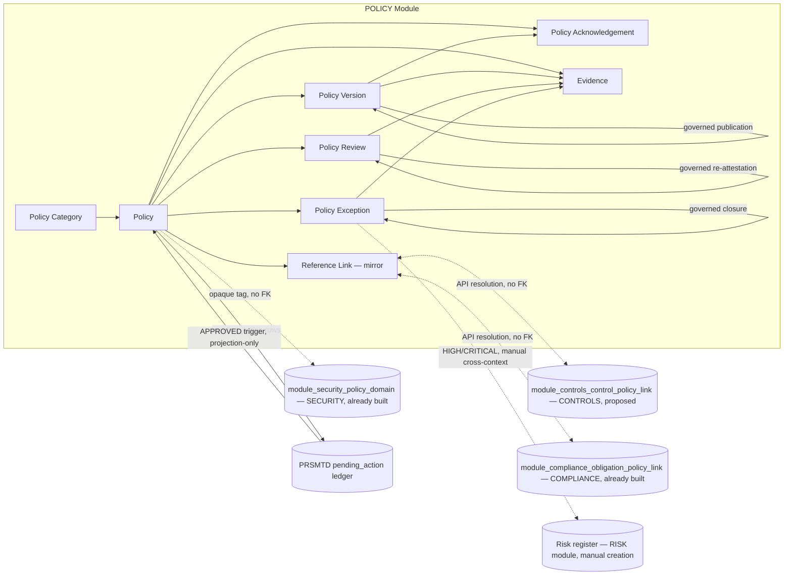
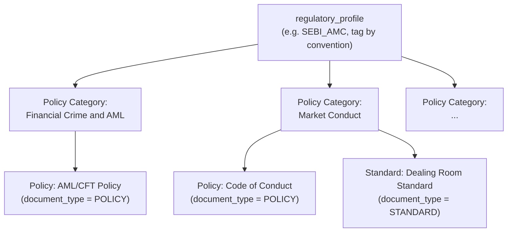
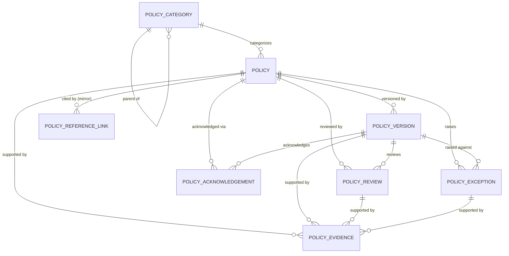
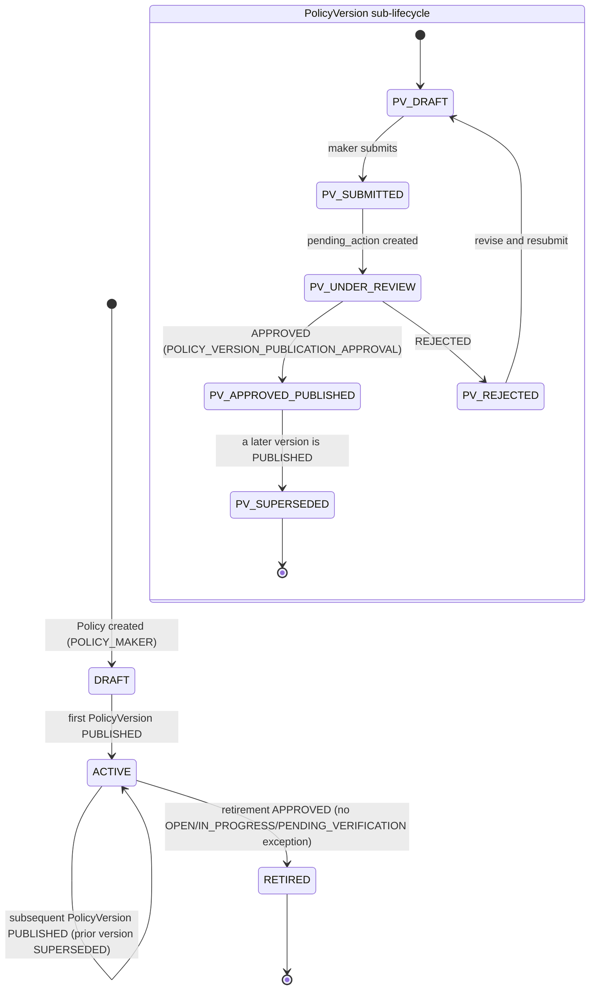
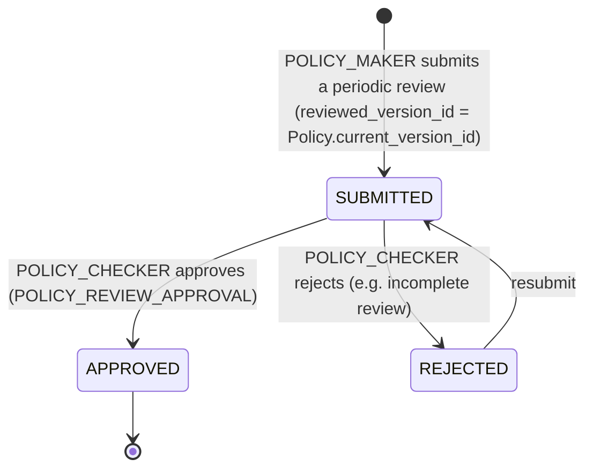
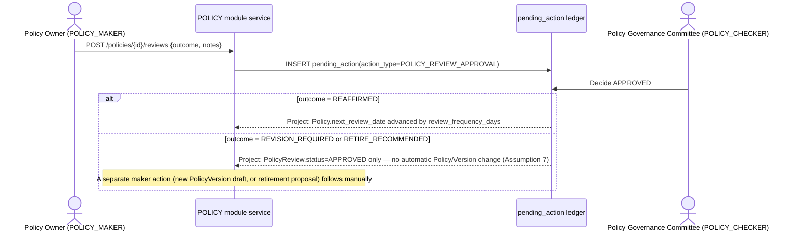
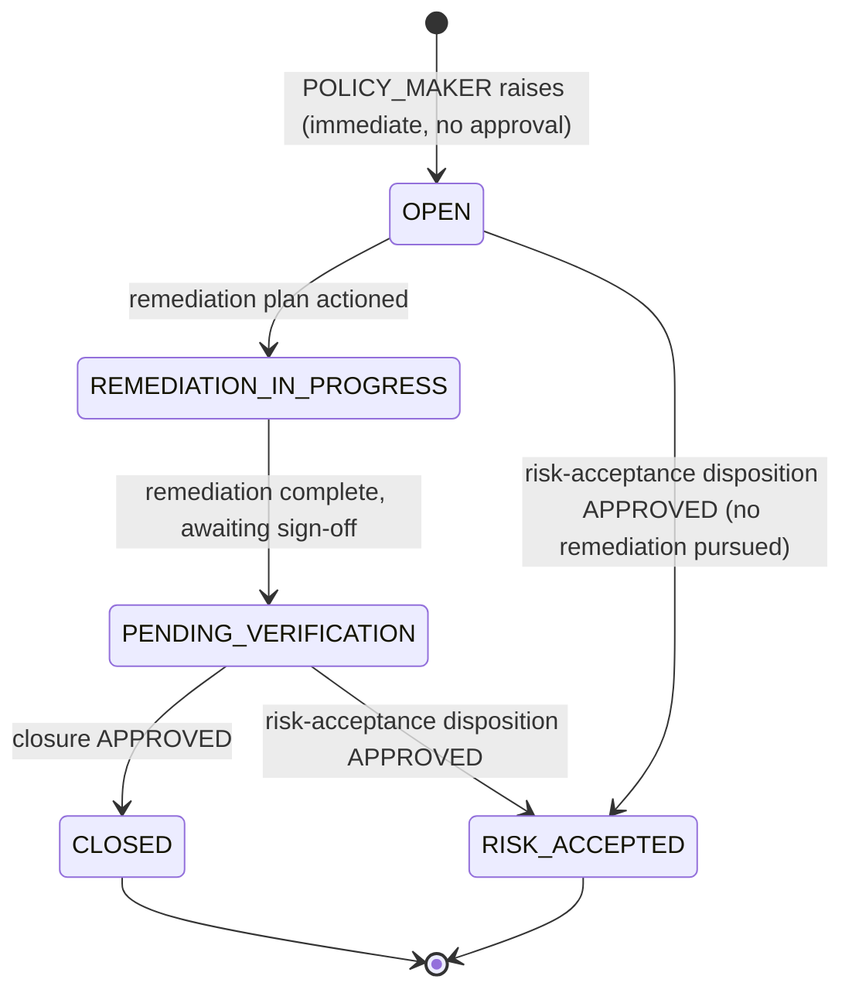

# 23.01 — Policy Management

## Purpose

Defines the Policy Management capability: the enterprise source of truth for governance
Policies, Standards, Procedures, and Guidelines, their governed authoring/review/approval/
publication lifecycle, versioning, periodic re-attestation, employee acknowledgement, and
policy exceptions, for a SEBI-regulated Mutual Fund AMC — built entirely on PRSMTD's existing
multi-tenant, governance, RBAC, and audit substrate. This is the seventh authoritative,
implementation-ready specification in this repository. It activates the `POLICY` bounded
context reserved by
[`04-domain-model/01-enterprise-domain-model.md`](../04-domain-model/01-enterprise-domain-model.md#policy-reserved)
(Open Host Service to `CONTROLS` and `COMPLIANCE`), closes the long-standing forward
references named by `12-controls`, `11-compliance`'s "Integration with Future Policy
Management," and `09-security`'s `SecurityPolicyDomain` taxonomy — without modifying any of
the three.

## Scope

**In scope**: the Policy taxonomy (`PolicyCategory`, mirroring the regulatory-profile-seeded
taxonomy shape every prior module establishes); the `Policy` aggregate's governed lifecycle
(draft → submit → review → approve → publish → retire, via PRSMTD's `pending_action` ledger);
policy versioning (`PolicyVersion`, an append-only, immutable-once-published child entity);
periodic policy review / re-attestation of continued validity (`PolicyReview`, distinct from a
content revision); individual employee policy acknowledgement (`PolicyAcknowledgement`);
policy exceptions (`PolicyException`, mirroring `ControlException`/`ComplianceException`'s
immediate-raise/governed-closure shape); policy-to-control mapping (activating `12-controls`'
own Open Host Service relationship to this module, by proposed additive change — see
[Integration with Controls](#integration-with-controls)); policy-to-obligation mapping
(activating `11-compliance`'s already-built reservation, with **no** additive change required
— see [Integration with Compliance](#integration-with-compliance)); policy-to-security-policy-
domain tagging (activating `09-security`'s already-built `GET /policy-domains` endpoint, with
**no** additive change required — see [Integration with Security](#integration-with-security));
and this module's full security/authorization/audit/reporting/API surface.

**Out of scope** (forward-referenced, not yet specified):
- The Incident/Issue/CAPA module (`docs/24-incident-issue-capa/`) — a `HIGH`/`CRITICAL`
  `PolicyException`'s remediation is tracked inline in this module until CAPA exists,
  mirroring `12-controls`'/`11-compliance`'s identical treatment of their own exceptions.
- The Audit module's own consumption of this module's register/evidence as audit universe
  input and evidentiary substrate — reserved, not designed (see
  [Integration with Future Audit](#integration-with-future-audit)).
- A platform document/object storage capability — `PolicyVersion.storage_ref` and
  `PolicyEvidence.storage_ref` reuse the identical metadata-plus-opaque-`storage_ref` shape
  every prior evidence-bearing module already established; this is the same platform
  capability gap, not a second one (see [Assumptions](#assumptions), Assumption 5).
- A general-purpose Records Retention Schedule capability, a general-purpose training/
  learning-management capability (this module tracks that a user acknowledged a policy, not a
  broader competency/training curriculum), and Regulatory Reporting as a distinct capability
  (`docs/14-reporting/`) — this spec exposes source data/views only, per the convention every
  prior module used.
- Regulatory profiles other than `SEBI_AMC` — schema is profile-configurable per the pattern
  every prior module established; only `SEBI_AMC` seed content is defined here.

## Business Context

Three frozen specifications each independently named this module as a dependency they do not
themselves own:

- `12-controls` cites "Information Security Policy" as a control family topic (its Control
  Taxonomy, `Information Security` family) but has never reserved a schema-level link to an
  actual policy document — a genuine gap this spec proposes, but does not apply, closing (see
  [Integration with Controls](#integration-with-controls)).
- `11-compliance` reserved `module_compliance_obligation_policy_link`
  (`obligation_id`/`policy_ref_id`, opaque, no FK) and its own initiating
  `POST /obligations/{id}/policy-links` endpoint at authoring time (Session 4), explicitly
  "inert until Policy module ships" — the cleanest of the three integration points this spec
  activates, since `11-compliance` already built exactly the shape needed (see
  [Integration with Compliance](#integration-with-compliance)).
- `09-security` reserved `SecurityPolicyDomain` as "a taxonomy that a future Policy... may tag
  against by convention" and named the future `POLICY` module as an Open Host Service to
  itself in its own "Integration with Future Policy Management" section (see
  [Integration with Security](#integration-with-security)).

Without this module, an AMC's governing policy documents — the Code of Conduct, the AML/CFT
Policy, the Outsourcing Policy, the Information Security Policy, and the other mandatory
policy domains SEBI's Annexures name — exist only as narrative citations inside `12-controls`'
control-family descriptions and `11-compliance`'s obligation-category taxonomy, never as
governed, versioned, acknowledgeable documents in their own right. This module makes the
governance document itself — Policy, Standard, Procedure, or Guideline — a first-class,
versioned, governed record: who owns it, what it currently says (and every prior version it
once said), who has read and acknowledged it, when it was last reaffirmed as still valid, and
what happens when an AMC needs a temporary, documented exception from it.

`11-compliance`'s own Annexures §2.6.2.1(i) a–q citation (its `ObligationCategory` seed) is
this module's primary regulatory anchor by direct parallel: the same seventeen mandatory
policy domains that document *requires an AMC to satisfy* are, from this module's point of
view, the documents an AMC must *author, publish, and keep current* to satisfy them. This
module is the document-authoring counterpart to `11-compliance`'s obligation-tracking
counterpart — deliberately two independently-owned, same-shaped local taxonomies over the same
regulatory source (see [Assumptions](#assumptions), Assumption 4), not a duplicate of either.

## Regulatory Drivers

Source: [`../reference/Annexures to Master Circular for Mutual Funds as on March 31,
2023_p.pdf`](../reference/Annexures%20to%20Master%20Circular%20for%20Mutual%20Funds%20as%20on%20March%2031%2C%202023_p.pdf)
§2.6.2.1(i) a–q, already extracted and cited by `11-compliance` (re-cited here for a different
purpose — policy authorship rather than obligation tracking — per this session's explicit
instruction not to re-extract material a prior session already grounded precisely); and the
Cyber Security and Cyber Resilience Framework for Mutual Funds AMCs (SEBI/HO/IMD/DF2/CIR/
P/2019/12), cited at scope level only per `12-controls` Assumption 5 (inherited by
`09-security` Assumption, inherited here for the same reason).

| Driver | Source reference | How this spec satisfies it |
|---|---|---|
| AMC shall establish and maintain policies addressing KYC/AML/CFT, Outsourcing, Investor Grievance, Related Party Transactions, Front Running, Conflict of Interest, Employee/Insider Trading, Code of Conduct, Commission/marketing costs, anti-bribery, Fraud Risk Management, Whistleblowing, Information Security & Data Privacy, Gifts & Entertainment, Record Retention, Dealing Room Policy, and disclosure requirements | Annexures §2.6.2.1(i) a–q (mandatory) | Seeded `SEBI_AMC` `PolicyCategory` taxonomy — one category/sub-category per listed policy domain, deliberately parallel to `11-compliance`'s `ObligationCategory` seed; see [Policy Taxonomy](#policy-taxonomy). |
| Formal, versioned information security policy | Cyber Security and Cyber Resilience Framework (scope-level); `09-security`'s own `SecurityPolicyDomain` taxonomy names this as its own unmet gap ("no Policy module exists") | A `Policy` with `document_type = POLICY`, tagged to the relevant `SecurityPolicyDomain` via `security_policy_domain_ref_id` — see [Integration with Security](#integration-with-security). |
| Employee awareness / Code of Conduct sign-off implicit in AML/CFT program attributes and Code of Conduct policy domain | Annexures §2.6.2.1(i)(g), (iii) a–d | `PolicyAcknowledgement` — an individual, per-user, per-version record that a `Policy` was read and understood; see [Policy Acknowledgement](#policy-acknowledgement). |
| Periodic review of governance documents (general GRC best practice; RMS circular's own Board/Trustee review cadence, re-cited for the review-cadence pattern only, not as a policy-specific mandate) | RMS circular Appendix A Part 1 §1; covering letter (already `10-risk`'s primary source, re-cited here only for the periodic-review-cadence pattern) | `PolicyReview` — a governed, periodic re-attestation that a published `Policy` remains current; see [Policy Review and Re-Attestation](#policy-review-and-re-attestation). |
| Maker-checker authorization on policy publication | Best-practice pattern across the Annexures' approval matrices, same as every prior module | Reuses PRSMTD's `pending_action` governance ledger — see [Policy Lifecycle](#policy-lifecycle). |

## Assumptions

1. **Tenant = one AMC.** Same as every prior module's Assumption 1 — this module is entirely
   tenant-plane data.
2. **Regulatory profile is configuration, not schema, and this module does not own the
   profile registry.** `11-compliance`'s `module_compliance_profile` is the authoritative
   registry of valid `regulatory_profile` values (its own Assumption 2). This module's
   `PolicyCategory.regulatory_profile` is a plain string tag expected to align to that
   registry **by convention**, the same non-invasive relationship every reserved link in this
   repository uses — no FK, no change to `11-compliance`.
3. **Users referenced by this module** (`policy_owner_user_id`, `drafted_by`, `reviewer_
   user_id`, `acknowledged_by` via `user_id`, etc.) **are platform/tenant identity records**,
   not module-owned data — same reasoning as every prior module's identical assumption.
4. **`PolicyCategory` and `ObligationCategory` are two independently-owned, same-shaped local
   taxonomies over the same regulatory source, not one shared table.** Both are seeded from
   Annexures §2.6.2.1(i) a–q, since the same seventeen mandatory policy domains define both
   "what an AMC must satisfy" (`ObligationCategory`) and "what document an AMC must author to
   satisfy it" (`PolicyCategory`). This mirrors the established convention that every context
   owns its own local taxonomy row set (`RiskCategory`, `ControlFamily`, `ObligationCategory`
   each already coexist this way) rather than sharing one table across module boundaries —
   consistent with `04-domain-model`'s taxonomy shared-kernel pattern, not a deviation from
   it. No FK or synchronization mechanism exists between the two tables.
5. **This module inherits, not repeats, `12-controls`' object-storage gap.**
   `PolicyVersion.storage_ref` (the published document's own content) and
   `PolicyEvidence.storage_ref` (supporting materials — training certificates, Board approval
   minutes) both use the identical metadata-plus-opaque-`storage_ref`-plus-`content_hash`
   shape `ControlEvidence` established — the same platform capability gap, not a second,
   module-specific one.
6. **`document_type` unifies Policy, Standard, Procedure, and Guideline as one aggregate root
   distinguished by an enum, not four separate aggregate roots.** This session's brief names
   all four as content types this module must be the source of truth for; treating them as
   one governed-lifecycle shape with a `document_type` discriminator avoids the premature
   decomposition `04-domain-model` explicitly warns against for closely-related concepts
   (the same reasoning that kept Incident/Issue/CAPA as one reserved context), and mirrors
   how `11-compliance` treated "Regulatory Obligation" and "Compliance Requirement" as one
   `Obligation` aggregate root rather than two (its own Assumption 4).
7. **A periodic `PolicyReview` (re-attestation of continued validity) is a distinct governed
   entity from a `PolicyVersion` (a content revision).** A `REAFFIRMED` review outcome does
   not itself create a new `PolicyVersion` row — only a maker's deliberate, separate
   new-version draft does. This mirrors `11-compliance` Assumption 8 exactly (a governed
   approval never auto-creates rows in a different aggregate than the one it targets) — a
   `pending_action` projection trigger updating an unrelated aggregate's rows would be a
   materially different, riskier mechanism than every other governed transition in this
   repository uses.
8. **`PolicyAcknowledgement` is intentionally not routed through `pending_action`.** It is an
   individual, factual record of a user's own action (having read and understood a specific
   published `PolicyVersion`), not a checker-governed decision — the same "not every mutation
   needs governance" precedent `10-risk`'s ungoverned `RiskAppetite` edits, `12-controls`'
   ungoverned `ControlFamily` taxonomy edits, and `11-compliance`'s ungoverned
   `ComplianceCalendarEntry` edits already established three times.
9. **Any authenticated tenant user may be assigned this module's `VIEWER` role for the sole
   purpose of reading published policies and recording their own acknowledgement.** This is a
   tenant-onboarding role-assignment convention — every employee holds at least `POLICY_
   VIEWER` — not a new RBAC mechanism; PRSMTD's existing three-tier module role model (system.
   md §8) already supports assigning `VIEWER` broadly. See
   [Authorization Model](#authorization-model).
10. **`module_controls_control_policy_link` does not yet exist on the `CONTROLS` side.**
    Unlike `11-compliance`'s obligation-policy link (already built), `12-controls` has no
    reserved policy link at all (verified: no `policy_link`/`PolicyLink`/`governing_policy`
    column or table anywhere in `12-controls/01-*.md`). This spec proposes, but does not
    apply, exactly such an additive change — see
    [Integration with Controls](#integration-with-controls), mirroring precisely how
    `11-compliance` itself once proposed (and a later session applied) the `CONTROLS`-side
    obligation-link endpoint.
11. **`module_compliance_obligation_policy_link` and its initiating
    `POST /obligations/{id}/policy-links` endpoint already exist on the `COMPLIANCE` side**
    (built when `11-compliance` was authored, Session 4, explicitly reserved "inert until a
    Policy module ships"). This spec activates that reservation directly — **no additive
    change to `11-compliance/01-*.md` is required**, the cleanest of this module's three
    integration points.
12. **Policy → `SecurityPolicyDomain` is a lightweight, non-governed opaque tag, not a full
    mirror-registration pair.** `SecurityPolicyDomain` is plain, non-lifecycle reference data
    (system.md §8-style taxonomy, no `pending_action` governance of its own — `09-security`
    Assumption 11), so this module resolves the tag via `09-security`'s already-built
    `GET /policy-domains` endpoint rather than the heavier opaque-reference-plus-local-mirror
    pattern every governed-lifecycle cross-context reference in this repository otherwise
    uses. **No additive change to `09-security/01-*.md` is required.**
13. **Maker and Checker are always distinct individuals** — enforced by PRSMTD's
    platform-level `approved_by <> created_by` constraint on `pending_action`, the same
    mechanism every prior module relies on; no bespoke SoD mechanism is designed here.
14. **A `PolicyVersion`'s governed publication approval is the single governance event that
    both approves its content and makes it effective.** There is no separate "approve
    content" step followed by a distinct "publish" step — mirroring the "governed lifecycle
    with append-only history" shared-kernel pattern exactly (`RiskAssessment`/`ControlTest`/
    `ComplianceAssessment` each already use one child-entity approval as the sole activating
    event for their respective aggregate root).

## Dependencies

- PRSMTD `docs/authoritative/system.md` §3 (Governance model, GOV-07), §4.1 (Observability &
  Deterministic Trace Contract), §7 (Data model & RLS enforcement), §8 (RBAC model), §9 +
  §5a–§5c (Module framework, ownership guards OWN-03/04/07/08/09), §10 (Audit and
  compliance), §21 (Authentication Surface Ownership) — all reused as-is, no PRSMTD changes
  required by this spec.
- [`04-domain-model/01-enterprise-domain-model.md`](../04-domain-model/01-enterprise-domain-model.md)
  — **frozen input, not modified by this spec.** Follows its Common Domain Patterns shared
  kernel exactly (regulatory-profile-seeded taxonomy, governed lifecycle with append-only
  history, immediate-raise/governed-closure exception, opaque cross-context reference with
  local mirror, human-readable code sequence, descriptive `source` classification), and
  confirms — without editing — its `POLICY` [context-map entry](../04-domain-model/01-enterprise-domain-model.md#policy-reserved)
  (Open Host Service to `CONTROLS` and `COMPLIANCE`; anticipated entities `Policy`,
  `PolicyCategory`) and its Dependency Rule 4 ("`COMPLIANCE` and `POLICY` are expected to be
  pure providers, like `CONTROLS`"). This spec **proposes, but does not apply**, the same
  status-label amendment (`POLICY (reserved)` → `POLICY (authored)`) `09-security` proposed
  for its own onboarding — see [Future Extension Points](#future-extension-points).
- [`12-controls/01-controls-management.md`](../12-controls/01-controls-management.md) —
  **not modified by this spec.** Its Control Taxonomy already names "Information Security
  Policy" as a control-family topic without a schema-level link; this spec's proposed
  additive `module_controls_control_policy_link` table and `POST /controls/{id}/policy-links`
  endpoint are documented here only, not applied.
- [`11-compliance/01-compliance-management.md`](../11-compliance/01-compliance-management.md)
  — **not modified by this spec.** Its `module_compliance_obligation_policy_link` table and
  `POST /obligations/{id}/policy-links` endpoint (both already built, Session 4) are the
  reservation this module activates directly.
- [`09-security/01-security-management.md`](../09-security/01-security-management.md) — **not
  modified by this spec.** Its `SecurityPolicyDomain` reference table and `GET
  /policy-domains` endpoint (both already built, Session 6) are the reservation this module
  tags against directly.
- [`../reference/Annexures to Master Circular for Mutual Funds as on March 31,
  2023_p.pdf`](../reference/Annexures%20to%20Master%20Circular%20for%20Mutual%20Funds%20as%20on%20March%2031%2C%202023_p.pdf)
  §2.6.2.1(i) a–q — re-cited from `11-compliance`, not re-extracted this session.
- `docs/05-modules/README.md` — confirmed index-only (Session 9); no separate per-module
  `05-modules/`/`06-data-model/`/`08-api/` document is expected for this module, matching
  every prior module's own precedent of being the canonical, self-contained source for its
  own data/API/security content.
- `docs/22-traceability/01-master-traceability-matrix.md`,
  `docs/22-traceability/02-compliance-coverage-assessment.md`, `docs/roadmap.md` — updated
  incrementally by this session, per `CLAUDE.md`'s Traceability Rules.

## Architecture

The Policy Management capability is one PRSMTD module: **module code `POLICY`**, the exact
code `CLAUDE.md`'s own Naming Standards section already names as the expected value. It
follows the generic module framework exactly as every prior module does (system.md
§9/§5a–§5c):

- `moduleId`: a stable UUID minted at implementation time, not fixed by this specification.
- Table prefix: `module_policy_*` (OWN-03 schema ownership).
- Route namespace: `/modules/POLICY` (§5b4).
- API namespace: `/api/v1/modules/policy/**`, controllers in `com.prsbnjs.modules.policy`
  (OWN-07).
- Module role types: `MAKER`, `CHECKER`, `VIEWER` only — the closed set (system.md §8).
  Domain personas map onto these three; see [Authorization Model](#authorization-model).
- `dependencies: [SECURITY]`. Unlike this module's own forward reference from `SECURITY`
  (a conceptual note in a frozen spec, not yet resolvable), this dependency is **immediately
  active, not proposed**: `09-security`'s `GET /policy-domains` endpoint already exists in the
  frozen spec (Session 6), so this module can declare and exercise the dependency the moment
  it is authored — the same zero-additive-change activation `13-audit` achieved toward
  `RISK`/`CONTROLS`/`COMPLIANCE` at its own authoring, because every context it needed to read
  already existed fully-built. `POLICY` declares **no** dependency on `CONTROLS` or
  `COMPLIANCE` — per `04-domain-model` Dependency Rule 4, `POLICY` is (like `COMPLIANCE`) a
  pure provider toward both: **`CONTROLS`' manifest would gain `dependencies: [POLICY]`**
  once the proposed control-policy link is built (proposed, not applied here — see
  [Integration with Controls](#integration-with-controls)), and **`COMPLIANCE`'s manifest
  would gain `dependencies: [POLICY]`** once its already-built reservation is wired through
  (`11-compliance`'s own Architecture section already anticipated exactly this note — see
  [Integration with Compliance](#integration-with-compliance)).
- No platform-plane tables, no platform-plane governance actions — every governed action is
  tenant-plane (`app.plane = 'tenant'`).
- Tenant isolation, GUC binding, and session-setter usage are inherited unmodified from
  `TenantAwareDataSource` (system.md §7) — this module issues no direct `SET`/`set_config`
  calls.
- **Cross-module access is API-mediated only (OWN-08/OWN-09).** `POLICY` never reads
  `CONTROLS`', `COMPLIANCE`'s, or `SECURITY`'s tables directly; none of the three reads
  `POLICY`'s tables directly. Every cross-context reference is either a manual opaque tag
  (`Policy.security_policy_domain_ref_id`) or an opaque-reference-plus-mirror pair resolved
  through `.api`/`.client` packages, exactly as every prior cross-context integration in this
  repository already established.



## Domain Model

**Bounded context**: Policy Management. Owns the governance-document register and its
governed lifecycle exclusively; confirms `04-domain-model`'s anticipated entity set (`Policy`,
`PolicyCategory`) exactly, extended here with the concrete child entities that entity set
implied but did not itself enumerate. Treats `CONTROLS` and `COMPLIANCE` as downstream
customers of the facts it supplies (Open Host Service, matching `COMPLIANCE`'s own identical
relationship to `CONTROLS`) and treats `SECURITY` as its own upstream supplier for a single
taxonomy tag (the one relationship in this spec where `POLICY` is the customer) — see
[Architecture](#architecture) and the Integration sections below.

**Ubiquitous language** (extends, does not redefine, `04-domain-model`'s canonical glossary —
per that document's closing rule, "a term means one thing repository-wide"; every term below
is new at this layer or refines an already-reserved definition without contradicting it):

| Term | Definition |
|---|---|
| Policy | A governance document — a Policy, Standard, Procedure, or Guideline (`document_type`) — an AMC authors, versions, publishes, and keeps current. The single aggregate root for all four document types (Assumption 6). Owner, category, current version, status, and acknowledgement/review cadence configuration. |
| Policy Category | A named category of governance document, mirroring `ObligationCategory`'s taxonomy shape over the same seventeen mandatory Annexures policy domains — an independently-owned, parallel local taxonomy (Assumption 4). |
| Policy Version | An append-only, immutable-once-`PUBLISHED` revision of a Policy's actual content — the governed child entity whose publication approval is the same governance event that activates/updates the parent Policy, mirroring `RiskAssessment`/`ControlTest`/`ComplianceAssessment` exactly. |
| Policy Review | A governed, periodic determination that a currently `PUBLISHED` Policy Version remains valid, requires revision, or should be retired — distinct from a Policy Version's own content-approval event (Assumption 7). |
| Policy Acknowledgement | An individual, per-user, per-version, ungoverned record that a specific tenant user has read and understood a published Policy Version (Assumption 8). |
| Policy Exception | A documented, temporary deviation from a Policy's stated requirement, tracked to a governed closure or formal risk-acceptance disposition — the same shape as `ControlException`/`ComplianceException`. |
| Policy Evidence | A metadata record (integrity hash + opaque storage pointer) supporting a Policy, Policy Version, Policy Review, or Policy Exception — the same shape as `ControlEvidence`/`ComplianceEvidence`/`SecurityEvidence`. |
| Policy Reference Link | A local, opaque **mirror** of a `CONTROLS`- or `COMPLIANCE`-module policy association, populated via an inbound API call from either module, never a direct FK into either module's schema. |

**Aggregates, entities, and invariants**:

- **Policy** (aggregate root) — Cannot move past `DRAFT` to `ACTIVE` without at least one
  `PUBLISHED` `PolicyVersion`. Cannot be `RETIRED` while it has a `PolicyException` in status
  `OPEN`, `REMEDIATION_IN_PROGRESS`, or `PENDING_VERIFICATION` (must be `CLOSED` or
  `RISK_ACCEPTED` first) — the same "no-retirement-while-active-work-exists" shape every prior
  governed-lifecycle root enforces. `current_version_id` is set only by a `PolicyVersion`'s
  own governed publication approval, never a direct maker edit (Assumption 14).
- **PolicyVersion** (entity, owned by Policy) — Immutable once `PUBLISHED`; append-only
  history, mirroring `RiskAssessment`/`ControlTest`/`ComplianceAssessment` exactly. A newly
  `PUBLISHED` version automatically marks the previously `PUBLISHED` version (if any)
  `SUPERSEDED` in the same projection (system trigger, not application code).
- **PolicyReview** (entity, owned by Policy) — Governed via its own approval; a `REAFFIRMED`
  outcome advances `Policy.next_review_date` on approval, a `REVISION_REQUIRED` or
  `RETIRE_RECOMMENDED` outcome records the recommendation only — neither auto-creates a new
  `PolicyVersion` row nor auto-retires the Policy (Assumption 7); both remain separate,
  deliberate maker actions.
- **PolicyAcknowledgement** (entity, owned by Policy, references exactly one PolicyVersion) —
  Append-only; a new row per acknowledging event, never an edit or a "withdrawal" (Assumption
  8). Not `pending_action`-governed.
- **PolicyException** (entity, owned by Policy) — Raised immediately by a `POLICY_MAKER` (no
  governance required to open); closure or `RISK_ACCEPTED` disposition requires `POLICY_
  CHECKER` approval — identical shape to `ControlException`/`ComplianceException`.
- **PolicyEvidence** (entity, attached to exactly one of Policy, PolicyVersion, PolicyReview,
  or PolicyException) — Immutable metadata once uploaded; supersession creates a new row,
  never an edit — same convention as `ControlEvidence`/`ComplianceEvidence`.
- **PolicyCategory** (reference data) — Two-level hierarchy (category → sub-category),
  regulatory-profile-seeded, tenant-editable — same shape as `RiskCategory`/`ControlFamily`/
  `ObligationCategory`.
- **PolicyReferenceLink** (entity, owned by Policy) — A local, opaque **mirror** of a
  `CONTROLS`- or `COMPLIANCE`-module policy association, populated via an inbound API call
  from either module, never a direct FK into either module's schema, disambiguated by
  `source_module_code`/`source_entity_type` — a single polymorphic table rather than one
  mirror table per source module, chosen specifically so a future third or fourth citing
  context (e.g. a future `BUSINESS CONTINUITY` module citing its own governing Policy) needs
  only a new enum value, not a new table or migration — the concrete mechanism for this
  session's "first-time-complete database design, minimal future Liquibase churn" objective.
  See [Integration with Controls](#integration-with-controls) and
  [Integration with Compliance](#integration-with-compliance).

## Policy Taxonomy

Reuses the shared-kernel taxonomy shape (`04-domain-model`, Common Domain Patterns), seeded
in deliberate parallel to `11-compliance`'s `ObligationCategory` (Assumption 4), grounded in
the same Annexures §2.6.2.1(i) a–q source `11-compliance` already cites:



**`module_policy_category` seed** (all tagged `regulatory_profile = SEBI_AMC`), mirroring
`11-compliance`'s `module_compliance_obligation_category` seed category-for-category (see that
document's [Regulatory Framework Hierarchy](../11-compliance/01-compliance-management.md#regulatory-framework-hierarchy)
table for the full sub-category breakdown, re-cited here as the parallel structure this
module's own taxonomy deliberately mirrors, not restated in full to avoid duplication):

| Category | Representative governing document | Source |
|---|---|---|
| Financial Crime & AML | AML/CFT Policy | §2.6.2.1(i)(a), (iii) a–d |
| Investor Protection & Grievance | Investor Grievance Redressal Policy | §2.6.2.1(i)(c), (ii)(e) |
| Market Conduct | Code of Conduct; Insider Trading Policy; Conflict of Interest Policy | §2.6.2.1(i)(e)–(h), (ii)(d), (ii)(f) |
| Outsourcing & Related-Party Oversight | Outsourcing Policy; Related Party Transaction Policy | §2.6.2.1(i)(b), (d) |
| Financial Integrity & Fraud | Anti-Bribery Policy; Fraud Risk Management Policy; Whistleblower Policy | §2.6.2.1(i)(i)–(k) |
| Information Governance | Information Security Policy; Gifts & Entertainment Policy; Record Retention Policy; Dealing Room Policy | §2.6.2.1(i)(m)–(p) |
| Regulatory Reporting & Disclosure | Marketing Material Review Procedure; Disclosure Standard | §2.6.2.1(i)(q), (ii)(a)–(c), (e) |
| Licensing & Registration | Licensing & Registration Renewal Procedure | §2.6.2.1(ii)(g) |

Sub-categories use the same self-referencing `parent_category_id` mechanism every prior
taxonomy uses; shown above only where illustrative. Not every `PolicyCategory` row requires a
`Policy` row at MVP seeding — the taxonomy is seeded ahead of content authorship, the same
"seed the shape, not the content" convention `11-compliance` used for `ObligationCategory`.

## Functional Requirements

| ID | Requirement | Regulatory tie |
|---|---|---|
| FR-01 | The system shall provide a configurable, two-level Policy Category taxonomy, seeded per regulatory profile, deliberately parallel to `COMPLIANCE`'s `ObligationCategory` taxonomy. | Annexures §2.6.2.1(i) |
| FR-02 | `POLICY_MAKER` users shall create and edit Policies while in `DRAFT` status, and shall draft Policy Versions against any Policy they own. | — |
| FR-03 | Every Policy shall carry a mandatory `document_type` (`POLICY`/`STANDARD`/`PROCEDURE`/`GUIDELINE`) and be linked to exactly one Policy Category. | Session brief: Policies, Standards, Procedures, Guidelines as one system of truth |
| FR-04 | A Policy shall not reach `ACTIVE` status without at least one `PUBLISHED` Policy Version. | — |
| FR-05 | The maker and the approver of any governed action on a Policy, Policy Version, Policy Review, or Policy Exception shall never be the same individual (platform `approved_by <> created_by` constraint). | Independent policy sign-off, mirrors every prior module's identical FR |
| FR-06 | A Policy Version's publication approval shall be the sole governance event that both approves its content and marks it effective, superseding the prior `PUBLISHED` version (if any) in the same projection. | — |
| FR-07 | The system shall support Policy Reviews producing an outcome (`REAFFIRMED`/`REVISION_REQUIRED`/`RETIRE_RECOMMENDED`), each independently subject to `POLICY_CHECKER` approval, without auto-creating a new Policy Version or auto-retiring the Policy. | — |
| FR-08 | The system shall support Policy Exceptions, raised immediately by a maker without prior approval, with governed closure (`CLOSED` or `RISK_ACCEPTED`) requiring checker approval. | — |
| FR-09 | A Policy shall not be retirable while any Exception remains `OPEN`, `REMEDIATION_IN_PROGRESS`, or `PENDING_VERIFICATION`. | — |
| FR-10 | The system shall track `next_review_date` per Policy and surface overdue reviews. | — |
| FR-11 | The system shall support Policy Acknowledgement: any tenant user holding `POLICY_ACKNOWLEDGE` may record, at any time, that they have read and understood a specific `PUBLISHED` Policy Version; each acknowledgement is an immutable, append-only, ungoverned record. | Annexures §2.6.2.1(i)(g), (iii) a–d — Code of Conduct / AML awareness pattern |
| FR-12 | A Policy shall expose a configurable acknowledgement requirement (`requires_acknowledgement`, `acknowledgement_frequency`), and the system shall support an acknowledgement-completion report per Policy Version. | — |
| FR-13 | Evidence shall attach to exactly one of a Policy, a Policy Version, a Policy Review, or a Policy Exception, and shall record an integrity hash of the underlying artifact. | — |
| FR-14 | A Policy shall expose a cross-module reference-resolution API so that `COMPLIANCE`'s existing opaque `module_compliance_obligation_policy_link.policy_ref_id` resolves to a real Policy record without a direct FK. | Activates `11-compliance` FR-13 |
| FR-15 | A Policy shall support zero or more opaque, non-FK inbound reference links from `CONTROLS` and `COMPLIANCE` (`module_policy_reference_link`), the `CONTROLS` side inert until that module's proposed policy-link endpoint ships (see [Integration with Controls](#integration-with-controls)). | — |
| FR-16 | A Policy shall support an optional opaque, non-FK tag to a `SECURITY`-module `SecurityPolicyDomain` (`security_policy_domain_ref_id`), resolved read-only via `SECURITY`'s existing `GET /policy-domains` endpoint. | Activates `09-security`'s reserved taxonomy tag |
| FR-17 | Visibility shall be role-scoped: `POLICY_VIEWER` — full tenant register, read-only, plus acknowledgement; `POLICY_MAKER` — full read, edit own drafts/versions/reviews/exceptions, plus acknowledgement; `POLICY_CHECKER` — full read, plus all pending approvals across the tenant, plus acknowledgement. | — |
| FR-18 | The independent policy sign-off function shall be satisfiable purely by role assignment (Chief Compliance Officer, Legal Head, Policy Governance Committee member, or an external legal consultant holding `POLICY_CHECKER`) — no code change required per assignment choice. | Mirrors every prior module's identical FR |
| FR-19 | A `HIGH`/`CRITICAL` Policy Exception may be used to create or link a Risk register entry, resolved by manual cross-context action, not a synchronous service call, recorded in `PolicyException.linked_risk_id` (opaque, nullable). | Mirrors `11-compliance`/`12-controls`'s identical exception-to-risk pattern |
| FR-20 | The system shall expose a policy register report, an acknowledgement-completion report, a review calendar (upcoming/overdue), and an exception register/aging report. | Annexures §2.6.2.1(i)/(iii) |
| FR-21 | Every governed state transition shall be captured in the platform audit trail using canonical, non-aliased `action_type` values. | system.md §10 |

## Non-Functional Requirements

| Category | Requirement |
|---|---|
| Multi-tenancy | Full tenant isolation via PRSMTD RLS (system.md §7); zero platform-plane data in this module. |
| Performance | Policy register list/filter queries shall return p95 < 500ms for tenants with up to 2,000 active Policy records; acknowledgement-completion queries (potentially one row per employee per version) shall paginate and shall not require a full-table scan for a completion-percentage summary. |
| Scalability | Schema and query patterns must not assume a ceiling on tenant count, per-tenant Policy volume, or per-tenant employee-acknowledgement volume beyond the platform's general multi-tenant design targets. |
| Availability | Inherits platform availability targets (`18-deployment`, not yet authored) — no module-specific SLA is defined here. |
| Auditability | Every governed transition is immutable and traceable per system.md §4.1 T1–T7; no destructive updates on Policy Version/Review/Exception/Evidence/Acknowledgement history. |
| Configurability | Policy category taxonomy is tenant-editable reference data, not hardcoded — required for the multi-regulatory-profile vision in `CLAUDE.md`. |
| Data retention | No physical deletion of governed records; a general cross-module retention-schedule capability remains unspecified, the same carried gap `11-compliance` Assumption 10 already names. |
| Data integrity | Evidence and Policy Version content records carry a content hash computed at upload/publication time; binary storage integrity itself is out of scope pending the object-storage capability gap (Assumption 5). |
| Localization | Out of scope for this spec. |

## Canonical Data Model

All tables use module prefix `module_policy_`, live in the tenant plane, and carry the
standard PRSMTD columns: `id uuid PRIMARY KEY DEFAULT gen_random_uuid()`, `tenant_id uuid NOT
NULL` (RLS-scoped per system.md §7), `created_at timestamptz NOT NULL DEFAULT now()`,
`created_by uuid NOT NULL`. Lifecycle uses closed-set `status` columns, never soft-delete
(`deleted_at`), matching PRSMTD convention and every prior ERM module's own data model. This
section is the canonical source for the Policy schema — no separate `06-data-model/` document
duplicates it. Every table below follows the shared-kernel shape `04-domain-model` already
established (see [Dependencies](#dependencies)), chosen specifically so this module's first
schema draft needs no structural rework once real cross-context queries are written against
it.

### Reference / configuration tables

| Table | Key columns | Notes |
|---|---|---|
| `module_policy_category` | `code`, `name`, `parent_category_id` (self-FK, nullable), `regulatory_profile`, `status` | Two-level hierarchy. Seeded with the `SEBI_AMC` profile, deliberately parallel to `11-compliance`'s `module_compliance_obligation_category` — see [Policy Taxonomy](#policy-taxonomy). |
| `module_policy_code_sequence` | `tenant_id`, `entity_type` (composite PK: `POLICY`, `EXCEPTION`), `last_value int` | Backs human-readable `policy_code` (e.g. `PLC-2026-000012`) and `exception_code` generation from one shared table, mirroring `11-compliance`'s/`12-controls`' single-table-multi-entity-type sequence shape. |

### Core tables

| Table | Key columns | Notes |
|---|---|---|
| `module_policy` | `policy_code`, `category_id` (FK), `subcategory_id` (FK, nullable), `title`, `document_type`, `purpose_summary`, `policy_owner_user_id`, `status`, `current_version_id` (FK, nullable), `effective_from` (nullable), `next_review_date` (nullable), `review_frequency_days` (nullable), `requires_acknowledgement`, `acknowledgement_frequency` (nullable), `source`, `security_policy_domain_ref_id` (opaque uuid, nullable, no FK), `updated_at` | The aggregate root. `document_type` ∈ `POLICY, STANDARD, PROCEDURE, GUIDELINE` (Assumption 6). `status` ∈ `DRAFT, ACTIVE, RETIRED`. `acknowledgement_frequency` ∈ `ONE_TIME, ANNUAL, ON_UPDATE`, meaningful only when `requires_acknowledgement = true`. `source` ∈ `MANUAL, REGULATORY_REQUIREMENT, AUDIT_FINDING, COMPLIANCE_GAP, CONTROL_GAP` (mirrors `Risk.source`/`Control.source`/`Obligation.source`'s descriptive-classification pattern; the latter two values name the same two most common real-world reasons a new Policy gets authored that `ComplianceException.category`/`ControlException` already track from the requesting side). |
| `module_policy_version` | `policy_id` (FK), `version_number int`, `storage_ref`, `content_hash`, `summary_of_changes`, `drafted_by`, `drafted_at`, `status`, `reviewed_by` (nullable), `review_notes` (nullable), `approved_by` (nullable), `approved_at` (nullable), `published_at` (nullable), `effective_date` (nullable), `superseded_at` (nullable), `superseded_by_version_id` (self-FK, nullable), `updated_at` | Append-only history; immutable once `PUBLISHED` (Assumption 14). `status` ∈ `DRAFT, SUBMITTED, UNDER_REVIEW, APPROVED, PUBLISHED, SUPERSEDED, REJECTED`. `version_number` is monotonic per `policy_id`, assigned at `DRAFT` creation. |
| `module_policy_review` | `policy_id` (FK), `reviewed_version_id` (FK), `review_date`, `reviewer_user_id`, `outcome`, `notes`, `status`, `approved_by` (nullable), `approved_at` (nullable) | `outcome` ∈ `REAFFIRMED, REVISION_REQUIRED, RETIRE_RECOMMENDED`. `status` ∈ `SUBMITTED, APPROVED, REJECTED`. Governed (Assumption 7), distinct from `module_policy_version`'s own governance. |
| `module_policy_acknowledgement` | `policy_id` (FK), `policy_version_id` (FK), `user_id`, `acknowledged_at`, `acknowledgement_statement_hash` | Append-only; no `status` column — a row's existence is the acknowledgement (Assumption 8). Not `pending_action`-governed. One row per user per version per acknowledging event (a user may re-acknowledge a still-current version, e.g. an annual re-attestation cadence — each is its own row, never an update). |
| `module_policy_exception` | `exception_code`, `policy_id` (FK), `policy_version_id` (FK, nullable), `category`, `description`, `identified_date`, `identified_by`, `severity`, `remediation_plan`, `remediation_owner_user_id`, `target_closure_date`, `status`, `closure_justification` (nullable), `linked_risk_id` (opaque uuid, nullable, no FK), `approved_by` (nullable), `approved_at` (nullable), `updated_at` | `category` ∈ `SCOPE_DEVIATION, TEMPORARY_WAIVER, NON_APPLICABILITY, OTHER`. `severity` ∈ `LOW, MEDIUM, HIGH, CRITICAL`. `status` ∈ `OPEN, REMEDIATION_IN_PROGRESS, PENDING_VERIFICATION, CLOSED, RISK_ACCEPTED`. `linked_risk_id` is **opaque, no FK — resolved via `RISK`'s `.api`/`.client` package**, symmetric to `ControlException.linked_risk_id`/`ComplianceException.linked_risk_id`. |
| `module_policy_evidence` | `policy_id` (FK, nullable), `policy_version_id` (FK, nullable), `review_id` (FK, nullable), `exception_id` (FK, nullable), `evidence_type`, `title`, `description`, `storage_ref`, `file_name`, `mime_type`, `file_size_bytes`, `content_hash`, `collected_at`, `collected_by`, `uploaded_at`, `uploaded_by`, `status` | Exactly one of `policy_id`/`policy_version_id`/`review_id`/`exception_id` is non-null (application-layer invariant, the same four-way rule `ComplianceEvidence` established). `evidence_type` ∈ `DOCUMENT, TRAINING_CERTIFICATE, BOARD_APPROVAL_MINUTES, SYSTEM_EXTRACT, OTHER`. `status` ∈ `ACTIVE, SUPERSEDED, ARCHIVED`. `storage_ref` is opaque per Assumption 5. |
| `module_policy_reference_link` | `policy_id` (FK), `source_module_code`, `source_entity_type`, `source_entity_ref_id` (opaque uuid, no FK), `linked_at`, `linked_by`, `status` | Local **mirror** of an inbound `CONTROLS`/`COMPLIANCE` policy citation, populated via an inbound API call from the citing module — see [Integration with Controls](#integration-with-controls)/[Integration with Compliance](#integration-with-compliance). `source_module_code` ∈ `CONTROLS, COMPLIANCE` (open for future values, e.g. a future `BUSINESS CONTINUITY` citation, without a schema change — see Domain Model). `source_entity_type` ∈ `CONTROL, OBLIGATION`. `status` ∈ `ACTIVE, REMOVED`. |

No bespoke audit table is defined — audit trail is the platform's `audit_log` per system.md
§10, reused as-is, exactly as every prior module does.

### ER diagram



## Policy Lifecycle

All governed transitions reuse PRSMTD's `pending_action` ledger and the Governance Ledger +
Projection pattern (system.md §3, §9), exactly as every prior module does: a `POLICY_MAKER`
proposes, a `POLICY_CHECKER` decides, and a database trigger — never application code —
projects `APPROVED` decisions into the Policy/PolicyVersion/PolicyReview/PolicyException
aggregate's state. GOV-07 dedup applies per action type, scoped to its logical target.

| `action_type` | Logical target (GOV-07 key) | Effect on APPROVED |
|---|---|---|
| `POLICY_VERSION_PUBLICATION_APPROVAL` | `policy_version_id` | `PolicyVersion.status = PUBLISHED`, `published_at` set; the prior `PUBLISHED` version (if any) becomes `SUPERSEDED`; `Policy.current_version_id`, `Policy.effective_from` updated; `Policy.status` advances `DRAFT → ACTIVE`. |
| `POLICY_REVIEW_APPROVAL` | `review_id` | `PolicyReview.status = APPROVED`; if `outcome = REAFFIRMED`, `Policy.next_review_date` advances by `review_frequency_days`. `REVISION_REQUIRED`/`RETIRE_RECOMMENDED` record the recommendation only (Assumption 7). |
| `POLICY_EXCEPTION_CLOSURE_APPROVAL` | `exception_id` | `PolicyException.status = CLOSED` or `RISK_ACCEPTED` (per the proposed disposition). |
| `POLICY_RETIREMENT_APPROVAL` | `policy_id` | `Policy.status = RETIRED`. |

Only four action types are needed — as with every prior module, there is no separate "approve
the Policy itself" action: the first `PolicyVersion`'s publication approval **is** the
governance event that activates the Policy (Assumption 14).

### Policy / Policy Version lifecycle state machine



### Maker-checker sequence — policy version publication approval

```mermaid
sequenceDiagram
    actor Owner as Policy Owner (POLICY_MAKER)
    participant App as POLICY module service
    participant Ledger as pending_action ledger
    actor CCO as Policy Governance Committee (POLICY_CHECKER)
    participant Trig as DB projection trigger

    Owner->>App: Submit PolicyVersion (DRAFT -> SUBMITTED)
    App->>Ledger: INSERT pending_action(action_type=POLICY_VERSION_PUBLICATION_APPROVAL, status=PENDING)
    Note over Ledger: GOV-07 dedup on policy_version_id
    CCO->>App: Review pending version
    CCO->>Ledger: Decide APPROVED (approved_by != created_by enforced)
    Ledger->>Trig: status -> APPROVED
    Trig->>App: Project: PolicyVersion.status=PUBLISHED; prior PUBLISHED version -> SUPERSEDED; Policy.current_version_id, status updated
    App-->>Owner: Policy is now ACTIVE (or remains ACTIVE on a later version); acknowledgement cycle may begin
```

## Policy Review and Re-Attestation

Operationalizes this session's "periodic re-attestation" scope item as a governed lifecycle
distinct from a content revision (Assumption 7):





## Policy Acknowledgement

Operationalizes this session's "policy acknowledgements" scope item — a lightweight,
ungoverned, individual confirmation, not a governed decision (Assumption 8):

- Any tenant user holding `POLICY_ACKNOWLEDGE` (granted to every module role, including
  `POLICY_VIEWER` — see [Authorization Model](#authorization-model)) may record their own
  acknowledgement of a `PUBLISHED` `PolicyVersion` at any time via `POST
  /policies/{id}/acknowledgements`.
- Each acknowledgement is a new, immutable `module_policy_acknowledgement` row — an
  `acknowledgement_statement_hash` records exactly which acknowledgement statement text the
  user agreed to, giving the record its own evidentiary integrity independent of the
  underlying `PolicyVersion.content_hash` (the statement text may include boilerplate that
  changes independently of the policy's substantive content).
- A Policy configured `requires_acknowledgement = true` with `acknowledgement_frequency =
  ANNUAL` or `ON_UPDATE` is expected (an application-layer convention, not a database
  constraint — the same restraint every prior module used for its own ungoverned-but-tracked
  cadences) to be re-acknowledged: `ANNUAL` on a rolling 12-month cadence regardless of
  version changes, `ON_UPDATE` only when a new `PolicyVersion` publishes. Computing "who is
  overdue" is a [Reporting Requirements](#reporting-requirements) concern (the
  acknowledgement-completion report), not a governed workflow step.
- **Population/roster determination (who is required to acknowledge a given Policy) is
  explicitly out of scope** — this module records who *did* acknowledge, not who *must*; an
  HR/identity-directory-driven roster mechanism is a genuine, named future enhancement (see
  [Future Extension Points](#future-extension-points)), not a silently dropped one.

## Policy Exception Management

`PolicyException` reuses the "immediate-raise, governed-closure" shared-kernel pattern
(`04-domain-model`) identically to `ControlException`/`ComplianceException`:

- Raised immediately by a `POLICY_MAKER` — an operational deviation from a stated policy
  requirement should not wait on approval to be recorded.
- `category ∈ SCOPE_DEVIATION, TEMPORARY_WAIVER, NON_APPLICABILITY, OTHER` — distinct from
  `ComplianceException.category`'s `POLICY_GAP`/`CONTROL_GAP` values (which name *why an
  Obligation is unsatisfied*); this module's own categories name *why a specific Policy's own
  stated rule is being deviated from*, a narrower and different question.
- `severity ∈ LOW, MEDIUM, HIGH, CRITICAL` drives prioritization; a `HIGH`/`CRITICAL`
  exception's `linked_risk_id` (opaque, nullable) records a Risk register entry created via a
  manual cross-context action (FR-19) — the same pattern every prior module's own exception
  entity uses, without a new `Risk.source` enum value: unlike `COMPLIANCE_OBLIGATION` and
  `SECURITY_FINDING`, this module does not propose a dedicated `Risk.source = POLICY_
  EXCEPTION` value, since a Policy Exception's underlying risk is, in every observed case
  across the prior four modules' own regulatory grounding, already classifiable under an
  existing `Risk.source` value (most commonly `MANUAL` or, where the exception concerns a
  control gap, indirectly via `CONTROL_TEST`) — flagged as a candidate for reconsideration in
  [Future Extension Points](#future-extension-points), not silently decided.
- Closure (`CLOSED`) or formal acceptance (`RISK_ACCEPTED`) requires `POLICY_CHECKER` approval
  via `POLICY_EXCEPTION_CLOSURE_APPROVAL`.

### Policy exception lifecycle state machine



## Security Model

- **Authentication**: reused unmodified from PRSMTD §21 — same as every prior module. No new
  authentication surface.
- **Tenant isolation**: reused unmodified from §7 — every table RLS-scoped on `tenant_id`,
  bound exclusively via `TenantAwareDataSource`.
- **Data classification**: the Policy register and published `PolicyVersion` content are
  classified **Tenant Confidential** (same tier as `RISK`'s register, `CONTROLS`' library,
  `COMPLIANCE`'s obligation register) once published (published policies are, by their nature,
  meant to be broadly readable within the tenant — see the `POLICY_VIEWER`-for-every-employee
  convention, Assumption 9). `PolicyEvidence` is classified **Tenant Restricted** — a stricter
  tier, matching `ControlEvidence`/`ComplianceEvidence`'s classification exactly, since
  supporting evidence (a named individual's training certificate, unredacted Board minutes)
  can reveal more than the published policy text itself. This module does not introduce a
  separate evidence-view permission at MVP, for the same reason `12-controls`/`11-compliance`
  didn't — see [Future Extension Points](#future-extension-points).
- **Segregation of duties**: enforced entirely by the platform's `approved_by <>
  created_by` constraint on `pending_action` (system.md §3) — no bespoke SoD logic, same as
  every prior module.
- **Threat model note**: the primary module-specific threat is a `PolicyVersion` being
  published without genuine independent review (a `POLICY_CHECKER` rubber-stamping their own
  Maker's draft, or a Maker holding both roles through misconfigured tenant onboarding).
  Mitigated structurally by: the maker/checker split preventing self-approval; `PolicyVersion`
  being append-only/immutable once `PUBLISHED`, making any later dispute resolvable against
  the platform audit trail's own timestamps (system.md §4.1) rather than this module inventing
  a bespoke tamper-detection mechanism; and `PolicyAcknowledgement` records being similarly
  append-only, so a later claim that an employee was never shown a policy version is
  falsifiable against the acknowledgement register's own timestamps.

## Authorization Model

Module role types are the closed PRSMTD set — `MAKER`, `CHECKER`, `VIEWER` (system.md §8).
Permission ids follow the `MODULECODE_ACTION` convention, same as every prior module.

**Permissions**:

| Permission | Meaning |
|---|---|
| `POLICY_VIEW` | Read the policy register, versions, reviews, exceptions, evidence. |
| `POLICY_CREATE` | Create a new Policy in `DRAFT`. |
| `POLICY_EDIT` | Edit a `DRAFT` Policy or draft/edit a `DRAFT` Policy Version. |
| `POLICY_VERSION_SUBMIT` | Submit a Policy Version for publication approval. |
| `POLICY_APPROVE` | Approve/reject Policy Version publication, review outcomes, exception closures, retirements. |
| `POLICY_EXCEPTION_RAISE` | Raise a `PolicyException` (immediate, no approval required). |
| `POLICY_EXCEPTION_CLOSE` | Propose exception closure or risk-acceptance disposition. |
| `POLICY_REVIEW_SUBMIT` | Submit a periodic Policy Review for approval. |
| `POLICY_ACKNOWLEDGE` | Record one's own acknowledgement of a `PUBLISHED` Policy Version. Granted to every module role (Assumption 9). |
| `POLICY_RETIRE` | Propose Policy retirement. |
| `POLICY_ADMIN` | Manage the Policy Category taxonomy. |
| `POLICY_REPORT_VIEW` | View policy reports/dashboards, including the acknowledgement-completion report. |

**`roleMappings`**:

```yaml
roleMappings:
  POLICY_MAKER:   [POLICY_VIEW, POLICY_CREATE, POLICY_EDIT, POLICY_VERSION_SUBMIT, POLICY_EXCEPTION_RAISE, POLICY_EXCEPTION_CLOSE, POLICY_REVIEW_SUBMIT, POLICY_RETIRE, POLICY_ACKNOWLEDGE, POLICY_REPORT_VIEW]
  POLICY_CHECKER: [POLICY_VIEW, POLICY_APPROVE, POLICY_ADMIN, POLICY_ACKNOWLEDGE, POLICY_REPORT_VIEW]
  POLICY_VIEWER:  [POLICY_VIEW, POLICY_ACKNOWLEDGE, POLICY_REPORT_VIEW]
```

**Persona-to-module-role mapping** (following the convention every prior module established —
personas are business language, module roles are the enforced mechanism; the mapping is
tenant-onboarding configuration, not code):

| Persona | Module role | Rationale |
|---|---|---|
| Policy Owner / Business Unit Head (drafts and maintains policies within their domain) | `POLICY_MAKER` | Policy/version authorship, review submission, exception raising. |
| Chief Compliance Officer / Legal Head / Policy Governance Committee member | `POLICY_CHECKER` | Independent sign-off, mirroring the independent-function pattern every prior module establishes. |
| External legal consultant (policy drafting/review outsourced) | `POLICY_CHECKER` | Satisfied by role assignment to an external agency's user account — no code change, mirroring `10-risk`'s identical outsourcing accommodation. |
| Every tenant employee | `POLICY_VIEWER` | Read published policies and record acknowledgement — the tenant-onboarding-broad-assignment convention this module introduces (Assumption 9), distinct from every prior module's narrower oversight-only `VIEWER` scoping. |
| CISO, Internal Audit, Board Audit Committee | `POLICY_VIEWER` (or `POLICY_CHECKER` if also acting as approver) | Oversight/read access; Internal Audit may separately hold the platform-level `audit:view` permission for cross-module audit access, out of this module's scope. |

## Compliance Considerations

- This module is the document-authoring counterpart the Annexures §2.6.2.1(i) a–q mandatory
  policy domains point at — its register, version history, and acknowledgement completion
  must be exportable/presentable to the Board, Trustees, and an auditor's own review of
  "does a policy exist and has staff acknowledged it," a
  [Reporting Requirements](#reporting-requirements) concern, not a new compliance mechanism.
- This module does not duplicate `11-compliance`'s obligation-satisfaction determination — a
  Policy's existence and currency is one form of evidence an Obligation may cite (via
  `module_compliance_obligation_policy_link`), not itself a compliance-status determination.
- The object-storage gap (Assumption 5) means this module cannot yet fully satisfy an
  auditor's or regulator's expectation of retrievable published-policy binaries — flagged, not
  silently dropped, same treatment every prior module already gave this gap.
- No cross-border data residency concerns are introduced beyond whatever the platform already
  guarantees.

## Audit Requirements

- Every governed transition produces an `audit_log` entry with a **canonical, non-aliased**
  `action_type` (system.md §10): `POLICY_VERSION_PUBLICATION_APPROVAL`,
  `POLICY_REVIEW_APPROVAL`, `POLICY_EXCEPTION_CLOSURE_APPROVAL`, `POLICY_RETIREMENT_APPROVAL`.
- DAO-level trace events follow the existing closed taxonomy pattern
  `dao.<entity>.query.begin/end` (system.md §4.1) — e.g. `dao.policy.query.begin`. As with
  every prior module, these entity-specific event names must be registered/verified against
  the platform's closed event taxonomy before use at implementation time.
- Every trace event carries `correlation_id` (T1/T7), inherited without modification.
- No module-specific audit table is introduced — deliberate reuse of the platform's immutable
  audit trail substrate, same decision every prior module made.

## Reporting Requirements

Cross-references `14-reporting` and `15-analytics` (not yet authored); this section only
enumerates what this module must expose as source data/views, per the same convention every
prior module used:

| Report | Consumers | Regulatory tie |
|---|---|---|
| Policy Register Report (by category, document type, status) | Policy Owners, Board, Auditors | General due-diligence record |
| Acknowledgement Completion Report (per Policy Version, completion %) | Policy Owners, CCO, HR, Board | Annexures §2.6.2.1(i)(g)/(iii) — Code of Conduct / AML awareness pattern |
| Review Calendar (upcoming/overdue re-attestations) | Policy Owners, Policy Governance Committee | Periodic-review best practice, RMS circular cadence pattern (re-cited) |
| Exception Register & Aging | Policy Governance Committee, Internal Audit, Board Audit Committee | General deviation-tracking due diligence |
| Policy Version History (audit-ready, per Policy) | Internal Audit, External Auditors, Regulators (on request) | Evidences "policy existed, was reviewed, and was current as of date X" |
| Evidence Completeness Report (Policies missing required evidence or a linked Control/Obligation) | Policy Governance Committee, Internal Audit | Audit-readiness, mirrors `12-controls`'/`11-compliance`'s identical report |

## Integration with Controls

`04-domain-model` models `POLICY` as an **Open Host Service to `CONTROLS`** (`CONTROLS` is the
customer, `POLICY` is the supplier) — the same role `COMPLIANCE` already plays toward
`CONTROLS`. Unlike the `COMPLIANCE`↔`CONTROLS` integration (already fully built on both sides
before `11-compliance` was authored), `12-controls` has **no** reserved policy link of any kind
today (confirmed: no `policy_link`, `PolicyLink`, or `governing_policy` column or table exists
anywhere in `12-controls/01-*.md`). This spec therefore **proposes, but does not apply**, an
additive change to `12-controls`, mirroring exactly how `11-compliance` once proposed (and a
later session applied) the `CONTROLS`-side obligation-link endpoint:

1. **Proposed `CONTROLS`-side table**: `module_controls_control_policy_link` (`control_id`
   FK, `policy_ref_id` opaque uuid, no FK) — identical shape to `12-controls`' own
   `module_controls_control_obligation_link`.
2. **Proposed `CONTROLS`-side initiating endpoint**: `POST
   /api/v1/modules/controls/controls/{id}/policy-links {policy_ref_id}` (permission
   `CONTROLS_EDIT`) — inserts locally into the proposed link table, then calls this module's
   `POST /policies/{id}/references` server-to-server, exactly mirroring `12-controls`' own
   already-built `POST /controls/{id}/obligation-links` handler shape.
3. **This module's own two-endpoint resolution/mirror-registration pattern** (already
   designed here, not contingent on `12-controls`' own future amendment):
   - Resolution direction (`CONTROLS` → `POLICY`): `GET
     /api/v1/modules/policy/policies/{id}/reference` returns a minimal, stable DTO (`id`,
     `policy_code`, `title`, `document_type`, `category`, `status`) for `CONTROLS`'
     presentation layer to resolve a `policy_ref_id` for display.
   - Mirror direction (this module's own reporting): `POST
     /api/v1/modules/policy/policies/{id}/references {source_module_code: 'CONTROLS',
     source_entity_type: 'CONTROL', source_entity_ref_id}` is called server-to-server,
     populating `module_policy_reference_link` — this module's own "which controls cite this
     policy" view, without ever querying `CONTROLS`' tables directly (OWN-08/OWN-09
     compliant).

```mermaid
sequenceDiagram
    actor Owner as Control Owner (CONTROLS_MAKER)
    participant CtlApp as CONTROLS module service
    participant CtlLink as module_controls_control_policy_link (proposed)
    participant PolApi as POLICY module API (.api package)
    participant PolLink as module_policy_reference_link

    Owner->>CtlApp: POST /controls/{id}/policy-links {policy_ref_id}  (proposed, not yet built)
    CtlApp->>CtlLink: INSERT (control_id, policy_ref_id) — CONTROLS' own table, opaque
    CtlApp->>PolApi: POST /policies/{policy_ref_id}/references (server-to-server, OWN-09 client call)
    PolApi->>PolApi: Validate policy exists and is not RETIRED
    PolApi->>PolLink: INSERT mirror row (policy_id, source_module_code=CONTROLS, source_entity_ref_id, ...)
    PolApi-->>CtlApp: 201 Created
    CtlApp-->>Owner: Link created; Policy detail resolvable via GET /policies/{id}/reference
```

**Manifest consequence (once the proposed `CONTROLS`-side endpoint is built)**: `CONTROLS`'
manifest gains `dependencies: [POLICY]` — additive metadata, not a domain/data model redesign,
the same non-invasive change `12-controls` proposed for its own relationship to `RISK` and
later `COMPLIANCE`. `POLICY`'s own manifest carries no reciprocal dependency for this
relationship — it remains the pure-provider side throughout, per `04-domain-model`'s
Dependency Rule 4.

## Integration with Compliance

`04-domain-model` models `POLICY` as an **Open Host Service to `COMPLIANCE`** — `11-compliance`
itself already states this precisely in its own "Integration with Future Policy Management"
section: "`POLICY`'s own future spec is expected to expose the same two-endpoint resolution/
mirror-registration pattern `COMPLIANCE` exposes to `CONTROLS`... `COMPLIANCE` would be the
customer calling into it, the same role `CONTROLS` plays toward `COMPLIANCE`." This is the
cleanest of this module's three integration points, because `11-compliance` already built
everything needed on its own side (Session 4), explicitly reserved "inert until a Policy
module ships":

1. `module_compliance_obligation_policy_link` (`obligation_id` FK, `policy_ref_id` opaque
   uuid, no FK) — already exists.
2. `POST /api/v1/modules/compliance/obligations/{id}/policy-links` (permission
   `COMPLIANCE_EDIT`) — already exists as `COMPLIANCE`'s own initiating endpoint.

What this module supplies, using the identical shared endpoint shape
[Integration with Controls](#integration-with-controls) already defines:

- Resolution direction (`COMPLIANCE` → `POLICY`): the same `GET
  /api/v1/modules/policy/policies/{id}/reference` endpoint.
- Mirror direction: the same `POST /api/v1/modules/policy/policies/{id}/references` endpoint,
  called with `source_module_code: 'COMPLIANCE'`, `source_entity_type: 'OBLIGATION'`.

**No additive change to `11-compliance/01-*.md` is required.** At implementation time,
`COMPLIANCE`'s already-specified `POST /obligations/{id}/policy-links` handler is wired to
call this module's `POST /policies/{id}/references` — an implementation detail of an
already-fully-specified endpoint (its signature, permission, and target table shape are
unchanged), not a new additive spec change.

```mermaid
sequenceDiagram
    actor Officer as Compliance Analyst (COMPLIANCE_MAKER)
    participant CompApp as COMPLIANCE module service
    participant CompLink as module_compliance_obligation_policy_link (already built)
    participant PolApi as POLICY module API (.api package)
    participant PolLink as module_policy_reference_link

    Officer->>CompApp: POST /obligations/{id}/policy-links {policy_ref_id}  (already specified — see 11-compliance)
    CompApp->>CompLink: INSERT (obligation_id, policy_ref_id) — COMPLIANCE's own table, opaque
    CompApp->>PolApi: POST /policies/{policy_ref_id}/references (server-to-server, OWN-09 client call)
    PolApi->>PolApi: Validate policy exists and is not RETIRED
    PolApi->>PolLink: INSERT mirror row (policy_id, source_module_code=COMPLIANCE, source_entity_ref_id, ...)
    PolApi-->>CompApp: 201 Created
    CompApp-->>Officer: Link created; Policy detail resolvable via GET /policies/{id}/reference
```

**Manifest consequence**: `COMPLIANCE`'s manifest gains `dependencies: [POLICY]` at
implementation time — `11-compliance`'s own Architecture section already anticipated exactly
this note ("This module's own manifest will gain `dependencies: [POLICY]` once a Policy
module ships"), so this confirms rather than proposes that future change. `POLICY`'s own
manifest carries no reciprocal dependency — pure-provider side, per Dependency Rule 4.

## Integration with Security

`09-security` names its own `SecurityPolicyDomain` as "a taxonomy that a future Policy... may
tag against by convention" and, in its "Integration with Future Policy Management" section,
states that "a future `POLICY` module would be an Open Host Service to `SECURITY`... mirroring
exactly its already-reserved relationship to `CONTROLS`/`COMPLIANCE`." This is the one
relationship in this spec where the direction inverts: **`POLICY` is the customer, `SECURITY`
is the supplier** — the same role `CONTROLS`/`COMPLIANCE` play toward this module in the two
integrations above, reversed.

Because `SecurityPolicyDomain` is plain, non-lifecycle reference data (not a governed
aggregate root — `09-security` Assumption 11 confirms it is "not routed through
`pending_action`"), this integration uses the lighter-weight opaque-tag shape rather than the
full opaque-reference-plus-local-mirror pattern (Assumption 12):

- `Policy.security_policy_domain_ref_id` (opaque uuid, nullable, no FK) tags a
  `module_security_policy_domain` row.
- Resolved read-only via `SECURITY`'s **already-built** `GET
  /api/v1/modules/security/policy-domains` endpoint (permission `SECURITY_VIEW`) — no mirror
  registration is needed, since there is no governed lifecycle on the `SECURITY` side to keep
  in sync.

**No additive change to `09-security/01-*.md` is required.** `POLICY`'s own manifest declares
`dependencies: [SECURITY]` immediately (see [Architecture](#architecture)) — the one hard
dependency edge this module carries, justified because it is `POLICY`, not `SECURITY`, making
the synchronous read.

## Integration with Future Audit

Per `04-domain-model`, `AUDIT` is expected to be **Conformist** toward every core-domain
context, the same relationship it already has toward `RISK`/`CONTROLS`/`COMPLIANCE`/
`SECURITY` — it would consume this module's facts without renegotiating its model:

| Integration | Direction | Status |
|---|---|---|
| Policy register / Policy Version / Acknowledgement completion as audit universe input and evidentiary substrate | Audit → Policy | Not yet specified; `13-audit` is not yet amended to cite this module — reserved shape only, matching the identical restraint every prior module exercised toward `13-audit` before its own activation. |
| `PolicyEvidence` as audit evidentiary substrate | Audit → Policy (evidence reuse) | Not yet specified; this module's evidence shape is designed to be reused by convention, mirroring `12-controls`'/`11-compliance`'/`09-security`'s identical expectation for their own evidence entities. |

No API or schema commitment is made here beyond reserving these shapes, matching the same
restraint every prior module exercised toward `13-audit`.

## Integration with Future Incident/CAPA

Per `04-domain-model`, the future `INCIDENT`/`ISSUE`/`CAPA` context is Customer-Supplier with
`RISK` and `CONTROLS` as customers; a `HIGH`/`CRITICAL` `PolicyException`'s remediation is a
natural third customer once that context ships — the same deferred note `ControlException`/
`ComplianceException` already carry:

- `PolicyException.remediation_plan`/`remediation_owner_user_id`/`target_closure_date`
  free-text fields are expected to migrate toward referencing a structured CAPA record once
  that module exists, the same "CAPA-style structured remediation... deferred to a future CAPA
  module" note `10-risk`/`12-controls` each already flagged for their own exception-shaped
  entities.

## Integration with Future Regulatory Reporting

Per `04-domain-model`, `REPORTING` is **Conformist, read-only** over every core-domain
context including `POLICY`. This section only enumerates what this module must expose as
source data/views — already done in full in
[Reporting Requirements](#reporting-requirements); no additional commitment is made here,
matching the identical restraint every prior module exercised toward `14-reporting`/
`15-analytics`.

## API Surface

Base path: `/api/v1/modules/policy` (OWN-07 API namespace ownership). Resource paths use
plural kebab-case nouns per `CLAUDE.md` naming standards. Approval decisions on governed
actions are made against PRSMTD's shared platform governance API for `pending_action`
records — this module exposes *propose* endpoints, not bespoke *approve* endpoints, same as
every prior module.

| Method | Path | Permission | Purpose |
|---|---|---|---|
| GET | `/policy-categories` | `POLICY_VIEW` | List taxonomy |
| POST/PUT | `/policy-categories` | `POLICY_ADMIN` | Manage taxonomy |
| GET | `/policies` | `POLICY_VIEW` | List/filter policy register (role-scoped per FR-17) |
| POST | `/policies` | `POLICY_CREATE` | Create a `DRAFT` Policy (and its first `DRAFT` Policy Version) |
| GET | `/policies/{id}` | `POLICY_VIEW` | Policy detail |
| PUT | `/policies/{id}` | `POLICY_EDIT` | Edit a `DRAFT` Policy's metadata |
| GET | `/policies/{id}/reference` | `POLICY_VIEW` | Minimal cross-module resolution DTO (consumed by `CONTROLS`/`COMPLIANCE`) |
| POST | `/policies/{id}/references` | `POLICY_VIEW` | Register a mirror reference from `CONTROLS` or `COMPLIANCE` (server-to-server; see Integration sections above) |
| POST | `/policies/{id}/versions` | `POLICY_EDIT` | Draft a new Policy Version (initial or revision) |
| PUT | `/policies/{id}/versions/{versionId}` | `POLICY_EDIT` | Edit a `DRAFT` Policy Version |
| POST | `/policies/{id}/versions/{versionId}/submit` | `POLICY_VERSION_SUBMIT` | Submit a version → creates `pending_action` |
| GET | `/policies/{id}/versions` | `POLICY_VIEW` | Version history |
| GET | `/policies/{id}/versions/{versionId}` | `POLICY_VIEW` | Version detail |
| POST | `/policies/{id}/reviews` | `POLICY_REVIEW_SUBMIT` | Submit a periodic review → creates `pending_action` |
| GET | `/policies/{id}/reviews` | `POLICY_VIEW` | Review history |
| POST | `/policies/{id}/exceptions` | `POLICY_EXCEPTION_RAISE` | Raise an exception (immediate) |
| POST | `/exceptions/{id}/closure` | `POLICY_EXCEPTION_CLOSE` | Propose closure/risk-acceptance → creates `pending_action` |
| GET | `/exceptions` | `POLICY_VIEW` | List exceptions |
| POST | `/policies/{id}/acknowledgements` | `POLICY_ACKNOWLEDGE` | Record the caller's own acknowledgement of the current `PUBLISHED` version (immediate, ungoverned) |
| GET | `/policies/{id}/acknowledgements` | `POLICY_VIEW` | Acknowledgement records for a Policy (completion tracking) |
| POST | `/policies/{id}/evidence` | `POLICY_EDIT` | Attach evidence to a Policy |
| POST | `/versions/{id}/evidence` | `POLICY_EDIT` | Attach evidence to a Policy Version |
| POST | `/reviews/{id}/evidence` | `POLICY_REVIEW_SUBMIT` | Attach evidence to a Review |
| POST | `/exceptions/{id}/evidence` | `POLICY_EXCEPTION_RAISE` | Attach evidence to an Exception |
| POST | `/policies/{id}/retirement` | `POLICY_RETIRE` | Propose retirement → creates `pending_action` |
| GET | `/reports/policy-register` | `POLICY_REPORT_VIEW` | Register export |
| GET | `/reports/acknowledgement-completion` | `POLICY_REPORT_VIEW` | Completion % by Policy Version |
| GET | `/reports/review-calendar` | `POLICY_REPORT_VIEW` | Upcoming/overdue reviews |
| GET | `/reports/exception-register` | `POLICY_REPORT_VIEW` | Exception register/aging |

Event contracts (published, per `21-standards` naming `domain.entity.pastTenseVerb`):
`policy.version.published`, `policy.review.approved`, `policy.exception.raised`,
`policy.exception.closed`, `policy.acknowledgement.recorded`, `policy.retired`,
`policy.reference.linked`. Consumers (future Reporting/Analytics/Audit modules) are not yet
specified; this spec only reserves the naming, same as every prior module.

## Future Extension Points

- **`CONTROLS`-side policy-link initiating endpoint**: the additive
  `module_controls_control_policy_link` table and `POST /controls/{id}/policy-links`
  extension proposed in [Integration with Controls](#integration-with-controls) — proposed,
  not applied, the same discipline every prior cross-spec proposal in this repository used.
- **`04-domain-model` status-label amendment**: this spec proposes, but does not apply,
  updating the `POLICY (reserved)` heading and its Bounded Context Map/Ownership
  Responsibilities/Cross-Context APIs entries to `POLICY (authored)`, the same additive,
  non-redesigning amendment `09-security` proposed for its own onboarding (applied a session
  later, Session 7).
- **`Risk.source = POLICY_EXCEPTION` reconsideration**: this spec deliberately did not
  propose a dedicated `Risk.source` enum value for policy-exception-originated risks
  (Policy Exception Management), reasoning that existing values already cover the observed
  cases — flagged for reconsideration if implementation experience shows otherwise, not a
  closed decision.
- **Platform document/object storage capability**: `PolicyVersion.storage_ref` and
  `PolicyEvidence.storage_ref` are opaque pending this platform capability, the same confirmed
  gap `12-controls` Assumption 4 already flagged — not designed here, and not re-counted as a
  second gap.
- **Acknowledgement roster/population determination**: explicitly out of scope (Policy
  Acknowledgement) — a genuine, named future enhancement, likely dependent on an HR/identity-
  directory integration this repository has not yet scoped anywhere.
- **General-purpose training/learning-management capability**: `PolicyAcknowledgement` tracks
  a single read-and-understood confirmation, not a broader competency/training curriculum
  (e.g. a quiz, a training-completion score) — named explicitly as a boundary this module
  does not cross, not a silently narrowed scope.
- **Finer-grained evidence access permission**: if blanket `POLICY_VIEW` access to raw
  evidence proves too broad in practice, a dedicated `POLICY_EVIDENCE_VIEW` permission is a
  natural, additive follow-on — mirrors the identical open question `12-controls`/
  `11-compliance` each flagged for their own evidence entities.
- **General-purpose Records Retention Schedule capability**: this module's own tables
  (`Policy`, `PolicyVersion`, `PolicyReview`, `PolicyException`, `PolicyAcknowledgement`,
  `PolicyEvidence`) are append-only/status-transitioned, never physically deleted — the same
  retention-agnostic-by-design property every prior module claims — so this spec introduces
  no new retention gap, but does not design the cross-module capability itself, the same
  carried gap `11-compliance` Assumption 10 already names.
- **Standardized evidence-pack export**: a deterministic, signed, point-in-time evidence
  export spanning `RISK`/`CONTROLS`/`COMPLIANCE`/`SECURITY`/`POLICY` remains a natural future
  `13-audit` or platform capability, the same deferred note every prior module carries.

## Traceability

- **Business Requirement**: Provide the AMC with a governed, auditable policy authoring,
  versioning, review, acknowledgement, and exception-management capability — replacing the
  implicit, narrative-only policy references embedded in `12-controls`' control-family
  descriptions and `11-compliance`'s obligation-category taxonomy with a system of record in
  its own right, and giving every AMC employee a single, auditable place to read and
  acknowledge governing policy documents.
- **Regulatory Requirement**: Annexures to Master Circular for Mutual Funds as on March 31,
  2023 — §2.6.2.1(i) a–q (mandatory policy domains: KYC/AML/CFT, Outsourcing, Investor
  Grievance, Related Party Transactions, Front Running, Conflict of Interest, Employee/Insider
  Trading, Code of Conduct, Commission/marketing costs, anti-bribery, Fraud Risk Management,
  Whistleblowing, Information Security & Data Privacy, Gifts & Entertainment, Record
  Retention, Dealing Room Policy, disclosure requirements — re-cited from `11-compliance`, not
  re-extracted); Cyber Security and Cyber Resilience Framework for Mutual Funds AMCs
  (SEBI/HO/IMD/DF2/CIR/P/2019/12), cited at scope level only (re-cited from `12-controls`
  Assumption 5 / `09-security` Assumption, not re-extracted, per the same scanned-PDF
  limitation both documents already recorded).
- **PRSMTD Capability**: Reused — governance ledger / maker-checker (`system.md §3, §9`,
  GOV-07), RBAC and module role model (`§8`), module framework and ownership guards (`§9,
  §5a–§5c`, OWN-03/04/07/08/09), multi-tenant RLS (`§7`), observability trace contract
  (`§4.1`), audit trail (`§10`), authentication (`§21`). **New capability required**: none
  newly introduced by this spec — it inherits, rather than duplicates, the platform
  document/object storage gap every prior evidence-bearing module already flagged.
- **ERM Capability**: Policy Management (module code `POLICY`) — seventh entry in
  `22-traceability/`; activates the `POLICY` bounded context `04-domain-model` reserved, the
  `module_compliance_obligation_policy_link`/`POST /obligations/{id}/policy-links` reservation
  `11-compliance` already built, and `09-security`'s already-built `GET /policy-domains`
  taxonomy tag; proposes (does not apply) a `module_controls_control_policy_link`/`POST
  /controls/{id}/policy-links` additive extension to `12-controls`.
- **Dependencies**: See [Dependencies](#dependencies) above.
- **Future Work**: See [Future Extension Points](#future-extension-points) above.
