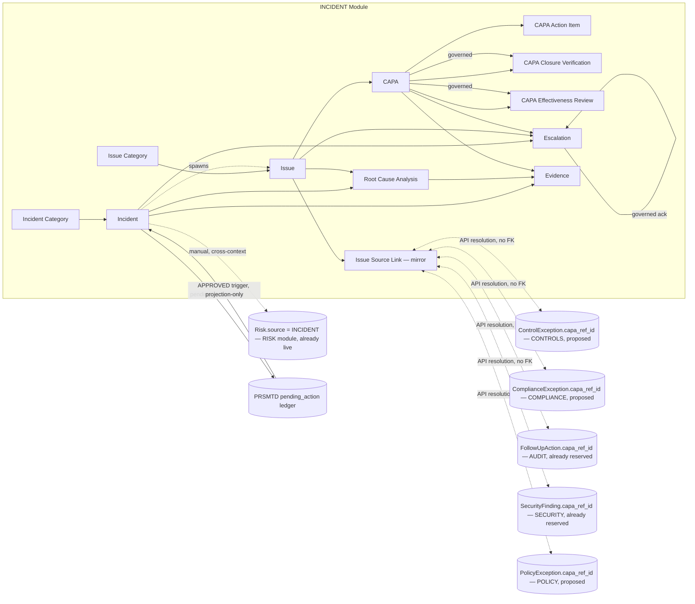
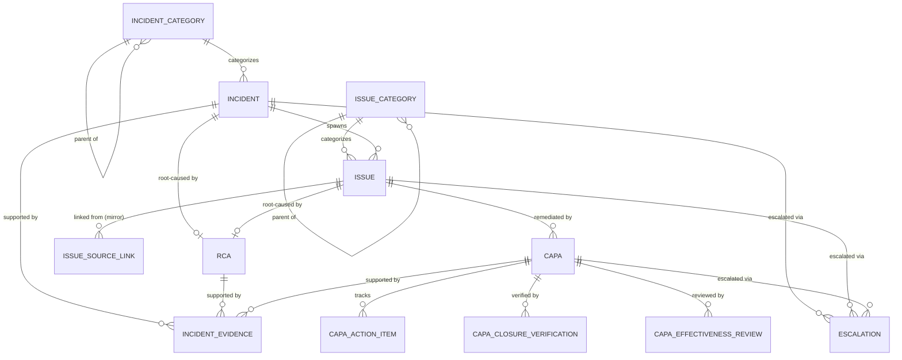
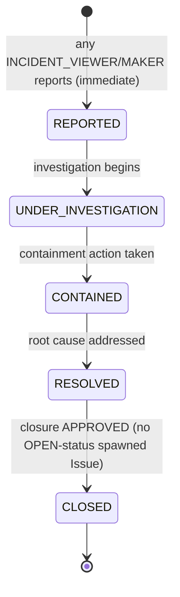
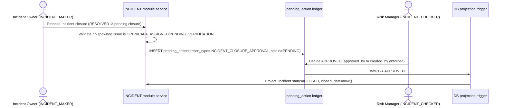
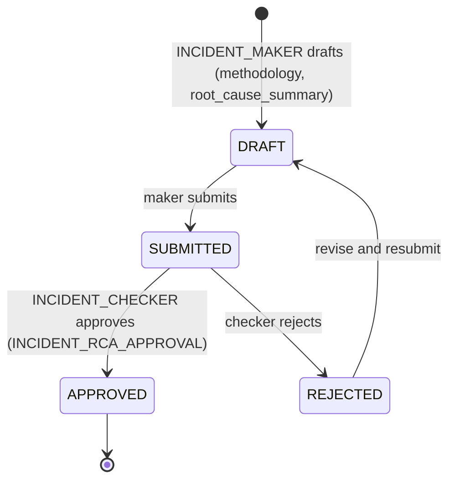
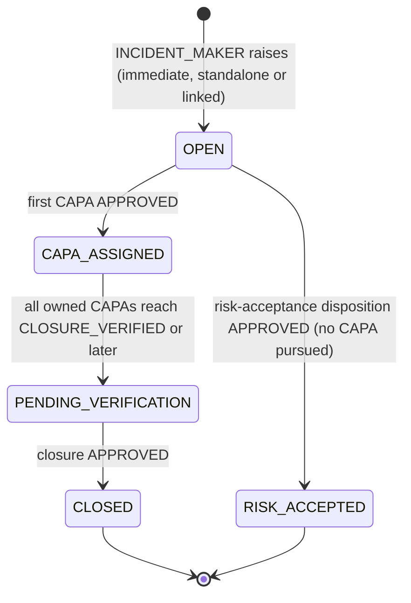
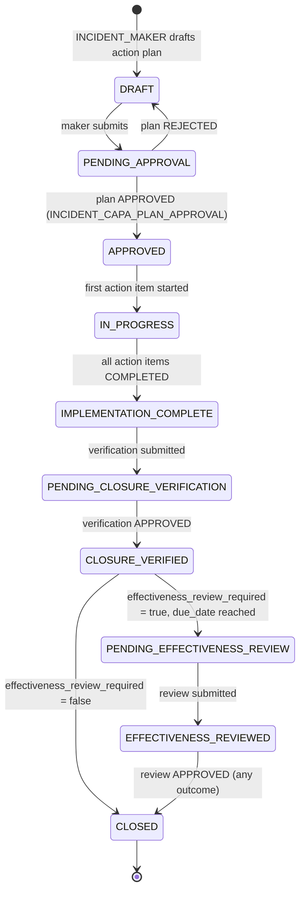
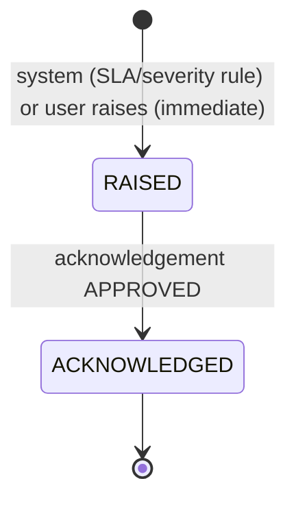

# 24.01 — Incident / Issue / CAPA Management

## Purpose

Defines the Incident / Issue / CAPA Management capability: incident intake and investigation,
root cause analysis, issue tracking, corrective and preventive action (CAPA) governance —
action plans, action tracking, closure verification, and effectiveness review — and
escalation management, for a SEBI-regulated Mutual Fund AMC, built entirely on PRSMTD's
existing multi-tenant, governance, RBAC, and audit substrate. This is the eighth
authoritative, implementation-ready specification in this repository, and the most
cross-referenced bounded context this repository had left reserved: five of the six
previously frozen specs (`10-risk`, `12-controls`, `11-compliance`, `13-audit`, `09-security`)
and the seventh (`23-policy`) each named it as an unbuilt dependency. It activates the
`INCIDENT`/`ISSUE`/`CAPA` bounded context reserved by
[`04-domain-model/01-enterprise-domain-model.md`](../04-domain-model/01-enterprise-domain-model.md#incident--issue--capa-reserved)
(Customer-Supplier, with every other core-domain context as a customer), resolves the
module-code naming question that document's own Future Enhancements section left open, and
closes six forward references — without modifying any of the six frozen specs.

## Scope

**In scope**: Incident intake, classification, and investigation lifecycle; Root Cause
Analysis (RCA), attachable to an Incident or to a standalone Issue; Issue tracking as an
enterprise-level remediation-escalation register that **complements**, and explicitly does
**not** replace, `12-controls`' `ControlException`, `11-compliance`'s `ComplianceException`,
`13-audit`'s `Finding`, `09-security`'s `SecurityFinding`, and `23-policy`'s `PolicyException`
(see [Assumptions](#assumptions), Assumption 2 — the single highest-risk design decision in
this specification, made explicitly, with a stated reason, per the Master Execution Plan's own
Phase 7 entry); the governed CAPA (Corrective and Preventive Action) lifecycle — action plan
proposal and approval, action-item tracking, governed closure verification, and governed
effectiveness review; Escalation management, generalizing `10-risk`'s existing `Escalation`
shape to this module's own Incident/Issue/CAPA entities; and this module's full
security/authorization/audit/reporting/API surface.

**Out of scope** (forward-referenced, not yet specified):
- The Third-Party Risk and Business Continuity modules (`docs/25-third-party-risk/`,
  `docs/26-business-continuity/`) — a vendor-caused Incident or a continuity-triggering
  Incident is representable today via this module's existing `source`/category taxonomy; a
  dedicated cross-reference is deferred until those modules exist, the same restraint every
  prior module used toward its own still-reserved dependents.
- CERT-In Directions' mandatory 6-hour cyber-incident-reporting obligation — this module
  supplies the incident *timeline* (`detected_date`, escalation timestamps) a future
  `COMPLIANCE`-side CERT-In filing obligation would need to cite; the obligation content
  itself remains `11-compliance`'s own future scope (already named as a gap in
  `22-traceability/02-compliance-coverage-assessment.md`), not designed here.
- A platform document/object storage capability — `IncidentEvidence.storage_ref` reuses the
  identical metadata-plus-opaque-`storage_ref` shape every prior evidence-bearing module
  already established; this is the same platform capability gap, not a second one.
- A general-purpose Records Retention Schedule capability, and Regulatory Reporting as a
  distinct capability (`docs/14-reporting/`) — this spec exposes source data/views only, per
  the convention every prior module used.
- Regulatory profiles other than `SEBI_AMC` — schema is profile-configurable per the pattern
  every prior module established; only `SEBI_AMC` seed content is defined here.

## Business Context

Every one of the six frozen specs independently deferred structured remediation to this
module, using near-identical language:

- `10-risk` reserved `Risk.source = INCIDENT` at authoring time (Session 1) — already live,
  requiring no additive change (see [Integration with Risk](#integration-with-risk)).
- `12-controls` and `11-compliance` each carry a `ControlException`/`ComplianceException`
  with free-text `remediation_plan`/`remediation_owner_user_id`/`target_closure_date` fields,
  explicitly named as "an interim measure pending a future CAPA module" — neither reserved an
  actual `capa_ref_id` column.
- `13-audit`'s `FollowUpAction.capa_ref_id` (opaque, no FK) **is already reserved** — the
  cleanest of this module's inbound integration points, needing only a proposed additive
  endpoint, not a schema change (see [Integration with Audit](#integration-with-audit)).
- `09-security`'s `SecurityFinding.capa_ref_id` (opaque, no FK) **is already reserved**
  identically (see [Integration with Security](#integration-with-security)).
- `23-policy`'s `PolicyException` carries the same free-text remediation shape as
  `ControlException`/`ComplianceException`, with no `capa_ref_id` reserved.

Without this module, a realized adverse event (a data breach, a system outage, a fraud event,
an operational error) has no system of record distinct from whatever module happened to
notice it first, and every module's own remediation tracking stops at a free-text plan with no
formal action-item tracking, no independent closure verification, and no later check that the
fix actually worked. This module makes three things first-class: **Incident** (the realized
event itself, investigated independently of which downstream module it happens to touch),
**Issue** (an enterprise-level remediation record that may aggregate symptoms reported across
several modules as one underlying systemic problem), and **CAPA** (the structured action plan,
tracked to completion, independently verified, and later checked for actual effectiveness) —
the concrete capability every one of the six frozen specs' own "deferred to a future CAPA
module" language already anticipated.

## Regulatory Drivers

Source: [`../reference/Annexures to Master Circular for Mutual Funds as on March 31,
2023_p.pdf`](../reference/Annexures%20to%20Master%20Circular%20for%20Mutual%20Funds%20as%20on%20March%2031%2C%202023_p.pdf),
System Audit Program Checklist §§1–8 (giving effect to SEBI/HO/IMD/DF2/CIR/P/2019/57),
already cited by `12-controls`' Control Taxonomy; Annexures §1.3.4.1 (three lines of defense,
Non-Compliance Rate, Rectification Index), already cited by `13-audit`; and the Cyber Security
and Cyber Resilience Framework for Mutual Funds AMCs (SEBI/HO/IMD/DF2/CIR/P/2019/12), cited at
scope level only per `12-controls` Assumption 5, inherited by `09-security` and here for the
same scanned-PDF limitation.

| Driver | Source reference | How this spec satisfies it |
|---|---|---|
| Incident Management as one of eight mandatory System Audit Program domains | Annexures, System Audit Program Checklist §5 (re-cited from `12-controls`) | The `Incident` aggregate's full intake/investigation/closure lifecycle — see [Incident Lifecycle](#incident-lifecycle). |
| Cyber Security Framework's Incident Response domain: Detection, Containment, Regulator Notification | Cyber Security and Cyber Resilience Framework (scope-level); `09-security`'s own reserved forward reference | `Incident.status` progression through `CONTAINED`; `IncidentEscalation` for regulator/board notification hand-off — see [Escalation Management](#escalation-management). Regulator-notification *content* (e.g. CERT-In's 6-hour filing) remains out of scope (see Scope). |
| Non-Compliance Rate / Rectification Index — whether a prior audit finding's remediation actually held | Annexures §1.3.4.1.1(ii)(d)–(f) (re-cited from `13-audit`) | `CAPAEffectivenessReview` directly operationalizes "did the fix work" at the level of an individual CAPA, the same question the Rectification Index answers in aggregate — see [Integration with Audit](#integration-with-audit). |
| Maker-checker authorization on remediation sign-off | Best-practice pattern across the Annexures' approval matrices, same as every prior module | Reuses PRSMTD's `pending_action` governance ledger — see [Incident Lifecycle](#incident-lifecycle), [Issue Lifecycle](#issue-lifecycle), [CAPA Lifecycle](#capa-lifecycle). |

## Assumptions

1. **Module code = `INCIDENT`, one combined module for Incident, Issue, and CAPA.** Resolves
   `04-domain-model`'s own open naming question. A single module keeps the "one Incident may
   spawn one or more Issues; an Issue is remediated by one or more CAPAs" governed
   remediation chain inside one schema/API namespace rather than fragmenting it across three
   modules with three sets of cross-module reference plumbing between them — exactly the
   reasoning `04-domain-model` itself gave for reserving one combined context rather than
   three. `Issue` and `CAPA` are first-class aggregate roots within this module, not
   sub-aggregates of `Incident` (an Issue may exist without ever having a parent Incident —
   see Assumption 2).
2. **This module complements, and does not replace, the five frozen Finding/Exception
   entities.** `ControlException`, `ComplianceException`, `Finding` (`13-audit`),
   `SecurityFinding`, and `PolicyException` each keep their own domain model, data model, and
   governed closure lifecycle exactly as their frozen specs define — **none is redesigned,
   absorbed, or deprecated by this document.** What this module adds is: (a) `Incident`, a
   genuinely new top-level register for realized adverse events with no existing per-module
   equivalent; (b) `Issue`, an enterprise-level register that a maker may explicitly link to
   one or more of the five existing entities (via `IssueSourceLink`, an opaque, no-FK mirror)
   when a problem's significance or systemic nature (spanning more than one module, or
   warranting formal CAPA governance) justifies tracking beyond a single module's own
   register — most Control/Compliance/Audit/Security/Policy exceptions will continue to be
   raised, remediated, and closed entirely within their own module exactly as already
   specified, never touching this module at all; and (c) `CAPA`, the structured action-plan/
   tracking/closure-verification/effectiveness-review capability every one of the five frozen
   specs' own exception entities already deferred to via a free-text remediation field or an
   already-reserved `capa_ref_id`. Replacing any of the five entities was considered and
   rejected: it would require editing five frozen specs' domain models, which `CLAUDE.md`'s
   governance rules and this phase's own explicit instruction forbid, and would break the
   "propose, don't apply" discipline this repository has used seven times running.
3. **`Risk.source = INCIDENT` covers Issue- and CAPA-originated risks too — no additive
   `Risk.source` value is proposed for `ISSUE` or `CAPA` separately.** `04-domain-model`'s
   descriptive-`source`-classification pattern is module-level granularity
   (`Risk.source = AUDIT_FINDING` covers every `13-audit` finding type; `Risk.source =
   SECURITY_FINDING` covers every `09-security` finding type), not entity-level — this module
   is one bounded context regardless of whether the originating record inside it is an
   Incident, an Issue, or a CAPA. `Risk.source = INCIDENT` was reserved (and is already live)
   under exactly this module-level reading. **No additive change to `10-risk/01-*.md` is
   required.**
4. **A CAPA always belongs to exactly one Issue — never directly to a Finding/Exception.**
   `13-audit`'s `FollowUpAction.capa_ref_id` and `09-security`'s `SecurityFinding.capa_ref_id`
   are both typed simply "opaque uuid, no FK" with no constraint on what they resolve to; this
   module resolves both to a `CAPA.id`, and internally guarantees every `CAPA` has exactly one
   parent `Issue` (transparently creating or reusing one when a citing module's own request
   does not explicitly create an `Issue` first — see [Integration with Audit](#integration-with-audit)/
   [Integration with Security](#integration-with-security)). This is a single, simple
   invariant (one parent type, not a polymorphic nullable-FK set) rather than the more complex
   "exactly one of N" shape this repository uses for Evidence entities — chosen because CAPA
   has exactly one conceptual parent (its Issue), while Evidence genuinely has several possible
   attachment points. Callers outside this module never need to know an `Issue` exists
   underneath — they only ever see the `capa_ref_id` they asked for.
5. **`RootCauseAnalysis` attaches to either an `Incident` or a standalone `Issue`, never
   both.** An Issue that never had a formal Incident (e.g., raised directly from an Audit
   Finding) may still need its own RCA — the entity is shared, not duplicated, per-parent-type.
6. **`Escalation` generalizes `10-risk`'s existing `Escalation` shape**
   (`04-domain-model`'s Common Domain Patterns table names this exact generalization: "Candidate
   for `Finding` (Audit), `Issue`/`CAPA` (Incident)... and any future exception-shaped entity")
   — immediate system-or-user raise, governed acknowledgement, attachable to an Incident,
   Issue, or CAPA (exactly one non-null reference per row, the same "exactly one of N" shape
   `ComplianceEvidence`/`PolicyEvidence` already use for their own multi-attachment-point
   entities).
7. **Users referenced by this module** (`incident_owner_user_id`, `issue_owner_user_id`,
   `capa_owner_user_id`, `performed_by`, `raised_by`, etc.) **are platform/tenant identity
   records**, not module-owned data — same reasoning as every prior module's identical
   assumption.
8. **This module inherits, not repeats, `12-controls`' object-storage gap.**
   `IncidentEvidence.storage_ref` uses the identical metadata-plus-opaque-`storage_ref`-plus-
   `content_hash` shape `ControlEvidence` established — the same platform capability gap, not
   a second, module-specific one.
9. **`CAPAActionItem` is not individually `pending_action`-governed.** Individual action-item
   status edits (mark a task `IN_PROGRESS`/`COMPLETED`) are operational tracking, not
   themselves compliance-status-bearing decisions — the same "not every mutation needs
   governance" precedent `RiskAppetite`, `ControlFamily`/`ComplianceCalendarEntry`, and
   `PolicyAcknowledgement` already established three times; the governed events are the CAPA's
   own plan approval, closure verification, and effectiveness review, mirroring exactly how
   `13-audit`'s own `FollowUpAction` is tracked without individual governance (its owning
   Finding's closure approval is the governance event of record).
10. **Any authenticated tenant user may hold this module's `VIEWER` role extended with
    `INCIDENT_CREATE`, for the sole purpose of reporting an Incident.** Mirrors `23-policy`
    Assumption 9's identical tenant-onboarding-broad-assignment convention (there, for reading
    and acknowledging policies) — broad incident-reporting access is a real operational need
    (any employee should be able to report a phishing email or a near-miss), and creating a
    new `REPORTED` Incident carries no risk of tampering with anyone else's record, unlike
    editing.
11. **A `CAPAEffectivenessReview` outcome of `INEFFECTIVE` or `PARTIALLY_EFFECTIVE` does not
    auto-create a new CAPA.** Mirrors `11-compliance` Assumption 8 / `23-policy` Assumption 7
    exactly (a governed approval never auto-creates rows in a different aggregate than the one
    it targets) — the outcome is recorded, and a separate, deliberate maker action (drafting a
    new CAPA against the same Issue) follows manually.
12. **Maker and Checker are always distinct individuals** — enforced by PRSMTD's
    platform-level `approved_by <> created_by` constraint on `pending_action`, the same
    mechanism every prior module relies on; no bespoke SoD mechanism is designed here.

## Dependencies

- PRSMTD `docs/authoritative/system.md` §3 (Governance model, GOV-07), §4.1 (Observability &
  Deterministic Trace Contract), §7 (Data model & RLS enforcement), §8 (RBAC model), §9 +
  §5a–§5c (Module framework, ownership guards OWN-03/04/07/08/09), §10 (Audit and
  compliance), §21 (Authentication Surface Ownership) — all reused as-is, no PRSMTD changes
  required by this spec.
- [`04-domain-model/01-enterprise-domain-model.md`](../04-domain-model/01-enterprise-domain-model.md)
  — **frozen input, not modified by this spec.** Follows its Common Domain Patterns shared
  kernel exactly, and confirms — without editing — its
  [`INCIDENT`/`ISSUE`/`CAPA` context-map entry](../04-domain-model/01-enterprise-domain-model.md#incident--issue--capa-reserved)
  (Customer-Supplier, `RISK`/`CONTROLS` named as customers, generalized here to every
  core-domain context per Assumption 2) and its Common Domain Patterns' explicit naming of
  `Escalation`/`Issue`/`CAPA` as the generalization target for the immediate-raise/
  governed-closure shape. This spec **proposes, but does not apply**, the `INCIDENT (reserved)`
  → `INCIDENT (authored)` status-label amendment `09-security`/`23-policy` each proposed for
  their own onboarding — see [Future Extension Points](#future-extension-points).
- [`10-risk/01-enterprise-risk-management.md`](../10-risk/01-enterprise-risk-management.md) —
  **not modified by this spec.** Its `Risk.source = INCIDENT` value (already live) and its own
  `Escalation` entity (the shape this module's own `Escalation` generalizes) are both reused
  as-is.
- [`12-controls/01-controls-management.md`](../12-controls/01-controls-management.md),
  [`11-compliance/01-compliance-management.md`](../11-compliance/01-compliance-management.md),
  [`23-policy/01-policy-management.md`](../23-policy/01-policy-management.md) — **not modified
  by this spec.** Each carries a free-text remediation shape on its own exception entity with
  no `capa_ref_id` reserved; this spec proposes, but does not apply, an additive `capa_ref_id`
  column plus initiating endpoint for each.
- [`13-audit/01-audit-management.md`](../13-audit/01-audit-management.md),
  [`09-security/01-security-management.md`](../09-security/01-security-management.md) — **not
  modified by this spec.** Both already reserve a `capa_ref_id` column
  (`FollowUpAction.capa_ref_id`, `SecurityFinding.capa_ref_id`); this spec proposes, but does
  not apply, only the initiating endpoint each needs to populate it.
- `docs/05-modules/README.md` — confirmed index-only (Session 9); no separate per-module
  `05-modules/`/`06-data-model/`/`08-api/` document is expected for this module.
- `docs/22-traceability/01-master-traceability-matrix.md`,
  `docs/22-traceability/02-compliance-coverage-assessment.md`, `docs/roadmap.md` — updated
  incrementally by this session, per `CLAUDE.md`'s Traceability Rules.

## Architecture

The Incident/Issue/CAPA capability is one PRSMTD module: **module code `INCIDENT`** (Assumption
1). It follows the generic module framework exactly as every prior module does (system.md
§9/§5a–§5c):

- `moduleId`: a stable UUID minted at implementation time, not fixed by this specification.
- Table prefix: `module_incident_*` (OWN-03 schema ownership).
- Route namespace: `/modules/INCIDENT` (§5b4).
- API namespace: `/api/v1/modules/incident/**`, controllers in `com.prsbnjs.modules.incident`
  (OWN-07).
- Module role types: `MAKER`, `CHECKER`, `VIEWER` only — the closed set (system.md §8).
  Domain personas map onto these three; see [Authorization Model](#authorization-model).
- **`dependencies: []`** (unchanged). Per `04-domain-model`'s Customer-Supplier relationship
  shape (this context is upstream; `RISK`, `CONTROLS`, `COMPLIANCE`, `AUDIT`, `SECURITY`,
  `POLICY`, `TPR`, `BCP`, and `14-reporting` are all customers), `INCIDENT` remains a **pure
  provider toward all nine** — it declares no dependency in that direction, now or previously.
  **`Incident.vendor_ref_id` deliberately does not add a `TPR` dependency**: `TPR` already
  depends on `INCIDENT` (for its own `POST /capa-requests` call) — a reciprocal
  `INCIDENT → TPR` edge would create the exact cycle `04-domain-model` Dependency Rule 6
  forbids. The opaque reference is recorded but resolved on demand by a third module (e.g.
  `14-reporting`, which already depends on both) via `TPR`'s existing
  `GET /vendors/{id}/reference` (see [Integration with Third-Party Risk
  Management](#integration-with-third-party-risk-management)). Each citing module's own
  manifest gains `dependencies: [INCIDENT]` once its own proposed additive endpoint (see the
  Integration sections below) is built — proposed, not applied, for `CONTROLS`/`COMPLIANCE`/
  `POLICY`; `AUDIT` and `SECURITY` already declare, and `BCP` and `14-reporting` already
  declare from their own original authoring, broad `dependencies:` lists that include
  `INCIDENT`.
- No platform-plane tables, no platform-plane governance actions — every governed action is
  tenant-plane (`app.plane = 'tenant'`).
- Tenant isolation, GUC binding, and session-setter usage are inherited unmodified from
  `TenantAwareDataSource` (system.md §7) — this module issues no direct `SET`/`set_config`
  calls.
- **Cross-module access is API-mediated only (OWN-08/OWN-09).** `INCIDENT` never reads any
  other module's tables directly; no other module reads `INCIDENT`'s tables directly. Every
  cross-context reference is either a manual descriptive `source` value
  (`Risk.source = INCIDENT`) or an opaque-reference-plus-mirror pair resolved through
  `.api`/`.client` packages, exactly as every prior cross-context integration in this
  repository already established.



## Domain Model

**Bounded context**: Incident / Issue / CAPA Management. Owns the realized-event register, the
enterprise remediation-escalation register, and the structured corrective/preventive action
lifecycle exclusively; confirms `04-domain-model`'s Customer-Supplier relationship shape
(generalized to every core-domain context, Assumption 3) and its explicit naming of
`Issue`/`CAPA` as the generalization target for the immediate-raise/governed-closure pattern.
Treats every other core-domain context (`RISK`, `CONTROLS`, `COMPLIANCE`, `AUDIT`, `SECURITY`,
`POLICY`) as a downstream customer of the facts it supplies (a Risk sourced from an Incident;
a Finding/Exception's `capa_ref_id` resolved here) — this module reads no other context's
tables and declares no outbound dependency of its own.

**Ubiquitous language** (extends, does not redefine, `04-domain-model`'s canonical glossary —
per that document's closing rule, "a term means one thing repository-wide"):

| Term | Definition |
|---|---|
| Incident | A realized adverse event — distinct from a Risk (a *potential* uncertainty) and from any module's own Exception/Finding (a *specific control or obligation's* failure) — that an AMC investigates, contains, and closes. May be caused by a realized Risk, a control failure, or neither. |
| Root Cause Analysis (RCA) | A governed, structured determination of the underlying cause(s) of an Incident or a standalone Issue, distinct from the Incident/Issue's own closure. |
| Issue | An enterprise-level remediation-escalation register entry — raised standalone, from an Incident's investigation, or linked from one or more Control/Compliance/Audit/Security/Policy Exception/Finding records via `IssueSourceLink` — for problems whose significance warrants formal CAPA governance beyond a single module's own exception-closure workflow (Assumption 2). |
| CAPA (Corrective and Preventive Action) | A structured remediation record — action plan, tracked action items, governed closure verification, and governed effectiveness review — that supersedes the free-text remediation fields every prior module's own Exception/Finding entity carries as an interim measure. Always owned by exactly one Issue (Assumption 4). |
| CAPA Action Item | An individual, ownable, due-dated task within a CAPA's action plan — ungoverned operational tracking, rolled up to determine the CAPA's own progress. |
| Closure Verification | A governed determination, independent of the maker who executed the action plan, that a CAPA's action items are genuinely complete and the remediation is done. |
| Effectiveness Review | A governed, later determination of whether a verified CAPA actually prevented recurrence — distinct from closure verification, which only confirms the plan was executed. |
| Escalation | A governed notification raised (by a user or by an SLA/severity rule) when an Incident, Issue, or CAPA requires elevated attention, requiring acknowledgement by the responsible function — generalizes `10-risk`'s own `Escalation` entity (Assumption 6). |
| Issue Source Link | A local, opaque **mirror** of a `CONTROLS`/`COMPLIANCE`/`AUDIT`/`SECURITY`/`POLICY`-module Exception/Finding association, populated via an inbound API call from the citing module, never a direct FK into that module's schema. |
| Incident Evidence | A metadata record (integrity hash + opaque storage pointer) supporting an Incident, RCA, or CAPA — the same shape as `ControlEvidence`/`ComplianceEvidence`/`SecurityEvidence`/`PolicyEvidence`. |

**Aggregates, entities, and invariants**:

- **Incident** (aggregate root) — Raised immediately by an `INCIDENT_MAKER`, no approval
  required to report (Assumption 10; an operational fact should not wait on governance to be
  recorded — the same reasoning every prior module's exception-shaped entity already uses).
  Cannot be `CLOSED` while it has spawned an `Issue` in any status other than `CLOSED` or
  `RISK_ACCEPTED` — the same "no-closure-while-active-work-exists" shape every prior
  governed-lifecycle root enforces.
- **RootCauseAnalysis** (entity, owned by exactly one of Incident or Issue, Assumption 5) —
  Immutable once `APPROVED`; append-only history, mirroring `RiskAssessment`/`ControlTest`
  exactly.
- **Issue** (aggregate root) — Raised immediately (Assumption 2's escalation trigger), no
  approval required to open. Cannot be `CLOSED` while any owned `CAPA` remains open (not
  `CLOSED`). `status` advances to `CAPA_ASSIGNED` the moment its first `CAPA` is `APPROVED`,
  mirroring the "child-entity-approval-activates-root" shared-kernel pattern.
- **IssueSourceLink** (entity, owned by Issue) — A local, opaque **mirror** of an inbound
  citing-module Exception/Finding association, disambiguated by `source_module_code`/
  `source_entity_type`, a single polymorphic table (not one per source module) — the same
  design `23-policy`'s `PolicyReferenceLink` already established, chosen so a future sixth
  citing context needs only a new enum value, not a new migration.
- **CAPA** (aggregate root, owned by exactly one Issue, Assumption 4) — `DRAFT` until a maker
  submits the action plan for approval; immutable action-plan content once `APPROVED`
  (revising an approved plan is a new maker proposal, not a direct edit, mirroring
  `PolicyVersion`'s immutable-once-`PUBLISHED` shape). Cannot reach `CLOSED` without both a
  `CAPAClosureVerification` in status `APPROVED` and, where `effectiveness_review_required =
  true`, a `CAPAEffectivenessReview` in status `APPROVED`.
- **CAPAActionItem** (entity, owned by CAPA) — Ungoverned operational tracking (Assumption 9),
  mirroring `13-audit`'s own `FollowUpAction` exactly.
- **CAPAClosureVerification** (entity, owned by CAPA) — Governed; proposed by a maker
  (typically not the same individual who executed the action items), approved by a checker —
  the independence of the verifier from the executor is this entity's entire evidentiary
  purpose.
- **CAPAEffectivenessReview** (entity, owned by CAPA) — Governed; conducted after
  `effectiveness_review_due_date` (a configurable interval after closure verification, e.g.
  90 days), producing an outcome that is recorded but never auto-actioned (Assumption 11).
- **Escalation** (entity, owned by exactly one of Incident, Issue, or CAPA, Assumption 6) —
  Created immediately (system SLA-breach detection or user action); acknowledgement is the
  sole governed transition, mirroring `10-risk`'s own `Escalation` exactly.
- **IncidentEvidence** (entity, attached to exactly one of Incident, RootCauseAnalysis, or
  CAPA) — Immutable metadata once uploaded; supersession creates a new row, never an edit.
- **IncidentCategory**, **IssueCategory** (reference data) — Two-level hierarchies
  (category → sub-category), regulatory-profile-seeded, tenant-editable — same shape as
  `RiskCategory`/`ControlFamily`/`ObligationCategory`/`PolicyCategory`. Kept as two separate
  tables (not one shared taxonomy) per the established convention that every aggregate root
  owns its own local taxonomy — an Incident's classification (type of adverse event) and an
  Issue's classification (type of deficiency) are conceptually distinct.

## Incident and Issue Taxonomy

Reuses the shared-kernel taxonomy shape (`04-domain-model`, Common Domain Patterns), seeded at
MVP with a representative `SEBI_AMC` set grounded in the System Audit Program Checklist domains
`12-controls` already cites (Incident Management is itself one of the checklist's eight
domains) plus the Cyber Security Framework's own Incident Response category:

**`module_incident_category` seed** (`regulatory_profile = SEBI_AMC`):

| Category | Representative sub-category | Source |
|---|---|---|
| Operational | System Outage; Process Failure; Human Error | System Audit Program Checklist §5 |
| Cyber Security | Data Breach; Malware/Ransomware; Unauthorized Access | Cyber Security and Cyber Resilience Framework (scope-level) |
| Financial | Fraud; Unauthorized Transaction | Annexures §2.5 (re-cited, Financial Reporting Risk) |
| Regulatory | Filing Failure; Reporting Error | Annexures §2.6 (re-cited) |
| Third-Party / Vendor | Vendor Service Disruption; Vendor Data Incident | Reserved forward reference — future `THIRD-PARTY RISK` context |
| Health, Safety & Environment | Workplace Safety Event | General GRC scope, not SEBI-specific |

**`module_issue_category` seed** (`regulatory_profile = SEBI_AMC`):

| Category | Representative sub-category | Source |
|---|---|---|
| Control Deficiency | Design Gap; Operating Failure | Mirrors `ControlException.category` |
| Compliance Gap | Obligation Non-Satisfaction; Filing Gap | Mirrors `ComplianceException.category` |
| Policy Gap | Missing/Outdated Policy | Mirrors `PolicyException.category` |
| Security Weakness | Vulnerability; Misconfiguration; Access Anomaly | Mirrors `SecurityFinding.finding_type` |
| Process/Systemic | Cross-Module Recurring Pattern | Genuinely new — the case `Issue` exists to capture that no single module's own taxonomy names |

Not every seeded category requires an `Incident`/`Issue` row at MVP — the taxonomy is seeded
ahead of content, the same "seed the shape, not the content" convention `11-compliance`/
`23-policy` each used for their own taxonomies.

## Functional Requirements

| ID | Requirement | Regulatory tie |
|---|---|---|
| FR-01 | The system shall provide configurable, two-level Incident and Issue category taxonomies, seeded per regulatory profile. | System Audit Program Checklist §5 |
| FR-02 | `INCIDENT_MAKER` users, and any tenant user holding this module's `VIEWER` role, shall be able to report a new Incident immediately, without prior approval (Assumption 10). | — |
| FR-03 | The system shall support a governed Root Cause Analysis, attachable to an Incident or to a standalone Issue, subject to checker approval. | — |
| FR-04 | The system shall support Issues raised standalone, from an Incident, or linked from one or more Control/Compliance/Audit/Security/Policy Exception/Finding records via an opaque, non-FK `IssueSourceLink`. | — |
| FR-05 | An Issue shall support zero or more CAPAs; a CAPA shall belong to exactly one Issue (Assumption 4). | — |
| FR-06 | The system shall support a governed CAPA action-plan proposal and approval (`capa_type ∈ CORRECTIVE, PREVENTIVE, BOTH`), followed by ungoverned, owned, due-dated action-item tracking. | — |
| FR-07 | The system shall support a governed Closure Verification, distinct from and subsequent to action-item completion, requiring checker approval independent of the action-plan executor. | — |
| FR-08 | The system shall support a governed Effectiveness Review, conducted after a configurable interval following closure verification, producing an outcome (`EFFECTIVE`/`PARTIALLY_EFFECTIVE`/`INEFFECTIVE`) that is recorded but never auto-actioned (Assumption 11). | Annexures §1.3.4.1.1(ii)(d)–(f) — Rectification Index pattern |
| FR-09 | The system shall support Escalations on an Incident, Issue, or CAPA, raised immediately (system or user), with governed acknowledgement. | — |
| FR-10 | The maker and the approver of any governed action in this module shall never be the same individual (platform `approved_by <> created_by` constraint). | Independent remediation sign-off, mirrors every prior module's identical FR |
| FR-11 | An Incident shall not reach `CLOSED` while it has spawned an Issue that is not itself `CLOSED` or `RISK_ACCEPTED`; an Issue shall not reach `CLOSED` while any owned CAPA remains open. | — |
| FR-12 | Evidence shall attach to exactly one of an Incident, a Root Cause Analysis, or a CAPA, and shall record an integrity hash of the underlying artifact. | — |
| FR-13 | A CAPA shall expose a cross-module reference-resolution API so that `13-audit`'s already-reserved `FollowUpAction.capa_ref_id` and `09-security`'s already-reserved `SecurityFinding.capa_ref_id` resolve to a real CAPA record without a direct FK. | Activates `13-audit`/`09-security`'s already-reserved forward references |
| FR-14 | The system shall expose a single convenience endpoint (`POST /capa-requests`) accepting an opaque citing-module source reference, which transparently creates or reuses an Issue and a `DRAFT` CAPA and returns their ids — so a citing module never needs to model this module's own Issue concept to obtain a `capa_ref_id`. | — |
| FR-15 | Visibility shall be role-scoped: `INCIDENT_VIEWER` — full tenant register, read-only, plus incident reporting; `INCIDENT_MAKER` — full read, own drafts/action items/proposals; `INCIDENT_CHECKER` — full read, plus all pending approvals across the tenant. | — |
| FR-16 | The independent verification/approval function shall be satisfiable purely by role assignment (Risk Manager, Compliance Officer, Quality Manager, or a CAPA Review Board member holding `INCIDENT_CHECKER`) — no code change required per assignment choice. | Mirrors every prior module's identical FR |
| FR-17 | A `HIGH`/`CRITICAL` Incident or Issue may be used to create or link a Risk register entry via `Risk.source = INCIDENT`, resolved by manual cross-context action, not a synchronous service call. | Activates the already-live `10-risk` reservation |
| FR-18 | The system shall expose an incident register report, an issue register report, a CAPA tracker (by status, by overdue action item), an effectiveness-review summary, and an escalation log. | Annexures §1.3.4.1.1(ii)(d)–(f) |
| FR-19 | Every governed state transition shall be captured in the platform audit trail using canonical, non-aliased `action_type` values. | system.md §10 |
| FR-20 | An Incident shall support an optional opaque, non-FK `vendor_ref_id` citation of a `TPR` Vendor record, resolved via `TPR`'s existing `GET /vendors/{id}/reference`. **Added Session 15.** | Annexures §2.9 (re-cited from `25-third-party-risk`) |
| FR-21 | An Incident shall expose a cross-module reference-resolution API (`GET /incidents/{id}/reference`) so other modules can resolve an `Incident` citation without a direct FK. **Added Session 15.** | Activates `26-business-continuity`'s and `14-reporting`'s own proposed extensions |

## Non-Functional Requirements

| Category | Requirement |
|---|---|
| Multi-tenancy | Full tenant isolation via PRSMTD RLS (system.md §7); zero platform-plane data in this module. |
| Performance | Incident/Issue/CAPA register list/filter queries shall return p95 < 500ms for tenants with up to 5,000 active records combined; action-item and evidence history queries shall paginate rather than return unbounded history. |
| Scalability | Schema and query patterns must not assume a ceiling on tenant count or per-tenant record volume beyond the platform's general multi-tenant design targets. |
| Availability | Inherits platform availability targets (`18-deployment`, not yet authored) — no module-specific SLA is defined here. |
| Auditability | Every governed transition is immutable and traceable per system.md §4.1 T1–T7; no destructive updates on RCA/CAPA/verification/review/escalation history. |
| Configurability | Incident and Issue category taxonomies, and the effectiveness-review interval, are tenant-editable reference data, not hardcoded. |
| Data retention | No physical deletion of governed records; a general cross-module retention-schedule capability remains unspecified, the same carried gap `11-compliance` Assumption 10 already names. |
| Data integrity | Evidence records carry a content hash computed at upload time; binary storage integrity itself is out of scope pending the object-storage capability gap (Assumption 8). |
| Localization | Out of scope for this spec. |

## Canonical Data Model

All tables use module prefix `module_incident_`, live in the tenant plane, and carry the
standard PRSMTD columns: `id uuid PRIMARY KEY DEFAULT gen_random_uuid()`, `tenant_id uuid NOT
NULL` (RLS-scoped per system.md §7), `created_at timestamptz NOT NULL DEFAULT now()`,
`created_by uuid NOT NULL`. Lifecycle uses closed-set `status` columns, never soft-delete
(`deleted_at`), matching PRSMTD convention and every prior ERM module's own data model. This
section is the canonical source for the Incident/Issue/CAPA schema — no separate
`06-data-model/` document duplicates it.

### Reference / configuration tables

| Table | Key columns | Notes |
|---|---|---|
| `module_incident_category` | `code`, `name`, `parent_category_id` (self-FK, nullable), `regulatory_profile`, `status` | Two-level hierarchy. Seeded with the `SEBI_AMC` profile — see [Incident and Issue Taxonomy](#incident-and-issue-taxonomy). |
| `module_issue_category` | `code`, `name`, `parent_category_id` (self-FK, nullable), `regulatory_profile`, `status` | Two-level hierarchy. Seeded with the `SEBI_AMC` profile. |
| `module_incident_code_sequence` | `tenant_id`, `entity_type` (composite PK: `INCIDENT`, `ISSUE`, `CAPA`), `last_value int` | Backs human-readable `incident_code`, `issue_code`, `capa_code` generation from one shared table, mirroring every prior module's single-table-multi-entity-type sequence shape. |

### Core tables

| Table | Key columns | Notes |
|---|---|---|
| `module_incident` | `incident_code`, `category_id` (FK), `subcategory_id` (FK, nullable), `title`, `description`, `severity`, `status`, `source`, `detected_date`, `detected_by`, `incident_owner_user_id`, `containment_summary` (nullable), `closed_date` (nullable), `vendor_ref_id` (opaque uuid, nullable, no FK), `updated_at` | The aggregate root. `severity` ∈ `LOW, MEDIUM, HIGH, CRITICAL`. `status` ∈ `REPORTED, UNDER_INVESTIGATION, CONTAINED, RESOLVED, CLOSED`. `source` ∈ `MANUAL, SYSTEM_ALERT, EMPLOYEE_REPORT, CUSTOMER_COMPLAINT, AUDIT_FINDING, SECURITY_FINDING, OTHER` (descriptive classification, mirrors every prior module's `source` pattern). `vendor_ref_id` — **added Session 15**, opaque, no FK, resolved via `25-third-party-risk`'s existing `GET /vendors/{id}/reference`, populated when `category = Third-Party / Vendor` — see [Integration with Third-Party Risk Management](#integration-with-third-party-risk-management). |
| `module_incident_rca` | `incident_id` (FK, nullable), `issue_id` (FK, nullable), `methodology`, `root_cause_summary`, `contributing_factors` (nullable), `performed_by`, `performed_at`, `status`, `approved_by` (nullable), `approved_at` (nullable) | Exactly one of `incident_id`/`issue_id` is non-null (Assumption 5). `methodology` ∈ `FIVE_WHYS, FISHBONE, FMEA, OTHER`. `status` ∈ `DRAFT, SUBMITTED, APPROVED, REJECTED`. |
| `module_issue` | `issue_code`, `category_id` (FK), `subcategory_id` (FK, nullable), `title`, `description`, `severity`, `status`, `source`, `source_incident_id` (FK, nullable), `issue_owner_user_id`, `identified_date`, `target_resolution_date` (nullable), `closure_justification` (nullable), `linked_risk_id` (opaque uuid, nullable, no FK), `approved_by` (nullable), `approved_at` (nullable), `updated_at` | The aggregate root. `severity` ∈ `LOW, MEDIUM, HIGH, CRITICAL`. `status` ∈ `OPEN, CAPA_ASSIGNED, PENDING_VERIFICATION, CLOSED, RISK_ACCEPTED`. `source` ∈ `MANUAL, INCIDENT, CONTROL_EXCEPTION, COMPLIANCE_EXCEPTION, AUDIT_FINDING, SECURITY_FINDING, POLICY_EXCEPTION` — the descriptive value that generalizes the Finding/Exception-follow-up concern without replacing any of the five source entities (Assumption 2). `linked_risk_id` mirrors `ControlException.linked_risk_id`'s opaque, no-FK shape. |
| `module_issue_source_link` | `issue_id` (FK), `source_module_code`, `source_entity_type`, `source_entity_ref_id` (opaque uuid, no FK), `linked_at`, `linked_by`, `status` | Local **mirror** of an inbound citing-module Exception/Finding association. `source_module_code` ∈ `CONTROLS, COMPLIANCE, AUDIT, SECURITY, POLICY` (open for future values without a schema change). `source_entity_type` ∈ `CONTROL_EXCEPTION, COMPLIANCE_EXCEPTION, FINDING, SECURITY_FINDING, POLICY_EXCEPTION`. `status` ∈ `ACTIVE, REMOVED`. |
| `module_capa` | `capa_code`, `issue_id` (FK), `capa_type`, `title`, `description`, `root_cause_summary` (nullable), `capa_owner_user_id`, `status`, `target_completion_date`, `effectiveness_review_required`, `effectiveness_review_due_date` (nullable), `submitted_by` (nullable), `submitted_at` (nullable), `approved_by` (nullable), `approved_at` (nullable), `implementation_completed_at` (nullable), `updated_at` | The aggregate root (Assumption 4). `capa_type` ∈ `CORRECTIVE, PREVENTIVE, BOTH`. `status` ∈ `DRAFT, PENDING_APPROVAL, APPROVED, IN_PROGRESS, IMPLEMENTATION_COMPLETE, PENDING_CLOSURE_VERIFICATION, CLOSURE_VERIFIED, PENDING_EFFECTIVENESS_REVIEW, EFFECTIVENESS_REVIEWED, CLOSED`. Immutable action-plan content once past `DRAFT` (Domain Model). |
| `module_capa_action_item` | `capa_id` (FK), `description`, `owner_user_id`, `due_date`, `status`, `completed_at` (nullable), `updated_at` | Ungoverned (Assumption 9). `status` ∈ `OPEN, IN_PROGRESS, COMPLETED, OVERDUE`. |
| `module_capa_closure_verification` | `capa_id` (FK), `verification_date`, `verification_notes`, `status`, `submitted_by`, `submitted_at`, `approved_by` (nullable), `approved_at` (nullable) | Governed. `status` ∈ `SUBMITTED, APPROVED, REJECTED`. |
| `module_capa_effectiveness_review` | `capa_id` (FK), `review_date`, `reviewer_user_id`, `outcome`, `notes`, `status`, `submitted_by`, `submitted_at`, `approved_by` (nullable), `approved_at` (nullable) | Governed. `outcome` ∈ `EFFECTIVE, PARTIALLY_EFFECTIVE, INEFFECTIVE`. `status` ∈ `SUBMITTED, APPROVED, REJECTED`. An `INEFFECTIVE`/`PARTIALLY_EFFECTIVE` outcome records only — no auto-created row (Assumption 11). |
| `module_incident_escalation` | `incident_id` (FK, nullable), `issue_id` (FK, nullable), `capa_id` (FK, nullable), `escalation_reason`, `severity`, `raised_by` (nullable — null when system-raised), `raised_at`, `status`, `acknowledged_by` (nullable), `acknowledged_at` (nullable) | Exactly one of `incident_id`/`issue_id`/`capa_id` is non-null (Assumption 6). `status` ∈ `RAISED, ACKNOWLEDGED`. |
| `module_incident_evidence` | `incident_id` (FK, nullable), `rca_id` (FK, nullable), `capa_id` (FK, nullable), `evidence_type`, `title`, `description`, `storage_ref`, `file_name`, `mime_type`, `file_size_bytes`, `content_hash`, `collected_at`, `collected_by`, `uploaded_at`, `uploaded_by`, `status` | Exactly one of `incident_id`/`rca_id`/`capa_id` is non-null (application-layer invariant, the same multi-attachment-point rule `ComplianceEvidence`/`PolicyEvidence` established). `evidence_type` ∈ `DOCUMENT, SYSTEM_EXTRACT, PHOTO, CORRESPONDENCE, OTHER`. `status` ∈ `ACTIVE, SUPERSEDED, ARCHIVED`. `storage_ref` is opaque per Assumption 8. |

No bespoke audit table is defined — audit trail is the platform's `audit_log` per system.md
§10, reused as-is, exactly as every prior module does.

### ER diagram



## Incident Lifecycle

All governed transitions reuse PRSMTD's `pending_action` ledger and the Governance Ledger +
Projection pattern (system.md §3, §9), exactly as every prior module does. GOV-07 dedup
applies per action type, scoped to its logical target.

| `action_type` | Logical target (GOV-07 key) | Effect on APPROVED |
|---|---|---|
| `INCIDENT_RCA_APPROVAL` | `rca_id` | `RootCauseAnalysis.status = APPROVED`. |
| `INCIDENT_CLOSURE_APPROVAL` | `incident_id` | `Incident.status = CLOSED`, `closed_date` set. |

Reporting an Incident is immediate (no `pending_action`, Assumption 10) — only its RCA and its
closure are governed.

### Incident lifecycle state machine



### Maker-checker sequence — incident closure approval



## Root Cause Analysis

Operationalizes this session's "Root Cause Analysis" scope item as a governed, structured
determination attachable to either an Incident or a standalone Issue (Assumption 5):



An `APPROVED` RCA is immutable; a later revision is a new RCA row referencing the same parent,
mirroring the append-only convention every other governed child entity in this repository uses.

## Issue Lifecycle

Generalizes the immediate-raise, governed-closure shared-kernel pattern (`04-domain-model`)
identically to `ControlException`/`ComplianceException`/`PolicyException`, with the addition
that closure requires every owned CAPA to already be `CLOSED` (FR-11):

| `action_type` | Logical target (GOV-07 key) | Effect on APPROVED |
|---|---|---|
| `INCIDENT_ISSUE_CLOSURE_APPROVAL` | `issue_id` | `Issue.status = CLOSED` or `RISK_ACCEPTED` (per the proposed disposition). |

### Issue lifecycle state machine



### Sequence — an Audit Finding escalates into an Issue and CAPA

```mermaid
sequenceDiagram
    actor Auditor as Internal Auditor (AUDIT_MAKER)
    participant AuditApp as AUDIT module service
    participant FUA as module_audit_follow_up_action (capa_ref_id already reserved)
    participant IncApi as INCIDENT module API (.api package)
    participant IssTbl as module_issue / module_issue_source_link
    participant CapaTbl as module_capa

    Auditor->>AuditApp: POST /findings/{id}/follow-up-actions/{faId}/capa-request (proposed, not yet built)
    AuditApp->>IncApi: POST /capa-requests {source_module_code: AUDIT, source_entity_type: FINDING, source_entity_ref_id: findingId}
    IncApi->>IssTbl: Create or reuse Issue; INSERT IssueSourceLink (mirror)
    IncApi->>CapaTbl: Create CAPA (DRAFT), owned by that Issue
    IncApi-->>AuditApp: 201 Created {issue_ref_id, capa_ref_id}
    AuditApp->>FUA: UPDATE capa_ref_id
    AuditApp-->>Auditor: Follow-up action now resolvable via GET /capas/{id}/reference
```

## CAPA Lifecycle

Covers the four requested CAPA capabilities — Action Plans, Action Tracking, Closure
Verification, Effectiveness Reviews — as one aggregate root with three distinct governed
sub-events plus one ungoverned tracking entity, per the Domain Model above.

| `action_type` | Logical target (GOV-07 key) | Effect on APPROVED |
|---|---|---|
| `INCIDENT_CAPA_PLAN_APPROVAL` | `capa_id` | `CAPA.status = APPROVED`; `Issue.status` advances `OPEN → CAPA_ASSIGNED` if this is the Issue's first approved CAPA. |
| `INCIDENT_CAPA_CLOSURE_VERIFICATION_APPROVAL` | `closure_verification_id` | `CAPAClosureVerification.status = APPROVED`; `CAPA.status = CLOSURE_VERIFIED` (or `CLOSED` directly if `effectiveness_review_required = false`). |
| `INCIDENT_CAPA_EFFECTIVENESS_REVIEW_APPROVAL` | `effectiveness_review_id` | `CAPAEffectivenessReview.status = APPROVED`; `CAPA.status = CLOSED` regardless of outcome value (Assumption 11 — the outcome is recorded, not itself gating closure; an `INEFFECTIVE` outcome is expected to prompt a separate, manual new-CAPA proposal against the same Issue). |

### CAPA lifecycle state machine



### Sequence — CAPA closure verification and effectiveness review

```mermaid
sequenceDiagram
    actor Owner as CAPA Owner (INCIDENT_MAKER)
    participant App as INCIDENT module service
    participant Ledger as pending_action ledger
    actor Reviewer as CAPA Review Board (INCIDENT_CHECKER)

    Owner->>App: All action items COMPLETED -> POST /capas/{id}/closure-verification
    App->>Ledger: INSERT pending_action(action_type=INCIDENT_CAPA_CLOSURE_VERIFICATION_APPROVAL)
    Reviewer->>Ledger: Decide APPROVED (independent of action-item executor)
    Ledger-->>App: Project: CAPA.status=CLOSURE_VERIFIED
    Note over App: effectiveness_review_due_date reached (e.g. 90 days later)
    Owner->>App: POST /capas/{id}/effectiveness-review {outcome, notes}
    App->>Ledger: INSERT pending_action(action_type=INCIDENT_CAPA_EFFECTIVENESS_REVIEW_APPROVAL)
    Reviewer->>Ledger: Decide APPROVED
    Ledger-->>App: Project: CAPAEffectivenessReview.status=APPROVED; CAPA.status=CLOSED
    Note over App: outcome=INEFFECTIVE recorded only — a new CAPA proposal is a separate, manual maker action (Assumption 11)
```

## Escalation Management

Generalizes `10-risk`'s existing `Escalation` entity (Assumption 6) to this module's own
Incident/Issue/CAPA entities:

| `action_type` | Logical target (GOV-07 key) | Effect on APPROVED |
|---|---|---|
| `INCIDENT_ESCALATION_ACK` | `escalation_id` | `Escalation.status = ACKNOWLEDGED`. |



Typical system-raised triggers (application-layer rules, not database constraints, the same
restraint every prior module used for its own ungoverned-but-tracked cadences): a `CRITICAL`
Incident remaining `REPORTED` past a configurable SLA; a CAPA's `target_completion_date`
passing while any action item remains `OPEN`/`IN_PROGRESS`.

## Security Model

- **Authentication**: reused unmodified from PRSMTD §21 — same as every prior module. No new
  authentication surface.
- **Tenant isolation**: reused unmodified from §7 — every table RLS-scoped on `tenant_id`,
  bound exclusively via `TenantAwareDataSource`.
- **Data classification**: the Incident and Issue registers are classified **Tenant
  Confidential** (same tier as `RISK`'s register, `CONTROLS`' library). `IncidentEvidence` is
  classified **Tenant Restricted** — a stricter tier, matching `ControlEvidence`'s
  classification exactly, since incident evidence (breach forensics, HR-sensitive
  investigation notes) can directly reveal exploitable weaknesses or personal data. This
  module does not introduce a separate evidence-view permission at MVP, for the same reason
  every prior module didn't — see [Future Extension Points](#future-extension-points).
- **Segregation of duties**: enforced entirely by the platform's `approved_by <>
  created_by` constraint on `pending_action` (system.md §3) — no bespoke SoD logic, same as
  every prior module. Closure Verification's own evidentiary value additionally depends on the
  verifier being a *different individual* from the action-item executor — an application-layer
  convention (Domain Model), not a new platform mechanism.
- **Threat model note**: the primary module-specific threat is an Incident being reported and
  then quietly allowed to lapse without genuine investigation or closure — mitigated
  structurally by RCA/closure/verification/review all being governed, checker-required
  transitions, and by the Escalation mechanism's SLA-breach trigger surfacing exactly this
  failure mode automatically rather than relying on manual follow-up.

## Authorization Model

Module role types are the closed PRSMTD set — `MAKER`, `CHECKER`, `VIEWER` (system.md §8).
Permission ids follow the `MODULECODE_ACTION` convention, same as every prior module.

**Permissions**:

| Permission | Meaning |
|---|---|
| `INCIDENT_VIEW` | Read the incident/issue/CAPA registers, RCAs, action items, verifications, reviews, escalations, evidence. |
| `INCIDENT_CREATE` | Report a new Incident. Granted to every module role (Assumption 10). |
| `INCIDENT_EDIT` | Edit an open Incident's investigation details. |
| `INCIDENT_RCA_SUBMIT` | Draft and submit a Root Cause Analysis. |
| `INCIDENT_CLOSE` | Propose Incident closure. |
| `INCIDENT_ESCALATE` | Raise an Escalation. |
| `ISSUE_CREATE` | Raise an Issue (standalone or source-linked). |
| `ISSUE_CLOSE` | Propose Issue closure or risk-acceptance disposition. |
| `CAPA_PROPOSE` | Draft and submit a CAPA action plan. |
| `CAPA_ACTION_MANAGE` | Create/update CAPA action items. |
| `CAPA_VERIFY` | Submit a Closure Verification. |
| `CAPA_EFFECTIVENESS_REVIEW` | Submit an Effectiveness Review. |
| `INCIDENT_APPROVE` | Approve/reject RCAs, Issue closures, CAPA plans, closure verifications, effectiveness reviews, and escalation acknowledgements — every governed action in this module. |
| `INCIDENT_ADMIN` | Manage the Incident/Issue category taxonomies. |
| `INCIDENT_REPORT_VIEW` | View incident/issue/CAPA reports and dashboards. |

**`roleMappings`**:

```yaml
roleMappings:
  INCIDENT_MAKER:   [INCIDENT_VIEW, INCIDENT_CREATE, INCIDENT_EDIT, INCIDENT_RCA_SUBMIT, INCIDENT_CLOSE, INCIDENT_ESCALATE, ISSUE_CREATE, ISSUE_CLOSE, CAPA_PROPOSE, CAPA_ACTION_MANAGE, CAPA_VERIFY, CAPA_EFFECTIVENESS_REVIEW, INCIDENT_REPORT_VIEW]
  INCIDENT_CHECKER: [INCIDENT_VIEW, INCIDENT_APPROVE, INCIDENT_ADMIN, INCIDENT_REPORT_VIEW]
  INCIDENT_VIEWER:  [INCIDENT_VIEW, INCIDENT_CREATE, INCIDENT_REPORT_VIEW]
```

**Persona-to-module-role mapping** (following the convention every prior module established):

| Persona | Module role | Rationale |
|---|---|---|
| Incident Responder / Operational Risk Analyst / Help Desk | `INCIDENT_MAKER` | Incident investigation, RCA drafting, Issue raising, CAPA plan drafting and action-item tracking. |
| Risk Manager / Compliance Officer / Quality Manager / CAPA Review Board member | `INCIDENT_CHECKER` | Independent RCA/closure/verification/review sign-off, mirroring the independent-function pattern every prior module establishes. |
| Every tenant employee | `INCIDENT_VIEWER` (extended with `INCIDENT_CREATE`) | Report an incident (e.g. a phishing email, a near-miss) — the tenant-onboarding-broad-assignment convention `23-policy` Assumption 9 already established for its own module (Assumption 10). |
| CISO, Internal Audit, Board Risk/Audit Committee | `INCIDENT_VIEWER` | Oversight/read access; Internal Audit may separately hold the platform-level `audit:view` permission for cross-module audit access, out of this module's scope. |

## Compliance Considerations

- This module is the structured-remediation capability the Annexures' System Audit Program
  Checklist (Incident Management domain) and the Rectification Index pattern (Annexures
  §1.3.4.1.1(ii)(d)–(f)) both point at — its CAPA effectiveness-review outcomes are a
  [Reporting Requirements](#reporting-requirements) input `13-audit`'s own Rectification Index
  computation may cite, not a new compliance mechanism of its own.
- This module does not duplicate any of the five frozen Exception/Finding entities' own
  compliance-status determinations — an Issue's existence signals that a problem warranted
  enterprise-level, CAPA-grade remediation, it is not itself a second compliance-status
  register (Assumption 2).
- The object-storage gap (Assumption 8) means this module cannot yet fully satisfy an
  auditor's or regulator's expectation of retrievable incident forensics/evidence — flagged,
  not silently dropped, same treatment every prior module already gave this gap.
- No cross-border data residency concerns are introduced beyond whatever the platform already
  guarantees; incident investigation notes may contain personal data, reinforcing the **Tenant
  Restricted** classification on `IncidentEvidence` (Security Model).

## Audit Requirements

- Every governed transition produces an `audit_log` entry with a **canonical, non-aliased**
  `action_type` (system.md §10): `INCIDENT_RCA_APPROVAL`, `INCIDENT_CLOSURE_APPROVAL`,
  `INCIDENT_ISSUE_CLOSURE_APPROVAL`, `INCIDENT_CAPA_PLAN_APPROVAL`,
  `INCIDENT_CAPA_CLOSURE_VERIFICATION_APPROVAL`, `INCIDENT_CAPA_EFFECTIVENESS_REVIEW_APPROVAL`,
  `INCIDENT_ESCALATION_ACK`.
- DAO-level trace events follow the existing closed taxonomy pattern
  `dao.<entity>.query.begin/end` (system.md §4.1) — e.g. `dao.incident.query.begin`. As with
  every prior module, these entity-specific event names must be registered/verified against
  the platform's closed event taxonomy before use at implementation time.
- Every trace event carries `correlation_id` (T1/T7), inherited without modification.
- No module-specific audit table is introduced — deliberate reuse of the platform's immutable
  audit trail substrate, same decision every prior module made.

## Reporting Requirements

Cross-references `14-reporting` and `15-analytics` (not yet authored); this section only
enumerates what this module must expose as source data/views, per the same convention every
prior module used:

| Report | Consumers | Regulatory tie |
|---|---|---|
| Incident Register Report (by category, severity, status) | Incident Responders, Risk Manager, Board | General due-diligence record |
| Issue Register Report (by source module, status) | Risk Manager, Compliance Officer, CAPA Review Board | System Audit Program Checklist §5 |
| CAPA Tracker (by status, overdue action items) | CAPA owners, CAPA Review Board, Internal Audit | Action-tracking due diligence |
| Effectiveness Review Summary | CAPA Review Board, Internal Audit, Board Risk/Audit Committee | Annexures §1.3.4.1.1(ii)(d)–(f) — Rectification Index input |
| Escalation Log | CRO, CISO, Board | Cyber Security Framework Incident Response (scope-level) |
| Cross-Module Issue Source Report (which Control/Compliance/Audit/Security/Policy records fed each Issue) | Internal Audit, Compliance | Audit-readiness, generalizes each source module's own evidence-completeness report |

## Integration with Risk

`Risk.source = INCIDENT` was reserved by `10-risk` at its own authoring (Session 1) and is
already live — the only module-relationship in this repository requiring **zero** additive
change from its very first mention:

1. **`Risk.source = INCIDENT` activation**: when an Incident or Issue reaches `HIGH`/
   `CRITICAL` severity, an `INCIDENT_MAKER` or `RISK_MAKER` may manually create a new Risk
   register entry in `RISK` using this value — a manual business-process action, not a
   synchronous service call, per Assumption 3.
2. **`Issue.linked_risk_id` mirror**: once such a Risk is created, its `id` is recorded in the
   originating `Issue.linked_risk_id` (opaque, nullable, no FK) for this module's own
   reporting — identical shape and purpose to `ControlException.linked_risk_id`/
   `ComplianceException.linked_risk_id`/`PolicyException.linked_risk_id`.
3. **`Escalation` shape reuse**: this module's own `Escalation` entity generalizes `10-risk`'s
   `Escalation` entity exactly (Assumption 6) — no schema or API dependency results from this,
   only a shared modeling shape.

**No change was made to `10-risk/01-*.md`.**

## Integration with Controls

`04-domain-model` models `INCIDENT` as upstream of `CONTROLS` (`CONTROLS` is the customer).
`12-controls`' `ControlException` carried free-text remediation fields with **no**
`capa_ref_id` reserved — **activated (Session 15)**:

1. **Built**: `ControlException.capa_ref_id` (opaque uuid, nullable, no FK).
2. **Built `CONTROLS`-side initiating endpoint**: `POST
   /api/v1/modules/controls/exceptions/{id}/capa-request` (permission `CONTROLS_EXCEPTION_CLOSE`)
   — calls this module's `POST /capa-requests` (see [API Surface](#api-surface)) with
   `{source_module_code: 'CONTROLS', source_entity_type: 'CONTROL_EXCEPTION',
   source_entity_ref_id: exceptionId}`, storing the returned `capa_ref_id`. See
   `12-controls/01-*.md`'s own Amendment log.

**Manifest consequence**: `CONTROLS`' manifest gains `dependencies: [..., INCIDENT]`.
`INCIDENT`'s own manifest carries no reciprocal dependency — pure-provider side throughout, per
`04-domain-model`'s Dependency Rule 4 (extended here to this context, Assumption 1). **No
change was made to this document's own domain model, data model, or workflows.**

## Integration with Compliance

Symmetric to [Integration with Controls](#integration-with-controls). `11-compliance`'s
`ComplianceException` carried the identical free-text remediation shape with **no**
`capa_ref_id` reserved — **activated (Session 15)**:

1. **Built**: `ComplianceException.capa_ref_id` (opaque uuid, nullable, no FK).
2. **Built `COMPLIANCE`-side initiating endpoint**: `POST
   /api/v1/modules/compliance/exceptions/{id}/capa-request` (permission
   `COMPLIANCE_EXCEPTION_CLOSE`) — calls this module's `POST /capa-requests` with
   `source_module_code: 'COMPLIANCE'`, `source_entity_type: 'COMPLIANCE_EXCEPTION'`.

**Manifest consequence**: `COMPLIANCE`'s manifest gains `dependencies: [POLICY, INCIDENT]`.
**No change was made to this document's own domain model, data model, or workflows.**

## Integration with Audit

`13-audit`'s `FollowUpAction.capa_ref_id` was **already reserved** — the cleanest of this
module's five inbound integrations, needing only an initiating endpoint — **activated (Session
15)**:

1. **Already built (no schema change needed)**: `module_audit_follow_up_action.capa_ref_id`
   (opaque uuid, nullable, no FK).
2. **Built `AUDIT`-side initiating endpoint**: `POST
   /api/v1/modules/audit/findings/{id}/follow-up-actions/{faId}/capa-request` (permission
   `AUDIT_FOLLOW_UP_MANAGE`) — calls this module's `POST /capa-requests` with
   `source_module_code: 'AUDIT'`, `source_entity_type: 'FINDING'` (the parent Finding, not the
   individual FollowUpAction row, per `module_issue_source_link.source_entity_type`'s
   enumeration — ungoverned per-FollowUpAction tracking stays local to `AUDIT`, mirroring how
   this module's own `CAPAActionItem` is similarly local and ungoverned).

```mermaid
sequenceDiagram
    actor Auditor as Internal Auditor (AUDIT_MAKER)
    participant AuditApp as AUDIT module service
    participant IncApi as INCIDENT module API (.api package)

    Auditor->>AuditApp: POST /findings/{id}/follow-up-actions/{faId}/capa-request
    AuditApp->>IncApi: POST /capa-requests {source_module_code: AUDIT, source_entity_type: FINDING, source_entity_ref_id: findingId}
    IncApi-->>AuditApp: 201 Created {issue_ref_id, capa_ref_id}
    AuditApp-->>Auditor: FollowUpAction.capa_ref_id populated; resolvable via GET /capas/{id}/reference
```

**Manifest consequence**: `AUDIT`'s manifest (already `dependencies: [RISK, CONTROLS,
COMPLIANCE, SECURITY]`) gains `INCIDENT, TPR, BCP`. **No change was made to this document's own
domain model, data model, or workflows.**

## Integration with Security

`09-security`'s `SecurityFinding.capa_ref_id` was **already reserved**, identical treatment to
Audit — **activated (Session 15)**:

1. **Already built (no schema change needed)**: `module_security_finding.capa_ref_id`.
2. **Built `SECURITY`-side initiating endpoint**: `POST
   /api/v1/modules/security/findings/{id}/capa-request` (permission
   `SECURITY_FINDING_CLOSE`) — calls this module's `POST /capa-requests` with
   `source_module_code: 'SECURITY'`, `source_entity_type: 'SECURITY_FINDING'`.

**Manifest consequence**: `SECURITY`'s manifest gains `dependencies: [INCIDENT]` (not `TPR` —
`TPR` already depends on `SECURITY`, so a reciprocal edge would cycle; see
`09-security/01-*.md`'s own Amendment log). **No change was made to this document's own domain
model, data model, or workflows.**

## Integration with Policy

Symmetric to [Integration with Controls](#integration-with-controls)/
[Integration with Compliance](#integration-with-compliance). `23-policy`'s `PolicyException`
carried the identical free-text remediation shape with **no** `capa_ref_id` reserved —
**activated (Session 15)**:

1. **Built**: `PolicyException.capa_ref_id` (opaque uuid, nullable, no FK).
2. **Built `POLICY`-side initiating endpoint**: `POST
   /api/v1/modules/policy/exceptions/{id}/capa-request` (permission `POLICY_EXCEPTION_CLOSE`)
   — calls this module's `POST /capa-requests` with `source_module_code: 'POLICY'`,
   `source_entity_type: 'POLICY_EXCEPTION'`.

**Manifest consequence**: `POLICY`'s manifest gains `dependencies: [SECURITY, INCIDENT]`. **No
change was made to this document's own domain model, data model, or workflows.**

## Integration with Third-Party Risk Management

**Added Session 15**, per `25-third-party-risk/01-*`'s own proposed, not-yet-applied
extension, activating this module's already-seeded "Third-Party / Vendor" Incident category
with a real link:

- `Incident.vendor_ref_id` (opaque, no FK) — a structured citation of the originating Vendor.
- **No manifest dependency added here, by design**: `TPR` already declares a dependency on
  `INCIDENT` (for its own `POST /capa-requests` call) — a reciprocal `INCIDENT → TPR` edge
  would create a cycle, which `04-domain-model` Dependency Rule 6 forbids. This module
  therefore records `vendor_ref_id` without resolving it for its own display; a module with no
  dependency conflict in either direction (e.g. `14-reporting`) resolves it on demand via
  `TPR`'s existing `GET /api/v1/modules/tpr/vendors/{id}/reference` instead.

## Integration with Future Regulatory Reporting

Per `04-domain-model`, `REPORTING` is **Conformist, read-only** over every core-domain
context including `INCIDENT`. This section only enumerates what this module must expose as
source data/views — already done in full in
[Reporting Requirements](#reporting-requirements); no additional commitment is made here,
matching the identical restraint every prior module exercised toward `14-reporting`/
`15-analytics`.

## API Surface

Base path: `/api/v1/modules/incident` (OWN-07 API namespace ownership). Resource paths use
plural kebab-case nouns per `CLAUDE.md` naming standards. Approval decisions on governed
actions are made against PRSMTD's shared platform governance API for `pending_action`
records — this module exposes *propose* endpoints, not bespoke *approve* endpoints, same as
every prior module.

| Method | Path | Permission | Purpose |
|---|---|---|---|
| GET | `/incident-categories` | `INCIDENT_VIEW` | List taxonomy |
| POST/PUT | `/incident-categories` | `INCIDENT_ADMIN` | Manage taxonomy |
| GET | `/issue-categories` | `INCIDENT_VIEW` | List taxonomy |
| POST/PUT | `/issue-categories` | `INCIDENT_ADMIN` | Manage taxonomy |
| GET | `/incidents` | `INCIDENT_VIEW` | List/filter incident register (role-scoped per FR-15) |
| POST | `/incidents` | `INCIDENT_CREATE` | Report a new Incident (immediate) |
| GET | `/incidents/{id}` | `INCIDENT_VIEW` | Incident detail |
| GET | `/incidents/{id}/reference` | `INCIDENT_VIEW` | Minimal cross-module resolution DTO (`id`, `incident_code`, `title`, `category`, `severity`, `status`) — consumed by `26-business-continuity`, `14-reporting`; added Session 15 (the first module in this repository to have this specific gap named and closed) |
| PUT | `/incidents/{id}` | `INCIDENT_EDIT` | Edit investigation details |
| POST | `/incidents/{id}/rca` | `INCIDENT_RCA_SUBMIT` | Submit an RCA → creates `pending_action` |
| POST | `/issues/{id}/rca` | `INCIDENT_RCA_SUBMIT` | Submit an RCA for a standalone Issue → creates `pending_action` |
| GET | `/rca/{id}` | `INCIDENT_VIEW` | RCA detail |
| POST | `/incidents/{id}/closure` | `INCIDENT_CLOSE` | Propose closure → creates `pending_action` |
| GET | `/issues` | `INCIDENT_VIEW` | List/filter issue register |
| POST | `/issues` | `ISSUE_CREATE` | Raise a new Issue (immediate, standalone or from an Incident) |
| GET | `/issues/{id}` | `INCIDENT_VIEW` | Issue detail |
| GET | `/issues/{id}/reference` | `INCIDENT_VIEW` | Minimal cross-module resolution DTO |
| POST | `/issues/{id}/source-links` | `INCIDENT_VIEW` | Register a mirror source link from `CONTROLS`/`COMPLIANCE`/`AUDIT`/`SECURITY`/`POLICY` (server-to-server) |
| POST | `/issues/{id}/closure` | `ISSUE_CLOSE` | Propose closure/risk-acceptance → creates `pending_action` |
| POST | `/capa-requests` | `INCIDENT_VIEW` | Convenience endpoint: accept an opaque source reference, create/reuse an Issue and a `DRAFT` CAPA, return both ids (server-to-server; FR-14) |
| GET | `/capas` | `INCIDENT_VIEW` | List/filter CAPA register |
| POST | `/issues/{id}/capas` | `CAPA_PROPOSE` | Draft a new CAPA action plan under an Issue |
| GET | `/capas/{id}` | `INCIDENT_VIEW` | CAPA detail |
| GET | `/capas/{id}/reference` | `INCIDENT_VIEW` | Minimal cross-module resolution DTO (consumed by `CONTROLS`/`COMPLIANCE`/`AUDIT`/`SECURITY`/`POLICY`) |
| PUT | `/capas/{id}` | `CAPA_PROPOSE` | Edit a `DRAFT` action plan |
| POST | `/capas/{id}/submit` | `CAPA_PROPOSE` | Submit the plan → creates `pending_action` |
| POST | `/capas/{id}/action-items` | `CAPA_ACTION_MANAGE` | Add an action item |
| PUT | `/action-items/{id}` | `CAPA_ACTION_MANAGE` | Update status |
| POST | `/capas/{id}/closure-verification` | `CAPA_VERIFY` | Submit verification → creates `pending_action` |
| POST | `/capas/{id}/effectiveness-review` | `CAPA_EFFECTIVENESS_REVIEW` | Submit review → creates `pending_action` |
| POST | `/incidents/{id}/escalations` | `INCIDENT_ESCALATE` | Raise an escalation (immediate) |
| POST | `/issues/{id}/escalations` | `INCIDENT_ESCALATE` | Raise an escalation (immediate) |
| POST | `/capas/{id}/escalations` | `INCIDENT_ESCALATE` | Raise an escalation (immediate) |
| POST | `/escalations/{id}/acknowledgement` | `INCIDENT_APPROVE` | Acknowledge → creates `pending_action` |
| GET | `/escalations` | `INCIDENT_VIEW` | List escalations |
| POST | `/incidents/{id}/evidence` | `INCIDENT_EDIT` | Attach evidence to an Incident |
| POST | `/rca/{id}/evidence` | `INCIDENT_RCA_SUBMIT` | Attach evidence to an RCA |
| POST | `/capas/{id}/evidence` | `CAPA_PROPOSE` | Attach evidence to a CAPA |
| GET | `/reports/incident-register` | `INCIDENT_REPORT_VIEW` | Register export |
| GET | `/reports/issue-register` | `INCIDENT_REPORT_VIEW` | Register export |
| GET | `/reports/capa-tracker` | `INCIDENT_REPORT_VIEW` | Status/overdue tracker |
| GET | `/reports/effectiveness-summary` | `INCIDENT_REPORT_VIEW` | Effectiveness review outcomes |
| GET | `/reports/escalation-log` | `INCIDENT_REPORT_VIEW` | Escalation log |

Event contracts (published, per `21-standards` naming `domain.entity.pastTenseVerb`):
`incident.reported`, `incident.closed`, `incident.rca.approved`, `issue.raised`,
`issue.closed`, `capa.plan.approved`, `capa.closure.verified`,
`capa.effectiveness.reviewed`, `incident.escalation.acknowledged`. Consumers (future
Reporting/Analytics/Audit modules) are not yet specified; this spec only reserves the naming,
same as every prior module.

## Future Extension Points

- **Resolved (Session 15)**: `CONTROLS`/`COMPLIANCE`/`POLICY`-side `capa_ref_id` columns and
  initiating endpoints, and `AUDIT`/`SECURITY`-side initiating endpoints, are all now built —
  see [Integration with Controls](#integration-with-controls),
  [Integration with Compliance](#integration-with-compliance),
  [Integration with Policy](#integration-with-policy),
  [Integration with Audit](#integration-with-audit), and
  [Integration with Security](#integration-with-security).
- **`04-domain-model` status-label amendment**: this spec proposes, but does not apply,
  updating the `INCIDENT`/`ISSUE`/`CAPA` `(reserved)` heading and its Bounded Context
  Map/Ownership Responsibilities/Cross-Context APIs entries to `(authored)`, the same
  additive, non-redesigning amendment `09-security`/`23-policy` each proposed for their own
  onboarding.
- **CERT-In 6-hour incident-reporting obligation**: this module supplies the incident
  timeline a future `COMPLIANCE`-side filing obligation would cite; the obligation content
  itself remains unspecified (see Scope), the same gap `22-traceability/02-*` already names.
- **Resolved (Session 15)**: the Third-Party Risk cross-reference is built —
  `Incident.vendor_ref_id` (see [Integration with Third-Party Risk
  Management](#integration-with-third-party-risk-management)). Business Continuity remains a
  read-only *citer* of this module (`ContinuityPlanActivation.triggering_incident_ref_id`, via
  `26-business-continuity`'s own already-built `GET /incidents/{id}/reference` consumption),
  not a change to this document.
- **Platform document/object storage capability**: `IncidentEvidence.storage_ref` is opaque
  pending this platform capability, the same confirmed gap `12-controls` Assumption 4 already
  flagged — not designed here, and not re-counted as a second gap.
- **Finer-grained evidence access permission**: if blanket `INCIDENT_VIEW` access to raw
  evidence proves too broad in practice, a dedicated `INCIDENT_EVIDENCE_VIEW` permission is a
  natural, additive follow-on — mirrors the identical open question every prior module flagged
  for its own evidence entity.
- **General-purpose Records Retention Schedule capability**: this module's own tables are
  append-only/status-transitioned, never physically deleted — the same retention-agnostic-by-
  design property every prior module claims — so this spec introduces no new retention gap,
  but does not design the cross-module capability itself, the same carried gap `11-compliance`
  Assumption 10 already names.
- **Standardized evidence-pack export**: a deterministic, signed, point-in-time evidence
  export spanning every authored module remains a natural future `13-audit` or platform
  capability, the same deferred note every prior module carries.

## Traceability

- **Business Requirement**: Provide the AMC with a governed, auditable incident intake and
  investigation capability, an enterprise-level issue-escalation register that aggregates
  symptoms reported across modules, and a structured corrective/preventive action capability
  (action plans, tracking, independent closure verification, and effectiveness review) —
  replacing every prior module's own free-text remediation fields' eventual destination
  without replacing any of those modules' own governed exception/finding entities.
- **Regulatory Requirement**: Annexures to Master Circular for Mutual Funds as on March 31,
  2023 — System Audit Program Checklist §5 (Incident Management, re-cited from `12-controls`,
  not re-extracted); §1.3.4.1.1(ii)(d)–(f) (Non-Compliance Rate / Rectification Index,
  re-cited from `13-audit`); Cyber Security and Cyber Resilience Framework for Mutual Funds
  AMCs (SEBI/HO/IMD/DF2/CIR/P/2019/12), cited at scope level only (re-cited from
  `12-controls`/`09-security`, not re-extracted, per the same scanned-PDF limitation both
  documents already recorded).
- **PRSMTD Capability**: Reused — governance ledger / maker-checker (`system.md §3, §9`,
  GOV-07), RBAC and module role model (`§8`), module framework and ownership guards (`§9,
  §5a–§5c`, OWN-03/04/07/08/09), multi-tenant RLS (`§7`), observability trace contract
  (`§4.1`), audit trail (`§10`), authentication (`§21`). **New capability required**: none
  newly introduced by this spec — it inherits, rather than duplicates, the platform
  document/object storage gap every prior evidence-bearing module already flagged.
- **ERM Capability**: Incident / Issue / CAPA Management (module code `INCIDENT`) — eighth
  entry in `22-traceability/`; activates the `INCIDENT`/`ISSUE`/`CAPA` bounded context
  `04-domain-model` reserved and the already-reserved `capa_ref_id` columns on `13-audit`'s
  `FollowUpAction` and `09-security`'s `SecurityFinding`; as of Session 15, all five inbound
  `capa_ref_id` integrations (`CONTROLS`, `COMPLIANCE`, `AUDIT`, `SECURITY`, `POLICY`) and the
  `TPR` vendor citation are activated.
- **Dependencies**: See [Dependencies](#dependencies) above.
- **Future Work**: See [Future Extension Points](#future-extension-points) above.

**Amendment log** (additive only; no entity, table, or workflow redesigned):
- 2026-07-22 (Session 15 — Additive Change Consolidation) — Added `Incident.vendor_ref_id`
  (Data Model) and a new [Integration with Third-Party Risk
  Management](#integration-with-third-party-risk-management) section, per
  `25-third-party-risk/01-*`; added `GET /incidents/{id}/reference` (APIs) — the first proposal
  in this repository for a genuinely missing reference-resolution endpoint (not a missing
  column on an existing one), per `26-business-continuity/01-*`'s and
  `14-reporting/01-reporting-management.md`'s own proposed extensions. Manifest `dependencies:`
  updated from `[]` to `[TPR]` (Architecture). Corrected all five "Integration with
  Controls/Compliance/Audit/Security/Policy" sections from "proposed, not applied" to
  "activated," reflecting that `12-controls`, `11-compliance`, `13-audit`, `09-security`, and
  `23-policy` each built their own side of the CAPA-request integration this same session — see
  each target document's own Amendment log. No entity, table, or workflow in this document was
  redesigned.
