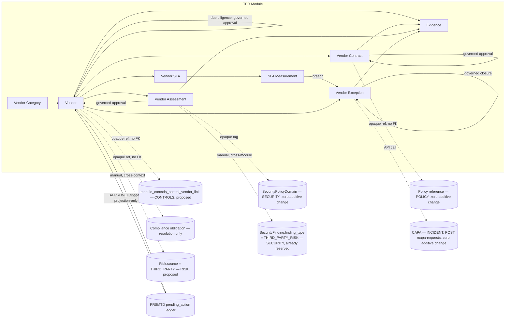
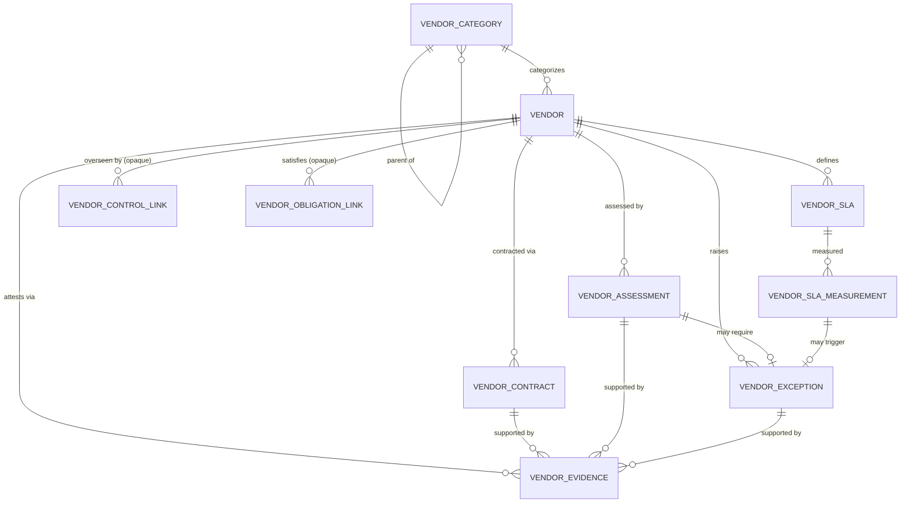
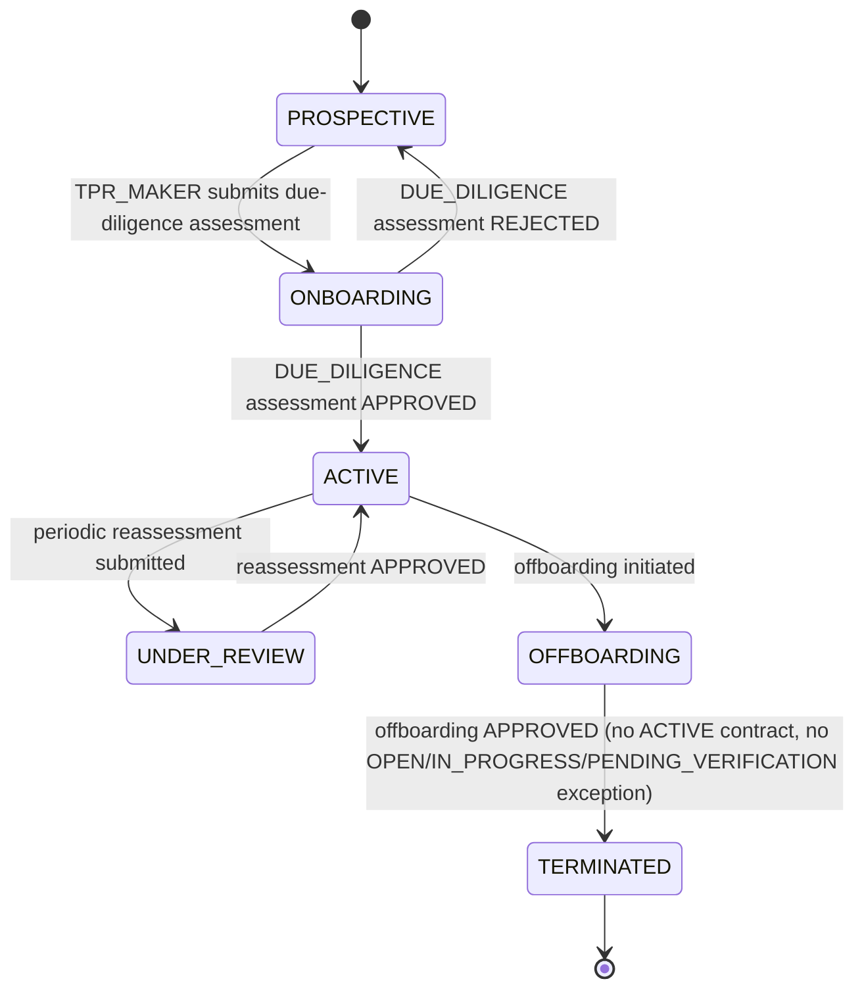
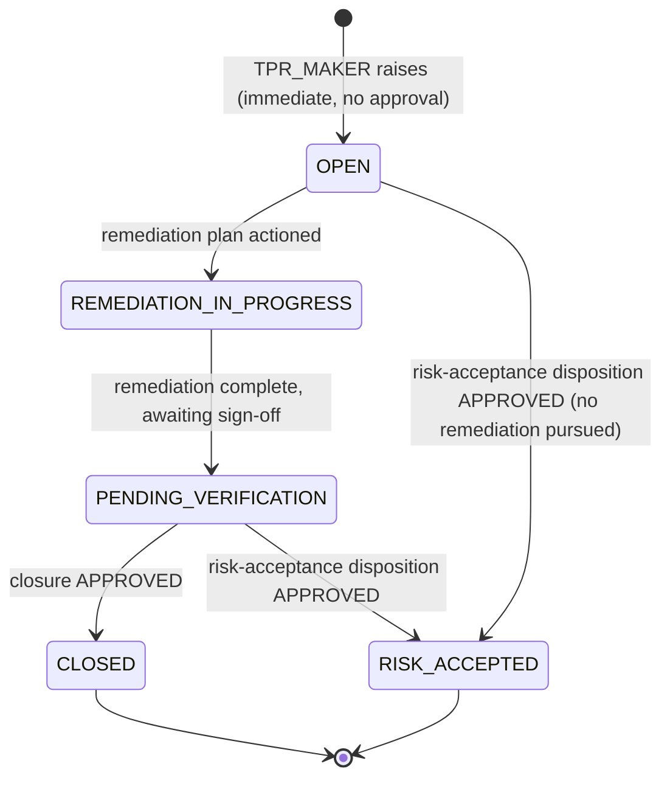
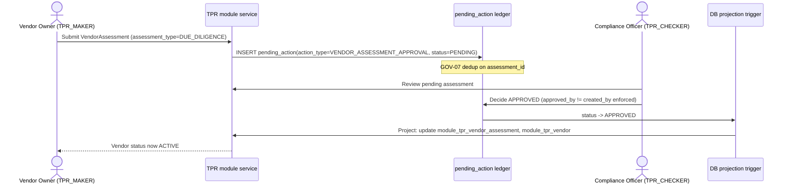
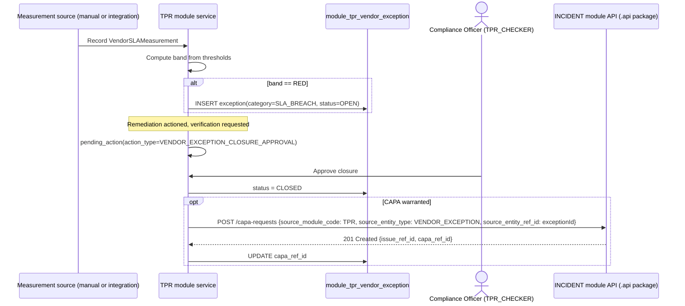
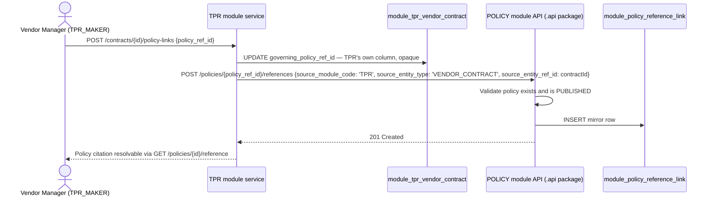

# 25.01 — Third-Party Risk Management

## Purpose

Defines the Third-Party Risk Management capability: vendor/third-party lifecycle management
(onboarding through offboarding), vendor classification and criticality, due diligence,
inherent/residual vendor-risk assessment, security and compliance assessment of vendors,
contract and regulatory-obligation tracking, SLA definition and ongoing monitoring, and
periodic reassessment — built entirely on PRSMTD's existing multi-tenant, governance, RBAC,
and audit substrate. This is the repository's **ninth authoritative, implementation-ready
specification**. It activates the `THIRD-PARTY RISK` bounded context
[`04-domain-model/01-enterprise-domain-model.md`](../04-domain-model/01-enterprise-domain-model.md#third-party-risk-reserved)
reserved since Session 3, and — unlike every prior module except `RISK` itself — is authored
against a boundary no frozen spec's own body previously named as a blocking forward reference;
its genuinely new work is regulatory-citation (the Annexures' dedicated Outsourcing Risk
section, not yet mined by any prior spec) and cross-module integration breadth (this module
touches more already-authored modules than any prior one).

## Scope

**In scope**: vendor/third-party master data and lifecycle (prospective → onboarding → active
→ under review → offboarding → terminated), vendor classification and criticality/materiality
rating, vendor contract and SLA-term tracking, pre-onboarding due diligence, inherent/residual
vendor-risk assessment (rating, not a duplicate quantitative scoring engine), vendor security
assessment, vendor compliance assessment, ongoing SLA monitoring and threshold-based bands,
periodic (at least annual) reassessment, vendor exceptions (SLA breach, contract
non-compliance, service disruption, due-diligence finding) with governed closure, and this
module's security/audit/reporting/API surface.

**Out of scope** (forward-referenced, not yet specified, or explicitly deferred):
- A dedicated quantitative vendor-risk scoring engine duplicating `RISK`'s
  `RiskScoringMatrix` — vendor risk is rated (`LOW`/`MEDIUM`/`HIGH`/`CRITICAL`), not
  independently likelihood-×-impact-scored, mirroring `13-audit`'s own `AuditUniverseEntry`
  design choice (see Assumption 10).
- A general-purpose vendor pool/exit-strategy comparison tool (Annexures §2.9.3.2(i)(b),
  recommendatory not mandatory) — named, not designed (see [Future Extension Points](#future-extension-points)).
- Fraud-specific vendor monitoring (Annexures §2.9.3.2(i)(a), recommendatory) — a Vendor
  Exception's `category` can represent a fraud-related finding, but no dedicated fraud
  detection capability is designed here.
- The Sales and Distribution Risk section of the Annexures (§2.10) beyond seeding a
  `Distribution & Marketing Channel` vendor category — commission/brokerage/mis-selling
  controls remain `COMPLIANCE`'s `Market Conduct` obligation category and `12-controls`' own
  `Distribution & Marketing` control family, not duplicated here.
- A platform document/object storage capability — evidence is modeled as metadata plus an
  opaque storage pointer, the same confirmed gap every prior evidence-bearing module
  inherits, not re-designed here.
- Regulatory profiles other than `SEBI_AMC` — the schema is profile-configurable per the
  established pattern; only `SEBI_AMC` seed content is defined here.

## Business Context

SEBI's Master Circular Annexures name outsourcing/vendor management as its own dedicated risk
category, §2.9 "Outsourcing Risk," distinct from and complementary to the Operational Risk
(§2.5), Financial Reporting Risk (§2.11), and Compliance Risk (§2.6) sections earlier modules
already cited: "Asset management companies often rely on third parties including Custodians,
Fund Administrators, R&T agents, and various types of outsourced service providers... asset
managers have ongoing fiduciary obligations to their customers even though they have delegated
certain of their roles to others" (§2.9.2). No frozen spec in this repository owns that
obligation as a first-class register today — `10-risk`'s own seed taxonomy carries a
"Third-Party Risks" sub-category with nothing behind it but a free-text risk description,
`12-controls`' seed taxonomy carries a "Third-Party/Outsourcing Oversight" control family that
tests SLA oversight but has no vendor master record to test *against*, `11-compliance` and
`23-policy` each seed an "Outsourcing & Related-Party Oversight" category/policy citing the
existence of a Board-approved Outsourcing Policy but not the vendor relationships that policy
governs, `13-audit`'s audit universe already reserves an `entry_type = VENDOR` value with
nothing to resolve it to, and `09-security`'s `SecurityFinding.finding_type` already reserves
a `THIRD_PARTY_RISK` value with no vendor register to attribute a finding to. This module is
the missing vendor master record and governed lifecycle every one of those six forward
references has been waiting on since its own authoring — the same "activates a
long-standing forward reference" role `12-controls` played for `10-risk`'s opaque
`control_ref_id`.

Because this module arrives after six sibling modules already exist (`RISK`, `CONTROLS`,
`COMPLIANCE`, `AUDIT`, `SECURITY`, `POLICY`, `INCIDENT`), it is also the first module in this
repository built as a genuine consumer of nearly the entire existing integration surface at
once, rather than reserving forward references for modules not yet written — see
[Architecture](#architecture) and the per-module Integration sections below.

## Regulatory Drivers

Source: [`../reference/Annexures to Master Circular for Mutual Funds as on March 31,
2023_p.pdf`](../reference/Annexures%20to%20Master%20Circular%20for%20Mutual%20Funds%20as%20on%20March%2031%2C%202023_p.pdf)
§2.9 "Outsourcing Risk" — text-extractable, clause-level precision, not previously mined by
any frozen spec (Assumption/confirmation of the gap the Master Execution Plan's own Phase 8
entry flagged). §2.10 "Sales and Distribution Risk" re-cited at scope level only, for the
`Distribution & Marketing Channel` vendor category.

| Driver | Circular reference | How this spec satisfies it |
|---|---|---|
| Risk management over outsourced activity performed as if done in-house | §2.9.3.1(i), mandatory | Every Vendor is a first-class governed register entry with the same lifecycle rigor (governed approval, evidence, exception management) as an internally-performed process would receive under `CONTROLS`. |
| A dedicated person responsible for each outsourced vendor's activities | §2.9.3.1(ii), mandatory | `Vendor.vendor_owner_user_id` — a mandatory, single accountable owner per Vendor (Data Model). |
| Board-approved Outsourcing Policy covering seventeen named elements (core-activity restrictions, procedure, monitoring, information security, selection criteria, quality standards, tenure, responsibility, deviation tolerance, periodic SLA/pricing review, sub-delegation restriction, inspection/audit rights, approval authorities, SLA, archival, insurance, incident reporting) | §2.9.3.1(iii) a–q, mandatory | The Outsourcing Policy itself is authored in `23-policy` (its `Outsourcing & Related-Party Oversight` `PolicyCategory`, re-cited); this module's `VendorContract` structurally captures the operative elements — SLA terms, tenure, right-to-audit, sub-delegation restriction, insurance requirement, exit-strategy flag — and cites the governing Policy record via an opaque reference (see [Integration with Policy](#integration-with-policy)). |
| Pre-outsourcing due diligence, including AML/CFT where applicable, and risk/materiality assessment before an activity is outsourced | §2.9.3.1(iv), mandatory | `VendorAssessment` (`assessment_type = DUE_DILIGENCE`), governed, required before a Vendor can reach `ACTIVE` — see [Domain Model](#domain-model), [Workflows](#workflows). |
| Post-outsourcing periodic review of vendor process/people/systems, at least annually for Fund Accounting and R&T functions specifically | §2.9.3.1(v)(a)–(b), mandatory | `VendorAssessment` (`trigger = PERIODIC`), with `Vendor.next_reassessment_date`/`reassessment_frequency_days` surfaced when overdue — see [Reporting Requirements](#reporting-requirements). |
| A structured tool to review/benchmark service providers against SLA | §2.9.3.1(v)(c), mandatory | `VendorSLA`/`VendorSLAMeasurement` — a threshold-banded, append-only time series, mirroring `10-risk`'s own KRI/KRIMeasurement shape exactly (see [Vendor SLA Monitoring](#vendor-sla-monitoring)). |
| Documented review results, highlighted risks, and monitored remediation plans | §2.9.3.1(v)(d), mandatory | `VendorException` — immediate-raise, governed-closure, with `remediation_plan`/`remediation_owner_user_id`/`target_closure_date` fields, mirroring `ControlException` exactly. |
| Communication of error tolerance/code of conduct to service providers; service-provider-side BCP/DR testing | §2.9.3.1(v)(e)–(f), mandatory | Modeled as `VendorContract` terms and `VendorAssessment` findings, not a bespoke workflow — no new mechanism required. |
| Reconciliation between fund accounting, R&T, and bank records; periodic audit of R&T-agent-carried investor activity | §2.9.3.1(vi), mandatory | Out of scope for this module — reconciliation controls are already seeded under `12-controls`' `Operations & Reconciliation` control family (§2.5, re-cited); this module supplies the vendor master record `AUDIT`'s own periodic audit would cite. |
| Fund accounting system validation, price-variance flagging | §2.9.3.1(vii), mandatory | Out of scope — an operational control, not a vendor-register concern; belongs to `12-controls`' existing `Financial Reporting & Fund Accounting` family. |
| Fraud vulnerability assessment and exit-strategy/alternate-provider pool | §2.9.3.2(i)(a)–(b), recommendatory | Not designed at MVP — `VendorException.category` can represent a fraud-related finding; a dedicated exit-strategy/pool-comparison capability is named in [Future Extension Points](#future-extension-points), not built. |
| Monitoring risk of distribution-channel relationships (banks, IAs, brokers, NBFCs, distributors) | §2.10, re-cited at scope level | `Distribution & Marketing Channel` seed `VendorCategory` (see [Vendor Taxonomy](#vendor-taxonomy)); mis-selling/commission controls remain `COMPLIANCE`'s `Market Conduct` obligation category, not duplicated here. |
| IT-system/vendor scope of the System Audit Program | Annexure 8 (re-cited from `13-audit`) — AMCs "responsible for ensuring adequate and effective control environment... including at vendors/third parties supporting operations like RTAs, Fund Accountants, Custodians" | `Vendor` is the master record `13-audit`'s already-reserved `AuditUniverseEntry.entry_type = VENDOR` value resolves to — see [Integration with Audit](#integration-with-audit). |
| Cyber security policy and technical/organizational controls over vendor relationships | Cyber Security and Cyber Resilience Framework for Mutual Funds AMCs — cited at scope level, inherited per `12-controls` Assumption 5 | `VendorAssessment` (`assessment_type = SECURITY_ASSESSMENT`), taggable to `SECURITY`'s existing `Third-Party and Outsourcing Security` Security Policy Domain — see [Integration with Security](#integration-with-security). |
| Maker-checker authorization on vendor onboarding, contract approval, and exception closure | Best-practice pattern across the Annexures, same as every prior module | Reuses PRSMTD's `pending_action` governance ledger — see [Workflows](#workflows). |

## Assumptions

1. **Tenant = one AMC.** Same as every prior module — this module is entirely tenant-plane
   data.
2. **Regulatory profile is configuration, not schema.** The `SEBI_AMC` vendor category
   taxonomy is seeded reference data (`module_tpr_vendor_category`), not hardcoded categories,
   mirroring `10-risk` Assumption 2 / `12-controls` Assumption 2 exactly.
3. **Users referenced by this module** (`vendor_owner_user_id`, `assessor_user_id`, etc.)
   **are platform/tenant identity records**, not module-owned data — same reasoning as every
   prior module's identical assumption.
4. **Record retention** is deferred to `11-compliance`, same as every prior module.
5. **`VendorCategory` is not a specialization of `RISK`'s `RiskCategory`, resolving
   `04-domain-model`'s own open question.** That document's Future Enhancements named "Third
   Party Risk's relationship to `RiskCategory`... left open for that context's own spec —
   whether `VendorRiskCategory` is a genuinely separate taxonomy or a seeded sub-tree of
   `RISK`'s existing `RiskCategory` hierarchy." This spec resolves it: `VendorCategory` (this
   module's own reference table, see [Vendor Taxonomy](#vendor-taxonomy)) classifies *what
   kind of vendor* a Vendor is (Custodian, RTA, IT Service Provider...) — it is not a risk
   taxonomy at all. A Vendor-sourced Risk register entry (via the proposed
   `Risk.source = THIRD_PARTY` value — see [Integration with Risk Management](#integration-with-risk-management))
   is categorized using `RISK`'s own already-seeded `RiskCategory` sub-category "Other
   Business Risks → Third-Party Risks" (present in `10-risk`'s original `SEBI_AMC` seed since
   Session 1 — no taxonomy change needed on `RISK`'s side at all, only the `source` enum
   value). No `VendorRiskCategory` entity is designed. This spec proposes, but does not apply,
   the corresponding `04-domain-model` Future Enhancements closure — see
   [Dependencies](#dependencies).
6. **This is the first module authored after `INCIDENT`/`ISSUE`/`CAPA` already existed**,
   unlike `12-controls`/`11-compliance`/`23-policy` (each authored before `24-incident-issue-capa`
   and each only able to *propose* a `capa_ref_id` extension for a later session to apply).
   This spec therefore builds `VendorException.capa_ref_id` and its initiating endpoint
   directly, calling `INCIDENT`'s already-built `POST /capa-requests` convenience endpoint —
   see [Integration with Incident/Issue/CAPA](#integration-with-incidentissuecapa). No change
   to `24-incident-issue-capa/01-*` is required or proposed for this integration.
7. **`POLICY`'s `PolicyReferenceLink` design is confirmed reusable with zero additive change
   by a third citing module.** `23-policy/01-*`'s own domain model states its polymorphic
   mirror table was "chosen specifically so a future third or fourth citing module needs only
   a new enum value, not a new migration." This module is that third citing module
   (`CONTROLS` and `COMPLIANCE` were the first two) — see
   [Integration with Policy](#integration-with-policy). Both the resolution direction
   (`GET /policies/{id}/reference`) and the mirror-registration direction
   (`POST /policies/{id}/references`) are reused as-is.
8. **`COMPLIANCE`'s `POST /obligations/{id}/references` mirror-registration endpoint is
   *not* assumed reusable without verification.** Unlike `POLICY`'s explicitly-polymorphic
   design (Assumption 7), `11-compliance/01-*`'s own APIs table describes this endpoint as
   registering "a mirror reference from `CONTROLS`" specifically, and its target table
   (`module_compliance_obligation_control_link`) is named after `CONTROLS`, the same
   single-caller shape `12-controls`' own `POST /controls/{id}/references` was documented to
   have before `COMPLIANCE` needed — and received — a dedicated new endpoint
   (`POST /controls/{id}/obligation-links`) rather than reusing it directly. This spec
   therefore treats only the resolution direction (`GET /obligations/{id}/reference`, a
   read-only, caller-agnostic endpoint guarded solely by `COMPLIANCE_VIEW`) as zero-additive-
   change, and proposes, but does not apply, whatever extension `COMPLIANCE`'s mirror-
   registration direction needs — see [Integration with Compliance Management](#integration-with-compliance-management).
9. **`CONTROLS`' `POST /controls/{id}/references` mirror-registration endpoint is likewise
   not assumed reusable.** `12-controls/01-*` itself states this endpoint "is hardcoded to the
   *Risk* mirror's column shape... and cannot serve" a second citing module's need — the exact
   reasoning that produced a dedicated `POST /controls/{id}/obligation-links` for `COMPLIANCE`.
   This spec proposes, but does not apply, an analogous `POST /controls/{id}/vendor-links`
   endpoint, and treats only `GET /controls/{id}/reference` as zero-additive-change — see
   [Integration with Controls Management](#integration-with-controls-management).
10. **Vendor risk rating is a band, not a duplicate quantitative scoring engine.**
    `Vendor.inherent_risk_rating`/`residual_risk_rating` are `LOW`/`MEDIUM`/`HIGH`/`CRITICAL`
    bands set from a `VendorAssessment` (`assessment_type = RISK_ASSESSMENT`), deliberately
    mirroring `13-audit`'s own `AuditUniverseEntry.risk_rating` design choice ("carrying its
    own audit-specific risk rating... independent of `RISK`'s residual risk score") rather
    than re-implementing `RISK`'s `RiskScoringMatrix` likelihood-×-impact infrastructure a
    second time. A Vendor's own rating and any downstream `Risk` register entry it seeds
    (via the proposed `Risk.source = THIRD_PARTY` value) are two independent facts, the same
    non-duplicative relationship `AUDIT`'s own universe rating has to `RISK`'s residual score.
11. **The Cyber Security and Cyber Resilience Framework for Mutual Funds AMCs (2019) PDF
    remains scanned/image-only** in this environment — inherited unchanged from `12-controls`
    Assumption 5, cited at scope level only for `VendorAssessment`'s `SECURITY_ASSESSMENT`
    type.
12. **Vendor Owner and Checker are always distinct individuals.** Segregation of duties is
    enforced by PRSMTD's platform-level `approved_by <> created_by` constraint on
    `pending_action`, same mechanism every prior module relies on; no bespoke SoD mechanism is
    designed here.
13. **A Vendor Contract's own approval (`VENDOR_CONTRACT_APPROVAL`) is a distinct governed
    action from the Vendor's own onboarding due-diligence approval.** A Vendor may exist
    (`ONBOARDING` status, due diligence in progress) before any contract is signed, and a
    single Vendor may accumulate more than one `VendorContract` over its lifetime (renewals,
    scope amendments) — the contract lifecycle is not folded into the Vendor's own status
    machine, mirroring how `RISK`'s `RiskTreatmentPlan` is a distinct governed child entity
    from the Risk's own assessment-driven status.

## Dependencies

- PRSMTD `docs/authoritative/system.md` §3 (Governance model, GOV-07), §7 (Data model & RLS
  enforcement), §8 (RBAC model), §9 + §5a–§5c (Module framework, ownership guards), §4.1
  (Observability & Deterministic Trace Contract), §10 (Audit and compliance), §21
  (Authentication Surface Ownership) — all reused as-is, no PRSMTD changes required by this
  spec.
- [`../reference/Annexures to Master Circular for Mutual Funds as on March 31,
  2023_p.pdf`](../reference/Annexures%20to%20Master%20Circular%20for%20Mutual%20Funds%20as%20on%20March%2031%2C%202023_p.pdf)
  §2.9 (Outsourcing Risk, primary source), §2.10 (Sales and Distribution Risk, scope-level
  re-citation) — regulatory sources.
- [`04-domain-model/01-enterprise-domain-model.md`](../04-domain-model/01-enterprise-domain-model.md)
  — **not modified by this spec.** Its `THIRD-PARTY RISK (reserved)` bounded-context entry
  (Customer-Supplier, `RISK` is customer) and its own open question about `VendorRiskCategory`
  are the frozen inputs this spec activates and resolves (Assumption 5) but does not edit.
  This spec proposes, but does not apply, the `THIRD-PARTY RISK (reserved)` →
  `THIRD-PARTY RISK (authored)` status-label amendment, the same amendment shape `SECURITY`/
  `POLICY`/`INCIDENT` each proposed for their own onboarding.
- [`10-risk/01-enterprise-risk-management.md`](../10-risk/01-enterprise-risk-management.md) —
  **not modified.** Its already-seeded `RiskCategory` sub-category "Other Business Risks →
  Third-Party Risks" needs no change; this spec proposes, but does not apply, a
  `Risk.source = THIRD_PARTY` enum value.
- [`12-controls/01-controls-management.md`](../12-controls/01-controls-management.md) — **not
  modified.** Its already-seeded `Third-Party/Outsourcing Oversight` control family needs no
  change; this spec proposes, but does not apply, a `Control.source = THIRD_PARTY_RISK` value
  plus a `POST /controls/{id}/vendor-links` endpoint (Assumption 9). `GET /controls/{id}/reference`
  is reused with zero additive change.
- [`11-compliance/01-compliance-management.md`](../11-compliance/01-compliance-management.md)
  — **not modified.** `GET /obligations/{id}/reference` is reused with zero additive change;
  this spec proposes, but does not apply, an extension to the mirror-registration direction
  (Assumption 8).
- [`23-policy/01-policy-management.md`](../23-policy/01-policy-management.md) — **not
  modified.** Both `GET /policies/{id}/reference` and `POST /policies/{id}/references` are
  reused with zero additive change (Assumption 7).
- [`09-security/01-security-management.md`](../09-security/01-security-management.md) — **not
  modified.** `GET /policy-domains` is reused with zero additive change; the already-reserved
  `SecurityFinding.finding_type = THIRD_PARTY_RISK` value is activated with zero additive
  change; this spec proposes, but does not apply, a `SecurityFinding.linked_vendor_id` column.
- [`13-audit/01-audit-management.md`](../13-audit/01-audit-management.md) — **not modified.**
  Its already-reserved `AuditUniverseEntry.entry_type = VENDOR` value is activated
  conceptually; this spec proposes, but does not apply, a
  `related_vendor_ref_id` opaque column so it can resolve to a real Vendor record.
- [`24-incident-issue-capa/01-incident-issue-capa-management.md`](../24-incident-issue-capa/01-incident-issue-capa-management.md)
  — **not modified.** `POST /capa-requests` is reused with zero additive change (Assumption
  6); this spec proposes, but does not apply, an `Incident.vendor_ref_id` opaque column so
  `INCIDENT`'s already-reserved "Third-Party / Vendor" category can resolve to a real Vendor.
- `docs/05-modules/README.md` — confirmed index-only (Session 9); no separate per-module
  `05-modules/`/`06-data-model/`/`08-api/` document is expected for this module.

## Architecture

The Third-Party Risk capability is one PRSMTD module: **module code `TPR`**. It follows the
generic module framework exactly as every prior module does (system.md §9/§5a–§5c):

- `moduleId`: a stable UUID minted at implementation time, not fixed by this specification.
- Table prefix: `module_tpr_*` (OWN-03 schema ownership).
- Route namespace: `/modules/TPR` (§5b4).
- API namespace: `/api/v1/modules/tpr/**`, controllers in `com.prsbnjs.modules.tpr` (OWN-07).
- Module role types: `MAKER`, `CHECKER`, `VIEWER` only — the closed set (system.md §8). Domain
  personas map onto these three; see [Authorization](#authorization).
- `dependencies: [CONTROLS, COMPLIANCE, POLICY, SECURITY, INCIDENT]`. This is the largest
  dependency declaration of any module in this repository to date — a direct consequence of
  being the ninth module authored, sitting atop nearly the entire existing integration
  surface rather than reserving forward references for modules that do not yet exist. Every
  edge is justified by a genuine synchronous cross-module API call this module's own
  workflows make (per `04-domain-model` Dependency Rule 6 — a hard edge is declared only when
  a real API call is required, not merely when data conceptually relates), enumerated in each
  Integration section below. **`RISK` is deliberately absent from this list**: per
  `04-domain-model`'s own Customer-Supplier framing (`THIRD-PARTY RISK` supplies, `RISK`
  consumes), `Risk.source = THIRD_PARTY` is a manual, cross-context creation, not a service
  call — the same descriptive-not-automated `source` pattern every prior risk-sourcing module
  uses (see [Integration with Risk Management](#integration-with-risk-management)).
- No platform-plane tables, no platform-plane governance actions — every governed action is
  tenant-plane (`app.plane = 'tenant'`).
- Tenant isolation, GUC binding, and session-setter usage are inherited unmodified from
  `TenantAwareDataSource` (system.md §7) — this module issues no direct `SET`/`set_config`
  calls.
- **Cross-module access is API-mediated only (OWN-08/OWN-09).** This module never reads
  another module's tables directly; every reference below is an opaque UUID resolved via the
  target module's `.api`/`.client` package.



## Domain Model

**Bounded context**: Third-Party Risk Management. Owns the vendor master record and its
lifecycle exclusively; treats Risk (downstream — a Vendor is a specialized risk source),
Controls (a Vendor cites the oversight control that tests it), Compliance (a Vendor cites the
obligation its outsourcing relationship must satisfy), Policy (a Vendor Contract cites the
governing Outsourcing Policy), Security (a Vendor's security assessment may corroborate or
raise a Security Finding), Audit (a Vendor is a citable audit-universe entry), and
Incident/CAPA (a Vendor Exception may escalate to a structured CAPA) as external contexts it
references but does not own — the same customer-supplier/opaque-reference framing every prior
module uses for its own external references.

**Ubiquitous language** (extends, does not redefine, `04-domain-model`'s canonical glossary —
per that document's own closing note, a term already defined there means the same thing here):

| Term | Definition |
|---|---|
| Vendor | A third-party counterparty (custodian, fund accountant, R&T agent, distribution channel, IT service provider, or other outsourced service provider) whose engagement with the AMC is tracked through a governed lifecycle and whose own risk profile is a specialized `RISK` source. |
| Vendor Category | A configurable taxonomy classifying *what kind* of vendor a Vendor is — not a risk taxonomy (Assumption 5). |
| Criticality | A Vendor's materiality classification (`LOW`/`MEDIUM`/`HIGH`/`CRITICAL`), driving reassessment frequency and escalation posture — the "risk and materiality assessment" the Annexures require before outsourcing (§2.9.3.1(iv)(b)). |
| Vendor Contract | The governed record of the legal/commercial relationship with a Vendor — SLA terms, tenure, right-to-audit, sub-delegation restriction, insurance requirement, exit-strategy flag, and a citation of the governing Outsourcing Policy. |
| Vendor Assessment | A point-in-time evaluation of a Vendor, subject to maker-checker approval, of one of four types: due diligence, risk assessment, security assessment, or compliance assessment. |
| Due Diligence | The mandatory pre-outsourcing (and, by extension, pre-renewal) `VendorAssessment` that gates a Vendor's activation. |
| Vendor Risk Rating | A Vendor's own inherent/residual risk band (`LOW`/`MEDIUM`/`HIGH`/`CRITICAL`), independent of but able to seed a `RISK` register entry — mirrors `AUDIT`'s own audit-universe risk rating design (Assumption 10). |
| Vendor SLA | A measurable, tracked-over-time performance threshold for a Vendor, mirroring `RISK`'s own KRI shape exactly. |
| Vendor Exception | A documented instance where a Vendor breached an SLA, failed a contractual or due-diligence expectation, or caused a service disruption or data incident, tracked to a governed closure or formal risk acceptance. |

**Aggregates, entities, and invariants**:

- **Vendor** (aggregate root) — Cannot reach `ACTIVE` without at least one `APPROVED`
  `VendorAssessment` of `assessment_type = DUE_DILIGENCE`. Cannot reach `TERMINATED` while it
  has a `VendorContract` in status `ACTIVE`, or a `VendorException` in status `OPEN`,
  `REMEDIATION_IN_PROGRESS`, or `PENDING_VERIFICATION` (must be `CLOSED`/`RISK_ACCEPTED`, and
  every contract `EXPIRED`/`TERMINATED`, first) — the same "no-retirement-while-active-work-
  exists" shape every prior aggregate root enforces.
- **VendorContract** (entity, owned by Vendor) — One or more per Vendor over its lifetime
  (Assumption 13); immutable material terms once `ACTIVE` — a renewal or amendment is a new
  row, never an edit of an approved one, mirroring `RiskAssessment`'s append-only shape.
- **VendorAssessment** (entity, owned by Vendor) — Immutable once `APPROVED`; append-only
  history, mirroring `ControlTest` exactly (one entity, four `assessment_type` values, rather
  than four separate entities — the same test/assessment consolidation choice `12-controls`
  Assumption 9 and `23-policy`'s unified `Policy` document-type discriminator each already
  made).
- **VendorException** (entity, owned by Vendor) — Raised immediately by a `TPR_MAKER` (no
  governance required to open); closure or `RISK_ACCEPTED` disposition requires `TPR_CHECKER`
  approval, mirroring `ControlException`/`ComplianceException`/`PolicyException` exactly.
  Reserves `capa_ref_id` directly (Assumption 6) — the first such column in this repository
  built rather than merely proposed at its owning module's own authoring time.
- **VendorSLA** (entity, owned by Vendor) — Definitional/reference-like but modeled as an
  owned entity (not top-level reference data) since an SLA is specific to one Vendor (and
  optionally one Contract), mirroring `RISK`'s `KRI` shape exactly, one level down (a `KRI` is
  an independent aggregate root that may optionally link to a Risk; a `VendorSLA` is instead
  always owned by its Vendor, since every SLA the Annexures name is inherently
  vendor-specific).
- **VendorSLAMeasurement** (entity, owned by VendorSLA) — Append-only time series; never
  updated after creation, mirroring `KRIMeasurement` exactly.
- **VendorEvidence** (entity, attached to exactly one of Vendor, VendorContract,
  VendorAssessment, or VendorException) — Immutable metadata once uploaded, mirroring
  `ControlEvidence`'s shape, extended to a fourth attachment point (the same "exactly one of
  N" pattern `23-policy`'s and `24-incident-issue-capa`'s own Evidence entities already use at
  three and four points respectively, not a new pattern at four).
- **VendorCategory** (reference data) — Two-level hierarchy (category → sub-category),
  regulatory-profile-seeded, tenant-editable — same shape as every prior taxonomy.
- **VendorControlLink** (entity, owned by Vendor) — Opaque, no-FK reference to a `CONTROLS`
  control (e.g., the SLA-oversight control that tests this Vendor relationship), resolved via
  `CONTROLS`' existing `GET /controls/{id}/reference` — see
  [Integration with Controls Management](#integration-with-controls-management).
- **VendorObligationLink** (entity, owned by Vendor) — Opaque, no-FK reference to a
  `COMPLIANCE` obligation (e.g., the Outsourcing obligation this vendor relationship
  satisfies), resolved via `COMPLIANCE`'s existing `GET /obligations/{id}/reference` — see
  [Integration with Compliance Management](#integration-with-compliance-management).

### Vendor Taxonomy

`module_tpr_vendor_category` is seeded per regulatory profile, tenant-editable via
`TPR_ADMIN`, same shape as every prior taxonomy. The `SEBI_AMC` seed set, grounded in
[Regulatory Drivers](#regulatory-drivers):

| Category | Examples / notes | Source |
|---|---|---|
| Custodian | Securities custody, settlement | Annexures §2.9.2 |
| Fund Accountant | NAV computation, fund accounting | Annexures §2.9.2, §2.9.3.1(vii) |
| Registrar & Transfer Agent (RTA) | Investor records, allotment/redemption processing | Annexures §2.9.2, §2.9.3.1(vi) |
| Distribution & Marketing Channel | Banks, Investment Advisers, brokers, NBFCs, distributors | Annexures §2.10 (re-cited, scope-level) |
| IT & Technology Service Provider | Software vendor, cloud/infrastructure provider, managed security service | System Audit Program Checklist §§1, 3 (re-cited from `12-controls`) |
| Other Outsourced Service Provider | Print/dispatch, call centre, other operational BPO | Annexures §2.9.2 (general) |

### Vendor SLA Monitoring

`VendorSLA` mirrors `10-risk`'s `KRI` shape precisely — `threshold_green`/`threshold_amber`/
`threshold_red`, `direction ∈ HIGHER_IS_WORSE, LOWER_IS_WORSE`, `measurement_frequency` — and
`VendorSLAMeasurement` mirrors `KRIMeasurement`: an append-only time series with `band`
computed on write from the SLA's thresholds. A measurement landing in the `RED` band creates a
`VendorException` (`category = SLA_BREACH`) automatically, the same "breach creates a governed
follow-up record" pattern `10-risk`'s KRI-breach-to-Escalation rule and `12-controls`'
`FAIL`-result-requires-Exception rule both already establish — enforced at the
application-service layer, not a DB constraint, consistent with GOV-07's own enforcement
pattern.

## Functional Requirements

| ID | Requirement | Regulatory tie |
|---|---|---|
| FR-01 | The system shall provide a configurable, two-level vendor category taxonomy, seeded per regulatory profile. | Annexures §2.9.3 |
| FR-02 | `TPR_MAKER` users shall create and edit Vendor records while in `PROSPECTIVE` or `ONBOARDING` status. | — |
| FR-03 | Every Vendor shall carry a mandatory `criticality` classification and exactly one accountable `vendor_owner_user_id`. | Annexures §2.9.3.1(ii)–(iii)(b), mandatory |
| FR-04 | A Vendor shall not reach `ACTIVE` without at least one `APPROVED` `VendorAssessment` of `assessment_type = DUE_DILIGENCE`. | Annexures §2.9.3.1(iv), mandatory |
| FR-05 | The system shall support `RISK_ASSESSMENT`-, `SECURITY_ASSESSMENT`-, and `COMPLIANCE_ASSESSMENT`-type Vendor Assessments, each independently updating the Vendor's own rating/outcome fields on `APPROVED`. | Annexures §2.9.3.1(iv)(b); Cyber Security Framework (scope-level) |
| FR-06 | The system shall track `next_reassessment_date` per Vendor and surface overdue reassessments; the default cadence shall be no less frequent than annual. | Annexures §2.9.3.1(v)(a)–(b), mandatory |
| FR-07 | The system shall support one or more `VendorContract` records per Vendor, capturing SLA summary, tenure, right-to-audit, sub-delegation restriction, insurance requirement, and exit-strategy flags, subject to maker-checker approval before reaching `ACTIVE`. | Annexures §2.9.3.1(iii) a–q, mandatory |
| FR-08 | The system shall support `VendorSLA` definitions with green/amber/red thresholds and configurable measurement frequency, and `VendorSLAMeasurement` as an append-only time series. | Annexures §2.9.3.1(v)(c), mandatory |
| FR-09 | A `VendorSLAMeasurement` landing in the `RED` band shall automatically create a `VendorException` (`category = SLA_BREACH`). | Annexures §2.9.3.1(v)(d), mandatory |
| FR-10 | The system shall support Vendor Exceptions, raised immediately by a maker without prior approval, with governed closure (`CLOSED` or `RISK_ACCEPTED`) requiring checker approval. | Annexures §2.9.3.1(v)(d), mandatory |
| FR-11 | A Vendor shall not be terminable while any Exception remains `OPEN`, `REMEDIATION_IN_PROGRESS`, or `PENDING_VERIFICATION`, or any Contract remains `ACTIVE`. | — |
| FR-12 | A `VendorException` shall expose a `capa_ref_id` resolving to a CAPA record via `INCIDENT`'s existing `POST /capa-requests` endpoint. | Activates `24-incident-issue-capa` with zero additive change (Assumption 6) |
| FR-13 | Evidence shall attach to exactly one of a Vendor, a VendorContract, a VendorAssessment, or a VendorException, and shall record an integrity hash of the underlying artifact. | — |
| FR-14 | A Vendor shall expose a cross-module reference-resolution API so that `13-audit`'s already-reserved `AuditUniverseEntry.entry_type = VENDOR` and `24-incident-issue-capa`'s reserved "Third-Party / Vendor" Incident category can resolve to a real Vendor record. | Activates `13-audit`/`24-incident-issue-capa`'s reserved forward references |
| FR-15 | A Vendor shall support zero or more opaque, non-FK links to `CONTROLS` controls (`module_tpr_vendor_control_link`) and `COMPLIANCE` obligations (`module_tpr_vendor_obligation_link`), resolved via each module's existing reference-resolution API. | — |
| FR-16 | A `VendorContract` shall support an optional opaque, non-FK citation of the governing `POLICY` Outsourcing Policy, resolved and mirror-registered via `POLICY`'s existing reference APIs with zero additive change. | Activates `23-policy` FR-15 |
| FR-17 | A `MAJOR_FINDINGS`/`UNSATISFACTORY` outcome on a `SECURITY_ASSESSMENT`-type Vendor Assessment may be used to create a `SecurityFinding` in `SECURITY` using its already-reserved `finding_type = THIRD_PARTY_RISK` value, resolved by manual cross-context action, not a synchronous service call. | Activates `09-security`'s reserved `finding_type` value with zero additive change |
| FR-18 | A `HIGH`/`CRITICAL` Vendor Exception or Vendor risk rating may be used to create or link a Risk register entry via `RISK`'s proposed (not yet applied) `Risk.source = THIRD_PARTY` value. | Proposed activation of a new `10-risk` enum value |
| FR-19 | Visibility shall be role-scoped: `TPR_VIEWER` — full tenant register, read-only; `TPR_MAKER` — full read, edit own drafts/assessments/exceptions; `TPR_CHECKER` — full read, plus all pending approvals across the tenant. | — |
| FR-20 | The independent due-diligence/assessment sign-off function shall be satisfiable purely by role assignment (Compliance Officer, Risk Management Committee, or an external due-diligence agency holding `TPR_MAKER`/`TPR_CHECKER` as appropriate) — no code change required per assignment choice. | Mirrors every prior module's identical FR |
| FR-21 | Every governed state transition shall be captured in the platform audit trail using canonical, non-aliased `action_type` values. | system.md §10 |

## Non-Functional Requirements

| Category | Requirement |
|---|---|
| Multi-tenancy | Full tenant isolation via PRSMTD RLS (system.md §7); zero platform-plane data in this module. |
| Performance | Vendor register list/filter queries shall return p95 < 500ms for tenants with up to 2,000 active vendor records (a smaller expected ceiling than `RISK`/`CONTROLS`, since vendor counts are materially lower than risk/control record counts at a typical AMC). |
| Scalability | Schema and query patterns must not assume a ceiling on tenant count or per-tenant vendor/assessment/measurement volume beyond the platform's general multi-tenant design targets. |
| Availability | Inherits platform availability targets (`18-deployment`, not yet authored) — no module-specific SLA is defined here. |
| Auditability | Every governed transition is immutable and traceable per system.md §4.1 T1–T7; no destructive updates on assessment/exception/evidence history. |
| Configurability | Vendor category taxonomy is tenant-editable reference data, not hardcoded — required for the multi-regulatory-profile vision in `CLAUDE.md`. |
| Data retention | No physical deletion of governed records; retention/archival policy deferred to `11-compliance` (Assumption 4). |
| Localization | Out of scope for this spec. |

## Data Model

All tables use module prefix `module_tpr_`, live in the tenant plane, and carry the standard
PRSMTD columns: `id uuid PRIMARY KEY DEFAULT gen_random_uuid()`, `tenant_id uuid NOT NULL`
(RLS-scoped per system.md §7), `created_at timestamptz NOT NULL DEFAULT now()`,
`created_by uuid NOT NULL`. Lifecycle uses closed-set `status` columns, never soft-delete
(`deleted_at`), matching PRSMTD convention. This section is the canonical source for the
Third-Party Risk schema — no separate `06-data-model/` document duplicates it.

### Reference / configuration tables

| Table | Key columns | Notes |
|---|---|---|
| `module_tpr_vendor_category` | `code`, `name`, `parent_vendor_category_id` (self-FK, nullable), `regulatory_profile`, `status` | Two-level hierarchy. Seeded with the `SEBI_AMC` profile — see [Vendor Taxonomy](#vendor-taxonomy). |
| `module_tpr_code_sequence` | `tenant_id`, `entity_type` (composite PK: `VENDOR`, `EXCEPTION`), `last_value int` | Backs human-readable `vendor_code` (e.g. `VEN-2026-000012`) and `exception_code` (e.g. `TPX-2026-000034`) generation, mirroring `12-controls`' shared-sequence-table shape. |

### Core tables

| Table | Key columns | Notes |
|---|---|---|
| `module_tpr_vendor` | `vendor_code`, `name`, `legal_entity_name`, `description`, `vendor_category_id` (FK), `criticality`, `vendor_owner_user_id`, `services_provided`, `status`, `inherent_risk_rating`, `residual_risk_rating`, `onboarding_date`, `offboarding_date`, `last_assessed_date`, `next_reassessment_date`, `reassessment_frequency_days`, `updated_at` | The aggregate root. `criticality ∈ LOW, MEDIUM, HIGH, CRITICAL`. `status ∈ PROSPECTIVE, ONBOARDING, ACTIVE, UNDER_REVIEW, OFFBOARDING, TERMINATED`. `inherent_risk_rating`/`residual_risk_rating` ∈ `LOW, MEDIUM, HIGH, CRITICAL, NOT_ASSESSED`, set from the most recently `APPROVED` `assessment_type = RISK_ASSESSMENT` `VendorAssessment` (Assumption 10). |
| `module_tpr_vendor_contract` | `contract_code`, `vendor_id` (FK), `effective_from`, `effective_to`, `tenure_months`, `sla_summary`, `right_to_audit boolean`, `sub_delegation_restricted boolean`, `insurance_required boolean`, `exit_strategy_defined boolean`, `governing_policy_ref_id` (opaque uuid, nullable, no FK), `status`, `approved_by`, `approved_at`, `updated_at` | `status ∈ DRAFT, ACTIVE, EXPIRED, TERMINATED`. `governing_policy_ref_id` — **opaque, no FK, resolved and mirror-registered via `POLICY`'s existing reference APIs, zero additive change** (Assumption 7). |
| `module_tpr_vendor_assessment` | `vendor_id` (FK), `assessment_type`, `trigger`, `assessment_date`, `assessor_user_id`, `methodology`, `inherent_likelihood` (nullable), `inherent_impact` (nullable), `inherent_rating` (nullable), `residual_likelihood` (nullable), `residual_impact` (nullable), `residual_rating` (nullable), `outcome` (nullable), `security_policy_domain_ref_id` (opaque uuid, nullable, no FK), `obligation_ref_id` (opaque uuid, nullable, no FK), `rationale`, `status`, `approved_by`, `approved_at`, `next_assessment_due_date` | Append-only once `APPROVED`, mirroring `ControlTest`. `assessment_type ∈ DUE_DILIGENCE, RISK_ASSESSMENT, SECURITY_ASSESSMENT, COMPLIANCE_ASSESSMENT`. `trigger ∈ ONBOARDING, PERIODIC, TRIGGERED, OFFBOARDING`. `inherent_*`/`residual_*` populated only when `assessment_type = RISK_ASSESSMENT`; `outcome ∈ SATISFACTORY, MINOR_FINDINGS, MAJOR_FINDINGS, UNSATISFACTORY` populated for `DUE_DILIGENCE`/`SECURITY_ASSESSMENT`/`COMPLIANCE_ASSESSMENT` types. `security_policy_domain_ref_id` — resolved via `SECURITY`'s existing `GET /policy-domains`, zero additive change. `obligation_ref_id` — resolved via `COMPLIANCE`'s existing `GET /obligations/{id}/reference`, zero additive change (resolution direction only, Assumption 8). `status ∈ DRAFT, SUBMITTED, APPROVED, REJECTED`. |
| `module_tpr_vendor_exception` | `exception_code`, `vendor_id` (FK), `source_assessment_id` (FK, nullable), `category`, `description`, `identified_date`, `identified_by`, `severity`, `remediation_plan`, `remediation_owner_user_id`, `target_closure_date`, `status`, `closure_justification` (nullable), `linked_risk_id` (opaque uuid, nullable, no FK), `capa_ref_id` (opaque uuid, nullable, no FK), `approved_by` (nullable), `approved_at` (nullable), `updated_at` | `category ∈ SLA_BREACH, CONTRACT_NON_COMPLIANCE, SERVICE_DISRUPTION, DATA_INCIDENT, DUE_DILIGENCE_FINDING, OTHER`. `severity ∈ LOW, MEDIUM, HIGH, CRITICAL`. `status ∈ OPEN, REMEDIATION_IN_PROGRESS, PENDING_VERIFICATION, CLOSED, RISK_ACCEPTED`. `capa_ref_id` — **built directly, not merely proposed** (Assumption 6), resolved via `INCIDENT`'s existing `POST /capa-requests`. |
| `module_tpr_vendor_sla` | `vendor_id` (FK), `contract_id` (FK, nullable), `name`, `description`, `unit`, `measurement_frequency`, `threshold_green`, `threshold_amber`, `threshold_red`, `direction`, `status` | `direction ∈ HIGHER_IS_WORSE, LOWER_IS_WORSE`. Mirrors `module_risk_kri` exactly, one level down (owned by Vendor, not an independent aggregate root — see Domain Model). |
| `module_tpr_vendor_sla_measurement` | `sla_id` (FK), `measurement_date`, `value numeric`, `band`, `source`, `recorded_by` | Append-only; `band` computed on write from the SLA's thresholds. `source ∈ MANUAL, INTEGRATION`, mirroring `KRIMeasurement.source`. |
| `module_tpr_vendor_evidence` | `vendor_id` (FK, nullable), `contract_id` (FK, nullable), `assessment_id` (FK, nullable), `exception_id` (FK, nullable), `evidence_type`, `title`, `description`, `storage_ref`, `file_name`, `mime_type`, `file_size_bytes`, `content_hash`, `collected_at`, `collected_by`, `uploaded_at`, `uploaded_by`, `status` | Exactly one of the four FKs is non-null (application-layer invariant, extending the established "exactly one of N" evidence-attachment pattern to four points). `evidence_type ∈ DOCUMENT, SCREENSHOT, SYSTEM_EXTRACT, ATTESTATION, DUE_DILIGENCE_REPORT, OTHER`. `status ∈ ACTIVE, SUPERSEDED, ARCHIVED`. `storage_ref` opaque, same confirmed gap every prior module inherits. |
| `module_tpr_vendor_control_link` | `vendor_id` (FK), `control_ref_id` (opaque uuid, no FK), `linked_at`, `linked_by`, `status` | `status ∈ ACTIVE, REMOVED`. Resolved via `CONTROLS`' existing `GET /controls/{id}/reference` (zero additive change, resolution direction only — Assumption 9). |
| `module_tpr_vendor_obligation_link` | `vendor_id` (FK), `obligation_ref_id` (opaque uuid, no FK), `linked_at`, `linked_by`, `status` | `status ∈ ACTIVE, REMOVED`. Resolved via `COMPLIANCE`'s existing `GET /obligations/{id}/reference` (zero additive change, resolution direction only — Assumption 8). |

No bespoke audit table is defined — audit trail is the platform's `audit_log` per system.md
§10, reused as-is.

### ER diagram



## Workflows

All governed transitions reuse PRSMTD's `pending_action` ledger and the Governance Ledger +
Projection pattern (system.md §3, §9): a `TPR_MAKER` proposes, a `TPR_CHECKER` decides, and a
database trigger — never application code — projects `APPROVED` decisions into the Vendor
aggregate's state. GOV-07 dedup applies per action type, scoped to its logical target.

| `action_type` | Logical target (GOV-07 key) | Effect on APPROVED |
|---|---|---|
| `VENDOR_ASSESSMENT_APPROVAL` | `assessment_id` | `VendorAssessment.status = APPROVED`; if `assessment_type = DUE_DILIGENCE` and `Vendor.status ∈ (ONBOARDING)`, then `Vendor.status = ACTIVE`; if `assessment_type = RISK_ASSESSMENT`, then `Vendor.inherent_risk_rating`/`residual_risk_rating`/`last_assessed_date`/`next_reassessment_date` updated; if `assessment_type ∈ (SECURITY_ASSESSMENT, COMPLIANCE_ASSESSMENT)`, then `Vendor.next_reassessment_date` updated only. |
| `VENDOR_CONTRACT_APPROVAL` | `contract_id` | `VendorContract.status = ACTIVE`. |
| `VENDOR_EXCEPTION_CLOSURE_APPROVAL` | `exception_id` | `VendorException.status = CLOSED` or `RISK_ACCEPTED` (per the proposed disposition). |
| `VENDOR_OFFBOARDING_APPROVAL` | `vendor_id` | `Vendor.status = TERMINATED`. |

Only four action types are needed — there is no separate "approve the Vendor itself" action,
because (mirroring every prior aggregate root) the `DUE_DILIGENCE`-type assessment's approval
**is** the governance event that activates the Vendor.

### Vendor lifecycle state machine



### Vendor exception lifecycle state machine



### Maker-checker sequence — vendor due-diligence approval



### SLA breach → exception → CAPA request



## Security Model

- **Authentication**: reused unmodified from PRSMTD §21 — same as every prior module.
- **Tenant isolation**: reused unmodified from §7 — every table RLS-scoped on `tenant_id`,
  bound exclusively via `TenantAwareDataSource`.
- **Data classification**: `Vendor`/`VendorCategory`/`VendorContract`/`VendorSLA` content is
  classified **Tenant Confidential**; `VendorAssessment`, `VendorException`, and
  `VendorEvidence` are classified **Tenant Restricted** — a stricter tier, since a due-diligence
  finding, a security assessment outcome, or an SLA-breach exception can directly reveal an
  exploitable gap at a vendor that itself handles investor data or fund assets, the same
  reasoning `12-controls`/`09-security` apply to their own evidence and finding tables.
- **Segregation of duties**: enforced entirely by the platform's `approved_by <> created_by`
  constraint on `pending_action` (system.md §3) — no bespoke SoD logic.
- **Threat model note**: the primary module-specific threat is a Vendor reaching `ACTIVE`
  without genuine independent due-diligence sign-off — defeating the Annexures' "ongoing
  fiduciary obligation" language (§2.9.2) the same way a `RISK_CHECKER` colluding with a risk
  owner would defeat `10-risk`'s independent-function mandate. Mitigated structurally by the
  platform's `approved_by <> created_by` constraint plus the mandatory
  `DUE_DILIGENCE`-assessment-gates-`ACTIVE` invariant (Domain Model), which cannot be bypassed
  by a plain edit.

## Authorization

Module role types are the closed PRSMTD set — `MAKER`, `CHECKER`, `VIEWER` (system.md §8).
Permission ids follow the `MODULECODE_ACTION` convention.

**Permissions**:

| Permission | Meaning |
|---|---|
| `TPR_VIEW` | Read vendor register, contracts, assessments, exceptions, SLAs, evidence. |
| `TPR_CREATE` | Create a new Vendor in `PROSPECTIVE`. |
| `TPR_EDIT` | Edit a `PROSPECTIVE`/`ONBOARDING` Vendor, or link Control/Obligation references. |
| `TPR_ASSESS` | Submit a `VendorAssessment` (any `assessment_type`) for approval. |
| `TPR_APPROVE` | Approve/reject assessments, contracts, exception closures, offboarding. |
| `TPR_CONTRACT_MANAGE` | Create/edit a `VendorContract` and propose its approval. |
| `TPR_EXCEPTION_RAISE` | Raise a `VendorException` (immediate, no approval required). |
| `TPR_EXCEPTION_CLOSE` | Propose exception closure, risk-acceptance disposition, or a CAPA request. |
| `TPR_OFFBOARD` | Propose Vendor offboarding. |
| `TPR_ADMIN` | Manage vendor category taxonomy and SLA definitions. |
| `TPR_REPORT_VIEW` | View vendor reports/dashboards. |

**`roleMappings`**:

```yaml
roleMappings:
  TPR_MAKER:   [TPR_VIEW, TPR_CREATE, TPR_EDIT, TPR_ASSESS, TPR_CONTRACT_MANAGE, TPR_EXCEPTION_RAISE, TPR_EXCEPTION_CLOSE, TPR_OFFBOARD, TPR_REPORT_VIEW]
  TPR_CHECKER: [TPR_VIEW, TPR_APPROVE, TPR_ADMIN, TPR_REPORT_VIEW]
  TPR_VIEWER:  [TPR_VIEW, TPR_REPORT_VIEW]
```

**Persona-to-module-role mapping** (following the convention `10-risk` established — personas
are business language, module roles are the enforced mechanism; the mapping is
tenant-onboarding configuration, not code):

| Persona | Module role | Rationale |
|---|---|---|
| Vendor Manager / Procurement Officer (dedicated vendor owner, Annexures §2.9.3.1(ii)) | `TPR_MAKER` | Day-to-day vendor onboarding, contract management, assessment submission, exception raising and remediation. |
| Compliance Officer / Risk Management Committee | `TPR_CHECKER` | Independent due-diligence/assessment sign-off and exception closure — mirrors every prior module's independent-function pattern. |
| External due-diligence agency (assessment outsourced per §2.9.3.1(iv)) | `TPR_MAKER` | Performs the assessment; independent sign-off remains with the AMC's own `TPR_CHECKER`, satisfied by role assignment, no code change — mirrors `09-security`'s identical accommodation for an external assurance provider. |
| CISO, Internal Audit, Board Audit Committee, Trustees | `TPR_VIEWER` | Oversight/read access; Internal Audit may separately hold `AUDIT_MAKER`/`AUDIT_CHECKER` in its own module, out of this module's scope. |

## Compliance Considerations

- This module is the system of record the Annexures' §2.9 Outsourcing Risk mandatory elements
  point at — its due-diligence, contract, and SLA-monitoring records must be exportable/
  presentable to the Board (per the Board-approved Outsourcing Policy's own periodic review
  expectation) and to a system auditor, a [Reporting Requirements](#reporting-requirements)
  concern.
- The object-storage gap every prior evidence-bearing module inherits means this module
  cannot yet fully satisfy an auditor's expectation of retrievable due-diligence-report
  binaries — flagged, not silently dropped.
- Distribution-channel (§2.10) commission/mis-selling compliance content remains owned by
  `COMPLIANCE`'s `Market Conduct` obligation category — this module tracks the vendor
  relationship, not the conduct obligation itself, avoiding duplicate ownership.
- No cross-border data residency concerns are introduced beyond whatever the platform already
  guarantees.

## Audit Requirements

- Every governed transition produces an `audit_log` entry with a **canonical, non-aliased**
  `action_type` (system.md §10): `VENDOR_ASSESSMENT_APPROVAL`, `VENDOR_CONTRACT_APPROVAL`,
  `VENDOR_EXCEPTION_CLOSURE_APPROVAL`, `VENDOR_OFFBOARDING_APPROVAL`.
- DAO-level trace events follow the existing closed taxonomy pattern
  `dao.<entity>.query.begin/end` (system.md §4.1) — e.g. `dao.vendor.query.begin`. As with
  every prior module, these entity-specific event names must be registered/verified against
  the platform's closed event taxonomy before use at implementation time.
- Every trace event carries `correlation_id` (T1/T7), inherited without modification.
- No module-specific audit table is introduced — deliberate reuse of the platform's immutable
  audit trail substrate, same decision every prior module made.

## Reporting Requirements

Cross-references `14-reporting` and `15-analytics` (not yet authored); this section only
enumerates what this module must expose as source data/views:

| Report | Consumers | Regulatory tie |
|---|---|---|
| Vendor Register Report | Vendor Managers, Compliance, Auditors | General due-diligence record |
| Criticality / Risk Rating Heat Map | Compliance, CRO, Board | Annexures §2.9.3.1(iii)(b) risk and materiality assessment |
| SLA Dashboard (green/amber/red by Vendor) | Vendor Managers, Compliance | Annexures §2.9.3.1(v)(c) structured benchmarking tool |
| Exception Register & Aging | Compliance, Internal Audit, Board Audit Committee | Annexures §2.9.3.1(v)(d) documented, monitored remediation |
| Reassessment Calendar (overdue reassessments) | Vendor Managers, Compliance | Annexures §2.9.3.1(v)(a)–(b), at least annual review |
| Contract Expiry / Renewal Report | Vendor Managers, Compliance, Legal | Annexures §2.9.3.1(iii)(g) tenure of agreement |
| Due Diligence Completion Report | Compliance, Board | Annexures §2.9.3.1(iv), mandatory pre-outsourcing due diligence |
| Vendor Coverage by Control / Obligation (once `CONTROLS`/`COMPLIANCE` implementations call the reference APIs) | Risk Owners, Compliance | Activates the opaque link tables above |

## Integration with Risk Management

`04-domain-model`'s Customer-Supplier relationship (`RISK` is customer) is activated by
proposal, not by a synchronous service call — the same "descriptive, not automated, `source`
classification" pattern every prior risk-sourcing module uses:

1. **Proposed `RISK`-side enum value**: `Risk.source = THIRD_PARTY` (opaque addition to
   `module_risk_register.source`) — proposed, not applied, per this phase's explicit
   instruction not to modify frozen specifications.
2. **No taxonomy change required**: `10-risk`'s own `SEBI_AMC` seed already carries "Other
   Business Risks → Third-Party Risks" as a `RiskCategory` sub-category since Session 1
   (Assumption 5) — a Vendor-sourced Risk uses this existing slot, not a new one.
3. **Trigger conditions** (business guidance, not a service call): a `HIGH`/`CRITICAL`
   `VendorException`, or a Vendor's own `HIGH`/`CRITICAL` `residual_risk_rating` from an
   `APPROVED` `RISK_ASSESSMENT`-type `VendorAssessment`, may prompt a Compliance Officer or
   Risk Owner to manually create a Risk register entry in `RISK` using the proposed
   `THIRD_PARTY` source value, optionally recording the originating `vendor_id` in that Risk's
   own fields.

**What this does *not* require of `RISK`**: no new table, no new permission, no new
`pending_action.action_type`, no taxonomy change — the only implementation-time expectation is
a one-line, non-breaking enum addition, mirroring exactly how `COMPLIANCE_OBLIGATION` and
`SECURITY_FINDING` were each added before being exercised.

## Integration with Controls Management

`12-controls` already seeds a `Third-Party/Outsourcing Oversight` control family with an
`RTA/Custodian/Fund Accountant SLA Oversight` sub-family — the control that tests the very
relationships this module manages. What this module adds, entirely on the `TPR` side:

1. **Resolution direction (`TPR` → `CONTROLS`, zero additive change)**:
   `GET /api/v1/modules/controls/controls/{id}/reference` resolves a `control_ref_id` for
   display against a Vendor. This endpoint is guarded only by `CONTROLS_VIEW` and makes no
   assumption about the calling module — reused as-is, confirmed reusable (Assumption 9).
2. **Mirror direction (Controls' own reporting) — proposed, not applied**: `12-controls`'
   existing `POST /controls/{id}/references` is documented as hardcoded to the `RISK` mirror's
   column shape (`source_treatment_plan_id`, `source_risk_id`) and — per that document's own
   text — "cannot serve" a second citing module's need without a dedicated endpoint, the exact
   situation that produced `POST /controls/{id}/obligation-links` for `COMPLIANCE`. This spec
   proposes, but does not apply, an analogous `POST /controls/{id}/vendor-links` endpoint on
   `12-controls`, inserting into a proposed `module_controls_control_vendor_link` table
   (identical shape to the existing `module_controls_control_risk_link`/
   `control_obligation_link` tables).
3. **`Control.source = THIRD_PARTY_RISK` — proposed, not applied**: a control created
   specifically in response to a vendor due-diligence or SLA-monitoring finding (e.g., a new
   compensating control mandated after a `VendorException`) could be tagged with this value,
   mirroring `Control.source`'s existing descriptive-not-automated role.

**What this module builds without `CONTROLS` changing**: `module_tpr_vendor_control_link`
(this module's own local, opaque table) and the resolution-direction lookup — real,
functioning value delivered with zero change to `12-controls/01-*.md`.

## Integration with Compliance Management

`11-compliance` already seeds an `Outsourcing & Related-Party Oversight` `ObligationCategory`
citing Annexures §2.6.2.1(i)(b), (d) — the compliance-side counterpart to this module's own
§2.9 driver. What this module adds:

1. **Resolution direction (`TPR` → `COMPLIANCE`, zero additive change)**:
   `GET /api/v1/modules/compliance/obligations/{id}/reference` resolves an `obligation_ref_id`
   for display — a read-only endpoint guarded solely by `COMPLIANCE_VIEW`, making no
   assumption about caller identity. Reused as-is.
2. **Mirror direction (Compliance's own reporting) — proposed, not applied**: `11-compliance`'s
   existing `POST /obligations/{id}/references` is documented in that module's own APIs table
   as registering "a mirror reference from `CONTROLS`," and its target table
   (`module_compliance_obligation_control_link`) is named for that specific caller (Assumption
   8) — the same single-caller shape that made `12-controls`' own equivalent endpoint
   unusable by a second citing module. This spec proposes, but does not apply, either a
   generalization of that endpoint/table to a polymorphic shape (mirroring `POLICY`'s already-
   proven `PolicyReferenceLink` design) or a dedicated `module_compliance_obligation_vendor_link`
   table plus endpoint — the precise shape is an implementation-time decision for whichever
   session applies it, not fixed here.
3. **`VendorAssessment.obligation_ref_id`** (`assessment_type = COMPLIANCE_ASSESSMENT`) records
   which Obligation a given compliance assessment of a Vendor evaluated against, resolved the
   same way as item 1.

**What this module builds without `COMPLIANCE` changing**: `module_tpr_vendor_obligation_link`
and the resolution-direction lookup — real, functioning value delivered with zero change to
`11-compliance/01-*.md`.

## Integration with Policy Management

This is the cleanest of this module's cross-module integrations, and the first confirmation
that `23-policy`'s `PolicyReferenceLink` design works exactly as intended for a third citing
module (Assumption 7):

1. **Resolution direction (zero additive change)**:
   `GET /api/v1/modules/policy/policies/{id}/reference` resolves a `governing_policy_ref_id`
   for display against a `VendorContract`.
2. **Mirror direction (Policy's own reporting, zero additive change)**:
   `POST /api/v1/modules/policy/policies/{id}/references
   {source_module_code: 'TPR', source_entity_type: 'VENDOR_CONTRACT', source_entity_ref_id}`
   populates `module_policy_reference_link` — `POLICY`'s own polymorphic mirror table,
   explicitly designed by `23-policy/01-*` so that "a future third or fourth citing module
   needs only a new enum value, not a new migration." `TPR` is that third citing module
   (`CONTROLS` and `COMPLIANCE` were the first two, both still proposed as of this session).



**Manifest consequence**: `TPR`'s manifest carries `dependencies: [POLICY]` from authoring
time, not as a later activation — the same immediate-dependency shape `23-policy` itself used
for `SECURITY`.

## Integration with Security Management

Two independent, both zero-additive-change activations:

1. **Security Policy Domain tagging (zero additive change)**:
   `VendorAssessment.security_policy_domain_ref_id` (`assessment_type = SECURITY_ASSESSMENT`)
   is resolved via `SECURITY`'s existing `GET /api/v1/modules/security/policy-domains`
   endpoint, tagging the assessment to `SECURITY`'s already-seeded `Third-Party and
   Outsourcing Security` Security Policy Domain — the identical activation `23-policy` already
   performed for its own `Policy.security_policy_domain_ref_id`.
2. **`SecurityFinding.finding_type = THIRD_PARTY_RISK` activation (zero additive change,
   manual cross-context creation, not a service call)**: a `MAJOR_FINDINGS`/`UNSATISFACTORY`
   outcome on a `SECURITY_ASSESSMENT`-type `VendorAssessment` may prompt a CISO or Security
   Analyst to manually raise a `SecurityFinding` in `SECURITY` using its already-reserved
   `finding_type = THIRD_PARTY_RISK` value — reserved and named specifically for this
   integration when `09-security` was originally authored (Session 6), the same
   already-live-and-waiting shape `Risk.source = INCIDENT` had for four sessions before
   `24-incident-issue-capa` finally activated it.
3. **`SecurityFinding.linked_vendor_id` — proposed, not applied**: a structured opaque link
   from a `SecurityFinding` back to the originating Vendor, mirroring the shape of that
   table's existing `linked_control_exception_id`/`linked_compliance_exception_id`/
   `linked_audit_finding_id` columns. Not required for item 2 above to function (the
   `finding_type` value alone is sufficient to raise the finding); this closes the loop for
   `SECURITY`'s own reporting.

## Integration with Audit Management

`13-audit`'s `AuditUniverseEntry.entry_type` already includes `VENDOR`, grounded in Annexure
8's own note that AMCs are responsible for the control environment "at vendors/third parties
supporting operations like RTAs, Fund Accountants, Custodians" — the same regulatory language
this module's own [Regulatory Drivers](#regulatory-drivers) table cites. This module builds
its own `GET /vendors/{id}/reference` endpoint so that value has something real to resolve to:

1. **`TPR`-side (built now)**: `GET /api/v1/modules/tpr/vendors/{id}/reference` — a minimal,
   stable DTO (`id`, `vendor_code`, `name`, `vendor_category`, `criticality`, `status`,
   `inherent_risk_rating`, `residual_risk_rating`), guarded by `TPR_VIEW`, following the exact
   shape every prior module's own reference-resolution endpoint uses.
2. **`AUDIT`-side — proposed, not applied**: an additive `related_vendor_ref_id` (opaque uuid,
   nullable, no FK) column on `module_audit_universe_entry`, populated when `entry_type =
   VENDOR`, resolved via item 1. Until applied, `AUDIT`'s Chief Internal Auditor can still
   populate a `VENDOR`-type universe entry today (the `entry_type` value has always been
   live), just without a structured link back to this module's own Vendor record — a
   convenience gap, not a functional blocker.

**Manifest consequence (once applied)**: `AUDIT`'s manifest (already `dependencies: [RISK,
CONTROLS, COMPLIANCE, SECURITY]`) would gain `[..., TPR]`. `TPR`'s own manifest carries no
reciprocal dependency — pure-provider side of this relationship, consistent with
`04-domain-model` Dependency Rule 5 (`AUDIT` is a graph sink).

## Integration with Incident/Issue/CAPA

This is the module's structurally simplest inbound integration, and the first in this
repository built directly rather than proposed (Assumption 6):

1. **`TPR`-side (built now)**: `POST /exceptions/{id}/capa-request` (permission
   `TPR_EXCEPTION_CLOSE`) calls `INCIDENT`'s existing `POST /capa-requests` with
   `{source_module_code: 'TPR', source_entity_type: 'VENDOR_EXCEPTION', source_entity_ref_id:
   exceptionId}`, storing the returned `capa_ref_id` on `module_tpr_vendor_exception`.
2. **`INCIDENT`-side**: no change required — `POST /capa-requests` was built generically from
   its own original authoring, accepting any `source_module_code`/`source_entity_type` pair.
3. **`Incident.vendor_ref_id` — proposed, not applied**: `24-incident-issue-capa`'s own
   `Incident.category` already reserves a "Third-Party / Vendor" value (sub-categories
   "Vendor Service Disruption; Vendor Data Incident") with the explicit note that "a dedicated
   cross-reference is deferred until those modules exist." This module now exists — this spec
   proposes, but does not apply, an additive `vendor_ref_id` (opaque uuid, nullable, no FK)
   column on `module_incident_incident`, resolved via this module's own `GET
   /vendors/{id}/reference` (see [Integration with Audit Management](#integration-with-audit-management)
   item 1).

**Manifest consequence**: `TPR`'s manifest carries `dependencies: [INCIDENT]` from authoring
time (item 1 is a real synchronous call). `INCIDENT`'s own manifest carries no reciprocal
dependency — pure-provider side throughout, consistent with every other module's activation of
this same endpoint.

## APIs

Base path: `/api/v1/modules/tpr` (OWN-07 API namespace ownership). Resource paths use plural
kebab-case nouns per `CLAUDE.md` naming standards. Approval decisions on governed actions are
made against PRSMTD's shared platform governance API for `pending_action` records — this
module exposes *propose* endpoints, not bespoke *approve* endpoints, same as every prior
module.

| Method | Path | Permission | Purpose |
|---|---|---|---|
| GET | `/vendor-categories` | `TPR_VIEW` | List taxonomy |
| POST/PUT | `/vendor-categories` | `TPR_ADMIN` | Manage taxonomy |
| GET | `/vendors` | `TPR_VIEW` | List/filter vendor register (role-scoped per FR-19) |
| POST | `/vendors` | `TPR_CREATE` | Create a `PROSPECTIVE` Vendor |
| GET | `/vendors/{id}` | `TPR_VIEW` | Vendor detail |
| PUT | `/vendors/{id}` | `TPR_EDIT` | Edit a `PROSPECTIVE`/`ONBOARDING` Vendor |
| GET | `/vendors/{id}/reference` | `TPR_VIEW` | Minimal cross-module resolution DTO (consumed by `AUDIT`, `INCIDENT`) |
| POST | `/vendors/{id}/assessments` | `TPR_ASSESS` | Submit a due-diligence/risk/security/compliance assessment → creates `pending_action` |
| GET | `/vendors/{id}/assessments` | `TPR_VIEW` | Assessment history |
| POST | `/vendors/{id}/contracts` | `TPR_CONTRACT_MANAGE` | Propose a contract → creates `pending_action` |
| GET | `/vendors/{id}/contracts` | `TPR_VIEW` | Contract history |
| POST | `/contracts/{id}/policy-links` | `TPR_CONTRACT_MANAGE` | Link an opaque `POLICY` reference (see [Integration with Policy Management](#integration-with-policy-management)) |
| POST | `/vendors/{id}/control-links` | `TPR_EDIT` | Link an opaque `CONTROLS` reference |
| POST | `/vendors/{id}/obligation-links` | `TPR_EDIT` | Link an opaque `COMPLIANCE` reference |
| POST | `/vendors/{id}/slas` | `TPR_ADMIN` | Define a Vendor SLA |
| GET | `/slas/{id}/measurements` | `TPR_VIEW` | Measurement history |
| POST | `/slas/{id}/measurements` | `TPR_VIEW` (data entry) | Record a measurement |
| POST | `/vendors/{id}/exceptions` | `TPR_EXCEPTION_RAISE` | Raise an exception (immediate) |
| POST | `/exceptions/{id}/closure` | `TPR_EXCEPTION_CLOSE` | Propose closure/risk-acceptance → creates `pending_action` |
| POST | `/exceptions/{id}/capa-request` | `TPR_EXCEPTION_CLOSE` | Request a CAPA via `INCIDENT`'s `POST /capa-requests` (see [Integration with Incident/Issue/CAPA](#integration-with-incidentissuecapa)) |
| GET | `/exceptions` | `TPR_VIEW` | List exceptions |
| POST | `/vendors/{id}/evidence` | Matches parent entity's mutation permission | Attach evidence to a Vendor |
| POST | `/contracts/{id}/evidence` | `TPR_CONTRACT_MANAGE` | Attach evidence to a Contract |
| POST | `/assessments/{id}/evidence` | `TPR_ASSESS` | Attach evidence to an Assessment |
| POST | `/exceptions/{id}/evidence` | `TPR_EXCEPTION_RAISE` | Attach evidence to an Exception |
| POST | `/vendors/{id}/offboarding` | `TPR_OFFBOARD` | Propose offboarding → creates `pending_action` |
| GET | `/reports/vendor-register` | `TPR_REPORT_VIEW` | Register export |
| GET | `/reports/criticality-heat-map` | `TPR_REPORT_VIEW` | Criticality/risk rating heat map |
| GET | `/reports/sla-dashboard` | `TPR_REPORT_VIEW` | SLA green/amber/red dashboard |
| GET | `/reports/exception-register` | `TPR_REPORT_VIEW` | Exception register/aging |
| GET | `/reports/reassessment-calendar` | `TPR_REPORT_VIEW` | Overdue/upcoming reassessments |

Event contracts (published, per `21-standards` naming `domain.entity.pastTenseVerb`):
`vendor.assessment.approved`, `vendor.contract.approved`, `vendor.exception.raised`,
`vendor.exception.closed`, `vendor.offboarded`, `vendor.reference.linked`. Consumers (future
Reporting/Analytics modules) are not yet specified; this spec only reserves the naming, same
as every prior module.

## Future Extension Points

- **`Risk.source = THIRD_PARTY`**: proposed, not applied, to `10-risk` — see
  [Integration with Risk Management](#integration-with-risk-management).
- **`Control.source = THIRD_PARTY_RISK`, `module_controls_control_vendor_link`, and
  `POST /controls/{id}/vendor-links`**: proposed, not applied, to `12-controls` — see
  [Integration with Controls Management](#integration-with-controls-management).
- **`COMPLIANCE`'s obligation mirror-registration generalization** (or a dedicated
  vendor-shaped equivalent): proposed, not applied, to `11-compliance` — see
  [Integration with Compliance Management](#integration-with-compliance-management).
- **`SecurityFinding.linked_vendor_id`**: proposed, not applied, to `09-security` — see
  [Integration with Security Management](#integration-with-security-management).
- **`AuditUniverseEntry.related_vendor_ref_id`**: proposed, not applied, to `13-audit` — see
  [Integration with Audit Management](#integration-with-audit-management).
- **`Incident.vendor_ref_id`**: proposed, not applied, to `24-incident-issue-capa` — see
  [Integration with Incident/Issue/CAPA](#integration-with-incidentissuecapa).
- **`04-domain-model` status-label amendment**: `THIRD-PARTY RISK (reserved)` →
  `THIRD-PARTY RISK (authored)`, plus a closing note on the `VendorCategory`/`RiskCategory`
  question (Assumption 5) — proposed, not applied.
- **Vendor exit-strategy / alternate-provider pool tracking** (Annexures §2.9.3.2(i)(b),
  recommendatory): not designed at MVP — a natural `VendorCategory`-scoped register extension
  once real tenant demand confirms the recommendatory element is being adopted.
- **Fraud-specific vendor risk indicators** (Annexures §2.9.3.2(i)(a), recommendatory): not
  designed — `VendorException.category` can represent a fraud-related finding today; a
  dedicated fraud-risk-register extension is a candidate future enhancement, not a gap in this
  module's own MVP scope.
- **Automated SLA data feeds**: `VendorSLAMeasurement.source = INTEGRATION` reserves the slot
  for `17-integrations` connectors, mirroring `KRIMeasurement.source`/`ControlTest.source`.
- **Platform document/object storage capability**: `VendorEvidence.storage_ref` is opaque
  pending this platform capability, the same confirmed gap every prior evidence-bearing module
  inherits, not designed here.

## Traceability

- **Business Requirement**: Provide the AMC with a governed, auditable vendor/third-party
  lifecycle register — onboarding due diligence, risk/security/compliance assessment, contract
  and SLA tracking, ongoing monitoring, and periodic reassessment — satisfying the ongoing
  fiduciary obligation the Annexures place on outsourcing relationships and replacing
  narrative-only vendor tracking.
- **Regulatory Requirement**: Annexures to Master Circular for Mutual Funds as on March 31,
  2023 — §2.9 (Outsourcing Risk — mandatory pre-/post-outsourcing due diligence, Board-approved
  Outsourcing Policy elements, dedicated vendor ownership, structured SLA benchmarking,
  documented and monitored remediation), §2.10 (Sales and Distribution Risk, re-cited at scope
  level), Annexure 8 (vendor/third-party IT-system audit scope, re-cited from `13-audit`);
  Cyber Security and Cyber Resilience Framework for Mutual Funds AMCs
  (SEBI/HO/IMD/DF2/CIR/P/2019/12), cited at scope level per inherited Assumption 11.
- **PRSMTD Capability**: Reused — governance ledger / maker-checker (`system.md §3, §9`,
  GOV-07), RBAC and module role model (`§8`), module framework and ownership guards (`§9,
  §5a–§5c`, OWN-03/04/07/08/09), multi-tenant RLS (`§7`), observability trace contract
  (`§4.1`), audit trail (`§10`), authentication (`§21`). **New capability required**: none
  newly introduced — inherits, not duplicates, the platform document/object storage gap.
- **ERM Capability**: Third-Party Risk Management (module code `TPR`) — ninth entry in
  `22-traceability/`; activates the `THIRD-PARTY RISK` bounded context `04-domain-model`
  reserved, resolves that document's own open `VendorCategory`/`RiskCategory` question
  (Assumption 5), and activates six of seven inbound/outbound integrations with either zero
  additive change (`POLICY`, `SECURITY`'s two integrations, `INCIDENT`, `CONTROLS`'/
  `COMPLIANCE`'s resolution directions) or a precisely-scoped proposed change (`RISK`,
  `CONTROLS`'/`COMPLIANCE`'s mirror-registration directions, `AUDIT`, `24-incident-issue-capa`,
  `04-domain-model`'s status label).
- **Dependencies**: See [Dependencies](#dependencies) above.
- **Future Work**: See [Future Extension Points](#future-extension-points) above.
