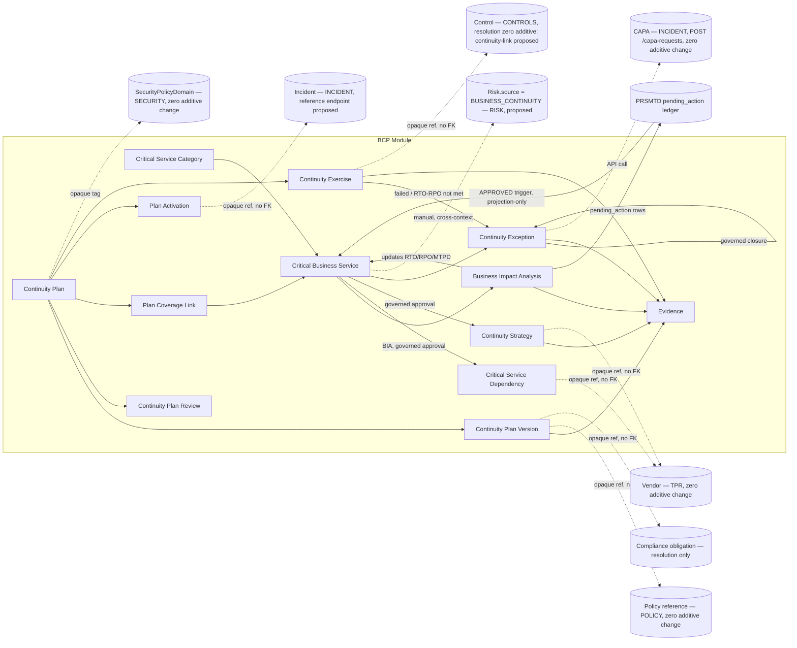
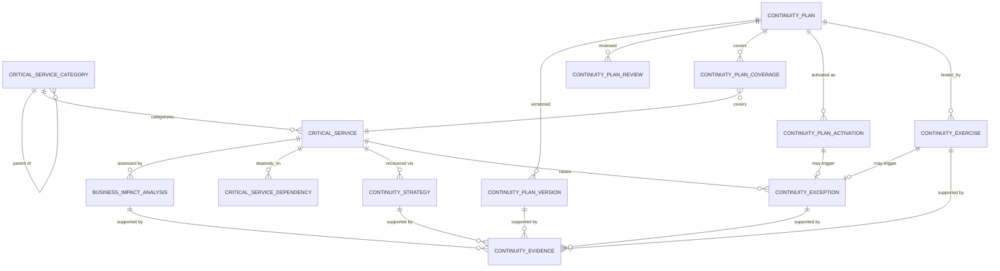
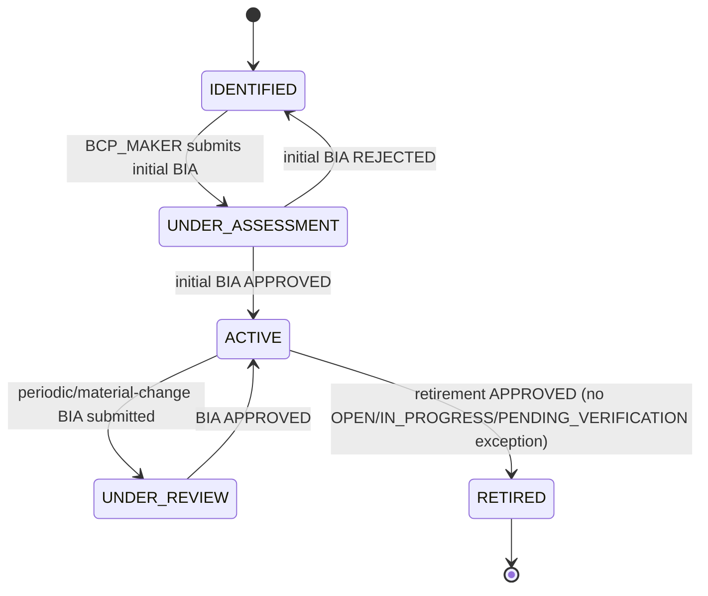
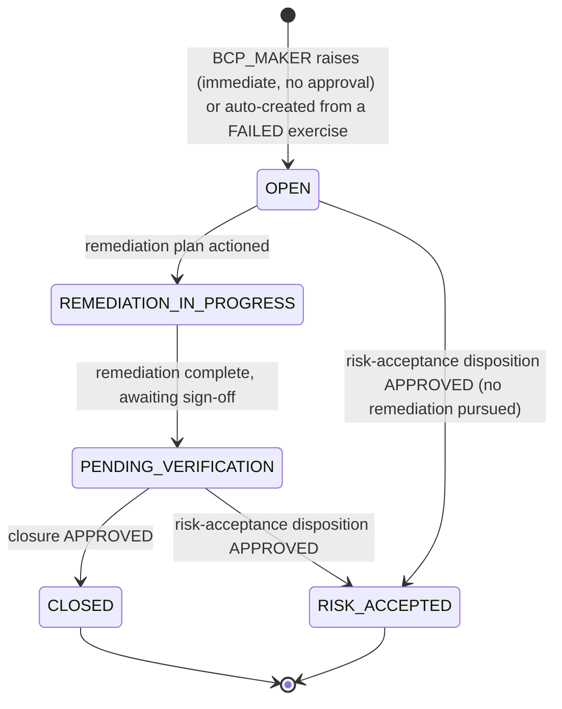
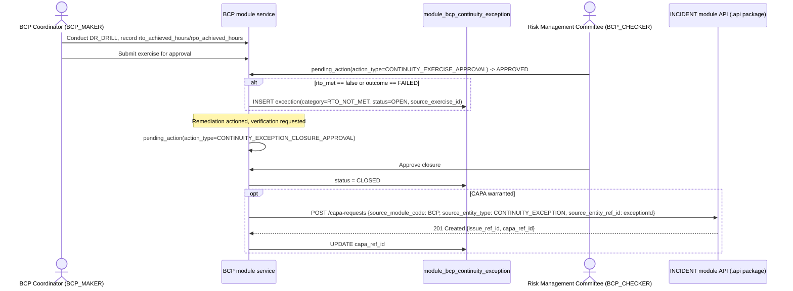
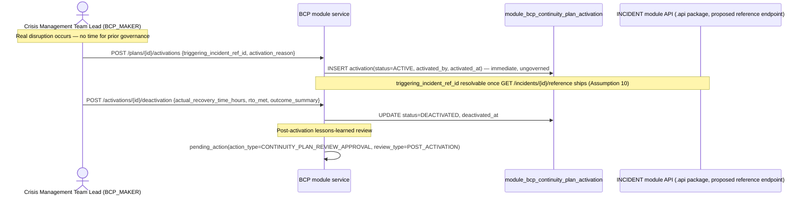

# 26.01 — Business Continuity Management

## Purpose

Defines the Business Continuity Management capability: critical business service
identification, Business Impact Analysis (BIA), Recovery Time/Point Objectives (RTO/RPO),
dependency mapping, continuity strategy selection, the governed Business Continuity Plan
(BCP) / Disaster Recovery (DR) Plan lifecycle, crisis/DR-activation recording, continuity
exercises and testing, corrective actions arising from testing, and periodic plan review and
maintenance — built entirely on PRSMTD's existing multi-tenant, governance, RBAC, and audit
substrate. This is the repository's **tenth authoritative, implementation-ready
specification**. It activates the `BUSINESS CONTINUITY` bounded context
[`04-domain-model/01-enterprise-domain-model.md`](../04-domain-model/01-enterprise-domain-model.md#business-continuity-reserved)
reserved since Session 3, directly answering the gap `10-risk`'s own Regulatory Drivers table
flagged and deferred at this repository's first authoring session: "Disaster Recovery /
Business Contingency Plan... belongs to `18-deployment` (platform-level DR/BCP) and a future
Business Continuity capability."

## Scope

**In scope**: critical business service/process register and criticality classification;
Business Impact Analysis (BIA) — impact assessment, Maximum Tolerable Period of Disruption
(MTPD), RTO/RPO determination; dependency mapping (upstream process, technology/system,
vendor, personnel, facility); continuity strategy selection and approval; the governed
Continuity Plan lifecycle covering both Business Continuity Plans and Disaster Recovery
Plans (`plan_type`-discriminated, see [Domain Model](#domain-model)); periodic (at least
annual) plan review and maintenance; crisis/DR-plan-activation recording; continuity
exercises and testing (table-top review, simulation, DR drill, alternate-site recovery test,
system recovery test), cross-referencing (not duplicating) `12-controls`' `ControlTest` for
the actual effectiveness sign-off on the seeded "Business Continuity & Disaster Recovery"
control family; corrective actions (exceptions) arising from continuity testing or a real
activation; and this module's security/audit/reporting/API surface.

**Out of scope** (forward-referenced, not yet specified, or explicitly deferred):
- The **platform's own** DR/BCP posture (RTO/RPO for the ERM platform itself, environment
  topology, `platformctl` DR runbooks) — that is `18-deployment`'s scope (not yet authored),
  explicitly distinct from this module's tenant-facing product capability, per
  `18-deployment/README.md`'s own anticipated scoping and this repository's Master Execution
  Plan Phase 14 entry.
- A duplicate quantitative risk-scoring engine for continuity threats — BIA impact/threat
  content is rated (`LOW`/`MEDIUM`/`HIGH`/`SEVERE`), not independently likelihood-×-impact
  scored, mirroring `13-audit`'s `AuditUniverseEntry.risk_rating` and `25-third-party-risk`'s
  `Vendor` rating design choices (Assumption 11).
- The actual DR/BCP test **pass/fail effectiveness decision** for the seeded `12-controls`
  "Business Continuity & Disaster Recovery" control family — `CONTROLS` continues to own that
  decision via its own `ControlTest`; this module owns the Plan, the RTO/RPO targets, and the
  operational specifics of each continuity exercise, corroborating the Control by opaque
  reference (Assumption 6 — the plan-vs-test boundary the Master Execution Plan's own Phase 9
  entry requires this document to state explicitly).
- An IT asset/CMDB register — technology/system dependencies in [Dependency
  Mapping](#dependency-mapping) are descriptive (free text), since no PRSMTD or ERM module
  owns an IT asset inventory today; named as a future integration point, not designed.
  Vendor dependencies, by contrast, resolve to a real register via `25-third-party-risk`'s
  `Vendor`.
- A platform document/object storage capability — plan content and evidence are modeled as
  metadata plus an opaque storage pointer, the same confirmed gap every prior
  evidence/document-bearing module inherits, not re-designed here.
- Regulatory profiles other than `SEBI_AMC` — the schema is profile-configurable per the
  established pattern; only `SEBI_AMC` seed content is defined here.

## Business Context

The SEBI *Risk Management System for Mutual Funds* circular (MFD/CIR/15/19133/2002) —
`10-risk`'s own primary regulatory source — names "disaster recovery and business
contingency plans" as one of only three practices AMFI recommended SEBI mandate outright
(Appendix A, Part 1, "Practices to be followed on Mandatory Basis," items (i)–(iii): the
independent risk management function, itself `10-risk`'s own founding mandate; DR/BCP; and
third-party-loss insurance). `10-risk` satisfied the first of the three at its own authoring
and explicitly deferred the second — this module — to "a future Business Continuity
capability." No frozen spec in this repository owns the *plan* side of that mandate today:
`12-controls`' own seeded "Business Continuity & Disaster Recovery" control family (`BCP
Testing`, `DR Failover` sub-families, grounded in the same Annexures System Audit Program
Checklist §8 this module cites at clause level below) tests a plan's operating effectiveness
but has no plan, RTO/RPO target, or BIA to test *against* — the same "control with nothing to
test" gap `25-third-party-risk` closed for `12-controls`' Outsourcing Oversight family at its
own authoring.

Because this module is authored after `RISK`, `CONTROLS`, `COMPLIANCE`, `AUDIT`, `SECURITY`,
`POLICY`, `INCIDENT`, and `TPR` all already exist, it is — like `TPR` before it — built as a
genuine consumer of nearly the entire existing integration surface at once. It is also the
first module in this repository authored after **both** `INCIDENT` and `TPR` already existed,
so it is the first to build a direct (not merely proposed) `capa_ref_id` activation **and** a
direct vendor-reference resolution in the same spec, rather than proposing either — see
[Assumptions](#assumptions) 9 and [Architecture](#architecture).

## Regulatory Drivers

Two primary sources, both re-examined at clause level specifically for this module (neither
was previously mined at this precision by any frozen spec):

Source: [`../reference/Risk Management System for Mutual Funds.pdf`](../reference/Risk%20Management%20System%20for%20Mutual%20Funds.pdf),
Appendix A, Part 1 ("Recommendations to be Mandated by SEBI"), item 1, "Disaster Recovery and
Business Contingency Plans" — text-extractable, clause-level precision (`10-risk`'s own
Regulatory Drivers table cited only the section heading, "Appendix A, Part 1, §2," and
explicitly deferred the content).

Source: [`../reference/Annexures to Master Circular for Mutual Funds as on March 31,
2023_p.pdf`](../reference/Annexures%20to%20Master%20Circular%20for%20Mutual%20Funds%20as%20on%20March%2031%2C%202023_p.pdf),
System Audit Program Checklist, item 8 "BUSINESS CONTINUITY PLANNING (BCP) & DISASTER
RECOVERY" (sub-items 8a–8f) — `12-controls` previously cited only this checklist item's
existence (as the source of its own seeded control family); this module mines its full
clause-level content for the first time.

| Driver | Circular reference | How this spec satisfies it |
|---|---|---|
| Off-site backup facility and a regularly tested/evaluated Business Contingency Plan, mandatory | Risk Mgmt circular, Appendix A Part 1, item 1 | `ContinuityPlan`/`ContinuityPlanVersion` (governed, versioned) plus `ContinuityExercise` (regular testing) — see [Domain Model](#domain-model). |
| Plan must be comprehensive, covering information technology, infrastructure, and personnel requirements | Risk Mgmt circular, Appendix A Part 1, item 1 | `ContinuityPlanVersion`'s content (via `storage_ref`, see Assumption 7) is required by [FR-11](#functional-requirements) to address all three; `plan_type = DR_PLAN` versions additionally carry DR-site/infrastructure content per Annexure 8 item 8f. |
| Plan must allow the AMC to perform, at bare minimum, critical mutual fund operations on "Day 1" — specifically daily NAV calculation, redemption processing, and outstanding trade settlements | Risk Mgmt circular, Appendix A Part 1, item 1 | Directly grounds this module's `criticality_tier = TIER_1_MISSION_CRITICAL` classification and the seeded [Critical Service Taxonomy](#critical-service-taxonomy) categories (NAV Computation & Fund Accounting; Trade Settlement & Custody; Registrar & Transfer Agency Operations). |
| BCP Committee oversight; a dedicated BCP Head/Coordinator; a dedicated BCP/Crisis Management Team to execute the plan when required; documented roles and responsibilities | Annexure 8, item 8a (BCP Organization) | `ContinuityPlan.bcp_coordinator_user_id`/`crisis_management_team_lead_user_id`; team composition and responsibilities are `ContinuityPlanVersion` content (FR-11). |
| A defined, BOD-approved BCP methodology including Business Impact Analysis (BIA), Risk Assessment (RA), BCP Strategy, and BCP Plan; a documented, BOD-approved BCP plan | Annexure 8, item 8b (BCP Methodology and Plan) | `BusinessImpactAnalysis` (governed); `ContinuityStrategy` (governed); `ContinuityPlanVersion` (governed, BOD/Risk Committee approval via `pending_action`) — see [Workflows](#workflows). |
| BIA must identify critical processes and their dependencies on other processes, vendors, and resources; RTO and RPO calculated as part of the BIA; BIA approved by the business, technology, and risk teams | Annexure 8, item 8c (BCP Plan — BIA) | `CriticalBusinessService` register; `CriticalServiceDependency` (upstream process, technology, vendor, personnel, facility); `BusinessImpactAnalysis.proposed_rto_hours`/`proposed_rpo_hours`, updating `CriticalBusinessService.current_rto_hours`/`current_rpo_hours` on approval; `business_reviewed_by`/`technology_reviewed_by`/`risk_reviewed_by` descriptive sign-off fields (Assumption 8). |
| Risk Assessment across people, process, and technology for every critical process identified in the BIA, with identified risk mitigation procedures/systems | Annexure 8, item 8c (BCP Plan — RA) | `BusinessImpactAnalysis.threat_notes` plus an optional `linked_risk_ref_id` opaque citation into `RISK`'s own register for a material continuity threat — deliberately not a duplicate scoring engine (Assumption 11; see [Integration with Risk Management](#integration-with-risk-management)). |
| Documented BCP plan covering: strategy; BIA/RA inputs; BCP/DR procedures; activation conditions; team and responsibilities; maintenance schedule; awareness/education; resumption procedures; employee responsibilities; emergency/fall-back procedures; natural-calamity procedures | Annexure 8, item 8c (a)–(k) | Content requirements on `ContinuityPlanVersion` — see [FR-11](#functional-requirements). Not modeled as eleven separate schema columns (Assumption 7); the versioned document itself carries this content, mirroring `23-policy`'s own `PolicyVersion.storage_ref` design. |
| BCP/DR plan reviewed at least yearly, or on major business/infrastructure change; tested via table-top reviews, simulations, DR drills, alternate-site recovery testing, and system recovery testing, covering people, process, and technology | Annexure 8, item 8d (BCP/DR testing) | `ContinuityPlanReview` (periodic/major-change, governed); `ContinuityExercise.exercise_type ∈ TABLE_TOP_REVIEW, SIMULATION, DR_DRILL, ALTERNATE_SITE_RECOVERY_TEST, SYSTEM_RECOVERY_TEST` (governed) — see [Domain Model](#domain-model), [Workflows](#workflows). |
| BCP training/awareness procedures for the BCP team; the plan communicated to all internal and external users with roles/responsibilities/dependencies | Annexure 8, item 8e (Communication and training) | `ContinuityPlanVersion` content (FR-11); acknowledgement/training-record tracking is explicitly deferred to `23-policy`'s existing `PolicyAcknowledgement` mechanism if the Plan is also published as a governing Policy (see [Integration with Policy Management](#integration-with-policy-management)), not duplicated here. |
| Documented DR Plan with recovery procedures; a DR site that is a replica of the production site; DR readiness/support infrastructure maintained; redundancy built into systems and processes; approved system architecture documents for primary and DR sites | Annexure 8, item 8f (DR Plan) | `ContinuityPlanVersion` where `ContinuityPlan.plan_type ∈ DR_PLAN, COMBINED` (FR-11); `ContinuityStrategy.strategy_type ∈ ALTERNATE_SITE_HOT/WARM/COLD` records the chosen DR-site posture. |
| A vendor's own disaster recovery and business continuity plan must exist for contracted services, and its adequacy/effectiveness must be maintained and tested periodically by the service provider | Annexures §2.9.3.1(iv)(4), §2.9.3.1(v)(f) (Outsourcing Risk, re-cited from `25-third-party-risk`) | `CriticalServiceDependency.dependency_type = VENDOR` opaque-links to `25-third-party-risk`'s `Vendor` — the vendor's own BCP/DR posture remains `TPR`'s `VendorAssessment` concern, not duplicated here (Assumption 12; see [Integration with Third-Party Risk Management](#integration-with-third-party-risk-management)). |
| Cyber security policy must encompass "recover from incident through incident management, disaster recovery and business continuity framework" | Cyber Security and Cyber Resilience Framework for Mutual Funds AMCs — cited at scope level (source PDF scanned/image-only, inherited gap per `12-controls` Assumption 5) | `ContinuityPlan`/`ContinuityExercise` may tag `SECURITY`'s already-seeded "Business Continuity and Disaster Recovery" Security Policy Domain with **zero** additive change — see [Integration with Security Management](#integration-with-security-management). |
| Maker-checker authorization on plan approval, strategy approval, and exception closure | Best-practice pattern across the Annexures, same as every prior module | Reuses PRSMTD's `pending_action` governance ledger — see [Workflows](#workflows). |

## Assumptions

1. **Tenant = one AMC.** Same as every prior module — this module is entirely tenant-plane
   data.
2. **Regulatory profile is configuration, not schema.** The `SEBI_AMC` critical-service
   category taxonomy is seeded reference data (`module_bcp_critical_service_category`), not
   hardcoded categories, mirroring every prior module's identical assumption.
3. **Users referenced by this module** (`process_owner_user_id`, `bcp_coordinator_user_id`,
   etc.) **are platform/tenant identity records**, not module-owned data — same reasoning as
   every prior module's identical assumption.
4. **Record retention** is deferred to `11-compliance`, same as every prior module.
5. **`CriticalBusinessService` is a genuine extension of `04-domain-model`'s own
   anticipated-entities sketch, not a contradiction of it.** That document's own
   `BUSINESS CONTINUITY (reserved)` entry named only `ContinuityPlan`, `RecoveryObjective`,
   and `ContinuityTestResult` "at headline level" — explicitly not a binding data model
   (Assumption 2 of that document: reserved contexts get "a context-map entry... not an
   aggregate/data-model spec"). This module resolves that sketch: RTO/RPO/MTPD are modeled as
   `current_rto_hours`/`current_rpo_hours`/`current_mtpd_hours` **columns on
   `CriticalBusinessService`**, updated by an `APPROVED` `BusinessImpactAnalysis` (mirroring
   `Vendor.inherent_risk_rating` updated by an `APPROVED` `VendorAssessment`), rather than a
   standalone `RecoveryObjective` entity — the same "resolve, don't merely restate, a reserved
   sketch" role `25-third-party-risk` played for `VendorCategory`/`RiskCategory` (that
   document's own Assumption 5). `ContinuityTestResult` is resolved as `ContinuityExercise`
   (Assumption 6). `ContinuityPlan` is built as anticipated, extended with a `plan_type`
   discriminator (Assumption 7). This spec proposes, but does not apply, the corresponding
   `04-domain-model` Future Enhancements closure — see [Dependencies](#dependencies).
6. **The plan-vs-test boundary against `12-controls`' seeded "Business Continuity & Disaster
   Recovery" control family is resolved exactly as `04-domain-model` recommended, not left
   open.** That document's own `BUSINESS CONTINUITY (reserved)` entry stated: "`CONTROLS`
   keeps owning the test, since `ControlTest` already generalizes design/operating
   effectiveness testing for any control family including this one; `BUSINESS CONTINUITY`
   owns the Plan and RTO/RPO objectives the test is measured against" — a recommendation, not
   a decision, at that document's own authoring. This spec adopts it as the decision:
   `ContinuityExercise` (this module's own entity, carrying exercise-type, scheduling, and
   RTO/RPO-achievement fields `ControlTest`'s generic pass/fail shape does not capture) carries
   an opaque, no-FK `control_ref_id` corroborating the `12-controls` Control it is evidence
   for, resolved via `CONTROLS`' existing `GET /controls/{id}/reference` — the same
   "Corroborates (opaque ref, peer)" shape `09-security`'s `SecurityFinding` already uses
   toward `CONTROLS`/`COMPLIANCE`. No duplicate test/effectiveness entity is designed; `12-controls/01-*.md`
   is not modified.
7. **`ContinuityPlan` unifies Business Continuity Plans and Disaster Recovery Plans under one
   `plan_type`-discriminated aggregate root**, rather than two separate roots — mirroring
   `23-policy`'s own unification of Policy/Standard/Procedure/Guideline under one
   `document_type` discriminator (that spec's Assumption 6). Justified directly by the
   regulatory source: the Annexures' own System Audit Program Checklist groups "BUSINESS
   CONTINUITY PLANNING (BCP) & DISASTER RECOVERY" as a single checklist item (item 8, sub-items
   8a–8f), not two. `plan_type ∈ BCP, DR_PLAN, COMBINED`. Plan **content** (methodology,
   activation conditions, team responsibilities, maintenance schedule, awareness/training,
   resumption/emergency/fallback procedures, DR-site/architecture detail) is not decomposed
   into separate schema columns — it lives in `ContinuityPlanVersion.storage_ref`, mirroring
   `23-policy`'s own `PolicyVersion.storage_ref` design exactly (Assumption 14), with only the
   fields this module's own workflows or reporting need to query modeled as columns.
8. **Multi-functional BIA sign-off (business, technology, risk teams — Annexure 8 item 8c) is
   captured as three descriptive, nullable reviewer fields on `BusinessImpactAnalysis`, not
   three independent governance gates.** Segregation of duties is enforced entirely by the
   platform's single `approved_by <> created_by` constraint on the governing `pending_action`
   (the same mechanism every prior module relies on for its own multi-stakeholder sign-off
   language, e.g. `25-third-party-risk`'s Board-approved Outsourcing Policy elements) — no
   bespoke multi-approver mechanism is designed. The independent function itself is satisfiable
   by role assignment (a Risk Owner, a Technology Head, and a Business Process Owner may all
   hold `BCP_MAKER`/`BCP_CHECKER` as appropriate), no code change required per assignment
   choice, mirroring every prior module's identical FR.
9. **This is the first module authored after both `INCIDENT` and `THIRD-PARTY RISK` already
   existed.** Unlike `12-controls`/`11-compliance`/`23-policy` (authored before
   `24-incident-issue-capa` existed) and unlike every module before `25-third-party-risk`
   (authored before that module existed), this spec builds **both**
   `ContinuityException.capa_ref_id` (via `INCIDENT`'s existing `POST /capa-requests`) **and**
   `CriticalServiceDependency.vendor_ref_id`/`ContinuityStrategy.vendor_ref_id` (via `TPR`'s
   existing `GET /vendors/{id}/reference`) directly, with **zero** additive change to either
   frozen spec — see [Integration with Incident/Issue/CAPA](#integration-with-incidentissuecapa)
   and [Integration with Third-Party Risk Management](#integration-with-third-party-risk-management).
10. **`INCIDENT` does not yet expose a dedicated cross-module reference-resolution endpoint for
    the `Incident` entity itself** — only `GET /incidents/{id}` (full detail, gated
    `INCIDENT_VIEW`) exists; every other module's own reference-resolution convention is a
    dedicated, minimal-DTO `/reference` endpoint (e.g. `GET /vendors/{id}/reference`,
    `GET /controls/{id}/reference`). This spec proposes, but does not apply, a
    `GET /incidents/{id}/reference` addition to `24-incident-issue-capa` for
    `ContinuityPlanActivation.triggering_incident_ref_id` to resolve against — see
    [Integration with Incident/Issue/CAPA](#integration-with-incidentissuecapa). Until applied,
    the opaque link is still recordable, just not resolvable to a display DTO through a
    dedicated endpoint.
11. **Continuity impact/threat rating is a qualitative band, not a duplicate quantitative
    scoring engine.** `BusinessImpactAnalysis`'s impact and threat fields use `LOW`/`MEDIUM`/
    `HIGH`/`SEVERE` bands rather than re-implementing `RISK`'s `RiskScoringMatrix`
    likelihood-×-impact infrastructure, mirroring `13-audit`'s `AuditUniverseEntry.risk_rating`
    and `25-third-party-risk`'s `Vendor.inherent_risk_rating`/`residual_risk_rating` design
    choices (that spec's own Assumption 10) exactly.
12. **A Vendor's own BCP/DR posture remains `25-third-party-risk`'s concern, not duplicated
    here.** `CriticalServiceDependency.dependency_type = VENDOR` records *that* a critical
    service depends on a vendor and opaque-links to the `Vendor` record; whether that vendor's
    own continuity arrangements were assessed and found adequate is `TPR`'s
    `VendorAssessment` (`assessment_type = DUE_DILIGENCE`/`SECURITY_ASSESSMENT`) responsibility,
    already grounded in Annexures §2.9.3.1(iv)(4) — this module references, does not re-model,
    that assessment.
13. **The Cyber Security and Cyber Resilience Framework for Mutual Funds AMCs (2019) PDF
    remains scanned/image-only** in this environment — inherited unchanged from `12-controls`
    Assumption 5, cited at scope level only.
14. **The platform document/object storage capability remains unaddressed.**
    `ContinuityPlanVersion.storage_ref` and `ContinuityEvidence.storage_ref` are opaque
    pointers, the same confirmed gap every prior evidence/document-bearing module inherits, not
    re-designed here.
15. **Neither `11-compliance`'s `ObligationCategory` nor `23-policy`'s `PolicyCategory` seed
    set carries a category fitting a Technology/Operational Resilience obligation (the DR/BCP
    mandate itself)** — both existing eight-category taxonomies (Financial Crime & AML,
    Investor Protection & Grievance, Market Conduct, Outsourcing & Related-Party Oversight,
    Financial Integrity & Fraud, Information Governance, Regulatory Reporting & Disclosure,
    Licensing & Registration) were verified against this module's own regulatory drivers and
    none fits without stretching an existing category's stated scope. This spec proposes, but
    does not apply, an additive ninth category — "Technology & Operational Resilience" — to
    both, grounded in the Risk Mgmt circular's own Appendix A Part 1 item 1 mandate — see
    [Integration with Compliance Management](#integration-with-compliance-management) and
    [Integration with Policy Management](#integration-with-policy-management).
16. **A Vendor Owner and Checker are always distinct individuals** (inherited framing) —
    segregation of duties is enforced by PRSMTD's platform-level `approved_by <> created_by`
    constraint on `pending_action`, same mechanism every prior module relies on; no bespoke SoD
    mechanism is designed here.
17. **Crisis management is modeled as `ContinuityPlanActivation` — an immediate, ungoverned
    factual record that a plan was invoked — not a duplicate of `INCIDENT`'s own incident
    lifecycle.** `INCIDENT` owns *what happened* (the underlying disruptive event, its RCA, its
    escalation); this module owns *which plan was invoked in response and how the invocation
    performed against its target RTO/RPO*. A post-activation lessons-learned review reuses the
    existing `ContinuityPlanReview` entity (`review_type = POST_ACTIVATION`) rather than a new
    entity, mirroring `23-policy`'s own precedent that a governed review is a distinct action
    from a version change, not a new aggregate.

## Dependencies

- PRSMTD `docs/authoritative/system.md` §3 (Governance model, GOV-07), §7 (Data model & RLS
  enforcement), §8 (RBAC model), §9 + §5a–§5c (Module framework, ownership guards), §4.1
  (Observability & Deterministic Trace Contract), §10 (Audit and compliance), §21
  (Authentication Surface Ownership) — all reused as-is, no PRSMTD changes required by this
  spec.
- [`../reference/Risk Management System for Mutual Funds.pdf`](../reference/Risk%20Management%20System%20for%20Mutual%20Funds.pdf)
  Appendix A, Part 1, item 1 (Disaster Recovery and Business Contingency Plans, primary
  source) — regulatory source, not previously mined at clause level.
- [`../reference/Annexures to Master Circular for Mutual Funds as on March 31,
  2023_p.pdf`](../reference/Annexures%20to%20Master%20Circular%20for%20Mutual%20Funds%20as%20on%20March%2031%2C%202023_p.pdf)
  System Audit Program Checklist item 8, sub-items 8a–8f (BCP & DR, primary source); §2.9.3.1
  (Outsourcing Risk, re-cited from `25-third-party-risk` for the vendor-BCP driver) —
  regulatory sources.
- [`04-domain-model/01-enterprise-domain-model.md`](../04-domain-model/01-enterprise-domain-model.md)
  — **not modified by this spec.** Its `BUSINESS CONTINUITY (reserved)` bounded-context entry
  (Customer-Supplier toward `RISK` and `CONTROLS`) and its own anticipated-entities sketch are
  the frozen inputs this spec activates and resolves (Assumptions 5–6) but does not edit. This
  spec proposes, but does not apply, the `BUSINESS CONTINUITY (reserved)` →
  `BUSINESS CONTINUITY (authored)` status-label amendment, the same amendment shape
  `SECURITY`/`POLICY`/`INCIDENT`/`TPR` each proposed for their own onboarding.
- [`10-risk/01-enterprise-risk-management.md`](../10-risk/01-enterprise-risk-management.md) —
  **not modified.** This spec proposes, but does not apply, a `Risk.source = BUSINESS_CONTINUITY`
  enum value; no `RiskCategory` taxonomy change is proposed (the existing "Operations → Failure
  of Mission-Critical Systems & Infrastructure" sub-category already covers a continuity-driven
  Risk's natural classification).
- [`12-controls/01-controls-management.md`](../12-controls/01-controls-management.md) — **not
  modified.** Its already-seeded "Business Continuity & Disaster Recovery" control family
  (`BCP Testing`, `DR Failover` sub-families) needs no change; `GET /controls/{id}/reference`
  is reused with zero additive change (resolution direction); this spec proposes, but does not
  apply, a `Control.source = BUSINESS_CONTINUITY` value plus a
  `POST /controls/{id}/continuity-links` endpoint (mirroring exactly how `25-third-party-risk`
  proposed `POST /controls/{id}/vendor-links`, since `12-controls`' existing
  `POST /controls/{id}/references` is documented as hardcoded to `RISK`'s mirror shape).
- [`11-compliance/01-compliance-management.md`](../11-compliance/01-compliance-management.md)
  — **not modified.** `GET /obligations/{id}/reference` is reused with zero additive change;
  this spec proposes, but does not apply, an additive "Technology & Operational Resilience"
  `ObligationCategory` (Assumption 15) and, mirroring `25-third-party-risk`'s own caution
  (that spec's Assumption 8), does not assume the mirror-registration direction
  (`POST /obligations/{id}/references`) is reusable without a dedicated verification.
- [`23-policy/01-policy-management.md`](../23-policy/01-policy-management.md) — **not
  modified.** Both `GET /policies/{id}/reference` and `POST /policies/{id}/references` are
  reused with zero additive change, confirmed reusable by `25-third-party-risk` as this
  module's own third confirming caller (that spec's Assumption 7); this spec proposes, but does
  not apply, the matching additive "Technology & Operational Resilience" `PolicyCategory`
  (Assumption 15).
- [`09-security/01-security-management.md`](../09-security/01-security-management.md) — **not
  modified.** `GET /policy-domains` is reused with zero additive change, tagging against the
  already-seeded "Business Continuity and Disaster Recovery" Security Policy Domain.
- [`13-audit/01-audit-management.md`](../13-audit/01-audit-management.md) — **not modified.**
  Its already-live `AuditUniverseEntry.entry_type = PROCESS` value already covers a critical
  business service conceptually (that document's own worked example cites "NAV Computation" as
  a `PROCESS`-type entry); this spec proposes, but does not apply, a
  `related_critical_service_ref_id` opaque column so it can resolve to a real
  `CriticalBusinessService` record, mirroring exactly how `25-third-party-risk` proposed
  `related_vendor_ref_id`.
- [`24-incident-issue-capa/01-incident-issue-capa-management.md`](../24-incident-issue-capa/01-incident-issue-capa-management.md)
  — **not modified.** `POST /capa-requests` is reused with zero additive change (Assumption 9);
  its already-seeded `Incident.category = OPERATIONAL` (sub-categories "System Outage; Process
  Failure; Human Error") already covers a continuity-triggering incident with zero taxonomy
  change; this spec proposes, but does not apply, a `GET /incidents/{id}/reference` addition
  (Assumption 10).
- [`25-third-party-risk/01-third-party-risk-management.md`](../25-third-party-risk/01-third-party-risk-management.md)
  — **not modified.** `GET /vendors/{id}/reference` is reused with zero additive change
  (Assumption 9), confirmed caller-agnostic by that spec's own design.
- `docs/05-modules/README.md` — confirmed index-only (Session 9); no separate per-module
  `05-modules/`/`06-data-model/`/`08-api/` document is expected for this module.

## Architecture

The Business Continuity Management capability is one PRSMTD module: **module code `BCP`**. It
follows the generic module framework exactly as every prior module does (system.md
§9/§5a–§5c):

- `moduleId`: a stable UUID minted at implementation time, not fixed by this specification.
- Table prefix: `module_bcp_*` (OWN-03 schema ownership).
- Route namespace: `/modules/BCP` (§5b4).
- API namespace: `/api/v1/modules/bcp/**`, controllers in `com.prsbnjs.modules.bcp` (OWN-07).
- Module role types: `MAKER`, `CHECKER`, `VIEWER` only — the closed set (system.md §8). Domain
  personas map onto these three; see [Authorization](#authorization).
- `dependencies: [CONTROLS, COMPLIANCE, POLICY, SECURITY, INCIDENT, TPR]`. This is the largest
  dependency declaration of any module in this repository to date (one more than
  `25-third-party-risk`'s five) — a direct consequence of being the tenth module authored,
  sitting atop nearly the entire existing integration surface. Every edge is justified by a
  genuine synchronous cross-module API call this module's own workflows make (per
  `04-domain-model` Dependency Rule 6), enumerated in each Integration section below.
  **`RISK` and `AUDIT` are deliberately absent from this list**: per `04-domain-model`'s own
  Customer-Supplier framing (`BUSINESS CONTINUITY` supplies, `RISK` consumes),
  `Risk.source = BUSINESS_CONTINUITY` is a manual, cross-context creation, not a service call
  (the same descriptive-not-automated `source` pattern every prior risk-sourcing module uses);
  `AUDIT` is a graph sink that depends on this module, never the reverse (Dependency Rule 5).
- No platform-plane tables, no platform-plane governance actions — every governed action is
  tenant-plane (`app.plane = 'tenant'`).
- Tenant isolation, GUC binding, and session-setter usage are inherited unmodified from
  `TenantAwareDataSource` (system.md §7) — this module issues no direct `SET`/`set_config`
  calls.
- **Cross-module access is API-mediated only (OWN-08/OWN-09).** This module never reads
  another module's tables directly; every reference below is an opaque UUID resolved via the
  target module's `.api`/`.client` package.



## Domain Model

**Bounded context**: Business Continuity Management. Owns the critical business service
register, Business Impact Analyses, continuity strategies, and the Continuity Plan
(BCP/DR) lifecycle exclusively; treats Risk (downstream — a continuity threat is a specialized
risk source), Controls (a Continuity Exercise corroborates the control that tests it),
Compliance (a Continuity Plan cites the obligation its DR/BCP mandate satisfies), Policy (a
Continuity Plan may cite a governing Business Continuity Policy), Security (a Plan/Exercise
may tag the existing Business Continuity Security Policy Domain), Audit (a critical service is
a citable audit-universe entry), Incident/CAPA (a plan activation is triggered by an Incident;
a continuity exception may escalate to a structured CAPA), and Third-Party Risk (a critical
service's vendor dependency resolves to a real Vendor record) as external contexts it
references but does not own — the same customer-supplier/opaque-reference framing every prior
module uses for its own external references.

**Ubiquitous language** (extends, does not redefine, `04-domain-model`'s canonical glossary —
per that document's own closing note, a term already defined there means the same thing here;
"Continuity Plan" itself is already defined there and is not redefined, only elaborated):

| Term | Definition |
|---|---|
| Critical Business Service | A business process or service the AMC has classified by criticality tier, whose disruption is analyzed via a Business Impact Analysis and whose recovery is targeted by an RTO/RPO and covered by one or more Continuity Plans. |
| Criticality Tier | A Critical Business Service's classification (`TIER_1_MISSION_CRITICAL`/`TIER_2_ESSENTIAL`/`TIER_3_SUPPORTING`), driving BIA frequency and Day-1 recovery expectations. |
| Business Impact Analysis (BIA) | A governed, point-in-time assessment of a Critical Business Service's disruption impact, its Maximum Tolerable Period of Disruption, and its resulting RTO/RPO targets, subject to maker-checker approval. |
| Maximum Tolerable Period of Disruption (MTPD) | The longest period a Critical Business Service can be unavailable before the disruption itself becomes unacceptable to the AMC — the ceiling the service's RTO must stay within. |
| Recovery Time Objective (RTO) | The targeted maximum duration to restore a Critical Business Service after a disruption, set by an approved BIA. |
| Recovery Point Objective (RPO) | The targeted maximum tolerable data loss, expressed as time, for a Critical Business Service, set by an approved BIA. |
| Dependency Mapping | The recorded set of upstream processes, technology/systems, vendors, personnel, and facilities a Critical Business Service depends on to operate or recover. |
| Continuity Strategy | A governed, approved recovery approach (e.g., hot/warm/cold alternate site, alternate vendor, manual workaround) selected for a Critical Business Service to meet its RTO. |
| Continuity Plan | A governed, versioned document — Business Continuity Plan, Disaster Recovery Plan, or both — covering one or more Critical Business Services, its own definition already reserved in `04-domain-model`, elaborated here with a `plan_type` discriminator (Assumption 7). |
| Continuity Plan Activation | A recorded instance of a Continuity Plan being invoked in response to a real disruption — crisis/DR coordination captured as fact, not a governed decision (Assumption 17). |
| Continuity Exercise | A scheduled and executed test of a Continuity Plan (table-top review, simulation, DR drill, alternate-site recovery test, or system recovery test), recording whether the target RTO/RPO was achieved, corroborating (not duplicating) a `CONTROLS` Control Test. |
| Continuity Exception | A documented gap identified during a Continuity Exercise or a real Plan Activation — an RTO/RPO miss, a plan gap, or a dependency failure — tracked to a governed closure or formal risk acceptance. |

**Aggregates, entities, and invariants**:

- **CriticalBusinessService** (aggregate root) — Cannot reach `ACTIVE` without at least one
  `APPROVED` `BusinessImpactAnalysis`. Cannot reach `RETIRED` while it has a
  `ContinuityException` in status `OPEN`, `REMEDIATION_IN_PROGRESS`, or
  `PENDING_VERIFICATION` — the same "no-retirement-while-active-work-exists" shape every prior
  aggregate root enforces.
- **BusinessImpactAnalysis** (entity, owned by CriticalBusinessService) — Immutable once
  `APPROVED`; append-only history, mirroring `VendorAssessment`/`ControlTest` exactly. On
  `APPROVED`, updates the owning `CriticalBusinessService`'s `current_rto_hours`/
  `current_rpo_hours`/`current_mtpd_hours`/`last_bia_date`/`next_bia_due_date` fields
  (Assumption 5) and, on the first `APPROVED` BIA, transitions the service to `ACTIVE`.
- **CriticalServiceDependency** (entity, owned by CriticalBusinessService) — Descriptive
  mapping record, not individually governed (a maker with edit permission links/removes it
  directly), mirroring `VendorControlLink`'s plain-link shape. `dependency_type ∈
  UPSTREAM_PROCESS, TECHNOLOGY_SYSTEM, VENDOR, PERSONNEL, FACILITY`.
- **ContinuityStrategy** (entity, owned by CriticalBusinessService) — Governed
  (`PROPOSED → ACTIVE` via maker-checker approval); a superseding strategy is a new row, the
  old row transitions to `RETIRED` by a plain maker action (not itself re-governed), mirroring
  how a `VendorContract` renewal is a new row rather than an edit.
- **ContinuityPlan** (aggregate root) — `plan_type`-discriminated (Assumption 7). Cannot reach
  `ACTIVE` without at least one `PUBLISHED`-equivalent (this module's `APPROVED`, Assumption 7)
  `ContinuityPlanVersion`. Covers one or more `CriticalBusinessService` records via
  `ContinuityPlanCoverageLink`.
- **ContinuityPlanVersion** (entity, owned by ContinuityPlan) — Append-only, immutable once
  `APPROVED`; mirrors `PolicyVersion` exactly, including the deliberate choice not to
  decompose plan content into per-clause columns (Assumption 7). On `APPROVED`, sets
  `ContinuityPlan.current_version_id` and `ContinuityPlan.status = ACTIVE`.
- **ContinuityPlanReview** (entity, owned by ContinuityPlan) — Periodic (at least annual) or
  major-change-triggered governed review; `REVISION_REQUIRED` does not itself create a new
  `ContinuityPlanVersion` (mirrors `PolicyReview`'s own precedent exactly — a governed review
  is a distinct action from a version change). `review_type ∈ PERIODIC, MATERIAL_CHANGE,
  POST_ACTIVATION` (the third value reuses this entity for the post-crisis lessons-learned
  review named in Assumption 17, rather than a new entity).
- **ContinuityPlanCoverageLink** (entity, owned by ContinuityPlan) — Plain link table (many
  Plans to many Critical Business Services), not individually governed.
- **ContinuityPlanActivation** (entity, owned by ContinuityPlan) — Raised immediately by a
  `BCP_MAKER` (BCP Coordinator or Crisis Management Team Lead), no prior approval — an
  operational fact recorded during a live disruption should not wait on governance
  (Assumption 17), the same "immediate-raise" half of the shared-kernel exception pattern
  applied to a factual event record rather than an exception. Deactivation is likewise a plain
  maker update.
- **ContinuityExercise** (entity, owned by ContinuityPlan, optionally scoped to one
  CriticalBusinessService) — Governed (`SUBMITTED → APPROVED` via maker-checker approval,
  finalizing and freezing the exercise record and its outcome), mirroring `ControlTest`/
  `VendorAssessment`. An `APPROVED` exercise with `outcome = FAILED` or `rto_met = false` /
  `rpo_met = false` automatically creates a `ContinuityException`, the same "breach creates a
  governed follow-up record" pattern `25-third-party-risk`'s SLA-breach rule and `12-controls`'
  `FAIL`-result-requires-Exception rule both already establish.
- **ContinuityException** (entity, owned by CriticalBusinessService, optionally linked to its
  source `ContinuityExercise` or `ContinuityPlanActivation`) — Raised immediately by a
  `BCP_MAKER` (no governance required to open); closure or `RISK_ACCEPTED` disposition
  requires `BCP_CHECKER` approval, mirroring `ControlException`/`ComplianceException`/
  `PolicyException`/`VendorException` exactly. Reserves and builds `capa_ref_id` directly
  (Assumption 9).
- **ContinuityEvidence** (entity, attached to exactly one of BusinessImpactAnalysis,
  ContinuityStrategy, ContinuityPlanVersion, ContinuityExercise, or ContinuityException) —
  Immutable metadata once uploaded, mirroring `ControlEvidence`'s shape, extended to a fifth
  attachment point (the established "exactly one of N" pattern, now at five points).
- **CriticalServiceCategory** (reference data) — Two-level hierarchy (category →
  sub-category), regulatory-profile-seeded, tenant-editable — same shape as every prior
  taxonomy.

### Critical Service Taxonomy

`module_bcp_critical_service_category` is seeded per regulatory profile, tenant-editable via
`BCP_ADMIN`, same shape as every prior taxonomy. The `SEBI_AMC` seed set, grounded in
[Regulatory Drivers](#regulatory-drivers) — the first three rows directly name the Risk Mgmt
circular's own mandated "Day 1" functions:

| Category | Examples / notes | Source |
|---|---|---|
| NAV Computation & Fund Accounting | Daily NAV calculation | Risk Mgmt circular, Appendix A Part 1 item 1 — mandated Day-1 function |
| Trade Settlement & Custody | Outstanding trade settlements, custody operations | Risk Mgmt circular, Appendix A Part 1 item 1 — mandated Day-1 function |
| Registrar & Transfer Agency Operations | Redemption processing, subscription processing, investor records | Risk Mgmt circular, Appendix A Part 1 item 1 — mandated Day-1 function |
| Fund Management & Investment Operations | Portfolio management, trade execution | Risk Mgmt circular §II (re-cited from `10-risk`) |
| Customer Service & Investor Services | Investor grievance handling, call centre operations | Risk Mgmt circular §II (re-cited) |
| IT Infrastructure & Technology | Core trading/accounting platform, data centre operations, network connectivity | Annexures System Audit Program Checklist §8 (re-cited) |
| Distribution & Marketing | Distributor/channel operations | Risk Mgmt circular §II (re-cited) |
| Corporate & Support Functions | Finance & treasury, HR, facilities management | General GRC scope, not SEBI-specific |

`criticality_tier ∈ TIER_1_MISSION_CRITICAL, TIER_2_ESSENTIAL, TIER_3_SUPPORTING` —
`TIER_1_MISSION_CRITICAL` is reserved for services the Risk Mgmt circular's own "Day 1"
language names directly (NAV computation, redemption processing, outstanding trade
settlements) or a tenant-configured equivalent; not itself a seeded taxonomy value, but a
classification every `CriticalBusinessService` row carries.

### Business Impact Analysis and Recovery Objectives

`BusinessImpactAnalysis` mirrors `VendorAssessment`'s append-only, root-updating shape: each
row is a point-in-time assessment (`trigger ∈ INITIAL, PERIODIC, MATERIAL_CHANGE`); on
`APPROVED`, its `proposed_rto_hours`/`proposed_rpo_hours`/`mtpd_hours` become the owning
`CriticalBusinessService`'s current, effective targets. Impact is rated
(`impact_rating ∈ LOW, MEDIUM, HIGH, SEVERE`) across the dimensions the checklist implies
(financial, operational, regulatory, reputational) as a single overall rating plus free-text
rationale — deliberately not a four-column breakdown, avoiding schema growth the checklist
does not itself require as structured data (Assumption 11). The `RA` (Risk Assessment) half
of item 8c is captured as `threat_notes` (free text) plus an optional `linked_risk_ref_id`
opaque citation into `RISK` for a threat material enough to warrant a full Risk register
entry — not a parallel scoring engine.

### Continuity Plan Versioning and Review

`ContinuityPlanVersion` mirrors `PolicyVersion` precisely: `storage_ref` + `content_hash` +
`summary_of_changes` for the document itself, plus the governed lifecycle columns
(`status`, `drafted_by`/`drafted_at`, `reviewed_by`, `approved_by`/`approved_at`,
`effective_date`, `superseded_by_version_id`). `ContinuityPlanReview` mirrors `PolicyReview`
precisely, extended with a third `review_type` value (`POST_ACTIVATION`) this module's own
crisis-management design needs (Assumption 17) that `POLICY` has no equivalent for.

### Continuity Exercise Testing

`ContinuityExercise.exercise_type` is seeded directly from Annexure 8 item 8d's own testing
strategies: `TABLE_TOP_REVIEW, SIMULATION, DR_DRILL, ALTERNATE_SITE_RECOVERY_TEST,
SYSTEM_RECOVERY_TEST`. Each exercise records `rto_achieved_hours`/`rpo_achieved_hours` against
the tested `CriticalBusinessService`'s current target (`rto_met`/`rpo_met` booleans, computed
at approval time), and carries an opaque `control_ref_id` corroborating the `12-controls`
Control it is evidence for (Assumption 6) — the plan-vs-test boundary this module's own Master
Execution Plan entry requires stating explicitly.

## Functional Requirements

| ID | Requirement | Regulatory tie |
|---|---|---|
| FR-01 | The system shall provide a configurable, two-level critical-service category taxonomy, seeded per regulatory profile. | Annexure 8, item 8c |
| FR-02 | `BCP_MAKER` users shall create and edit Critical Business Service records while in `IDENTIFIED`/`UNDER_ASSESSMENT` status. | — |
| FR-03 | Every Critical Business Service shall carry a mandatory `criticality_tier` and exactly one accountable `process_owner_user_id`. | Annexure 8, item 8c |
| FR-04 | A Critical Business Service shall not reach `ACTIVE` without at least one `APPROVED` Business Impact Analysis. | Risk Mgmt circular, Appendix A Part 1 item 1; Annexure 8 item 8c, mandatory |
| FR-05 | A Business Impact Analysis shall record impact rating, Maximum Tolerable Period of Disruption, proposed RTO, and proposed RPO, and shall update the owning service's current targets on approval. | Annexure 8, item 8c, mandatory |
| FR-06 | The system shall track `next_bia_due_date` per Critical Business Service and surface overdue reassessments; default cadence shall be no less frequent than annual for `TIER_1_MISSION_CRITICAL` services. | Annexure 8, item 8d (yearly review, re-applied to BIA cadence) |
| FR-07 | The system shall support Critical Service Dependencies of type `UPSTREAM_PROCESS`, `TECHNOLOGY_SYSTEM`, `VENDOR`, `PERSONNEL`, and `FACILITY`, the `VENDOR` type opaque-linking to a real `TPR` Vendor record. | Annexure 8, item 8c (dependencies on other processes, vendor dependencies, and resources) |
| FR-08 | The system shall support Continuity Strategies per Critical Business Service, subject to maker-checker approval before reaching `ACTIVE`. | Annexure 8, item 8b–8c |
| FR-09 | The system shall support a governed Continuity Plan lifecycle (`plan_type ∈ BCP, DR_PLAN, COMBINED`), versioned, requiring maker-checker (BOD/Risk Committee) approval before a version becomes the Plan's current, active version. | Risk Mgmt circular Appendix A Part 1 item 1; Annexure 8 items 8b, 8f, mandatory |
| FR-10 | A Continuity Plan shall cover one or more Critical Business Services via an explicit coverage link. | Annexure 8, item 8c |
| FR-11 | A Continuity Plan Version's content shall address, at minimum: strategy; BIA/RA inputs; BCP/DR procedures; activation conditions; team and responsibilities; maintenance schedule; awareness/training; resumption procedures; employee responsibilities; emergency/fallback procedures; natural-calamity procedures; and, for `DR_PLAN`/`COMBINED` plan types, DR-site and recovery-infrastructure detail. | Annexure 8, items 8c(a)–(k), 8f, mandatory |
| FR-12 | The system shall track `next_review_due_date` per Continuity Plan and support a governed Continuity Plan Review (`review_type ∈ PERIODIC, MATERIAL_CHANGE, POST_ACTIVATION`); default cadence shall be no less frequent than annual. | Annexure 8, item 8d, mandatory (yearly review or major change) |
| FR-13 | The system shall support Continuity Exercises of type `TABLE_TOP_REVIEW`, `SIMULATION`, `DR_DRILL`, `ALTERNATE_SITE_RECOVERY_TEST`, and `SYSTEM_RECOVERY_TEST`, each recording RTO/RPO achievement against the tested service's current targets, subject to maker-checker approval. | Annexure 8, item 8d, mandatory |
| FR-14 | An `APPROVED` Continuity Exercise with `outcome = FAILED`, `rto_met = false`, or `rpo_met = false` shall automatically create a Continuity Exception. | Annexure 8, item 8d (documented, monitored results) |
| FR-15 | The system shall support Continuity Exceptions, raised immediately by a maker without prior approval, with governed closure (`CLOSED` or `RISK_ACCEPTED`) requiring checker approval. | Annexure 8, item 8d |
| FR-16 | A Continuity Exception shall expose a `capa_ref_id` resolving to a CAPA record via `INCIDENT`'s existing `POST /capa-requests` endpoint. | Activates `24-incident-issue-capa` with zero additive change (Assumption 9) |
| FR-17 | A Critical Business Service shall not be retirable while any Exception remains `OPEN`, `REMEDIATION_IN_PROGRESS`, or `PENDING_VERIFICATION`. | — |
| FR-18 | The system shall support a Continuity Plan Activation record, raised immediately by a maker (no prior approval), citing an optional opaque `triggering_incident_ref_id`, and recording activation/deactivation timestamps and RTO achievement. | Annexure 8, item 8a (BCP/Crisis Management Team executes the plan when required) |
| FR-19 | Evidence shall attach to exactly one of a Business Impact Analysis, a Continuity Strategy, a Continuity Plan Version, a Continuity Exercise, or a Continuity Exception, and shall record an integrity hash of the underlying artifact. | — |
| FR-20 | A Critical Business Service and a Continuity Plan shall each expose a cross-module reference-resolution API so that `13-audit`'s already-live `AuditUniverseEntry.entry_type = PROCESS` and this module's own proposed extensions can resolve to real records. | Activates `13-audit`'s existing taxonomy value |
| FR-21 | A Continuity Plan Version and a Continuity Exercise shall each support an optional opaque, non-FK citation of a `SECURITY` Security Policy Domain, resolved via `SECURITY`'s existing `GET /policy-domains`, with zero additive change. | Activates `09-security`'s already-seeded "Business Continuity and Disaster Recovery" domain |
| FR-22 | A Continuity Plan Version shall support an optional opaque, non-FK citation of a governing `POLICY` record, resolved and mirror-registered via `POLICY`'s existing reference APIs with zero additive change. | Activates `23-policy` |
| FR-23 | Visibility shall be role-scoped: `BCP_VIEWER` — full tenant register, read-only; `BCP_MAKER` — full read, edit own drafts/BIAs/strategies/exercises/exceptions/activations; `BCP_CHECKER` — full read, plus all pending approvals across the tenant. | — |
| FR-24 | The independent BIA/plan sign-off function shall be satisfiable purely by role assignment (Assumption 8) — no code change required per assignment choice. | Mirrors every prior module's identical FR |
| FR-25 | Every governed state transition shall be captured in the platform audit trail using canonical, non-aliased `action_type` values. | system.md §10 |

## Non-Functional Requirements

| Category | Requirement |
|---|---|
| Multi-tenancy | Full tenant isolation via PRSMTD RLS (system.md §7); zero platform-plane data in this module. |
| Performance | Critical service register list/filter queries shall return p95 < 500ms for tenants with up to 500 critical service records and 5,000 continuity exercise records (a smaller expected ceiling than `RISK`/`CONTROLS`/`TPR`, since the number of genuinely critical business services at a typical AMC is materially lower than risk/control/vendor counts). |
| Scalability | Schema and query patterns must not assume a ceiling on tenant count or per-tenant service/plan/exercise volume beyond the platform's general multi-tenant design targets. |
| Availability | Inherits platform availability targets (`18-deployment`, not yet authored) — no module-specific SLA is defined here; this module's own subject matter (RTO/RPO) is about the AMC's *business* recovery targets, not this module's own platform availability, an explicit distinction restated in [Scope](#scope). |
| Auditability | Every governed transition is immutable and traceable per system.md §4.1 T1–T7; no destructive updates on BIA/strategy/version/review/exercise/exception/evidence history. |
| Configurability | Critical service category taxonomy is tenant-editable reference data, not hardcoded — required for the multi-regulatory-profile vision in `CLAUDE.md`. |
| Data retention | No physical deletion of governed records; retention/archival policy deferred to `11-compliance` (Assumption 4). |
| Localization | Out of scope for this spec. |

## Data Model

All tables use module prefix `module_bcp_`, live in the tenant plane, and carry the standard
PRSMTD columns: `id uuid PRIMARY KEY DEFAULT gen_random_uuid()`, `tenant_id uuid NOT NULL`
(RLS-scoped per system.md §7), `created_at timestamptz NOT NULL DEFAULT now()`,
`created_by uuid NOT NULL`. Lifecycle uses closed-set `status` columns, never soft-delete
(`deleted_at`), matching PRSMTD convention. This section is the canonical source for the
Business Continuity Management schema — no separate `06-data-model/` document duplicates it.

### Reference / configuration tables

| Table | Key columns | Notes |
|---|---|---|
| `module_bcp_critical_service_category` | `code`, `name`, `parent_category_id` (self-FK, nullable), `regulatory_profile`, `status` | Two-level hierarchy. Seeded with the `SEBI_AMC` profile — see [Critical Service Taxonomy](#critical-service-taxonomy). |
| `module_bcp_code_sequence` | `tenant_id`, `entity_type` (composite PK: `CRITICAL_SERVICE`, `PLAN`, `EXCEPTION`), `last_value int` | Backs human-readable `service_code` (e.g. `BCS-2026-000004`), `plan_code` (e.g. `CTP-2026-000002`), and `exception_code` (e.g. `BCX-2026-000011`) generation from one shared table, mirroring `23-policy`'s/`11-compliance`'s single-table-multi-entity-type sequence shape. |

### Core tables

| Table | Key columns | Notes |
|---|---|---|
| `module_bcp_critical_service` | `service_code`, `name`, `description`, `category_id` (FK), `criticality_tier`, `process_owner_user_id`, `status`, `current_rto_hours numeric`, `current_rpo_hours numeric`, `current_mtpd_hours numeric`, `last_bia_date`, `next_bia_due_date`, `updated_at` | The aggregate root. `criticality_tier ∈ TIER_1_MISSION_CRITICAL, TIER_2_ESSENTIAL, TIER_3_SUPPORTING`. `status ∈ IDENTIFIED, UNDER_ASSESSMENT, ACTIVE, UNDER_REVIEW, RETIRED`. `current_rto_hours`/`current_rpo_hours`/`current_mtpd_hours` are `NULL` until the first `APPROVED` BIA (Assumption 5). |
| `module_bcp_business_impact_analysis` | `critical_service_id` (FK), `assessment_date`, `assessor_user_id`, `trigger`, `impact_rating`, `impact_rationale`, `mtpd_hours numeric`, `proposed_rto_hours numeric`, `proposed_rpo_hours numeric`, `threat_notes`, `linked_risk_ref_id` (opaque uuid, nullable, no FK), `business_reviewed_by` (nullable), `technology_reviewed_by` (nullable), `risk_reviewed_by` (nullable), `status`, `approved_by`, `approved_at` | Append-only once `APPROVED`, mirroring `VendorAssessment`. `trigger ∈ INITIAL, PERIODIC, MATERIAL_CHANGE`. `impact_rating ∈ LOW, MEDIUM, HIGH, SEVERE`. `status ∈ DRAFT, SUBMITTED, APPROVED, REJECTED`. `linked_risk_ref_id` — resolved via `RISK`'s `.api`/`.client` package once `Risk.source = BUSINESS_CONTINUITY` is applied (Assumption 6 of [Dependencies](#dependencies)); recordable today regardless. |
| `module_bcp_critical_service_dependency` | `critical_service_id` (FK), `dependency_type`, `depends_on_service_id` (self-FK, nullable), `vendor_ref_id` (opaque uuid, nullable, no FK), `description`, `criticality_of_dependency`, `status` | `dependency_type ∈ UPSTREAM_PROCESS, TECHNOLOGY_SYSTEM, VENDOR, PERSONNEL, FACILITY`. `depends_on_service_id` populated only for `UPSTREAM_PROCESS`; `vendor_ref_id` populated only for `VENDOR`, resolved via `TPR`'s existing `GET /vendors/{id}/reference`, zero additive change (Assumption 9). `criticality_of_dependency ∈ LOW, MEDIUM, HIGH, CRITICAL`. `status ∈ ACTIVE, REMOVED`. |
| `module_bcp_continuity_strategy` | `critical_service_id` (FK), `strategy_type`, `description`, `recovery_site_location` (nullable), `vendor_ref_id` (opaque uuid, nullable, no FK), `estimated_recovery_time_hours numeric` (nullable), `status`, `approved_by` (nullable), `approved_at` (nullable), `updated_at` | `strategy_type ∈ ALTERNATE_SITE_HOT, ALTERNATE_SITE_WARM, ALTERNATE_SITE_COLD, ALTERNATE_VENDOR, MANUAL_WORKAROUND, REMOTE_WORK, DATA_BACKUP_RESTORE, OTHER`. `vendor_ref_id` — same zero-additive-change resolution as above. `status ∈ PROPOSED, ACTIVE, RETIRED`. |
| `module_bcp_continuity_plan` | `plan_code`, `name`, `description`, `plan_type`, `bcp_coordinator_user_id`, `crisis_management_team_lead_user_id`, `governing_policy_ref_id` (opaque uuid, nullable, no FK), `security_policy_domain_ref_id` (opaque uuid, nullable, no FK), `status`, `current_version_id` (FK, nullable), `last_reviewed_date`, `next_review_due_date`, `updated_at` | The aggregate root. `plan_type ∈ BCP, DR_PLAN, COMBINED` (Assumption 7). `status ∈ DRAFT, UNDER_REVIEW, APPROVED, ACTIVE, SUPERSEDED, RETIRED`. `governing_policy_ref_id` resolved via `POLICY`'s existing reference APIs, zero additive change. `security_policy_domain_ref_id` resolved via `SECURITY`'s existing `GET /policy-domains`, zero additive change. |
| `module_bcp_continuity_plan_version` | `plan_id` (FK), `version_number int`, `storage_ref`, `content_hash`, `summary_of_changes`, `drafted_by`, `drafted_at`, `status`, `reviewed_by` (nullable), `review_notes` (nullable), `approved_by` (nullable), `approved_at` (nullable), `effective_date` (nullable), `superseded_at` (nullable), `superseded_by_version_id` (self-FK, nullable), `updated_at` | Append-only history; immutable once `APPROVED` (Assumption 7, mirrors `PolicyVersion`). `status ∈ DRAFT, SUBMITTED, UNDER_REVIEW, APPROVED, SUPERSEDED, REJECTED`. `version_number` monotonic per `plan_id`. `storage_ref` opaque per Assumption 14. |
| `module_bcp_continuity_plan_review` | `plan_id` (FK), `reviewed_version_id` (FK), `review_type`, `review_date`, `reviewer_user_id`, `outcome`, `notes`, `status`, `approved_by` (nullable), `approved_at` (nullable) | `review_type ∈ PERIODIC, MATERIAL_CHANGE, POST_ACTIVATION` (Assumption 17). `outcome ∈ REAFFIRMED, REVISION_REQUIRED, RETIRE_RECOMMENDED`. `status ∈ SUBMITTED, APPROVED, REJECTED`. Governed, distinct from `module_bcp_continuity_plan_version`'s own governance (mirrors `PolicyReview`). |
| `module_bcp_continuity_plan_coverage` | `plan_id` (FK), `critical_service_id` (FK), `status` | Plain link table (many-to-many). `status ∈ ACTIVE, REMOVED`. |
| `module_bcp_continuity_plan_activation` | `plan_id` (FK), `critical_service_id` (FK, nullable), `triggering_incident_ref_id` (opaque uuid, nullable, no FK), `activation_reason`, `activated_by`, `activated_at`, `deactivated_at` (nullable), `actual_recovery_time_hours numeric` (nullable), `rto_met` (nullable), `outcome_summary` (nullable), `status` | Raised immediately, no prior approval (Assumption 17). `status ∈ ACTIVE, DEACTIVATED`. `triggering_incident_ref_id` — resolved via `INCIDENT`'s proposed `GET /incidents/{id}/reference` (Assumption 10); recordable today regardless. Multi-service activations are represented as multiple rows sharing one `triggering_incident_ref_id`. |
| `module_bcp_continuity_exercise` | `plan_id` (FK), `critical_service_id` (FK, nullable), `exercise_type`, `scheduled_date`, `actual_date` (nullable), `objective`, `control_ref_id` (opaque uuid, nullable, no FK), `security_policy_domain_ref_id` (opaque uuid, nullable, no FK), `rto_achieved_hours numeric` (nullable), `rpo_achieved_hours numeric` (nullable), `rto_met` (nullable), `rpo_met` (nullable), `outcome` (nullable), `findings_summary` (nullable), `conducted_by`, `participants_summary` (nullable), `status`, `approved_by` (nullable), `approved_at` (nullable) | `exercise_type ∈ TABLE_TOP_REVIEW, SIMULATION, DR_DRILL, ALTERNATE_SITE_RECOVERY_TEST, SYSTEM_RECOVERY_TEST`. `outcome ∈ PASSED, PASSED_WITH_OBSERVATIONS, FAILED`. `status ∈ SCHEDULED, IN_PROGRESS, SUBMITTED, APPROVED, REJECTED, CANCELLED`. `control_ref_id` — resolved via `CONTROLS`' existing `GET /controls/{id}/reference`, zero additive change, resolution direction only (Assumption 6). |
| `module_bcp_continuity_exception` | `exception_code`, `critical_service_id` (FK), `source_exercise_id` (FK, nullable), `source_activation_id` (FK, nullable), `category`, `description`, `identified_date`, `identified_by`, `severity`, `remediation_plan`, `remediation_owner_user_id`, `target_closure_date`, `status`, `closure_justification` (nullable), `linked_risk_id` (opaque uuid, nullable, no FK), `capa_ref_id` (opaque uuid, nullable, no FK), `approved_by` (nullable), `approved_at` (nullable), `updated_at` | `category ∈ RTO_NOT_MET, RPO_NOT_MET, PLAN_GAP, DEPENDENCY_FAILURE, RESOURCE_UNAVAILABILITY, OTHER`. `severity ∈ LOW, MEDIUM, HIGH, CRITICAL`. `status ∈ OPEN, REMEDIATION_IN_PROGRESS, PENDING_VERIFICATION, CLOSED, RISK_ACCEPTED`. `capa_ref_id` — **built directly, not merely proposed** (Assumption 9), resolved via `INCIDENT`'s existing `POST /capa-requests`. |
| `module_bcp_continuity_evidence` | `bia_id` (FK, nullable), `strategy_id` (FK, nullable), `plan_version_id` (FK, nullable), `exercise_id` (FK, nullable), `exception_id` (FK, nullable), `evidence_type`, `title`, `description`, `storage_ref`, `file_name`, `mime_type`, `file_size_bytes`, `content_hash`, `collected_at`, `collected_by`, `uploaded_at`, `uploaded_by`, `status` | Exactly one of the five FKs is non-null (application-layer invariant, extending the established "exactly one of N" evidence-attachment pattern to five points). `evidence_type ∈ DOCUMENT, SCREENSHOT, SYSTEM_EXTRACT, ATTESTATION, DRILL_LOG, OTHER`. `status ∈ ACTIVE, SUPERSEDED, ARCHIVED`. `storage_ref` opaque, same confirmed gap every prior module inherits. |

No bespoke audit table is defined — audit trail is the platform's `audit_log` per system.md
§10, reused as-is.

### ER diagram



## Workflows

All governed transitions reuse PRSMTD's `pending_action` ledger and the Governance Ledger +
Projection pattern (system.md §3, §9): a `BCP_MAKER` proposes, a `BCP_CHECKER` decides, and a
database trigger — never application code — projects `APPROVED` decisions into the owning
aggregate's state. GOV-07 dedup applies per action type, scoped to its logical target.

| `action_type` | Logical target (GOV-07 key) | Effect on APPROVED |
|---|---|---|
| `BIA_APPROVAL` | `bia_id` | `BusinessImpactAnalysis.status = APPROVED`; updates `CriticalBusinessService.current_rto_hours`/`current_rpo_hours`/`current_mtpd_hours`/`last_bia_date`/`next_bia_due_date`; if `trigger = INITIAL` and `CriticalBusinessService.status ∈ (UNDER_ASSESSMENT)`, then `status = ACTIVE`. |
| `CONTINUITY_STRATEGY_APPROVAL` | `strategy_id` | `ContinuityStrategy.status = ACTIVE`. |
| `CONTINUITY_PLAN_VERSION_APPROVAL` | `version_id` | `ContinuityPlanVersion.status = APPROVED`; sets `ContinuityPlan.current_version_id` and `ContinuityPlan.status = ACTIVE`. |
| `CONTINUITY_PLAN_REVIEW_APPROVAL` | `review_id` | `ContinuityPlanReview.status = APPROVED`; updates `ContinuityPlan.last_reviewed_date`/`next_review_due_date`. A `REVISION_REQUIRED` outcome does not itself create a new `ContinuityPlanVersion` (Assumption 17-adjacent, mirrors `PolicyReview`). |
| `CONTINUITY_EXERCISE_APPROVAL` | `exercise_id` | `ContinuityExercise.status = APPROVED`, freezing `outcome`/`rto_met`/`rpo_met`; if `outcome = FAILED` or `rto_met = false` or `rpo_met = false`, auto-creates a `ContinuityException` (`category` set from the failure mode). |
| `CONTINUITY_EXCEPTION_CLOSURE_APPROVAL` | `exception_id` | `ContinuityException.status = CLOSED` or `RISK_ACCEPTED`. |
| `CRITICAL_SERVICE_RETIREMENT_APPROVAL` | `critical_service_id` | `CriticalBusinessService.status = RETIRED`. |

`ContinuityPlanActivation` is deliberately **not** in this table — it is raised and
deactivated by plain maker action, immediately, with no `pending_action` row (Assumption 17).

### Critical business service lifecycle state machine



### Continuity exception lifecycle state machine



### Maker-checker sequence — BIA approval activates a Critical Business Service

```mermaid
sequenceDiagram
    actor Owner as Process Owner (BCP_MAKER)
    participant App as BCP module service
    participant Ledger as pending_action ledger
    actor RC as Risk Management Committee (BCP_CHECKER)
    participant Trig as DB projection trigger

    Owner->>App: Submit BusinessImpactAnalysis (trigger=INITIAL)
    App->>Ledger: INSERT pending_action(action_type=BIA_APPROVAL, status=PENDING)
    Note over Ledger: GOV-07 dedup on bia_id
    RC->>App: Review pending BIA
    RC->>Ledger: Decide APPROVED (approved_by != created_by enforced)
    Ledger->>Trig: status -> APPROVED
    Trig->>App: Project: update module_bcp_business_impact_analysis, module_bcp_critical_service
    App-->>Owner: Service status now ACTIVE; RTO/RPO/MTPD set
```

### Continuity exercise → exception → CAPA



### Crisis / DR plan activation



## Security Model

- **Authentication**: reused unmodified from PRSMTD §21 — same as every prior module.
- **Tenant isolation**: reused unmodified from §7 — every table RLS-scoped on `tenant_id`,
  bound exclusively via `TenantAwareDataSource`.
- **Data classification**: `CriticalBusinessService`/`CriticalServiceCategory`/
  `CriticalServiceDependency`/`ContinuityPlan` (register-level content) are classified
  **Tenant Confidential**; `BusinessImpactAnalysis`, `ContinuityStrategy`,
  `ContinuityPlanVersion`, `ContinuityExercise`, `ContinuityException`, and
  `ContinuityEvidence` are classified **Tenant Restricted** — a stricter tier, since this
  module's own content (which processes are mission-critical, where the DR site is, what a
  drill revealed did not work) is precisely the information an attacker or a bad-faith actor
  would most want in order to time or target a disruption, the same reasoning `12-controls`/
  `09-security`/`25-third-party-risk` apply to their own evidence and finding tables — arguably
  the single most sensitive register in this repository's data model to date.
- **Segregation of duties**: enforced entirely by the platform's `approved_by <> created_by`
  constraint on `pending_action` (system.md §3) — no bespoke SoD logic; see Assumption 8 for
  how the checklist's multi-functional (business/technology/risk) sign-off language is
  accommodated within this single mechanism.
- **Threat model note**: the primary module-specific threat is a stale or untested plan being
  presented as current — a Continuity Plan reaching `ACTIVE` status conveys false assurance if
  its underlying BIA is outdated or its Continuity Exercises have not actually validated its
  RTO/RPO. Mitigated structurally by `next_bia_due_date`/`next_review_due_date` overdue
  surfacing (FR-06, FR-12) and by the exercise-to-exception auto-creation rule (FR-14), which
  prevents a `FAILED` drill from being silently absorbed without a tracked corrective action —
  the same "a breach cannot be quietly dropped" property `25-third-party-risk`'s SLA-breach
  rule guarantees for vendor monitoring.

## Authorization

Module role types are the closed PRSMTD set — `MAKER`, `CHECKER`, `VIEWER` (system.md §8).
Permission ids follow the `MODULECODE_ACTION` convention.

**Permissions**:

| Permission | Meaning |
|---|---|
| `BCP_VIEW` | Read critical service register, BIAs, dependencies, strategies, plans, versions, reviews, exercises, exceptions, activations, evidence. |
| `BCP_CREATE` | Create a new Critical Business Service in `IDENTIFIED`. |
| `BCP_EDIT` | Edit an `IDENTIFIED`/`UNDER_ASSESSMENT` service, or manage dependency links. |
| `BCP_ASSESS` | Submit a Business Impact Analysis for approval. |
| `BCP_STRATEGY_MANAGE` | Propose a Continuity Strategy for approval. |
| `BCP_PLAN_MANAGE` | Draft/submit a Continuity Plan Version, or a Continuity Plan Review, for approval. |
| `BCP_EXERCISE_MANAGE` | Schedule, conduct, and submit a Continuity Exercise for approval. |
| `BCP_EXCEPTION_RAISE` | Raise a Continuity Exception (immediate, no approval required). |
| `BCP_EXCEPTION_CLOSE` | Propose exception closure, risk-acceptance disposition, or a CAPA request. |
| `BCP_ACTIVATE` | Raise or deactivate a Continuity Plan Activation (immediate, no approval required). |
| `BCP_RETIRE` | Propose Critical Business Service retirement. |
| `BCP_APPROVE` | Approve/reject BIAs, strategies, plan versions, reviews, exercises, exception closures, and retirements. |
| `BCP_ADMIN` | Manage critical service category taxonomy. |
| `BCP_REPORT_VIEW` | View continuity reports/dashboards. |

**`roleMappings`**:

```yaml
roleMappings:
  BCP_MAKER:   [BCP_VIEW, BCP_CREATE, BCP_EDIT, BCP_ASSESS, BCP_STRATEGY_MANAGE, BCP_PLAN_MANAGE, BCP_EXERCISE_MANAGE, BCP_EXCEPTION_RAISE, BCP_EXCEPTION_CLOSE, BCP_ACTIVATE, BCP_RETIRE, BCP_REPORT_VIEW]
  BCP_CHECKER: [BCP_VIEW, BCP_APPROVE, BCP_ADMIN, BCP_REPORT_VIEW]
  BCP_VIEWER:  [BCP_VIEW, BCP_REPORT_VIEW]
```

**Persona-to-module-role mapping** (following the convention `10-risk` established — personas
are business language, module roles are the enforced mechanism; the mapping is
tenant-onboarding configuration, not code):

| Persona | Module role | Rationale |
|---|---|---|
| BCP Coordinator / Business Continuity Office head (Annexure 8 item 8a) | `BCP_MAKER` | Day-to-day service identification, BIA submission, strategy proposal, plan drafting, exercise scheduling/conduct, exception raising, activation/deactivation during a real crisis. |
| Crisis Management Team Lead (Annexure 8 item 8a) | `BCP_MAKER` | Executes plan activation/deactivation during a real disruption — the same role, different moment, as the BCP Coordinator (may be the same individual or a distinct one per tenant configuration). |
| Board of Directors / Risk Management Committee (Annexure 8 item 8b — BOD approval mandate) | `BCP_CHECKER` | Independent BIA, strategy, and plan-version sign-off — mirrors every prior module's independent-function pattern, satisfying the checklist's explicit BOD-approval requirement. |
| Business, Technology, and Risk function representatives (Annexure 8 item 8c — multi-functional BIA sign-off) | `BCP_MAKER` or `BCP_CHECKER` per assignment | Descriptive sign-off fields on the BIA record their review; the actual governance gate remains the platform's single `approved_by <> created_by` constraint (Assumption 8). |
| CISO, Internal Audit, Board Audit Committee, Trustees | `BCP_VIEWER` | Oversight/read access; Internal Audit may separately hold `AUDIT_MAKER`/`AUDIT_CHECKER` in its own module, out of this module's scope. |

## Compliance Considerations

- This module is the system of record the Risk Mgmt circular's own mandatory DR/BCP practice
  and the Annexures' System Audit Program Checklist item 8 point at — its BIA, plan, and
  exercise records must be exportable/presentable to the Board (per the checklist's own
  BOD-approval expectation) and to a system auditor, a [Reporting
  Requirements](#reporting-requirements) concern.
- The object-storage gap every prior evidence/document-bearing module inherits means this
  module cannot yet fully satisfy an auditor's expectation of retrievable plan-document or
  drill-evidence binaries — flagged, not silently dropped (Assumption 14).
- The Risk Mgmt circular's mandatory third practice (insurance cover against third-party
  losses) remains `10-risk`'s own explicitly out-of-scope item, unchanged by this module — not
  duplicated or silently absorbed here.
- No cross-border data residency concerns are introduced beyond whatever the platform already
  guarantees.

## Audit Requirements

- Every governed transition produces an `audit_log` entry with a **canonical, non-aliased**
  `action_type` (system.md §10): `BIA_APPROVAL`, `CONTINUITY_STRATEGY_APPROVAL`,
  `CONTINUITY_PLAN_VERSION_APPROVAL`, `CONTINUITY_PLAN_REVIEW_APPROVAL`,
  `CONTINUITY_EXERCISE_APPROVAL`, `CONTINUITY_EXCEPTION_CLOSURE_APPROVAL`,
  `CRITICAL_SERVICE_RETIREMENT_APPROVAL`.
- The `ContinuityPlanActivation`'s ungoverned create/deactivate actions still produce plain
  `audit_log` entries (every mutation is audited regardless of governance, per system.md §10)
  — ungoverned only means no `pending_action` row, not no audit trail.
- DAO-level trace events follow the existing closed taxonomy pattern
  `dao.<entity>.query.begin/end` (system.md §4.1) — e.g. `dao.critical_service.query.begin`.
  As with every prior module, these entity-specific event names must be registered/verified
  against the platform's closed event taxonomy before use at implementation time.
- Every trace event carries `correlation_id` (T1/T7), inherited without modification.
- No module-specific audit table is introduced — deliberate reuse of the platform's immutable
  audit trail substrate, same decision every prior module made.

## Reporting Requirements

Cross-references `14-reporting` and `15-analytics` (not yet authored); this section only
enumerates what this module must expose as source data/views:

| Report | Consumers | Regulatory tie |
|---|---|---|
| Critical Service Register & RTO/RPO Summary | Business Continuity Office, CRO, Board | Annexure 8, item 8c |
| BIA Completion / Overdue Reassessment Calendar | Business Continuity Office, Risk Management Committee | Annexure 8, item 8d (yearly cadence) |
| Dependency Map (by service, including vendor dependencies) | Business Continuity Office, TPR, Internal Audit | Annexure 8, item 8c |
| Continuity Plan Status & Coverage Report | Board, Risk Management Committee, System Auditor | Risk Mgmt circular Appendix A Part 1 item 1; Annexure 8, item 8b |
| Continuity Exercise Calendar & Results (RTO/RPO achieved vs. target) | Business Continuity Office, Internal Audit, Board Audit Committee | Annexure 8, item 8d |
| Continuity Exception Register & Aging | Compliance, Internal Audit, Board Audit Committee | Annexure 8, item 8d (documented, monitored results) |
| Plan Activation Log (crisis/DR invocation history) | CRO, Board, Crisis Management Team | Annexure 8, item 8a |
| Plan Review Calendar (overdue annual reviews) | Business Continuity Office, Compliance | Annexure 8, item 8d |

## Integration with Risk Management

`04-domain-model`'s Customer-Supplier relationship (`RISK` is customer) is activated by
proposal, not by a synchronous service call — the same "descriptive, not automated, `source`
classification" pattern every prior risk-sourcing module uses:

1. **Proposed `RISK`-side enum value**: `Risk.source = BUSINESS_CONTINUITY` (opaque addition to
   `module_risk_register.source`) — proposed, not applied, per this phase's explicit
   instruction not to modify frozen specifications.
2. **No taxonomy change required**: `10-risk`'s own `SEBI_AMC` seed already carries "Operations
   → Failure of Mission-Critical Systems & Infrastructure" as a `RiskCategory` sub-category
   since Session 1 — a continuity-sourced Risk uses this existing slot, not a new one.
3. **Trigger conditions** (business guidance, not a service call): a `HIGH`/`SEVERE`-impact
   `BusinessImpactAnalysis`, or a `CRITICAL` `ContinuityException`, may prompt a Risk Owner to
   manually create a Risk register entry in `RISK` using the proposed `BUSINESS_CONTINUITY`
   source value, optionally recording the originating `critical_service_id` in that Risk's own
   fields. Conversely, `BusinessImpactAnalysis.linked_risk_ref_id` allows citing an *existing*
   Risk (e.g., a already-tracked "obsolete systems" risk) as the threat behind a continuity gap
   — the same bidirectional citation shape `25-third-party-risk`'s `VendorException.linked_risk_id`
   already establishes.

**What this does *not* require of `RISK`**: no new table, no new permission, no new
`pending_action.action_type`, no taxonomy change — the only implementation-time expectation is
a one-line, non-breaking enum addition, mirroring exactly how every prior `Risk.source` value
was added before being exercised.

## Integration with Controls Management

`12-controls` already seeds a "Business Continuity & Disaster Recovery" control family
(`BCP Testing`, `DR Failover` sub-families) — the control that tests the plan this module
defines. What this module adds, entirely on the `BCP` side, resolving the plan-vs-test
boundary this module's own Master Execution Plan entry requires stated explicitly
(Assumption 6):

1. **Resolution direction (`BCP` → `CONTROLS`, zero additive change)**:
   `GET /api/v1/modules/controls/controls/{id}/reference` resolves a `control_ref_id` for
   display against a `ContinuityExercise`. This endpoint is guarded only by `CONTROLS_VIEW` and
   makes no assumption about the calling module — reused as-is, confirmed reusable by
   `25-third-party-risk`'s own confirmation of this pattern.
2. **Mirror direction (Controls' own reporting) — proposed, not applied**: mirroring exactly
   how `25-third-party-risk` proposed `POST /controls/{id}/vendor-links` after
   `11-compliance` proposed `POST /controls/{id}/obligation-links`, this spec proposes, but
   does not apply, an analogous `POST /controls/{id}/continuity-links` endpoint on
   `12-controls`, inserting into a proposed `module_controls_control_continuity_link` table
   (identical shape to the existing `module_controls_control_risk_link`/
   `control_obligation_link`/`control_vendor_link` tables).
3. **`Control.source = BUSINESS_CONTINUITY` — proposed, not applied**: a control created
   specifically in response to a continuity-exercise finding (e.g., a new compensating control
   mandated after a failed DR drill) could be tagged with this value, mirroring
   `Control.source`'s existing descriptive-not-automated role.

**What this module builds without `CONTROLS` changing**: the resolution-direction lookup on
every `ContinuityExercise` — real, functioning corroboration delivered with zero change to
`12-controls/01-*.md`.

## Integration with Compliance Management

Unlike every prior module's own obligation category, this module's primary regulatory driver
(the DR/BCP mandate itself) has **no existing `ObligationCategory` slot** to attach to
(Assumption 15) — the first such gap discovered by any module authored against
`11-compliance`'s existing eight-category seed set:

1. **Resolution direction (`BCP` → `COMPLIANCE`, zero additive change)**:
   `GET /api/v1/modules/compliance/obligations/{id}/reference` resolves an `obligation_ref_id`
   for display — a read-only endpoint guarded solely by `COMPLIANCE_VIEW`, making no assumption
   about caller identity. Reused as-is.
2. **Proposed additive `ObligationCategory`**: "Technology & Operational Resilience," grounded
   directly in the Risk Mgmt circular's Appendix A Part 1 item 1 mandate — proposed, not
   applied, to `11-compliance`.
3. **Mirror direction (Compliance's own reporting) — proposed, not applied, treated with the
   same caution `25-third-party-risk` applied**: `11-compliance`'s existing
   `POST /obligations/{id}/references` is documented as shaped specifically for `CONTROLS`
   (that module's own Assumption 8) — this spec does not assume it is reusable without
   verification, and proposes, but does not apply, whatever extension `COMPLIANCE`'s own
   mirror-registration direction needs.

**What this module builds without `COMPLIANCE` changing**: `ContinuityPlanVersion`'s
`obligation_ref_id`-style citation via the resolution-direction lookup — real, functioning
value delivered with zero change to `11-compliance/01-*.md`. (Modeled as an application-layer
citation resolved through the same endpoint, not a dedicated schema column, since a Plan Version
typically cites the DR/BCP obligation once per plan rather than needing a link table — see
[Data Model](#data-model).)

## Integration with Policy Management

This is one of this module's cleanest cross-module integrations, and the fourth confirmation
that `23-policy`'s `PolicyReferenceLink` design works exactly as intended for a citing module
(after `CONTROLS`, `COMPLIANCE`, and `TPR`, per that spec's own polymorphic design):

1. **Resolution direction (zero additive change)**:
   `GET /api/v1/modules/policy/policies/{id}/reference` resolves a `governing_policy_ref_id`
   for display against a `ContinuityPlan` (e.g., a Board-approved "Business Continuity Policy"
   distinct from, and governing, the operational `ContinuityPlan` this module manages).
2. **Mirror direction (Policy's own reporting, zero additive change)**:
   `POST /api/v1/modules/policy/policies/{id}/references
   {source_module_code: 'BCP', source_entity_type: 'CONTINUITY_PLAN', source_entity_ref_id}`
   populates `module_policy_reference_link`, `POLICY`'s own polymorphic mirror table — `BCP` is
   its fourth citing module, needing only a new `source_entity_type` enum value on `POLICY`'s
   own side (not itself modified here, since the mirror table's `source_entity_type` column is
   documented as open for future values without a schema change).
3. **Proposed additive `PolicyCategory`**: "Technology & Operational Resilience," mirroring
   the identical `ObligationCategory` proposal to `11-compliance` (Assumption 15), since
   `23-policy`'s own taxonomy deliberately mirrors `COMPLIANCE`'s category-for-category.

**Manifest consequence**: `BCP`'s manifest carries `dependencies: [POLICY]` from authoring
time, not as a later activation — the same immediate-dependency shape `25-third-party-risk`
itself used.

## Integration with Security Management

A single, zero-additive-change activation, cleaner than any prior module's own Security
integration because the exact domain this module needs was already seeded at `09-security`'s
own authoring, before this module existed:

1. **Security Policy Domain tagging (zero additive change)**: both `ContinuityPlan` and
   `ContinuityExercise` carry an optional `security_policy_domain_ref_id`, resolved via
   `SECURITY`'s existing `GET /api/v1/modules/security/policy-domains` endpoint, tagging
   against `SECURITY`'s already-seeded "Business Continuity and Disaster Recovery" Security
   Policy Domain (sub-domains: Backup Testing, Failover Testing) — a domain `09-security`
   itself seeded (Session 6) explicitly cross-referencing `12-controls`' control family, now
   also usable by this module with **zero** additive change on either side.

**What this module builds without `SECURITY` changing**: real, functioning cross-cutting
security-governance tagging on both `ContinuityPlan` and `ContinuityExercise` — no schema
change to `09-security/01-*.md`.

## Integration with Audit Management

`13-audit`'s `AuditUniverseEntry.entry_type` already includes `PROCESS` — that document's own
worked example (Domain Model section) cites "NAV Computation" as a `PROCESS`-type entry,
directly matching this module's own seeded Critical Service Taxonomy. This module builds its
own reference-resolution endpoints so that value has something real to resolve to:

1. **`BCP`-side (built now)**: `GET /api/v1/modules/bcp/critical-services/{id}/reference` and
   `GET /api/v1/modules/bcp/continuity-plans/{id}/reference` — minimal, stable DTOs, guarded by
   `BCP_VIEW`, following the exact shape every prior module's own reference-resolution endpoint
   uses.
2. **`AUDIT`-side — proposed, not applied**: an additive `related_critical_service_ref_id`
   (opaque uuid, nullable, no FK) column on `module_audit_universe_entry`, populated when
   `entry_type = PROCESS` and the process is BCM-tracked, resolved via item 1, mirroring
   exactly how `25-third-party-risk` proposed `related_vendor_ref_id`. Until applied, `AUDIT`'s
   Chief Internal Auditor can still populate a `PROCESS`-type universe entry today (the
   `entry_type` value has always been live), just without a structured link back to this
   module's own Critical Business Service record — a convenience gap, not a functional
   blocker.

**Manifest consequence (once applied)**: `AUDIT`'s manifest (already `dependencies: [RISK,
CONTROLS, COMPLIANCE, SECURITY]`) would gain `[..., BCP]`. `BCP`'s own manifest carries no
reciprocal dependency — pure-provider side of this relationship, consistent with
`04-domain-model` Dependency Rule 5 (`AUDIT` is a graph sink).

## Integration with Incident/Issue/CAPA

Two independent integration directions, one built directly and one proposed — the first
module to do both in the same spec (Assumption 9):

1. **CAPA request (`BCP`-side, built now, zero additive change)**:
   `POST /exceptions/{id}/capa-request` (permission `BCP_EXCEPTION_CLOSE`) calls `INCIDENT`'s
   existing `POST /capa-requests` with `{source_module_code: 'BCP', source_entity_type:
   'CONTINUITY_EXCEPTION', source_entity_ref_id: exceptionId}`, storing the returned
   `capa_ref_id` on `module_bcp_continuity_exception`. No change required on `INCIDENT`'s
   side — `POST /capa-requests` was built generically from its own original authoring.
2. **Crisis-triggering Incident citation — proposed, not applied**:
   `ContinuityPlanActivation.triggering_incident_ref_id` needs a resolvable reference target.
   `24-incident-issue-capa`'s own `Incident.category = OPERATIONAL` (sub-categories "System
   Outage; Process Failure; Human Error") already covers a continuity-triggering incident with
   **zero** taxonomy change — but unlike every other citing integration in this spec,
   `INCIDENT` does not yet expose a dedicated `GET /incidents/{id}/reference` endpoint
   (Assumption 10). This spec proposes, but does not apply, that addition to
   `24-incident-issue-capa`.

**Manifest consequence**: `BCP`'s manifest carries `dependencies: [INCIDENT]` from authoring
time (item 1 is a real synchronous call). `INCIDENT`'s own manifest carries no reciprocal
dependency — pure-provider side throughout, consistent with every other module's activation of
this same endpoint.

## Integration with Third-Party Risk Management

The second of this module's two directly-built (not merely proposed) integrations
(Assumption 9), grounded in the Annexures' own requirement that a vendor's contracted
services carry their own tested DR/BCP plan:

1. **`BCP`-side (built now, zero additive change)**:
   `GET /api/v1/modules/tpr/vendors/{id}/reference` resolves `CriticalServiceDependency.vendor_ref_id`
   and `ContinuityStrategy.vendor_ref_id` for display — a minimal, stable DTO guarded by
   `TPR_VIEW`, confirmed caller-agnostic by `25-third-party-risk`'s own design (that spec's
   Assumption 9, "not assumed reusable without verification" caution applied only to the
   mirror-registration direction, not this resolution direction).
2. **`TPR`-side**: no change required — `GET /vendors/{id}/reference` was built generically.
3. **What this integration does not duplicate**: whether the vendor's own BCP/DR plan is
   adequate and periodically tested is `TPR`'s `VendorAssessment` responsibility (Assumption
   12), grounded in Annexures §2.9.3.1(iv)(4)/(v)(f) (re-cited above in [Regulatory
   Drivers](#regulatory-drivers)) — this module only records *that* a Critical Business Service
   depends on the vendor, not the vendor's own continuity posture.

**Manifest consequence**: `BCP`'s manifest carries `dependencies: [TPR]` from authoring time
(a real synchronous call). `TPR`'s own manifest carries no reciprocal dependency — pure-provider
side, consistent with every other module's activation of this same endpoint.

## APIs

Base path: `/api/v1/modules/bcp` (OWN-07 API namespace ownership). Resource paths use plural
kebab-case nouns per `CLAUDE.md` naming standards. Approval decisions on governed actions are
made against PRSMTD's shared platform governance API for `pending_action` records — this
module exposes *propose* endpoints, not bespoke *approve* endpoints, same as every prior
module.

| Method | Path | Permission | Purpose |
|---|---|---|---|
| GET | `/critical-service-categories` | `BCP_VIEW` | List taxonomy |
| POST/PUT | `/critical-service-categories` | `BCP_ADMIN` | Manage taxonomy |
| GET | `/critical-services` | `BCP_VIEW` | List/filter critical service register (role-scoped per FR-23) |
| POST | `/critical-services` | `BCP_CREATE` | Create an `IDENTIFIED` Critical Business Service |
| GET | `/critical-services/{id}` | `BCP_VIEW` | Service detail |
| PUT | `/critical-services/{id}` | `BCP_EDIT` | Edit an `IDENTIFIED`/`UNDER_ASSESSMENT` service |
| GET | `/critical-services/{id}/reference` | `BCP_VIEW` | Minimal cross-module resolution DTO (consumed by `AUDIT`) |
| POST | `/critical-services/{id}/bias` | `BCP_ASSESS` | Submit a Business Impact Analysis → creates `pending_action` |
| GET | `/critical-services/{id}/bias` | `BCP_VIEW` | BIA history |
| POST | `/critical-services/{id}/dependencies` | `BCP_EDIT` | Link a dependency (process/technology/vendor/personnel/facility) |
| GET | `/critical-services/{id}/dependencies` | `BCP_VIEW` | Dependency map for a service |
| POST | `/critical-services/{id}/strategies` | `BCP_STRATEGY_MANAGE` | Propose a Continuity Strategy → creates `pending_action` |
| GET | `/critical-services/{id}/strategies` | `BCP_VIEW` | Strategy history |
| POST | `/critical-services/{id}/exceptions` | `BCP_EXCEPTION_RAISE` | Raise an exception (immediate) |
| POST | `/critical-services/{id}/retirement` | `BCP_RETIRE` | Propose retirement → creates `pending_action` |
| POST | `/continuity-plans` | `BCP_PLAN_MANAGE` | Create a `DRAFT` Continuity Plan |
| GET | `/continuity-plans` | `BCP_VIEW` | List/filter plans |
| GET | `/continuity-plans/{id}` | `BCP_VIEW` | Plan detail |
| GET | `/continuity-plans/{id}/reference` | `BCP_VIEW` | Minimal cross-module resolution DTO (consumed by `AUDIT`) |
| POST | `/continuity-plans/{id}/versions` | `BCP_PLAN_MANAGE` | Submit a new plan version → creates `pending_action` |
| GET | `/continuity-plans/{id}/versions` | `BCP_VIEW` | Version history |
| POST | `/continuity-plans/{id}/reviews` | `BCP_PLAN_MANAGE` | Submit a periodic/material-change/post-activation review → creates `pending_action` |
| POST | `/continuity-plans/{id}/coverage` | `BCP_PLAN_MANAGE` | Link a Critical Business Service to this plan |
| POST | `/continuity-plans/{id}/policy-links` | `BCP_PLAN_MANAGE` | Link an opaque `POLICY` reference (see [Integration with Policy Management](#integration-with-policy-management)) |
| POST | `/continuity-plans/{id}/activations` | `BCP_ACTIVATE` | Raise a plan activation (immediate) |
| POST | `/activations/{id}/deactivation` | `BCP_ACTIVATE` | Deactivate a plan activation (immediate) |
| GET | `/activations` | `BCP_VIEW` | Activation log |
| POST | `/continuity-plans/{id}/exercises` | `BCP_EXERCISE_MANAGE` | Schedule/conduct a Continuity Exercise → creates `pending_action` on submission |
| GET | `/exercises` | `BCP_VIEW` | List/filter exercises |
| POST | `/exceptions/{id}/closure` | `BCP_EXCEPTION_CLOSE` | Propose closure/risk-acceptance → creates `pending_action` |
| POST | `/exceptions/{id}/capa-request` | `BCP_EXCEPTION_CLOSE` | Request a CAPA via `INCIDENT`'s `POST /capa-requests` (see [Integration with Incident/Issue/CAPA](#integration-with-incidentissuecapa)) |
| GET | `/exceptions` | `BCP_VIEW` | List exceptions |
| POST | `/bias/{id}/evidence` | `BCP_ASSESS` | Attach evidence to a BIA |
| POST | `/strategies/{id}/evidence` | `BCP_STRATEGY_MANAGE` | Attach evidence to a Strategy |
| POST | `/versions/{id}/evidence` | `BCP_PLAN_MANAGE` | Attach evidence to a Plan Version |
| POST | `/exercises/{id}/evidence` | `BCP_EXERCISE_MANAGE` | Attach evidence to an Exercise |
| POST | `/exceptions/{id}/evidence` | `BCP_EXCEPTION_RAISE` | Attach evidence to an Exception |
| GET | `/reports/critical-service-register` | `BCP_REPORT_VIEW` | Register & RTO/RPO summary |
| GET | `/reports/bia-calendar` | `BCP_REPORT_VIEW` | BIA completion / overdue reassessment calendar |
| GET | `/reports/dependency-map` | `BCP_REPORT_VIEW` | Dependency map |
| GET | `/reports/plan-status` | `BCP_REPORT_VIEW` | Plan status & coverage |
| GET | `/reports/exercise-results` | `BCP_REPORT_VIEW` | Exercise calendar & RTO/RPO achievement |
| GET | `/reports/exception-register` | `BCP_REPORT_VIEW` | Exception register/aging |
| GET | `/reports/activation-log` | `BCP_REPORT_VIEW` | Crisis/DR activation history |

Event contracts (published, per `21-standards` naming `domain.entity.pastTenseVerb`):
`continuity.bia.approved`, `continuity.strategy.approved`, `continuity.plan.versionApproved`,
`continuity.plan.reviewed`, `continuity.plan.activated`, `continuity.plan.deactivated`,
`continuity.exercise.approved`, `continuity.exception.raised`, `continuity.exception.closed`.
Consumers (future Reporting/Analytics modules) are not yet specified; this spec only reserves
the naming, same as every prior module.

## Future Extension Points

- **`Risk.source = BUSINESS_CONTINUITY`**: proposed, not applied, to `10-risk` — see
  [Integration with Risk Management](#integration-with-risk-management).
- **`Control.source = BUSINESS_CONTINUITY`, `module_controls_control_continuity_link`, and
  `POST /controls/{id}/continuity-links`**: proposed, not applied, to `12-controls` — see
  [Integration with Controls Management](#integration-with-controls-management).
- **"Technology & Operational Resilience" `ObligationCategory`**: proposed, not applied, to
  `11-compliance` — see [Integration with Compliance Management](#integration-with-compliance-management).
- **"Technology & Operational Resilience" `PolicyCategory`**: proposed, not applied, to
  `23-policy` — see [Integration with Policy Management](#integration-with-policy-management).
- **`AuditUniverseEntry.related_critical_service_ref_id`**: proposed, not applied, to
  `13-audit` — see [Integration with Audit Management](#integration-with-audit-management).
- **`GET /incidents/{id}/reference`**: proposed, not applied, to `24-incident-issue-capa` — see
  [Integration with Incident/Issue/CAPA](#integration-with-incidentissuecapa).
- **`04-domain-model` status-label amendment**: `BUSINESS CONTINUITY (reserved)` →
  `BUSINESS CONTINUITY (authored)` — proposed, not applied.
- **Platform-level DR/BCP for the ERM platform itself**: explicitly out of scope here
  (Scope) — belongs to `18-deployment`, Master Execution Plan Phase 14.
- **An IT asset/CMDB register**: `CriticalServiceDependency.dependency_type = TECHNOLOGY_SYSTEM`
  is descriptive free text today, pending a future asset-inventory capability — not designed
  at MVP (Scope).
- **Automated continuity-exercise data feeds** (e.g., automated failover-test telemetry):
  not designed at MVP — a natural extension mirroring `KRIMeasurement.source`/
  `VendorSLAMeasurement.source = INTEGRATION`'s reserved pattern, for `17-integrations`
  connectors once that section is authored.
- **Platform document/object storage capability**: `ContinuityPlanVersion.storage_ref` and
  `ContinuityEvidence.storage_ref` are opaque pending this platform capability, the same
  confirmed gap every prior evidence/document-bearing module inherits, not designed here.

## Traceability

- **Business Requirement**: Provide the AMC with a governed, auditable business continuity
  capability — critical service identification, Business Impact Analysis, RTO/RPO targets,
  dependency mapping, continuity strategy selection, a governed BCP/DR plan lifecycle,
  crisis/DR activation recording, continuity testing, and corrective action tracking —
  satisfying the mandatory DR/BCP practice `10-risk`'s own founding regulatory driver deferred
  to a future module.
- **Regulatory Requirement**: SEBI *Risk Management System for Mutual Funds* circular
  (MFD/CIR/15/19133/2002), Appendix A Part 1 item 1 (Disaster Recovery and Business
  Contingency Plans — mandatory, off-site backup, tested/evaluated plan, Day-1 critical
  function coverage); Annexures to Master Circular for Mutual Funds (March 31, 2023), System
  Audit Program Checklist item 8, sub-items 8a–8f (BCP Organization, Methodology and Plan, BIA/
  RA content, testing, communication/training, DR Plan); §2.9.3.1(iv)(4)/(v)(f) (Outsourcing
  Risk — vendor's own tested DR/BCP, re-cited from `25-third-party-risk`); Cyber Security and
  Cyber Resilience Framework for Mutual Funds AMCs, cited at scope level per inherited
  Assumption 13.
- **PRSMTD Capability**: Reused — governance ledger / maker-checker (`system.md §3, §9`,
  GOV-07), RBAC and module role model (`§8`), module framework and ownership guards (`§9,
  §5a–§5c`, OWN-03/04/07/08/09), multi-tenant RLS (`§7`), observability trace contract
  (`§4.1`), audit trail (`§10`), authentication (`§21`). **New capability required**: none
  newly introduced — inherits, not duplicates, the platform document/object storage gap.
- **ERM Capability**: Business Continuity Management (module code `BCP`) — tenth entry in
  `22-traceability/`; activates the `BUSINESS CONTINUITY` bounded context `04-domain-model`
  reserved since Session 3, resolves that document's own anticipated-entities sketch
  (Assumption 5) and its own plan-vs-test-boundary recommendation (Assumption 6), and activates
  two integrations directly with **zero** additive change (`INCIDENT`'s `POST
  /capa-requests`, `TPR`'s `GET /vendors/{id}/reference` — the first module to build both
  directly rather than merely propose either, Assumption 9), plus `POLICY`'s and `SECURITY`'s
  reference/tag resolution directions and `CONTROLS`'/`COMPLIANCE`'s resolution directions,
  all with zero additive change. Six precisely-scoped changes remain proposed, not applied
  (`RISK`, `CONTROLS` twice, `COMPLIANCE`, `POLICY`, `AUDIT`, `INCIDENT`), plus the
  `04-domain-model` status-label amendment.
- **Dependencies**: See [Dependencies](#dependencies) above.
- **Future Work**: See [Future Extension Points](#future-extension-points) above.
