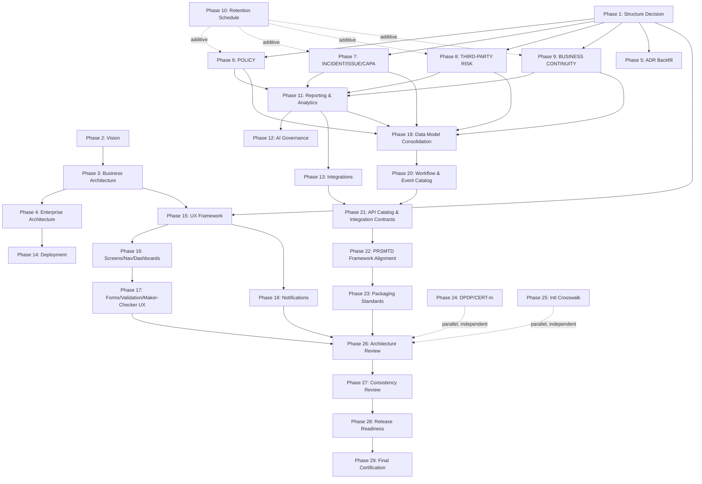

# ERM Roadmap & Progress Tracker

This is the single source of truth for **progress tracking** across work sessions in this
repository — completed work, current status, and the live register of assumptions, risks, and
open decisions. It is updated at the end of every work session.

**As of Session 8**, this document also carries the
[**Master Execution Plan for Remaining Work**](#master-execution-plan-for-remaining-work) —
the phase-by-phase sequencing of everything not yet authored in this repository. Previously
(Sessions 1–7), this file described itself as distinct from [`19-roadmap/`](19-roadmap/),
treating the latter as the eventual home of the phasing/release-plan specification. Session 8
consolidates that plan into this file instead, per explicit session instruction, because the
progress tracker and the execution plan are the same living artifact in practice — every
completed-work entry below already *is* a record of one phase's execution, and forking the
plan into a second document would only create a second place for drift. `19-roadmap/README.md`
itself is unchanged by this session (only `docs/roadmap.md` was in scope) — updating its
`Status` line to point back here is folded into Phase 21 (Cross-Module REST API Catalog,
Event Contracts & Integration Contracts) of the plan below, as one of that phase's minor
cross-reference cleanups, not a separate effort. Read `CLAUDE.md` first in every session, then
this file, before doing new work.

## Current Status

**Phase**: Early specification phase — **eleventh authoritative spec complete as of Session 14**
(`14-reporting/01-reporting-management.md`, module code `REPORTING`; see the Session 14 entry
under Completed Work and Master Execution Plan Phase 11) — the tenth and final bounded context
`04-domain-model`'s map reserves. Every business-domain bounded context that document's own
Bounded Context Map enumerates is now authored as an ERM specification; only that document's
own five status-label amendments (`POLICY`, `INCIDENT`, `THIRD-PARTY RISK`, `BUSINESS
CONTINUITY`, `REPORTING`) remain proposed, not applied, and `15-analytics` (the KPI/metric
catalog and dashboard visualization layer `14-reporting/01-*` explicitly defers) remains
unauthored. Session 14 proceeded directly to Phase 11 per explicit instruction, superseding
this file's own Session 13 "Order of next work" recommendation to run the seventeen-
additive-change consolidation first (see the Session 14 entry and Assumption 43 below). The
remainder of this
paragraph and the next two are preserved as the Session 6–7 historical record of how the first
six specs reached their current state. Session 6 closed the two remaining additive-change gaps
from `11-compliance` (`10-risk`'s `Risk.source` enum gained `COMPLIANCE_OBLIGATION`;
`12-controls` gained `POST /controls/{id}/obligation-links`), and authored
[`09-security/01-security-management.md`](09-security/01-security-management.md) — the
cross-cutting Security capability every prior module already committed to independently, plus
a genuine sixth module (`SECURITY`) covering security policy taxonomy, security baselines,
privileged access management, secrets/key/certificate governance, and security finding
(vulnerability/misconfiguration/policy-violation) management. **Session 7** applied the three
additive changes `09-security` had itself proposed without building (`Risk.source =
SECURITY_FINDING` on `10-risk`; an `AuditEvidence`/`Finding` extension on `13-audit`; a tenth
bounded-context row on `04-domain-model` — `SECURITY` is no longer outside that document's own
map), then performed a full architecture consistency review across all six authoritative specs
and corrected staleness the review found in `04-domain-model` (its Bounded Context Map,
Ownership Responsibilities, and Cross-Context APIs table still labeled `COMPLIANCE`/`AUDIT`
"(reserved)" with unactivated edges, never updated after those two were authored in Sessions
4–5) and in `10-risk` (its Integration Points table still listed long-activated `CONTROLS`/
`AUDIT` rows as "Reserved"). No entity, aggregate, workflow, or ownership assignment was
redesigned by any of these corrections.

**Repository state**: Scaffolding (all 22 original `docs/NN-*/README.md` section indexes plus
`docs/reference/`, extended with `23-policy` through `27-user-experience` at Session 9) was
already initialized and validated internally consistent against `CLAUDE.md` prior to Session
1. **Eleven authoritative specs now exist as of Session 14**: `RISK`, `CONTROLS`, the
Enterprise Domain Model, `COMPLIANCE`, `AUDIT`, `SECURITY`, `POLICY`, `INCIDENT`, `TPR`, `BCP`,
and `REPORTING`. The Enterprise Domain Model's own Bounded Context Map, however, still names
only five authored business-domain modules (`RISK`, `CONTROLS`, `COMPLIANCE`, `AUDIT`,
`SECURITY`) plus five reserved contexts as of Session 7 (`POLICY`, `INCIDENT`/`ISSUE`/`CAPA`,
`THIRD-PARTY RISK`, `BUSINESS CONTINUITY`, `REPORTING`) — `POLICY`'s, `INCIDENT`'s, `TPR`'s,
`BCP`'s, and now `REPORTING`'s own status-label amendments are all proposed, not yet applied
(Assumptions 33, 35, 37, 40, and the new Session 14 assumption below) — eleven total (all ten
bounded contexts plus the Domain Model itself), all cross-references internally consistent. One
traceability/assessment artifact
(`22-traceability/02-compliance-coverage-assessment.md`) supplements the master matrix,
incrementally updated (not regenerated) each session.

**Session 8** made no change to any of the six frozen authoritative specs, to
`22-traceability/`, or to any section README — it authored no new spec, per explicit
instruction not to. Its sole output is this file's new
[Master Execution Plan for Remaining Work](#master-execution-plan-for-remaining-work) section:
a 29-phase, dependency-ordered sequencing of every piece of work named in `CLAUDE.md`'s
long-term vision, the six existing specs' own Future Extension Points/Assumptions, and this
session's explicit brief (Reporting, Analytics, AI Governance, Integrations, Deployment, the
full UX/screen/navigation/dashboard/forms/validation/notification/maker-checker-UX
specification suite, cross-module API/event/workflow/integration-contract consolidation,
PRSMTD module-framework alignment, packaging standards, and the repository's eventual
architecture review, consistency review, release-readiness assessment, and final
certification) that is not already covered by an existing Next Milestone item. The prior
Next Milestone list (Sessions 6–7) is preserved below and folded into the plan as its first
five phases, not discarded.

**Session 9** validated the Master Execution Plan's sequencing (confirmed sound) and resolved
Phase 1 (Repository Structure Extension Decision) with explicit owner approval: `docs/`
gained five new top-level sections — `23-policy`, `24-incident-issue-capa`,
`25-third-party-risk`, `26-business-continuity` (business-domain modules, numbering extended
per the `09`–`13` precedent) and `27-user-experience` (the shared presentation layer for all
business-domain sections) — plus binding refinements to `CLAUDE.md` making `05-modules/` an
index-only section and constraining `27-user-experience` to presentation content that must
reuse PRSMTD's existing frontend architecture. This was governance-only: no business
specification was authored in any of the five new sections, and Phases 2–29 remain not
started. See the Session 9 log entry and each phase's own updated status below.

**Session 10** executed Master Execution Plan Phase 6: the repository's **seventh authoritative
specification**, [`23-policy/01-policy-management.md`](23-policy/01-policy-management.md)
(module code `POLICY`), is authored — the enterprise source of truth for Policies, Standards,
Procedures, and Guidelines, their governed lifecycle, versioning, periodic re-attestation,
employee acknowledgement, and exceptions. Two of its three inbound integrations
(`COMPLIANCE`, `SECURITY`) activate with **zero** additive change to either frozen spec; a
third (`CONTROLS`) and a `04-domain-model` status-label amendment remain **proposed, not
applied** — see the Session 10 log entry and Assumption 33 below. No frozen spec was modified.

**Session 11** executed Master Execution Plan Phase 7: the repository's **eighth authoritative
specification**, [`24-incident-issue-capa/01-incident-issue-capa-management.md`](24-incident-issue-capa/01-incident-issue-capa-management.md)
(module code `INCIDENT`, resolving `04-domain-model`'s open naming question), is authored —
Incident intake/investigation, Root Cause Analysis, an enterprise Issue-escalation register,
and the governed CAPA lifecycle (action plan, action tracking, closure verification,
effectiveness review), plus Escalation management. This phase's own highest-risk design
decision — whether this module complements or replaces `ControlException`/
`ComplianceException`/`Finding`/`SecurityFinding`/`PolicyException` — is resolved explicitly,
with a stated reason, as **complement**: none of the five frozen entities was redesigned.
`Risk.source = INCIDENT` activates with **zero** additive change (already live since `10-risk`'s
own Session 1 authoring); `13-audit`/`09-security`'s already-reserved `capa_ref_id` columns
need only a proposed initiating endpoint each; `12-controls`/`11-compliance`/`23-policy` and a
`04-domain-model` status-label amendment remain **proposed, not applied** — see the Session 11
log entry and Assumptions 35–36 below. No frozen spec was modified.

## Completed Work

### Session 1 — 2026-07-19

- Validated the existing `docs/` scaffolding (all 22 section READMEs, root `README.md`,
  `docs/README.md`) for internal consistency and alignment with `CLAUDE.md`'s repository
  organization, naming standards, and cross-reference rules. No inconsistencies found.
- Studied PRSMTD `docs/authoritative/system.md` (governance ledger/GOV-07, RLS/data model
  conventions, RBAC model, module framework and ownership guards, observability trace
  contract, audit, authentication) to ground capability reuse decisions.
- Studied the SEBI *Risk Management System* circular (MFD/CIR/15/19133/2002) for regulatory
  drivers and the risk taxonomy.
- Authored the repository's **first authoritative specification**:
  [`10-risk/01-enterprise-risk-management.md`](10-risk/01-enterprise-risk-management.md) —
  implementation-ready spec for the Enterprise Risk Management module (`RISK`), covering
  domain model, data model (12 tables, `SEBI_AMC` seed taxonomy), maker-checker workflows,
  security/authorization, audit, reporting, integration points, and API contract.
- Updated [`10-risk/README.md`](10-risk/README.md) status to reflect the authored spec.
- Authored [`22-traceability/01-master-traceability-matrix.md`](22-traceability/01-master-traceability-matrix.md)
  (Business↔Regulatory, Capability↔PRSMTD, Requirement↔Spec matrices), seeded from the Risk
  spec, and updated `22-traceability/README.md` status.
- Created this file (`docs/roadmap.md`) and referenced it from `docs/README.md`.

### Session 2 — 2026-07-19

- Re-read `10-risk/01-enterprise-risk-management.md` as the authoritative baseline (per
  explicit instruction) and confirmed the Controls integration point without modifying it.
- Studied PRSMTD `system.md` further: module manifest field spec, `module.yaml` reference
  implementation (`modules/contacts/module.yaml`), OWN-03/04/07/08/09 schema/API/dependency/
  service-boundary rules. **Discovered `system.md §18` (Product Framework Doctrine)** —
  not reviewed in Session 1 — which designates `module.code = ERM`,
  `productClass: PRODUCT_FRAMEWORK` as the constitutional Product Framework for the
  enterprise risk domain (V1 scope: AMC Operational Risk), a richer manifest contract than
  the generic §9 framework `RISK` and `CONTROLS` both use. Flagged as a discovered
  gap/reconciliation question (see Assumptions and Risks below) rather than acted on, per
  the explicit instruction to integrate with the existing Risk module without redesigning
  it.
- Extracted usable regulatory text from `docs/reference/Annexures to Master Circular for
  Mutual Funds as on March 31, 2023_p.pdf` (text-extractable via `pdftotext`) — found a
  System Audit Program Checklist (IT Governance, Information Security/Cyber Security, Access
  Management/SOD, Change Management, Incident Management, Backup & Recovery, Job Processing,
  BCP/DR) and a Financial Reporting Risk section (ICFR testing, segregation of duties,
  reconciliation) — used to ground the Control Family taxonomy with real citations. Confirmed
  `docs/reference/Cyber Security and Cyber Resilience Framework for Mutual Funds AMCs
  (2019).pdf` is a scanned/image-only PDF with no extractable text layer in this environment
  (`pdftoppm`/OCR unavailable) — cited at scope level only, flagged for manual verification.
- Confirmed PRSMTD provides no document/object storage capability (searched `system.md` for
  "document"/"attachment"/"blob"/"evidence"/"object storage" — none found as a platform
  mechanism) — a genuine new capability requirement for evidence binary storage.
- Authored the repository's **second authoritative specification**:
  [`12-controls/01-controls-management.md`](12-controls/01-controls-management.md) —
  implementation-ready spec for the Controls Management module (`CONTROLS`), covering
  control taxonomy (12-family `SEBI_AMC` seed set), preventive/detective/corrective and
  manual/automated/IT-dependent-manual classification, ownership, lifecycle, design/operating
  effectiveness, testing, evidence management, exceptions, and the full
  security/authorization/audit/reporting/API surface (8 tables). Activates `10-risk`'s opaque
  `RiskTreatmentPlan → Control` link via a cross-module, API-mediated reference (OWN-08/
  OWN-09 compliant) — **no changes made to `10-risk/01-*.md`**.
- Updated [`12-controls/README.md`](12-controls/README.md) status to reflect the authored
  spec.
- Updated [`22-traceability/01-master-traceability-matrix.md`](22-traceability/01-master-traceability-matrix.md)
  with the Controls spec's Business↔Regulatory, Capability↔PRSMTD, and Requirement↔Spec
  entries, including the two new gaps discovered (document/object storage; `system.md §18`
  reconciliation).
- Updated this file with Session 2 progress, refreshed assumptions/risks/open decisions, and
  the next recommended milestone.

### Session 3 — 2026-07-20

- Re-read `10-risk/01-enterprise-risk-management.md` and `12-controls/01-controls-management.md`
  in full as frozen, authoritative inputs (per explicit instruction not to redesign either
  without a genuine architectural inconsistency — none was found; both remain unmodified).
- Studied PRSMTD `system.md` §9 (Module framework, manifest specification), §5b6–§5b7
  (OWN-08 dependency rules, OWN-09 service boundary), §3 (GOV-07 governance model), and
  re-read §18 (Product Framework Doctrine) in full — confirming the `module.code = ERM`
  constitutional designation and its V1 scope ("AMC Operational Risk — risk register, KRI
  monitoring, exception governance, inspection-aligned evidence packs") first discovered in
  Session 2, plus the full binding contract set (PF-CT-1–6, PF-GV-1–5, PF-CW-1–8) not
  previously read section-by-section.
- Read `modules/contacts/module.yaml` and `modules/module-template/module.yaml` to confirm
  PRSMTD ships no business-domain bounded context of its own — both are reference
  implementation/scaffolding for the generic module framework, contributing manifest shape
  only, not ERM vocabulary.
- Read every relevant future-context section README (`11-compliance`, `13-audit`,
  `05-modules`, `20-adr`, `21-standards`, `06-data-model`) to ground each reserved
  bounded-context entry in what those sections already commit to, without inventing scope
  beyond their own READMEs.
- Authored the repository's **third authoritative specification**:
  [`04-domain-model/01-enterprise-domain-model.md`](04-domain-model/01-enterprise-domain-model.md)
  — the cross-context bounded context map (DDD relationship types between `RISK`, `CONTROLS`,
  and nine reserved future contexts), the canonical business glossary superseding both
  modules' inline "authoritative until `04-domain-model/`" glossaries, a shared kernel of five
  cross-context modeling patterns (regulatory-profile-seeded taxonomy, governed lifecycle with
  append-only history, immediate-raise/governed-closure exception, opaque cross-context
  reference with local mirror, human-readable code sequence), the strategic subdomain
  classification (core/supporting/generic), ownership responsibilities, and the OWN-08/OWN-09
  dependency-rule graph. Resolved two internal ambiguities explicitly rather than silently:
  KRI is confirmed as a `RISK`-owned aggregate, not a separate future module; Regulatory
  Management is modeled as part of one `COMPLIANCE` context, not a separate one (flagged for
  confirmation when `11-compliance` is authored). Reframed the `system.md §18` question
  (Session 2's discovered gap) as a PRSMTD **module/manifest packaging** decision distinct
  from the **DDD bounded-context boundary**, which does not change either way the ADR
  resolves — narrowing, not resolving, that open decision.
- Updated [`04-domain-model/README.md`](04-domain-model/README.md) status to reflect the
  authored spec.
- Updated [`22-traceability/01-master-traceability-matrix.md`](22-traceability/01-master-traceability-matrix.md)
  with the Domain Model spec's Business↔Regulatory, Capability↔PRSMTD, and Requirement↔Spec
  entries, closing the "cross-context bounded context map" gap row and adding two new
  precisely-scoped gaps (Compliance/Regulatory Management boundary confirmation; a missing
  `Risk.source` enum value for Compliance-sourced risks).
- Updated this file with Session 3 progress, refreshed assumptions/risks/open decisions, and
  the next recommended milestone.

### Session 4 — 2026-07-20

- Re-read `04-domain-model/01-enterprise-domain-model.md`, `10-risk/01-enterprise-risk-management.md`,
  and `12-controls/01-controls-management.md` in full as frozen, authoritative inputs (per
  explicit instruction not to redesign any of them without a genuine architectural
  inconsistency — none was found; all three remain unmodified).
- Re-verified against current `PRSMTD/docs/authoritative/system.md` (full section listing,
  plus a targeted search for "object storage", "document storage", "blob storage",
  "regulatory profile") that no new platform capability has appeared since `10-risk`
  Assumption 3 and `12-controls` Assumption 4 were written — both gaps remain open exactly as
  those specs describe them.
- Extracted and read Annexures to Master Circular for Mutual Funds (March 31, 2023) §2.6
  "Compliance Risk" via `pdftotext` — not previously cited by `10-risk` (different source
  document) or `12-controls` (cited §2.5/§2.11 of the same document, not §2.6) — providing
  seventeen mandatory policy domains (§2.6.2.1(i) a–q), defined filing responsibilities
  (§2.6.2.1(ii) a–g), AML/CFT program attributes (§2.6.2.1(iii) a–d), and quarterly/
  half-yearly alert-reporting requirements (§2.6.2.1(iv) a–b) as this module's primary,
  directly-grounded regulatory driver.
- Authored the repository's **fourth authoritative specification**:
  [`11-compliance/01-compliance-management.md`](11-compliance/01-compliance-management.md) —
  implementation-ready spec for the Compliance Management module (`COMPLIANCE`), covering
  regulatory framework/profile registries (the first tables in this repository to formally
  own the `regulatory_profile` tag convention `10-risk`/`12-controls` each already use
  informally), an 8-category `SEBI_AMC` seed obligation taxonomy grounded in Annexures §2.6,
  the `Obligation` aggregate root and its governed lifecycle, compliance assessment,
  compliance exceptions (mirroring `ControlException`'s immediate-raise/governed-closure
  shape), compliance attestations, the compliance calendar (deliberately ungoverned at MVP),
  regulatory change management, evidence coordination (metadata-only, reusing
  `ControlEvidence`'s shape by convention rather than duplicating it), and the full
  security/authorization/audit/reporting/API surface (14 tables total: 4 reference, 10 core).
- **Resolved one open domain-model question explicitly**: confirmed `04-domain-model`
  Assumption 4 — Compliance Management and Regulatory Management are one bounded context,
  `COMPLIANCE`, not two — by authoring exactly the single-aggregate-root entity set
  (`Obligation`, `ObligationCategory`, `ComplianceAssessment`, `RegulatoryChange`) that
  document already anticipated, and by explicitly treating "Regulatory Obligation" and
  "Compliance Requirement" as one concept rather than introducing a second aggregate root
  (spec Assumption 4).
- **Activated, by proposal rather than by editing frozen specs, two long-standing forward
  references**: (a) `10-risk`'s `Risk.source` enum gains an additive `COMPLIANCE_OBLIGATION`
  value at implementation time (proposed in this spec's Integration with Risk section,
  mirroring exactly how `12-controls` activated `CONTROL_TEST` without editing `10-risk`);
  (b) `12-controls`' reserved `module_controls_control_obligation_link` table needs a new,
  additive `CONTROLS`-side endpoint (`POST /controls/{id}/obligation-links`) to populate it,
  since its existing `POST /controls/{id}/references` endpoint is hardcoded to the *Risk*
  mirror's column shape — discovered and proposed, not built, mirroring exactly how
  `12-controls` itself proposed but did not build a "bidirectional Risk coverage reporting"
  extension to `10-risk`. **Neither `10-risk/01-*.md` nor `12-controls/01-*.md` was
  modified.**
- Updated [`11-compliance/README.md`](11-compliance/README.md) status to reflect the
  authored spec.
- Updated [`22-traceability/01-master-traceability-matrix.md`](22-traceability/01-master-traceability-matrix.md)
  with the Compliance spec's Business↔Regulatory, Capability↔PRSMTD, and Requirement↔Spec
  entries — closing the Compliance/Regulatory Management boundary gap and the missing-enum
  gap, inheriting (not duplicating) the document/object-storage gap, and adding two new
  precisely-scoped gaps (the proposed `CONTROLS`-side obligation-link endpoint; a
  general-purpose Records Retention Schedule capability, explicitly named rather than
  silently absorbed).
- Updated this file with Session 4 progress, refreshed assumptions/risks/open decisions, and
  the next recommended milestone.

### Session 5 — 2026-07-20

- Surfaced and resolved, with the user, a structural conflict between an in-session task
  prompt and `CLAUDE.md`'s frozen repository rules: the prompt requested
  `docs/compliance/compliance-coverage-assessment.md` and
  `docs/reports/compliance-assessment.md`, both outside the approved `docs/NN-section-name/`
  hierarchy and in tension with `CLAUDE.md`'s "no new top-level docs without explicit
  proposal" rule. Resolved by user decision: the compliance coverage assessment is authored
  as `22-traceability/02-compliance-coverage-assessment.md` instead (fits the existing
  approved Traceability section); sequencing was also confirmed as the Audit module spec
  first, compliance assessment second, both in this session.
- Re-read `04-domain-model/01-enterprise-domain-model.md`, `10-risk/01-*`, `12-controls/01-*`,
  and `11-compliance/01-*` in full as frozen, authoritative inputs (per explicit instruction
  not to redesign any of them without a genuine architectural inconsistency — none was found;
  all four remain unmodified).
- Extracted and read Annexures to Master Circular for Mutual Funds (March 31, 2023) §1.3.4.1
  (Internal Audit as a mandatory line of defense; non-compliance rate; Rectification Index)
  and Annexure 8 clause 55 (semi-annual System Audit by a CISA/CISM-qualified or CERT-IN
  empanelled auditor; three-month SEBI filing deadline) via `pdftotext` — not previously cited
  at this precision by any prior spec (`12-controls` cited the System Audit Program
  Checklist's *content*, not its governing cadence clause).
- Confirmed via `04-domain-model`'s Cross-Context APIs table and a direct read of
  `12-controls`' `Control.source` enum that both `Risk.source = AUDIT_FINDING` and
  `Control.source = AUDIT_FINDING` were already live at authoring time — unlike
  `11-compliance`, this session's spec required **no** proposed additive change to any frozen
  source spec to activate its primary cross-context integrations.
- Authored the repository's **fifth authoritative specification**:
  [`13-audit/01-audit-management.md`](13-audit/01-audit-management.md) — implementation-ready
  spec for the Audit Management module (`AUDIT`), covering the audit universe, risk-based
  audit planning, the engagement lifecycle (internal audit, system audit, concurrent audit,
  thematic review, special investigation), working papers, a four-source evidence model
  (native upload, `CONTROLS`-evidence reference, `COMPLIANCE`-evidence reference, and a new
  system-trace-extract source citing PRSMTD's own Observability & Deterministic Trace
  Contract directly — the first evidentiary path in this repository not dependent on the
  still-open object-storage gap), Finding governance (immediate-raise, governed-closure),
  follow-up actions, and the Annexures-mandated Non-Compliance Rate / Rectification Index
  metrics (9 tables: 1 reference, 8 core). This is the first module whose own manifest
  declares `dependencies: [RISK, CONTROLS, COMPLIANCE]` at authoring time, consistent with
  `04-domain-model`'s designation of `AUDIT` as a Conformist graph sink.
- Updated [`13-audit/README.md`](13-audit/README.md) status to reflect the authored spec.
- Authored
  [`22-traceability/02-compliance-coverage-assessment.md`](22-traceability/02-compliance-coverage-assessment.md)
  — a repository-wide compliance coverage assessment distinguishing (a) what the current
  PRSMTD platform already implements today, from (b) what the current ERM specifications
  (`RISK`, `CONTROLS`, `COMPLIANCE`, `AUDIT`, the Domain Model) would additionally enable if
  implemented, from (c) what remains unspecified — across SEBI Mutual Fund regulation, DPDP
  Act, CERT-In Directions, and international frameworks (ISO 27001/27701/22301/31000, COBIT,
  NIST CSF) at the precision the current specifications actually support. Explicitly does not
  certify legal/regulatory compliance.
- Updated [`22-traceability/README.md`](22-traceability/README.md) to reference the new
  assessment document.
- Updated [`22-traceability/01-master-traceability-matrix.md`](22-traceability/01-master-traceability-matrix.md)
  with the Audit spec's Business↔Regulatory, Capability↔PRSMTD, and Requirement↔Spec entries
  — closing the "Audit findings as a risk source; control test evidence as audit evidence"
  gap row, and recording that no new gap was introduced by this spec beyond the two already
  flagged (object-storage; `system.md §18` reconciliation).
- Updated this file with Session 5 progress, refreshed assumptions/risks/open decisions, and
  the next recommended milestone.

### Session 6 — 2026-07-20

- Re-read `04-domain-model/01-*`, `10-risk/01-*`, `12-controls/01-*`, `11-compliance/01-*`,
  and `13-audit/01-*` in full as authoritative inputs, per explicit instruction to treat all
  existing specs as frozen unless a genuine architectural inconsistency is discovered (none
  was found in any of the five; all five's own domain/data models remain unmodified — only
  the two pre-approved additive changes below and consequent cross-reference updates were
  applied).
- **Phase 1 — completed both additive Compliance-driven enhancements** `docs/roadmap.md`'s
  own Next Milestone (Session 5) named as item 1, per explicit user approval this session:
  - Added `Risk.source = COMPLIANCE_OBLIGATION` to `10-risk/01-enterprise-risk-management.md`
    (Data Model `module_risk_register.source`; Integration Points table updated to
    Activated) — one-line, additive, non-breaking; recorded in that document's new Amendment
    log.
  - Added `POST /controls/{id}/obligation-links` to
    `12-controls/01-controls-management.md` (new "Activating the Control → Obligation Link"
    section, APIs table, Architecture's future `dependencies: [COMPLIANCE]` note) — additive,
    non-breaking, no schema change (`module_controls_control_obligation_link` already carried
    the required shape); recorded in that document's new Amendment log.
  - Updated `11-compliance/01-compliance-management.md`'s own cross-references (Assumption 6,
    Integration with Risk, Integration with Controls, Dependencies, Future Extension Points)
    from "proposed, not built" to "activated," per its own Amendment log — **no redesign of
    that document's domain model, data model, or workflows**.
  - Closed both corresponding gap rows in
    [`22-traceability/01-master-traceability-matrix.md`](22-traceability/01-master-traceability-matrix.md).
- Studied PRSMTD `system.md` §6 (Security model — plane separation, platform realm
  architecture, multi-issuer authentication), §7 (`encryption_keys`/`encryption_key_versions`
  key registry), §8 (RBAC model, all domains, re-read in full), §5c (Module Security Model),
  §11 (Production Credential Policy — forbidden-credential doctrine, external secrets store
  requirement; Release 0.7 Network Infrastructure Invariants — Wildcard DNS/TLS, Realm
  Factory per-realm service accounts), §17 (Runtime Validator Harness Doctrine — constitutional
  smoke/extended/experimental tier vocabulary), §21 (Authentication Surface Ownership,
  re-read in full), §22 (Observability Canonical Access) — none previously read at this depth
  by any prior session — to ground Phase 2's reuse-before-redesign decisions.
- **Phase 2 — authored the repository's sixth authoritative specification**:
  [`09-security/01-security-management.md`](09-security/01-security-management.md) — the
  shared enterprise Security capability. Two-part design: (a) a **consolidation** of the
  identity/authentication/RBAC/segregation-of-duties/data-classification content every one of
  `RISK`/`CONTROLS`/`COMPLIANCE`/`AUDIT` already independently states inline, named
  canonically once (a full PRSMTD Security Substrate Reuse Matrix maps all ~21 sub-capabilities
  named in this session's brief to Built/Specified/Gap); and (b) a genuine new module,
  module code `SECURITY`, covering `SecurityPolicyDomain` (taxonomy), `SecurityBaseline`
  (reference register — compliance testing deliberately left to `CONTROLS`' existing
  `ControlTest`, not duplicated), `SecurityFinding` (one immediate-raise/governed-closure
  entity for vulnerabilities/misconfigurations/policy-violations/access-anomalies, mirroring
  `13-audit`'s `Finding` design exactly), `SecurityAsset` (one governed inventory register for
  secrets/API keys/encryption keys/TLS certs/signing certs/SSH keys — ownership and
  rotation/expiry tracking only, never credential material), and `SecurityAccessGrant` (a
  time-bound, `pending_action`-governed Privileged Access Management record with immediate,
  ungoverned revocation) — 8 tables total (3 reference, 5 core/evidence).
- **Explicitly surfaced, not silently resolved, a gap in `04-domain-model`**:
  its Bounded Context Map does not reserve a `SECURITY` context, despite `CLAUDE.md`'s
  long-term vision naming Cybersecurity Governance as its own capability. Per this session's
  explicit instruction not to redesign frozen specs absent a genuine inconsistency,
  `09-security/01-*` **proposes, but does not apply,** the additive tenth-context amendment
  `04-domain-model` would need — the same discipline `11-compliance` used for its own two
  proposals before they were approved and applied this session.
- **Proposed, but did not apply, three further additive changes** (all consistent with the
  now-twice-proven "propose in the new spec, apply in a later approved session" pattern):
  `Risk.source = SECURITY_FINDING` on `10-risk`; an `AuditEvidence.evidence_source =
  SECURITY_EVIDENCE_REFERENCE` value plus a `Finding.linked_security_finding_id` column on
  `13-audit`; and the `04-domain-model` tenth-context row above. **No change was made to
  `10-risk/01-*.md` or `13-audit/01-*.md`** by this session beyond what Phase 1 already
  approved.
- **Named two genuinely new PRSMTD capability gaps**, verified absent this session: a
  SIEM/automated-threat-detection/security-event-correlation capability (general
  notification/alerting was attempted platform-wide and explicitly retired per system.md
  PR-RESET-02 — a stronger finding than "never built"); and an ABAC policy-decision mechanism
  (PRSMTD implements RBAC exclusively, three closed domains, system.md §8).
- Updated [`09-security/README.md`](09-security/README.md) status to reflect the authored
  spec.
- Updated [`22-traceability/01-master-traceability-matrix.md`](22-traceability/01-master-traceability-matrix.md)
  with the Security spec's Business↔Regulatory, Capability↔PRSMTD, and Requirement↔Spec
  entries — closing the two Phase 1 gap rows and adding five new precisely-scoped gap rows
  (the `04-domain-model` tenth-context proposal; the `Risk.source = SECURITY_FINDING`
  proposal; the `AuditEvidence`/`Finding` extension proposal; the SIEM gap; the ABAC gap).
- Incrementally updated (never regenerated)
  [`22-traceability/02-compliance-coverage-assessment.md`](22-traceability/02-compliance-coverage-assessment.md)
  — only the sections Session 6's changes affect: Executive Summary, Question 2, Platform
  Capability Matrix (+5 rows), Compliance Coverage Matrix (Cyber Security Framework row),
  Control-Level Matrix (+2 rows), Enterprise Capability Matrix (+1 row), Regulatory Readiness
  Matrix (Cyber Security Framework row), Gap Assessment (2 gaps closed, 4 new gaps added),
  Roadmap Validation, Specification Progress Matrix, Repository Maturity, and Percentage
  Completion (Platform Capability Completion recount to 24 rows; Specification Completion's
  4/9 figure explicitly preserved unchanged, with `SECURITY` noted as outside that fraction's
  scope, not folded in). Every matrix continues to explicitly distinguish Already Built in
  PRSMTD / Fully Specified in ERM but Yet to Build / Not Yet Specified, per this session's
  instruction.
- Updated this file with Session 6 progress, refreshed assumptions/risks/open decisions, and
  the next recommended milestone.

### Session 7 — 2026-07-20

- Re-read all six authoritative specs (`04-domain-model/01-*`, `10-risk/01-*`,
  `12-controls/01-*`, `11-compliance/01-*`, `13-audit/01-*`, `09-security/01-*`) in full,
  together, before making any change, per this session's explicit instruction. Treated all six
  as frozen except for genuinely additive amendments and genuine architectural inconsistencies
  found during review — no entity, aggregate, workflow, API, or ownership assignment was
  redesigned anywhere in this session.
- **Phase 1 — applied the three additive amendments identified during `09-security`'s own
  authoring (Session 6), all explicitly authorized this session**:
  1. Reserved the `SECURITY` bounded context within the Enterprise Domain Model: amended
     `04-domain-model/01-enterprise-domain-model.md`'s Strategic Classification, Bounded
     Context Map (mermaid + narrative subsection), Ownership Responsibilities, Canonical
     Business Glossary, and Dependency Rules (new Rule 7) to add `SECURITY` as a tenth, Core
     Domain, authored context — peer to `CONTROLS`/`COMPLIANCE`, Conformist supplier toward
     `AUDIT` — closing the gap `09-security/01-*` Assumption 1 discovered.
  2. Added `Risk.source = SECURITY_FINDING` to `10-risk/01-enterprise-risk-management.md`'s
     `module_risk_register.source` enum (Data Model) and activated the corresponding
     Integration Points row — a one-line, additive, non-breaking change, the same kind of
     change `11-compliance` and `12-controls` each already made live for their own values.
  3. Extended `13-audit/01-audit-management.md` so Security Findings can participate in the
     audit evidence/finding model: added `AuditEvidence.evidence_source =
     SECURITY_EVIDENCE_REFERENCE` (Data Model, `module_audit_evidence`) and
     `Finding.linked_security_finding_id` (Data Model, `module_audit_finding`), a new
     "Integration with Security" section, and a `SECURITY` entry to `AUDIT`'s own
     `dependencies:` declaration (now `[RISK, CONTROLS, COMPLIANCE, SECURITY]`).
  4. Updated `09-security/01-security-management.md`'s own cross-references (Assumption 1,
     Assumption 14, Relationship to the Enterprise Domain Model, Integration with Risk,
     Integration with Audit, Ownership Boundaries table, Dependencies, Future Extension
     Points, Traceability) from "proposed, not applied" to "activated," and added the one
     net-new, additive endpoint the Audit activation required —
     `GET /findings/{id}/reference` (API Surface) — the same reference-resolution endpoint
     shape every other supplying context in this repository already exposes.
  - Recorded all four amendments in each document's own Amendment Log (new for
    `04-domain-model` and `09-security`; appended for `10-risk` and `13-audit`).
- **Phase 2 — performed a complete architecture consistency review** across bounded context
  ownership, aggregate/entity ownership, shared concepts, terminology, enumerations, lifecycle
  consistency, API consistency, event flows, traceability, cross-references, PRSMTD capability
  reuse, compliance coverage, and roadmap alignment, for all six authoritative specs together.
  Found and corrected three genuine, pre-existing inconsistencies (none introduced by Phase 1;
  all were artifacts of `04-domain-model` never having been revisited after later modules were
  authored) — no speculative redesign, no new authoritative documents created:
  1. `04-domain-model`'s Bounded Context Map, Strategic Classification, Ownership
     Responsibilities, Cross-Context APIs table, and "Evidence as a Cross-Cutting Concept"
     section still labeled `COMPLIANCE` and `AUDIT` "(reserved)" with dashed,
     not-yet-activated edges, despite both having been authored (Sessions 4 and 5
     respectively) with their integrations fully activated. Corrected to "(authored)" with
     solid edges; no relationship type, direction, or ownership assignment changed — only the
     status label and cross-reference prose.
  2. `10-risk`'s own Integration Points table still listed its `CONTROLS` link as "Reserved,
     opaque reference; inert until Controls module ships" (stale since Session 2) and its
     `AUDIT` link as "Not yet specified; `Risk.source = AUDIT_FINDING` reserved" (stale since
     Session 5). Both corrected to Activated, cross-referencing each supplying document's own
     Integration section.
  3. `11-compliance` carried two broken anchor links to `04-domain-model`'s
     `#compliance-reserved` heading, which no longer exists now that the heading reads
     `COMPLIANCE (authored)`. Corrected to `#compliance-authored`.
- Incrementally updated (never regenerated)
  [`22-traceability/01-master-traceability-matrix.md`](22-traceability/01-master-traceability-matrix.md)
  — closed the three additive-change gap rows from Session 6, updated the `AUDIT`/`SECURITY`/
  Enterprise-Domain-Model Capability↔PRSMTD rows to reflect Session 7 activation, and added a
  Session 7 paragraph to Status documenting both the Phase 1 activations and the Phase 2
  consistency corrections.
- Incrementally updated (never regenerated)
  [`22-traceability/02-compliance-coverage-assessment.md`](22-traceability/02-compliance-coverage-assessment.md)
  — updated the ERM-verification document count (five → six authored specs) in Scope and
  Method; updated Executive Summary, Gap Assessment (closed three gap rows, added one new
  Session-7-discovered-and-closed row for the `04-domain-model`/`10-risk` staleness), Roadmap
  Validation, Repository Maturity, and Percentage Completion. **Specification Completion
  recalculated from 4/9 ≈ 44% to 5/10 = 50%** — a direct, mechanical consequence of
  `04-domain-model`'s own bounded-context map gaining a tenth (`SECURITY`) context, not a
  redefinition of what the fraction measures. Platform Capability Completion (24-row count)
  is unchanged — no new capability rows were added this session, only cross-references between
  already-counted rows were activated.
- Updated this file with Session 7 progress, refreshed assumptions/risks/open decisions, and
  the next recommended milestone.

### Session 8 — 2026-07-21

- **Recovered from an interrupted prior session** with no committed or uncommitted trace of
  work: `git status` was clean, `git log` showed only the single initial commit, and
  `docs/roadmap.md` was byte-for-byte the Session 7 close-out — confirming the interrupted
  session had not yet written anything toward this session's brief. Proceeded as a fresh start
  on this specific task (producing a master execution plan) without re-doing Sessions 1–7's
  own work, per explicit instruction to determine actual progress from repository state rather
  than assume any.
- Re-read `CLAUDE.md` in full, this file (all seven prior session entries, Assumptions, Risks,
  Open Decisions), all 22 `docs/NN-*/README.md` section indexes (confirming which remain "Not
  yet authored" and what each one's own "What belongs here" scope commits to), and both
  traceability artifacts (`22-traceability/01-master-traceability-matrix.md`,
  `22-traceability/02-compliance-coverage-assessment.md`) in full. Did **not** re-read the six
  authoritative specs' full bodies line-by-line (they were re-read in full as recently as
  Session 7 and remain frozen; this session's own instruction was explicitly not to author or
  redesign any spec) — instead relied on the Session 1–7 log, the traceability matrices, and
  the compliance coverage assessment, all three of which already aggregate each spec's
  Assumptions, Future Extension Points, and gap rows at the precision this session's planning
  work needed. No architectural inconsistency was found or claimed; nothing in any frozen spec
  was touched.
- **Identified one structural fact none of Sessions 1–7 had named explicitly**: `CLAUDE.md`'s
  22-section repository organization has no numbered section for any of the four still-reserved
  business-domain bounded contexts (`POLICY`, `INCIDENT`/`ISSUE`/`CAPA`, `THIRD-PARTY RISK`,
  `BUSINESS CONTINUITY`) the way `09-security` through `13-audit` already occupy dedicated
  numbers for `SECURITY`/`RISK`/`COMPLIANCE`/`CONTROLS`/`AUDIT`. Sections 14–22 are already
  claimed by cross-cutting categories (Reporting, Analytics, AI, Integrations, Deployment,
  Roadmap, ADR, Standards, Traceability), so no free number exists for a fifth domain module
  without extending the numbering — a genuine scoping gap, previously only partially named
  (Session 7's Next Milestone item 2 flagged it for `POLICY` alone, as "which `docs/NN-*/`
  section owns it"). Made this Phase 1 of the plan below rather than silently assigning
  numbers, per `CLAUDE.md`'s explicit-proposal rule for new top-level sections and the
  Session 5 precedent for exactly this kind of structural question.
- **Identified a second, larger structural gap**: none of the 22 sections is scoped for
  UX/frontend specification content (screens, navigation, dashboards-as-UI, forms, validation
  rules, notifications, maker-checker approval UI) — `15-analytics/README.md` explicitly scopes
  itself to "dashboard *specs* (composition of metrics, not pixel-level UI design)", and no
  other section claims this territory either. This session's brief explicitly requires this
  content, so it cannot be silently dropped; also folded into Phase 1's decision gate rather
  than resolved unilaterally.
- Authored the **Master Execution Plan for Remaining Work** (new section below,
  `#master-execution-plan-for-remaining-work`) — 29 phases across 7 tiers, each carrying
  Objective, Scope, Deliverables, Inputs, Outputs, Dependencies, Estimated Complexity, Success
  Criteria, New-Spec/Extends-Spec flags, and required Traceability/Compliance
  Assessment/Roadmap updates, sequenced by actual dependency (not just by `CLAUDE.md`'s section
  numbering) so a future session can pick up any phase and know exactly what must already be
  true before starting it.
- Updated this file's opening framing (this document now explicitly carries the execution plan
  `19-roadmap/` was originally scoped to hold, per this session's explicit instruction — see
  the note at the top of this file) and Current Status.
- **Did not modify** `22-traceability/01-master-traceability-matrix.md` or
  `22-traceability/02-compliance-coverage-assessment.md` this session — no new Traceability
  block was added anywhere (no spec was authored), so neither aggregation document had
  anything new to absorb. Each phase in the plan below states explicitly what future update
  each of those two documents will need once that phase actually executes.

### Session 9 — 2026-07-21

- Re-read `CLAUDE.md`, this file in full (all eight prior session entries, the complete
  29-phase Master Execution Plan, Assumptions, Risks, Open Decisions), the repository
  hierarchy, and the relevant section READMEs (`05-modules`, `15-analytics`,
  `03-enterprise-architecture`, `21-standards`, `19-roadmap`) per this session's explicit
  instruction to validate the plan and resolve Phase 1 before any further authoring.
- **Validated the Master Execution Plan's sequencing and dependency graph**: confirmed no
  cycles, no phase depending on something sequenced later, and Phase 1 correctly gating every
  phase that needs a section to write into (5, 6–9, 15–18). Found one minor documentation gap,
  not a sequencing defect: Phase 26's Mermaid diagram omits edges from Phases 10, 12, and 14
  even though Phase 26's own prose Dependencies ("every phase in Tiers 0–6 that the release
  scope requires") already correctly covers them — the prose is authoritative; the diagram is
  just incomplete. Flagged for a one-line fix whenever Phase 26 is actually executed; not
  acted on this session (out of this session's scope).
- **Produced and presented a decision package** for Phase 1's two questions (business-domain
  module section placement; UX/frontend specification placement), each with Option A/Option B
  analysis, advantages/disadvantages, a recommendation, and long-term impact, per this
  session's explicit brief — see this session's conversation record for the full package (not
  duplicated here; this file records the resolution, not the deliberation, consistent with
  every other resolved Open Decision in this register).
- **Owner approved both recommendations**, with three governance refinements to Decision 2
  that this session folded directly into `CLAUDE.md` (not just recorded here) so they bind
  every future session, not only this one:
  1. `05-modules/` is a **module index/registry only** — one entry per module pointing to its
     authoritative spec in its own dedicated section; it must never duplicate or own module
     content. This sharpens (does not contradict) this file's own Decision 1 analysis, which
     had already identified that Phase 21's planned `05-modules/01-module-index.md` is a thin
     index, not a content fork.
  2. `27-user-experience` owns **presentation layer only** — it must not redefine or own
     business rules, workflows, domain models, APIs, or data ownership; those remain owned by
     each domain section. Every screen/form/dashboard spec authored under `27-user-experience`
     must trace to a named entity/state/role already defined in its owning domain section.
  3. UX specifications must **reuse PRSMTD's existing frontend architecture** (Next.js App
     Router shell, dynamic module navigation via `GET /api/v1/modules`, the
     `src/components/{ui,common,module}` component library, and the existing `approvals`/
     `dashboard` feature-area conventions in `frontend/src/features/`) rather than design a
     competing one. A new UI pattern may be introduced only where no PRSMTD equivalent exists,
     explicitly identified and justified as a new capability requirement.
  - Read `PRSMTD/frontend/` (`app/`, `src/`) directly to ground refinement 3 in what actually
    exists today, rather than assume: confirmed PRSMTD already has `approvals` and `dashboard`
    feature areas under `frontend/src/features/`, a shared component library under
    `frontend/src/components/{ui,common,module}`, dynamic (non-hardcoded) module navigation
    from `GET /api/v1/modules` (Frontend Hardcoding Guard, `system.md` §5b15), and closed-world
    UI/BFF route enumeration (`system.md` §4.1 T4/T5) — none of this was previously named in
    this repository's PRSMTD capability inventory.
- **Executed Phase 1 as a governance-only phase**, per the owner's explicit scoping
  ("update the repository hierarchy, CLAUDE.md, README files, roadmap.md, and create the
  required section stubs; no business specifications authored"):
  - Updated [`../../CLAUDE.md`](../../CLAUDE.md): added a **Frontend/UI shell** row to the
    PRSMTD capability inventory (grounding refinement 3 above); extended the Repository
    organization listing with `23-policy/`, `24-incident-issue-capa/`, `25-third-party-risk/`,
    `26-business-continuity/`, `27-user-experience/`; corrected the `05-modules/` line to
    describe it as an index/registry, not per-capability specs; added binding prose stating
    the `05-modules/` index-only rule and the `27-user-experience/` presentation-only boundary
    plus its reuse-before-redesign requirement, so both bind every future session from
    `CLAUDE.md` itself, not only from this file's log.
  - Updated [`05-modules/README.md`](05-modules/README.md) to match — Purpose and "What
    belongs here" now describe an index/registry pointing at each module's own dedicated
    section, with an explicit "does not belong here" callout for domain content.
  - Created five new section stub READMEs — `23-policy/README.md`,
    `24-incident-issue-capa/README.md`, `25-third-party-risk/README.md`,
    `26-business-continuity/README.md`, `27-user-experience/README.md` — each following the
    existing unauthored-section README shape (Purpose, What belongs here, Cross-references,
    Status: Not yet authored), each cross-referencing `04-domain-model`'s existing reservation
    (for 23–26) or this session's own boundary/reuse rules (for 27), and each pointing at its
    corresponding Master Execution Plan phase. **No business specification (module domain
    model, data model, workflow, security model, or API contract) was authored in any of the
    five new sections** — that remains Phases 6–9 and 15–18's work, unchanged.
  - Marked Phase 1 **Complete — Session 9** below (Phase Summary table and its own detail
    entry) and closed the two corresponding Session 8 Open Decisions.
- **Did not modify** `22-traceability/01-master-traceability-matrix.md` or
  `22-traceability/02-compliance-coverage-assessment.md` this session — Phase 1 is a
  governance/structure decision, not a spec; per its own "Traceability updates required: None
  (no spec changes yet)" entry, neither aggregation document has anything new to absorb.
- Per the owner's explicit instruction, the remaining Master Execution Plan phases (2 onward)
  are not started this session — continuing into Phase 2 (Vision Specification) or later is
  deferred to a future session/turn, so each can be scoped and reviewed on its own rather than
  begun as a side effect of closing out Phase 1.

### Session 10 — 2026-07-21

- Began Phase 2 of the owner-approved Master Execution Plan: reviewed the repository
  governance updates from Session 9 (`CLAUDE.md`'s Frontend/UI shell row, `05-modules/`
  index-only rule, `27-user-experience` presentation-only boundary), this file in full (all
  nine prior session entries, the complete Master Execution Plan, Assumptions, Risks, Open
  Decisions), and the six frozen authoritative specs' own forward references to `POLICY`
  (`12-controls`' Control Taxonomy; `11-compliance`'s "Integration with Future Policy
  Management"; `09-security`'s `SecurityPolicyDomain` taxonomy and its own "Integration with
  Future Policy Management" section) before making any change, per this session's explicit
  instruction. Treated all six frozen specs as authoritative inputs, not to be redesigned —
  none was modified.
- **Executed Master Execution Plan Phase 6 (Policy Management Module)**: authored the
  repository's **seventh authoritative specification**,
  [`23-policy/01-policy-management.md`](23-policy/01-policy-management.md) — module code
  `POLICY`, the enterprise source of truth for Policies, Standards, Procedures, and Guidelines
  (unified under one `document_type`-discriminated aggregate root, avoiding premature
  decomposition into four separate roots), covering: a `PolicyCategory` taxonomy seeded in
  deliberate parallel to `11-compliance`'s `ObligationCategory` (both grounded in Annexures
  §2.6.2.1(i) a–q, re-cited rather than re-extracted); the governed `Policy`/`PolicyVersion`
  lifecycle (draft → submit → review → approve → publish → retire, via `pending_action`,
  mirroring the `RiskAssessment`/`ControlTest`/`ComplianceAssessment` root/child governed-
  lifecycle shape exactly); `PolicyReview` as a distinct governed periodic re-attestation
  entity (a `REAFFIRMED` outcome does not itself create a new `PolicyVersion`, mirroring
  `11-compliance` Assumption 8's "a governed approval never auto-creates rows in a different
  aggregate" precedent); `PolicyAcknowledgement` as a lightweight, ungoverned, append-only
  individual record (the third instance of the "not every mutation needs governance"
  precedent, after `RiskAppetite` and `ControlFamily`/`ComplianceCalendarEntry`);
  `PolicyException` (immediate-raise, governed-closure, identical shape to
  `ControlException`/`ComplianceException`); and a single polymorphic `PolicyReferenceLink`
  mirror table (rather than one mirror table per citing module) so a future third or fourth
  citing context needs only a new enum value, not a new migration — nine tables total (2
  reference, 7 core), full security/authorization/audit/reporting/API surface.
- **Closed two of this module's three forward-reference activations with zero additive
  change to any frozen spec** — a first for a module with more than one inbound integration
  point: `11-compliance`'s `module_compliance_obligation_policy_link`/`POST
  /obligations/{id}/policy-links` (built Session 4, explicitly reserved "inert until a Policy
  module ships") and `09-security`'s `GET /policy-domains` endpoint (built Session 6) were
  both already exactly the shape this module needed. `POLICY`'s own manifest declares
  `dependencies: [SECURITY]` immediately (an active, not proposed, dependency — the same
  zero-additive-change activation `13-audit` achieved at its own authoring) for the
  `SecurityPolicyDomain` tag; `COMPLIANCE`'s own manifest gaining `dependencies: [POLICY]` at
  implementation time confirms, rather than proposes, a note `11-compliance`'s own Architecture
  section already carried.
- **Proposed, but did not apply, two additive changes**, following the now-six-times-used
  propose-in-the-new-spec/apply-in-a-later-approved-session pattern: (a) a
  `module_controls_control_policy_link`/`POST /controls/{id}/policy-links` extension to
  `12-controls` (which, unlike `11-compliance`, had reserved no policy link at all — verified
  by direct search of `12-controls/01-*.md`); (b) the `04-domain-model` status-label amendment
  `POLICY (reserved)` → `POLICY (authored)` (Bounded Context Map, Ownership Responsibilities,
  Cross-Context APIs), the same amendment shape `09-security` proposed for its own onboarding
  (Session 6, applied Session 7). **No change was made to `12-controls/01-*.md` or
  `04-domain-model/01-*.md`** by this session.
- Updated [`23-policy/README.md`](23-policy/README.md) status to reflect the authored spec.
- Updated [`22-traceability/01-master-traceability-matrix.md`](22-traceability/01-master-traceability-matrix.md)
  with the Policy spec's Business↔Regulatory, Capability↔PRSMTD, and Requirement↔Spec entries
  — adding the Policy Management row, the two new proposed-not-applied additive-change gap
  rows, and a Session 10 Status paragraph.
- Incrementally updated (never regenerated)
  [`22-traceability/02-compliance-coverage-assessment.md`](22-traceability/02-compliance-coverage-assessment.md)
  — Executive Summary, Scope and Method, Question 2, Platform Capability Matrix (`Policy
  Management`: Not Started → Planned), Compliance Coverage Matrix / Regulatory Readiness
  Matrix (Cyber Security Framework and ISO 27001 rows updated to reflect `POLICY`'s
  existence), Control-Level Matrix (`+1` row; ISO 27001 Annex A.5 row updated from "No (no
  Policy module)" to "Yes"), Enterprise Capability Matrix, Gap Assessment (`POLICY` scoping
  gap closed; two new proposed-not-applied gap rows added), Roadmap Validation, Specification
  Progress Matrix (`+1` row), Repository Maturity, and Percentage Completion. **Specification
  Completion deliberately stays at 5/10 = 50%, not 6/10, this session** — `04-domain-model`'s
  own Bounded Context Map has not yet been amended to relabel `POLICY` "(authored)," the same
  one-session lag `SECURITY` itself had between Sessions 6 and 7; Platform Capability
  Completion moves from 7/7/10 to 7/8/9 (out of 24), since `Policy Management` is the only row
  whose status changed.
- Updated this file (this entry; Phase Summary table and Phase 6's own detail entry marked
  complete below; Assumptions, Risks, and Open Decisions refreshed; Next Milestone updated).

### Session 11 — 2026-07-21

- Reviewed `CLAUDE.md`, this file in full (all ten prior session entries, the complete Master
  Execution Plan, Assumptions, Risks, Open Decisions), the Enterprise Domain Model, and all
  seven frozen specs (`10-risk`, `12-controls`, `11-compliance`, `13-audit`, `09-security`,
  `23-policy`) — specifically each one's own forward reference to the still-reserved
  `INCIDENT`/`ISSUE`/`CAPA` context — before making any change, per this session's explicit
  instruction. Confirmed by direct search which of the five citing specs already reserve a
  `capa_ref_id` column (`13-audit`'s `FollowUpAction`, `09-security`'s `SecurityFinding` — both
  already built) versus which do not (`12-controls`'s `ControlException`, `11-compliance`'s
  `ComplianceException`, `23-policy`'s `PolicyException` — none reserves one). Treated all
  seven frozen specs as authoritative inputs, not to be redesigned — none was modified.
- **Executed Master Execution Plan Phase 7 (Incident / Issue / CAPA Module)**: authored the
  repository's **eighth authoritative specification**,
  [`24-incident-issue-capa/01-incident-issue-capa-management.md`](24-incident-issue-capa/01-incident-issue-capa-management.md)
  — module code `INCIDENT`, resolving `04-domain-model`'s open module-code naming question as
  a single combined module for Incident, Issue, and CAPA (per that document's own reasoning
  for reserving one combined context rather than three). Covers: `Incident` (a genuinely new
  top-level realized-adverse-event register) and its immediate-raise/governed-closure
  lifecycle; `RootCauseAnalysis`, governed, attachable to an Incident or a standalone Issue;
  `Issue`, an enterprise-level remediation-escalation register with a polymorphic
  `IssueSourceLink` mirror (mirroring `23-policy`'s own `PolicyReferenceLink` design exactly);
  the full `CAPA` lifecycle — action-plan proposal and approval, ungoverned action-item
  tracking (mirroring `13-audit`'s own `FollowUpAction` shape), governed closure verification
  (independent of the plan's executor), and governed effectiveness review (a later check that
  the fix actually held, directly operationalizing the Rectification Index pattern
  `13-audit` already established at the individual-CAPA level); and `Escalation`, generalizing
  `10-risk`'s own `Escalation` entity to this module's Incident/Issue/CAPA entities exactly as
  `04-domain-model`'s Common Domain Patterns table itself anticipated. Thirteen tables total (3
  reference, 10 core), full security/authorization/audit/reporting/API surface.
- **Made explicit, with a stated reason, the single highest-risk design decision this phase's
  own Master Execution Plan entry flagged**: this module **complements**, not replaces,
  `ControlException` (`12-controls`), `ComplianceException` (`11-compliance`), `Finding`
  (`13-audit`), `SecurityFinding` (`09-security`), and `PolicyException` (`23-policy`) — each
  keeps its own domain model, data model, and governed closure lifecycle exactly as its frozen
  spec defines, unmodified. This module instead adds `Incident` (no prior equivalent), `Issue`
  (an opt-in, enterprise-level escalation register any of the five may link into via an opaque
  reference when a problem's significance warrants formal CAPA governance beyond a single
  module's own exception-closure workflow — most exceptions will never touch this module at
  all), and `CAPA` (the structured remediation capability every one of the five frozen specs'
  own exception entity already deferred to via a free-text field or, for two of them, an
  already-reserved `capa_ref_id` column).
- **Closed the `Risk.source = INCIDENT` integration with zero additive change** — reserved
  and already live since `10-risk`'s own Session 1 authoring, the first module-relationship in
  this repository never once requiring an additive change at any point in its history. Decided
  explicitly (Assumption 3) that `Risk.source = INCIDENT` is module-level granularity and
  therefore already covers Issue- and CAPA-originated risks too — no additive `Risk.source`
  value for `ISSUE` or `CAPA` was proposed.
- **Closed two of five inbound integrations needing only a proposed endpoint, not a schema
  change**: `13-audit`'s `FollowUpAction.capa_ref_id` and `09-security`'s
  `SecurityFinding.capa_ref_id` were both already reserved at each spec's own original
  authoring — this session's spec proposes, but does not apply, only the initiating endpoint
  each needs (`POST .../capa-request`, calling this module's own new `POST /capa-requests`
  convenience endpoint). `INCIDENT`'s own manifest stays `dependencies: []` (pure provider,
  per `04-domain-model` Dependency Rule 4, extended to this context) — `AUDIT` and `SECURITY`
  are the customers initiating the call, so their own manifests gain the dependency edge, not
  `INCIDENT`'s.
- **Proposed, but did not apply, three further additive `capa_ref_id` extensions** (a
  column plus an initiating endpoint each) to `12-controls`' `ControlException`,
  `11-compliance`'s `ComplianceException`, and `23-policy`'s `PolicyException` — none of the
  three had reserved any CAPA-related field before this session, verified by direct search of
  each frozen spec. **Proposed, but did not apply, the `04-domain-model` status-label
  amendment** (`INCIDENT`/`ISSUE`/`CAPA` `(reserved)` → `(authored)`), the same amendment
  shape `09-security`/`23-policy` each proposed for their own onboarding. **No change was made
  to `12-controls/01-*.md`, `11-compliance/01-*.md`, `23-policy/01-*.md`, `13-audit/01-*.md`,
  `09-security/01-*.md`, or `04-domain-model/01-*.md`** by this session.
- Updated [`24-incident-issue-capa/README.md`](24-incident-issue-capa/README.md) status to
  reflect the authored spec.
- Updated [`22-traceability/01-master-traceability-matrix.md`](22-traceability/01-master-traceability-matrix.md)
  with the Incident/Issue/CAPA spec's Business↔Regulatory, Capability↔PRSMTD, and
  Requirement↔Spec entries — adding the Incident/Issue/CAPA row, closing the module-code
  naming gap row, adding four new proposed-not-applied additive-change gap rows, and a
  Session 11 Status paragraph.
- Incrementally updated (never regenerated)
  [`22-traceability/02-compliance-coverage-assessment.md`](22-traceability/02-compliance-coverage-assessment.md)
  — Executive Summary, Scope and Method, Question 2, Platform Capability Matrix (`Incident /
  Issue / CAPA`: Not Started → Planned), Compliance Coverage Matrix (System Audit Checklist
  §§1–8 and CERT-In rows updated — CERT-In moves from Not Supported to Partially Supported,
  timeline substrate only), Control-Level Matrix (`+2` rows), Enterprise Capability Matrix,
  Regulatory Readiness Matrix (CERT-In: Not Started → Early Stage), Gap Assessment
  (`INCIDENT`/`ISSUE`/`CAPA` gap row closed; four new proposed-not-applied gap rows added),
  Roadmap Validation, Specification Progress Matrix (`+1` row), Repository Maturity (also
  corrected a stray multi-line table-row rendering defect from Session 10's own edit — no
  content change beyond the formatting fix), and Percentage Completion. **Specification
  Completion stays at 5/10 = 50%** — neither `POLICY`'s nor `INCIDENT`'s `04-domain-model`
  status-label amendment is applied yet; the document now explicitly notes it becomes
  7/10 = 70% once both land. Platform Capability Completion moves from 7/8/9 to 7/9/8 (out of
  24), since `Incident / Issue / CAPA` is the only row whose status changed this session.
- Updated this file (this entry; Phase Summary table and Phase 7's own detail entry marked
  complete below; Assumptions, Risks, and Open Decisions refreshed; Next Milestone updated).

### Session 12 — 2026-07-21

- Reviewed `CLAUDE.md`, this file in full (all eleven prior session entries, the complete
  Master Execution Plan, Assumptions, Risks, Open Decisions), the Enterprise Domain Model, and
  all eight frozen specs (`10-risk`, `12-controls`, `11-compliance`, `13-audit`, `09-security`,
  `23-policy`, `24-incident-issue-capa`) — specifically the Master Execution Plan's Phase 8
  entry and every frozen spec's own already-seeded "third-party"/"vendor"/"outsourcing"
  content (`10-risk`'s "Third-Party Risks" `RiskCategory` sub-category; `12-controls`'
  "Third-Party/Outsourcing Oversight" control family; `11-compliance`'s and `23-policy`'s
  "Outsourcing & Related-Party Oversight" categories; `13-audit`'s already-reserved
  `AuditUniverseEntry.entry_type = VENDOR` value; `09-security`'s already-reserved
  `SecurityFinding.finding_type = THIRD_PARTY_RISK` value; `24-incident-issue-capa`'s reserved
  "Third-Party / Vendor" Incident category) — before making any change, per this session's
  explicit instruction. Treated all eight frozen specs as authoritative inputs, not to be
  redesigned — none was modified.
- Extracted and read Annexures to Master Circular for Mutual Funds (March 31, 2023) §2.9
  "Outsourcing Risk" via `pdftotext` — a dedicated, clause-level regulatory section (mandatory
  elements §2.9.3.1(i)–(vii): in-house-equivalent risk management, a dedicated vendor owner,
  a seventeen-element Board-approved Outsourcing Policy, pre-outsourcing due diligence
  including AML/CFT, post-outsourcing periodic review at least annual, structured SLA
  benchmarking, and reconciliation/fund-accounting-system checks; recommendatory elements
  §2.9.3.2: fraud-vulnerability assessment, exit-strategy/alternate-provider pooling) not
  previously mined by any frozen spec — confirming the Master Execution Plan Phase 8 entry's
  own prediction that this session's regulatory-citation work would be genuinely new, not a
  re-citation. Re-cited §2.10 "Sales and Distribution Risk" at scope level only, for the
  `Distribution & Marketing Channel` seed vendor category.
- **Executed Master Execution Plan Phase 8 (Third-Party Risk Management Module)**: authored
  the repository's **ninth authoritative specification**,
  [`25-third-party-risk/01-third-party-risk-management.md`](25-third-party-risk/01-third-party-risk-management.md)
  — module code `TPR`, activating the `THIRD-PARTY RISK` bounded context `04-domain-model`
  reserved since Session 3. Covers: `Vendor` (aggregate root) and its governed lifecycle
  (`PROSPECTIVE → ONBOARDING → ACTIVE → UNDER_REVIEW → OFFBOARDING → TERMINATED`, gated by a
  mandatory `APPROVED` due-diligence assessment before activation, mirroring every prior
  aggregate root's root/child governed-lifecycle shape); `VendorContract` (SLA terms, tenure,
  right-to-audit, sub-delegation restriction, insurance requirement, exit-strategy flag —
  operationalizing the Annexures' seventeen-element Outsourcing Policy structure without
  re-authoring the Policy document itself); `VendorAssessment` (one entity, four
  `assessment_type` values — `DUE_DILIGENCE`, `RISK_ASSESSMENT`, `SECURITY_ASSESSMENT`,
  `COMPLIANCE_ASSESSMENT` — mirroring `ControlTest`'s single-entity-multiple-type-discriminator
  shape rather than four separate entities); `VendorException` (immediate-raise,
  governed-closure, mirroring `ControlException`/`ComplianceException`/`PolicyException`
  exactly); `VendorSLA`/`VendorSLAMeasurement` (mirroring `RISK`'s own KRI/KRIMeasurement shape
  precisely, satisfying the Annexures' mandatory "structured tool to benchmark service
  providers against SLA" element); and `VendorEvidence`. Eleven tables total (2 reference, 9
  core), full security/authorization/audit/reporting/API surface.
- **Resolved, explicitly, `04-domain-model`'s own open Future Enhancements question** — "Third
  Party Risk's relationship to `RiskCategory`... whether `VendorRiskCategory` is a genuinely
  separate taxonomy or a seeded sub-tree of `RISK`'s existing `RiskCategory` hierarchy" — as
  neither: `VendorCategory` (this module's own reference table) classifies *what kind of
  vendor* a Vendor is, not a risk taxonomy at all; a Vendor-sourced Risk register entry uses
  `RISK`'s own already-seeded "Other Business Risks → Third-Party Risks" `RiskCategory`
  sub-category, present since `10-risk`'s original Session 1 seed — no `VendorRiskCategory`
  entity is designed, and no `RiskCategory` taxonomy change is needed at all (spec Assumption
  5). This spec proposes, but does not apply, the corresponding `04-domain-model` closing note.
- **Being the ninth module authored, activated six of nine cross-module integrations with
  zero additive change to any frozen spec — the highest fraction any module in this
  repository has achieved**: both directions of `23-policy`'s `PolicyReferenceLink` (the
  first confirmation, with a third citing module, that its deliberately-polymorphic design
  performs exactly as that spec intended); `09-security`'s `GET /policy-domains` tag
  resolution and its already-reserved `SecurityFinding.finding_type = THIRD_PARTY_RISK` value
  (reserved specifically for this integration at `09-security`'s own Session 6 authoring);
  `24-incident-issue-capa`'s `POST /capa-requests`, built directly into
  `VendorException.capa_ref_id` rather than merely proposed — the first module in this
  repository authored *after* `INCIDENT` already existed, and so the first able to build this
  integration outright (spec Assumption 6); and the read-only resolution directions of
  `12-controls`' `GET /controls/{id}/reference` and `11-compliance`'s
  `GET /obligations/{id}/reference`.
- **Explicitly declined to assume `CONTROLS`' and `COMPLIANCE`'s mirror-registration
  (write) endpoints are reusable without verification** — a more conservative integration-risk
  read than any prior module made. `12-controls/01-*` itself documents its own
  `POST /controls/{id}/references` as hardcoded to `RISK`'s mirror shape (the exact situation
  that produced a dedicated `POST /controls/{id}/obligation-links` for `COMPLIANCE`);
  `11-compliance/01-*`'s own APIs table describes `POST /obligations/{id}/references` as
  registering "a mirror reference from `CONTROLS`" specifically. Unlike `POLICY`'s confirmed
  third-citing-module-ready design, this spec therefore proposes, but does not apply, a
  `POST /controls/{id}/vendor-links` endpoint on `12-controls` and an unspecified-shape
  extension to `11-compliance`'s mirror-registration direction (spec Assumptions 8–9) — real
  functioning value (`GET`-direction resolution) is still delivered with zero change to either
  frozen spec.
- **Proposed, but did not apply, six further additive changes**, continuing the
  propose-in-the-new-spec/apply-in-a-later-approved-session pattern this repository has now
  used nine times: `Risk.source = THIRD_PARTY` (`10-risk`); `Control.source =
  THIRD_PARTY_RISK` plus `module_controls_control_vendor_link`/
  `POST /controls/{id}/vendor-links` (`12-controls`); the `COMPLIANCE`-side mirror-registration
  extension named above (`11-compliance`); `SecurityFinding.linked_vendor_id`
  (`09-security`); `AuditUniverseEntry.related_vendor_ref_id` (`13-audit`) — activating that
  table's already-live `entry_type = VENDOR` value with a real link; `Incident.vendor_ref_id`
  (`24-incident-issue-capa`) — activating that module's already-reserved "Third-Party / Vendor"
  category with a real link. **Proposed, but did not apply, the `04-domain-model`
  `THIRD-PARTY RISK` `(reserved)` → `(authored)` status-label amendment** plus its closing note
  on the `VendorCategory`/`RiskCategory` question. **No change was made to `10-risk/01-*.md`,
  `12-controls/01-*.md`, `11-compliance/01-*.md`, `09-security/01-*.md`, `13-audit/01-*.md`,
  `24-incident-issue-capa/01-*.md`, or `04-domain-model/01-*.md`** by this session.
- Updated [`25-third-party-risk/README.md`](25-third-party-risk/README.md) status to reflect
  the authored spec.
- Updated [`22-traceability/01-master-traceability-matrix.md`](22-traceability/01-master-traceability-matrix.md)
  with the Third-Party Risk spec's Business↔Regulatory, Capability↔PRSMTD, and
  Requirement↔Spec entries — adding the Third-Party Risk row, closing the module's own gap
  row, adding seven new proposed-not-applied additive-change gap rows (six across
  `10-risk`/`12-controls`/`11-compliance`/`09-security`/`13-audit`/`24-incident-issue-capa`,
  plus the `04-domain-model` status-label amendment), and a Session 12 Status paragraph.
- Incrementally updated (never regenerated)
  [`22-traceability/02-compliance-coverage-assessment.md`](22-traceability/02-compliance-coverage-assessment.md)
  — Executive Summary, Scope and Method, Question 2, Platform Capability Matrix (`Third-Party
  Risk`: Not Started → Planned), Compliance Coverage Matrix (new Annexures §2.9 row),
  Control-Level Matrix (`+2` rows), Enterprise Capability Matrix (`Third-Party Risk` row),
  Regulatory Readiness Matrix (SEBI Annexures row updated to include §2.9), Gap Assessment
  (`THIRD-PARTY RISK` gap row closed; two new gap rows added, one of which bundles this
  session's six additive-change proposals), Roadmap Validation, Specification Progress Matrix
  (`+1` row), Repository Maturity, and Percentage Completion. **Specification Completion
  stays at 5/10 = 50%** — none of `POLICY`'s, `INCIDENT`'s, or `TPR`'s `04-domain-model`
  status-label amendments is applied yet; the document now explicitly notes it becomes
  8/10 = 80% once all three land. Platform Capability Completion moves from 7/9/8 to 7/10/7
  (out of 24), since `Third-Party Risk` is the only row whose status changed this session.
- Updated this file (this entry; Phase Summary table and Phase 8's own detail entry marked
  complete below; Assumptions, Risks, and Open Decisions refreshed; Next Milestone updated).

### Session 13 — 2026-07-21

- Reviewed `CLAUDE.md`, this file in full (all twelve prior session entries, the complete
  Master Execution Plan, Assumptions, Risks, Open Decisions), the Enterprise Domain Model, and
  all nine frozen specs (`10-risk`, `12-controls`, `11-compliance`, `13-audit`, `09-security`,
  `23-policy`, `24-incident-issue-capa`, `25-third-party-risk`) — specifically the Master
  Execution Plan's Phase 9 entry, `04-domain-model`'s own `BUSINESS CONTINUITY (reserved)`
  entry and anticipated-entities sketch (`ContinuityPlan`, `RecoveryObjective`,
  `ContinuityTestResult`), `10-risk`'s original DR/BCP regulatory-driver flag, and
  `12-controls`' seeded "Business Continuity & Disaster Recovery" control family — before
  making any change, per explicit instruction. Treated all nine frozen specs as authoritative
  inputs, not to be redesigned — none was modified.
- Extracted and read, for the first time at clause-level precision, two regulatory sources:
  the SEBI *Risk Management System* circular's own Appendix A, Part 1, item 1 ("Disaster
  Recovery and Business Contingency Plans" — mandatory off-site backup, a regularly
  tested/evaluated plan comprehensive across IT/infrastructure/personnel, and Day-1 critical-
  function coverage: daily NAV calculation, redemption processing, outstanding trade
  settlements), previously cited by `10-risk` only by section heading; and the Annexures'
  System Audit Program Checklist item 8 "BUSINESS CONTINUITY PLANNING (BCP) & DISASTER
  RECOVERY" (sub-items 8a–8f: BCP Organization — Committee, Head/Coordinator, Crisis
  Management Team; BCP Methodology and Plan — BIA, RA, Strategy, Plan, BOD approval; BCP Plan
  content — BIA including RTO/RPO and dependency identification, RA, an eleven-element
  documented plan; BCP/DR testing — yearly review, table-top reviews, simulations, DR drills,
  alternate-site recovery testing, system recovery testing; Communication and training; DR
  Plan — recovery procedures, a DR site replicating production, redundancy, architecture
  documentation), previously cited by `12-controls` only by existence, as the source of its
  own seeded control family.
- **Executed Master Execution Plan Phase 9 (Business Continuity Management Module)**: authored
  the repository's **tenth authoritative specification**,
  [`26-business-continuity/01-business-continuity-management.md`](26-business-continuity/01-business-continuity-management.md)
  — module code `BCP`, activating the `BUSINESS CONTINUITY` bounded context `04-domain-model`
  reserved since Session 3. Covers: `CriticalBusinessService` (aggregate root, criticality-
  tiered, gated to `ACTIVE` by a mandatory `APPROVED` Business Impact Analysis, mirroring every
  prior aggregate root's root/child governed-lifecycle shape); `BusinessImpactAnalysis`
  (governed, updates the owning service's `current_rto_hours`/`current_rpo_hours`/
  `current_mtpd_hours` on approval, mirroring `VendorAssessment`'s root-updating shape);
  `CriticalServiceDependency` (upstream process, technology, vendor, personnel, facility);
  `ContinuityStrategy` (governed recovery approach selection); `ContinuityPlan` (aggregate
  root, `plan_type`-discriminated across `BCP`/`DR_PLAN`/`COMBINED` — unifying both per the
  Annexures' own single-checklist-item framing, mirroring `23-policy`'s `document_type`
  precedent) with `ContinuityPlanVersion` (mirrors `PolicyVersion` precisely, including its
  `storage_ref`-based content design) and `ContinuityPlanReview` (mirrors `PolicyReview`
  precisely, extended with a `POST_ACTIVATION` review type); `ContinuityPlanActivation`
  (immediate, ungoverned crisis/DR-invocation record — the operational fact of a plan being
  invoked, deliberately distinct from `INCIDENT`'s own incident lifecycle); `ContinuityExercise`
  (governed, `exercise_type` seeded directly from Annexure 8 item 8d's own testing strategies,
  recording RTO/RPO achievement and auto-creating a `ContinuityException` on failure, mirroring
  `25-third-party-risk`'s SLA-breach auto-exception rule); and `ContinuityException`
  (immediate-raise, governed-closure, mirroring `ControlException`/`ComplianceException`/
  `PolicyException`/`VendorException` exactly). Fourteen tables total (2 reference, 12 core),
  full security/authorization/audit/reporting/API surface.
- **Resolved, rather than merely restated, `04-domain-model`'s own anticipated-entities
  sketch and plan-vs-test-boundary recommendation for this context** — the two open questions
  that document's own `BUSINESS CONTINUITY (reserved)` entry left for this spec to settle.
  RTO/RPO/MTPD are modeled as columns on `CriticalBusinessService`, updated by an `APPROVED`
  BIA, rather than a standalone `RecoveryObjective` entity (spec Assumption 5); the plan-vs-
  `CONTROLS`-test boundary that document only recommended (`CONTROLS` keeps the effectiveness
  decision, `BUSINESS CONTINUITY` owns the plan/targets) is adopted as this spec's actual
  decision, realized as `ContinuityExercise`'s opaque `control_ref_id` corroborating (not
  duplicating) the seeded "Business Continuity & Disaster Recovery" Control (spec Assumption
  6) — the Master Execution Plan Phase 9 entry's own Success Criteria requirement.
- **Being the tenth module authored, and the first authored after both `INCIDENT` and `TPR`
  already existed, built two cross-module integrations directly rather than merely proposing
  either — a first for this repository**: `ContinuityException.capa_ref_id` via `INCIDENT`'s
  existing `POST /capa-requests`, and `CriticalServiceDependency.vendor_ref_id`/
  `ContinuityStrategy.vendor_ref_id` via `TPR`'s existing `GET /vendors/{id}/reference` (spec
  Assumption 9) — both with **zero** additive change. Also activated, with **zero** additive
  change: `POLICY`'s `PolicyReferenceLink` (both directions, this module being its fourth
  confirmed citing module); `SECURITY`'s `GET /policy-domains`, tagging its already-seeded
  "Business Continuity and Disaster Recovery" Security Policy Domain — a domain `09-security`
  itself seeded in Session 6, before this module existed; and the read-only resolution
  directions of `12-controls`' and `11-compliance`'s existing reference APIs.
- **Discovered a genuinely new kind of gap**: neither `11-compliance`'s `ObligationCategory`
  nor `23-policy`'s `PolicyCategory` eight-category seed set has a slot fitting this module's
  own primary regulatory driver (the DR/BCP mandate itself) — the first module to find its own
  driver unhoused by either existing taxonomy (spec Assumption 15). Also discovered that
  `24-incident-issue-capa` exposes no dedicated `GET /incidents/{id}/reference` endpoint (only
  the full-detail `GET /incidents/{id}`) — the first proposal in this repository for a missing
  reference-resolution *endpoint*, rather than a missing column on an existing one (spec
  Assumption 10).
- **Proposed, but did not apply, six further additive changes**, continuing the
  propose-in-the-new-spec/apply-in-a-later-approved-session pattern this repository has now
  used ten times: `Risk.source = BUSINESS_CONTINUITY` (`10-risk`); `Control.source =
  BUSINESS_CONTINUITY` plus `module_controls_control_continuity_link`/
  `POST /controls/{id}/continuity-links` (`12-controls`); a new "Technology & Operational
  Resilience" `ObligationCategory` (`11-compliance`) and matching `PolicyCategory`
  (`23-policy`); `AuditUniverseEntry.related_critical_service_ref_id` (`13-audit`) — activating
  that table's already-live `entry_type = PROCESS` value with a real link; a
  `GET /incidents/{id}/reference` endpoint (`24-incident-issue-capa`). **Proposed, but did not
  apply, the `04-domain-model` `BUSINESS CONTINUITY` `(reserved)` → `(authored)` status-label
  amendment.** **No change was made to `10-risk/01-*.md`, `12-controls/01-*.md`,
  `11-compliance/01-*.md`, `23-policy/01-*.md`, `13-audit/01-*.md`,
  `24-incident-issue-capa/01-*.md`, or `04-domain-model/01-*.md`** by this session.
- Updated [`26-business-continuity/README.md`](26-business-continuity/README.md) status to
  reflect the authored spec.
- Updated [`22-traceability/01-master-traceability-matrix.md`](22-traceability/01-master-traceability-matrix.md)
  with the Business Continuity spec's Business↔Regulatory, Capability↔PRSMTD, and
  Requirement↔Spec entries — adding the Business Continuity row, closing the module's own gap
  row (and splitting it from the still-open platform-level-DR/BCP gap owed to `18-deployment`),
  adding six new proposed-not-applied additive-change gap rows plus the `04-domain-model`
  status-label amendment, and a Session 13 Status paragraph.
- Incrementally updated (never regenerated)
  [`22-traceability/02-compliance-coverage-assessment.md`](22-traceability/02-compliance-coverage-assessment.md)
  — Executive Summary, Scope and Method, Question 2, Platform Capability Matrix (`Business
  Continuity`: Not Started → Planned), Compliance Coverage Matrix (new RMS-circular Appendix A
  Part 1 item 1 row; System Audit Checklist §§1–8 row updated; ISO 22301 row updated to
  Specified), Control-Level Matrix (`+2` rows; ISO 22301 row updated), Enterprise Capability
  Matrix (`Business Continuity` row), Regulatory Readiness Matrix (SEBI rows; ISO 22301 moved
  to Partially Ready; NIST CSF Recover note), Gap Assessment (`BUSINESS CONTINUITY` gap row
  closed; two new gap rows added, one of which bundles this session's six additive-change
  proposals), Roadmap Validation, Specification Progress Matrix (`+1` row), Repository
  Maturity, and Percentage Completion. **Specification Completion stays at 5/10 = 50%** — none
  of `POLICY`'s, `INCIDENT`'s, `TPR`'s, or `BCP`'s `04-domain-model` status-label amendments is
  applied yet; the document now explicitly notes it becomes 9/10 = 90% once all four land —
  the only remaining reserved context at that point being `REPORTING`. Platform Capability
  Completion moves from 7/10/7 to 7/11/6 (out of 24), since `Business Continuity` is the only
  row whose status changed this session.
- Updated this file (this entry; Phase Summary table and Phase 9's own detail entry marked
  complete below; Assumptions, Risks, and Open Decisions refreshed; Next Milestone updated).

### Session 14 — 2026-07-21

- Reviewed `CLAUDE.md`, this file in full (all thirteen prior session entries, the complete
  Master Execution Plan, Assumptions, Risks, Open Decisions), the Enterprise Domain Model, and
  all ten frozen specs' own Reporting Requirements sections (via targeted research rather than
  a full line-by-line re-read of each, since those sections are exactly the aggregated content
  this session's spec needed at the precision each already states) — per explicit instruction
  to begin the next approved phase directly. Treated all ten frozen specs as authoritative
  inputs, not to be redesigned — none was modified.
- **Executed Master Execution Plan Phase 11 (Reporting & Analytics Module) as a single-document
  phase**, per this session's explicit brief: authored only
  [`14-reporting/01-reporting-management.md`](14-reporting/01-reporting-management.md) (module
  code `REPORTING`), not the plan's originally-anticipated document pair. `15-analytics`'s own
  KPI/metric catalog and dashboard visualization composition remain explicitly deferred to a
  future phase, per that section's own README boundary and the new spec's own Assumption 16 —
  named, not silently dropped. This is a scoping refinement of Phase 11's own entry, not a
  deviation from it: that entry's own Scope paragraph already anticipated the two-document split
  ("author it once, referenced from both section documents") without requiring both be authored
  in the same session.
- Per explicit instruction, this session proceeded directly to Phase 11 rather than this file's
  own Session 13 "Order of next work" recommendation (apply the seventeen already-proposed
  additive changes first). No architectural inconsistency was found in that recommendation —
  it remains sound for whichever future session executes it; this session's own brief simply
  named a different phase to execute now (see Assumption 43 below).
- Authored the repository's **eleventh authoritative specification** — the tenth and final
  bounded context `04-domain-model` reserves. Covers: a 69-row seed Report Catalogue (63 rows
  consolidating every one of the nine other business-domain modules' own already-published
  Reporting Requirements section, six genuinely new cross-module/enterprise reports this module
  itself originates — a Board & Executive GRC Summary, an Enterprise Exception & Aging Register,
  an Evidence Completeness Rollup, a Regulatory Filing & Review Calendar, a Rectification Index &
  CAPA Effectiveness Rollup, and a Cross-Module CAPA & Remediation Tracker); field-level
  provenance mapping (`ReportFieldMapping`, prescriptive) and a per-instance citation manifest
  (`ReportCitation`, descriptive) — together the mechanism making a generated report
  "evidence-ready" without depending on the platform's still-open document/object-storage gap;
  on-demand report generation (`ReportInstance`) with governance gated by a new, data-driven
  granularity — a boolean `approval_required` flag per report definition, not a fixed
  per-entity-type governance rule, the first time this repository has made *whether* governance
  applies itself data-driven; and distribution record-keeping (`ReportDistribution`). Eight
  tables total (1 reference, 7 core) — the smallest data model of any authored module, a direct
  consequence of `REPORTING` originating no business fact of its own (per `04-domain-model`'s
  own Assumption 5, elaborated rather than contradicted).
- **Activated seven of nine source-module integrations with zero additive change** — the
  highest fraction of any module to date on an absolute basis (`CONTROLS`, `COMPLIANCE`,
  `SECURITY`, `POLICY`, `INCIDENT` (Issue/CAPA), `TPR`, `BCP` all already exposed both the
  `/reports/*` bulk endpoint and the `.../{id}/reference` point-citation endpoint this module
  needed) — and **discovered two genuinely new point-citation gaps no prior module had
  surfaced**: `RISK` itself exposes no `GET /risks/{id}/reference` endpoint (every prior
  integration with `RISK` only ever wrote a `Risk.source` value, never read one back for
  display), and `AUDIT` exposes neither `GET /findings/{id}/reference` nor
  `GET /engagements/{id}/reference` (`AUDIT` was designed from its own authoring as this
  repository's Conformist consumer/graph-sink, so no prior module needed to cite *into* it).
  Both are proposed, not applied, following the now-established propose-then-apply-later
  pattern. Relies on, but does not duplicate, `26-business-continuity/01-*`'s own already-open
  `GET /incidents/{id}/reference` proposal.
- **Named two genuinely new PRSMTD capability gaps**, verified absent this session: a
  scheduled-job/cron/batch-execution mechanism (no mechanism exists for periodic, unattended
  report generation — `ReportSchedule` tracks due dates only); and a generic PDF/CSV/export-
  rendering pipeline (no mechanism exists to actually produce a rendered artifact — the
  unresolved `system.md §18` PF-CT-3/PF-CW-8 evidence-pack contract is the closest conceptual
  analog, itself still unreconciled). Neither blocks this module's own MVP scope.
- **Resolved `04-domain-model`'s own open question** ("may be platform-level rather than a
  tenant module — open question") explicitly: `REPORTING` is a tenant-plane module, like every
  other module (spec Assumption 1) — a genuinely platform-level, cross-tenant reporting surface,
  if ever required, is a distinct future concern akin to `18-deployment`, not this module.
- **Proposed, but did not apply, one further additive change** beyond the two endpoint
  proposals above: the `04-domain-model` `REPORTING (reserved)` → `REPORTING (authored)`
  status-label amendment — the fifth and last such amendment this repository now carries
  alongside `POLICY`/`INCIDENT`/`THIRD-PARTY RISK`/`BUSINESS CONTINUITY`'s own still-open ones.
  **No change was made to `10-risk/01-*.md`, `13-audit/01-*.md`, or `04-domain-model/01-*.md`**
  by this session.
- Updated [`14-reporting/README.md`](14-reporting/README.md) status to reflect the authored
  spec.
- Updated [`22-traceability/01-master-traceability-matrix.md`](22-traceability/01-master-traceability-matrix.md)
  with the Reporting spec's Business↔Regulatory, Capability↔PRSMTD, and Requirement↔Spec
  entries — adding the Reporting row, closing the "Reporting/Analytics aggregation layer" and
  "tenant-vs-platform-level" gap rows, and adding four new proposed-not-applied gap rows (two
  endpoint proposals, the status-label amendment, and — as informational rows, not additive
  spec changes — the two new PRSMTD capability gaps) plus a Session 14 Status paragraph.
- Incrementally updated (never regenerated)
  [`22-traceability/02-compliance-coverage-assessment.md`](22-traceability/02-compliance-coverage-assessment.md)
  — Executive Summary, Scope and Method, Question 2, Platform Capability Matrix (`Reporting &
  Analytics` row split into `Reporting`/`Analytics`; two new gap rows), Enterprise Capability
  Matrix (`Executive Reporting`/`Regulatory Reporting` rows; new `Interactive Analytics/KPI
  Dashboards` row), Gap Assessment (`Reporting` gap closed; five new/updated rows), Roadmap
  Validation, Specification Progress Matrix (`+2` rows: `14-reporting/`, `15-analytics/`),
  Repository Maturity, and Percentage Completion. **Specification Completion stays at
  5/10 = 50%** — the `REPORTING` status-label amendment is not applied yet; the document now
  explicitly notes it becomes 10/10 = 100% once all five pending amendments land — the ceiling
  for this metric, since `REPORTING` is the last of the ten contexts. **Platform Capability
  Completion's own denominator grows this session, from 24 to 27 rows** — the single "Reporting
  & Analytics" row splits in two, and the two new PRSMTD gaps are added — moving the count from
  7/11/6 to 7/12/8 (out of 27), the same kind of denominator growth Session 6 itself applied to
  Session 5's 19-row count.
- Updated this file (this entry; Phase Summary table and Phase 11's own detail entry marked
  complete below; Assumptions, Risks, and Open Decisions refreshed; Next Milestone updated).

## Next Milestone

**Superseded by the [Master Execution Plan](#master-execution-plan-for-remaining-work) below
as of Session 8.** The items immediately below are preserved verbatim as the Session 6–7
historical record and map directly onto the plan's first five phases (item 1 → Phase 5; item 2
→ Phases 1, 6; item 3 → Phase 7; item 4 → tracked as a named PRSMTD-capability gap in the plan's
Assumptions carryover, not a phase of its own, since neither is an ERM spec). Nothing below was
edited to produce that mapping — read the plan for the authoritative current sequencing.

With `RISK`, `CONTROLS`, the Domain Model, `COMPLIANCE`, `AUDIT`, and `SECURITY` all authored,
and (Session 7) `SECURITY` fully folded into the Domain Model's own bounded-context map with
all three of its proposed additive changes applied, Session 6's Next Milestone item 1 is
**complete** (see Session 7 above). Recommended next candidates, in order:

1. **`20-adr/` entries formalizing the now-repeatedly-confirmed conventions** — the
   persona-to-module-role mapping pattern, confirmed by **five** modules now (`10-risk`
   through `09-security`); the `system.md §18` Product Framework reconciliation. Both are
   consolidation work over what already exists, not a new bounded context — recommended first,
   before starting a seventh bounded context, since no further near-zero-effort additive
   activation remains queued (unlike Sessions 6–7).
2. **`POLICY` (reserved bounded context)** — named as an Open Host Service dependency by
   `12-controls`, `11-compliance`'s "Integration with Future Policy Management", and
   `09-security`'s identical treatment of its own `SecurityPolicyDomain` taxonomy; no section
   README exists for it yet under `CLAUDE.md`'s repository organization (not listed in
   `docs/05-modules/README.md`'s illustrative list either), so authoring it first requires a
   scoping decision (which `docs/NN-*/` section owns it) before a module spec can begin.
3. **`INCIDENT`/`ISSUE`/`CAPA` (reserved bounded context)** — now named as a forward
   reference by **five** modules (`10-risk`, `12-controls`, `11-compliance`, `13-audit`,
   `09-security`), the most-referenced unactivated context in the repository;
   `04-domain-model` already resolved its Customer-Supplier relationship shape, but its own
   module-code naming question (`INCIDENT`? `ISSUE`? a combined code?) remains open.
4. **SIEM/automated-threat-detection capability and ABAC policy-decision mechanism** — both
   named in Session 6 by `09-security/01-*` as genuine PRSMTD capability gaps, neither urgent
   nor currently blocking any module's MVP; tracked explicitly so neither is forgotten (see
   Assumptions below). Unaffected by Session 7's activation work — both remain open.

Current recommendation is **item 1** first (low-effort ADR consolidation over conventions
already confirmed five times), then item 2 or item 3 depending on whether a seventh bounded
context is preferred next — see Open Decisions below for the reasoning trade-off.

## Master Execution Plan for Remaining Work

**Status**: Authored Session 8 (2026-07-21). This is the authoritative, dependency-ordered
sequencing for everything in this repository not yet authored — it supersedes the informal
Next Milestone list above as the thing to consult first. It does not re-plan or reopen any of
the six frozen specs (`04-domain-model`, `10-risk`, `12-controls`, `11-compliance`, `13-audit`,
`09-security`); those remain complete unless a genuine architectural inconsistency is found in
a future session.

### How to read this plan

- **Phase** numbers here (`Phase 1`–`Phase 29`) are a new, plan-wide sequence — distinct from
  the "Phase 1 / Phase 2" sub-steps used inside individual Session 6 and Session 7 log entries
  above, which were internal structuring for a single session's work, not part of this
  numbering. Do not conflate the two.
- **Tiers** group phases that share a dependency horizon; phases within a tier are not
  necessarily sequential with each other (see each phase's own Dependencies), but no phase in
  Tier *N+1* should start before its named dependencies in Tier *N* (or earlier) are satisfied.
- **"New authoritative spec?"** — whether the phase's primary deliverable is a new document
  meeting `CLAUDE.md`'s full Documentation Standards checklist (Purpose, Scope, Business
  Context, Assumptions, Dependencies, Architecture, Functional Specification, Non-Functional
  Requirements, Security Considerations, Compliance Considerations, Traceability, Future
  Enhancements).
- **"Extends existing spec?"** — whether the phase adds an additive amendment to one of the six
  frozen specs (in the same disciplined way `11-compliance` and `09-security` each proposed,
  and later sessions applied, their own additive changes) rather than authoring something new.
  A phase can be both, neither (a decision/ADR/review phase produces no spec at all), or extend
  more than one frozen spec.
- **Estimated Complexity** is relative to the six already-authored specs (600–1,200 lines each,
  8–14 tables, full API/workflow/security surface) as the reference point for "High."
- Every phase that touches a frozen spec, adds a new spec, or closes/opens a gap **must** update
  `22-traceability/01-master-traceability-matrix.md` in the same session it executes in, per
  `CLAUDE.md`'s Traceability Rules — restated per-phase below so no future session has to infer
  it.
- Required **Compliance Assessment** updates follow
  `22-traceability/02-compliance-coverage-assessment.md`'s own stated method: **incremental**
  update of only the sections a phase's changes affect, never a full regeneration.
- Required **Roadmap** updates means: add a new `### Session N` entry to Completed Work here,
  and mark the corresponding phase below `**Complete — Session N**` in both the summary table
  and its own detail entry, the same convention Sessions 1–7 already established for the
  original six specs.

### Phase Summary

| # | Tier | Phase | New Spec? | Extends? | Complexity | Key Dependency |
|---|---|---|---|---|---|---|
| 1 | 0 — Decisions | Repository Structure Extension Decision — **Complete, Session 9** | No | No | Low | None — must run first |
| 2 | 0 — Foundational Backfill | Vision Specification (`01-vision`) | Yes | No | Medium | None |
| 3 | 0 — Foundational Backfill | Business Architecture Specification (`02-business-architecture`) | Yes | No | Medium | Phase 2 |
| 4 | 0 — Foundational Backfill | Enterprise Architecture Specification (`03-enterprise-architecture`) | Yes | No | Medium | Phase 3; six frozen specs |
| 5 | 0 — Decisions | Governance ADR Backfill (`20-adr`) | Yes (ADRs) | No | Low | Phase 1 |
| 6 | 1 — Remaining Modules | Policy Management Module (`POLICY`) — **Complete, Session 10** | Yes | Yes (`04-domain-model`, proposed; `12-controls`, proposed) | High | Phase 1 |
| 7 | 1 — Remaining Modules | Incident / Issue / CAPA Module (`INCIDENT`) — **Complete, Session 11** | Yes | Yes (`04-domain-model`, proposed; `12-controls`/`11-compliance`/`23-policy`, proposed; `13-audit`/`09-security`, proposed endpoint only) | High | Phase 1 |
| 8 | 1 — Remaining Modules | Third-Party Risk Management Module (`TPR`) — **Complete, Session 12** | Yes | Yes (`04-domain-model`, proposed; `10-risk`/`12-controls`/`11-compliance`/`09-security`/`13-audit`/`24-incident-issue-capa`, proposed) | High | Phase 1 |
| 9 | 1 — Remaining Modules | Business Continuity Management Module (`BCP`) — **Complete, Session 13** | Yes | Yes (`04-domain-model`, proposed; `10-risk`/`12-controls`/`11-compliance`/`23-policy`/`13-audit`/`24-incident-issue-capa`, proposed) | High | Phase 1 |
| 10 | 1 — Remaining Modules | Records Retention Schedule Capability | No | Yes (five frozen specs) | Medium | None |
| 11 | 2 — Reporting/AI/Integration/Deployment | Reporting & Analytics Module (`14-reporting`, `15-analytics`) — **`14-reporting` Complete, Session 14; `15-analytics` deferred** | Yes | No | High | All six frozen specs; Phases 6–9 (partial) |
| 12 | 2 — Reporting/AI/Integration/Deployment | AI Governance Specification (`16-ai`) | Yes | No | Medium | Phase 11 (metric catalog) |
| 13 | 2 — Reporting/AI/Integration/Deployment | Integrations Specification (`17-integrations`) | Yes | No | Medium-High | Phase 11 (reporting content) |
| 14 | 2 — Reporting/AI/Integration/Deployment | Deployment Specification (`18-deployment`) | Yes | No | Medium | Phase 4 |
| 15 | 3 — UX Suite | UX Foundational Framework & Persona-to-Screen Mapping | Yes | No | Medium | Phase 1, Phase 3 |
| 16 | 3 — UX Suite | Screen, Navigation & Dashboard Specifications | Yes | No | Very High | Phase 15 |
| 17 | 3 — UX Suite | Forms, Validation Rules & Maker-Checker UX Specifications | Yes | No | High | Phase 15, Phase 16 |
| 18 | 3 — UX Suite | Notifications Specification | Yes | No | Medium | Phase 15 |
| 19 | 4 — Cross-Module Consolidation | Cross-Module Data Model Consolidation (`06-data-model`) | Yes (thin index) | No | Medium | Phases 6–11 |
| 20 | 4 — Cross-Module Consolidation | Cross-Module Workflow & Event Catalog (`07-workflows`) | Yes (thin index) | No | Medium | Phases 6–11 |
| 21 | 4 — Cross-Module Consolidation | Cross-Module REST API Catalog, Event Contracts & Integration Contracts (`08-api`, `05-modules`) | Yes (thin index) | No | Medium | Phases 6–13, 19, 20 |
| 22 | 5 — Platform Alignment | PRSMTD Module Development Framework Alignment | No | No | Medium | Phase 21 |
| 23 | 5 — Platform Alignment | Module Packaging Standards (`21-standards`) | Yes (expansion) | No | Low-Medium | Phase 22 |
| 24 | 6 — Regulatory Extensions | Regulatory Content Extension: DPDP Act & CERT-In Directions | No | Yes (`11-compliance`) | Medium | None (can start any time after `11-compliance`) |
| 25 | 6 — Regulatory Extensions | International Standards Crosswalk (ISO/COBIT/NIST) | Yes (crosswalk artifact) | No | Medium | Phases 6–9 recommended, not required |
| 26 | 7 — Certification | Repository-Wide Architecture Review | No | No | Medium | All prior phases |
| 27 | 7 — Certification | Repository-Wide Consistency Review | No | No | Medium | Phase 26 |
| 28 | 7 — Certification | Release Readiness Assessment | No | No | Medium | Phase 27 |
| 29 | 7 — Certification | Final Architecture Certification | No | No | Low | Phase 28 |

### Dependency Flow

---

### Tier 0 — Decisions & Foundational Backfill

#### Phase 1 — Repository Structure Extension Decision

**Status: Complete — Session 9 (2026-07-21).** Resolved with explicit owner sign-off; executed
as a governance-only phase. See the Session 9 log entry above for the full decision package
(Option A/B analysis) and exactly what was changed.

- **Resolution actually applied (Session 9)**: both questions resolved as the "Recommended
  resolution" below anticipated, with three binding refinements the owner added to Decision 2:
  (1) `05-modules/` is a module index/registry only, never a content home; (2)
  `27-user-experience` owns presentation content only — never business rules, workflows,
  domain models, APIs, or data ownership, which stay with each domain section; (3) UX
  specifications must reuse PRSMTD's existing frontend architecture (Next.js App Router shell,
  dynamic module navigation, the `src/components/{ui,common,module}` library, and the existing
  `approvals`/`dashboard` feature-area conventions) rather than design a competing one, with a
  new UI pattern permitted only where no PRSMTD equivalent exists and explicitly justified as a
  new capability requirement. All three refinements are now recorded directly in `CLAUDE.md`
  (Repository organization section and PRSMTD capability inventory), not only here, so they
  bind every future session automatically.
- **Objective**: Resolve, with explicit user sign-off, where the four remaining reserved
  bounded contexts (`POLICY`, `INCIDENT`/`ISSUE`/`CAPA`, `THIRD-PARTY RISK`,
  `BUSINESS CONTINUITY`) and the net-new UX/frontend specification content will live in the
  `docs/NN-section-name/` hierarchy, before any phase that needs to write into either location
  begins.
- **Scope**: A decision memo, not a spec. Covers exactly two questions: (1) how do future
  domain-module bounded contexts get a numbered section, now that 14–22 are fully claimed by
  cross-cutting categories and 09–13 are fully claimed by the five authored modules; (2) does
  UX/frontend specification content get its own new top-level section, or nest inside an
  existing one (candidates: extend `05-modules/` per module, extend `03-enterprise-architecture`,
  or a new section).
- **Deliverables**: An Open Decision entry recorded in this file (see below) with the two
  questions resolved; if new section numbers are approved, a one-line addition to `CLAUDE.md`'s
  Repository organization list (out of this session's scope to edit, but named here as the
  follow-on action) and creation of the corresponding `docs/NN-*/README.md` stub(s) by whichever
  session executes Phase 6–9/15.
- **Recommended resolution — approved and applied, Session 9**: extend the numbering —
  `23-policy`, `24-incident-issue-capa`, `25-third-party-risk`, `26-business-continuity`,
  `27-user-experience` — continuing the precedent that `09`–`13` already set (a domain module
  gets its own top-level number, not a subsection of `05-modules/`). This kept every existing
  cross-reference (`14`–`22`) untouched and required no renumbering. All five section stub
  READMEs now exist; `CLAUDE.md`'s Repository organization listing and `05-modules/README.md`
  were updated to match (see Session 9 log entry).
- **Inputs**: `CLAUDE.md` Repository organization + naming standards; this file's Session 7
  Next Milestone item 2; the Session 5 precedent (compliance assessment placement) for how this
  repository resolves this exact class of question.
- **Outputs**: A recorded decision unblocking Phases 5, 6, 7, 8, 9, 15.
- **Dependencies**: None. Must run before Phases 5–9 and 15–18.
- **Estimated Complexity**: Low (one decision, no content authoring).
- **Success Criteria**: Both questions have an explicit, user-confirmed answer recorded in this
  file's Open Decisions register; no phase downstream is left guessing which section a
  deliverable belongs in.
- **New authoritative spec?**: No.
- **Extends existing spec?**: No.
- **Traceability updates required**: None (no spec changes yet).
- **Compliance Assessment updates required**: None.
- **Roadmap updates required**: Record the decision under Open Decisions; mark this phase
  complete in the Phase Summary table.

#### Phase 2 — Vision Specification (`01-vision`)

- **Objective**: Author the platform vision/mission/thesis document `01-vision/README.md`
  itself anticipates — the document every later section (`02`, `19`) is supposed to expand on,
  currently only summarized inline in `CLAUDE.md`.
- **Scope**: Platform vision and mission statement; target-market sequencing (SEBI AMC first,
  then Banking/Insurance/Healthcare/Government/Manufacturing/Technology/Critical Infrastructure);
  the configuration-over-forking platform thesis; success criteria per phase; explicit
  non-goals.
- **Deliverables**: `01-vision/01-platform-vision.md`, meeting the full Documentation Standards
  checklist.
- **Inputs**: `CLAUDE.md` (Vision, long-term vision, architecture principles sections); the six
  frozen specs' own framing of "why this module exists" (each already states a business
  rationale that should roll up consistently here, not be restated, only cross-referenced).
- **Outputs**: A citable vision document every future spec's Business Context section can link
  to instead of restating `CLAUDE.md` prose inline (a genuine, if modest, de-duplication win —
  every one of the six existing specs currently paraphrases `CLAUDE.md`'s vision language
  slightly differently in its own Business Context section).
- **Dependencies**: None — can start immediately, in parallel with Phase 1.
- **Estimated Complexity**: Medium (narrower surface than a module spec — no data model, no API
  — but must not merely restate `CLAUDE.md`, and must give later sections something genuinely
  new to cross-reference).
- **Success Criteria**: No content duplicates `CLAUDE.md` verbatim; every later phase's Business
  Context section can cite this document instead of `CLAUDE.md` directly for vision-level
  claims; passes the Documentation Standards checklist.
- **New authoritative spec?**: Yes.
- **Extends existing spec?**: No.
- **Traceability updates required**: Add a Business ↔ Regulatory row only if this document
  makes a new regulatory claim (unlikely — vision documents are typically regulation-agnostic);
  otherwise no matrix row is needed, only a note in that matrix's Status narrative that
  `01-vision` now exists.
- **Compliance Assessment updates required**: None expected (vision documents don't change
  what's built or specified).
- **Roadmap updates required**: New Session entry; update `01-vision/README.md`'s own Status
  line; mark Phase 2 complete.

#### Phase 3 — Business Architecture Specification (`02-business-architecture`)

- **Objective**: Author the business capability map, value streams, and stakeholder/persona
  models `02-business-architecture/README.md` scopes — the formal home for personas
  (`RISK_OWNER`, `COMPLIANCE_OFFICER`, `INTERNAL_AUDITOR`, `CISO`, `BOARD_RISK_COMMITTEE`,
  etc.) that all six frozen specs already use informally in their own Authorization sections.
- **Scope**: Business capability map (cross-referencing each of the ten bounded contexts to a
  named business capability); value streams (e.g. "Identify risk → Assess → Treat → Monitor →
  Report"); the full persona/stakeholder catalog with a canonical name per persona; the three
  lines of defense organizational model as it constrains system roles.
- **Deliverables**: `02-business-architecture/01-business-capability-model.md`.
- **Inputs**: Phase 2's vision document; each of the six frozen specs' own Authorization
  section (source of truth for which personas already exist in practice, since this document
  must not invent personas the specs don't use); `04-domain-model`'s Ownership Responsibilities.
- **Outputs**: A canonical persona catalog every future module spec's Authorization section
  should reference by name, the same non-invasive "supersede without editing" relationship
  `04-domain-model`'s glossary already has to `10-risk`'s/`12-controls`' inline glossaries.
- **Dependencies**: Phase 2 (should cite the vision document, not restate it).
- **Estimated Complexity**: Medium.
- **Success Criteria**: Every persona named in any of the six frozen specs' Authorization
  sections appears in this document's catalog under a consistent name; no new persona is
  invented without a traceable reason; passes the Documentation Standards checklist.
- **New authoritative spec?**: Yes.
- **Extends existing spec?**: No (a consolidation, in the same read-only, cross-referencing
  sense `04-domain-model`'s glossary and `09-security`'s Data Classification Scheme already
  established — it names what exists, it does not edit any frozen spec's own inline persona
  list).
- **Traceability updates required**: Update `01-master-traceability-matrix.md`'s Capability ↔
  PRSMTD Matrix narrative to note the persona catalog now has one authoritative source; no new
  gap rows expected.
- **Compliance Assessment updates required**: None expected.
- **Roadmap updates required**: New Session entry; update `02-business-architecture/README.md`
  Status; mark Phase 3 complete.

#### Phase 4 — Enterprise Architecture Specification (`03-enterprise-architecture`)

- **Objective**: Author the C4-style target-state technical architecture document
  `03-enterprise-architecture/README.md` scopes — the first document to draw the *whole*
  platform (all ten bounded contexts, PRSMTD substrate, and, once Phase 15 exists, the UX
  layer) as one coherent system view, rather than each module spec's own narrower
  "Architecture" section.
- **Scope**: C4 Context/Container/Component views of the ERM platform layered on PRSMTD; a
  single application of Hexagonal/DDD/Event-Driven/API-First/Zero-Trust principles across all
  modules (not restated per-module); a module boundary diagram assembling `05-modules/`
  (post-Phase 21) entries into the whole; non-functional concerns spanning modules
  (multi-tenancy topology, scalability, resilience) that don't belong to any single module
  spec; an explicit PRSMTD-reuse-vs-net-new statement per the `CLAUDE.md` capability inventory,
  now updated with everything the six frozen specs plus Phases 6–14 add.
- **Deliverables**: `03-enterprise-architecture/01-target-state-architecture.md`.
- **Inputs**: `CLAUDE.md` capability inventory; all six frozen specs' own Architecture sections;
  PRSMTD `system.md` (full re-read, since this is the first document to synthesize the whole
  platform view rather than one module's slice of it); Phase 3's business capability map.
- **Outputs**: The reusable C4 diagram set every future integration/deployment/UX phase should
  reference rather than redraw.
- **Dependencies**: Phase 3 (capability map feeds the Container/Component decomposition); should
  ideally run after Phases 6–9 exist so the module boundary diagram is complete, but can be
  drafted earlier with the five remaining modules shown as "planned" — recommend running once
  after Phase 3 (skeleton) and revisiting once after Phase 21 (final, complete module list).
- **Estimated Complexity**: Medium (diagram-heavy, but every fact it synthesizes already exists
  in the six frozen specs — no new domain decisions).
- **Success Criteria**: Every module (authored and planned) appears in the module boundary
  diagram; every PRSMTD capability reuse claim cites `system.md §N` precisely, the same
  discipline every module spec's own Architecture section already uses; passes the
  Documentation Standards checklist.
- **New authoritative spec?**: Yes.
- **Extends existing spec?**: No.
- **Traceability updates required**: Update the Capability ↔ PRSMTD Matrix narrative to note a
  single consolidated architecture view now exists; no new gap rows expected unless the
  synthesis surfaces one (if it does, treat that as a genuine finding and add a gap row, the
  same way Session 7's Phase 2 consistency review did).
- **Compliance Assessment updates required**: Update the Repository Maturity table's
  "Architecture maturity" row to reflect a consolidated (not just per-module) architecture view
  now exists.
- **Roadmap updates required**: New Session entry (likely two — an initial pass after Phase 3,
  a revision pass after Phase 21); update `03-enterprise-architecture/README.md` Status; mark
  Phase 4 complete.

#### Phase 5 — Governance ADR Backfill (`20-adr`)

- **Objective**: Close the two ADR-shaped Open Decisions this file has carried since Session
  6–7 without further deferral: the persona-to-module-role mapping convention (confirmed five
  times, never formalized) and the `system.md §18` Product Framework reconciliation question
  (narrowed by `04-domain-model` in Session 3, still open).
- **Scope**: Two ADRs, each following the standard shape (Status, Context, Decision,
  Consequences): `0001-persona-to-module-role-mapping-convention.md` (records the pattern as
  binding for all future modules, citing the five specs that already prove it),
  `0002-erm-product-framework-manifest-reconciliation.md` (a decision, not new architecture — it
  either adopts `module.code = ERM`/`productClass: PRODUCT_FRAMEWORK` for the whole `RISK`
  family per `system.md §18`, or explicitly declines to and records why, but does not leave the
  question open a third time). A third ADR, `0003-repository-structure-extension.md`, records
  Phase 1's decision formally (an ADR is the natural permanent home for that decision, not just
  a line in this file's Open Decisions register).
- **Deliverables**: Three ADRs under `20-adr/`.
- **Inputs**: This file's Assumption 8, Risk register row on `system.md §18`, and Open Decisions
  register (persona-role mapping, `§18` reconciliation); Phase 1's decision; `system.md §18`,
  §20 (ADR Traceability Matrix doctrine) re-read to confirm these ADRs stay adoptable into
  PRSMTD's own ADR matrix without rework, per `CLAUDE.md`'s ADR naming standard.
  and `10-risk`/`12-controls`'s own citations of §18.
- **Outputs**: Two long-standing Open Decisions closed; one new decision (Phase 1) given a
  permanent record.
- **Dependencies**: Phase 1 (for ADR-0003's content).
- **Estimated Complexity**: Low (each ADR is a short, decision-focused document — not a full
  spec; no Documentation Standards checklist applies to ADRs, per `20-adr/README.md`'s own
  narrower shape).
- **Success Criteria**: Both long-standing Open Decisions marked Resolved in this file; each ADR
  references the spec(s) it decides on and is cross-referenced back from at least one of them
  (`CLAUDE.md`'s ADR cross-reference rule).
- **New authoritative spec?**: Yes (ADRs count as authoritative decision records, distinct from
  the Documentation Standards checklist that governs `NN-*.md` specs).
- **Extends existing spec?**: No (ADR-0002 may trigger a follow-on additive change to `10-risk`'s
  and `12-controls`' manifest declarations if it adopts `§18`'s Product Framework designation —
  that follow-on, if triggered, is a separate, explicitly-scoped additive change at the time
  ADR-0002 is decided, not pre-authorized here).
- **Traceability updates required**: Add an ADR ↔ capability row to
  `01-master-traceability-matrix.md` for each of the three ADRs, per `20-adr/README.md`'s own
  cross-reference rule.
- **Compliance Assessment updates required**: None expected unless ADR-0002 triggers the
  manifest follow-on above, in which case treat it as its own small additive-change entry the
  next time either matrix is touched.
- **Roadmap updates required**: New Session entry; close both Open Decisions; update
  `20-adr/README.md` Status; mark Phase 5 complete.

---

### Tier 1 — Remaining Business-Domain Modules

Each of Phases 6–9 follows the same authoring discipline every one of the six frozen specs
already used: read `04-domain-model` and every frozen spec's own forward reference to the
context being authored first; treat all frozen specs as inputs, not editable surfaces; propose
(don't apply) any additive change a frozen spec needs; author strictly within the shared-kernel
patterns `04-domain-model` names (taxonomy shape, governed-lifecycle shape,
immediate-raise/governed-closure exception shape, opaque-reference shape, code-sequence shape).

#### Phase 6 — Policy Management Module (`POLICY`)

**Status: Complete, Session 10.**

- **Outcome (Session 10)**: [`23-policy/01-policy-management.md`](../23-policy/01-policy-management.md)
  is authored. Two of the three named inbound forward references (`COMPLIANCE`, `SECURITY`)
  activated with **zero** additive change to either frozen spec — both had already built
  exactly the shape needed. The third (`CONTROLS`, which unlike `COMPLIANCE` had reserved no
  policy link at all) and the `04-domain-model` `POLICY (reserved)` → `POLICY (authored)`
  status-label amendment are **proposed, not applied** — open items for a future approved
  session, per the established propose-then-apply pattern. See that document's own
  Traceability block and Amendment history, and this file's Session 10 log entry, for the full
  record.
- **Objective**: Author the `POLICY` bounded context — named as an Open Host Service dependency
  by `12-controls`, `11-compliance`'s "Integration with Future Policy Management", and
  `09-security`'s `SecurityPolicyDomain` taxonomy (which explicitly anticipates a future formal
  policy lifecycle it does not itself own).
- **Scope**: Policy taxonomy (mirroring the regulatory-profile-seeded taxonomy shape); the
  `Policy` aggregate's governed lifecycle (draft → review → approve → publish → periodic
  re-attestation → retire, via `pending_action`); policy-to-control mapping (activating
  `12-controls`' own forward reference); policy-to-security-policy-domain mapping (activating
  `09-security`'s `SecurityPolicyDomain.governing_policy_id` forward reference, if that field
  exists — verify against the frozen spec, do not assume); full
  security/authorization/audit/reporting/API surface.
- **Deliverables**: `{section}/01-policy-management.md` (section path per Phase 1's decision).
- **Inputs**: `04-domain-model`'s `POLICY` reservation (relationship type, dependency rules);
  every frozen spec's own forward reference to `POLICY`; Phase 3's persona catalog.
- **Outputs**: The seventh authoritative spec; closes three long-standing forward references
  simultaneously (from `CONTROLS`, `COMPLIANCE`, `SECURITY`).
- **Dependencies**: Phase 1 (section placement).
- **Estimated Complexity**: High (comparable to `11-compliance` — a governed-lifecycle taxonomy
  module with three inbound integration points to activate).
- **Success Criteria**: Passes the Documentation Standards checklist; every inbound forward
  reference from `CONTROLS`/`COMPLIANCE`/`SECURITY` is either activated (with a proposed,
  not-applied additive change back to the frozen spec, per established convention) or explicitly
  deferred with a stated reason; no redesign of any frozen spec's domain model.
- **New authoritative spec?**: Yes.
- **Extends existing spec?**: Yes — proposes (does not apply) additive changes to
  `04-domain-model` (status label, same as `SECURITY`'s own onboarding in Session 7), and
  potentially `12-controls`/`11-compliance`/`09-security` (activating their own forward
  references), following the propose-in-the-new-spec / apply-in-a-later-approved-session
  pattern this repository has used five times running.
- **Traceability updates required**: New Business ↔ Regulatory row, new Capability ↔ PRSMTD row,
  new/closed Requirement ↔ Spec gap rows in `01-master-traceability-matrix.md`.
- **Compliance Assessment updates required**: Platform Capability Matrix (`Policy Management`
  row: Not Started → Planned); Specification Progress Matrix; Percentage Completion recount
  (numerator +1); Enterprise Capability Matrix.
- **Roadmap updates required**: New Session entry; update the owning section's README Status;
  mark Phase 6 complete.

#### Phase 7 — Incident / Issue / CAPA Module

**Status: Complete, Session 11.**

- **Outcome (Session 11)**: [`24-incident-issue-capa/01-incident-issue-capa-management.md`](../24-incident-issue-capa/01-incident-issue-capa-management.md)
  is authored, module code `INCIDENT`. The complement-vs-replace decision is resolved
  explicitly, with a stated reason, as **complement** — none of the five frozen
  Finding/Exception entities (`ControlException`, `ComplianceException`, `Finding`,
  `SecurityFinding`, `PolicyException`) was redesigned. `Risk.source = INCIDENT` activates
  with **zero** additive change (already live). `13-audit`/`09-security`'s already-reserved
  `capa_ref_id` columns need only a proposed initiating endpoint each (no schema change).
  `12-controls`/`11-compliance`/`23-policy` each gain a **proposed, not applied**, additive
  `capa_ref_id` column plus endpoint, and `04-domain-model` gains a **proposed, not applied**,
  status-label amendment — open items for a future approved session. See that document's own
  Traceability block and Amendment history, and this file's Session 11 log entry, for the full
  record.
- **Objective**: Author the most cross-referenced still-reserved bounded context in the
  repository — named as a forward reference by five of the six frozen specs
  (`10-risk`, `12-controls`, `11-compliance`, `13-audit`, `09-security`).
- **Scope**: Resolve the module-code naming question `04-domain-model`'s own Future
  Enhancements left open (candidates, to decide at authoring time, not here: one combined
  `INCIDENT` module code with `Issue` and `CAPA` as sub-aggregates sharing one governed
  lifecycle shape; or three separate, related contexts — `04-domain-model`'s existing
  Customer-Supplier relationship shape for this context does not itself force either answer).
  Incident intake and classification; Issue tracking (a generalization of Finding/Exception
  follow-up already partially duplicated per-module in `12-controls`/`11-compliance`/`13-audit`/
  `09-security`'s own Finding/Exception entities — this module should state explicitly whether
  it *replaces* those with one shared entity or *complements* them, since replacing would be a
  breaking change to four frozen specs and complementing would not); CAPA (Corrective and
  Preventive Action) governed lifecycle; full security/authorization/audit/reporting/API
  surface.
- **Deliverables**: `{section}/01-incident-issue-capa-management.md`.
- **Inputs**: `04-domain-model`'s reservation and Future Enhancements naming question; every
  frozen spec's own Finding/Exception entity (to determine complement-vs-replace, the single
  highest-risk design decision in this phase); Phase 3's persona catalog.
- **Outputs**: The eighth authoritative spec (or seventh, depending on Phase 6/7 authoring
  order — order between them is not fixed by this plan).
- **Dependencies**: Phase 1 (section placement). Recommend authoring after Phase 6 so the
  `POLICY` module's own governed-lifecycle shape is available as one more precedent, but not a
  hard dependency.
- **Estimated Complexity**: High — the complement-vs-replace decision above makes this the
  highest-risk of the four remaining module phases; budget extra review time versus Phases 6, 8,
  9.
- **Success Criteria**: The complement-vs-replace decision is made explicitly, with a stated
  reason, and does not silently redefine any of the four frozen specs' own Finding/Exception
  entities without an explicit, proposed (not applied) additive change; passes the Documentation
  Standards checklist.
- **New authoritative spec?**: Yes.
- **Extends existing spec?**: Yes — likely proposes additive changes to `10-risk`
  (`Risk.source` may need an `INCIDENT` value), `12-controls`, `13-audit`, and `09-security`
  (cross-references from their own Finding/Exception entities), plus `04-domain-model` (status
  label).
- **Traceability updates required**: Same shape as Phase 6.
- **Compliance Assessment updates required**: Same shape as Phase 6 (`Incident / Issue / CAPA`
  row).
- **Roadmap updates required**: Same shape as Phase 6.

#### Phase 8 — Third-Party Risk Management Module — **Complete, Session 12**

- **Objective**: Author the `THIRD-PARTY RISK` bounded context — reserved in `04-domain-model`,
  named in `CLAUDE.md`'s long-term vision, not yet a forward reference from any frozen spec's
  own body (unlike `POLICY` and `INCIDENT`, no frozen spec currently blocks on this one, which
  lowers its integration risk relative to Phase 7).
- **Scope**: Vendor/third-party inventory and risk classification (mirroring the
  regulatory-profile-seeded taxonomy shape); due-diligence and onboarding assessment governed
  lifecycle; ongoing monitoring and periodic reassessment; third-party risk contribution to the
  enterprise risk register (a new `Risk.source = THIRD_PARTY` value, proposed not applied, on
  `10-risk`); full security/authorization/audit/reporting/API surface.
- **Deliverables**: `{section}/01-third-party-risk-management.md`.
- **Inputs**: `04-domain-model`'s reservation; SEBI Master Circular Annexures (re-check for a
  vendor/outsourcing-risk section not yet cited by any frozen spec — `12-controls` and
  `11-compliance` each cited different Annexure sections; verify no section addressing
  outsourcing/vendor risk was left uncited before assuming none exists).
- **Outputs**: A ninth authoritative spec.
- **Dependencies**: Phase 1 (section placement).
- **Estimated Complexity**: High (comparable to `10-risk`/`12-controls` in shape — a
  taxonomy-plus-governed-lifecycle module — but with a genuinely new regulatory-citation task,
  since no frozen spec has yet mined the Annexures for outsourcing-specific text).
- **Success Criteria**: Passes the Documentation Standards checklist; regulatory citation is at
  least as precise as `11-compliance`'s §2.6 citation, or explicitly scoped-level with a stated
  reason if the source material doesn't support clause-level precision (mirroring `12-controls`
  Assumption 5's honest scope-level citation for the Cyber Security Framework PDF).
- **New authoritative spec?**: Yes.
- **Extends existing spec?**: Yes — proposes (does not apply) `Risk.source = THIRD_PARTY` on
  `10-risk`, a `Control.source` addition on `12-controls` if third-party controls need their own
  source tag, and a `04-domain-model` status-label update.
- **Traceability updates required**: Same shape as Phase 6.
- **Compliance Assessment updates required**: Same shape as Phase 6 (`Third-Party Risk` row).
- **Roadmap updates required**: Same shape as Phase 6.
- **Outcome (Session 12)**: Executed exactly as scoped, plus more — the regulatory-citation
  task predicted above landed precisely: Annexures §2.9 "Outsourcing Risk" was found,
  clause-level, not previously mined. Delivered
  [`25-third-party-risk/01-third-party-risk-management.md`](25-third-party-risk/01-third-party-risk-management.md)
  (module code `TPR`), activating six of nine cross-module integrations with zero additive
  change (the highest fraction any module has achieved) and resolving `04-domain-model`'s own
  open `VendorCategory`/`RiskCategory` question. `Control.source` gained a proposed
  `THIRD_PARTY_RISK` value (the "if third-party controls need their own source tag" question
  this phase entry itself left open is resolved: yes). Six additive changes proposed, not
  applied, across `10-risk`/`12-controls`/`11-compliance`/`09-security`/`13-audit`/
  `24-incident-issue-capa`; the `04-domain-model` status-label amendment likewise proposed, not
  applied. See the Session 12 entry under Completed Work for the full account.

#### Phase 9 — Business Continuity Management Module — **Complete, Session 13**

- **Status**: Complete. Authored
  [`26-business-continuity/01-business-continuity-management.md`](26-business-continuity/01-business-continuity-management.md)
  (module code `BCP`). The plan-vs-test boundary against `12-controls`' seeded "Business
  Continuity & Disaster Recovery" control family is stated explicitly in that document's own
  Integration with Controls Management section (spec Assumption 6): `CONTROLS` keeps the
  effectiveness pass/fail decision; `BCP` owns the plan and RTO/RPO targets, corroborated via
  `ContinuityExercise.control_ref_id`. See the Session 13 entry under Completed Work for the
  full account.
- **Objective**: Author the `BUSINESS CONTINUITY` bounded context — the *plan* side of the
  SEBI DR/BCP mandate first flagged by `10-risk` (Session 1) and repeatedly named since; note
  this is explicitly **not** duplicate work against `12-controls`' existing BCP/DR control
  family, which tests a plan, not defines one (the Compliance Coverage Assessment's Gap
  Assessment table already draws this exact distinction).
- **Scope**: Business Impact Analysis (BIA) aggregate; continuity/DR plan governed lifecycle
  (draft → approved → tested → active); RTO/RPO target definitions per critical business
  process; DR test scheduling and results (cross-referencing, not duplicating,
  `12-controls`' `ControlTest` for the actual test execution — this module owns the plan and
  target, `CONTROLS` owns the test); full security/authorization/audit/reporting/API surface.
- **Deliverables**: `{section}/01-business-continuity-management.md`.
- **Inputs**: `04-domain-model`'s reservation; `10-risk`'s original DR/BCP flag; the SEBI *Risk
  Management System* circular (re-check for BCP-specific text beyond what `10-risk` already
  cited); `12-controls`' BCP/DR control family (for the plan-vs-test boundary statement this
  module must state explicitly).
- **Outputs**: A tenth authoritative spec.
- **Dependencies**: Phase 1 (section placement).
- **Estimated Complexity**: High.
- **Success Criteria**: The plan-vs-test boundary against `12-controls`' existing BCP/DR control
  family is stated explicitly in this module's own Integration with Controls section, mirroring
  `13-audit`'s explicit boundary statements against `CONTROLS`/`COMPLIANCE` evidence; passes the
  Documentation Standards checklist.
- **New authoritative spec?**: Yes.
- **Extends existing spec?**: Yes — proposes (does not apply) a `04-domain-model` status-label
  update and, if the DR test result needs to flow back into `12-controls`' `ControlTest` as
  corroborating evidence, a small additive cross-reference on `12-controls` (mirroring exactly
  how `13-audit` and `09-security` already corroborate `CONTROLS`/`COMPLIANCE` exceptions via
  opaque reference).
- **Traceability updates required**: Same shape as Phase 6; also closes the "Disaster Recovery /
  Business Contingency Plan" gap row already named in `01-master-traceability-matrix.md`'s
  Requirement ↔ Spec Matrix. **Done — Session 13.**
- **Compliance Assessment updates required**: Same shape as Phase 6 (`Business Continuity` row);
  also updates the Compliance Coverage Matrix's System Audit Program Checklist row (BCP/DR),
  which currently reads "still needed for the plan/RTO-RPO side." **Done — Session 13.**
- **Roadmap updates required**: Same shape as Phase 6. **Done — Session 13.**

#### Phase 10 — Records Retention Schedule Capability

- **Objective**: Close the general-purpose, cross-module Records Retention Schedule gap this
  file has carried since Session 4 (`10-risk` Assumption 7, `12-controls` Assumption 7,
  `11-compliance` Assumption 10 — each deferred it, none designed it).
- **Scope**: A single retention-schedule reference table (record type → statutory retention
  period → source citation → owning module), populated for every record type across all five
  authored modules plus Phases 6–9's four new modules; **no change to any module's own
  append-only/status-transitioned table design** (every frozen spec's Assumption already
  confirms its own tables are retention-agnostic by design — this phase adds the schedule that
  governs *when* archival/purge policy applies operationally, not a schema change).
- **Deliverables**: A retention schedule reference document — placement to be decided at
  authoring time between `11-compliance` (as a new reference table, additive) or
  `21-standards` (as a repository-wide convention document); recommend `11-compliance`, since
  retention periods are themselves regulatory citations, the same kind of content that module
  already owns for the `module_compliance_profile` registry.
- **Inputs**: Every frozen spec's own retention-deferral Assumption; SEBI Master Circular
  Annexures and the *Risk Management System* circular (re-check for explicit retention-period
  text, since none of the five frozen specs found any at authoring time — confirm that finding
  still holds rather than assume it).
- **Outputs**: One authoritative retention schedule every module's evidence/record tables can
  reference by record-type code.
- **Dependencies**: None strictly, but most useful once Phases 6–9's record types exist too —
  recommend running after Phase 9, before Phase 11 (so Reporting's own audit-trail/retention
  claims have something to cite).
- **Estimated Complexity**: Medium (a reference table plus governance narrative, not a full
  module — no new aggregate root, no new lifecycle).
- **Success Criteria**: Every evidence/record-bearing table across all ten modules (five frozen,
  four from Phases 6–9, one new reference table) has an explicit retention-period citation or an
  explicit "no statutory period found — tenant-configurable" statement; no module's own frozen
  data model is changed, only a new cross-referencing table is added.
- **New authoritative spec?**: No (a reference-data addition to an existing spec, not a new
  bounded context).
- **Extends existing spec?**: Yes — additive reference table on `11-compliance` (or
  `21-standards`, per the placement decision above), cross-referenced (not duplicated) from
  every other module's own evidence tables.
- **Traceability updates required**: Close the "General-purpose Records Retention Schedule" gap
  row in `01-master-traceability-matrix.md`.
- **Compliance Assessment updates required**: Close the corresponding Gap Assessment row
  ("Records Retention Schedule ... unspecified").
- **Roadmap updates required**: New Session entry; mark Phase 10 complete; update Assumption
  14/17's carried status to Resolved.

---

### Tier 2 — Reporting, AI Governance, Integrations, Deployment

#### Phase 11 — Reporting & Analytics Module (`14-reporting`, `15-analytics`)

**Status: `14-reporting` Complete — Session 14 (2026-07-21); `15-analytics` deferred.**
[`14-reporting/01-reporting-management.md`](../14-reporting/01-reporting-management.md) (module
code `REPORTING`) is authored, per explicit instruction to execute this phase as a
single-document deliverable this session — the KPI/metric catalog and dashboard visualization
composition this phase's own Scope paragraph assigns to `15-analytics` remain explicitly
deferred to a future phase (new spec's own Assumption 16), not silently dropped. This phase's
own "author it once, referenced from both section documents" framing below is honored in spirit
(`14-reporting/01-*`'s `ReportDefinition`/`DashboardDefinition` shape is the one shared
bounded-context model a future `15-analytics/01-*.md` builds on, via the reserved, inert
`DashboardWidget.widget_type = METRIC_REFERENCE` slot) without both documents being required to
land in the same session.

- **Objective**: Author the `REPORTING` bounded context `04-domain-model` reserves as a
  Conformist consumer of every other context — the aggregation layer every one of the ten
  modules already exposes source views for for but that no spec yet assembles.
- **Scope**: Split across the two existing sections per their own README scoping — regulator/
  executive report *content* specs (field-level provenance back to source modules, SEBI filing
  formats, approval-before-submission governance) in `14-reporting`; the KPI/metric catalog and
  dashboard composition specs (explicitly distinct from `10-risk`'s KRIs, which stay
  risk-specific leading indicators owned by `RISK`) in `15-analytics`. Both share one
  `REPORTING` bounded-context data model (report definitions, report instances, dashboard
  definitions) — author it once, referenced from both section documents, not duplicated between
  them.
- **Deliverables**: `14-reporting/01-regulatory-executive-reporting.md`,
  `15-analytics/01-kpi-metric-catalog.md`.
- **Inputs**: All six frozen specs' own Reporting sections (each already has one — this phase
  consolidates and formalizes, the same relationship `09-security` had to the five prior specs'
  inline security content); Phases 6–9's modules if authored by this point (partial dependency —
  this phase can start once RISK/CONTROLS/COMPLIANCE/AUDIT/SECURITY-sourced reports are enough
  to justify authoring, and extend additively as Phases 6–9 land).
- **Outputs**: The eleventh (or later, depending on authoring order) authoritative spec pair;
  closes the "Reporting/Analytics aggregation layer" gap named in the Compliance Coverage
  Assessment's Gap Assessment table.
- **Dependencies**: All six frozen specs (source data); Phases 6–9 recommended but not
  required — can extend additively once each lands, the same way this repository has extended
  cross-module integrations five times already.
- **Estimated Complexity**: High (a genuine aggregation layer across up to ten source contexts,
  plus SEBI filing-format research this session's predecessors have not yet done — none of the
  six frozen specs designed an actual export/filing mechanism, only named it as a future
  extension point).
- **Success Criteria**: Every report/dashboard traces every field back to a named source
  module's table (field-level provenance, per `14-reporting/README.md`'s own scope); no source
  module's frozen data model is duplicated, only referenced; passes the Documentation Standards
  checklist for both documents.
- **New authoritative spec?**: Yes (two documents, one shared underlying bounded-context model).
- **Extends existing spec?**: No (Conformist relationship — reads from all ten, is not read
  from, per `04-domain-model`'s own relationship-type assignment).
- **Traceability updates required**: New Business ↔ Regulatory row (SEBI filing requirements);
  new Capability ↔ PRSMTD row; closes the Reporting/Analytics gap row in both matrices.
- **Compliance Assessment updates required**: Platform Capability Matrix (`Reporting &
  Analytics` row → Planned); closes the corresponding Gap Assessment row; updates several
  Compliance Coverage Matrix rows whose "Remaining Roadmap Work" column currently reads "wire
  actual SEBI filing/export mechanism (not designed)."
- **Roadmap updates required**: New Session entry; update both section READMEs' Status; mark
  Phase 11 complete.

#### Phase 12 — AI Governance Specification (`16-ai`)

- **Objective**: Author the AI-assisted risk analytics governance document `16-ai/README.md`
  scopes — where and how AI augments (never silently replaces) governed risk/compliance
  decisions, with explicit human-in-the-loop and model-risk-management requirements.
- **Scope**: Candidate AI use cases (risk narrative summarization, KRI anomaly detection,
  control-testing sample selection, regulatory-change impact triage), each routed through
  `pending_action` maker-checker for any output feeding a governed decision; model risk
  management (explainability, bias, audit requirements) for regulatory/executive-facing AI
  output; data governance boundaries citing `09-security`'s Data Classification Scheme and
  `11-compliance`'s obligation content for what data may be processed.
- **Deliverables**: `16-ai/01-ai-governance.md`.
- **Inputs**: `10-risk` (KRI data AI features would consume); `13-audit` (auditability
  requirement); `09-security` (data classification); Phase 11's metric catalog (AI features
  plausibly build on it, per `16-ai/README.md`'s own cross-reference).
- **Outputs**: The AI governance spec that must exist before any AI feature could be
  implementation-planned in PRSMTD, per this repository's Security-by-Design/Compliance-by-
  Design principles.
- **Dependencies**: Phase 11 (metric catalog it builds on).
- **Estimated Complexity**: Medium (a governance-and-guardrails document, not a model-building
  spec — no ML architecture, no training data pipeline; that would be out of scope for a
  specification-only repository in any case).
- **Success Criteria**: Every named AI use case has an explicit human-in-the-loop governance
  statement; no use case bypasses `pending_action` for a decision that would otherwise require
  it; passes the Documentation Standards checklist.
- **New authoritative spec?**: Yes.
- **Extends existing spec?**: No.
- **Traceability updates required**: New Capability ↔ PRSMTD row (likely naming genuine PRSMTD
  gaps — no AI/ML platform capability is named anywhere in `system.md` as of the last read in
  this file; verify at authoring time rather than assume).
- **Compliance Assessment updates required**: Platform Capability Matrix (`AI-Assisted Risk
  Analytics` row: Not Started → Planned).
- **Roadmap updates required**: New Session entry; update `16-ai/README.md` Status; mark
  Phase 12 complete.

#### Phase 13 — Integrations Specification (`17-integrations`)

- **Objective**: Author the external-system integration specs `17-integrations/README.md`
  scopes — regulator portal submissions, market/fund data providers, and internal AMC system
  integrations (fund accounting, portfolio management, HRMS) relevant to risk/compliance data
  sourcing.
- **Scope**: Per-integration spec (direction, protocol, data contract, auth model,
  failure/retry handling) for: SEBI filing/regulator portal submission (the actual mechanism
  `13-audit` and `11-compliance` each named as a future extension point but did not design);
  market/fund data provider ingestion (as a `RISK`/`CONTROLS` data source, if in scope — verify
  against `10-risk`'s own Assumptions before assuming this is needed); internal AMC system
  integrations feeding risk/compliance data.
- **Deliverables**: `17-integrations/01-external-integrations.md`.
- **Inputs**: Phase 11's reporting content (regulator submission format); PRSMTD `system.md §5`
  (execution context/request binding for inbound integration auth); `docs/reference/` SEBI
  filing requirements.
- **Outputs**: The integration spec that finally closes the "export/filing mechanism not
  designed" note repeated across `11-compliance`, `13-audit`, and now Phase 11's own Compliance
  Coverage Matrix updates.
- **Dependencies**: Phase 11 (regulator submission content this phase's SEBI filing integration
  needs as its data contract source).
- **Estimated Complexity**: Medium-High (external-facing auth/protocol design is a new kind of
  surface for this repository — no frozen spec has designed an outbound-to-regulator
  integration yet).
- **Success Criteria**: The SEBI filing integration spec is concrete enough to be
  implementation-ready (protocol, auth, retry/failure handling, not just "submit to SEBI");
  passes the Documentation Standards checklist.
- **New authoritative spec?**: Yes.
- **Extends existing spec?**: No.
- **Traceability updates required**: New Business ↔ Regulatory row (closes the "wire actual
  SEBI filing/export mechanism" note in multiple existing rows); new Capability ↔ PRSMTD row.
- **Compliance Assessment updates required**: Updates every Compliance Coverage Matrix row whose
  "Remaining Roadmap Work" column names an unwired filing/export mechanism — likely 3–4 rows.
- **Roadmap updates required**: New Session entry; update `17-integrations/README.md` Status;
  mark Phase 13 complete.

#### Phase 14 — Deployment Specification (`18-deployment`)

- **Objective**: Author the platform deployment/operations spec `18-deployment/README.md`
  scopes — environment topology, tenant onboarding, and the *platform's own* DR/BCP posture (as
  distinct from Phase 9's BCP/DR as a product capability sold to tenants).
- **Scope**: Environment topology (dev/UAT/production/DR) mapped to PRSMTD's `platformctl`
  environments; tenant (AMC) onboarding/provisioning model, and later other regulatory-profile
  tenants; platform-level DR/BCP requirements (RTO/RPO for the ERM platform itself, not a
  tenant's plan); capacity/scale assumptions per module.
- **Deliverables**: `18-deployment/01-deployment-operations.md`.
- **Inputs**: Phase 4's C4 architecture views; `PRSMTD/docs/guides/platform_operations_guide.md`,
  `PRSMTD/docs/guides/rollback_and_disaster_recovery_guide.md`.
- **Outputs**: The deployment spec needed before any real environment provisioning could begin.
- **Dependencies**: Phase 4 (architecture views this spec maps onto infrastructure).
- **Estimated Complexity**: Medium.
- **Success Criteria**: Every module named in Phase 4's architecture has an explicit
  capacity/scale assumption; the platform-level DR/BCP requirement is explicitly distinguished
  from Phase 9's tenant-facing BCP module in this document's own Scope section (avoiding the
  same confusion `18-deployment/README.md` already anticipates); passes the Documentation
  Standards checklist.
- **New authoritative spec?**: Yes.
- **Extends existing spec?**: No.
- **Traceability updates required**: New Capability ↔ PRSMTD row (PRSMTD operational tooling
  reuse, per the two `PRSMTD/docs/guides/` inputs above).
- **Compliance Assessment updates required**: None expected (deployment specs don't change
  regulatory coverage ratings).
- **Roadmap updates required**: New Session entry; update `18-deployment/README.md` Status;
  mark Phase 14 complete.

---

### Tier 3 — UX Specification Suite

Gated entirely on Phase 1's structure decision (where this content lives) — none of Phases
15–18 should start until that decision is recorded.

#### Phase 15 — UX Foundational Framework & Persona-to-Screen Mapping

- **Objective**: Establish the UX specification conventions (screen taxonomy, navigation model,
  interaction patterns for maker-checker approval flows) once, before any per-module screen spec
  is authored — the same "shared kernel first" discipline `04-domain-model` established for the
  domain layer, applied to the UX layer.
- **Scope**: Screen taxonomy (list/detail/form/dashboard/approval-queue as recurring shapes
  across every module, since every module already shares the governed-lifecycle and
  maker-checker patterns); navigation model (how a user moves between modules — a single
  cross-module navigation shell, not ten independent ones); the maker-checker approval UI
  pattern once, generically (approve/reject/return-with-comments against a `pending_action`
  item), referenced by every module's own screens rather than redesigned per module; persona-to-
  screen-set mapping (which of Phase 3's personas sees which screen taxonomy entries).
- **Deliverables**: `{ux-section}/01-ux-foundational-framework.md`.
- **Inputs**: Phase 1's decision (section placement); Phase 3's persona catalog; every frozen
  spec's own Authorization/role tables (source of truth for which role needs which screen
  category).
- **Outputs**: The screen taxonomy, navigation model, and maker-checker UI pattern every Phase
  16/17/18 deliverable will reference instead of re-deriving.
- **Dependencies**: Phase 1, Phase 3.
- **Estimated Complexity**: Medium.
- **Success Criteria**: Every persona in Phase 3's catalog is mapped to at least one screen
  taxonomy category; the maker-checker UI pattern is specified exactly once and is generic
  enough that Phase 17 does not need to redefine it per module; passes the Documentation
  Standards checklist.
- **New authoritative spec?**: Yes.
- **Extends existing spec?**: No.
- **Traceability updates required**: New Capability ↔ PRSMTD row (PRSMTD's Next.js/TypeScript
  frontend stack as the reuse target, per `CLAUDE.md`'s stack table).
- **Compliance Assessment updates required**: None directly (UX specs don't change regulatory
  coverage ratings, though they may later support an implementation-readiness claim).
- **Roadmap updates required**: New Session entry; update the new section's README Status; mark
  Phase 15 complete.

#### Phase 16 — Screen, Navigation & Dashboard Specifications

- **Objective**: Apply Phase 15's screen taxonomy and navigation model to every authored module
  (the six frozen specs plus Phases 6–11's new ones) to produce the actual per-module screen
  inventories and dashboard compositions.
- **Scope**: For each module: list/detail/form/approval-queue screen specs (composition, not
  pixel-level visual design — consistent with `15-analytics/README.md`'s own "not pixel-level UI
  design" scoping); the module's navigation entry points within Phase 15's shell; dashboard
  screens consuming Phase 11's metric/KPI catalog.
- **Deliverables**: One screen-specification document per module (or one consolidated document
  spanning all modules, decided at authoring time based on which stays more maintainable — this
  plan does not pre-decide document granularity, the same way `CLAUDE.md` doesn't mandate one
  file per concept everywhere).
- **Inputs**: Phase 15's taxonomy/navigation/maker-checker pattern; every module's own Data
  Model, Workflows, and API sections (a screen spec must be traceable to the underlying entity
  and state machine it renders — no screen invents data the module spec doesn't already define).
- **Outputs**: The largest single deliverable in this plan by page count — full screen coverage
  across up to eleven modules.
- **Dependencies**: Phase 15.
- **Estimated Complexity**: Very High — by far the largest phase in this plan; strongly
  recommend splitting across multiple sessions, one module (or module cluster) at a time, the
  same incremental cadence Sessions 1–7 already used for the domain specs themselves.
- **Success Criteria**: Every screen traces to a named entity/state/role in its module's frozen
  spec; no screen requires data or a transition the module spec doesn't define; passes the
  Documentation Standards checklist per document produced.
- **New authoritative spec?**: Yes (potentially many documents).
- **Extends existing spec?**: No.
- **Traceability updates required**: One Capability ↔ PRSMTD row update per module covered (UX
  layer now specified, not just backend).
- **Compliance Assessment updates required**: None directly.
- **Roadmap updates required**: Likely several Session entries, one per module or module
  cluster covered; mark Phase 16 complete only once every authored module (as of the session
  that closes it) has screen coverage.

#### Phase 17 — Forms, Validation Rules & Maker-Checker UX Specifications

- **Objective**: Specify the form-level detail Phase 16's screen inventory references but does
  not itself define — field-level validation rules, error messaging, and the concrete
  maker-checker approval interaction (what a checker actually sees and can do) per governed
  entity.
- **Scope**: Per governed entity across every module (risk, control, obligation, audit finding,
  security finding, and Phases 6–9's new governed entities): field-level validation rules
  (required/format/range/cross-field, each traceable to a constraint already named in the
  module's own Data Model section — this phase must not invent new business rules, only make
  existing ones UI-explicit); error-state messaging conventions (one consistent pattern, not
  per-module bespoke copy); the maker-checker approval screen's concrete behavior per entity
  (which fields are visible to a checker, what "return with comments" does to workflow state,
  referencing each module's own Workflows section).
- **Deliverables**: A validation-rules and maker-checker-UX document, scoped per module or
  consolidated (same document-granularity latitude as Phase 16).
- **Inputs**: Phase 15's generic maker-checker UI pattern; Phase 16's screen inventory; every
  module's own Data Model constraints and Workflow state machines.
- **Outputs**: The last piece of UI-facing detail needed before a frontend implementation
  engagement could begin without further design work.
- **Dependencies**: Phase 15, Phase 16.
- **Estimated Complexity**: High.
- **Success Criteria**: Every validation rule cites the module Data Model constraint it makes
  UI-explicit (no new business rule invented); every maker-checker screen's behavior is
  traceable to its module's own Workflows state machine; passes the Documentation Standards
  checklist.
- **New authoritative spec?**: Yes.
- **Extends existing spec?**: No.
- **Traceability updates required**: Note in Capability ↔ PRSMTD Matrix narrative that
  UI-level validation is now specified, not just backend constraints.
- **Compliance Assessment updates required**: None directly.
- **Roadmap updates required**: New Session entry (or several); mark Phase 17 complete.

#### Phase 18 — Notifications Specification

- **Objective**: Specify what triggers a notification, to whom, and through what channel,
  across every governed workflow — a cross-cutting concern every module's own Workflows section
  already gestures at ("overdue control test escalates to Compliance Officer") but none formally
  owns.
- **Scope**: Notification trigger catalog (one row per governed-lifecycle transition or SLA
  breach across all modules, e.g. pending-action created, overdue, escalated, approved,
  rejected); channel model (in-app, email — verify which PRSMTD actually supports before
  assuming both, given this file's own carried finding that PRSMTD's notification/alerting
  capability was attempted platform-wide and explicitly retired, `system.md` PR-RESET-02);
  explicit statement of what is genuinely a new PRSMTD capability requirement versus what can be
  satisfied by the observability trace contract alone (e.g. a UI-polled "my pending approvals"
  view needs no notification infrastructure at all).
- **Deliverables**: `{ux-section}/0N-notifications.md` (or embedded in Phase 15's foundational
  document if the catalog turns out small enough not to warrant a separate file — decide at
  authoring time).
- **Inputs**: This file's own carried finding on PRSMTD's retired notification capability (see
  Compliance Coverage Assessment, "Capabilities confirmed absent" table); every module's own
  Workflows section SLA/escalation language; Phase 15's screen taxonomy (an approval-queue
  screen is itself a form of notification surface that needs no push infrastructure).
- **Outputs**: An honest notification spec that separates what's implementable today (in-UI,
  poll-based) from what requires a genuine new PRSMTD capability (push notification/email
  infrastructure) — mirroring the SIEM/ABAC gaps' honest "named, not designed" treatment.
- **Dependencies**: Phase 15.
- **Estimated Complexity**: Medium.
- **Success Criteria**: Every notification trigger traces to a named workflow transition/SLA
  rule in some module's frozen Workflows section; the document explicitly separates "needs no
  new PRSMTD capability" triggers from "blocked on a genuine new PRSMTD notification
  capability" triggers, rather than assuming push/email infrastructure exists; passes the
  Documentation Standards checklist.
- **New authoritative spec?**: Yes.
- **Extends existing spec?**: No.
- **Traceability updates required**: New Capability ↔ PRSMTD row explicitly re-confirming the
  retired-notification-capability gap (or its resolution, if PRSMTD has since rebuilt one —
  re-verify against current `system.md`, do not assume the Session 6 finding still holds without
  checking).
- **Compliance Assessment updates required**: Platform Capability Matrix
  (`Notification / Alerting` row) — update only if this phase's re-verification changes the
  finding; otherwise the existing "Not Built (attempted, then retired)" row stands.
- **Roadmap updates required**: New Session entry; mark Phase 18 complete.

---

### Tier 4 — Cross-Module Consolidation

Phases 19–21 backfill `06-data-model/`, `07-workflows/`, `08-api/`, and `05-modules/` — the four
sections every session since Session 2 has left "Not yet authored" by deliberate, stated
convention (each module spec carries its own Data Model/Workflows/API sections inline, avoiding
duplication). These three phases do **not** re-author what's already inline; they add a
consolidated, cross-referencing index layer once enough modules exist for cross-module patterns
(shared enums, shared event-naming conventions, a single ER diagram of the whole platform) to be
worth extracting.

#### Phase 19 — Cross-Module Data Model Consolidation (`06-data-model`)

- **Objective**: Produce the single cross-module ER view `06-data-model/README.md` scopes,
  without duplicating any module's own inline table specs.
- **Scope**: One consolidated Mermaid ER diagram showing every module's aggregate roots and the
  opaque cross-context references between them (the same reference shapes `04-domain-model`
  already names, now drawn once at the full-repository scale instead of pairwise per module);
  an explicit Liquibase changeset placement note per module (new changesets only, confirming
  each module's own data model is baseline-immutable-safe); a reference-data index (every seed
  taxonomy — `SEBI_AMC` risk categories, control families, obligation categories, security
  policy domains, and Phases 6–9's new taxonomies — listed once, cross-linked to its owning
  module, not restated).
- **Deliverables**: `06-data-model/01-consolidated-data-model.md`.
- **Inputs**: Every module's own Data Model section (read, not edited); `PRSMTD/db/liquibase/`
  target changeset conventions.
- **Outputs**: The whole-repository ER view no single module spec can show on its own.
- **Dependencies**: Phases 6–11 (needs the full module set, or as much of it as exists, to be a
  genuinely useful consolidation rather than a premature partial view — recommend running after
  Phase 11 at the earliest, and revisiting if Phases 6–9 land afterward).
- **Estimated Complexity**: Medium (synthesis of existing facts, not new domain modeling).
- **Success Criteria**: Every table in this document is a citation to a module's own frozen Data
  Model section, not a restatement with its own column list; the ER diagram renders without
  contradiction against any module's own table definitions; passes the Documentation Standards
  checklist.
- **New authoritative spec?**: Yes, but explicitly a thin index/cross-reference document, not a
  primary source of truth for any table's own definition.
- **Extends existing spec?**: No.
- **Traceability updates required**: Update the Requirement ↔ Spec Matrix row "Risk/Controls/
  Compliance data model as a standalone ER/Liquibase-ready doc" from "Not created" to
  "Authored — consolidated index" in `01-master-traceability-matrix.md`.
- **Compliance Assessment updates required**: None expected (a consolidation doesn't change
  what's built or specified, only how it's presented).
- **Roadmap updates required**: New Session entry; update `06-data-model/README.md` Status;
  mark Phase 19 complete.

#### Phase 20 — Cross-Module Workflow & Event Catalog (`07-workflows`)

- **Objective**: Produce the single cross-module workflow/event catalog `07-workflows/README.md`
  scopes, again without duplicating any module's own inline state machines.
- **Scope**: A consolidated index of every governed-lifecycle state machine across all modules
  (one row per entity: module, states, `pending_action` governance points, escalation/SLA
  rule); a domain event catalog — every `domain.entity.pastTenseVerb`-named event any module's
  API section already implies (e.g. `risk.assessment.completed`, `control.test.failed`,
  `obligation.exception.raised`), collected into one authoritative list per `21-standards`'
  event-naming convention, since right now each module's own API section only lists its own
  events with no cross-module view of the whole taxonomy.
- **Deliverables**: `07-workflows/01-consolidated-workflow-event-catalog.md`.
- **Inputs**: Every module's own Workflows and API sections (read, not edited);
  `PRSMTD/docs/authoritative/system.md §3` (GOV-07), `§4.1` (closed event taxonomy convention
  this catalog must conform to, not invent a competing shape for).
- **Outputs**: The event catalog `08-api/` (Phase 21) and `18-deployment`/observability tooling
  would need as a single source instead of scanning ten module specs individually.
- **Dependencies**: Phases 6–11 (same reasoning as Phase 19).
- **Estimated Complexity**: Medium.
- **Success Criteria**: Every event name follows the `domain.entity.pastTenseVerb` convention
  with no collisions across modules; every governed-lifecycle row cites its module's own
  Workflows section rather than restating the full state machine; passes the Documentation
  Standards checklist.
- **New authoritative spec?**: Yes, thin index/cross-reference document (same caveat as Phase
  19).
- **Extends existing spec?**: No.
- **Traceability updates required**: Update `01-master-traceability-matrix.md`'s Status
  narrative to note a consolidated workflow/event view now exists.
- **Compliance Assessment updates required**: None expected.
- **Roadmap updates required**: New Session entry; update `07-workflows/README.md` Status; mark
  Phase 20 complete.

#### Phase 21 — Cross-Module REST API Catalog, Event Contracts & Integration Contracts (`08-api`, `05-modules`)

- **Objective**: Produce the single cross-module API surface catalog `08-api/README.md` scopes,
  and the module-manifest index `05-modules/README.md` scopes (one row per module pointing at
  its own domain-section spec — since every module spec has, by established convention, been
  authored under its own domain section rather than under `05-modules/` directly, this document
  is explicitly an index, not a redirect of content).
- **Scope**: A consolidated REST resource catalog (path, method, request/response shape,
  pagination, auth requirement) across every module's own API section, checked for path
  collisions and versioning consistency; formal event contract specs for every event Phase 20's
  catalog named (payload shape, not just the name); integration contracts specifically for the
  cross-module opaque-reference endpoints `04-domain-model`'s shared kernel established
  (`GET .../reference` pattern, `POST .../obligation-links` pattern, etc.) — collected once so
  a future integrator sees the whole cross-module contract surface, not ten separate mentions;
  the `05-modules/` index itself (module code, manifest summary, dependency list, pointer to the
  owning domain-section spec) for every module, authored and reserved; and, per this file's
  intro note, a small cross-reference update to `19-roadmap/README.md`'s own Status line
  pointing back to this file's Master Execution Plan section.
- **Deliverables**: `08-api/01-consolidated-api-catalog.md`, `05-modules/01-module-index.md`.
- **Inputs**: Every module's own API section; Phase 20's event catalog; Phase 13's integration
  specs (for the external-facing contract shape convention to stay consistent with).
- **Outputs**: The complete, whole-repository API/event/integration-contract surface — the last
  piece needed before Phase 22's PRSMTD alignment work.
- **Dependencies**: Phases 6–13 (full module and integration set), Phase 19, Phase 20.
- **Estimated Complexity**: Medium.
- **Success Criteria**: No two modules claim the same REST path; every event in Phase 20's
  catalog has a payload contract here; every module (authored and reserved) has a row in the
  `05-modules/` index; `19-roadmap/README.md`'s Status line no longer contradicts this file's
  own expanded scope; passes the Documentation Standards checklist for both primary documents.
- **New authoritative spec?**: Yes, thin index/cross-reference documents (same caveat as Phases
  19–20).
- **Extends existing spec?**: No.
- **Traceability updates required**: Update `01-master-traceability-matrix.md`'s Status
  narrative; no new gap rows expected unless a path collision or contract gap is found, in which
  case treat it as a genuine finding (same discipline as Session 7's Phase 2 review).
- **Compliance Assessment updates required**: None expected.
- **Roadmap updates required**: New Session entry; update `08-api/README.md` and
  `05-modules/README.md` Status; mark Phase 21 complete.

---

### Tier 5 — Platform Alignment & Standards

#### Phase 22 — PRSMTD Module Development Framework Alignment

- **Objective**: Verify, module by module, that every authored ERM spec's own manifest
  declaration (`code`, `dependencies`, roles) is directly translatable into a real
  `modules/{code}/module.yaml` without further design work — the concrete, implementation-facing
  check this repository has stated as a goal since `CLAUDE.md`'s "implementation-ready" principle
  but never performed as its own dedicated pass across all modules at once.
  **This phase is a verification/reconciliation pass, not a design phase** — if it finds a
  genuine mismatch, it proposes (does not apply) a fix, per this repository's established
  discipline.
- **Scope**: Re-read current `PRSMTD/modules/contacts/module.yaml` and
  `PRSMTD/modules/module-template/module.yaml` (re-verify they haven't changed shape since
  Session 3) and current `system.md §9`/`§5a–§5c` (OWN-03/04/07/08/09); walk every module's own
  manifest declaration (all ten by this point) against that shape; execute ADR-0002's decision
  (Phase 5) on the `system.md §18` Product Framework question — if it was adopted, this is where
  the `RISK` family's manifests actually gain `productClass: PRODUCT_FRAMEWORK`, proposed as an
  additive change to each affected frozen spec, not applied silently.
- **Deliverables**: A PRSMTD Module Framework Alignment note (placement: likely
  `05-modules/01-module-index.md` from Phase 21, as an added section, rather than a new
  standalone document — avoid creating a document whose entire content is "yes, these ten
  manifests are all still valid").
- **Inputs**: Current `PRSMTD/docs/authoritative/system.md` (re-verified, not assumed from any
  prior session's memory, per this file's own Risk register discipline); Phase 21's module
  index; Phase 5's ADR-0002 decision.
- **Outputs**: A confirmed (or corrected-by-proposal) implementation-ready manifest for every
  module.
- **Dependencies**: Phase 21.
- **Estimated Complexity**: Medium (verification breadth across ten modules, but each check is
  mechanical against an already-stable PRSMTD contract).
- **Success Criteria**: Every module's manifest declaration is confirmed directly buildable
  against current `system.md`, or a precise, proposed-not-applied gap is named for each mismatch
  found; ADR-0002's decision is either executed or explicitly deferred with a stated reason.
- **New authoritative spec?**: No.
- **Extends existing spec?**: No, unless a genuine mismatch is found, in which case: yes,
  proposed additive changes to whichever module manifests are affected.
- **Traceability updates required**: Update the Capability ↔ PRSMTD Matrix for any module whose
  manifest gains a proposed change.
- **Compliance Assessment updates required**: Update "Implementation readiness" in the Executive
  Summary if any module's manifest was found to need a fix.
- **Roadmap updates required**: New Session entry; mark Phase 22 complete.

#### Phase 23 — Module Packaging Standards (`21-standards`)

- **Objective**: Formalize, in `21-standards/`, the packaging conventions Phase 22's alignment
  pass exercises but doesn't itself codify as a reusable standard for whichever module is
  authored next after this plan's own scope closes.
- **Scope**: Documentation-style guide content `21-standards/README.md` already scopes but which
  remains "not yet authored" (`CLAUDE.md`'s own Naming Standards section is authoritative until
  this expands, per that README's own Status line); a module packaging checklist (what a module
  spec must contain — manifest shape, the shared-kernel patterns it must use unless explicitly
  justified otherwise, the Documentation Standards checklist restated as a literal checklist
  rather than prose); the repository-wide glossary of process vocabulary (distinct from
  `04-domain-model`'s domain vocabulary, per this section's own scoping).
- **Deliverables**: `21-standards/01-documentation-and-packaging-standards.md`.
- **Inputs**: `CLAUDE.md`'s Naming Standards, Documentation Standards, and Working Rules
  sections (the content this document expands on, not duplicates); every phase in this plan as
  worked examples of the pattern being codified.
- **Outputs**: The standards document a future session (post this plan's own scope) would read
  before authoring an eleventh module, rather than having to reverse-engineer conventions from
  ten prior examples.
- **Dependencies**: Phase 22.
- **Estimated Complexity**: Low-Medium.
- **Success Criteria**: A new module author with no prior session's memory could follow this
  document plus `CLAUDE.md` and produce a spec consistent with the ten that already exist,
  without re-reading all ten first; passes the Documentation Standards checklist.
- **New authoritative spec?**: Yes.
- **Extends existing spec?**: No.
- **Traceability updates required**: None expected (a process document, not a capability claim).
- **Compliance Assessment updates required**: Update Repository Maturity's narrative to note a
  formal packaging standard now exists, reducing future drift risk (the same risk this file's
  own Risk register already names for `04-domain-model`'s drift in Sessions 4–7).
- **Roadmap updates required**: New Session entry; update `21-standards/README.md` Status; mark
  Phase 23 complete.

---

### Tier 6 — Regulatory Extensions

These two phases can run at any point after their stated dependency, independent of every other
tier — they extend one frozen spec additively and add one new artifact, respectively, without
blocking or being blocked by the module/UX/consolidation work above.

#### Phase 24 — Regulatory Content Extension: DPDP Act & CERT-In Directions

- **Objective**: Close the two regulatory gaps the Compliance Coverage Assessment named as "not
  currently on `docs/roadmap.md`" (now recorded here for the first time as an actionable phase):
  DPDP Act, 2023 personal-data-processing/consent/breach-notification obligation content, and
  CERT-In Directions' 6-hour cyber-incident-reporting mandate.
- **Scope**: New `Obligation`/`ObligationCategory` seed entries within `11-compliance`'s existing,
  already-profile-configurable taxonomy (architecture ready per that spec's own design; only the
  seed content and citations are missing) for DPDP; a CERT-In filing-obligation entry in the same
  taxonomy, cross-referenced to Phase 7's `INCIDENT` module for the actual 6-hour timeline
  tracking (the compliance obligation and the incident-response timeline are two different
  concerns — this phase owns only the former, citing the latter).
- **Deliverables**: An additive amendment to `11-compliance/01-compliance-management.md`'s
  reference data (new `ObligationCategory` rows), recorded in that document's own Amendment Log
  — not a new document, since the architecture to host this content already exists.
- **Inputs**: DPDP Act, 2023 primary text (not yet in `docs/reference/` — sourcing it is part of
  this phase's own work, the same way Session 1–5 each sourced their own primary regulatory
  text); CERT-In Directions primary text (same sourcing note); Phase 7's `INCIDENT` module (for
  the cross-reference, if authored by this point — if not, this phase can still add the DPDP/
  CERT-In obligation content and defer only the `INCIDENT` cross-reference as a proposed,
  not-applied forward reference, the same pattern used for `POLICY` throughout Sessions 2–6).
- **Outputs**: SEBI-AMC-profile compliance content extended to cover two regulations this
  repository has never addressed.
- **Dependencies**: None strictly (can start once `11-compliance` exists, which it already
  does) — recommend running after Phase 7 so the `INCIDENT` cross-reference can be applied
  rather than proposed, but not required.
- **Estimated Complexity**: Medium (primary-source sourcing and citation work, not new
  architecture — this phase adds rows to an existing table shape).
- **Success Criteria**: DPDP and CERT-In obligations are cited at the same precision standard
  `11-compliance`'s existing SEBI content uses (clause-level where the source supports it,
  scope-level with a stated reason otherwise); no change to `11-compliance`'s own aggregate/
  entity design, only reference-data rows; recorded in that document's Amendment Log.
- **New authoritative spec?**: No.
- **Extends existing spec?**: Yes — `11-compliance`.
- **Traceability updates required**: New Business ↔ Regulatory rows (DPDP, CERT-In) in
  `01-master-traceability-matrix.md`.
- **Compliance Assessment updates required**: Compliance Coverage Matrix rows for DPDP Act and
  CERT-In Directions move from "❌ Not Yet Specified" to "🟡 Specified – Yet to Build"; Regulatory
  Readiness Matrix rows update from "Not Started" to "Mostly Ready"/"Partially Ready" as
  appropriate; Gap Assessment rows close.
- **Roadmap updates required**: New Session entry; mark Phase 24 complete.

#### Phase 25 — International Standards Crosswalk (ISO/COBIT/NIST)

- **Objective**: Close the "no explicit crosswalk exists" gap the Compliance Coverage Assessment
  named for ISO 27001/27701/22301/31000, COBIT, and NIST CSF — explicitly lower priority than
  Phase 24, per that same assessment's own prioritization ("only relevant if international-market
  positioning is pursued").
- **Scope**: A control-by-control (or category-by-category, if control-level granularity proves
  excessive) mapping from `09-security`'s `SecurityPolicyDomain.framework_tag` field (already
  designed to host exactly this mapping) and `12-controls`' control taxonomy to each named
  standard; explicit "structural resemblance only, not a certified mapping" framing throughout,
  matching the Compliance Coverage Assessment's own careful non-certification language.
- **Deliverables**: A crosswalk artifact — recommend placement in `22-traceability/` as a third
  numbered document (`03-international-standards-crosswalk.md`), following the same precedent
  Session 5 set for the compliance coverage assessment (a cross-cutting artifact that doesn't fit
  one module's own section).
- **Inputs**: `09-security`'s `framework_tag` design; `12-controls`' control taxonomy; the
  Compliance Coverage Assessment's existing Regulatory Readiness Matrix rows for each standard
  (starting point, not final content).
- **Outputs**: A stated, citable position on international-framework alignment for any future
  multi-vertical/international sales or partnership conversation, per `CLAUDE.md`'s long-term
  vision.
- **Dependencies**: None strictly; recommend after Phases 6–9 so the crosswalk covers the full
  control set rather than needing a second pass.
- **Estimated Complexity**: Medium (research-heavy — requires sourcing each standard's actual
  control catalog, which is not yet in `docs/reference/`).
- **Success Criteria**: Every mapped control cites both the ERM-side control/policy-domain and
  the external standard's own clause/objective number; the document is explicit that this is a
  structural crosswalk, not a certification, consistent with the Compliance Coverage
  Assessment's Final Statement.
- **New authoritative spec?**: Yes (a traceability artifact, not a bounded-context spec).
- **Extends existing spec?**: No.
- **Traceability updates required**: Reference this new document from
  `01-master-traceability-matrix.md`'s own Status narrative, the same way
  `02-compliance-coverage-assessment.md` is referenced today.
- **Compliance Assessment updates required**: Regulatory Readiness Matrix rows for each standard
  move from "Early Stage" toward whatever this phase's actual findings support (do not
  pre-assume "Ready" — record what the crosswalk actually finds).
- **Roadmap updates required**: New Session entry; mark Phase 25 complete.

---

### Tier 7 — Repository Certification & Release Readiness

These four phases run last, in strict sequence, once every phase above that a given release
scope requires is complete — each one gates the next.

#### Phase 26 — Repository-Wide Architecture Review

- **Objective**: Perform, across the **entire** repository (all authored specs by this point —
  potentially ten-plus bounded contexts, the UX suite, the consolidation layer, and the
  standards document), the same kind of architecture consistency review Session 7 performed
  across six specs — but at full repository scale, not a six-document subset.
- **Scope**: Bounded-context ownership consistency; aggregate/entity ownership; shared-concept
  and terminology consistency (one canonical name per concept, no drift); enumeration
  consistency (every cross-referenced enum value, e.g. every module's own `*.source` fields, is
  consistent with what actually exists); lifecycle/state-machine consistency against Phase 20's
  catalog; API/event consistency against Phase 21's catalog; PRSMTD capability reuse claims
  re-verified against current `system.md` (not assumed from any prior session); every proposed-
  but-not-yet-applied additive change across the whole plan is inventoried and either closed or
  explicitly still open.
- **Deliverables**: An architecture review record — placement: a new dated entry within this
  file's own Session log (the same way Session 7's review was recorded), not a new standalone
  document, unless the review's findings are extensive enough to warrant one (decide at review
  time).
- **Inputs**: Every authored document in the repository at review time; current
  `PRSMTD/docs/authoritative/system.md` (full re-read); this file's entire Assumptions/Risks
  register (source of every carried-forward open item to check for resolution).
- **Outputs**: A confirmed-consistent (or corrected-by-proposal, following established
  discipline) full repository.
- **Dependencies**: Every phase in Tiers 0–6 that the release scope under review requires.
- **Estimated Complexity**: Medium (mechanical checklist review against an already-stable
  shared kernel, at larger scale than Session 7's).
- **Success Criteria**: Zero unexplained terminology/enum/ownership drift found, or every
  finding is corrected by an explicit, recorded amendment (status-label/cross-reference fix,
  not a redesign) with no entity/aggregate/workflow/API/ownership assignment silently changed.
- **New authoritative spec?**: No.
- **Extends existing spec?**: Possibly — only via explicit, recorded corrections of genuine
  staleness (Session 7 precedent), never a redesign.
- **Traceability updates required**: Update `01-master-traceability-matrix.md`'s Status
  narrative with a full-repository review record, mirroring Session 7's own entry.
- **Compliance Assessment updates required**: Update Repository Maturity's Traceability
  Maturity and Architecture Maturity rows.
- **Roadmap updates required**: New Session entry documenting the review; mark Phase 26
  complete.

#### Phase 27 — Repository-Wide Consistency Review

- **Objective**: A distinct pass from Phase 26 — where Phase 26 checks architectural/domain
  consistency, this phase checks **documentation-process** consistency: every document actually
  follows `CLAUDE.md`'s Documentation Standards checklist, naming standards, and cross-reference
  rules (no duplicated content, no broken links, no placeholder/TBD sections anywhere in the
  repository).
- **Scope**: Every `.md` file in `docs/` checked against: the Documentation Standards checklist
  (for substantive specs) or the section-README shape (for indexes); the naming standards
  (`NN-kebab-case-name.md`, ADR numbering, entity/module/event naming); the "no duplication,
  cross-reference instead" rule (spot-check for content that restates rather than links);
  internal link validity (the exact class of defect Session 7 found and fixed for
  `11-compliance`'s two broken anchors, now checked repository-wide rather than incidentally).
- **Deliverables**: A consistency review record, same placement convention as Phase 26.
- **Inputs**: Every document in the repository; `CLAUDE.md` in full (the checklist this phase
  literally executes).
- **Outputs**: A repository with zero broken internal links, zero placeholder sections, and
  full naming-standard compliance.
- **Dependencies**: Phase 26 (architecture review should resolve first, since consistency
  findings may reference architecture-review corrections, e.g. re-checking links after Phase
  26's own status-label fixes).
- **Estimated Complexity**: Medium (mechanical, but exhaustive — every file, not a sample).
- **Success Criteria**: Zero broken internal links; zero remaining "Not yet authored" READMEs
  for any section this release scope requires; every substantive spec's Traceability block is
  present and matches what `01-master-traceability-matrix.md` records for it.
- **New authoritative spec?**: No.
- **Extends existing spec?**: Possibly — only link/formatting corrections, never content
  redesign.
- **Traceability updates required**: Confirm (not necessarily change) that every Traceability
  block in the repository is accurately reflected in the master matrix; correct any drift found.
- **Compliance Assessment updates required**: None expected beyond what Phase 26 already
  updated.
- **Roadmap updates required**: New Session entry; mark Phase 27 complete.

#### Phase 28 — Release Readiness Assessment

- **Objective**: Produce the honest, point-in-time answer to "is this specification set ready to
  hand to a PRSMTD implementation engagement" — the natural successor to
  `02-compliance-coverage-assessment.md`'s existing "what would be supported if implemented"
  framing, now asking the implementation-readiness question directly rather than the
  regulatory-coverage question.
- **Scope**: Per-module implementation-readiness rating (every table, state machine, API
  endpoint, role/permission concrete enough to build without further design work — the bar
  every module spec has claimed to meet since Session 1, now independently re-verified rather
  than self-asserted); an inventory of every still-open Assumption/Risk/Open Decision in this
  file at assessment time, each explicitly marked blocking or non-blocking for a first
  implementation engagement; a recommended MVP scope (which modules/phases are genuinely
  required for a first SEBI-AMC-profile release versus which can follow in a later release,
  building on this file's own Session 1–7 sequencing logic).
- **Deliverables**: A Release Readiness Assessment — recommend `22-traceability/` as a fourth
  numbered document (`04-release-readiness-assessment.md`), following the same cross-cutting-
  artifact placement precedent as `02-*` and Phase 25's `03-*`.
- **Inputs**: Every authored spec; Phases 26–27's review outcomes; this file's full Assumptions/
  Risks/Open Decisions register.
- **Outputs**: A go/no-go-shaped assessment a PRSMTD implementation engagement's own kickoff
  could use directly, without re-deriving it from ten-plus module specs and eight-plus sessions
  of history.
- **Dependencies**: Phase 27.
- **Estimated Complexity**: Medium.
- **Success Criteria**: Every module has an explicit implementation-readiness rating with a
  stated reason (not just "Complete"); every blocking open item is named with what would need
  to happen to unblock it; the document is explicit that it does not certify legal/regulatory
  compliance, mirroring `02-*`'s own Final Statement discipline.
- **New authoritative spec?**: Yes (a traceability artifact).
- **Extends existing spec?**: No.
- **Traceability updates required**: Reference this new document from
  `01-master-traceability-matrix.md`'s Status narrative.
- **Compliance Assessment updates required**: Cross-reference this new document from
  `02-compliance-coverage-assessment.md`'s own Future Work section.
- **Roadmap updates required**: New Session entry; mark Phase 28 complete.

#### Phase 29 — Final Architecture Certification

- **Objective**: The closing deliverable of this entire plan — a short, formal statement that
  the repository, as of this phase, is internally consistent, fully traceable, and ready to be
  handed off as a specification-complete artifact for whatever release scope was targeted
  (which may be less than "every phase in this plan," per Phase 28's own MVP-scope
  recommendation — certification is scoped to what was actually built, not held hostage to
  every phase above being complete).
- **Scope**: A certification statement citing Phase 26 (architecture review passed), Phase 27
  (consistency review passed), and Phase 28 (release readiness assessed) by reference, not
  restating their content; explicit statement of what is and is not certified (mirroring every
  prior "does not certify legal/regulatory compliance" disclaimer in this repository); the
  formal close-out of this Master Execution Plan section itself — marking it superseded-by-
  completion rather than deleting it, the same "preserve, don't discard" discipline this file
  has followed since Session 1.
- **Deliverables**: A short certification document or a final dated entry in this file (decide
  at the time based on whether a separate document earns its place — likely a final Session
  entry here is sufficient, given the certification's entire content is "see Phases 26–28").
- **Inputs**: Phases 26, 27, 28's own outputs.
- **Outputs**: A closed, certified specification repository (for the certified release scope).
- **Dependencies**: Phase 28.
- **Estimated Complexity**: Low.
- **Success Criteria**: The certification statement is traceable to Phases 26–28's own findings
  with no new claims introduced at this phase that weren't already established; this file's own
  Current Status section is updated to reflect certification.
- **New authoritative spec?**: No.
- **Extends existing spec?**: No.
- **Traceability updates required**: A final Status entry in `01-master-traceability-matrix.md`
  recording certification.
- **Compliance Assessment updates required**: A final Executive Summary update in
  `02-compliance-coverage-assessment.md` reflecting the certified state.
- **Roadmap updates required**: Final Session entry; update this file's Current Status to
  reflect certification; mark Phase 29 complete — closing this Master Execution Plan.

## Assumptions (live register)

Carried forward from both authored specs — re-verify if stale:

1. Tenant = one AMC; both `RISK` and `CONTROLS` are entirely tenant-plane.
2. Regulatory profile variation (`SEBI_AMC` now, others later) is achieved via tenant-level
   reference-data customization (`RISK_ADMIN`/`CONTROLS_ADMIN`), not a new PRSMTD platform
   capability — revisit if profile count grows.
3. No platform-level regulatory-profile-parameterized module seeding mechanism was found in
   PRSMTD `system.md` §9 as of Session 1 — treated as a confirmed absence for MVP planning
   purposes, not independently verified against PRSMTD source code.
4. Users referenced by module data (owners, assessors, approvers, testers) are platform/
   tenant identity records, not module-owned data — cross-referencing them by UUID is not an
   OWN-08/OWN-09 boundary violation.
5. Record retention period for risk and control records is unspecified by the source
   circulars read so far; deferred to `11-compliance`.
6. **New (Session 2)**: PRSMTD provides no document/object storage capability as of this
   review — `12-controls`' `ControlEvidence.storage_ref` is an opaque pointer pending this
   gap; flagged as a genuine new PRSMTD capability requirement, not designed in either spec.
7. **New (Session 2)**: the *Cyber Security and Cyber Resilience Framework for Mutual Funds
   AMCs (2019)* PDF is scanned/image-only in this environment — no extractable text layer,
   `pdftoppm` unavailable for page rendering. `12-controls`' citation of it is scope-level
   only and should be manually verified against the source before implementation.
8. **New (Session 2)**: PRSMTD `system.md §18` designates `module.code = ERM` as the
   constitutional Product Framework for the enterprise risk domain — a richer manifest
   contract than the generic §9 framework this repository's `RISK` and `CONTROLS` specs use.
   Not reconciled; does not block current MVP scope (see Risks and Open Decisions).
9. **New (Session 3)**: Regulatory Management is assumed to be part of one `COMPLIANCE`
   bounded context, not a separate context from Compliance Management — based on
   `11-compliance/README.md` scoping both together, over `05-modules/README.md`'s illustrative
   (and looser) module list naming "Regulatory" separately. Flagged for explicit confirmation
   when `11-compliance` is authored, not decided as final.
10. **New (Session 3)**: `10-risk`'s `Risk.source` enum (`MANUAL, AUDIT_FINDING, INCIDENT,
    CONTROL_TEST, KRI_BREACH`) has no value for a Compliance-obligation-driven risk. This is a
    gap the domain model surfaced that neither `10-risk` nor `12-controls` needed to anticipate
    at authoring time; closing it (adding e.g. `COMPLIANCE_OBLIGATION`) is an additive,
    non-breaking change deferred to when `11-compliance` is authored.
11. **Resolved (Session 4)**: Regulatory Management is confirmed as part of one `COMPLIANCE`
    bounded context, not a separate context — Assumption 9 above is no longer an open
    question; `11-compliance/01-*` was authored against exactly the single-aggregate-root
    entity set `04-domain-model` anticipated (`Obligation`, `ObligationCategory`,
    `ComplianceAssessment`, `RegulatoryChange`).
12. **New (Session 4)**: `10-risk`'s `Risk.source` enum gaining `COMPLIANCE_OBLIGATION`
    (Assumption 10 above) and `12-controls` gaining a `POST /controls/{id}/obligation-links`
    endpoint are now both **proposed, precisely-scoped, additive changes** — see
    `11-compliance/01-*`'s Integration with Risk / Integration with Controls sections — but
    neither has been applied to its frozen source spec yet. Treat both as open implementation-
    time TODOs, not as already-live enum values/endpoints.
13. **New (Session 4)**: `module_compliance_profile` is this repository's first formal
    registry of valid `regulatory_profile` tag values. `10-risk`'s `RiskCategory` and
    `12-controls`' `ControlFamily` continue to carry `regulatory_profile` as a plain string
    tag with no FK to this new table (by design — see `11-compliance/01-*` Assumption 2);
    alignment between the tag values and the registry is a tenant-onboarding governance
    discipline, not a database-enforced constraint. Revisit if drift between the two is
    observed in practice.
14. **New (Session 4)**: a general-purpose, cross-module Records Retention Schedule
    capability (mapping record types to statutory retention periods) remains genuinely
    unspecified. `10-risk` Assumption 7 and `12-controls` Assumption 7 each deferred this to
    `11-compliance`; `11-compliance/01-*` Assumption 10 confirms its own tables are
    retention-agnostic by design (append-only/status-transitioned, same as `10-risk`/
    `12-controls`) but explicitly does not design the cross-module capability itself — it
    was not one of this module's thirteen assigned responsibilities. Named as a real future
    enhancement, not silently dropped.
15. **New (Session 5)**: `13-audit/01-*` required **no** additive change to any frozen source
    spec — `Risk.source = AUDIT_FINDING` and `Control.source = AUDIT_FINDING` were both
    already live at authoring time (unlike `11-compliance`'s two still-open proposed changes,
    Assumption 12 above). This is the first module in the repository to activate its primary
    cross-context integrations without proposing any change to an existing frozen document.
16. **New (Session 5)**: `13-audit` is the first module whose own manifest declares
    `dependencies: [RISK, CONTROLS, COMPLIANCE]` at authoring time, rather than a downstream
    consumer's manifest gaining the edge later — consistent with `04-domain-model`'s
    designation of `AUDIT` as a Conformist graph sink (Dependency Rule 5), not a deviation
    from the dependency-rule graph.
17. **New (Session 5)**: `13-audit`'s `SYSTEM_TRACE_EXTRACT` evidence source (citing PRSMTD's
    Observability & Deterministic Trace Contract, system.md §4.1, directly as evidence) is the
    first evidentiary path in this repository not dependent on the still-open document/
    object-storage capability gap (Assumption 6). It does not close that gap for
    natively-uploaded evidence in `10-risk`/`12-controls`/`11-compliance`/`13-audit`'s other
    three evidence sources — those remain exactly as open as before.
18. **New (Session 5)**: an in-session task prompt requested two new top-level documentation
    locations (`docs/compliance/`, `docs/reports/`) outside `CLAUDE.md`'s approved
    `docs/NN-section-name/` hierarchy. Resolved by explicit user decision: the requested
    compliance coverage assessment was authored as
    `22-traceability/02-compliance-coverage-assessment.md` instead, preserving `CLAUDE.md`'s
    structure rule rather than overriding it. If a future session receives a similar
    request, treat this resolution as precedent, not as a one-off exception.
19. **Resolved (Session 6)**: the two additive changes Assumption 12 tracked as open
    (`Risk.source = COMPLIANCE_OBLIGATION`; `12-controls`' obligation-link endpoint) are now
    **applied** — see each target document's own Amendment log and
    `22-traceability/01-master-traceability-matrix.md`'s updated gap register. No longer an
    open item.
20. **New (Session 6)**: `04-domain-model/01-enterprise-domain-model.md`'s Bounded Context Map
    does not reserve a `SECURITY` context, despite `CLAUDE.md`'s long-term vision naming
    Cybersecurity Governance as its own GRC capability. `09-security/01-security-management.md`
    surfaces this explicitly and proposes, but does not apply, an additive tenth-context
    amendment — treated as a genuine, narrow gap in the domain model's own strategic
    classification, not an inconsistency in anything it built. See that document's
    Assumption 1 and Relationship to the Enterprise Domain Model section.
21. **New (Session 6)**: `09-security/01-*` proposes, but does not apply, three further
    additive changes (`Risk.source = SECURITY_FINDING` on `10-risk`;
    `evidence_source = SECURITY_EVIDENCE_REFERENCE` plus `linked_security_finding_id` on
    `13-audit`; the tenth-context row on `04-domain-model` per Assumption 20 above) — all
    tracked as open implementation-time TODOs, the same discipline Assumption 12 applied to
    `11-compliance`'s now-closed proposals before this session approved and applied them.
22. **New (Session 6)**: two genuinely new PRSMTD capability gaps were confirmed absent this
    session by `09-security/01-*`: a SIEM/automated-threat-detection/security-event-
    correlation capability (general notification/alerting was attempted platform-wide and
    explicitly retired, system.md PR-RESET-02 — a stronger finding than "never built"); and
    an ABAC policy-decision mechanism (PRSMTD implements RBAC exclusively — three closed
    domains, system.md §8). Neither blocks `SECURITY`'s own MVP scope; both are named
    explicitly rather than silently absorbed.
23. **New (Session 6)**: `SECURITY`'s own new tables (`SecurityFinding`, `SecurityAsset`,
    `SecurityAccessGrant`, `SecurityEvidence`, plus `SecurityPolicyDomain`/`SecurityBaseline`
    reference data) never store secret, key, or certificate material — `SecurityAsset` is a
    governance/ownership/rotation-tracking register only, pointing at PRSMTD's own
    `encryption_keys` table (via an opaque `platform_key_ref_id`) or an external secrets store
    (via a free-text `external_store_ref`) rather than duplicating either. This is a
    reuse-before-redesign decision, not a gap.
24. **Resolved (Session 7)**: Assumption 20's `04-domain-model` `SECURITY`-context gap and
    Assumption 21's three proposed additive changes are now all applied — `04-domain-model`
    names `SECURITY` as a tenth bounded context; `10-risk`'s `Risk.source` enum carries
    `SECURITY_FINDING`; `13-audit`'s `AuditEvidence.evidence_source` carries
    `SECURITY_EVIDENCE_REFERENCE` and its `Finding` table carries
    `linked_security_finding_id`. See each target document's own Amendment log. No longer
    open items.
25. **New (Session 7)**: a full architecture consistency review across all six authoritative
    specs found three genuine, pre-existing staleness issues in `04-domain-model` and
    `10-risk` — not new inconsistencies introduced by this session's Phase 1 work, but
    artifacts of `04-domain-model` never having been revisited after `COMPLIANCE` (Session 4)
    and `AUDIT` (Session 5) were authored. All three are corrected (see Session 7 entry under
    Completed Work). This establishes a precedent: **a domain-model-level document that names
    other contexts' authored/reserved status must be revisited whenever one of those contexts
    is newly authored**, not left to accumulate drift across sessions — worth a lightweight
    checklist item for future module-authoring sessions, not a new capability gap.
26. **Assumption 22 (Session 6) — SIEM/security-event-correlation capability and ABAC
    policy-decision mechanism — remain open, unaffected by Session 7.** Neither is an
    additive spec change; both are genuine new PRSMTD platform capabilities with no owning
    section, correctly left unresolved.
27. **New (Session 8)**: `CLAUDE.md`'s 22-section repository organization has no numbered
    section for any of the four still-reserved business-domain bounded contexts (`POLICY`,
    `INCIDENT`/`ISSUE`/`CAPA`, `THIRD-PARTY RISK`, `BUSINESS CONTINUITY`) — sections 14–22 are
    fully claimed by cross-cutting categories, sections 09–13 are fully claimed by the five
    authored modules. Named as the Master Execution Plan's Phase 1 (Repository Structure
    Extension Decision), with a recommended-but-not-applied resolution (extend numbering to
    `23`–`26`). Not a redesign of anything existing — a genuine, previously only
    partially-named (Session 7 Next Milestone item 2, for `POLICY` alone) scoping gap.
28. **New (Session 8)**: none of the 22 sections is scoped for UX/frontend specification content
    (screens, navigation, dashboards-as-UI, forms, validation rules, notifications,
    maker-checker approval UI) — `15-analytics/README.md` explicitly excludes "pixel-level UI
    design" from its own scope, and no other section claims this territory. Folded into the
    same Phase 1 decision gate as Assumption 27, with a recommended (not applied) resolution of
    a new `27-user-experience` section. Blocks Phases 15–18 of the Master Execution Plan until
    resolved.
29. **New (Session 8)**: the Master Execution Plan (see that section) is itself a snapshot
    against the repository state as of 2026-07-21 — the same staleness risk this file's Risks
    register already names for `02-compliance-coverage-assessment.md` applies to it. Each
    phase's own Dependencies/Inputs explicitly say "re-verify against current `system.md`" or
    "re-verify this finding still holds" wherever a prior session's finding is being relied on,
    rather than assuming any carried-forward fact is still true without checking.
30. **Resolved (Session 9)**: Assumption 27 (no numbered section for the four remaining
    business-domain contexts) and Assumption 28 (no section scoped for UX/frontend content) are
    now closed — `docs/` gained `23-policy`, `24-incident-issue-capa`, `25-third-party-risk`,
    `26-business-continuity`, and `27-user-experience`, with stub READMEs, and `CLAUDE.md`'s
    Repository organization listing updated to match. No longer open items.
31. **New (Session 9)**: three governance refinements the owner attached to Phase 1's approval
    are now binding, recorded directly in `CLAUDE.md` (not only in this file, so they apply
    automatically to every future session): (a) `05-modules/` is a module index/registry only
    — one entry per module pointing to its authoritative spec elsewhere, never module content
    itself; (b) `27-user-experience` owns presentation-layer content only — screens,
    navigation, dashboards-as-UI, forms, maker-checker UX, notifications, accessibility,
    responsive behavior — and must not redefine or own business rules, workflows, domain
    models, APIs, or data ownership, which stay with each domain section; (c) every UX
    specification must reuse PRSMTD's existing frontend architecture (Next.js App Router
    shell, dynamic module navigation via `GET /api/v1/modules`, the
    `src/components/{ui,common,module}` component library, and the existing `approvals`/
    `dashboard` feature-area conventions in `frontend/src/features/` — now named in
    `CLAUDE.md`'s PRSMTD capability inventory as a new "Frontend/UI shell" row) rather than
    design a competing one; a new UI pattern is permitted only where no PRSMTD equivalent
    exists, explicitly identified and justified as a new capability requirement. Phase 15 (UX
    Foundational Framework) must be authored against these three rules, not the plan's original
    Phase 15 text alone.
32. **New (Session 9)**: this session's direct read of `PRSMTD/frontend/` (`app/`, `src/`)
    found PRSMTD already has `approvals` and `dashboard` feature areas under
    `frontend/src/features/`, and a shared component library under
    `frontend/src/components/{ui,common,module}` — meaning Phase 15's maker-checker UI pattern
    and Phase 16's dashboard specs likely have a real, existing PRSMTD starting point to
    extend rather than a greenfield UI to design from nothing. Not independently verified
    beyond directory-structure inspection (component/feature *content* was not read this
    session) — re-verify by reading the actual component/feature source before Phase 15/16
    treats this as settled.
33. **New (Session 10)**: `23-policy/01-policy-management.md` proposes, but does not apply,
    two additive changes — a `module_controls_control_policy_link`/`POST
    /controls/{id}/policy-links` extension to `12-controls` (which, unlike `11-compliance`,
    had reserved no policy link at all prior to this session), and the `04-domain-model`
    `POLICY (reserved)` → `POLICY (authored)` status-label amendment. Both are open
    implementation-time TODOs, the same discipline every prior additive-change proposal in
    this repository has used before a later, explicitly-approved session applied it. Until
    applied, `04-domain-model`'s own Bounded Context Map continues to label `POLICY`
    "(reserved)" even though an authoritative `POLICY` spec now exists — the same one-session
    lag `SECURITY` had between Sessions 6 and 7 (see
    `22-traceability/02-compliance-coverage-assessment.md`'s Percentage Completion section,
    which deliberately keeps counting 5/10 rather than 6/10 until the amendment lands).
34. **New (Session 10)**: unlike every prior module's single dominant integration point
    (`RISK`↔`CONTROLS`, `CONTROLS`↔`COMPLIANCE`, etc.), `POLICY` has three named inbound/
    outbound integration points at once (`CONTROLS`, `COMPLIANCE`, `SECURITY`) and closed two
    of the three with **zero** additive change to any frozen spec — the first module in this
    repository to do so for more than one integration simultaneously. This is presented as a
    leading indicator that the shared-kernel modeling patterns (`04-domain-model`'s Common
    Domain Patterns) are working as intended, not as evidence the remaining `CONTROLS`
    proposal is somehow lower-priority — it remains a real, open gap (Assumption 33).
35. **New (Session 11)**: `24-incident-issue-capa/01-*` proposes, but does not apply, five
    additive changes across four frozen specs — a `capa_ref_id` column plus initiating
    endpoint on `12-controls`' `ControlException`, `11-compliance`'s `ComplianceException`,
    and `23-policy`'s `PolicyException`; an initiating endpoint only (no schema change) on
    `13-audit`'s `FollowUpAction` and `09-security`'s `SecurityFinding`, both of which already
    reserve a `capa_ref_id` column — plus the `04-domain-model` `INCIDENT`/`ISSUE`/`CAPA`
    `(reserved)` → `(authored)` status-label amendment. All six are open implementation-time
    TODOs, the same discipline every prior additive-change proposal in this repository has
    used before a later, explicitly-approved session applied it. Combined with `23-policy`'s
    own two still-unapplied proposals (Assumption 33), this repository now carries **five**
    open proposed-not-applied additive changes across `12-controls`, `11-compliance`,
    `13-audit`, `09-security`, `23-policy`, plus **two** open `04-domain-model` status-label
    amendments (`POLICY`, `INCIDENT`) — a natural single future session's worth of
    consolidation work, mirroring exactly how Session 7 applied `09-security`'s three
    proposals together.
36. **New (Session 11)**: `Risk.source = INCIDENT` required **zero** additive change to
    `10-risk` — reserved and already live since `10-risk`'s own Session 1 authoring, the first
    module-relationship in this repository never once requiring an additive change at any
    point in its history (distinct from `Risk.source = COMPLIANCE_OBLIGATION`/
    `SECURITY_FINDING`, both of which needed a one-time additive activation). `24-incident-
    issue-capa/01-*` also decided explicitly (its own Assumption 3) that this single reserved
    value is module-level granularity and therefore already covers Issue- and CAPA-originated
    risks too — no additional `Risk.source` value was proposed for either.
37. **New (Session 12)**: `25-third-party-risk/01-*` proposes, but does not apply, six
    additive changes across six frozen specs — `Risk.source = THIRD_PARTY` (`10-risk`, no
    `RiskCategory` taxonomy change needed, since "Third-Party Risks" has been seeded since
    Session 1); `Control.source = THIRD_PARTY_RISK` plus a `module_controls_control_vendor_link`
    table and `POST /controls/{id}/vendor-links` endpoint (`12-controls`); a
    mirror-registration extension of unspecified final shape (`11-compliance`, per Assumption
    39 below); `SecurityFinding.linked_vendor_id` (`09-security`); `AuditUniverseEntry.
    related_vendor_ref_id` (`13-audit`) — activating that table's already-live `entry_type =
    VENDOR` value with a real link; `Incident.vendor_ref_id` (`24-incident-issue-capa`) —
    activating that module's already-reserved "Third-Party / Vendor" category with a real
    link. Plus the `04-domain-model` `THIRD-PARTY RISK` `(reserved)` → `(authored)`
    status-label amendment. Combined with `23-policy`'s own two still-unapplied proposals
    (Assumption 33) and `24-incident-issue-capa`'s five (Assumption 35), this repository now
    carries **eleven** open proposed-not-applied additive changes across `10-risk`,
    `12-controls`, `11-compliance`, `13-audit`, `09-security`, `23-policy`, plus **three** open
    `04-domain-model` status-label amendments (`POLICY`, `INCIDENT`, `THIRD-PARTY RISK`) — a
    natural single future consolidation session's worth of work, the same discipline Session 7
    already applied once for `09-security`'s three proposals together.
38. **New (Session 12)**: `25-third-party-risk/01-*` resolves `04-domain-model`'s own open
    Future Enhancements question about `VendorRiskCategory` — a Vendor-sourced Risk uses
    `RISK`'s already-seeded "Other Business Risks → Third-Party Risks" `RiskCategory`
    sub-category directly; `VendorCategory` (the new module's own reference table) classifies
    vendor *type*, not risk, and is not a specialization of `RiskCategory` at all. No
    `VendorRiskCategory` entity was designed. Proposed, not applied, as a `04-domain-model`
    closing note alongside that document's own status-label amendment (Assumption 37).
39. **New (Session 12)**: being the ninth module authored, `25-third-party-risk/01-*` activated
    six of nine cross-module integrations with **zero** additive change — the highest fraction
    any module in this repository has achieved, and the first confirmation (with a third
    citing module, after `CONTROLS`/`COMPLIANCE`) that `23-policy`'s deliberately-polymorphic
    `PolicyReferenceLink` design works exactly as intended. It is also the first module to
    explicitly *decline* to assume a sibling module's mirror-registration (write) endpoint is
    reusable without verification: `12-controls`' own `POST /controls/{id}/references` and
    `11-compliance`'s own `POST /obligations/{id}/references` are each documented, in their own
    frozen specs, as shaped for one specific first caller (`RISK` and `CONTROLS` respectively)
    rather than generically polymorphic like `POLICY`'s equivalent — so this session proposed,
    rather than assumed, an extension for each, while still delivering real, zero-additive-
    change value via each module's read-only resolution endpoint. Worth naming as a general
    principle for future sessions: a `GET` reference-resolution endpoint guarded only by a
    `*_VIEW` permission is reliably caller-agnostic; a `POST .../references` mirror-registration
    endpoint is reliably caller-agnostic only where its owning spec says so explicitly
    (`POLICY`'s does; `CONTROLS`'/`COMPLIANCE`'s do not, as documented in their own text).
40. **New (Session 13)**: `26-business-continuity/01-*` proposes, but does not apply, six
    additive changes across six frozen specs — `Risk.source = BUSINESS_CONTINUITY` (`10-risk`,
    no `RiskCategory` taxonomy change needed, since "Failure of Mission-Critical Systems &
    Infrastructure" under "Operations" has been seeded since Session 1); `Control.source =
    BUSINESS_CONTINUITY` plus a `module_controls_control_continuity_link` table and
    `POST /controls/{id}/continuity-links` endpoint (`12-controls`); a new "Technology &
    Operational Resilience" `ObligationCategory` (`11-compliance`) and matching `PolicyCategory`
    (`23-policy`) — the first module to discover its own primary regulatory driver has no
    fitting slot in either existing eight-category taxonomy; `AuditUniverseEntry.
    related_critical_service_ref_id` (`13-audit`) — activating that table's already-live
    `entry_type = PROCESS` value with a real link; a `GET /incidents/{id}/reference` endpoint
    (`24-incident-issue-capa`) — the first proposal in this repository for a genuinely missing
    reference-resolution endpoint, not a missing column on an existing one. Plus the
    `04-domain-model` `BUSINESS CONTINUITY` `(reserved)` → `(authored)` status-label amendment.
    Combined with `23-policy`'s own two still-unapplied proposals (Assumption 33),
    `24-incident-issue-capa`'s five (Assumption 35), and `25-third-party-risk`'s six (Assumption
    37), this repository now carries **seventeen** open proposed-not-applied additive changes
    across `10-risk`, `12-controls`, `11-compliance`, `13-audit`, `09-security`, `23-policy`,
    `24-incident-issue-capa`, plus **four** open `04-domain-model` status-label amendments
    (`POLICY`, `INCIDENT`, `THIRD-PARTY RISK`, `BUSINESS CONTINUITY`) — a natural single future
    consolidation session's worth of work, the same discipline Session 7 already applied once
    for `09-security`'s three proposals together.
41. **New (Session 13)**: `26-business-continuity/01-*` resolves, rather than merely restates,
    `04-domain-model`'s own `BUSINESS CONTINUITY (reserved)` anticipated-entities sketch
    (`ContinuityPlan`, `RecoveryObjective`, `ContinuityTestResult`) and its plan-vs-test-
    boundary recommendation. RTO/RPO/MTPD become columns on the new `CriticalBusinessService`
    aggregate root (updated by a governed Business Impact Analysis), not a standalone
    `RecoveryObjective` entity; the plan-vs-`CONTROLS`-test boundary that document only
    recommended is adopted as the actual decision (`CONTROLS` keeps the effectiveness call,
    `BCP` owns the plan/targets, corroborated via `ContinuityExercise.control_ref_id`). Proposed,
    not applied, as a `04-domain-model` closing note alongside that document's own status-label
    amendment (Assumption 40).
42. **New (Session 13)**: being the tenth module authored, and the first authored after both
    `INCIDENT` and `TPR` already existed, `26-business-continuity/01-*` is the first module in
    this repository to build **two** cross-module integrations directly rather than merely
    propose either, in the same spec: `ContinuityException.capa_ref_id` via `INCIDENT`'s
    existing `POST /capa-requests`, and `CriticalServiceDependency.vendor_ref_id`/
    `ContinuityStrategy.vendor_ref_id` via `TPR`'s existing `GET /vendors/{id}/reference`. It
    also activated, with zero additive change, `POLICY`'s `PolicyReferenceLink` (its fourth
    confirmed citing module) and `SECURITY`'s already-seeded "Business Continuity and Disaster
    Recovery" Security Policy Domain tag via `GET /policy-domains` — a domain `09-security`
    itself seeded in Session 6, before this module existed, requiring no coordination at all.
43. **New (Session 14)**: this session executed Master Execution Plan Phase 11 (`REPORTING`)
    directly, per explicit instruction, **superseding, not following**, this file's own
    Session 13 "Order of next work" recommendation to run the seventeen-additive-change
    consolidation first. No defect was found in that recommendation — it remains sound and
    unexecuted, now folded into the eighteen-additive-change, five-status-label-amendment
    backlog a future session should still apply together (see Assumption 46, Risks, and Open
    Decisions below). This is the first time in this repository's history that an explicit
    session instruction has overridden this file's own immediately-prior recommended sequencing
    — worth naming so a future session does not mistake the deviation for an inconsistency in
    the plan itself.
44. **New (Session 14)**: `14-reporting/01-reporting-management.md` (module code `REPORTING`)
    activates seven of its nine source-module integrations with **zero** additive change — the
    highest count of zero-additive-change activations any module has achieved on an absolute
    basis — and discovers two genuinely new point-citation gaps no prior module had surfaced:
    `RISK` itself exposes no `GET /risks/{id}/reference` endpoint (every prior integration with
    `RISK` only ever wrote a `Risk.source` value, never read one back for display), and `AUDIT`
    exposes neither `GET /findings/{id}/reference` nor `GET /engagements/{id}/reference`
    (`AUDIT` was designed from its own authoring as this repository's own Conformist consumer/
    graph-sink). Both proposed, not applied. `REPORTING` also relies on, but does not duplicate,
    `26-business-continuity/01-*`'s own already-open `GET /incidents/{id}/reference` proposal.
45. **New (Session 14)**: `14-reporting/01-*` names two genuinely new PRSMTD capability gaps,
    confirmed absent this session: a scheduled-job/cron/batch-execution mechanism (no mechanism
    exists for periodic, unattended report generation) and a generic PDF/CSV/export-rendering
    pipeline (no mechanism exists to actually produce a rendered artifact; the unresolved
    `system.md §18` PF-CT-3/PF-CW-8 evidence-pack contract is the closest conceptual analog).
    Neither blocks `REPORTING`'s own MVP scope. Unlike every prior evidence-bearing module,
    `REPORTING`'s own core function is also deliberately decoupled from the still-open document/
    object-storage gap (`ReportInstance.content_summary`, queryable in-platform independent of
    any rendered artifact) — the first evidence-bearing module whose MVP scope does not depend
    on that gap closing.
46. **New (Session 14)**: `14-reporting/01-*` proposes, but does not apply, three further
    additive changes — a `GET /risks/{id}/reference` endpoint (`10-risk`); `GET /findings/{id}/reference`
    and `GET /engagements/{id}/reference` endpoints (`13-audit`); and the `04-domain-model`
    `REPORTING (reserved)` → `REPORTING (authored)` status-label amendment. Combined with
    `23-policy`'s own two (Assumption 33), `24-incident-issue-capa`'s five (Assumption 35),
    `25-third-party-risk`'s six (Assumption 37), and `26-business-continuity`'s six (Assumption
    40), this repository now carries **nineteen** open proposed-not-applied additive changes
    across `10-risk`, `12-controls`, `11-compliance`, `13-audit`, `09-security`, `23-policy`,
    `24-incident-issue-capa`, plus **five** open `04-domain-model` status-label amendments
    (`POLICY`, `INCIDENT`, `THIRD-PARTY RISK`, `BUSINESS CONTINUITY`, `REPORTING`) — the full,
    final backlog, since `REPORTING` is the last bounded context this repository's Master
    Execution Plan names. A natural single future consolidation session's worth of work, the
    same discipline Session 7 already applied once for `09-security`'s three proposals
    together.
47. **New (Session 14)**: `04-domain-model`'s own open question — "decide whether
    `REPORTING`/`ANALYTICS` is a tenant module at all versus a platform-level read-surface" — is
    resolved, not merely restated, by `14-reporting/01-*` Assumption 1: `REPORTING` is
    tenant-plane, like every other module. A genuinely platform-level, cross-tenant reporting
    surface, if ever required, is named as a distinct future concern akin to `18-deployment`,
    not this module. Proposed, not applied, as a `04-domain-model` closing note alongside that
    document's own status-label amendment (Assumption 46).

## Risks

| Risk | Impact if unaddressed | Mitigation |
|---|---|---|
| PRSMTD's actual module manifest/seeding capabilities may have evolved since the `system.md` sections read across sessions | Specs could rely on stale assumptions about what PRSMTD provides | Re-verify against current `PRSMTD/docs/authoritative/system.md` before implementation-time work, not just at spec-authoring time |
| Liquibase changesets are described narratively in specs (per repo rule: specification-first, no changesets authored here) but have not been reviewed by anyone with PRSMTD implementation context | Data models in `10-risk`/`12-controls` could have implementation-time surprises (e.g. sequence-per-tenant pattern for `risk_code`/`control_code` may not match PRSMTD idiom) | Flag for review at the point either spec is handed to a PRSMTD implementation engagement |
| `system.md §18` Product Framework doctrine (module.code=`ERM`) was undiscovered through all of Session 1 and only found in Session 2 | Implementation could start on `RISK`/`CONTROLS` as generic modules only to have `ERM` Product Framework status asserted over them later, forcing rework | `04-domain-model/01-*` (Session 3) narrows the question to a packaging decision distinct from the bounded-context boundary; resolve via ADR before, not after, a PRSMTD implementation engagement begins |
| `12-controls`' evidence model has no real binary storage target | Evidence metadata can be fully specified and governed, but the platform cannot yet actually retain the artifacts auditors will expect to retrieve | Track as an explicit PRSMTD capability gap (Assumption 6); do not let it block spec authoring, but flag loudly before any implementation engagement promises evidence retrieval |
| A future context spec (e.g. `11-compliance`) is authored without following the shared modeling patterns `04-domain-model/01-*` names (taxonomy shape, governed lifecycle shape, opaque-reference shape) | Structural drift reintroduces the per-module reinvention this document was written to prevent, undermining the "minimize future Liquibase churn" objective | Each future module spec's own Dependencies section should cite `04-domain-model/01-*`'s Common Domain Patterns section explicitly, the way this session's specs cite PRSMTD `system.md` sections — **confirmed working**: `11-compliance/01-*` (Session 4) followed this exactly. |
| **Resolved (Session 6)**: the two additive changes `11-compliance` proposed for `10-risk`/`12-controls` | N/A — applied this session | Closed; see Assumption 19 and each target document's Amendment log. |
| `13-audit`'s Non-Compliance Rate / Rectification Index formulas are specified only at the precision the Annexures literally state (a simple sampling ratio and a period-over-period comparison), not a fully worked numeric methodology | An implementation team could under-specify the weighting logic, or two different implementers could compute the metric differently for the same data | `13-audit/01-*` Assumption 9 explicitly scopes this as tenant-configurable business logic beyond the baseline ratio — flag for product/methodology decision before the first real audit cycle, not a spec gap to close retroactively |
| The compliance coverage assessment (`22-traceability/02-*`) is a point-in-time snapshot, incrementally updated (not regenerated) each session against the currently authored specs and the PRSMTD `system.md` state re-read that session | Both PRSMTD and the ERM specification set will keep changing; an unmaintained assessment silently goes stale and could be cited as if current | Re-verify against current `PRSMTD/docs/authoritative/system.md` and the latest authored ERM specs before treating any rating in that document as current — update it, don't recreate it, per its own "evolve, don't recreate" instruction |
| **Resolved (Session 7)**: the three additive changes `09-security/01-*` proposed for `10-risk`/`13-audit`/`04-domain-model` (Assumption 21) | N/A — all three applied this session | Closed; see Assumption 24 and each target document's own Amendment log. |
| **Resolved (Session 7)**: `SECURITY` was the first module whose own bounded context `04-domain-model` did not reserve | N/A — `04-domain-model` now names `SECURITY` as a tenth context, using the exact relationship shape `09-security/01-*` had already proposed (peer to `CONTROLS`/`COMPLIANCE`, Conformist supplier to `AUDIT`) — no substantive mismatch materialized | Closed; see Assumption 24, `04-domain-model/01-*`'s own Amendment Log. |
| A domain-model-level document (`04-domain-model`) can silently drift out of sync with later-authored module specs it names, if nothing prompts a revisit — this is what actually happened to `COMPLIANCE`/`AUDIT`'s status labels between Sessions 4–5 and Session 7 | A future module's own authoring could cite a stale cross-reference (a "(reserved)" label, a dashed edge, a broken anchor) from `04-domain-model` as if it were still accurate, compounding the drift | Assumption 25 (Session 7) names this explicitly as a precedent: treat "does this session's new module require `04-domain-model` to be revisited?" as a standing checklist item for every future module-authoring session, not just when a gap is separately reported |
| **New (Session 8)**: the Master Execution Plan is a 29-phase plan authored in one session without executing any phase — every "recommended resolution," complexity estimate, and dependency claim in it is a planning judgment, not a verified fact the way a frozen spec's own content is | A future session could treat the plan's estimates or recommended resolutions as settled decisions rather than proposals awaiting the same explicit confirmation this repository requires for every other proposed-not-applied change | Treat every "recommended" / "proposed" phrasing in the Master Execution Plan as exactly that — get explicit user confirmation before executing Phase 1's structure decision or any phase whose scope depends on it, the same discipline already applied to every additive-change proposal in Sessions 2–7 |
| **New (Session 8)**: this file has grown to carry both the session-by-session progress log (Sessions 1–7 and onward) and the full Master Execution Plan in one document, now over 2,000 lines | A single very large file is harder to navigate and more prone to merge friction than smaller, focused documents | Not addressed this session (out of scope — the session's instruction was explicitly to consolidate into this one file); revisit if the file's size becomes an actual editing obstacle in a future session, at which point splitting the Master Execution Plan into its own file under `19-roadmap/` (with this file linking to it) is the natural mitigation |
| **New (Session 10)**: two additive changes `23-policy/01-*` proposed (`12-controls`' policy-link endpoint; `04-domain-model`'s `POLICY` status-label amendment) remain unapplied | Until applied, `12-controls` cannot actually resolve a Control's citation of a governing Policy, and `04-domain-model`'s own map understates the repository's true authored-context count (5/10 vs. the true 6/10 once `POLICY` is folded in) | Apply both in a future explicitly-approved session, the same low-effort, precisely-scoped treatment the `11-compliance`→`12-controls` obligation-link proposal and `09-security`'s three proposals already received; see Assumption 33 |
| **New (Session 11)**: five additive changes `24-incident-issue-capa/01-*` proposed (`capa_ref_id` on `12-controls`/`11-compliance`/`23-policy`; initiating endpoints on `13-audit`/`09-security`; `04-domain-model`'s `INCIDENT` status-label amendment) remain unapplied | Until applied, none of the five citing modules can actually populate a `capa_ref_id` end-to-end, and `04-domain-model`'s own map understates the repository's true authored-context count further (5/10 vs. the true 7/10 once both `POLICY` and `INCIDENT` are folded in) | Apply alongside `23-policy/01-*`'s own two still-unapplied proposals in one future explicitly-approved consolidation session, mirroring how Session 7 applied all three of `09-security`'s proposals together; see Assumption 35 |
| **New (Session 12)**: six additive changes `25-third-party-risk/01-*` proposed (`Risk.source = THIRD_PARTY` on `10-risk`; `Control.source = THIRD_PARTY_RISK` plus a vendor-link endpoint on `12-controls`; an obligation mirror-registration extension on `11-compliance`; `SecurityFinding.linked_vendor_id` on `09-security`; `AuditUniverseEntry.related_vendor_ref_id` on `13-audit`; `Incident.vendor_ref_id` on `24-incident-issue-capa`) remain unapplied, plus a third open `04-domain-model` status-label amendment (`THIRD-PARTY RISK`) | Until applied, `TPR` cannot seed a Risk register entry, a Control, or a Security Finding end-to-end via a structured reference, `AUDIT`'s `VENDOR`-type universe entries and `INCIDENT`'s "Third-Party / Vendor" category cannot resolve to a real Vendor record, and `04-domain-model`'s own map understates the repository's true authored-context count further (5/10 vs. the true 8/10 once `POLICY`/`INCIDENT`/`THIRD-PARTY RISK` are all folded in) | Apply alongside `23-policy/01-*`'s and `24-incident-issue-capa/01-*`'s own still-unapplied proposals in one future explicitly-approved consolidation session covering all eleven additive changes and three status-label amendments at once, mirroring how Session 7 applied all three of `09-security`'s proposals together; see Assumption 37 |
| **New (Session 13)**: six additive changes `26-business-continuity/01-*` proposed (`Risk.source = BUSINESS_CONTINUITY` on `10-risk`; `Control.source = BUSINESS_CONTINUITY` plus a continuity-link endpoint on `12-controls`; a new "Technology & Operational Resilience" `ObligationCategory` on `11-compliance` and matching `PolicyCategory` on `23-policy`; `AuditUniverseEntry.related_critical_service_ref_id` on `13-audit`; a `GET /incidents/{id}/reference` endpoint on `24-incident-issue-capa`) remain unapplied, plus a fourth open `04-domain-model` status-label amendment (`BUSINESS CONTINUITY`) | Until applied, `BCP` cannot seed a Risk register entry or a Control end-to-end via a structured reference, its Continuity Plan cannot cite a Compliance obligation or Policy category built specifically for the DR/BCP mandate, `AUDIT`'s `PROCESS`-type universe entries cannot resolve to a real Critical Business Service, `INCIDENT`'s own records remain unresolvable through a dedicated reference endpoint, and `04-domain-model`'s own map understates the repository's true authored-context count further (5/10 vs. the true 9/10 once `POLICY`/`INCIDENT`/`THIRD-PARTY RISK`/`BUSINESS CONTINUITY` are all folded in) | Apply alongside `23-policy/01-*`'s, `24-incident-issue-capa/01-*`'s, and `25-third-party-risk/01-*`'s own still-unapplied proposals in one future explicitly-approved consolidation session covering all seventeen additive changes and four status-label amendments at once, mirroring how Session 7 applied all three of `09-security`'s proposals together; see Assumption 40 |
| **New (Session 14)**: three additive changes `14-reporting/01-*` proposed (`GET /risks/{id}/reference` on `10-risk`; `GET /findings/{id}/reference`/`GET /engagements/{id}/reference` on `13-audit`) remain unapplied, plus a fifth and final open `04-domain-model` status-label amendment (`REPORTING`) | Until applied, `REPORTING` cannot resolve a point citation into `RISK` or `AUDIT` through a dedicated reference endpoint (an interim full-detail-GET resolution path remains available), and `04-domain-model`'s own map understates the repository's true authored-context count at its ceiling (5/10 vs. the true 10/10 once `POLICY`/`INCIDENT`/`THIRD-PARTY RISK`/`BUSINESS CONTINUITY`/`REPORTING` are all folded in — every business-domain context this document's map names) | Apply alongside `23-policy/01-*`'s, `24-incident-issue-capa/01-*`'s, `25-third-party-risk/01-*`'s, and `26-business-continuity/01-*`'s own still-unapplied proposals in one future explicitly-approved consolidation session covering all nineteen additive changes and five status-label amendments at once, mirroring how Session 7 applied all three of `09-security`'s proposals together; see Assumption 46 |
| **New (Session 14)**: two genuinely new PRSMTD capability gaps named by `14-reporting/01-*` (scheduled-job/batch-execution mechanism; generic PDF/CSV export-rendering pipeline) | Neither blocks `REPORTING`'s own MVP scope, but a genuinely scheduled (not merely due-date-tracked) report generation capability, and an actual rendered export artifact, both remain unbuilt platform capabilities | Track explicitly (Assumption 45); revisit if a concrete tenant requirement or regulatory deadline makes either concrete, the same treatment SIEM/ABAC already received |

## Open Decisions

- **Persona-to-module-role mapping convention** (established in `10-risk`'s Authorization
  section, reused identically in `12-controls`, `11-compliance`, `13-audit`, and now
  `09-security`) — now confirmed by a **fifth** module. Formalize as an ADR (`20-adr/`) —
  this is no longer a "wait for confirmation" deferral, the pattern has held five times
  running.
- **Governed `RiskAppetite`/`ControlFamily`-taxonomy/`ComplianceCalendarEntry`/
  `AuditUniverseEntry`/working-paper-review/`SecurityBaseline`-`SecurityPolicyDomain` changes**
  — none is routed through `pending_action` at MVP, across five specs now. Decide once, across
  all five modules, whether/when "governed configuration change" becomes a repository-wide
  pattern (candidate for the same ADR as above, or a separate one).
- **`system.md §18` reconciliation** — should `RISK` and `CONTROLS` eventually become facets
  of one `ERM` Product Framework manifest? `04-domain-model/01-*` (Session 3) clarified this is
  a packaging decision, not a bounded-context redesign — narrowed, still open. Not urgent
  (doesn't block MVP), but should not be deferred indefinitely — candidate `20-adr/` entry,
  timing open.
- **Compliance vs. Regulatory Management** — **resolved (Session 4)**: one bounded context,
  `COMPLIANCE`, confirmed by `11-compliance/01-*`. No longer open.
- **Applying the two additive changes `11-compliance` proposed** — **resolved (Session 6)**:
  applied to `10-risk`/`12-controls` this session. No longer open.
- **Applying `09-security/01-*`'s three proposed additive changes** — **resolved (Session 7)**:
  applied to `10-risk`/`13-audit`/`04-domain-model` (see Assumption 24 and Risks above). No
  longer open.
- **New (Session 6), still open**: **whether/when to build a SIEM/automated-threat-detection
  capability and an ABAC policy-decision mechanism** — both named as genuine PRSMTD capability
  gaps, neither urgent nor currently blocking any module's MVP (Assumption 22, reaffirmed
  Assumption 26). Revisit if a concrete regulatory driver (e.g., CERT-In's incident-reporting
  timeline) or tenant requirement makes either concrete.
- **Order of next specs (historical, Sessions 6–7)** — superseded by the Master Execution
  Plan (Session 8 onward) and its own "Order of next work" entry above; preserved here only
  as the pre-Plan historical record, not an active decision.
- **New (Session 5)**: **documentation location for cross-cutting assessment artifacts that
  don't fit `docs/NN-section-name/`'s per-spec granularity** — resolved this session for the
  compliance coverage assessment specifically (nested under `22-traceability/` as
  `02-compliance-coverage-assessment.md`), but the general question (does every future
  cross-cutting assessment nest under `22-traceability/`, or does some later assessment
  warrant its own proposed top-level section per `CLAUDE.md`'s explicit-proposal rule) is not
  fully closed — revisit if a second, differently-shaped cross-cutting artifact is requested.
  **Reaffirmed (Session 6)**: `09-security/01-*` was authored directly under its own existing
  `docs/09-security/` section (not a new top-level location), consistent with this
  precedent — no new documentation-location question was raised this session.
- **Resolved (Session 9)**: where do the four remaining reserved bounded contexts (`POLICY`,
  `INCIDENT`/`ISSUE`/`CAPA`, `THIRD-PARTY RISK`, `BUSINESS CONTINUITY`) and net-new UX/frontend
  specification content live in the `docs/NN-section-name/` hierarchy? Resolved and applied:
  numbering extended — `23-policy`, `24-incident-issue-capa`, `25-third-party-risk`,
  `26-business-continuity`, `27-user-experience` — see
  [Master Execution Plan, Phase 1](#phase-1--repository-structure-extension-decision) for the
  full decision package and the three governance refinements the owner attached to the UX
  section's approval (`05-modules/` index-only; `27-user-experience` presentation-only;
  UX specs must reuse PRSMTD's frontend architecture). No longer open — unblocks Phases 5–9
  and 15–18.
- **New (Session 8), open**: does the Master Execution Plan's own recommended resolution for
  `system.md §18` (Phase 5, ADR-0002) get decided as part of that phase, or does a future
  session need to make that call before Phase 5 can even be scheduled? Not resolved this
  session — Phase 5's own entry states the ADR must record a real decision, one way or the
  other, rather than leaving the question open a third time, but does not itself decide it.
- **Resolved (Session 10)**: Master Execution Plan Phase 6 (`POLICY`) is complete —
  [`23-policy/01-policy-management.md`](23-policy/01-policy-management.md) is authored. No
  longer open as a "which module next" question.
- **New (Session 10), open**: **applying `23-policy/01-*`'s two proposed additive changes**
  (`12-controls`' policy-link endpoint; `04-domain-model`'s `POLICY` status-label amendment) —
  tracked as Assumption 33 and a Risks row above; not yet scheduled as its own Master
  Execution Plan phase (unlike Phases 6–9, which are full module specs, this is a small,
  low-effort consolidation more like Phase 5's ADR backfill). Recommend bundling with Phase 7
  (`INCIDENT`/`ISSUE`/`CAPA`) or a future ADR-consolidation session, open for reconsideration.
  **Superseded by the Session 11 entry below**: `INCIDENT`/`ISSUE`/`CAPA` is now itself
  complete and has its own additive changes to bundle alongside these.
- **Resolved (Session 11)**: Master Execution Plan Phase 7 (`INCIDENT`/`ISSUE`/`CAPA`) is
  complete —
  [`24-incident-issue-capa/01-incident-issue-capa-management.md`](24-incident-issue-capa/01-incident-issue-capa-management.md)
  is authored, module code `INCIDENT`. No longer open as a "which module next" question.
- **New (Session 11), open**: **applying the now five proposed additive changes across
  `23-policy/01-*` and `24-incident-issue-capa/01-*`** (`12-controls`' policy-link endpoint;
  `capa_ref_id` on `12-controls`/`11-compliance`/`23-policy`; initiating endpoints on
  `13-audit`/`09-security`; two `04-domain-model` status-label amendments, for `POLICY` and
  `INCIDENT`) — tracked as Assumption 35 and a Risks row above; not yet scheduled as their own
  Master Execution Plan phase. Recommend one future consolidation session applying all of
  them together, the same low-effort pattern Session 7 already used for `09-security`'s three
  proposals at once, open for reconsideration.
- **Resolved (Session 12)**: Master Execution Plan Phase 8 (`THIRD-PARTY RISK`) is complete —
  [`25-third-party-risk/01-third-party-risk-management.md`](25-third-party-risk/01-third-party-risk-management.md)
  is authored, module code `TPR`. No longer open as a "which module next" question.
- **New (Session 12), open**: **applying the now eleven proposed additive changes across
  `23-policy/01-*`, `24-incident-issue-capa/01-*`, and `25-third-party-risk/01-*`**
  (`12-controls`' policy-link endpoint; `capa_ref_id` on `12-controls`/`11-compliance`/
  `23-policy`; initiating endpoints on `13-audit`/`09-security`; `Risk.source = THIRD_PARTY`;
  `Control.source = THIRD_PARTY_RISK` plus a vendor-link endpoint; an obligation
  mirror-registration extension; `SecurityFinding.linked_vendor_id`;
  `AuditUniverseEntry.related_vendor_ref_id`; `Incident.vendor_ref_id`; three
  `04-domain-model` status-label amendments, for `POLICY`, `INCIDENT`, and `THIRD-PARTY RISK`)
  — tracked as Assumption 37 and a Risks row above; not yet scheduled as its own Master
  Execution Plan phase. Recommend one future consolidation session applying all of them
  together, the same low-effort pattern Session 7 already used for `09-security`'s three
  proposals at once, open for reconsideration.
- **Resolved (Session 13)**: Master Execution Plan Phase 9 (`BUSINESS CONTINUITY`) is complete —
  [`26-business-continuity/01-business-continuity-management.md`](26-business-continuity/01-business-continuity-management.md)
  is authored, module code `BCP` — the last remaining reserved business-domain bounded context
  in `04-domain-model`'s map besides `REPORTING`. No longer open as a "which module next"
  question for the business-domain module set.
- **New (Session 13), open**: **applying the now seventeen proposed additive changes across
  `23-policy/01-*`, `24-incident-issue-capa/01-*`, `25-third-party-risk/01-*`, and
  `26-business-continuity/01-*`** (`12-controls`' policy-link endpoint; `capa_ref_id` on
  `12-controls`/`11-compliance`/`23-policy`; initiating endpoints on `13-audit`/`09-security`;
  `Risk.source = THIRD_PARTY`; `Control.source = THIRD_PARTY_RISK` plus a vendor-link endpoint;
  an obligation mirror-registration extension; `SecurityFinding.linked_vendor_id`;
  `AuditUniverseEntry.related_vendor_ref_id`; `Incident.vendor_ref_id`;
  `Risk.source = BUSINESS_CONTINUITY`; `Control.source = BUSINESS_CONTINUITY` plus a
  continuity-link endpoint; a "Technology & Operational Resilience" `ObligationCategory` and
  matching `PolicyCategory`; `AuditUniverseEntry.related_critical_service_ref_id`; a
  `GET /incidents/{id}/reference` endpoint; four `04-domain-model` status-label amendments, for
  `POLICY`, `INCIDENT`, `THIRD-PARTY RISK`, and `BUSINESS CONTINUITY`) — tracked as the new
  Session 13 Assumption and a Risks row above; not yet scheduled as its own Master Execution
  Plan phase. Recommend one future consolidation session applying all of them together, the
  same low-effort pattern Session 7 already used for `09-security`'s three proposals at once,
  open for reconsideration.
- **Resolved (Session 14)**: Master Execution Plan Phase 11 (`REPORTING`, `14-reporting`
  document only) is complete —
  [`14-reporting/01-reporting-management.md`](14-reporting/01-reporting-management.md) is
  authored, module code `REPORTING` — the tenth and final reserved business-domain bounded
  context in `04-domain-model`'s map. Executed directly per explicit instruction, ahead of this
  file's own Session 13 recommendation to run the additive-change consolidation first (see
  Assumption 43) — that recommendation was not defective, only superseded by a more specific
  instruction this session. No longer open as a "which module next" question for the
  business-domain module set; `15-analytics` (KPI/metric catalog, dashboard visualization
  composition) remains open below.
- **New (Session 14), open**: **applying the now nineteen proposed additive changes across
  `23-policy/01-*`, `24-incident-issue-capa/01-*`, `25-third-party-risk/01-*`,
  `26-business-continuity/01-*`, and `14-reporting/01-*`** (the seventeen already carried from
  Sessions 10–13, plus `GET /risks/{id}/reference` on `10-risk` and
  `GET /findings/{id}/reference`/`GET /engagements/{id}/reference` on `13-audit`) and **five**
  `04-domain-model` status-label amendments (`POLICY`, `INCIDENT`, `THIRD-PARTY RISK`,
  `BUSINESS CONTINUITY`, `REPORTING`) — tracked as Assumption 46 and a Risks row above; not yet
  scheduled as its own Master Execution Plan phase. This is now the full, final backlog of this
  kind, since `REPORTING` is the last bounded context the plan names — recommend one future
  consolidation session applying all of them together, the same low-effort pattern Session 7
  already used for `09-security`'s three proposals at once.
- **New (Session 14), open**: **when to author `15-analytics`** (KPI/metric catalog, dashboard
  visualization composition) — explicitly deferred by `14-reporting/01-*` Assumption 16, not
  yet its own scheduled Master Execution Plan phase distinct from Phase 11's original
  two-document framing. `14-reporting/01-*`'s own `ReportDefinition`/`DashboardDefinition` shape
  and the reserved, inert `DashboardWidget.widget_type = METRIC_REFERENCE` slot are ready to
  build on whenever this is scheduled.
- **Order of next work** — with Phases 6 (`POLICY`), 7 (`INCIDENT`/`ISSUE`/`CAPA`), 8
  (`THIRD-PARTY RISK`), 9 (`BUSINESS CONTINUITY`), and 11 (`REPORTING`) now complete, every
  reserved business-domain bounded context in `04-domain-model`'s map is authored. The choice is
  between applying the now nineteen proposed additive changes plus five status-label amendments
  above in one consolidation session, the still-open persona-to-module-role/`system.md §18` ADR
  consolidation (Phase 5), a future `15-analytics` phase, or Phase 12 (`16-ai` AI Governance,
  which per its own entry builds on Phase 11's metric catalog — though `15-analytics`, not
  `14-reporting`, is the actual metric-catalog document `16-ai` anticipated, so Phase 12 may
  itself now depend on `15-analytics` rather than `14-reporting` alone; flagged for the session
  that picks up Phase 12 to confirm, not resolved here).
  **Current recommendation**: the additive-change consolidation first (lowest effort, no new
  bounded context required, closes nineteen open gap rows plus five status-label amendments
  across two traceability documents at once — the full, final such backlog), then either Phase 5
  or a future `15-analytics` phase, open for reconsideration.

## Traceability

This file is a progress-tracking index, not a specification — it carries no Traceability
block of its own per `CLAUDE.md`. See
[`22-traceability/01-master-traceability-matrix.md`](22-traceability/01-master-traceability-matrix.md)
for the aggregated traceability of authored specs.
